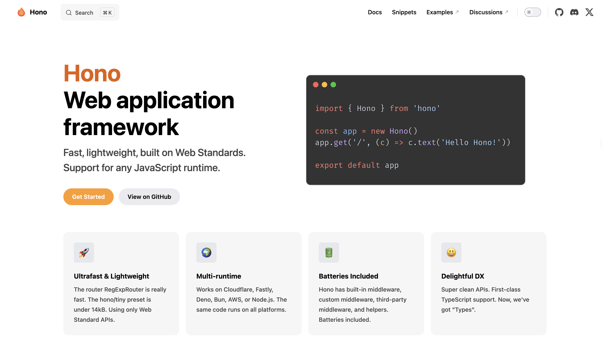
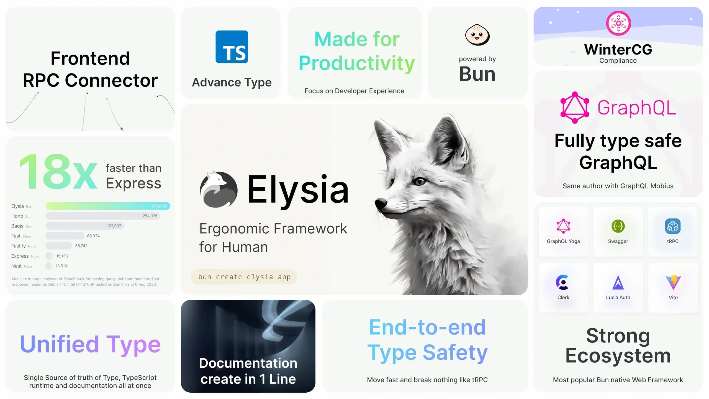

# 面向未来的 Node.js 框架

Express.js 和 Koa.js 等作为 Node.js 领域的经典框架，在过去几年里一直备受青睐。但由于技术的快速发展和社区对更高效、更轻量级解决方案的需求，近些年也涌现出众多新兴且富有活力的 Web 框架作为这些经典框架的替代选择。本文就来分享一些面向未来的 Web 框架解决方案，让你的 Node.js 开发更高效！

## H3
h3 是一个轻量级、可组合的JavaScript服务器框架，专为与各种 JavaScript 运行时环境通过适配器协同工作而设计。H3作为Nitro和NuxtJS的核心组成部分，在2023年7月之后被独立提取出来，以专注于其作为高性能HTTP服务器框架的特性。H3 深度集成了 UnJS 生态系统中的 JS 工具，为开发者提供了强大的支持。


NuxtJS（Vue元框架）建立在 Nitro 之上，而 Nitro 则是基于 H3 进行扩展。Nitro 在 H3 的基础上增加了基于文件的路由、资产处理、存储抽象等功能，并根据需要选择性地使用Vite（仅在客户端服务器中需要，静态服务器则不需要）。


h3 的特性如下：

+ **运行时无关**：代码可以在任何 JavaScript 运行时环境中工作，包括 Node.js、Bun、Deno 和 Workers 等。
+ **小巧且高效**：h3核心功能简洁高效，支持现代打包工具的“tree sharking”优化，确保最终打包文件只包含你所需的部分。
+ **高度可组合**：h3允许你根据项目需求轻松扩展服务器功能，确保代码库与项目规模同步增长。
+ **快速路由**：采用unjs/radix3技术实现快速路由匹配，提高服务器响应速度。
+ **强大的UnJS生态系统**：h3建立在功能强大的UnJS生态系统之上，与Nitro、Nuxt等框架无缝集成，为你提供更多可能性。
+ **友好的API**：h3提供简洁优雅的API，让你轻松实现符合Web标准的HTTP处理程序。
+ **良好的兼容性**：h3兼容node/connect/express中间件，确保你的现有代码能够平滑迁移。
+ **类型安全**：h3的代码库完全采用TypeScript编写，提供强类型工具，确保代码质量和稳定性。

****

h3 的基本使用如下：

```javascript
import { createApp, createRouter, defineEventHandler } from "h3";

export const app = createApp();

const router = createRouter();
app.use(router);

router.get(
  "/",
  defineEventHandler((event) => {
    return { message: 'Hello 前端充电宝' };
  }),
);
```

**Github**：[https://github.com/unjs/h3](https://github.com/unjs/h3)

## Hono
Hono 是一个超快的 Web 框架，它可以在任何 JavaScript 运行时上运行，无论是在云端还是在边缘。Hono 最初为 Cloudflare Workers 打造，同时兼容 Node.js。其设计理念是简单、轻量和灵活，提供基本功能如路由、中间件、请求和响应处理等，但不强加任何额外的约束或依赖。Hono 的目标是让开发者能够快速地构建高性能的 Web 应用，而不需要关心底层的细节或平台的差异。



Hono 的特性如下：

+ **极速**：路由极速运行，摒弃了线性循环，确保高效性能。
+ **轻量：**预设体积小巧，仅占用不到 13kB 的空间。Hono 无需任何外部依赖，完全基于 Web 标准 API 构建。
+ **开箱即用**：Hono 提供了内置中间件、自定义中间件以及第三方中间件的支持，开箱即用，无需额外配置。
+ **开发者体验**：简洁直观的 API 设计，为开发者带来愉悦的编程体验。同时，Hono 支持 TypeScript，提供完整的类型定义，让代码更加健壮。
+ **对平台支持**：无缝支持 Cloudflare Workers、Fastly Compute、Deno、Bun、AWS Lambda、Lambda@Edge 和 Node.js 等。


Hono 的语法与 Express.js 类似：

```javascript
import { Hono } from 'hono'

const app = new Hono()

app.get('/', (c) => {
  return c.text('Hello 前端充电宝!')
})

export default app
```

**Github**：[https://github.com/honojs/hono](https://github.com/honojs/hono)

## Hattip
Hattip 是一组用于构建 HTTP 服务器应用程序的 JavaScript 包。它提供了构建现代、通用、模块化且极简的 Web 服务器所需的基础组件和工具。Hattip 的目标是构建一个可在整个 JavaScript 世界中使用的通用中间件生态系统！HatTip 提供类似于 Express.js 的解决方案，但采用了更通用的方法。


Hattip 的特性如下：

+ **现代化**：Hattip 基于当前和未来的 Web 标准进行构建，如 Fetch API 和其他 WinterCG（Web 平台和基础设施社区组）的提案。这使得 Hattip 始终与最新的 Web 技术保持同步，为开发者提供前沿的特性和性能优化。
+ **通用性**：Hattip 可以在各种运行环境中运行，包括 Node.js、边缘计算平台（如 Cloudflare Workers、Fastly Compute 等）、Deno 等。这意味着开发者可以使用相同的代码库来构建在多个平台上运行的 Web 服务，提高代码的复用性和可移植性。
+ **模块化**：Hattip 采用模块化的设计，允许开发者根据需要选择和使用不同的组件和中间件。这种灵活性使得开发者可以轻松地构建符合项目需求的 Web 服务，而无需引入不必要的复杂性或依赖。
+ **极简主义**：Hattip 致力于提供简洁、直观且易于使用的 API 和工具。它只包含开发 Web 服务所需的核心功能，没有冗余的代码或复杂的配置。这使得开发者能够更快地理解和使用 Hattip，同时减少出错的可能性。


**Github**：[https://github.com/hattipjs/hattip](https://github.com/hattipjs/hattip)

## Elysia
Elysia 是一个符合人体工程学的Web框架，用于使用 Bun 构建后端服务器。设计时考虑到简单性和类型安全性，使用熟悉的 API 和对 TypeScript 的广泛支持，专为 Bun 优化。可以在Cloudflare Worker、Vercel Edge Function 以及支持 Web 标准请求的大多数其他运行时上部署 Elysia 服务器。今年 3 月，Elysia 发布了 1.0 版本，基本可以用于生产环境。



Elysia 的基本使用如下：

```javascript
import { Elysia } from 'elysia'

new Elysia()
    .get('/', () => 'Hello 前端充电宝')
    .get('/user/:id', ({ params: { id }}) => id)
    .post('/form', ({ body }) => body)
    .listen(3000)
```

Github：[https://github.com/elysiajs/elysia](https://github.com/elysiajs/elysia)


> 更新: 2024-06-07 17:26:43  
> 原文: <https://www.yuque.com/cuggz/feplus/kgtlsf5whfpy5lzw>