# Cursor

## Cursor 是什么？

Cursor 是一款集成了 AI 技术的强化型代码编辑器，作为 VS Code 的一个衍生版本，它在继承 VS Code 优势的基础上，全面融入了 AI 功能，从而极大地简化了开发工作流，让编程更加便捷高效！

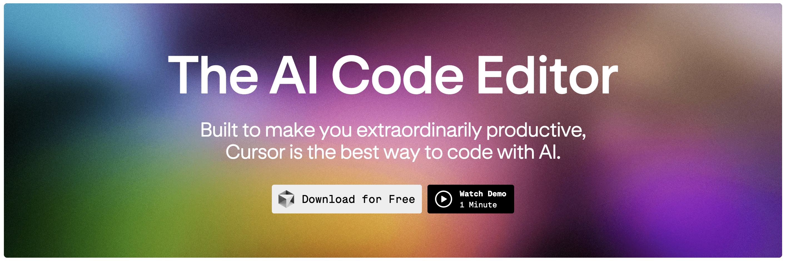

**Cursor 的主要特点**：

* **深度融入编码工作流程**：Cursor 不仅仅局限于提供代码建议或处理重复性任务，它实际上能够深入理解项目。它了解你的编码风格，熟悉你的项目结构，甚至能够捕捉到团队的最佳实践。
* **实时辅助与反馈**：它就像一个实时查看你代码的编程高手，提供建议，捕捉错误，甚至帮助重构代码——这一切都是实时进行的。
* **隐私和安全**：确保代码的隐私和安全，不存储代码，并提供隐私模式及 SOC 2 认证。

下面让我们来深入了解 Cursor 的主要功能，以及它们如何让你的编码体验变得更好。

## Cursor 特色功能

### Tab

Cursor 的 Tab 键非常强大，Cursor 会对代码进行深入分析，并预测你的下一步操作，而不仅仅局限于单行代码补全；它能跨多行提出建议，同时会考虑到最近的更改和整个项目的上下文环境。

#### 下一代代码生成

Cursor 能够**理解你的意图并自动生成所需的代码**，提供智能编辑建议。

#### **高效多行编辑**

Cursor **支持多行编辑，一次性提出多项建议**，提升编程效率与专注度。

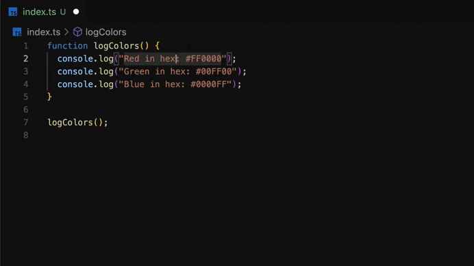

#### **智能代码重构**

**Cursor 支持\*\*\*\*智能修正，能够实时捕捉并修正拼写、语法等错误**，确保代码质量。

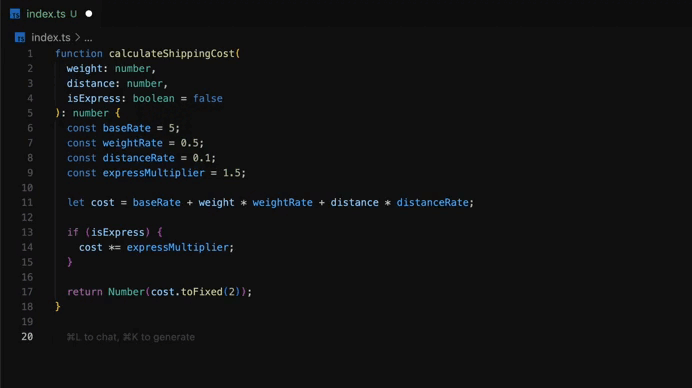

**精准光标预测**

Cursor 还具备**精准光标预测机制，能够预测下一个编辑位置**，提升操作便捷性。

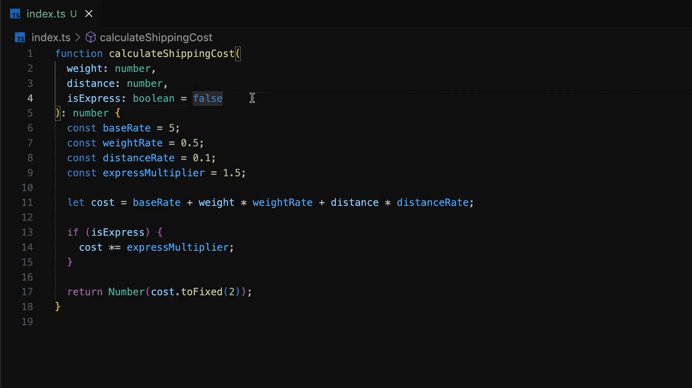

### ⌘ K

Cursor 的 `⌘ K`快捷键也非常强大，让你充分利用 AI 的力量来高效开发！

#### **按需代码生成**

只需描述所需功能，Cursor 便会为你迅速生成代码。从模板代码到复杂算法，Cursor 都能轻松搞定。

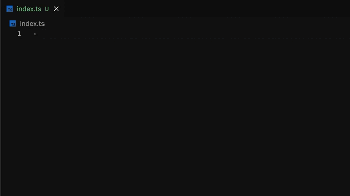

#### **轻松代码编辑**

选中代码，按下`⌘ K`键，指示所需的修改内容，Cursor 就会自动执行并完成这些更改。

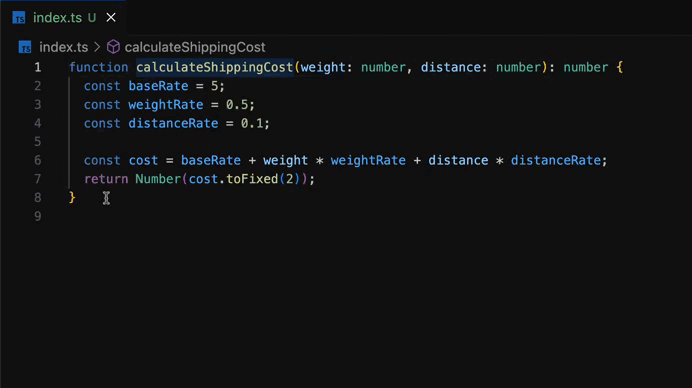

#### 快速提问，即时回答

选择任何代码，按下`⌘ K`键，提出问题，就**可以获得即时的、上下文感知的答案**。

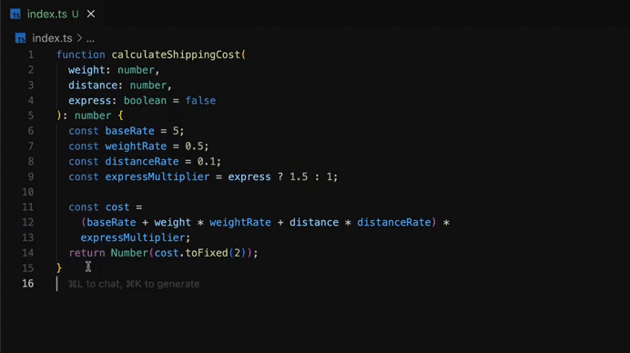

### AI 终端

Cursor 的 AI 魔力不仅限于代码编辑器，它还延伸到了内置终端。在终端中，通过`⌘ K`快捷键，**用户可以用自然语言表述操作需求，Cursor 能够精准转化为相应命令执行**。

举个例子，我们无需记住 `find` 命令语法，仅需输入“查找近24小时内修改的文件”，Cursor 就会自动高效完成任务。

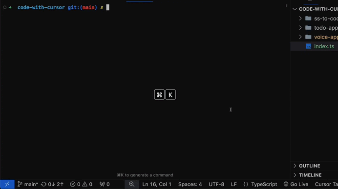

### AI 对话

Cursor 的 AI 对话功能相比传统的 AI 对话（如 ChatGPT ）更智能、便捷！

#### 上下文感知的对话

Cursor 的 AI 对话并不是普通的侧边栏对话窗口，**它能够理解当前所在的文件及光标位置**，

比如，对于不确定的代码，只需询问：“此处是否存在bug？”即可获得基于实际代码的答复。

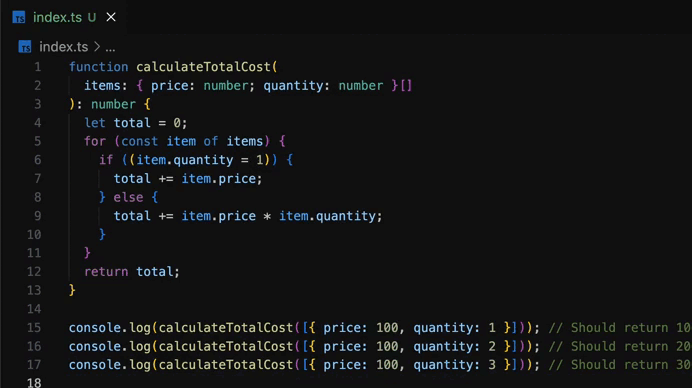

#### 即时代码应用

如果对话窗口中的代码就是你所需要的，无需复制粘贴，只需点击一下即可应用到你的代码中。

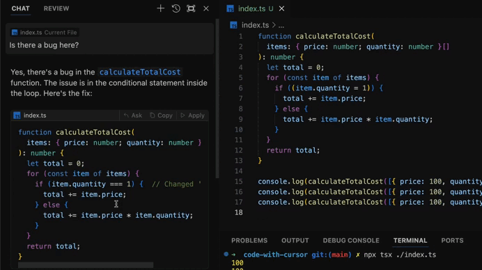

#### 图像支持

有时候，单靠代码来说明想法可能不够清楚。比如，你有一个 UI 设计图或者系统结构图，这些图能更直观地展示你的想法。Cursor 的对话功能允许你直接把这些图拖到聊天框里，它可以理解图片内容。

### Composer

尽管 **Tab**、**AI对话**和\*\*⌘ K\*\*在代码编写与编辑方面表现出色，但 Composer 将这一体验提升至全新境界。

#### **应用生成**

设想一下，只需简单描述一个应用创意，便能见证其逐渐成形。这正是Composer的魔力所在。

无论你是在进行原型设计、构建概念验证，还是复制现有应用，Composer都能在短短几分钟内生成一个功能完备的代码库。它不仅仅是在编写代码，更是在创建完整应用，包括所有必要的导入语句和样板代码。

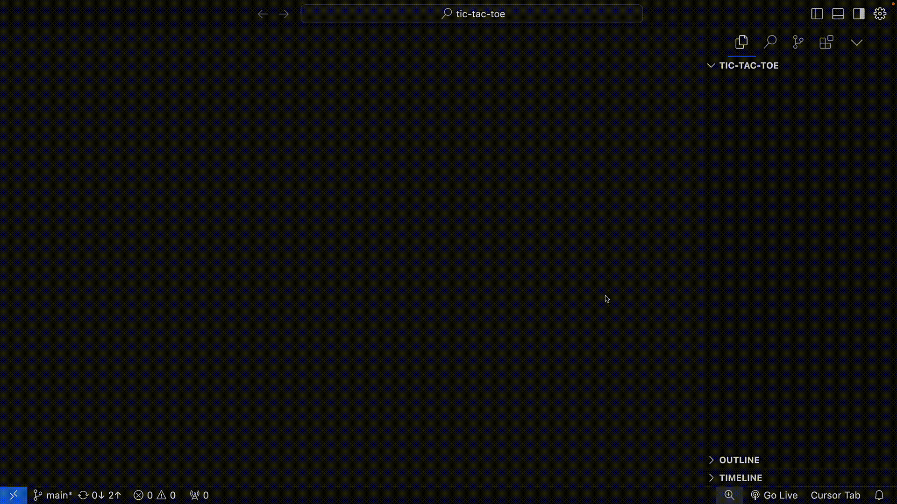

#### 多文件处理能力

CComposer 的功能可不止处理单个文件那么简单，它还能在整个项目里帮你管理各种改动。举个例子来说，当你在开发一个应用，想要把代码库重新整理一下，用上新的库时，Composer 就能大显身手了。它能帮你轻松搞定这些复杂的重构工作。

Composer 提供了两种界面选项：

* **浮动窗口（**⌘**+I）**：一个可移动、可调整大小的窗口，让你在处理其他事务时仍能随时使用Composer，非常适合多任务处理。
* **全屏模式（**⌘**+SHIFT+I）**：当需要全局审视项目时，此模式包含三个面板，提供了一个全面的工作环境。

### AI 上下文感知

Cursor的上下文感知能力是其与其他 AI 编码工具相区别之处。它不仅能看到你正在处理的文件，还能理解整个代码库。这种深刻理解是Cursor众多功能的强大驱动力，使其能够提供更加准确和相关的帮助。

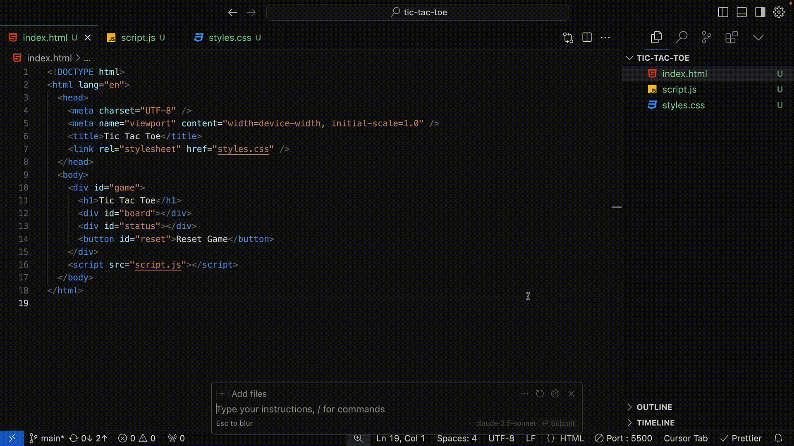

Cursor 使用`@`符号在 AI 交互中引用不同类型的上下文。无论在使用⌘ K、AI 对话还是Composer，`@`符号都能让你快速访问文件、代码片段、文档等更多内容。

常用的 `@` 功能包括：

* **@Files**：引用项目中的整个文件。
* **@Folders**：引用整个文件夹。
* **@Code**：引用代码中的特定部分。
* **@Docs**：访问预先索引的第三方文档或添加自己的文档。
* **@Git**：在Chat中向提示添加git提交、差异或拉取请求。
* **@Codebase**：让Cursor扫描整个代码库以获取上下文。
* **@Web**：让Cursor在互联网上搜索相关信息。
* **@Chat和@Definitions**：在`⌘ K`中，将聊天消息或附近的代码定义作为上下文包含在内。

你甚至可以粘贴以@开头的链接，让Cursor将该网络资源纳入其中。

> 注意：如果希望 让Cursor 保持专注，可以使用`.cursorignore`文件（类似于.gitignore的工作方式）来排除特定文件或目录的索引。

### AI 代码审查

Cursor 就像一位经验丰富的开发者在实时审查你的代码更改，在潜在 bug 进入生产环境之前就将其捕获。开发者可以深入查看每个审查项，在编辑器中查看完整上下文，甚至与 AI 对话以获取更多详细信息。这个功能可以显著提升代码质量，甚至有助于编写更出色的单元测试。

Cursor 还支持自定义 AI 的审查重点——是关注性能优化还是安全 bug？只需告诉 AI 你的需求，它就会相应地调整审查内容。

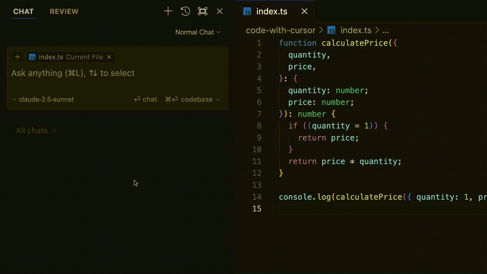

此外，Cursor 还支持选择何时运行代码审查：

* 审查未提交的更改
* 将当前工作与主分支进行比较
* 检查最近的提交

### AI 个性化规则

每个开发者/团队都有自己独特的编码风格、最佳实践以及项目特定的要求。**Cursor 允许将这些偏好直接融入到 AI 的行为中。**

在 \*\*Settings > General > Rules for AI \*\*下，可以添加自定义指令，这些指令将指导Cursor的AI在对话和`⌘ K`等功能中的表现，这确保了 AI 的建议与你的偏好的编码标准保持一致。

为了获得更高的控制权，我们还可以在项目的根目录中使用`.cursorrules`文件，定义项目特定指令，确保 AI 理解每个代码库的独特要求。

### AI 模型

针对不同任务对 AI 能力的不同需求，Cursor提供了多种 AI 模型以供选择：

* **GPT-4o**：以其卓越的智能和理解能力而著称。
* **GPT-4**：在性能上强大，实现了速度与效率的完美结合。
* **Claude 3.5 Sonnet**：以其精细的理解力和创造性输出而受到赞誉。
* **cursor-small**：专为Cursor定制的模型。虽然在智能程度上不及GPT-4，但其响应速度快且使用不受限制，非常适合处理快速任务。

在深入研究庞大的代码库时，Cursor 还提供了**专门设计用于处理长文本上下文的模型**。这些模型能够处理高达20万个tokens的文本，意味着它们能够分析大量代码而不会丢失上下文信息。

### 隐私与安全

Cursor 高度重视数据安全。它提供了**隐私模式**，确保代码始终保留在本地，不会传输至任何外部服务器。这一特性对于处理敏感项目或涉及专有代码的场景至关重要。

## 小结

Cursor 正将 AI 辅助开发提升至新高度，深度理解项目需求、编码风格及开发者个性化要求。随着 AI 技术的进步，Cursor预示着开发者与AI助理界限模糊的高效、创新、强大软件工程时代，其易用性下隐藏着强大功能，是开发环境的组成部分，也是AI助理，更是改变游戏规则的革命性工具。

最后，来看看大家可能更关心的问题：**Cursor 免费吗**？目前，Cursor 提供了免费版本，不过功能有限，部分 AI 功能需要**高级版**（每月20$）和**商业版**（每月40$）才可以使用。

今天的分享到这里就结束了。**你用上 Cursor 了吗？使用体验怎么样？欢迎在评论区留言讨论~**

> 更新: 2024-11-30 15:25:12  
> 原文: <https://www.yuque.com/cuggz/feplus/mrvn0y7guape2qv3>