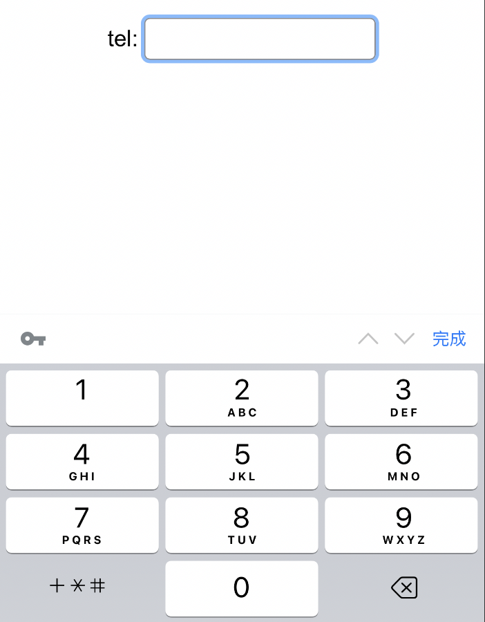
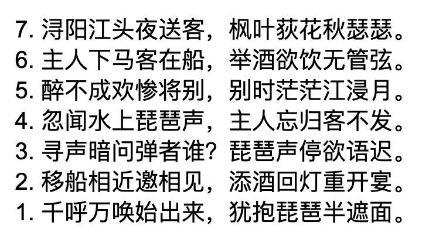
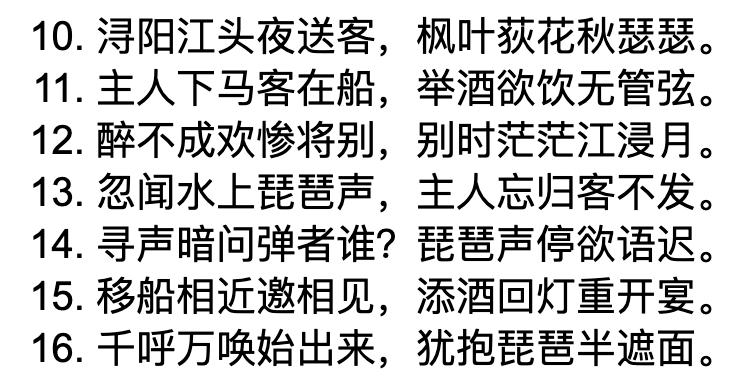
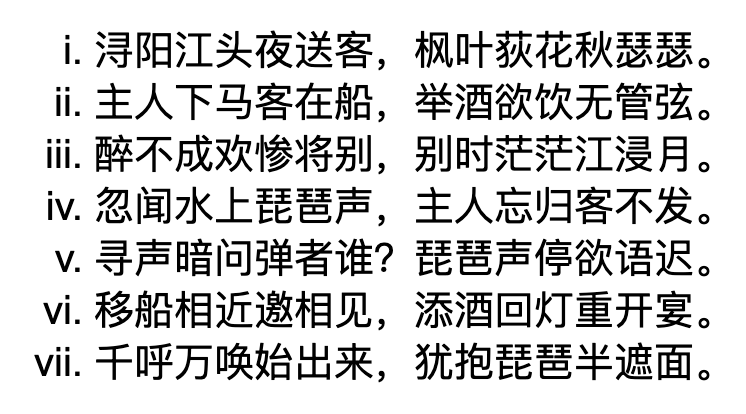
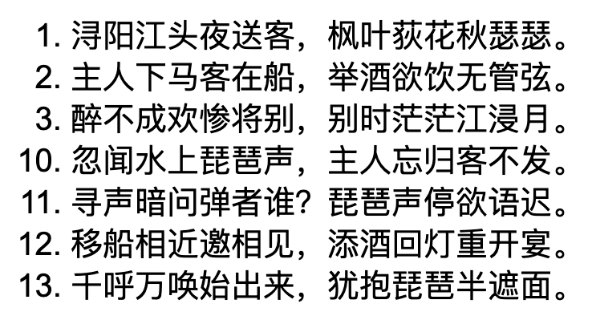
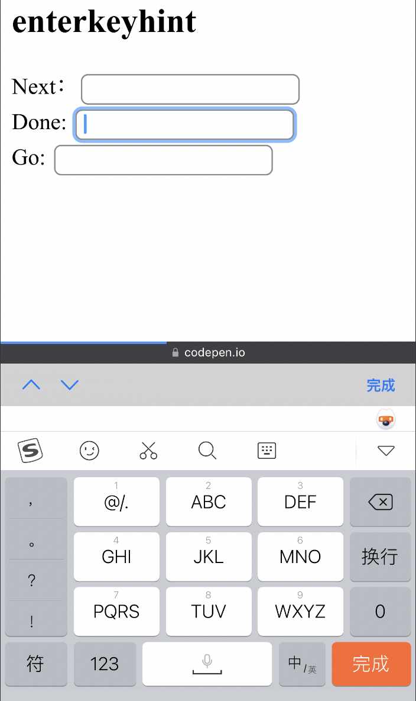
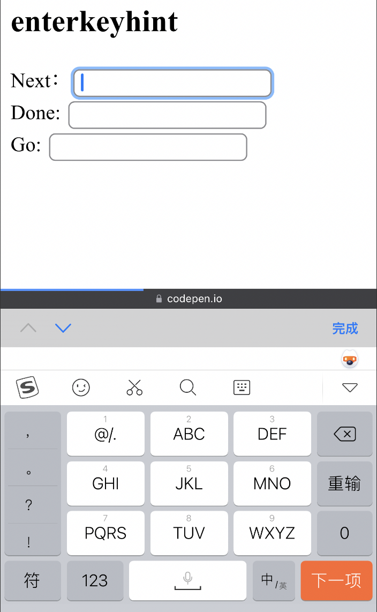

# HTML 属性

## 1. inputmode

`inputmode` 全局属性是一个枚举属性，它提供了用户在编辑元素或其内容时可能输入的数据类型的提示。

```html
<input type="text" inputmode="tel" />
```

该属性可以取以下值：

* \*\*none：\*\*不使用虚拟键盘，这个时候页面需要使用自定义的键盘代替
* \*\*text：\*\*默认值，会显示标准输入键盘
* \*\*decimal：\*\*小数表示键盘，除了数字之外可能会有小数点 . 或者千分符逗号 ,。
* \*\*numeric：\*\*显示0-9的数字键盘。
* \*\*tel：\*\*手机数字键盘，会有星号 \* 或者井号 # 键。
* \*\*search：\*\*提交按钮会显示 'search' 或者 ‘搜索’。
* \*\*email：\*\*键盘上会有 @ 符号键。
* \*\*url：\*\*键盘上会有斜杠 / 符号键。

当我们将 `inputmode` 属性设置为 tel 时，调起的虚拟键盘如下



## 2. multiple

`multiple` 属性可设置或返回是否可有多个选项被选中。该属性可以用于 `input` 或 `select` 标签。

在 `input` 标签中，当指定类型为 `file` 或 `email` 时，可以设置 `multiple` 多选选项。

* 当类型为 `email` 时，输入值为逗号分隔的邮件列表，会从里表中的每个邮件地址中删除所有空格。
* 当类型为 `file` 时，用户可以选择多个文件。

```html
<input type="file" name="img" multiple> 
```

在 select 标签中，当设置了 multiple 属性时，同时可以通过 size 属性来指定可选项的个数：

```html
<select multiple="multiple" size="2"> 
  <option value="1">北京</option>
  <option value="2">上海</option>
  <option value="3">广州</option>
  <option value="4">深圳</option>
</select>
```

## 3. 自定义有序列表的属性

在 `<ol>` 元素可以用于指定有序列表。我们可以通过一些属性来指定列表中的编号行为：

### （1）`reversed`

以相反的顺序对项目进行编号（从高到低）：

```html
<ol reversed>
  <li>浔阳江头夜送客，枫叶荻花秋瑟瑟。</li>
  <li>主人下马客在船，举酒欲饮无管弦。</li>
  <li>醉不成欢惨将别，别时茫茫江浸月。</li>
  <li>忽闻水上琵琶声，主人忘归客不发。</li>
  <li>寻声暗问弹者谁？琵琶声停欲语迟。</li>
  <li>移船相近邀相见，添酒回灯重开宴。</li>
  <li>千呼万唤始出来，犹抱琵琶半遮面。</li>
</ol>
```



这里只有编号会发生变化，并不会影响内容的顺序。

### （2）`start`

定义从哪个数字开始：

```html
<ol start="10">
  <li>浔阳江头夜送客，枫叶荻花秋瑟瑟。</li>
  <li>主人下马客在船，举酒欲饮无管弦。</li>
  <li>醉不成欢惨将别，别时茫茫江浸月。</li>
  <li>忽闻水上琵琶声，主人忘归客不发。</li>
  <li>寻声暗问弹者谁？琵琶声停欲语迟。</li>
  <li>移船相近邀相见，添酒回灯重开宴。</li>
  <li>千呼万唤始出来，犹抱琵琶半遮面。</li>
</ol>
```



### （3）`type`

用于定义是使用数字、字母还是罗马数字。`type` 属性接受表示编号类型的五个单字符值（a、A、i、I、1）之一。

```html
<ol type="i">
  <li>浔阳江头夜送客，枫叶荻花秋瑟瑟。</li>
  <li>主人下马客在船，举酒欲饮无管弦。</li>
  <li>醉不成欢惨将别，别时茫茫江浸月。</li>
  <li>忽闻水上琵琶声，主人忘归客不发。</li>
  <li>寻声暗问弹者谁？琵琶声停欲语迟。</li>
  <li>移船相近邀相见，添酒回灯重开宴。</li>
  <li>千呼万唤始出来，犹抱琵琶半遮面。</li>
</ol>
```



### （4）`value`

用于在特定列表项上指定自定义数字：

```html
<ol>
  <li>浔阳江头夜送客，枫叶荻花秋瑟瑟。</li>
  <li>主人下马客在船，举酒欲饮无管弦。</li>
  <li>醉不成欢惨将别，别时茫茫江浸月。</li>
  <li value="10">忽闻水上琵琶声，主人忘归客不发。</li>
  <li>寻声暗问弹者谁？琵琶声停欲语迟。</li>
  <li>移船相近邀相见，添酒回灯重开宴。</li>
  <li>千呼万唤始出来，犹抱琵琶半遮面。</li>
</ol>
```



## 4. decoding

`` 标签的 `decoding` 属性用于告诉浏览器使用何种方式解析图像数据。

```html

```

该属性可以取以下三个值：

* **sync**: 同步解码图像，保证与其他内容一起显示。
* **async**: 异步解码图像，加快显示其他内容。
* **auto**: 默认模式，表示不偏好解码模式。由浏览器决定哪种方式更适合用户。

此属性类似于在`<script>`上使用 `async` 属性。 加载图像所需的时间不会改变，但其“解码”的方式由解码属性决定。`decoding` 属性可以控制是否允许浏览器尝试异步加载图像。异步加载对 `` 元素很有用，对屏幕外的图像对象可能会更有用。

## 5. loading

`loading` 属性不仅可以用在 `` 元素上，也可以用在 `<iframe>` 元素上，用于触发`<iframe>`网页的懒加载：

```html
<iframe src="/page.html" width="800" height="40" loading="lazy">
```

该属性可以取以下三个值：

* `auto`：浏览器的默认行为，与不使用loading属性效果相同。
* `lazy`：懒加载，即将滚动进入视口时开始加载。
* `eager`：立即加载资源 ，无论在页面上的位置如何。

需要注意，如果`<iframe>`是隐藏的，则`loading`属性无效，将会立即加载。

## 6. form

在大多数情况下，我们会将表单输入和控件嵌套在 `<form>` 元素中。 当然，我们也可以将表单输入放在任何位置，并将其与所属的 `<form>` 元素相关联。只需要使用 form 属性来指定其所属的form表单即可：

```html
<form id="myForm" action="">
  <input id="name">
  <button type="submit">
</form>

<input type="email" form="myForm">
```

可以看到，表单外部的电子邮件 `<input>` 的 `form` 属性设置为 `myForm`，该属性与表单的 `id` 相同。 可以使用此属性和表单的 `id` 将表单控件（包括提交按钮）与任何表单相关联。

## 7. imagesizes 和 imagesrcset

`imagesizes` 和 `imagesrcset` 属性用来预加载响应式图像，可以与 `rel=preload` 以及 `<link>` 元素一起定义，如下所示：

```html
<link rel="preload"
      as="image"
      imagesrcset="images/example-480.png 480w,
                   images/example-800.png 800w,
                   images/example.png 2000w"
      imagesizes="(max-width: 600px) 480px,
                  (max-width: 1000px) 800px,
                  1000px"
      src="images/example.png"
      alt="Example Image">
```

这里使用 `rel=preload` 会通知浏览器希望指定的资源优先加载，因此它们不会被脚本和样式表之类的东西阻塞。 `as` 属性指定所请求内容的类型。

可以使用 `href` 属性以及 `preload` 和 `as` 来预加载常规图像。 还可以使用 `imagesrcset` 和 `imagesizes` 属性来预加载正确的图像，具体取决于视口的大小或在 `imagesizes` 属性中指定的其他媒体功能。

## 8. enterkeyhint

当我们在手机键盘上按下回车键（`enter`）时，在不同的场景下可能执行的操作有所不同，比如换行、发送消息、执行搜索、确认等等。这些操作可以通过 `enterkeyhint` 属性来实现。

`enterkeyhint` 属性是一个全局属性，可应用于将 `contenteditable` 设置为 `true` 的表单控件或元素。 它的用法如下：

```html
<input enterkeyhint="values">
```

它的属性值有以下情况：

* \*\*done：\*\*完成并关闭输入法编辑器。
* \*\*enter：\*\*换行。
* \*\*go：\*\*输入完并继续下一个表单。
* \*\*search：\*\*输入后搜索内容。
* \*\*send：\*\*发送消息。
* \*\*next：\*\*将把用户带到下一个接受文本的字段。
* \*\*previous：\*\*将用户带到将接受文本的上一个字段。

```html
Next：<input type="text" enterkeyhint="next">
Done: <input type="text" enterkeyhint="done">
  Go: <input type="text" enterkeyhint="go">
```

在手机键盘中进行输入时，可以看到键盘的 enter 键显示不同的操作：






> 更新: 2022-08-29 10:50:17  
> 原文: <https://www.yuque.com/cuggz/feplus/yev7hp>