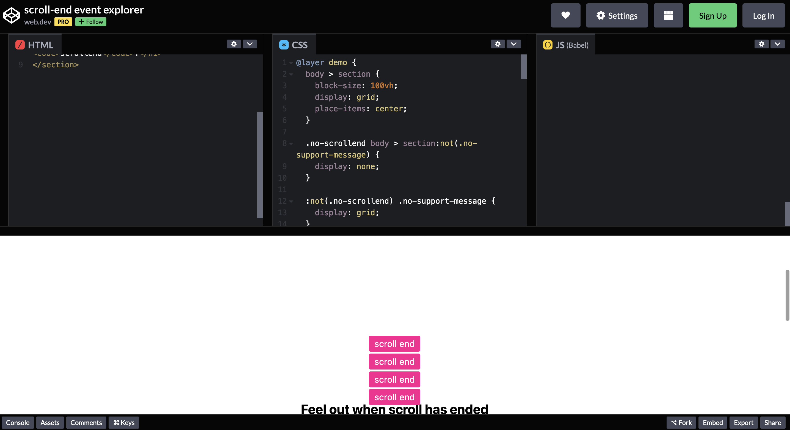
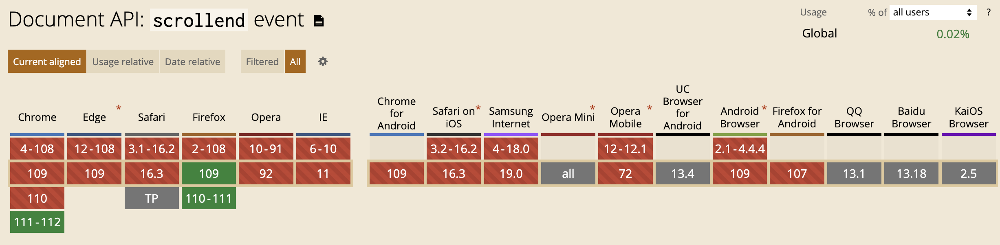

# Scrollend：超实用的全新JavaScript事件

在开发中，可能会遇到**当页面滚动停止之后执行某些操作的需求**。在 `scrollend` 事件之前，并没有可靠的方法来检测页面滚动是否完成。这意味着事件会延迟触发，或者当用户的手指仍在屏幕上时触发。这种不可靠性导致了错误和用户体验不佳。

## 概述

以前可能会**使用定时器来检测滚动停止**：

```javascript
document.onscroll = event => {
  clearTimeout(window.scrollEndTimer)
  window.scrollEndTimer = setTimeout(callback, 100)
}
```

这个 `setTimeout()` 可以知道滚动是否停止了 100 毫秒。这使它更像是滚动**已暂停事件**，而不是滚动已结束事件。

有了 `scrollend` 事件，浏览器就会帮我们完成滚动停止的监听：

```javascript
document.onscrollend = event => {…}
```

可以在 Codepen 查看示例：<https://codepen.io/web-dot-dev/pen/rNrJRKg>，当滚动停止时会有提示。核心代码如下：

```css
document.onscrollend = event => {
  Toast('scroll end')
}
```



## 使用

`scrollend` 事件会在以下情况被触发：

* <font style="color:rgb(32, 33, 36);">用户的触摸已被释放；</font>
* <font style="color:rgb(32, 33, 36);">用户的指针已释放滚动条；</font>
* <font style="color:rgb(32, 33, 36);">用户的按键已被释放；</font>
* 滚动到片段已完成；
* 滚动捕捉已完成；
* `scrollTo()`已完成；
* 用户已滚动视觉视口。

`scrollend` 事件在以下情况不会触发：

* 用户的手势没有导致任何滚动位置变化；
* `scrollTo()` 没有产生任何移动。

这个事件花了很长时间才出现在 Web 平台上的一个原因就是有许多小细节需要进行规范。最复杂的就是视觉视口与文档的滚动结束细节。对于放大的网页，在此缩放状态下，可以四处滚动，但不一定是在滚动文档。不过，即使是这个视觉视口用户驱动的滚动交互也会在完成后发出 `scrollend` 事件。

与其他滚动事件一样，可以通过多种方式注册侦听器：

```javascript
addEventListener("scrollend", (event) => {
  // scroll ended
});

aScrollingElement.addEventListener("scrollend", (event) => {
  // scroll ended
});
```

也可以使用事件属性：

```javascript
document.onscrollend = (event) => {
  // scroll ended
};

aScrollingElement.onscrollend = (event) => {
  // scroll ended
};
```

## 浏览器支持

目前仅 Firefox 109 版本支持 `scrollend` 事件。不久的将来，Chrome 111 版本也将支持该事件。



如果现在想使用这个事件，可以在开始时检查支持情况，如果不支持该事件就继续使用当前的滚动结束策略（如果有的话）：

```javascript
if ('onscrollend' in window) {
  document.onscrollend = callback
}
else {
  document.onscroll = event => {
    clearTimeout(window.scrollEndTimer)
    window.scrollEndTimer = setTimeout(callback, 100)
  }
}
```

这样就能在可用时渐进增强 `scrollend` 事件。当然也可以使用 polyfill：<https://github.com/argyleink/scrollyfills>

首先在终端中安装npm包：

```javascript
npm i -D scrollyfills
```

然后在需要的地方使用 `scrollend` 事件：

```javascript
import {scrollend} from 'scrollyfills';

someElementThatScrolls.addEventListener('scrollend', event => {
  console.log('scroll has ended');
});
```

polyfill 将渐进增强以使用浏览器内置的 scrollend 事件（如果可用）。 如果它不可用，脚本会监视指针事件并滚动以对它可能结束的事件进行最佳评估。

> **参考：**<https://developer.chrome.com/blog/scrollend-a-new-javascript-event/>


> 更新: 2023-02-04 21:27:09  
> 原文: <https://www.yuque.com/cuggz/feplus/wpfn8zxdcw44fnba>