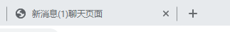
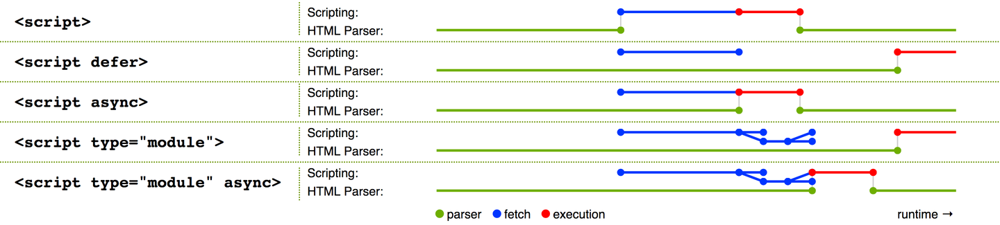
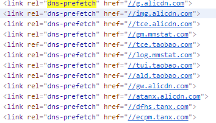
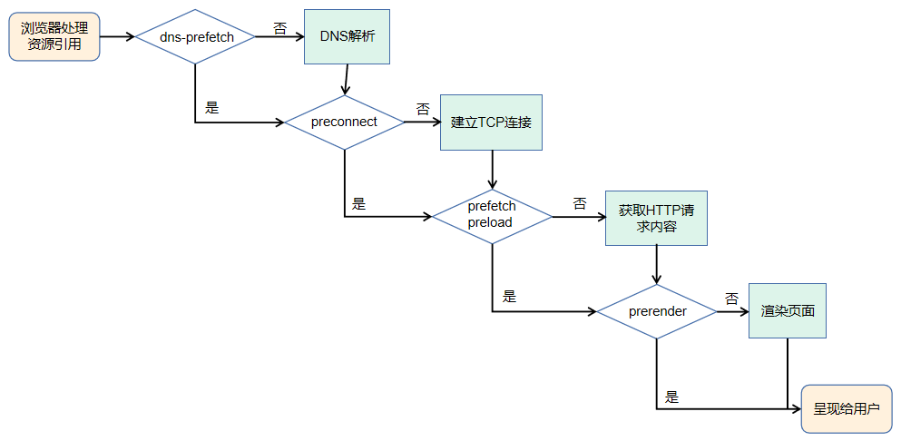
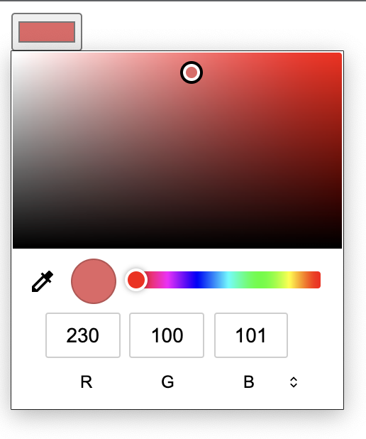

# 你不知道的 HTML

### 1. input 标签：输入验证

我们通常会使用JavaScript来校验表单，比如：

```javascript
function validateForm() {
  const inputText = document.forms["form-name"]["input-name"].value;
  if (!inputText) {
    
  } else {
    
  }
}

```

以上是使用原生JavaScript实现的，现在很多项目都是使用React、Vue等框架来实现，表单校验可能稍微简单一些，这里不在多说，不是重点~

下面来看看HTML提供的原生检验方式：

| **验证内容** | **使用说明** | **示例** |
| :---: | :---: | --- |
| 必填 | 强制必须输入内容 | <font style="color:rgb(9, 9, 9);"><input required="true"></font> |
| 正则 | 按照正则表达式规则校验 | <font style="color:rgb(9, 9, 9);"><input pattern="^1\d{10}$"></font> |
| 类型 | 强制输入内容类型 | <font style="color:rgb(9, 9, 9);"><input type="number"></font><font style="color:rgb(9, 9, 9);"> </font><br/><font style="color:rgb(9, 9, 9);"><input type="email"></font> |
| 大小 | 限制输入数字大小 | <font style="color:rgb(9, 9, 9);"><input type="number" min="0"></font><br/><font style="color:rgb(9, 9, 9);"><input type="number" max="5"></font> |
| 输入间隔 | <font style="color:rgb(0, 0, 0);">规定输入数字的间隔</font> | <font style="color:rgb(9, 9, 9);"><input type="number" step="1" ></font> |

### 2. meta 标签：自动刷新/跳转

假设要实现一个类似 PPT 自动播放的效果，你可能会想到使用 JavaScript 定时器控制页面跳转来实现。但其实有更加简洁的实现方法，比如通过 meta 标签来实现：

```html
<meta http-equiv="Refresh" content="5; URL=page2.html">
```

上面的代码会在 5s 之后自动跳转到同域下的 page2.html 页面。要实现 PPT 自动播放的功能，只需要在每个页面的 meta 标签内设置好下一个页面的地址即可。

另一种场景，比如每隔一分钟就需要刷新页面的大屏幕监控，也可以通过 meta 标签来实现，只需去掉后面的 URL 即可：

```html
<meta http-equiv="Refresh" content="60">
```

可以看到，这样做又方便又快捷，那为什么这种用法比较少见呢？

一方面是因为不少人对 meta 标签用法缺乏深入了解，另一方面也是因为在使用它的时候，刷新和跳转操作是不可取消的，所以对刷新时间间隔或者需要手动取消的，还是推荐使用 JavaScript 定时器来实现。但是，如果只是想实现页面的定时刷新或跳转（比如某些页面缺乏访问权限，在 x 秒后跳回首页这样的场景）建议可以实践下 meta 标签的用法。

### 3. title 标签：消息提醒

消息提醒功能实现比较困难，HTML5 标准发布之前，浏览器没有开放图标闪烁、弹出系统消息之类的接口，只能借助一些 Hack 的手段，比如修改 title 标签来达到类似的效果（HTML5 下可使用 Web Notifications API 弹出系统消息）。

下面代码中，通过定时修改 title 标签内容，模拟了类似消息提醒的闪烁效果：

```javascript
‘let msgNum = 1 // 消息条数
let cnt = 0 // 计数器
const inerval = setInterval(() => {
  cnt = (cnt + 1) % 2
  if(msgNum===0) {
    // 通过DOM修改title
    document.title += `聊天页面`
    clearInterval(interval)
    return
  }
  const prefix = cnt % 2 ? `新消息(${msgNum})` : ''
  document.title = `${prefix}聊天页面`
}, 1000)
```

实现效果如下图所示，可以看到标签名称上有提示文字在闪烁。



通过模拟消息闪烁，可以让用户在浏览其他页面的时候，及时得知服务端返回的消息。

定时修改 title 标签内容，除了用来实现闪烁效果之外，还可以制作其他动画效果，比如文字滚动，但需要注意浏览器会对 title 标签文本进行去空格操作。

动态修改 title 标签的用途不仅在于消息提醒，还可以将一些关键信息显示到标签上（比如下载时的进度、当前操作步骤），从而提升用户体验。

### 4. script 标签：调整加载顺序提升渲染速度

由于浏览器的底层运行机制，渲染引擎在解析 HTML 时，若遇到 script 标签引用文件，则会暂停解析过程，同时通知网络线程加载文件，文件加载后会切换至 JavaScript 引擎来执行对应代码，代码执行完成之后切换至渲染引擎继续渲染页面。

在这一过程中可以看到，页面渲染过程中包含了请求文件以及执行文件的时间，但页面的首次渲染可能并不依赖这些文件，这些请求和执行文件的动作反而延长了用户看到页面的时间，从而降低了用户体验。

为了减少这些时间损耗，可以借助 script 标签的 3 个属性来实现。

* \*\*async 属性：\*\*立即请求文件，但不阻塞渲染引擎，而是文件加载完毕后阻塞渲染引擎并立即执行文件内容。
* \*\*defer 属性：\*\*立即请求文件，但不阻塞渲染引擎，等到解析完 HTML 之后再执行文件内容。
* \*\*HTML5 标准 type 属性：\*\*对应值为“module”。让浏览器按照 ECMA Script 6 标准将文件当作模块进行解析，默认阻塞效果同 defer，也可以配合 async 在请求完成后立即执行。

具体效果可以参看下图：



其中，绿色的线表示执行解析 HTML ，蓝色的线表示请求文件，红色的线表示执行文件。

从图中可以得知，采用 3 种属性都能减少请求文件引起的阻塞时间，只有 defer 属性以及 type="module" 情况下能保证渲染引擎的优先执行，从而减少执行文件内容消耗的时间，让用户更快地看见页面（即使这些页面内容可能并没有完全地显示）。

注意，当渲染引擎解析 HTML 遇到 script 标签引入文件时，会立即进行一次渲染。所以这也就是为什么构建工具会把编译好的引用 JavaScript 代码的 script 标签放入到 body 标签底部，因为当渲染引擎执行到 body 底部时会先将已解析的内容渲染出来，然后再去请求相应的 JavaScript 文件。如果是内联脚本（即不通过 src 属性引用外部脚本文件直接在 HTML 编写 JavaScript 代码的形式），渲染引擎则不会渲染。

### 5. link 标签：通过预处理提升渲染速度

在对大型单页应用进行性能优化时，也许会用到按需懒加载的方式，来加载对应的模块，但如果能合理利用 link 标签的 rel 属性值来进行预加载，就能进一步提升渲染速度。

* **dns-prefetch**：当 link 标签的 rel 属性值为“dns-prefetch”时，浏览器会对某个域名预先进行 DNS 解析并缓存。这样，当浏览器在请求同域名资源的时候，能省去从域名查询 IP 的过程，从而减少时间损耗。下图是淘宝网设置的 DNS 预解析。



* **preconnect**：让浏览器在一个 HTTP 请求正式发给服务器前预先执行一些操作，这包括 DNS 解析、TLS 协商、TCP 握手，通过消除往返延迟来为用户节省时间。
* \*\*prefetch/preload：\*\*两个值都是让浏览器预先下载并缓存某个资源，但不同的是，prefetch 可能会在浏览器忙时被忽略，而 preload 则是一定会被预先下载。
* \*\*prerender：\*\*浏览器不仅会加载资源，还会解析执行页面，进行预渲染。

这几个属性值恰好反映了浏览器获取资源文件的过程，下面是流程图：



### 6. link 标签：减少重复

有时候为了用户访问方便或者出于历史原因，对于同一个页面会有多个网址，又或者存在某些重定向页面，比如：

* https://baidu.com/a.html
* https://baidu.com/detail?id="abcd"

那么在这些页面中可以这样设置：

```javascript
<link href="https://baidu.com/a.html" rel="canonical">
```

这样可以让搜索引擎避免花费时间抓取重复网页。不过需要注意的是，它还有个限制条件，那就是指向的网站不允许跨域。

当然，要合并网址还有其他的方式，比如使用站点地图，或者在 HTTP 请求响应头部添加 rel="canonical"。

### 7. <font style="color:rgb(63, 63, 63);background-color:rgb(253, 252, 248);">pre 标签：预格式化文本</font>

pre 元素可定义预格式化的文本。被包围在 pre 元素中的文本通常会保留空格和换行符。被pre标签包裹的文本会呈现为等宽字体。<font style="color:rgb(0, 0, 0);background-color:rgb(253, 252, 248);">pre 标签的一个常见应用就是用来展示源代码。</font>

pre标签放入以下内容：

```javascript
<pre>
    &lt;html&gt;
        &lt;head&gt;
             &lt;script type=&quot;text/javascript&quot; src=&quot;loadxmldoc.js&quot;&gt;
             &lt;/script&gt;
        &lt;/head&gt;

        &lt;body&gt;
        &lt;/body&gt;

    &lt;/html&gt;
</pre>
```

最终显示效果如下：

```javascript
<html>
        <head>
             <script type="text/javascript" src="loadxmldoc.js">
             </script>
        </head>

        <body>
        </body>
</html>
```

### 8. figure 标签：标记图片

`<figure>`标签可以用于标记图片，其可以包含一个<figcaption>元素，用来描述图片：

```javascript
<figure>
  
  <figcaption>风景图</figcaption>
</figure>
```


### 9. picture 标签：响应式图像

picture标签可以根据屏幕匹配的不同尺寸显示不同图片，如果没有匹配到或浏览器不支持 picture 属性则使用 img 元素：

```javascript
<picture>
   <source media="(min-width: 968px)" srcset="large_img.jpg">
   <source media="(min-width: 360px)" srcset="small_img.jpg">
   
</picture>
```

该标签一般用于响应式元素，可以让图片资源的调整更加灵活。如果浏览器不支持该属性也会显示`` 元素的的图片。

### 10. oncontextmenu 属性：禁用右键

当我们给某个元素设置oncontextmenu属性时，就会禁用右键点击。如果给body元素设置这个属性，整个页面就会被禁用右键点击：

```javascript
<p oncontextmenu="return false">Hello</p>
<body oncontextmenu="return false">....</body>
```

### 11. input标签：颜色选择器

input标签是支持很多类型的元素，我们可以使将input定义成一个颜色选择器：

```javascript
<input type="color" id="color-picker"  name="color-picker" value="#e66465">
```

可以通过value给颜色选择器设置初始值，也可以通过value属性获取颜色选择器的颜色。



### 12. base 标签：在新标签页打开

我们可以将base元素的target属性设置为\_black，这样当用户单击链接时，它始终会在新选项卡中打开。如果想避免用户无意中离开某个页面，这样做会很有用。

```javascript
<head>
   <base target="_blank">
</head>

<div>
  <a href="https://www.baidu.com/">百度一下</a>
</div>
```

### 13. placeholder 样式

可以使用placeholder属性设置占位符文本：

```css
<input type="text" placeholder="你的名字" />
```

可以使用`::placeholder` CSS 选择器更改占位符文本的样式：

```css
::placeholder {
  color: #210065;
  opacity: 0.7;
  font-size: 16px;
}
```


> 更新: 2022-01-27 16:53:05  
> 原文: <https://www.yuque.com/cuggz/feplus/ebcvgz>