# 前端新人入职必备清单

前端新人入职的第一天通常就是配置环境，熟悉项目。本文就来分享前端新人入职第一天应该如何配置环境，保姆级教程，值得收藏！

> 本文以 Mac 系统为例，使用 Windows 的小伙伴也可以参考！


## 开发环境

### Node.js

通常我们的项目都是依赖Node.js 环境的，所以第一步就来安装 Node.js。

打开 Node.js 官网（**https://nodejs.org/en**），其会自动识别当前的操作系统l类型，直接下载即可。官网提供了两个版本的 Node.js：\*\*LTS（稳定版）\*\*和 **Current（最新版）**，这里建议下载稳定版，新版可能存在一些Bug。

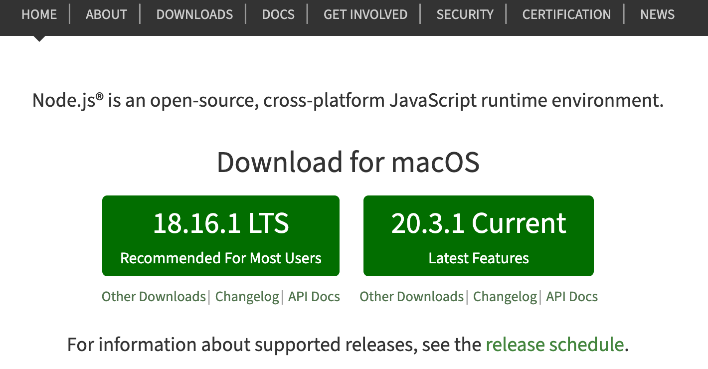

下载完成后之后，按照提示一步步安装即可：

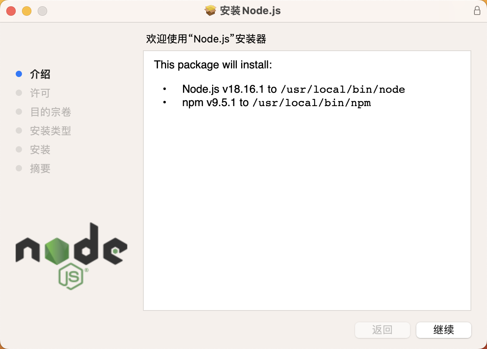

这个安装包含 Node.js 和 Npm。我这里安装的是 Node.js v18.16.1 和 Npm v9.5.1。可以在终端中通过 `node -v` 和 `npm -v`命令来分别查看 Node.js 和 Npm 版本：

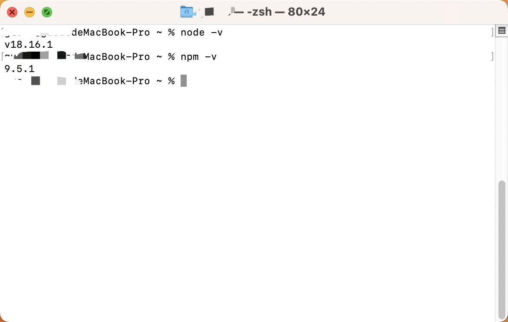

### nvm

不同的项目可能对 Node.js 的版本要求不同，这时我门就需要切换不同版本的 Node.js。我们可以通过 Nvm 来管理Node.js 版本。

> nvm（Node Version Manager）是一个用于管理 Node.js 版本的工具，它被设计成每个用户独立安装，并在每个终端会话中调用。nvm 可以在任何符合 POSIX 标准的 shell（如 sh、dash、ksh、zsh、bash）上运行，特别适用于以下平台：Unix、macOS 和 Windows 的 WSL（Windows Subsystem for Linux）。
>
> nvm 的主要功能是允许用户轻松切换不同版本的 Node.js，并在不同的项目中使用不同的 Node.js 版本。它为每个已安装的 Node.js 版本提供隔离的运行环境，使得用户可以在同一系统上同时使用多个 Node.js 版本而不会相互干扰。

首先在终端中通过以下命令来安装 nvm：

```javascript
curl -o- https://raw.githubusercontent.com/nvm-sh/nvm/v0.38.0/install.sh | bash
```

当我输入该命令后，终端就报错了，报错信息：`curl: (7) Failed to connect to raw.githubusercontent.com port 443 after 5 ms: Couldn't connect to server`，这个报错是因为github 有些域名访问不到，可以通过配置hosts里面的ip域名对应关系解决。

1. 在终端中输入以下命令来打开hosts文件以进行编辑：

```javascript
sudo vim /etc/hosts
```

2. 在文件中追加以下对应关系：

```javascript
199.232.68.133 raw.githubusercontent.com
199.232.68.133 user-images.githubusercontent.com
199.232.68.133 avatars2.githubusercontent.com
199.232.68.133 avatars1.githubusercontent.com
```

如下：

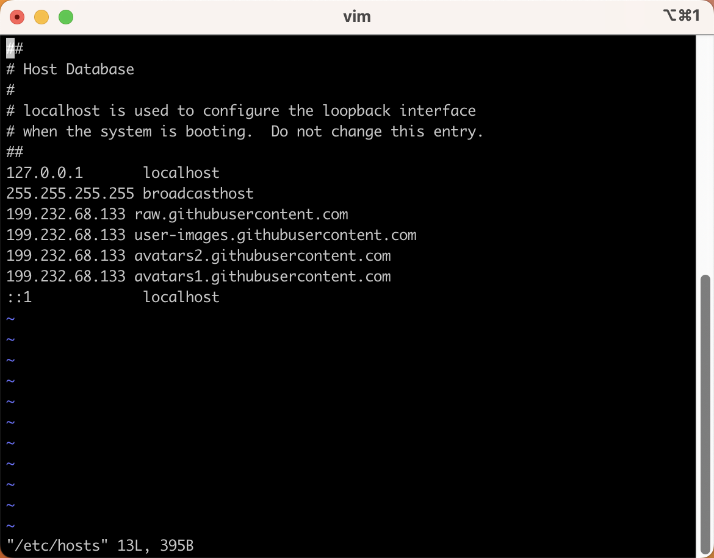

然后按下`ESC`键，输入`:w`来保存即可。这个配置不仅可以解决 nvm 的安装问题，还能使加载不了图片的 GitHub页面恢复正常，homebrew 也能装了。然后再输入上面的命令就可以安装nvm了。

安装完成之后，重新打开终端，输入 nvm，如果出现以下内容就是安装成功了：

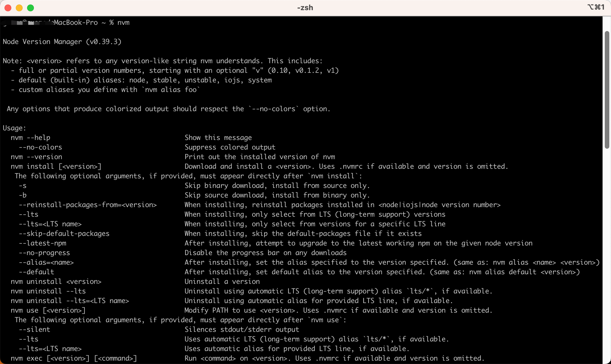

如果报错：`zsh: command not found: nvm`，那就是安装失败了。原因就是电脑缺少 `bash_profile` 文件。该文件位于`/Users/MacUserName/.bash_profile`路径，如果没有就创建一个，通过以下命令来创建：

```javascript
touch .bash_profile
```

然后通过以下命令来打开该文件：

```javascript
open .bash_profile
```

在文件中添加以下内容：

```javascript
export NVM_DIR="$HOME/.nvm"
[ -s "$NVM_DIR/nvm.sh" ] && \. "$NVM_DIR/nvm.sh"  # This loads nvm
[ -s "$NVM_DIR/bash_completion" ] && \. "$NVM_DIR/bash_completion" 
```

保存之后，在终端中输入以下命令来刷新配置：

```javascript
source ~/.bash_profile
```

重新打开终端，输入nvm 来查看：

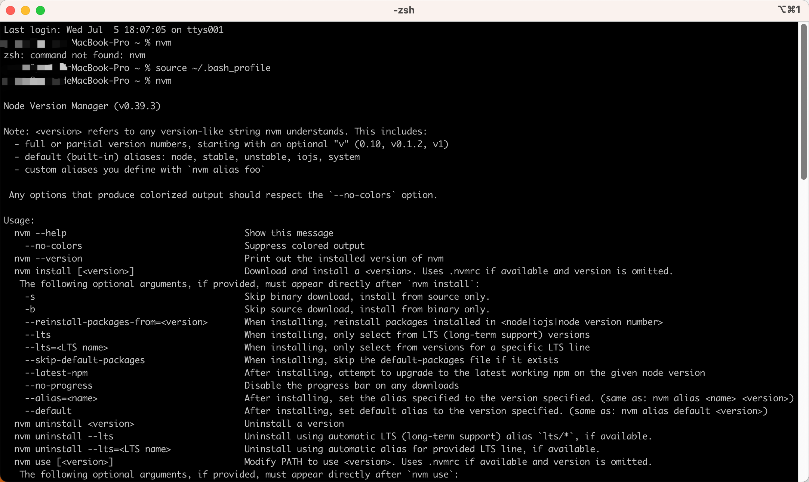

安装成功就可以愉快的玩耍啦，nvm 提供了很多命令管理 Node.js 版本。当输入 nvm 时，也会列出来所有可用的命令，下面来看看常用的 nvm 命令。

1. **安装 Node.js 版本：**
   * 安装最新稳定版的 Node.js：`nvm install stable`
   * 安装指定版本的 Node.js：`nvm install <version>` （例如：`nvm install 14.17.0`）
2. **切换 Node.js 版本：**
   * 切换到已安装的其中一个版本：`nvm use <version>` （例如：`nvm use 14.17.0`）
   * 可以通过简写版本号进行切换（例如 `nvm use 14`），nvm 将自动选择符合的已安装版本。
   * 如果在项目目录中创建了 `.nvmrc` 文件，nvm 在进入该目录时会自动切换到文件中指定的 Node.js 版本。
3. **查看已安装的 Node.js 版本：**
   * 列出已安装的所有版本：`nvm ls`
   * 列出远程可用的所有版本：`nvm ls-remote`
4. **卸载 Node.js 版本：**
   * 卸载指定的 Node.js 版本：`nvm uninstall <version>` （例如：`nvm uninstall 14.17.0`）
5. **设置默认的 Node.js 版本：**
   * 设置默认版本：`nvm alias default <version>` （例如：`nvm alias default 14.17.0`）
   * 这样，在新打开的终端中将自动使用默认版本。
6. **运行 Node.js 命令和 npm：**
   * 在已安装的 Node.js 版本下运行命令：`nvm exec <version> <command>` （例如：`nvm exec 14.17.0 node -v`）
   * 在当前使用的 Node.js 版本下运行命令：`nvm run <command>` （例如：`nvm run node -v`）

### nrm

在开发中，我们通常需要安装很多 npm 包，而默认的 npm 源有时候就可能下载很慢，所以就需要切换 npm 源，nrm 就可以帮助我们管理和切换 nrm 源。其特点如下：

* **管理多个源**：nrm 允许管理多个 npm 源，例如官方源、淘宝源、cnpm 源等。你可以根据需要快速切换不同的源。
* **快速切换**：nrm 提供了快捷的命令来切换 npm 源，无需手动修改配置文件。你可以通过简单的命令在不同的源之间进行切换。
* **测试速度**：nrm 可以测试各个源的响应速度，并给出评分，帮助你选择最快的源来加快依赖包的下载速度。

使用方法：

1. **安装**：首先，需要在全局安装 nrm。在命令行中执行以下命令即可：

```javascript
npm install -g nrm
```

2. **查看可用源**：你可以使用以下命令查看当前可用的源列表：

```javascript
nrm ls
```

3. **切换源**：要切换到某个源，可以使用以下命令：

```javascript
nrm use <源名称>
```

例如，要切换到 taobao 源，可以执行：

```javascript
nrm use taobao
```

4. **测试源的速度**：你可以通过以下命令测试各个源的响应速度：

```javascript
nrm test
```

5. **添加自定义源**：如果你有自定义的源，可以通过以下命令添加：

```javascript
nrm add <源名称> <源地址>
```

例如，添加一个名为 myregistry 的自定义源：

```javascript
nrm add myregistry http://myregistry.com/
```

6. **删除源**：如果要删除已添加的源，可以使用以下命令：

```javascript
nrm del <源名称>
```

> 在安装 nrm 时，我遇到以下报错，这就是说没有安装权限：
>
> 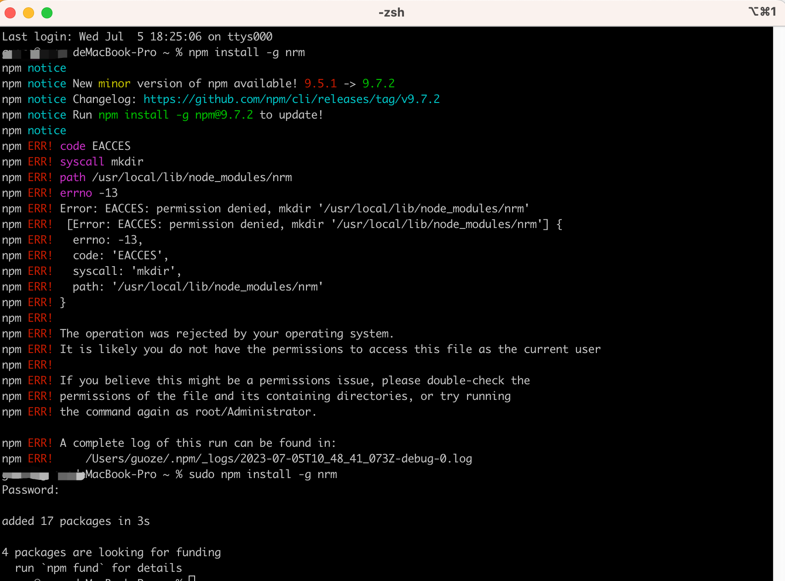
>
> 可以使用管理员权限进行安装，只需要在命令前面增加以一个 sudo，执行 后输入电脑的密码即可。

### Homebrew

Homebrew 是 macOS 上一款常用的包管理工具，用于安装、升级和管理软件包，可以通过它来安装 Git 等。

使用方法如下：

1. **安装**：在终端中执行以下命令来安装 Homebrew：

```plain
/bin/bash -c "$(curl -fsSL https://raw.githubusercontent.com/Homebrew/install/HEAD/install.sh)"
```

2. **安装软件包**：要安装一个软件包，只需在终端中执行以下命令：

```plain
brew install <软件包名称>
```

例如，要安装 wget 软件包，可以执行：

```plain
brew install wget

```

3. **升级软件包**：可以使用以下命令来升级已安装的软件包：

```plain
brew upgrade <软件包名称>
```

例如，要升级所有已安装的软件包，可以执行：

```plain
brew upgrade
```

4. **查找软件包**：如果不确定某个软件包的名称，可以使用以下命令进行模糊搜索：

```plain
brew search <关键词>
```

5. **列出已安装的软件包**：可以使用以下命令列出已经安装的软件包：

```plain
brew list
```

6. **删除软件包**：要删除已安装的软件包，可以执行以下命令：

```plain
Copy Codebrew uninstall <软件包名称>
```

7. **更新 Homebrew**：可以使用以下命令来更新 Homebrew 自身：

```plain
brew update
```

## 开发工具

### IDE

前端开发用的最多的 IDE 就是 Visual Studio Code 和 Webstorm。其中 VS Code 是开源的，完全免费，而Webstorm 是需要付费订阅的。笔者一直在用 VS Code，这里以 VS Code 为例，看看如何安装它。

> Visual Studio Code（简称为 VS Code）是由微软开发的免费、开源且跨平台的代码编辑器，其特点如下：
>
> * **高度可定制**：VS Code 允许用户通过安装插件和主题来自定义编辑器的外观和功能，满足不同用户的需求。
> * **丰富的扩展生态系统**：VS Code 拥有一个庞大的扩展市场，用户可以选择从数千个插件中找到适合自己的工具和功能，例如代码片段、调试器、语法高亮等。
> * **强大的编辑功能**：VS Code 提供了智能代码补全、语法检查、代码导航、重构等强大的编辑功能，提高了开发效率。
> * **内置终端**：VS Code 内置了终端窗口，可以直接在编辑器中执行命令行操作，无需切换到外部终端。
> * **调试支持**：VS Code 内置了调试器，可以方便地进行代码调试和错误排查，支持多种编程语言和调试器插件。
> * **版本控制集成**：VS Code 与 Git 和其他版本控制系统集成紧密，提供了版本控制工具和界面，方便代码管理和协作开发。
> * **可视化编辑**：VS Code 支持以分割视图和并排编辑的方式工作，使得同时编辑多个文件变得更加容易。
> * **跨平台**：VS Code 可以在 Windows、macOS 和 Linux 系统上运行，用户可以在不同的操作系统中享受一致的开发体验。
> * **快速启动和轻量级**：VS Code 启动迅速，占用系统资源相对较少，适合在任何配置的计算机上进行开发。

首先，在 VS Code 官网（**https://code.visualstudio.com/**）下载最新的稳定版：

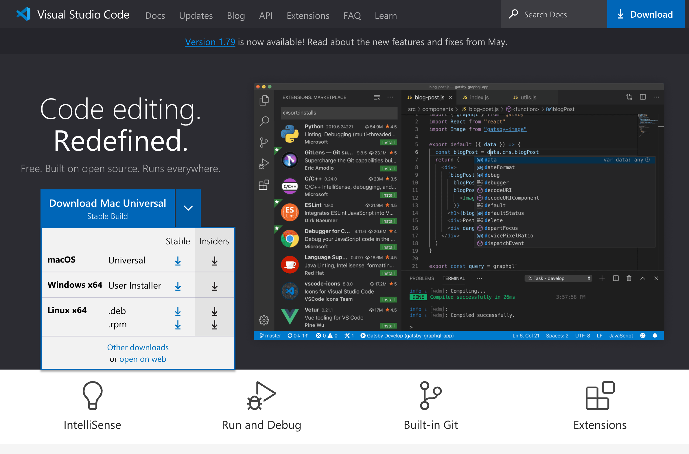

官网会识别我们当前是什么系统，自动选择适合该系统的版本，点击下载即可。当然也可以点击下拉箭头选择需要的版本。

下载的文件，直接解压就可以用了，长这样：

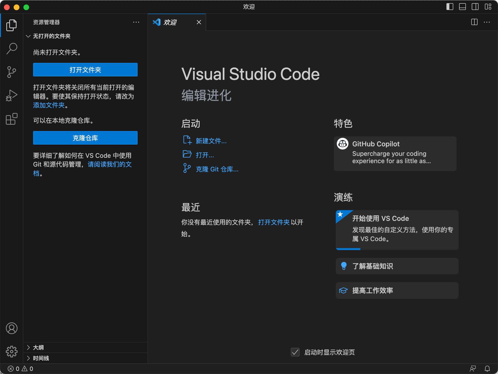

默认是英文版，如果需要中文版，可以在插件市场中下载官方提供的简体中文插件：

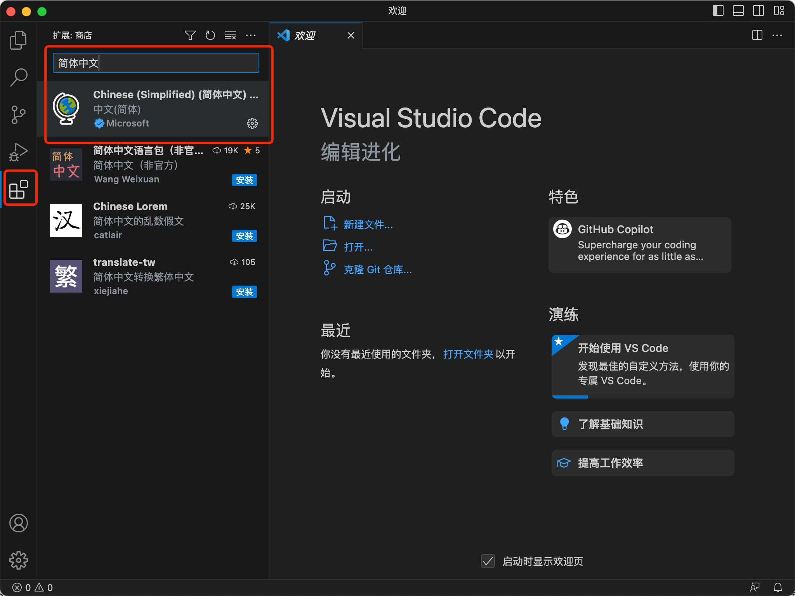

这样，VS Code 就安装完成啦，接下来就可以愉快的 Codeing 啦！

VS Code 的插件市场有很多用于日常开发的高效插件，这里附上之前分享的插件总结，可以按需安装：[2023年最新最全 VSCode 插件推荐！](https://mp.weixin.qq.com/s/3XT3Wv5stDAd27lmw_uvXg)

另外，VS Code 内置了很多快捷键，可以参考这篇文章：[Visual Studio Code 常用快捷键大全](https://mp.weixin.qq.com/s/FdArRhQe01LsAT46uU6C1A)

### 浏览器

前端开发，浏览器当然必不可少啦，笔者最常用的浏览器就是 Chrome，如果需要兼容各个浏览器，可以下载多个。

Chrome 可以在其官网（**https://www.google.cn/chrome/index.html**）下载：


下载完成后，按照提示安装即可。安装完成之后，浏览器的默认搜索引擎是谷歌，如果需要更改，可以在设置中进行配置：


Chrome 也有一个很丰富的插件市场，这里附上之前分享的用于前端开发的高效 Chrome 插件总结：[《推荐50个超实用的 Chrome 扩展，建议收藏！》](https://mp.weixin.qq.com/s/N5IoxsHwJQ37OfmyRpGZUA)

### iTerm2

终端是前端开发中必不可少的工具，个人觉得 iTerm2 是比 Mac 默认终端好用很多的，可定制程度很高。iTerm2 是一款功能强大的终端模拟器，其有如下特点：

* **多标签和分割窗口**：iTerm2 支持多标签和分割窗口，你可以在同一个窗口中打开多个终端会话，并方便地在它们之间切换。
* **自定义外观**：iTerm2 允许根据自己的喜好自定义终端的外观，包括主题、背景图像、字体等。你可以选择预设的主题，或者创建自己的主题。
* **支持多窗口管理**：iTerm2 支持窗口分组和窗口管理，你可以将多个窗口组织在一个窗口组中，并进行集体操作。
* **强大的搜索和历史记录**：iTerm2 提供了高级搜索功能，在终端输出中快速查找和过滤内容。此外，它还保存了完整的命令历史记录，可以随时回溯和搜索之前的命令。
* **集成的 Autocomplete（自动完成）**：iTerm2 内置了命令和路径的自动完成功能，能够节省输入命令的时间和精力。
* **内置的触发器（Triggers）**：iTerm2 具有触发器功能，可以根据输出文本或命令执行特定的操作，例如自动运行脚本、更改颜色等。
* **支持分屏和粘贴历史**：iTerm2 允许你轻松分割窗口，并提供了一个方便的粘贴历史功能，可以查看和复制过去粘贴的内容。
* **可定制的快捷键**：iTerm2 具有丰富的可定制快捷键选项，可以根据个人喜好和使用习惯进行设置。

iTerm2 的安装也很简单，只需要在官网（<https://iterm2.com/downloads.html>）下载安装包，并按照步骤安装即可：

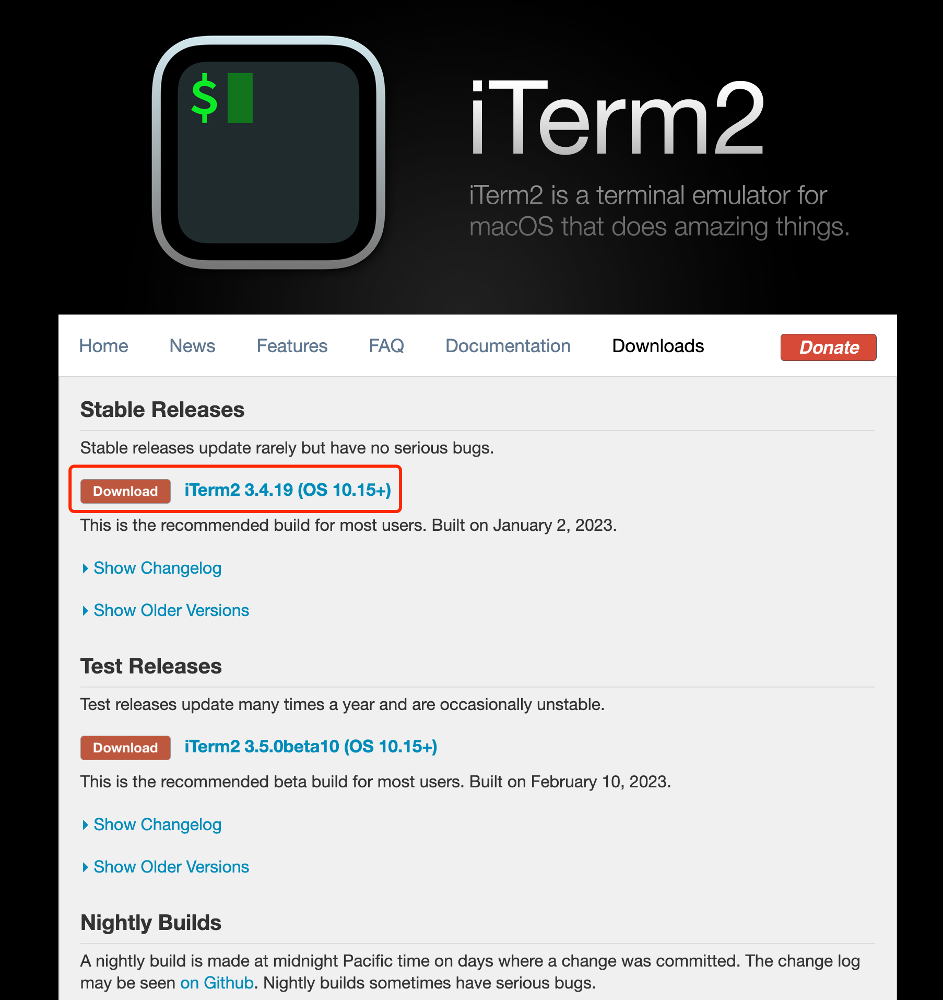

官网提供了两个版本，类似于 Node.js，一个是稳定版，一个是最新的测试版，这里建议下载**稳定版（Stable Release）**，避免使用过程中出现一些不可预测的问题。

这里分享一篇 iTerm2 的保姆级配置教程，可以参考这篇教程并根据自己的需求进行配置：<https://zhuanlan.zhihu.com/p/550022490>

### 版本控制工具

#### Git

目前最常用的代码版本控制工具就是 Git 了。下面就来通过 Homebrew 安装 Git，在终端中输入以下命令即可：

```plain
brew install git
```

安装完成之后，需要设置邮箱和用户：

```plain
git config --global user.name <名字>
git config --global user.email <邮箱>
```

除了上述下载 Git 的方法，Git 官网（**https://git-scm.com/download/mac**）还提供了多种安装 Git 的方法：

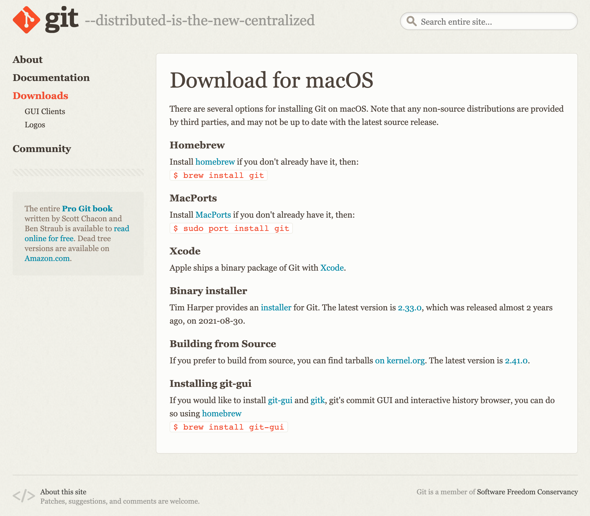

Git 教程：[《学习 Git，看这一篇就够了！》](https://mp.weixin.qq.com/s/Ua-sHxolJ6f2QwTEkQrA0Q)

#### SoucreTree

有了 Git 就可以通过 Git 内置的命令来进行代码操作了，除此之外，我们还可以通过 VS Code 和 SoucreTree 进行可视化 Git 操作。下面就来看看 SoucreTree 是如何安装使用的。

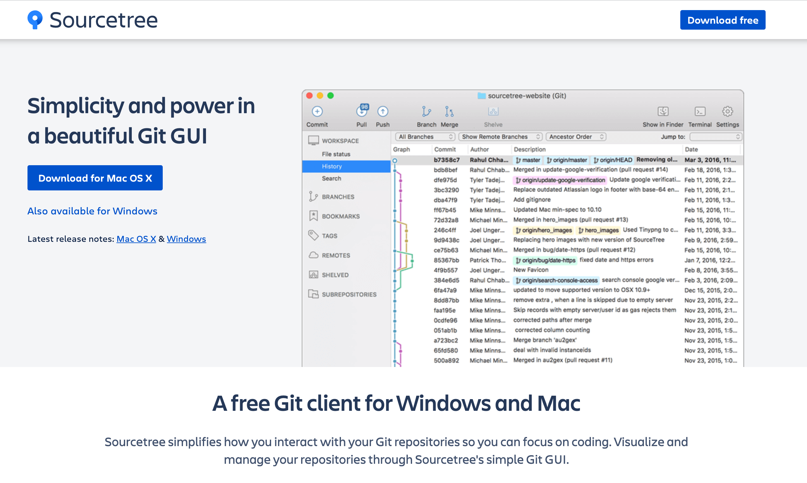

> SourceTree 是一款免费的可视化 Git 和 Mercurial 版本控制工具，提供了直观的界面和强大的功能来帮助开发者更轻松地管理代码仓库，其特点如下：
>
> * **直观易用**：提供了一个直观的图形界面，使得初学者和有经验的开发者都能轻松上手，并能快速进行版本控制操作。
> * **支持多种版本控制系统**：支持 Git 和 Mercurial 两种常用的版本控制系统，可以方便地管理不同类型的代码仓库。
> * **可视化操作**：提供了可视化的文件状态、分支图和提交历史等功能，使得开发者能够清晰地查看和理解代码仓库的状态和变更历史。
> * **强大的分支管理**：提供了简单且强大的分支管理功能，可以轻松创建、切换和合并分支，以及解决分支冲突。

使用方法如下：

1. **下载和安装**：你可以从 SourceTree 官网（**https://www.sourcetreeapp.com/**）下载适用于操作系统的安装包，然后按照安装向导进行安装。
2. **添加代码仓库**：打开 SourceTree 后，点击 "New" 按钮，然后选择 "Clone" 或 "Create"，根据需要添加已有的代码仓库或创建新的代码仓库。
3. **查看和提交代码**：在 "Repositories" 面板中，可以查看代码仓库的文件状态、分支信息和提交历史。在 "Log" 面板中，可以查看详细的提交记录，选择提交进行比较或还原。
4. **创建和切换分支**：在 "Branches" 面板中，可以创建新分支、切换分支和合并分支。还可以使用可视化的分支图来查看和管理分支关系。
5. **解决冲突**：如果出现分支冲突，SourceTree 会提供界面来帮助解决冲突，例如手动合并代码或选择合适的版本。
6. **使用其他工具**：在 SourceTree 中，可以配置并使用喜欢的比较和合并工具，例如 Beyond Compare 或 Kaleidoscope。这些工具可以帮助更方便地进行代码比较和合并操作。

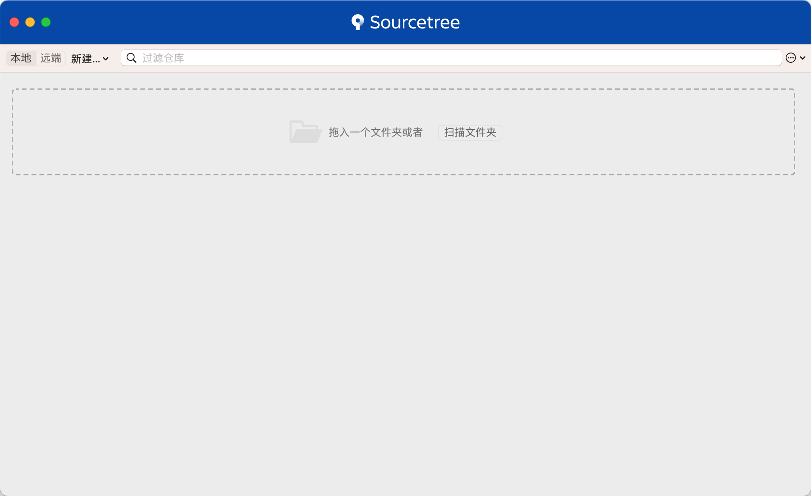

### Charles

Charles 也是笔者日常使用比较多的一个软件，用于代码调试。笔者最常用的就是拿到线上数据，在本地开发环境进行代理调试。

> Charles 是一款常用的网络抓包工具，它允许开发者查看分析网络流量，帮助诊断和调试网络应用程序，其特点如下：
>
> * **抓取和查看网络流量**：Charles 可以捕获电脑和移动设备上的网络流量，包括 HTTP、HTTPS、WebSocket 等协议的请求和响应，并以直观的方式展示给用户。
> * **SSL/TLS 解密**：Charles 可以解密经过 SSL/TLS 加密的网络流量，使得开发者可以查看加密通信的内容，方便调试和分析。
> * **重放请求**：Charles 具备重放请求的功能，开发者可以将先前捕获到的请求重新发送给服务器，用于测试和调试。
> * **模拟慢速网络**：Charles 可以模拟不同类型的网络环境，如低速连接、丢包、延迟等，帮助开发者测试应用程序在不同网络条件下的性能。
> * **可定制性**：Charles 提供了丰富的配置选项和插件机制，可以根据个人需求对其功能进行扩展和定制。
> * **跨平台支持**：Charles 可以在 Windows、macOS 和 Linux 上运行，适用于不同操作系统上的开发和调试需求。

首先在官网（**https://www.charlesproxy.com/latest-release/download.do**）下载最新版 Charles，这里根据自己当前的操作系统选择就好了：

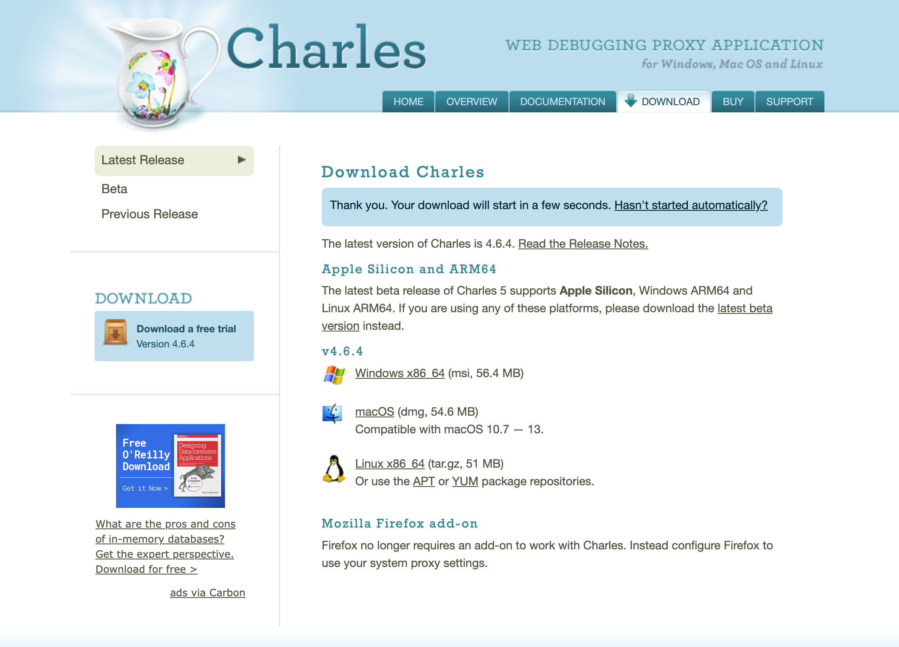

下载完成之后，按照提示一步步安装即可。需要注意的是，这个软件并不是完全免费的，如果未订阅，那每次只能使用 30 分钟就会自动重启。

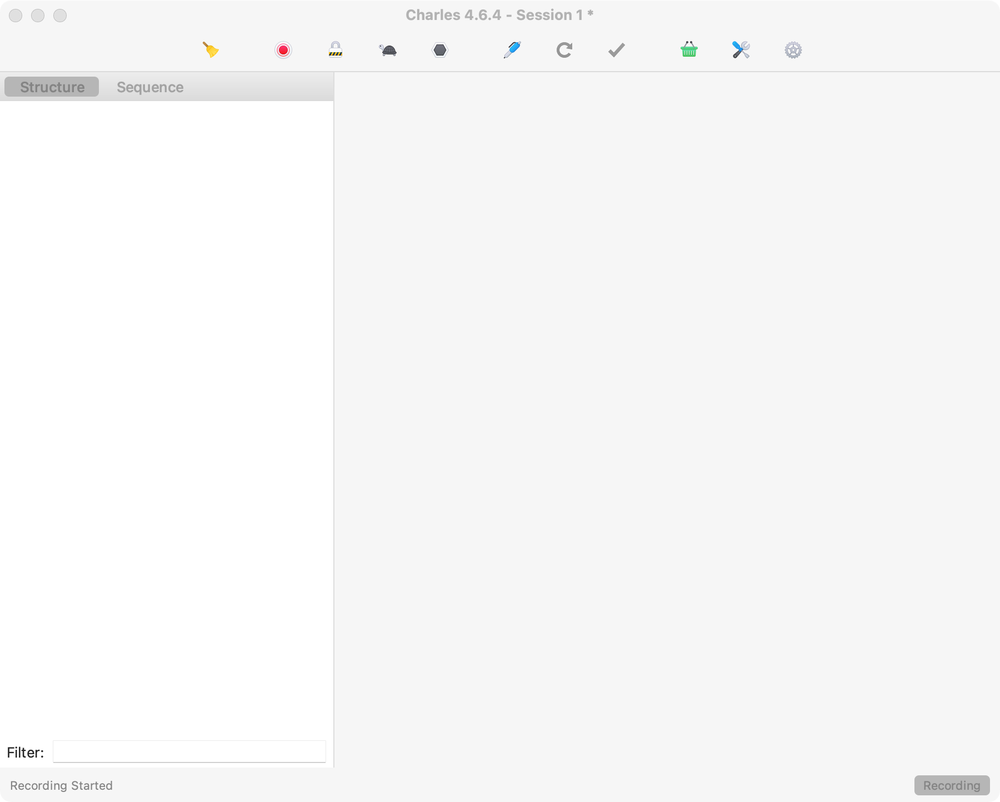

可以参考这两个使用教程：

* <https://juejin.cn/post/6844903665304600589>
* <https://juejin.cn/post/6844903640272994317>

## 其他工具

最后再来分享几个笔者日常使用比较多的软件。

### Draw.io

draw.io 是一款免费的在线图表编辑工具，可以绘制流程图、UML、类图、组织结构图、泳道图、E-R图、思维导图等，堪称画图神器！<font style="color:rgb(0, 0, 0);"></font>

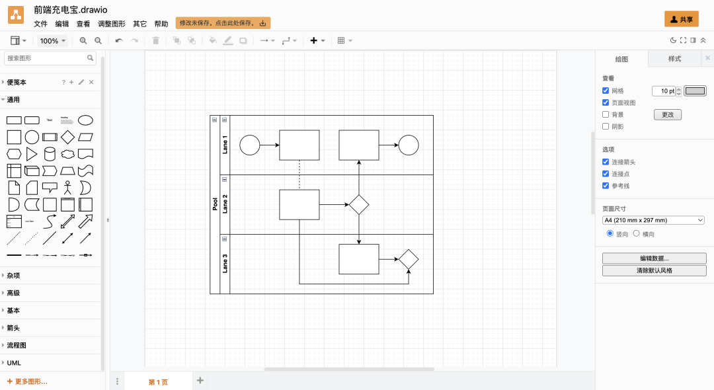

<font style="color:rgb(0, 0, 0);">draw.io 提供了丰富的模版，支持商务、图表、cloud、工程、流程图、布局、地图、网络、软件、表格、UML、Venn等。还可以自定义模板。</font>


<font style="color:rgb(0, 0, 0);">除此之外，draw.io 还有很多特点：</font>

* <font style="color:rgb(1, 1, 1);">支持语言设置为中文；</font>
* <font style="color:rgb(1, 1, 1);">支持使用图层；</font>
* <font style="color:rgb(1, 1, 1);">支持设置手绘风格、自带多种图标，支持自定义图标；</font>
* <font style="color:rgb(1, 1, 1);">支持将图片导出为PNG、JEPG、SVG、PDF、HTML、XML等，支持导出高级设置，如调整DPI、宽高、缩放、背景等。</font>

<font style="color:rgb(0, 0, 0);"></font>

<font style="color:rgb(0, 0, 0);">draw.io 使用和下载：</font>

* **<font style="color:black;">在线地址：</font>**<font style="color:rgb(1, 1, 1);"> </font><font style="color:rgb(1, 1, 1);">https://app.diagrams.net/</font>
* **<font style="color:black;">下载地址：</font>**<font style="color:rgb(1, 1, 1);"> https://github.com/jgraph/drawio/releases</font>

### Xmind

XMind 是一个跨平台的思维导图软件，具有多种结构样式，除了普通的思维导图，还包括树形图、逻辑图、鱼骨图、时间轴、树状表格等等，不同的结构样式可以自由组合混用，同时支持一键更换结构样式。其提供了很多类型的思维导图，并支持设置多种主题风格：


除此之外，Xmind 还有很多特点：

* 可以灵活的定制节点外观、插入图标外，还有多种样式、主题色彩、贴图可以选择，主题颜色和样式同样支持自由组合；
* 除了 XMind 自身的格式，还支持导入 FreeMind、MindManager 等软件的文件格式，支持导出PNG、SVG、PDF、Markdown、Word、Excel 等；
* 支持进行动态演示。

***

\*\*下载地址：\*\*https://xmind.app/download/

### 超级右键

超级右键是一个用于 Mac 的右键增强工具，Mac 不像 Windows 那样可以右键直接创建文件之类的，这个软件就可以帮助我们在某些场景下提高工作效率。在 Appstore 中搜索超级右键，下载即可（专业版是收费的，其他是免费的，可以根据需要选择）：


可以在偏好设置中来根据需要进行设置：

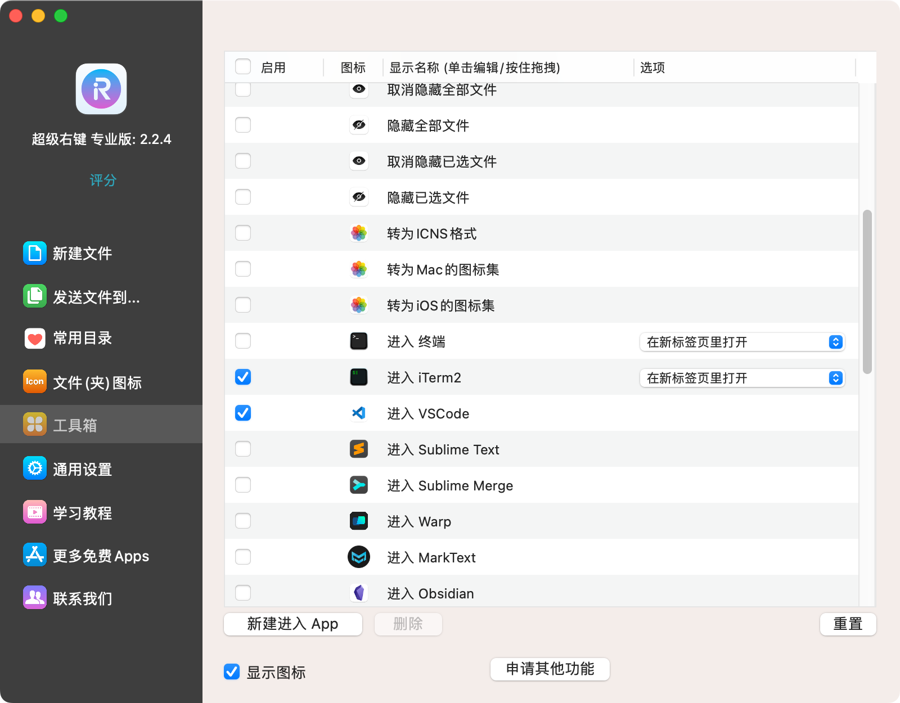

这里我进行了简单的设置，就可以直接右键新建文件了，并且可以直接右键点击一个文件，使用 VS Code 打开，或者在某个目录中直接打开终端等：

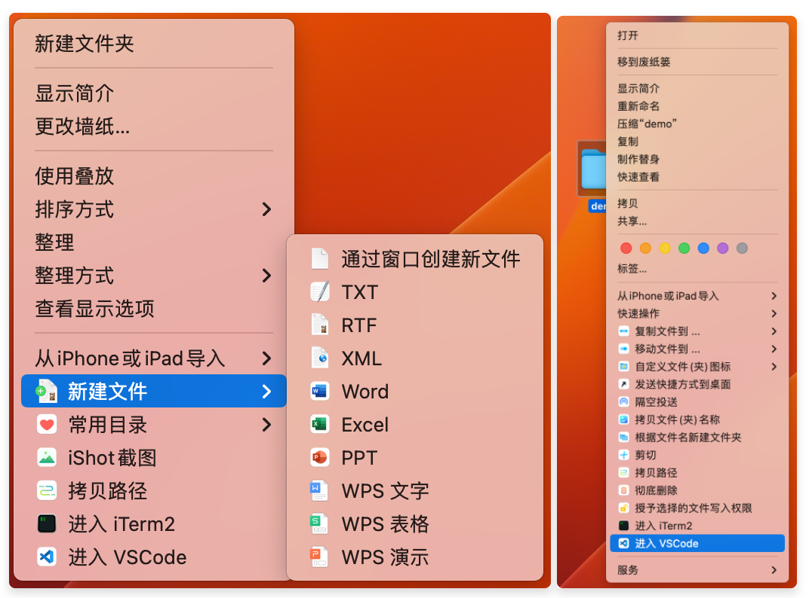


> 更新: 2023-07-17 15:57:56  
> 原文: <https://www.yuque.com/cuggz/feplus/hibyr87a5u6m5vgq>