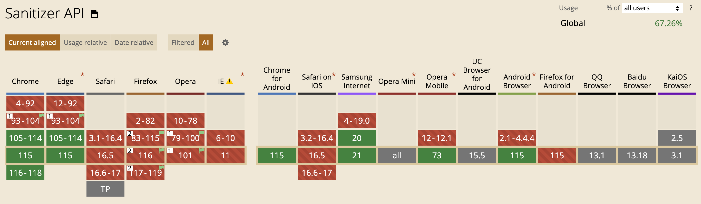

# 安全的渲染HTML字符串

在现代的Web 应用中，动态生成和渲染 HTML 字符串是很常见的需求。然而，不正确地渲染HTML字符串可能会导致安全漏洞，例如跨站脚本攻击（XSS）。为了确保应用的安全性，我们需要采取一些措施来在安全的环境下渲染HTML字符串。本文将介绍一些安全渲染 HTML 字符串的最佳实践，以帮助你有效地避免潜在的安全风险。

> 本文目录：
>
> * 常见渲染方式
>   * HTML
>   * React
>   * Vue
>   * Angular
> * HTML Sanitizer API
>   * 是什么？
>   * 怎么用？
>   * 自定义
>   * 浏览器支持
> * 第三方库
>   * DOMPurify
>   * js-xss
>   * sanitize-html

## 常见渲染方式

首先来看一下如何在 HTML、React、Vue、Angular 中渲染HTML字符串。

### HTML

在HTML中渲染HTML字符串，可以使用原生JavaScript的`innerHTML`属性或者创建元素节点并使用`appendChild()`方法来实现。

1. 使用`innerHTML`属性：可以通过获取要渲染HTML的目标元素，并将HTML字符串赋值给其`innerHTML`属性来渲染HTML字符串。例如：

```html
<div id="targetElement"></div>

<script>
  const htmlString = "<h1>Hello, World!</h1>";
  document.getElementById("targetElement").innerHTML = htmlString;
</script>
```

这将在`<div id="targetElement"></div>`内部渲染出`<h1>Hello, World!</h1>`。

2. 创建元素节点和`appendChild()`方法：可以使用`document.createElement()`方法创建元素节点，并使用`appendChild()`方法将该节点添加到父元素中。例如：

```html
<div id="targetElement"></div>

<script>
  const htmlString = "<h1>Hello, World!</h1>";
  const parentElement = document.getElementById("targetElement");
  const tempElement = document.createElement("div");
  tempElement.innerHTML = htmlString;

  while (tempElement.firstChild) {
    parentElement.appendChild(tempElement.firstChild);
  }
</script>
```

这将在`<div id="targetElement"></div>`内部渲染出`<h1>Hello, World!</h1>`。

### React

可以通过使用`dangerouslySetInnerHTML`属性在 React 中渲染HTML字符串。但是，正如这个属性的名字所言，它存在安全风险，HTML 不会被转义，可能会导致XSS问题，因此请慎重使用。

```javascript
import React from 'react';

const MyComponent = () => {
  const htmlString = '<p>Hello, <strong>React</strong>!</p>';

  return (
    <div dangerouslySetInnerHTML={{ __html: htmlString }} />
);
}

export default MyComponent;
```

这里将要渲染的HTML字符串存储在`htmlString`变量中，并将其传递给`dangerouslySetInnerHTML`属性的`__html`属性。React会将该字符串作为HTML内容插入到被渲染的组件中。

### Vue

可以使用`v-html`指令在Vue中渲染HTML字符串。与在React中使用`dangerouslySetInnerHTML`类似，使用`v-html`时需要格外小心。

```javascript
<template>
  <div v-html="htmlString"></div>
</template>

<script>
export default {
  data() {
    return {
      htmlString: '<p>Hello, <strong>Vue</strong>!</p>',
    };
  },
};
</script>
```

这里将要渲染的HTML字符串存储在`htmlString`中，并通过`v-html`指令将其绑定到需要渲染的元素上（这里是`<div>`）。Vue会将`htmlString`中的字符串解析为HTML，并将其插入到被渲染的元素中。

### Angular

可以使用`[innerHTML]`属性在Angular中渲染 HTML 字符串。

```javascript
<div [innerHTML]="htmlString"></div>
```

这里将要渲染的HTML字符串存储在名为`htmlString`的变量中，并将其绑定到`[innerHTML]`属性上。Angular会将`htmlString`中的字符串解析为HTML，并将其插入到相应的DOM节点中。

与其他框架相似，使用`[innerHTML]`属性绑定时要特别小心。确保渲染的HTML字符串是可靠和安全的，避免直接从用户输入或不受信任的来源获取HTML字符串，以防止XSS攻击等安全问题。

另外，Angular也提供了一些内置的安全机制来帮助保护应用免受安全威胁。例如，通过使用Angular的内置管道（如`DomSanitizer`）对HTML字符串进行转义和验证，可以提高应用的安全性。

```javascript
import { Component } from '@angular/core';
import { DomSanitizer, SafeHtml } from '@angular/platform-browser';

@Component({
  selector: 'app-example',
  template: `
    <div [innerHTML]="getSafeHtml()"></div>
  `,
})
export class ExampleComponent {
  htmlString: string = '<p>Hello, <strong>Angular</strong>!</p>';

  constructor(private sanitizer: DomSanitizer) {}

  getSafeHtml(): SafeHtml {
    return this.sanitizer.bypassSecurityTrustHtml(this.htmlString);
  }
}
```

这里首先导入`DomSanitizer`和`SafeHtml`，这是Angular的内置服务和类型。然后，在组件中使用`DomSanitizer`通过调用`bypassSecurityTrustHtml()`方法对HTML字符串进行转义和验证。最后，将返回的`SafeHtml`对象绑定到`[innerHTML]`属性上，以进行安全的HTML渲染。

通过使用`DomSanitizer`服务，Angular会对HTML字符串进行安全检查，并只允许受信任的内容进行渲染，从而减少潜在的安全风险。

注意，在使用`DomSanitizer`时，确保只对受信任和经过验证的HTML字符串进行操作，并避免直接从用户输入或不受信任的来源获取HTML字符串。这样可以确保应用的安全性，并防止潜在的XSS攻击等安全问题。

## HTML Sanitizer API

从上面的例子中可以看到，在常见的框架以及在HTML中渲染HTML字符串都存在一定的安全风险。当将用户提供的或不受信任的HTML字符串直接渲染到应用中时，可能会导致跨站脚本攻击（XSS）等安全漏洞。因此，在处理和渲染HTML字符串时，需要采取适当的安全措施来防止潜在的安全问题。

那 HTML 中有没有方法可以让我们安全的渲染 HTML 字符串呢？有，它就是 HTML Sanitizer API。不过这个 API 目前仍然是实验性的，在主流浏览器都支持之前，尽量不要在生产环境使用。下面先来看看这个 API 是怎么用的，为未来该 API 普遍可用做准备。

### 是什么？

HTML Sanitizer API 在 2021 年初的草案规范中首次被宣布。它为网站上动态更新的HTML提供原生浏览器支持，可以从中删除恶意代码。可以使用 HTML Sanitizer API 在将不安全的 HTML 字符串和 `Document` 或 `DocumentFragment` 对象插入到 DOM 中之前对其进行清理和净化。

构建独立的 API 来进行清理的主要目标是：

* 减少 Web 应用中跨站脚本攻击的攻击面。
* 保证 HTML 输出在当前用户代理中的安全性。
* 提高清理器的可用性并使其更方便使用。

HTML Sanitizer API 的出现旨在提供一种方便且安全的方式来处理和净化 HTML，以减少潜在的安全风险，并提高用户代理的安全性。

Sanitizer API 带来了一系列新功能，用于字符串的净化过程：

* **用户输入的净化**：该 API 的主要功能是接受并将字符串转换为更安全的形式。这些转换后的字符串不会意外执行 JavaScript，并确保您的应用程序受到跨站脚本攻击的保护。
* **浏览器维护**：此库已预先安装在浏览器中，并将在发现错误或新的攻击向量时进行更新。因此，现在拥有了一个内置的净化器，无需导入任何外部库。
* **安全且简单易用**：将净化操作转移到浏览器中使其更加便捷、安全和快速。由于浏览器已经具有强大而安全的解析器，它知道如何处理 DOM 中的每个活动元素。与浏览器相比，用 JavaScript 开发的外部解析器可能成本较高，并且很快就会过时。

### 怎么用？

使用 Sanitizer API 非常简单，只需使用 `Sanitizer()` 构造函数实例化 `Sanitizer` 类，并配置实例即可。

对于数据的净化，该 API 提供了三个基本方法。让我们看看应该如何以及何时使用它们。

* \*\*使用隐含上下文对字符串进行净化 \*\*

`Element.setHTML()` 用于解析和净化字符串，并立即将其插入到 DOM 中。这适用于已知目标 DOM 元素并且 HTML 内容以字符串形式存在的情况。

```javascript
const $div = document.querySelector('div');
const user_input = `<em>Hello There</em>`;
const sanitizer = new Sanitizer() // Our Sanitizer

$div.setHTML(user_input, sanitizer); // <div><em>Hello There</em></div>
```

这里想将 `user_string` 中的 HTML 插入到 `id` 为 `target` 的目标元素中。也就是说，希望实现得到与 `target.innerHTML = value` 相同的效果，但避免 XSS 风险。

* **使用给定上下文对字符串进行净化**

`Sanitizer.sanitizeFor()` 用于解析、净化和准备字符串，以便稍后添加到 DOM 中。当 HTML 内容以字符串形式存在，并且已知目标 DOM 元素类型（例如 `div`、`span`）时，此方法最适用。

```javascript
const user_input = `<em>Hello There</em>`
const sanitizer = new Sanitizer()

sanitizer.sanitizeFor("div", user_input) // HTMLDivElement <div>
```

`Sanitizer.sanitizeFor()`的第一个参数描述了此结果所用于的节点类型。

在使用 `sanitizeFor()` 方法时，解析 HTML 字符串的结果取决于其所在的上下文/元素。例如，如果将包含 `<td>` 元素的 HTML 字符串插入到 `<table>` 元素中，则是允许的。但如果将其插入到 `<div>` 元素中，它将被移除。因此，在使用 `Sanitizer.sanitizeFor()` 方法时，必须将目标元素的标签指定为参数。

```javascript
sanitizeFor(element, input)
```

这里也可以使用 HTML 元素中的 `.innerHTML` 来获取字符串形式的清理结果。

```javascript
sanitizer.sanitizeFor("div", user_input).innerHTML // <em>Hello There</em>
```

* **使用节点进行净化**

当已经有一个用户可控的 `DocumentFragment` 时，可以使用 `Sanitizer.sanitize()` 方法对 DOM 树节点进行净化。

```javascript
const sanitizer = new Sanitizer()
const $userDiv = ...;
$div.replaceChildren(s.sanitize($userDiv));
```

除此之外，Sanitizer API 还通过删除和过滤属性和标签来修改 HTML 字符串。例如，Sanitizer API：

* 删除某些标签（script、marquee、head、frame、menu、object 等），但保留内容标签。
* 删除大多数属性。只会保留 `<a>` 标签上的 `href` 和 `<td>`、`<th>` 标签上的 `colspans`，其他属性将被删除。
* 过滤可能引起脚本执行的字符串。

### 自定义

默认情况下，Sanitizer 实例仅用于防止 XSS 攻击。但是，在某些情况下，可能需要自定义配置的清理器。接下来，下面来看看如何自定义 Sanitizer API。

如果想创建自定义的清理器配置，只需要创建一个配置对象，并在初始化 Sanitizer API 时将其传递给构造函数即可。

```javascript

const config = {
  allowElements: [],
  blockElements: [],
  dropElements: [],
  allowAttributes: {},
  dropAttributes: {},
  allowCustomElements: true,
  allowComments: true
};
// 清理结果由配置定制
new Sanitizer(config)
```

以下配置参数定义了清理器应如何处理给定元素的净化结果。

* `allowElements`：指定清理器应保留在输入中的元素。
* `blockElements`：指定清理器应从输入中删除但保留其子元素的元素。
* `dropElements`：指定清理器应从输入中删除，包括其子元素在内的元素。

```javascript
const str = `hello <b><i>there</i></b>`

new Sanitizer().sanitizeFor("div", str)
// <div>hello <b><i>there</i></b></div>

new Sanitizer({allowElements: [ "b" ]}).sanitizeFor("div", str)
// <div>hello <b>there</b></div>

new Sanitizer({blockElements: [ "b" ]}).sanitizeFor("div", str)
// <div>hello <i>there</i></div>

new Sanitizer({allowElements: []}).sanitizeFor("div", str)
// <div>hello there</div>
```

使用 `allowAttributes` 和 `dropAttributes` 参数可以定义允许或删除哪个属性。

```javascript
const str = `<span id=foo class=bar style="color: red">hello there</span>`

new Sanitizer().sanitizeFor("div", str)
// <div><span id="foo" class="bar" style="color: red">hello there</span></div>

new Sanitizer({allowAttributes: {"style": ["span"]}}).sanitizeFor("div", str)
// <div><span style="color: red">hello there</span></div>

new Sanitizer({dropAttributes: {"id": ["span"]}}).sanitizeFor("div", str)
// <div><span class="bar" style="color: red">hello there</span></div>
```

`AllowCustomElements` 参数允许或拒绝使用自定义元素。

```javascript
const str = `<elem>hello there</elem>`

new Sanitizer().sanitizeFor("div", str);
// <div></div>

new Sanitizer({ allowCustomElements: true,
                allowElements: ["div", "elem"]
              }).sanitizeFor("div", str);
// <div><elem>hello there</elem></div>
```

注意：如果创建的 `Sanitize`r 没有任何参数且没有明确定义的配置，则将应用默认配置值。

### 浏览器支持

目前，浏览器对 Sanitizer API 的支持有限，并且规范仍在制定中。该 API 仍处于实验阶段，因此在生产中使用之前应关注其变化进展。



## 第三方库

到这里我们就知道了，原生 API 和常用的前端框架都没有提供可用的方式来安全的渲染HTML。在实际的开发中，我们可以借助已有的第三方库来安全的渲染 HTML，下面就来介绍几个常用给的库。

### DOMPurify

DOMPurify 是一款流行的JavaScript库，用于在浏览器环境下进行HTML净化和防止跨站脚本攻击（XSS）。它通过移除恶意代码、过滤危险标签和属性等方式来保护网页免受XSS攻击的威胁。DOMPurify使用了严格的解析和验证策略，并提供了可配置的选项，以便开发人员根据自己的需求进行定制。它可以轻松地集成到现有的Web应用程序中，并且被广泛认为是一种安全可靠的HTML净化解决方案。

可以通过以下步骤来使用 DOMPurify：

1. 首先，安装DOMPurify库。可以通过运行以下命令来安装它：

```bash
npm install dompurify
```

2. 在需要使用的组件文件中，引入DOMPurify库：

```javascript
import DOMPurify from 'dompurify';
```

3. 在组件的适当位置，使用 DOMPurify 来净化HTML字符串，下面以 React 为例：

```javascript
import React from 'react';

const MyComponent = () => {
  const userInput = '<script>alert("XSS");</script><p>Hello, World!</p>';
  const cleanedHtml = DOMPurify.sanitize(userInput);

  return <div dangerouslySetInnerHTML={{ __html: cleanedHtml }}></div>;
};
```

这里通过在React组件的`dangerouslySetInnerHTML`属性中传递净化后的HTML内容来显示安全的HTML。

DOMPurify提供了一些选项和配置，可以使用这些选项来自定义DOMPurify的行为：

```javascript
import DOMPurify from 'dompurify';

// 创建自定义的白名单（允许的标签和属性）
const myCustomWhiteList = DOMPurify.sanitize.defaults.allowedTags.concat(['custom-tag']);
const myCustomAttributes = ['data-custom-attr'];

// 创建自定义选项
const myOptions = {
  ALLOWED_TAGS: myCustomWhiteList,
  ATTRIBUTES: {
    ...DOMPurify.sanitize.defaults.ALLOWED_ATTR,
    'custom-tag': myCustomAttributes,
  },
};

const userInput = '<script>alert("XSS");</script><p>Hello, World!</p><custom-tag data-custom-attr="custom-value">Custom Content</custom-tag>';

const cleanedHtml = DOMPurify.sanitize(userInput, myOptions);

console.log(cleanedHtml);
// 输出: <p>Hello, World!</p><custom-tag data-custom-attr="custom-value">Custom Content</custom-tag>
```

这里定义了一个自定义的白名单`myCustomWhiteList`，包含了DOMPurify默认的允许标签，并添加了一个名为`custom-tag`的自定义标签。我们还定义了一个包含自定义属性`data-custom-attr`的对象`myCustomAttributes`。然后，创建了一个自定义选项`myOptions`，通过覆盖`ALLOWED_TAGS`和`ATTRIBUTES`来应用自定义的白名单和属性规则。最后，使用`DOMPurify.sanitize()`方法，并传入用户输入的HTML和自定义选项`myOptions`，DOMPurify 会根据自定义规则进行过滤和净化。

可以根据需要定义自己的白名单（允许的标签）和属性，并在自定义选项中使用它们来自定义DOMPurify的行为。

### js-xss

js-xss是一个JavaScript库，用于防御和过滤跨站脚本攻击（XSS）。它提供了一组方法和函数，可以净化和转义用户输入的HTML内容，以确保在浏览器环境中呈现的HTML是安全的。

js-xss库使用白名单过滤器的概念来防御XSS攻击。它定义了一组允许的HTML标签和属性，同时还提供了一些选项和配置来定制过滤规则。使用js-xss，可以对用户提交的HTML内容进行净化，删除或转义所有潜在的危险代码，只保留安全的HTML标签和属性。

可以通过以下步骤来使用 js-xss：

1. 安装js-xss库：通过npm或yarn安装js-xss库。

```bash
npm install xss
```

2. 导入js-xss库：在React组件文件中导入js-xss库。

```javascript
import xss from 'xss';
```

3. 使用js-xss过滤HTML内容：在需要过滤HTML的地方，调用js-xss的方法来净化HTML。

```javascript
import React from 'react';
import xss from 'xss';

const MyComponent = () => {
  const userInput = '<script>alert("XSS");</script><p>Hello, World!</p>';
  const cleanedHtml = xss(userInput);

  return <div dangerouslySetInnerHTML={{ __html: cleanedHtml }} />;
};

export default MyComponent;
```

这里在`MyComponent`组件中使用了`dangerouslySetInnerHTML`属性来渲染HTML内容。通过调用`xss()`函数并传入用户输入的HTML，我们可以将其过滤和净化，并将结果设置为组件的内容。

js-xss库提供了一些选项和配置，可以使用这些选项来定义自定义的过滤规则：

```javascript
import xss from 'xss';

// 创建自定义WhiteList过滤规则
const myCustomWhiteList = {
  a: ['href', 'title', 'target'], // 只允许'a'标签的'href', 'title', 'target'属性
  p: [], // 允许空白的'p'标签
  img: ['src', 'alt'], // 只允许'img'标签的'src', 'alt'属性
};

// 创建自定义选项
const myOptions = {
  whiteList: myCustomWhiteList, // 使用自定义的WhiteList过滤规则
};

const userInput = '<script>alert("XSS");</script><p>Hello, World!</p><a href="https://example.com" target="_blank">Example</a>';

const cleanedHtml = xss(userInput, myOptions);

console.log(cleanedHtml);
// 输出: <p>Hello, World!</p><a href="https://example.com" target="_blank">Example</a>
```

这里定义了一个自定义的`WhiteList`过滤规则`myCustomWhiteList`，并将其传递给定义的选项`myOptions`。然后，调用`xss()`函数时传入用户输入的HTML和自定义选项，js-xss库会根据自定义的规则进行过滤和净化。

### <font style="background-color:rgb(244, 246, 248);">sanitize-html</font>

<font style="background-color:rgb(244, 246, 248);">sanitize-html 是一个用于净化和过滤HTML代码的JavaScript库。它被设计用于去除潜在的恶意或不安全的内容，以及保护应用程序免受跨站脚本攻击（XSS）等安全漏洞的影响。它提供了一种简单而灵活的方式来清理用户输入的HTML代码，以确保只有安全的标签、属性和样式保留下来，并且不包含任何恶意代码或潜在的危险内容。</font>

<font style="background-color:rgb(244, 246, 248);"></font>

<font style="background-color:rgb(244, 246, 248);">sanitize-html使用一个白名单（配置选项）来定义允许的标签、属性和样式，并将所有不在白名单内的内容进行过滤和删除。它还可以处理不匹配的标签、标签嵌套问题和其他HTML相关的问题。</font>

可以通过以下步骤来使用 <font style="background-color:rgb(244, 246, 248);">sanitize-html：</font>

1. <font style="background-color:rgb(244, 246, 248);">在项目中安装sanitize-html库：</font>

```bash
npm install sanitize-html
```

2. <font style="background-color:rgb(244, 246, 248);">在组件中引入sanitize-html库：</font>

```javascript
import sanitizeHtml from 'sanitize-html';
```

3. <font style="background-color:rgb(244, 246, 248);">在组件中使用</font><code><font style="background-color:rgb(244, 246, 248);">sanitizeHtml</font></code><font style="background-color:rgb(244, 246, 248);">函数来净化和过滤HTML代码。例如，您以将用户输入的HTML存储在组件的状态或属性中，并在渲染时应用</font><code><font style="background-color:rgb(244, 246, 248);">sanitizeHtml</font></code><font style="background-color:rgb(244, 246, 248);">函数：</font>

```javascript
import React from 'react';
import sanitizeHtml from 'sanitize-html';

function MyComponent() {
  const userInput = '<script>alert("XSS");</script><p>Hello, World!</p>';
  const cleanedHtml = sanitizeHtml(userInput);

  return (
    <div>
      <div dangerouslySetInnerHTML={{ __html: cleanedHtml }}></div>
    </div>
  );
}
```

<font style="background-color:rgb(244, 246, 248);">这里在组件内部定义了用户输入的HTML代码，并使用</font><code><font style="background-color:rgb(244, 246, 248);">sanitizeHtml</font></code><font style="background-color:rgb(244, 246, 248);">函数对其进行净化。然后，使用</font>`dangerouslySetInnerHTML`<font style="background-color:rgb(244, 246, 248);">属性将经过净化的HTML代码渲染到页面上。</font>

<font style="background-color:rgb(244, 246, 248);"></font>

<font style="background-color:rgb(244, 246, 248);">可以使用sanitize-html提供的</font><code><font style="background-color:rgb(244, 246, 248);">sanitize</font></code><font style="background-color:rgb(244, 246, 248);">函数并传递一个配置对象作为参数来自定义sanitize-html的配置，配置对象可以包含一系列选项，用于定义过滤规则和允许的HTML标签和属性等。</font>

```javascript
import sanitizeHtml from 'sanitize-html';

const customConfig = {
  allowedTags: ['b', 'i', 'u'], // 允许的标签
  allowedAttributes: {
    a: ['href'] // 允许的a标签属性
  },
  allowedSchemes: ['http', 'https'], // 允许的URL协议
  allowedClasses: {
    b: ['bold', 'highlight'], // 允许的b标签的class
    i: ['italic'] // 允许的i标签的class
  },
  transformTags: {
    b: 'strong', // 将b标签转换为strong标签
    i: 'em' // 将i标签转换为em标签
  },
  nonTextTags: ['style', 'script', 'textarea', 'noscript'] // 不允许解析的标签
};

const userInput = '<b class="bold">Hello</b> <i class="italic">World</i> <a href="https://example.com">Link</a>';

const cleanedHtml = sanitizeHtml(userInput, customConfig);
```

<font style="background-color:rgb(244, 246, 248);">这里</font><font style="background-color:rgb(244, 246, 248);">创建了一个名为</font><code><font style="background-color:rgb(244, 246, 248);">customConfig</font></code><font style="background-color:rgb(244, 246, 248);">的配置对象，其中包含了一些自定义的过滤规则和选项。这个配置对象定义了允许的标签、允许的属性、允许的URL协议、允许的CSS类名、标签的转换规则以及不允许解析的标签等。</font>

<font style="background-color:rgb(244, 246, 248);"></font>

<font style="background-color:rgb(244, 246, 248);">然后，将用户输入的HTML代码作为第一个参数传递给</font><code><font style="background-color:rgb(244, 246, 248);">sanitizeHtml</font></code><font style="background-color:rgb(244, 246, 248);">函数，并将</font><code><font style="background-color:rgb(244, 246, 248);">customConfig</font></code><font style="background-color:rgb(244, 246, 248);">作为第二个参数传递。</font><code><font style="background-color:rgb(244, 246, 248);">sanitizeHtml</font></code><font style="background-color:rgb(244, 246, 248);">函数将根据配置对象中定义的规则对HTML代码进行过滤和净化，并返回经过净化后的HTML代码。\ </font>


> 更新: 2024-02-24 16:25:58  
> 原文: <https://www.yuque.com/cuggz/feplus/qszyyedii6672all>