# 盘点 Vue.js 那些有趣的版本名称

不知道你有没有注意到，Vue 在每次新版本发布时，版本号后面都会跟一个英文的版本名称，这些名称都是什么意思呢？本文就来揭秘 Vue.js 那些有趣的版本名称！

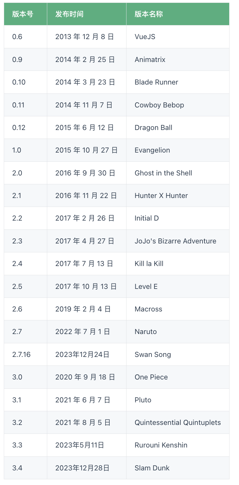

可以看到，Vue.js 版本名称多数来自漫画和动漫，其中大部分属于科幻类。

## Vue.js 0.6：VueJS
2013 年 12 月 8 日，Vue 发布了第一个正式版本 0.6，版本名称为 VueJS。

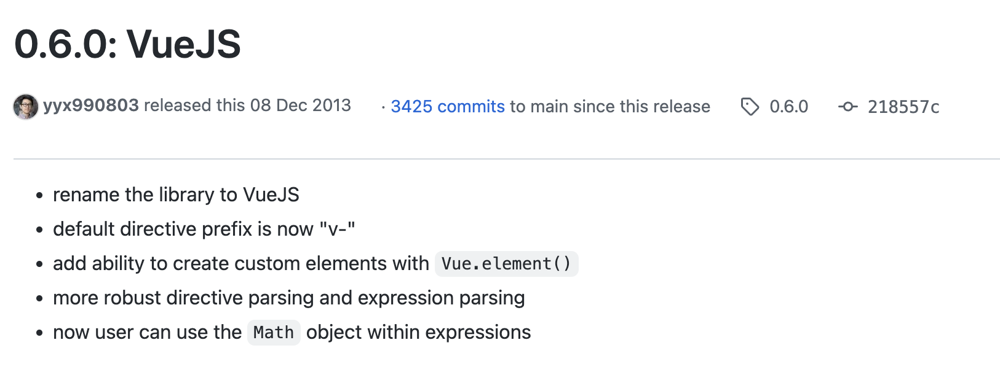

## Vue.js 0.9：Animatrix
2014 年 2 月 25 日，Vue 发布 0.9 版本，版本名称为 Animatrix。

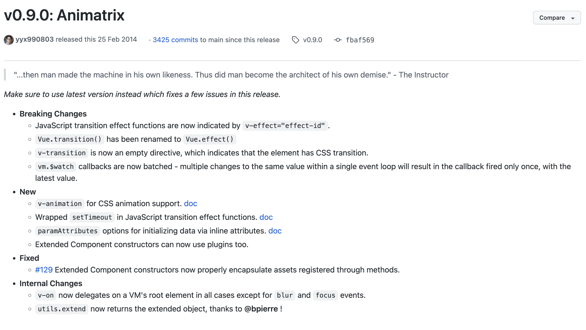

The Animatrix 中文名为**黑客帝国动画版**，它是由美国华纳兄弟出品的一部动画科幻电影。该片共分为九部分，在电影版《黑客帝国》所描绘的虚拟世界的基础之上，对 Matrix的诞生、机器的觉醒以及与人类的最终决战等影片中一笔带过的重大线索，展开了充分的想象。

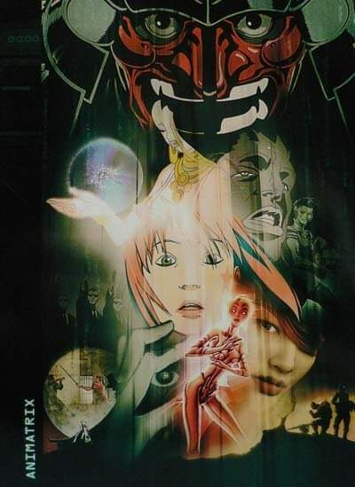

## Vue.js 0.10：**Blade Runner**
2014 年 3 月 23 日，Vue 发布 0.10 版本，版本名称为 Blade Runner。

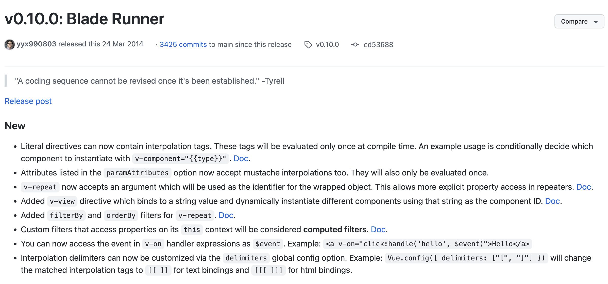

Blade Runner 中文名为**银翼杀手**，它是一部动作科幻电影，影片以2019年的洛杉矶为故事背景，描写一群与人类具有完全相同智能和感觉的复制人，冒险骑劫太空船回到地球，想在其机械能量即将耗尽之前寻求长存的方法。洛杉矶银翼杀手警察派遣精英戴克追踪消灭这些复制人，不料戴克却在行动时碰见美如天仙的女复制人，并且跟她坠入情网。

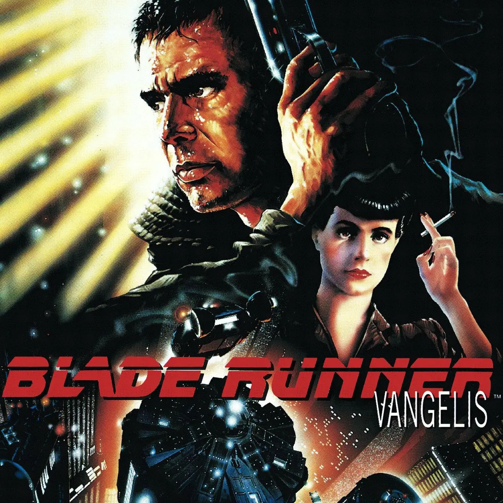

## Vue.js 0.11：**Cowboy Bebop**
2014 年 11 月 7 日，Vue 发布 0.11 版本，版本名称为 Cowboy Bebop。

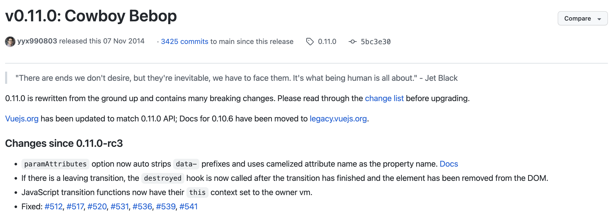

Cowboy Bebop 中文名为**星际牛仔**，它是日本SUNRISE动画公司制作的原创电视动画，被誉为有史以来最伟大的动画电视连续剧之一。该剧剧情设定在 2071 年，讲述了乘坐宇宙飞船 Bebop 的赏金猎人的生活。尽管它融合了多种类型，但该系列主要从科幻、西部和黑色电影中汲取灵感。它最突出的主题是存在主义的厌倦、孤独和无法摆脱过去。

## Vue.js **0.12：Dragon Ball**
2015 年 6 月 12 日，Vue 发布 0.12 版本，版本名称为 Dragon Ball。

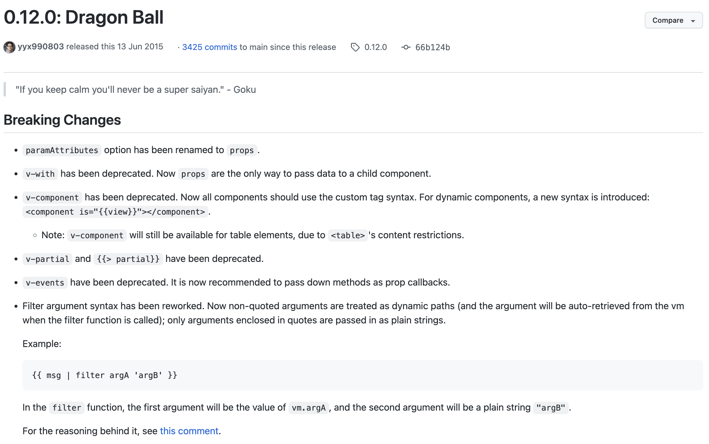

Dragon Ball 中文名为**龙珠**，它是一部讲述了将散落在世界各地的七颗珠子全部集齐后，便可以实现任何一个愿望的秘宝—龙珠，和以主人公孙悟空为中心所展开的关于冒险，努力，热血，友情于一体的长篇漫画，后来该漫画被制作成动画、好莱坞电影、周边产品等。

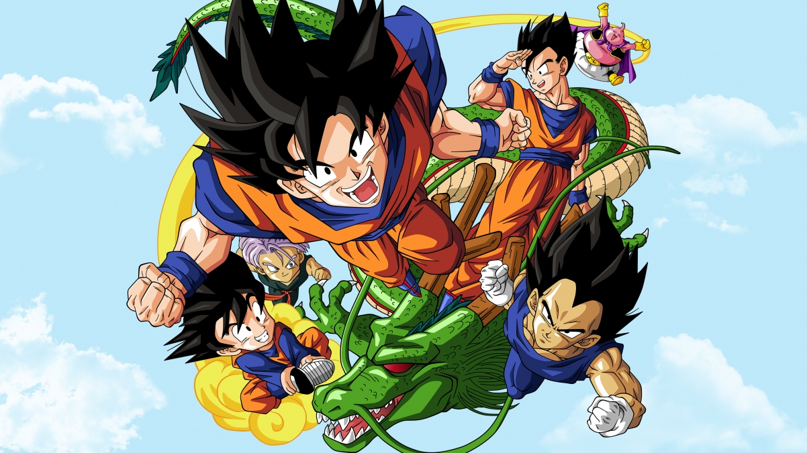

## Vue.js **1.0：Evangelion**
2015 年 10 月 27 日，Vue 发布 1.0 版本，版本名称为 Evangelion。

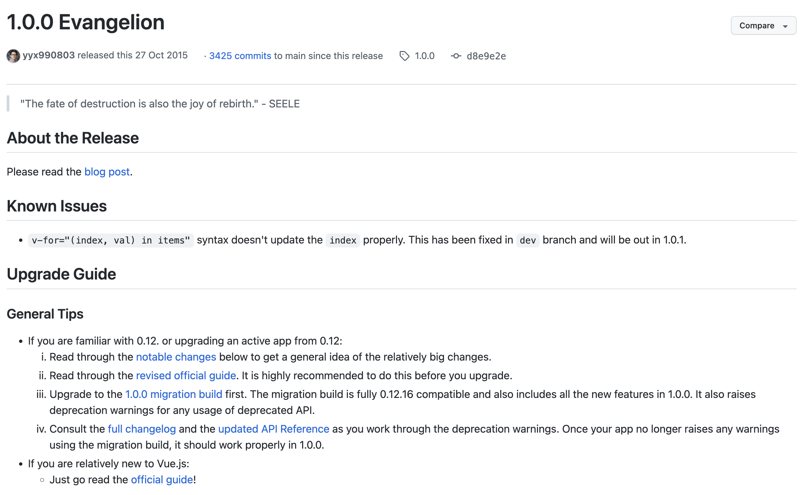

 Evangelion 中文名为**新世纪福音战士，**它是由GAINAX、龙之子工作室共同制作的日本动画作品。作品以发生了“第二次冲击”大灾害的2015年的世界为舞台，主要讲述了14岁少年少女们操控巨大泛用人形决战兵器“EVA”，与袭击第3新东京市的神秘敌人“使徒”之间的战斗故事。

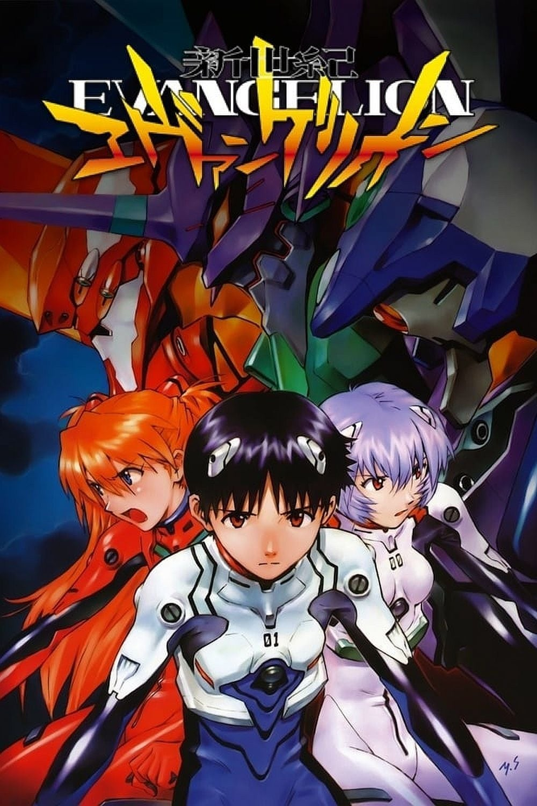

## Vue.js **2.0：Ghost in the Shell**
2016 年 9 月 30 日，Vue 发布 2.0 版本，版本名称为 Ghost in the Shell。

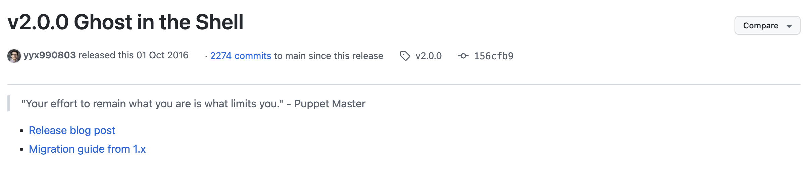

Ghost in the Shell 中文名为**攻壳机动队，**该系列因其赛博朋克并带有反乌托邦性质的世界观著名。作品中对于未来科技有着精密的设想、考据和描绘，很多出现在其中的概念如今已然成为了现实，因此获得了众多硬科幻爱好者们的赞赏，并对后世的许多科幻作品有着显著的影响。

## Vue.js **2.1：Hunter X Hunter**
2016 年 11 月 22 日，Vue 发布 2.1 版本，版本名称为 Hunter X Hunter。

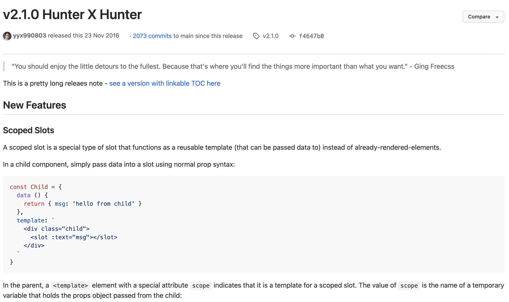

Hunter X Hunter 中文名为**全职猎人**，主人公杰·富力士从小在鲸鱼岛长大，与米特阿姨和阿婆相依为伴。性格开朗的他，有着能与动物沟通的灵性。因为无父无母，杰将米特阿姨当成自己的生母爱着。直到9岁那一年，杰在森林里被一位青年男子搭救。从他口中杰得知自己的父亲还活着而且职业是猎人。在说服米特阿姨之后，杰独自踏上了寻父的征程。于是，杰决定成为猎人，从这里开始找寻他父亲的踪迹。靠这样一种信念开始了冒险旅途，并在旅途当中结交好友，不断成长，从而引发了后面的所有故事，引出猎人的精彩世界。

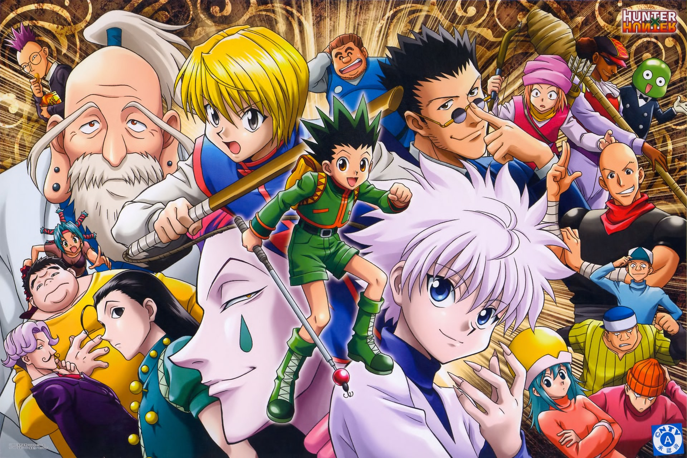

## Vue.js **2.2：Initial D**
2017 年 2 月 26 日，Vue 发布 2.2 版本，版本名称为 Initial D。

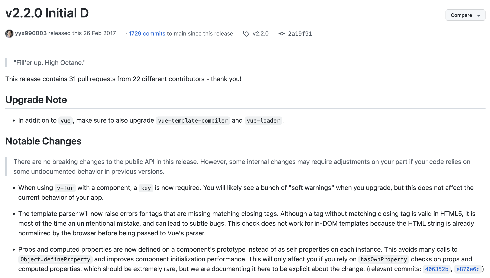

Initial D 中文名为**头文字D**，故事以山道飙车为题材，描写了男主角藤原拓海在自己的高超驾驶技巧被人们发现之后，不断受到许多外地来的车手挑战，因而驾驶父亲藤原文太的爱车AE86开始了公路赛车，后来还与对手高桥凉介和高桥启介组成远征车队Project D，开始征战关东境内各地山路。

## Vue.js **2.3：JoJo's Bizarre Adventure**
2017 年 4 月 27 日，Vue 发布 2.3 版本，版本名称为 JoJo's Bizarre Adventure。

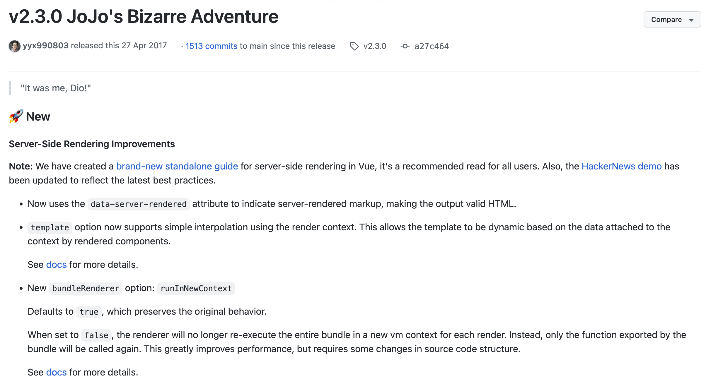

JoJo's Bizarre Adventure 中文名为**JoJo的奇妙冒险，**故事描述英国贵族乔斯达家族（JoJo）与吸血鬼迪奥（DIO）及其后继者间长达百年以上的对决，全篇作品以“歌颂人类”为主题，故事中有着伙伴之间的羁绊、与强大的敌人战斗等少年漫画的经典元素，由其独特的画风和表现形式构成不可思议的独特世界。

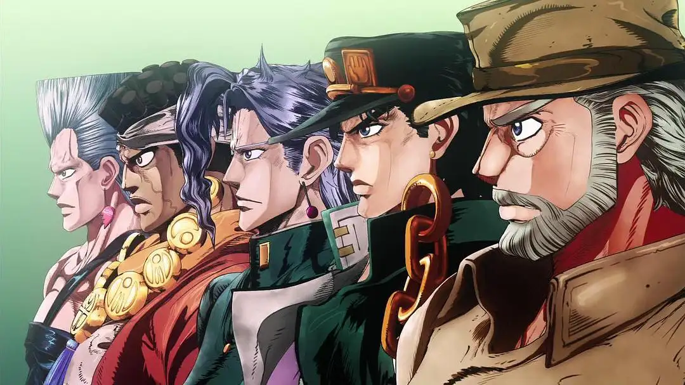

## Vue.js **2.4：Kill la Kill**
2017 年 7 月 13 日，Vue 发布 2.4 版本，版本名称为 Kill la Kill。

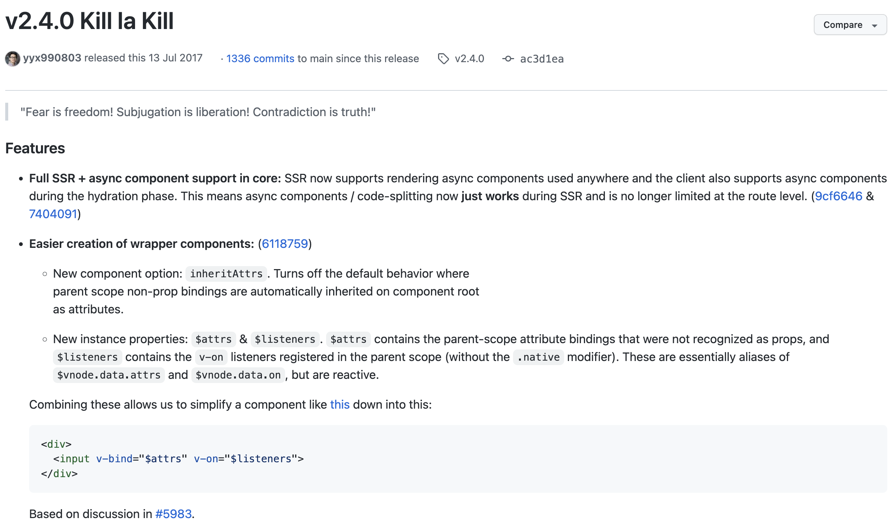

Kill la Kill 中文名为**斩服少女**，它是由中岛一基创作，今石洋之执导的热血奇幻原创电视动画。动画以武力和恐怖支配的本能字学园为舞台，讲述了少女缠流子为寻找父亲仇敌，作为转校生来到本能字学园，与主要支配着该学园重要势力方的学生会会长鬼龙院皐月和学生会四大天王们战斗的故事。

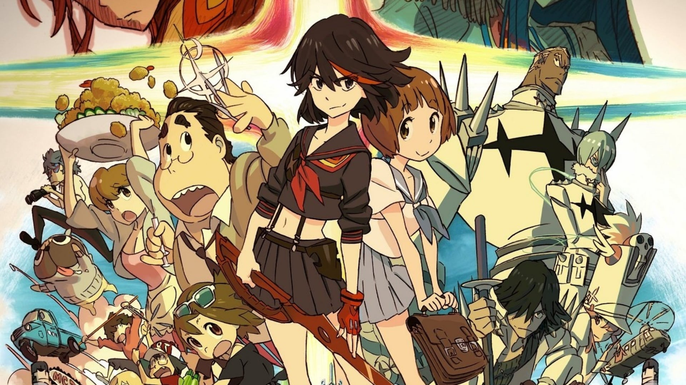

## Vue.js **2.5：Level E**
2017 年 10 月 13 日，Vue 发布 2.5 版本，版本名称为  Level E。

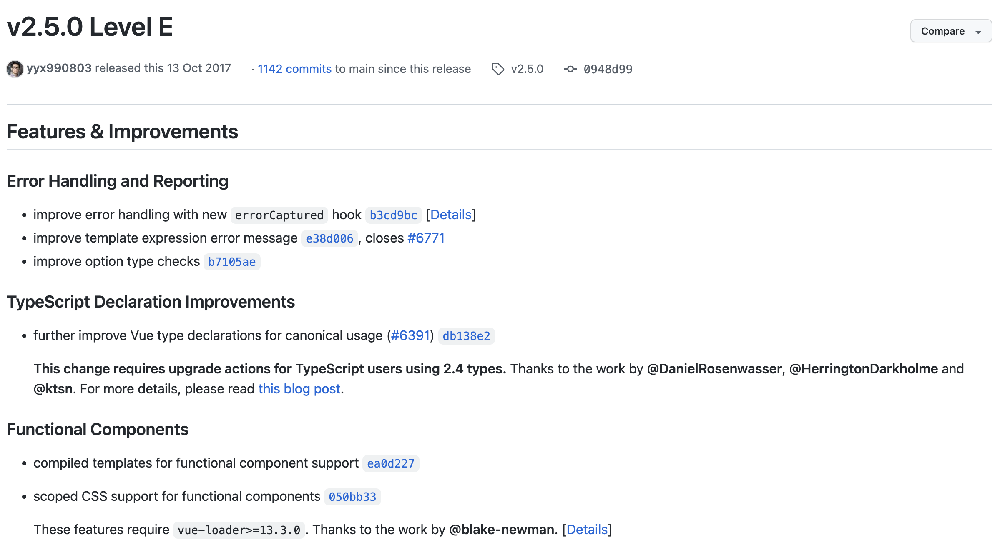

Level E 中文名为**灵异E接触**，它是由日本漫画家富坚义博创作的科幻漫画，故事背景在作者的出身地山形，以作者喜好的神秘学为主要的元素，是以外星人为故事主题的科幻类少年漫画。故事主要以来自铎古拉星的笨蛋王子，为了要打发无聊时间而作的恶作剧为轴，展开充满奇幻与神秘的一连串故事。

## Vue.js **2.6：Macross**
2019 年 2 月 4 日，Vue 发布 2.6 版本，版本名称为  Macross。

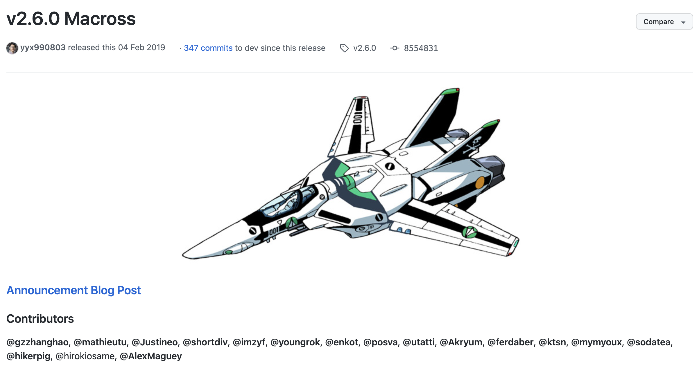

Macross 中文名为**超时空要塞，**它是龙之子工作室负责动画制作的原创电视动画，讲述了公元1999年一艘从天而降的巨大外星战舰引发了人类历史的变革，世界统合政府成立，人类开始专心对抗可能来自外太空的侵略。而在之后的宇宙战争中涌现出了一大批可歌可泣的英雄人物和故事，也将人类的历史带入了宇宙时代的新篇章。

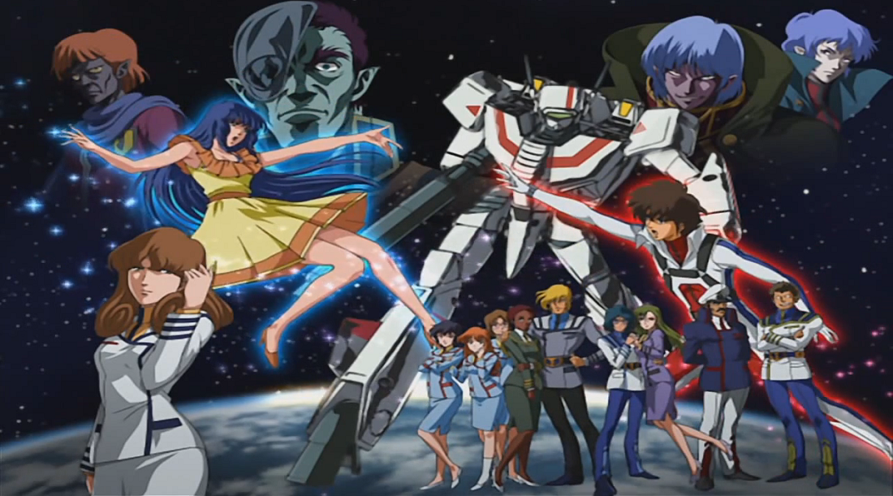

## Vue.js 2.7：Naruto
2022 年 7 月 1 日，Vue 发布 2.7 版本，版本名称为 Naruto。

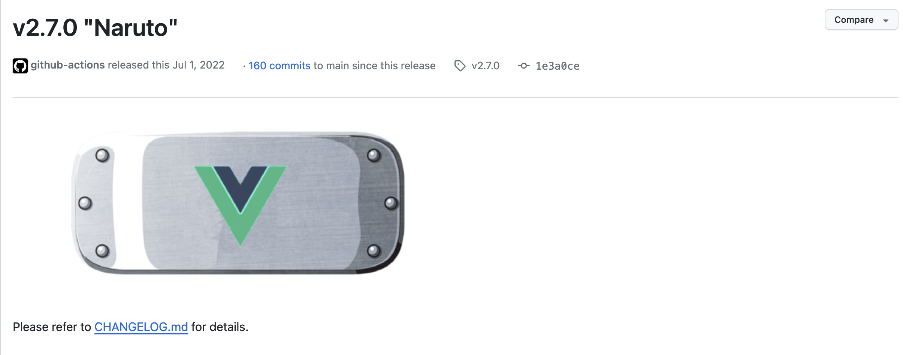

Naruto 中文名为**火影忍者**（日语：NARUTO -ナルト-），为日本漫画家岸本齐史创作的少年漫画，讲述忍者世界里围绕着身为对手的漩涡鸣人与宇智波佐助两人，与其他角色的经历。

动画《火影忍者》改编自日本漫画家岸本齐史的同名漫画，2002年10月3日在东京电视台系列全6局、岐阜放送首播，共220话；第二季《火影忍者疾风传》于2007年2月15日－2017年3月23日在东京电视台播出，共500话；累计全720话。

故事成功地将原本隐藏在黑暗中，用世界上最强大的毅力和最艰辛的努力去做最密不可宣和隐讳残酷的事情的[忍者](https://baike.baidu.com/item/%E5%BF%8D%E8%80%85/370?fromModule=lemma_inlink)，描绘成了太阳下最值得骄傲最光明无限的职业。

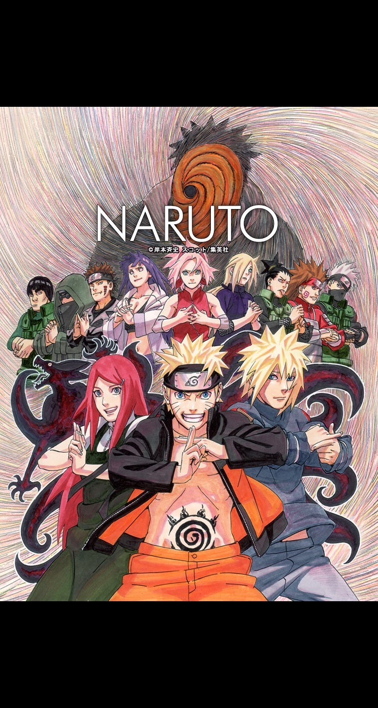

## Vue.js 2.7.16: Swan Song
2023 年 12 月 24 日，Vue 发布 2.7.16 版本，其发布名称为 Swan Song，意为绝唱，该版本是 Vue 2 的最终版， Vue 2 也将与 2023 年 12 月 31 日停止维护。

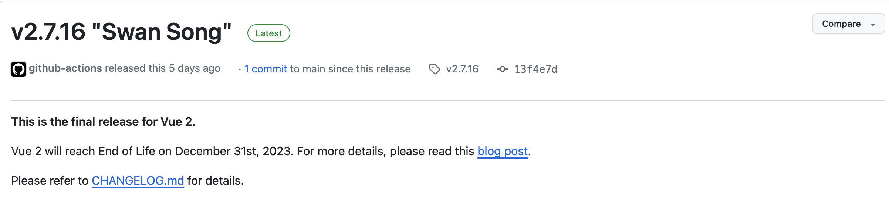

## Vue.js **3.0：One Piece**
2020 年 9 月 18 日，Vue 发布 3.0 版本，版本名称为 One Piece。

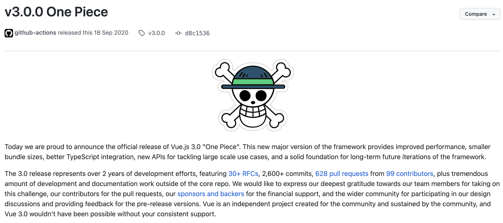  
 One Piece 中文名为**航海王（海贼王）**，作品以虚构的“大海贼时代”为故事舞台，描述海贼蒙奇·D·路飞想要得到“ONE PIECE”（一个大秘宝）和成为“海贼王”为梦想而出海向“伟大的航道”航行的海洋冒险故事。

## Vue.js **3.1：Pluto**
2021 年 6 月 7 日，Vue 发布 3.1 版本，版本名称为 Pluto。

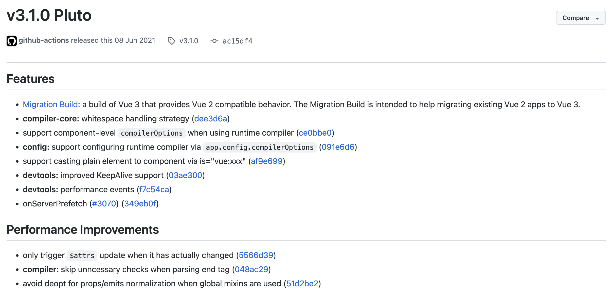

Pluto 中文名为**冥王星**，它是浦泽直树的漫画作品，改编自《地上最强机器人》，该漫画讲述了机器人PLUTO杀害其他机器人，凸出了人类和机器人共存的矛盾。

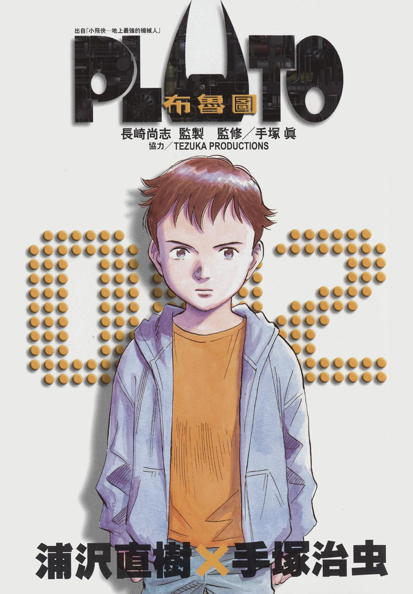

## Vue.js **3.2：Quintessential Quintuplets**
2021 年 8 月 5 日，Vue 发布 3.2 版本，版本名称为 Quintessential Quintuplets。

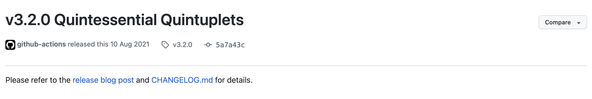

Quintessential Quintuplets 中文名为**五等分的新娘**，它是由日本漫画家春场葱所创作的少年漫画。故事以男主角上杉风太郎将在未来与中野家五胞胎姐妹中的一人结婚为展开，以倒叙的方式回顾风太郎与五姐妹相识的故事，之后也多次穿插结婚场景。

## Vue.js 3.3：Rurouni Kenshin
2023 年 5 月 11 日，Vue 发布 3.3 版本，版本名称为 Rurouni Kenshin。

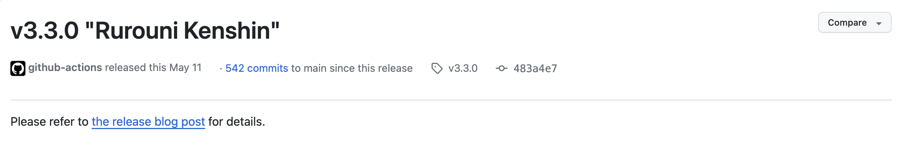

 Rurouni Kenshin 中文名为**浪客剑心**，是 1994 年至 1999 年于《周刊少年JUMP》连载的日本漫画作品，作者为和月伸宏，单行本共28卷。故事开端以日本明治时代早期为背景，后来加入赤报队和新选组的题材。在明治11年（1878年）5月14日发生的大久保利通被刺杀事件也成为故事题材的来源中之一。电影版则加入了戊辰战争、会津战争和部分的萨长同盟、攘夷志士相关因素。

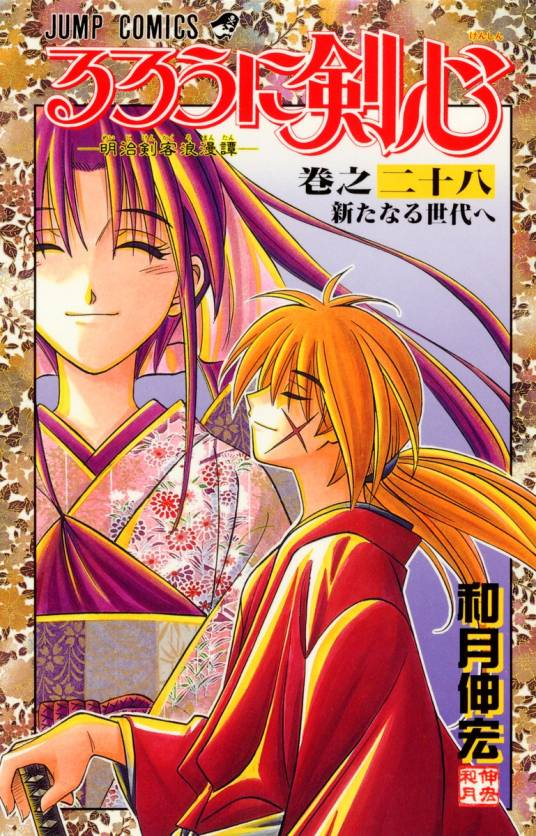

## Vue.js 3.4：Slam Dunk
2023 年 12 月 28 日，Vue 发布 3.4 版本，版本名称为 Slam Dunk。

Slam Dunk 中文名为**灌篮高手，**是日本漫画家**井上雄彦**以高中篮球为题材的少年漫画，讲述了主人公桂木洋志追求篮球梦想的故事。他通过不断努力和挑战，与队友们一起成长，参加各种激烈的比赛，最终实现了自己的篮球目标。漫画改编成了长篇电视动画片，由东映动画制作，于1993年10月16日—1996年3月23日在朝日电视台首播，全101集。

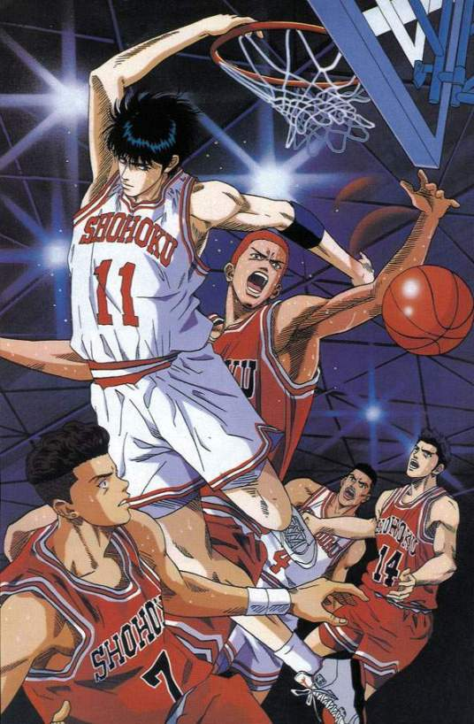

> 更新: 2024-01-03 20:29:59  
> 原文: <https://www.yuque.com/cuggz/feplus/crhr59>