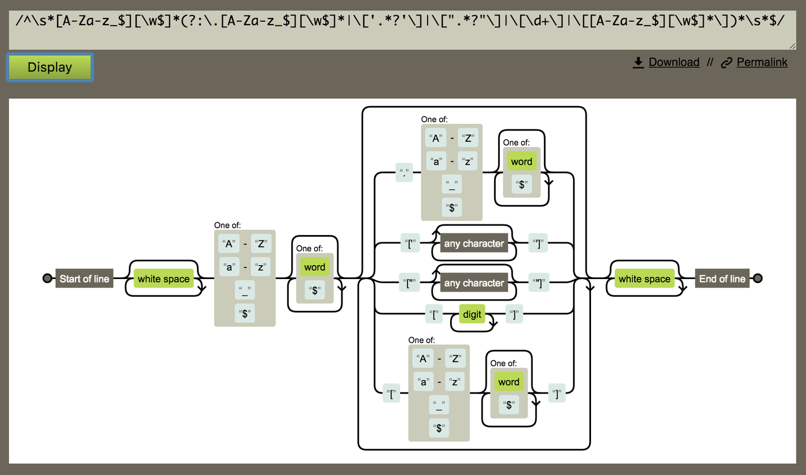

# 看完尤雨溪知乎343条回答，我学到了这些！

最近看完了尤雨溪的知乎 343 条回答和 25 篇文章，记录下一些内容，分享给大家！

## 问题：怎么才能有尤雨溪一半强，该怎么学习？
> 我更愿意把 “强” 理解为 “制造 impact 的能力”，也就是你能通过你的代码产生多大的影响力。
>
> 
>
> 在恰当的时机解决了恰当的问题，会产生很大的影响力，但问题总是处在一个不断被发现和解决的[动态平衡](https://www.zhihu.com/search?q=%E5%8A%A8%E6%80%81%E5%B9%B3%E8%A1%A1&search_source=Entity&hybrid_search_source=Entity&hybrid_search_extra=%7B%22sourceType%22%3A%22answer%22%2C%22sourceId%22%3A1858291784%7D)中，你能否发现那个值得解决，同时你也有能力解决的问题，需要一定程度的机遇。
>
> 
>
> 作为个人想要最大化创造影响力的机会，最重要的是两点：
>
> 1. 会发现问题，并且判断出什么问题值得解决
> 2. 具备高质量解决某个领域问题的技术水准。
>
> 
>
> 当你具备了 (2) 以后，更难的是 (1)，也就是搞明白力气应该花在哪里。具备 (2) 的人远远多于 (1) —— 但最终做出影响力的人必然是兼具 (1) 和 (2)。想要影响力大，你就必须思考 “什么才是值得解决的问题”。
>

## 问题：Vue 和 React 的优点分别是什么？
> React 从一开始的定位就是提出 UI 开发的新思路。当年 Pete Hunt 最开始推广 React 的时候的一句口号就叫 "Rethinking Best Practices"，这样的定位使得 React 打开了一些全新的思路，吸引了一群喜欢折腾的早期核心用户，并在这个基础上通过社区迭代孵化出了许多今天被 React 开发者当作常识的 pattern。这是 React 伟大的地方，Vue 里面也有很多地方是直接受到了 React 的启发。
>
> 
>
> Vue 从一开始的定位就是尽可能的降低[前端开发](https://www.zhihu.com/search?q=%E5%89%8D%E7%AB%AF%E5%BC%80%E5%8F%91&search_source=Entity&hybrid_search_source=Entity&hybrid_search_extra=%7B%22sourceType%22%3A%22answer%22%2C%22sourceId%22%3A545031906%7D)的门槛，让更多的人能够更快地上手开发。我以前也说过，开发 Vue 的初衷不是为了搞个大新闻，只是做了个我自己用得舒服的框架。很多时候我更希望自己做的东西能帮到那些中小型企业和个人开发者。  

>
> 希望大家能停下来想想所谓的 ”A 技术比 B 技术牛逼“ 背后到底是在争些什么，我们使用这些技术的初衷又是什么。比起争这个，不如多想想怎么让自己变得更牛逼吧。
>

## 问题：什么才是你心目中的前端圈?
> 所有的讨论能够就事论事，而不是争谁高谁低；有技术影响力的人，能够以身作则；吃瓜群众能够对讨论者进行监督，而不是煽风点火。
>

## 问题：怎么说服公司将knockout.js换成vue.js？
> 任何情况下你问『我们应不应该用框架 X 换掉框架 Y』，这都不是单纯的比较 X 和 Y 的问题，而得先问以下问题：
>
> 1. 现有的项目已经开发了多久？代码量多大？ 
> 2. 现有的项目是否已经投入生产环境？ 
> 3. 现有的项目是否遇到了框架相关的问题，比如开发效率、可维护性、性能？换框架是否能解决这些问题？
>
> 
>
> (1) 事关替换的成本，(2) 事关替换的风险，(3) 事关替换的收益。把这些具体信息放在台面上比较，才有可能得出一个相对靠谱的结论。
>

## 问题：如何解决 Vue 在部分机型上渲染失败？
> 开 issue 的初衷，是为了解决问题；但这不代表你开了 issue 就等于把责任全丢给我了；我需要有足够的信息才能定位问题的根源，才有可能解决这个问题。但是这些信息、场景、上下文，只有你才知道，你不说我怎么可能猜得到？真的是拜托了，开 issue 的时候务必站在维护者的立场上思考一下，如果你是维护者看到这样一个 issue，你觉得你有足够的信息去解决这个问题吗？提这样一个信息不完全的 issue，除了浪费大家的时间真的没有任何意义。让你花点时间收集和提供详细的信息，不是为了方便我，而是为了解决你的问题啊...
>

## 问题：如何评价真阿当的文章：《2016年前端技术观察》？
> 评价一项技术的时候，我遵循一个原则：如果我没有用过，研究过，亲自踩过坑，我不对一个东西妄下判断。直觉性的判断可以有，但你经验再丰富，没有实践支撑的直觉判断也是不足以作为论据的。
>
> 
>
> 对一个东西持怀疑态度没问题，但把这种未经实践检验的怀疑去对经验不足的新人输出，一来可能本来观点就是错的，二来让大家觉得『我没用过，但这东西不对』的思维模式是可取的，是为误人子弟。
>
> 
>
> 罔顾事实，抱着成见，输出和事实相悖的信息，是为误人子弟。
>
> 
>
> 打着为行业忧心的旗号，输出着让新人自我设限的价值观，是为误人子弟。
>

## 问题：尤雨溪等非cs转前端的大神是怎么学到编译这个地步的？
> CS 里面随便一个领域单独拿出来，水都可以深得超过外行的想象，但在工程的场景下，更重要的是投入恰到好处的技能点去实现你现阶段的目标。
>
> 
>
> 其次，不要妄自菲薄。我觉得很多非科班出身的程序员经常会潜意识里给自己划定范围，啊这个是科班出身的人才懂的东西，我没希望了。你之前学了啥跟你以后能学啥没有什么本质联系吧。我本科学的是艺术史，只意味着我本科的时间大部分花在了艺术史上而已，不代表我以后不能再花时间在 CS 的东西上。其实很多所谓科班出身的人对于编译原理的理解跟你的差别也就是三个多月一门课而已... 如果真的觉得编译原理是自己的瓶颈了，那就下决心去学呗，可能并没你想象的那么可怕。
>

## 问题：你是如何学会正则表达式的？
> 除了自己实现一遍，剩下的也就是『无他，唯手熟尔』
>
> 
>
> 另外工具方面推荐一个将 JS 正则可视化的工具：[https://regexper.com/](https://link.zhihu.com/?target=https%3A//regexper.com/)  

>
> 对于理解别人源码里的（或者自己的，哈哈）复杂正则很有帮助：
>
> 
>

## 问题：[为什么 Vue 的更新记录没有中文，中文文档也一直滞后？](https://www.zhihu.com/question/49884331/answer/118492169)
> 英语好好学，这是为你自己好。英语是如今当程序员的必备技能，“英语不好也能成为好程序员” 是自欺欺人，不要为自己的懒惰找借口，更不要把这种责任转嫁到别人身上。
>

## 问题：计算机基础知识不牢的前端都是瞎扯淡吗？为什么？对于前端来说哪些计算机基础知识很重要？
> 『前端』这个词现在涵盖的内容也越来越广了，尤其是应用化了以后，俨然前端自己有一个迷你技术栈：
>
> 1. **纯表现层。**用户体验、布局、特效、研究 CSS 各种奇技淫巧（例子：CodePen 上各种无比酷炫但基本靠 hard-code 搞出来的特效）；对于很多设计/前端兼修的人来说，技术层面就到此为止了。他们很多可能一辈子都不会写翻转二叉树，但他们也能搞出一些科班出生的人一辈子也搞不出的用户体验。当然不排除一些走 creative coding / 数据可视化路线的人需要对物理、数学、甚至计算机图形方面的知识进行针对性的强化。
> 2. **应用实现层。**可能是大公司初级工程师主要干的活：拿着别人设计好的框架、工具去实现具体的应用逻辑。实话实说这个层面对计算机基础的要求确实不高，只要对 JS、CSS 这些领域专门的东西基础扎实 + 学习能力 ok 就可以了。但是这个层面其实需求巨大，而且有一个独特的需求：开发效率。要提升效率就得对手上的工具了解得非常细致，比如 XX 框架的 N 种优化小窍门之类的... 而这种东西只能靠实战经验去积累，基础再扎实影响也有限。
> 3. **应用架构层。**技术选型、开发底层框架、制定开发规范、设计应用结构... 这些东西就涉及到知识的广度和深度了，对业务需求的理解很重要，而且碰到具体的纯技术问题的可能性也大得多。编译原理、算法、数据结构在这里都会派上实际的用处。
> 4. **基础设施层。**自动化构建、部署、测试、加载方案、性能优化、代码质量管理等等... 这一层更加技术化了，而且涉及很多所有软件工程共通的东西，并不局限于前端。
> 5. **理念层。**通过借鉴整个计算机体系中其他领域的思想，从根本上改进前端的开发范式。Facebook 的人现在做的就是这种事情。事实上能做到这一层的人基本不以前端自居了。
>
> 
>
> 上面的这些层次并不是一个发展路线，不是说是个前端就一定要冲着最高的层次去，这不现实，因为每个层次都可以深入钻研，对于公司来说，尤其是大公司，往往更需要在一个层次深入专精的人而不是每个层次都半桶水的人（对于多层次专精的人的需求也是有的，但是这种一般都是 senior 职位了，不会太多）
>

## 问题：如何能让页面仔也能做出良性的前端组件？
> 组件化的开发理念主要是针对单页应用的，也就是有复杂的数据、页面结构和交互逻辑的东西。组件的目的就是把整体的复杂性解构，分而治之，从而提高开发效率和可维护性。
>

## 问题：写一个js库需要怎样的知识储备和技术程度？
> 对 JavaScript 语言本身的了解是一个基本要求，不求看过规范，起码看过犀牛书吧。另外如果你要写一个库，起码得了解市面上有哪些其他库跟你解决的是同一个问题，它们的核心实现是怎样的，相比它们，你的库提供了什么价值。
>

## 问题：英语是否会成为开发工程师的发展瓶颈？
> 不仅英语差会成为瓶颈，英语好还能成为优势，因为学习效率会比别人高。像我这样半路出家自学的人，只能靠英语了...
>

## 问题：前端开发中有什么经典的轮子值得自己去实现一遍
> Virtual-DOM
>

## 问题：怎样成为全栈工程师（Full Stack Developer）？
> 我觉得对于 FSD ，尤其是对于想成为 FSD 的人来说，这个**态度**才是最重要的事情。即使都是 FSD，每一个人各自的技能加点也肯定会不一样，有人在前端更擅长一些，有人在服务器层面更有经验... 但其实没有什么硬性的门槛，需要的是解决**任何问题**的能力和意愿。你要做到的就是不固步自封在一个领域。遇到问题，就去研究，不因为问题不在你的 comfort zone 就放弃或者推给别人。即使一开始的解决方案很笨拙也无所谓，**just learn whatever it takes to make it work.** 比如说我要做一个网站，我有一些东西没碰过，但我有足够的兴趣和动力去搞个八九不离十。（这里自学能力很重要，有好的 mentor 也会帮助很大）当你经历过一次这个过程以后，你就会有信心去弄明白更复杂的东西，在之前的基础上进一步去消化、改进、学更多的东西。
>
> 
>
> 另外，我个人觉得这个过程应该是由实际问题驱动的，而不是漫无目的看到什么东西流行了或者觉得很NB就去学。
>

## 文章：关于撕逼
> 做技术的人，往往会把自己跟自己常用/擅长/喜欢的技术捆绑，因为从某种程度上来说你选择的技术是你价值观的一部分；当别人批评你选择的技术时，就像在否定你的价值观。甚至只是看到与自己价值观不符的东西流行，也会感到不爽，或是感觉受到威胁。这种代入感是很正常的现象，但只顺从于这种应激反应而去跟人争论的话，往往不会有愉快的对话，因为一种自我保护的基调已经存在了。
>
> 
>
> 对于技术的使用者来说，要克服这种刺猬心理有几种途径：
>
> 1. 提升自身，加强自信。就好像长得好看的人穿什么都好看，技术扎实的人用什么工具都可以做出好产品。把自己跟工具捆绑，侧面反映的是你对特定工具的依赖。当你自身的水平到了一定高度以后，工具就只是工具，而不是决定自己价值的信仰。
> 2. 谈技术的时候先谈场景。你使用一项技术是为了解决什么问题？不同的产品形态、团队构成、历史包袱都会极大地影响技术的适用性。不谈场景谈选型都是耍流氓。在谈技术的时候永远先考虑场景，避免为了使用一项技术而使用一项技术。
> 3. 区分偏好和客观事实。不同的开发者有不同的背景、习惯和思维模式，对于同一个技术的感受也会有不同。试图向一个觉得青菜好吃的人证明青菜并不好吃是毫无意义的事情，反过来也是一样。值得讨论的是关于青菜的客观事实，比如营养好不好。当然，还要避免对自己根本没吃过的东西乱下结论。
>
> 
>
> 另一方面，有一类具有主动攻击性的『优越感』程序员 —— 由于觉得自己选择的技术『品味』更好，所以会去嘲讽其他技术，甚至嘲讽使用其他技术的人。这类人，跟以恶心别人为乐的喷子没有本质区别，无视是最好的选择，要学会使用预防性拉黑。
>

> 更新: 2024-01-09 17:02:41  
> 原文: <https://www.yuque.com/cuggz/feplus/vo0m12bhc48xk4o7>