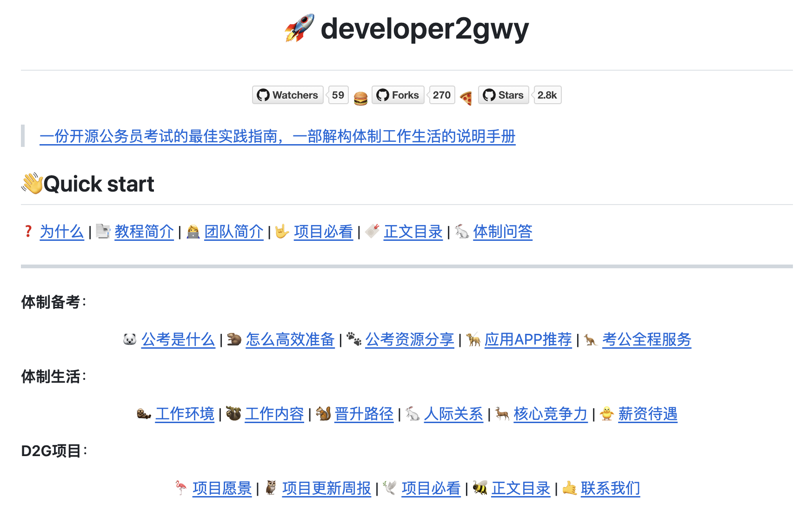
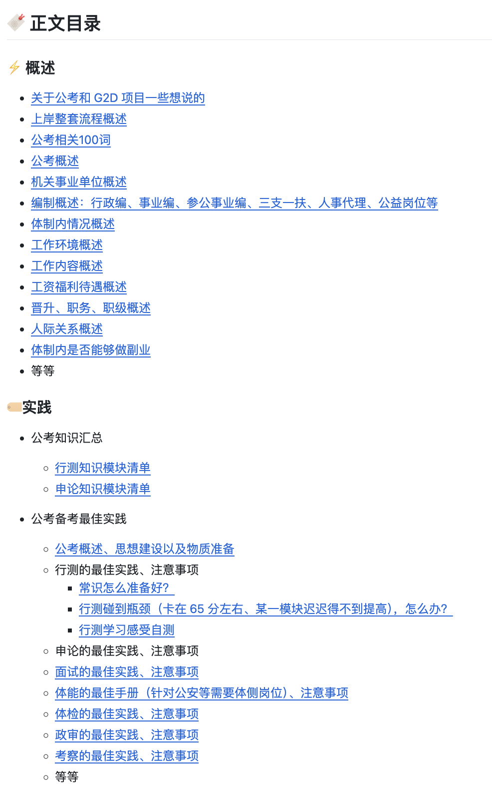
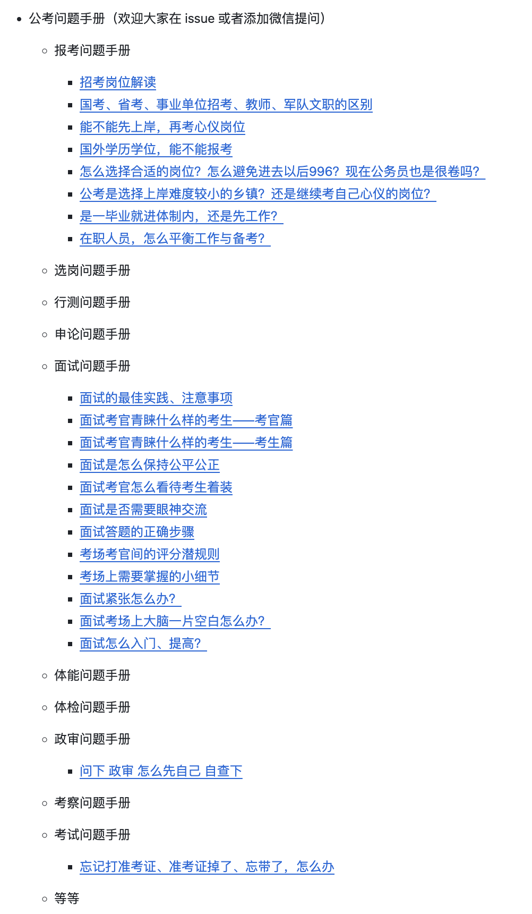
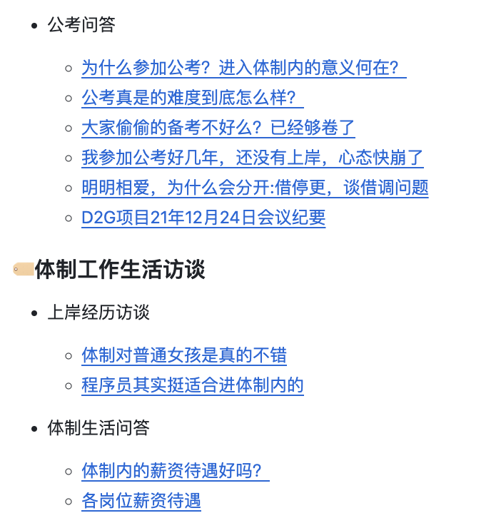

# 程序员上岸指南

## developer2gwy
developer2gwy 是一个公务员从入门到上岸，最佳程序员公考实践教程。提供了一份详细的公务员考试实践指南，包括备考策略、面试技巧、以及体制内工作的相关信息。

**Github（2.9k Star）：**[https://github.com/miss-mumu/developer2gwy](https://github.com/miss-mumu/developer2gwy)

## 程序员考公指南
互联网首份程序员考公指南，由3位已经进入体制内的前大厂程序员联合献上。

**Github（25.7k Star）：**[https://github.com/coder2gwy/coder2gwy](https://github.com/coder2gwy/coder2gwy)

> 更新: 2024-11-30 15:16:07  
> 原文: <https://www.yuque.com/cuggz/feplus/kv9fqc8t4oafgw1i>