# 字节跳动

作为国内知名的互联网公司，字节跳动在前端领域做出了很多开源贡献。本文就来盘点字节跳动开源的 15 个前端开源项目，你用过几个？

## Arco Dsign
Arco Design 是一套设计系统，主要服务于字节跳动旗下中后台产品的体验设计和技术实现。它的目标在于帮助设计师与开发者解放双手、提升工作效率，并高质量地打造符合业务规范的中后台应用。它拥有系统的设计规范和资源，提供了覆盖 React、Vue、Mobile 的原子组件。目前，Arco Design 拥有 60 多个精心制作的组件，支持开箱即用。

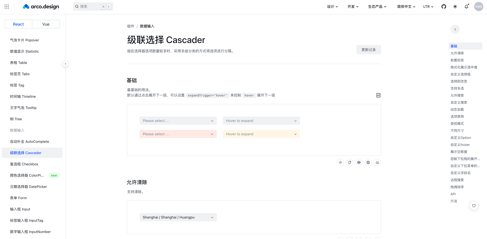

除了风格配置平台和物料平台的定制化工具外，Arco Design 还提供了包括图标平台、品牌库、Arco Pro 最佳实践的资源平台。

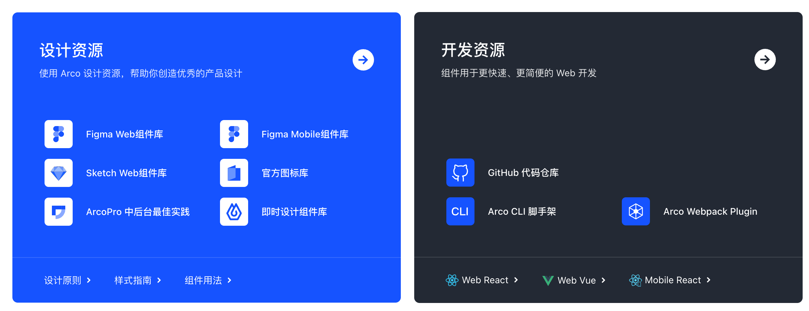

**Github：**[https://github.com/arco-design/arco-design](https://github.com/arco-design/arco-design)

## **Arco Design Pro**
Arco Design Pro 是基于 Arco Design React 组件库的开箱即用的中后台前端解决方，它的特性如下：

+ **TypeScript** - 代码完全使用 TypeScript 书写
+ **Arco Design** - 由 ArcoDesign React 组件库强力驱动
+ **Templates** - 16+ 页面模版，覆盖表格、列表、表单、工作台、可视化等场景。
+ **Themes** - 基于「风格配置平台」丰富的主题市场，让你的项目千变万化。
+ **Dark Theme** - 一键丝滑切换暗黑风格
+ **Mock** - 内置 API 模拟方案
+ **Flexible** - 灵活的多架构方案，支持 next.js / vite / cra 等开发框架
+ **I18n** - 内置国际化多语言解决方案
+ **Config** - 灵活配置页面配色、布局等

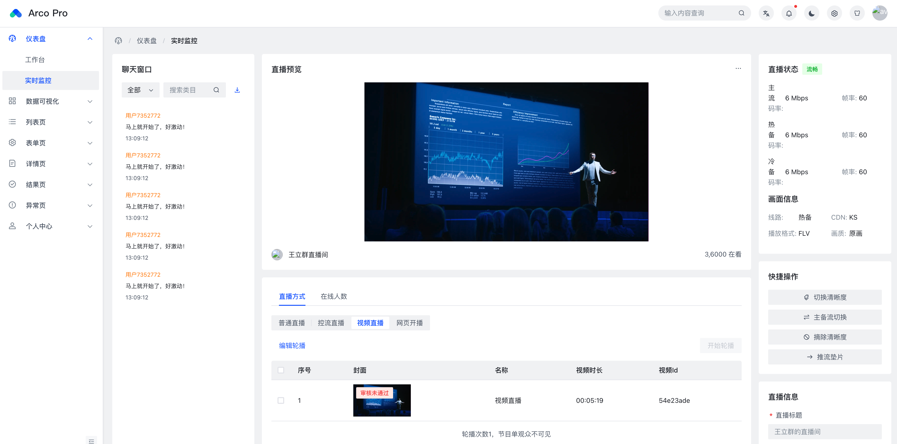

本质上，Arco Design Pro 是一套项目模版，市面上常见的中后台项目模版一般都有固定的选型和架构，这样用户如果想自己修改架构，成本会比较大。所以 Arco Pro v2 版本设计了一套多架构方案，能够在最大化的代码重用的基础上，输出多种架构的 pro 模版。

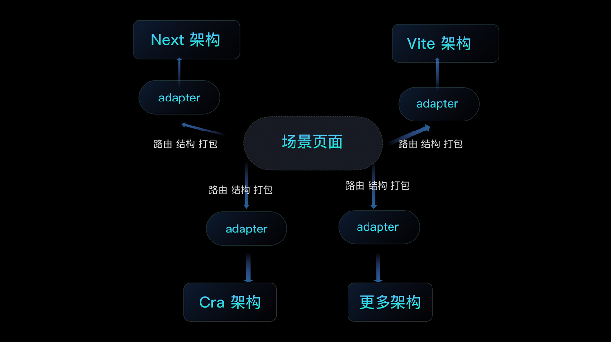

**Github：**[https://github.com/arco-design/arco-design-pro](https://github.com/arco-design/arco-design-pro)

## Semi Design
Semi Design 是由抖音前端团队，MED 产品设计团队设计、开发并维护的设计系统。它作为全面、易用、优质的现代应用 UI 解决方案，从字节跳动各业务线的复杂场景提炼而来，支撑近千计平台产品，服务内外部 10 万+ 用户。

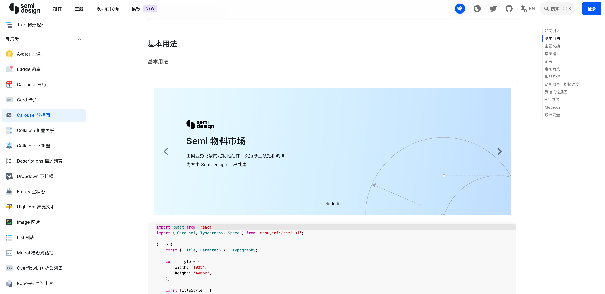

Semi Design 采用了一套跨前端框架技术方案，F/A 分层设计，将每个组件的 JavaScript 拆分为两部分：Foundation 和 Adapter，这使得我们可以通过仅重新实现适配器来跨框架重用 Foundation 代码，例如 React、Vue、Angular、Svelte 或者 WebComponent，快速打造不同平台上的通用组件库。

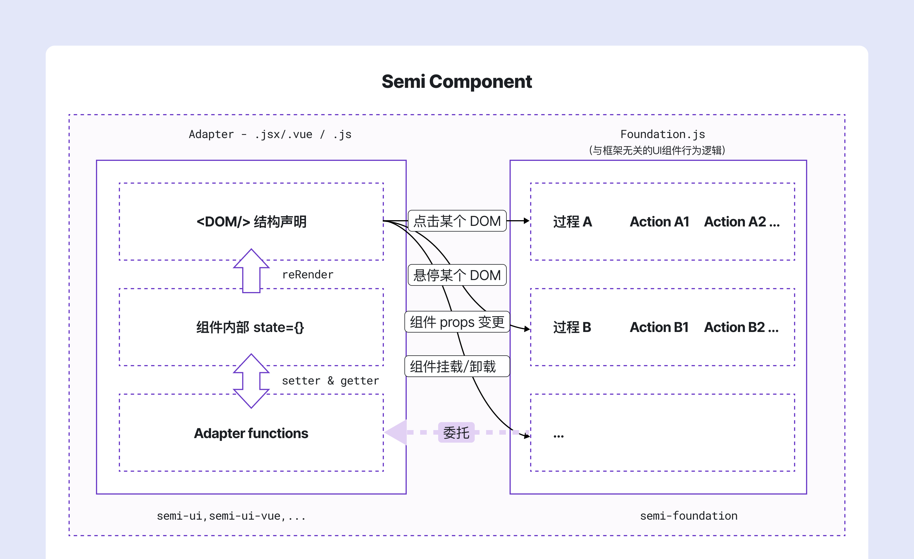  
**Github：**[https://github.com/DouyinFE/semi-design](https://github.com/DouyinFE/semi-design)

## IconPark
IconPark 图标库是字节跳动开源的一个通过技术驱动矢量图标样式的开源图标库，可以实现根据单一SVG源文件变换出多种主题， 具备丰富的分类、更轻量的代码和更灵活的使用场景；致力于构建高质量、统一化、可定义的图标资源，让大多数人都能够选择适合自己的风格图标。

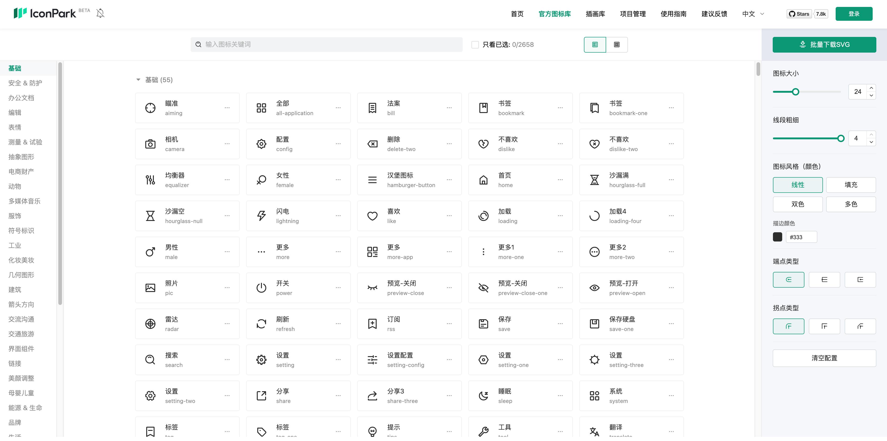

**Github：**[https://github.com/bytedance/IconPark](https://github.com/bytedance/IconPark)

## xgplayer
xgplayer（西瓜播放器）是一款带解析器、能节省流量的HTML5视频播放器。它基于“一切皆组件化”的原则，设计了一个独立、可拆卸的 UI 组件。更重要的是，它不仅在 UI 层面灵活，而且在功能上也大胆创新：它摆脱了视频加载、缓冲和对视频格式的依赖。特别是对于 mp4，它可以实现阶段性加载，这对于不支持流媒体的 mp4 来说意义重大。这意味着无缝切换，清晰度控制，以及视频保存。此外，它还集成了对 FLV、HLS 和 dash 的按需和实时支持。

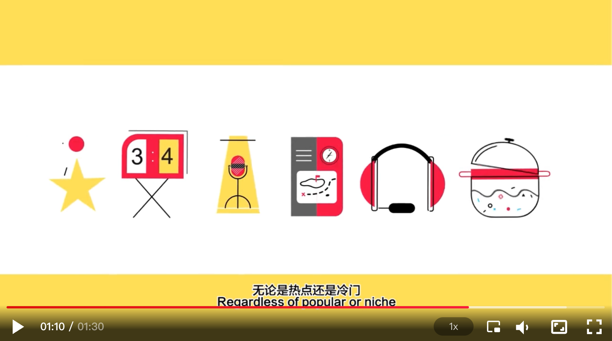

**Github：**[https://github.com/bytedance/xgplayer](https://github.com/bytedance/xgplayer)

## bytemd
ByteMD 是一个使用 Svelte 构建的 Markdown 编辑器组件。它还可以用于其他库/框架，例如 React、Vue 和 Angular。其具有以下特性：

+ **轻量级且与框架无关**：ByteMD 是使用[Svelte](https://svelte.dev/)构建的。它编译为普通 JS DOM 操作，无需导入任何 UI 框架运行时包，这使得它轻量级，并且可以轻松适应其他库/框架。
+ **易于扩展**：ByteMD 有一个插件系统来扩展基本的 Markdown 语法，这使得可以轻松添加附加功能，例如代码语法突出显示、数学方程和Mermaid流程图。如果这些插件不能满足您的需求，您也可以[编写自己的插件。](https://bytemd.js.org/#write-a-plugin)
+ **默认安全**：ByteMD 已正确处理和等跨站脚本 (XSS)攻击。无需引入额外的 DOM 清理步骤。<script>
+ **SSR 兼容：ByteMD 可以在**服务端渲染（SSR）环境中使用，无需额外配置。 SSR 在某些情况下被广泛使用，因为它具有更好的 SEO 和在慢速网络连接中快速获取内容的时间。

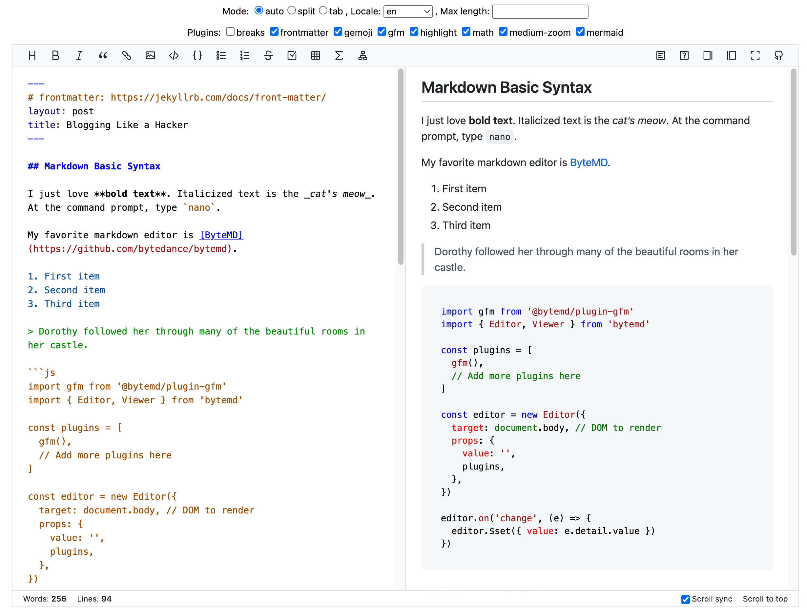

**Github：**[https://github.com/bytedance/bytemd](https://github.com/bytedance/bytemd)

## VChart
VChart 是 VisActor 可视化体系中的图表组件库，基于可视化语法库 VGrammar 进行图表逻辑封装，基于可视化渲染引擎 VRender 进行组件封装。核心能力如下：

+ **一码多端**：自动适配桌面、H5、多个小程序环境
+ **面向叙事**：综合应用标注、动画、流程控制、叙事模板等一系列增强功能进行叙事可视化创作。
+ **场景沉淀**：面向最终用户沉淀可视化能力，解放开发者生产力

**Github：**[https://github.com/VisActor/VChart](https://github.com/VisActor/VChart)

## VTable
VTable 是 VisActor 可视化体系中的表格组件库，基于可视化渲染引擎 VRender 进行封装。 核心能力如下：

+ 性能极致：支持百万级数据快速运算与渲染
+ 多维分析：多维数据自动分析与呈现
+ 表现力强：提供灵活强大的图形能力，无缝融合VChart

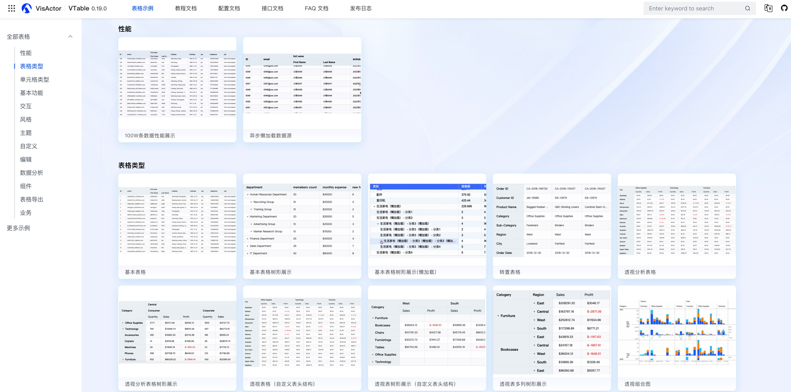

**Github：**[https://github.com/VisActor/VTable](https://github.com/VisActor/VTable)

## Rspack
Rspack 是由字节跳动 Web Infra 团队孵化的基于 Rust 语言开发的 Web 构建工具。它拥有高性能、兼容 Webpack 生态、定制性强等多种优点，旨在打造高性能的前端工具链。

Rspack 的特点如下：

+ 启动速度极快：基于 Rust，项目启动速度极快，带给你极致的开发体验。
+ 闪电般的 HMR：内置增量编译机制，HMR 速度极快，完全胜任大型项目的开发。
+ 兼容 webpack：针对 webpack 的架构和生态进行兼容，无需从头搭建生态。
+ 内置常见构建能力：对 Typescript、JSX、CSS、CSS Modules、Sass 等提供开箱即用的支持。
+ 默认生产优化：默认内置多种优化策略，如 Tree Shaking、代码压缩等等。
+ 框架无关：不和任何前端框架绑定，保证足够的灵活性。

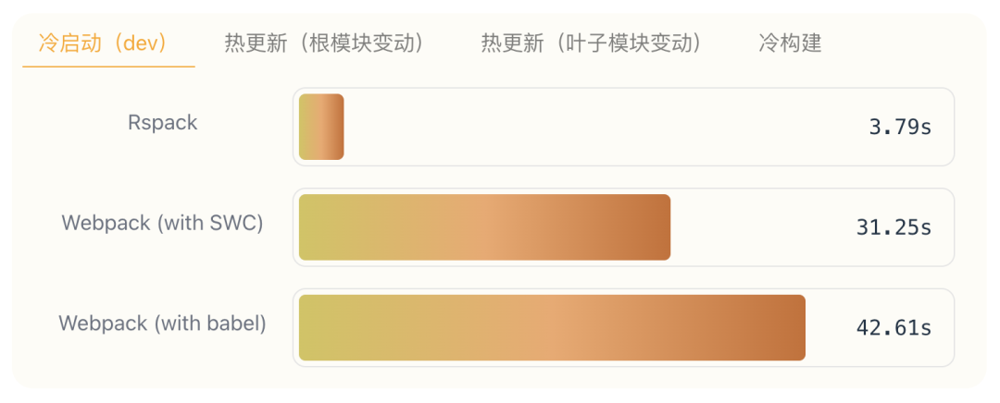

**Github：**[https://github.com/web-infra-dev/rspack](https://github.com/web-infra-dev/rspack)

## Rsbuild
Rsbuild 是基于 Rspack 的 Web 构建工具，是一个增强版的 Rspack CLI，更易用、更开箱即用。作为 Rspack 团队对 Web 构建最佳实践的探索，Rsbuild 提供从 Webpack 到 Rspack 的顺畅迁移方案，大幅减少配置需求，提升构建速度达 10 倍。

Rsbuild 具备以下特性：

+ **易于配置**：Rsbuild 的目标之一，是为 Rspack 用户提供开箱即用的构建能力，使开发者能够在零配置的情况下开发 web 项目。同时，Rsbuild 提供一套语义化的构建配置，以降低 Rspack 配置的学习成本。
+ **性能优先**：Rsbuild 集成了社区中基于 Rust 的高性能工具，包括 **Rspack** 和 **SWC**，以提供一流的构建速度和开发体验。与基于 Webpack 的 Create React App 和 Vue CLI 等工具相比，Rsbuild 提供了 5 ~ 10 倍的构建性能，以及更轻量的依赖体积。
+ **插件生态**：Rsbuild 内置一个轻量级的插件系统，提供一系列高质量的官方插件。此外，Rsbuild 兼容大部分的 webpack 插件和所有的 Rspack 插件，这意味着你可以在 Rsbuild 中使用社区或公司内沉淀的现有插件，而不需要重写相关代码。
+ **产物稳定**：Rsbuild 设计时充分考虑了构建产物的稳定性，它的开发环境产物和生产构建产物具备较高的一致性，并自动完成语法降级和 polyfill 注入。Rsbuild 也提供插件来进行类型检查和产物语法检查，以避免线上代码的质量问题和兼容性问题。
+ **框架无关**：Rsbuild 不与前端 UI 框架耦合，并通过插件来支持 React、Vue 3、Vue 2、Svelte、Solid、Lit 等框架，未来也计划支持社区中更多的 UI 框架。

Rsbuild 的构建性能与原生 Rspack 处于同一水平。由于 Rsbuild 内置了更多开箱即用的功能，因此性能数据会略微低于 Rspack。

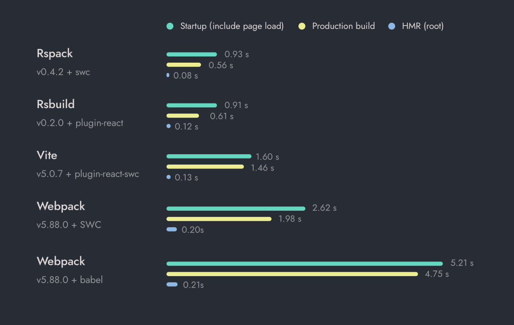

**Github：**[https://github.com/web-infra-dev/rsbuild](https://github.com/web-infra-dev/rsbuild)

## Rspress
Rspress 是基于 Rspack 的静态站点生成器，依托React框架进行高效渲染。内置便捷的文档主题，助力迅速搭建专业文档站点。同时，支持个性化主题定制，满足多样化的静态站需求，如博客站、产品主页等。

Rspress 的特性如下：

+ **极高的编译性能**：核心编译模块基于 Rust 前端工具链完成，带来更加极致的开发体验。
+ **支持 MDX 编写内容**：MDX 是一种强大的内容编写方式，你可以在 Markdown 中使用 React 组件。
+ **内置全文搜索**：构建时自动为你生成全文搜索索引，提供开箱即用的全文搜索能力。
+ **更简单的 I18n 方案**：通过内置的 I18n 方案，可以轻松的为文档或者组件提供多语言支持。
+ **静态站点生成：**生产环境下，会自动构建为静态 HTML 文件，你可以轻松的部署到任何地方。
+ **提供多种自定义能力**：通过其扩展机制，你可以轻松的扩展主题 UI 和构

以 Rspress 官网文档的内容为例，Rspress、Docusaurus 和 Nextra 三者的性能对比情况如下：

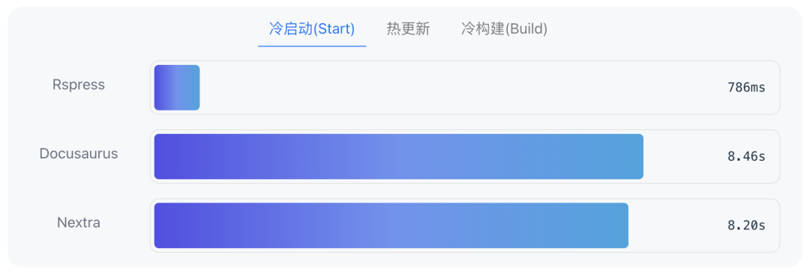

**Github：****https://github.com/web-infra-dev/rspress**

## Rsdoctor
Rsdoctor 是一个全面诊断和分析 Webpack 和 Rspack 构建过程与产物的工具，提供编译耗时细节和行为展示，以及防止代码劣化的 Bundle Diff 功能。

Rsdoctor 的特性如下：

+ **编译可视化**：Rsdoctor 将编译行为及耗时进行可视化展示，方便开发同学查看构建问题。
+ **多种分析能力**：支持构建产物、构建时分析能力：
    - 构建产物支持资源列表及模块依赖等。
    - 构建时分析支持 Loader、Plugin、Resolver 构建过程分析。
    - 支持 Rspack 的 builtin:swc-loader 分析。
    - 构建规则支持重复包检测及 ES Version Check 检查等。
+ **支持自定义规则**：除了内置构建扫描规则外，还支持用户根据 Rsdoctor 的构建数据添加自定义构建扫描规则。
+ **框架无关**：支持所有基于 Webpack 或 Rspack 构建的项目。

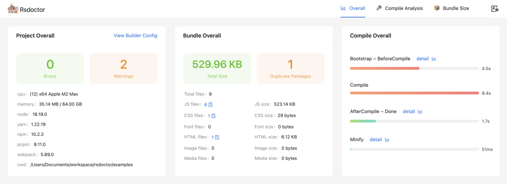

**Github：**[https://github.com/web-infra-dev/rsdoctor](https://github.com/web-infra-dev/rsdoctor)

## Oxlint
Oxlint 是 OXC 工具集的其中一个工具，用于捕获错误或无用的代码，作用和 ESLint 类似。现阶段，oxlint **无意完全取代 ESLint**；当 ESLint 的缓慢成为工作流程中的瓶颈时，它可以作为增强功能。

> OXC 是字节跳动出品的一个用 Rust 编写的 JavaScript 高性能工具集合，该项目的重点在于构建 JavaScript 的基本编译器工具：**解析器、linter、格式化程序、转译器、压缩器**和**解析器**。此外，OXC 还为 Rspack、Rolldown 和 Ezno 等新兴 JavaScript 工具提供支持。
>

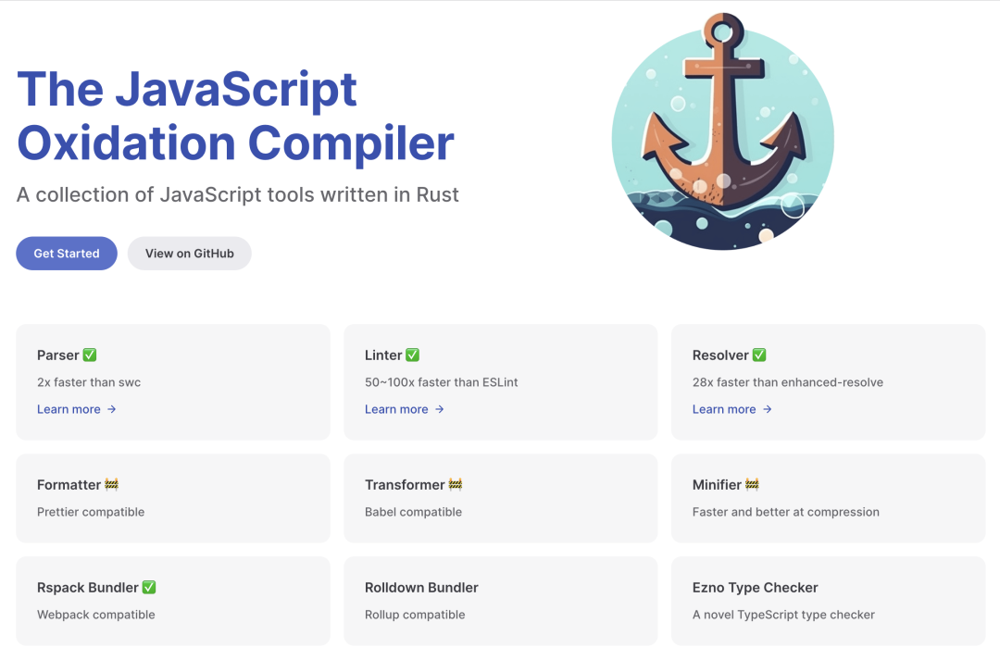

Oxlint 的特新如下：

+ 比 ESLint 快 50 - 100 倍，并随 CPU 核心数量不断扩展。
+ 超过 200 条规则，且正在不断增加，来自 eslint、typescript、eslint-plugin-react、eslint-plugin-jest、eslint-plugin-unicorn 和 eslint-plugin-jsx-a11y。
+ 支持.eslintignore。
+ 支持ESLint 注释禁用。

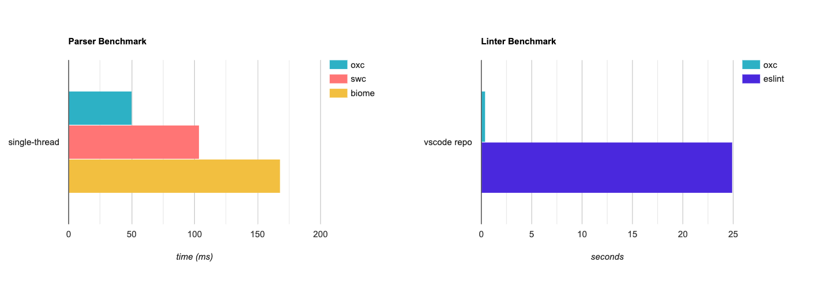

**Github**：[https://github.com/oxc-project/oxc](https://github.com/oxc-project/oxc)

## Mordern.js
Modern.js 是字节跳动 Web 工程体系的开源版本，它提供多个解决方案，来帮助开发者解决不同研发场景下的问题。目前 Modern.js 包含两个解决方案，分别面向 Web 应用开发场景 和 npm 包开发场景：

+ Modern.js Framework：基于 React 的渐进式 Web 开发框架
+ Modern.js Module：易用、高性能的 npm 包开发方案

Modern.js 框架是一个基于 React 的渐进式 Web 开发框架。在字节跳动内部，将 Modern.js 封装为上层框架，并支撑了数千个 Web 应用的研发。Modern.js 能为开发者提供极致的开发体验，让应用拥有更好的用户体验。

在开发 React 应用过程中，开发者通常需要去为某些功能去设计实现方案，或是使用其他的库、框架来解决这些问题。Modern.js 支持 React 应用所需要的所有配置和工具，并内置额外的功能和优化。开发者可以使用 React 构建应用的 UI，然后逐步采用 Modern.js 的功能来解决常见的应用需求，如路由、数据获取、状态管理等。

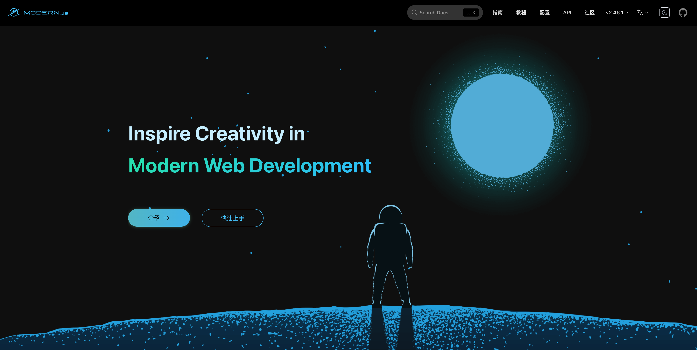

Modern.js 框架主要包含以下特性：

+ **Rust 构建**：提供双构建工具支持，轻松切换到 Rspack 构建工具，编译飞快。
+ **渐进式**：使用最精简的模板创建项目，通过生成器逐步开启插件功能，定制解决方案。
+ **一体化**：开发与生产环境 Web Server 唯一，CSR 和 SSR 同构开发，函数即接口的 API 服务调用。
+ **开箱即用**：默认 TS 支持，内置构建、ESLint、调试工具，全功能可测试。
+ **周边生态**：自研状态管理、微前端、模块打包、Monorepo 方案等周边需求。
+ **多种路由模式**：包含自控路由、基于文件约定的路由（嵌套路由）等。

**Github：**[https://github.com/web-infra-dev/modern.js](https://github.com/web-infra-dev/modern.js)

## Garfish
Garfish 是一套 [微前端](https://micro-frontends.org/) 解决方案，主要用于解决现代 web 应用在前端生态繁荣和 web 应用日益复杂化两大背景下带来的跨团队协作、技术体系多样化、web 应用日益复杂化等问题：从架构层面出发将多个独立交付的前端应用组成整体，这些前端应用能够「**独立开发**」、「**独立测试**」、「**独立部署**」，但是最终在用户看来仍然是**内聚的单个产品**。

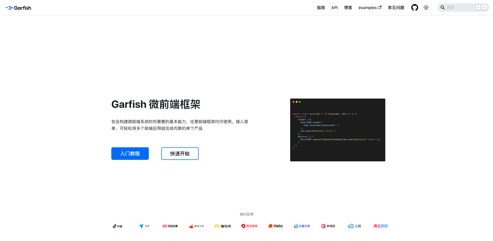  
Garfish 的特性如下：

+ 丰富高效的产品特征
    - Garfish 微前端子应用支持任意多种框架、技术体系接入
    - Garfish 微前端子应用支持「独立开发」、「独立测试」、「独立部署」
    - 强大的预加载能力，自动记录用户应用加载习惯增加加载权重，应用切换时间极大缩短
    - 支持依赖共享，极大程度的降低整体的包体积，减少依赖的重复加载
    - 支持数据收集，有效的感知到应用在运行期间的状态
    - 支持多实例能力，可在页面中同时运行多个子应用提升了业务的拆分力度
    - 提供了高效可用的调试工具，协助用户在微前端模式下带来的与传统研发模式不同带来的开发体验问题
+ 高扩展性的核心模块
    - 通过 Loader 核心模块支持 HTML entry、JS entry 的支持，接入微前端应用简单易用
    - Router 模块提供了路由驱动、主子路由隔离，用户仅需要配置路由表应用即可完成自主的渲染和销毁，用户无需关心内部逻辑
    - Sandbox 模块为应用的 Runtime 提供运行时隔离能力，能有效隔离 JS、Style 对应用的副作用影响
    - Store 提供了一套简单的通信数据交换机制
+ 高度可扩展的插件系统
    - 提供业务插件满足业务方的各种定制需求

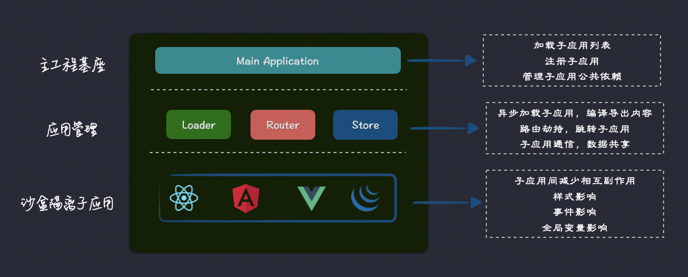

**Github**：[https://github.com/web-infra-dev/garfish](https://github.com/web-infra-dev/garfish)

> 更新: 2024-02-24 16:20:20  
> 原文: <https://www.yuque.com/cuggz/feplus/utqmhlmhdo4upqn0>