# 3D 项目

## 3d
基于 Three.js 的前端 WebGL 页面开发合集，包含冰墩墩、数字城市、3D人像、车模展示、塞尔达传说🗡等一些3D趣味演示页面。

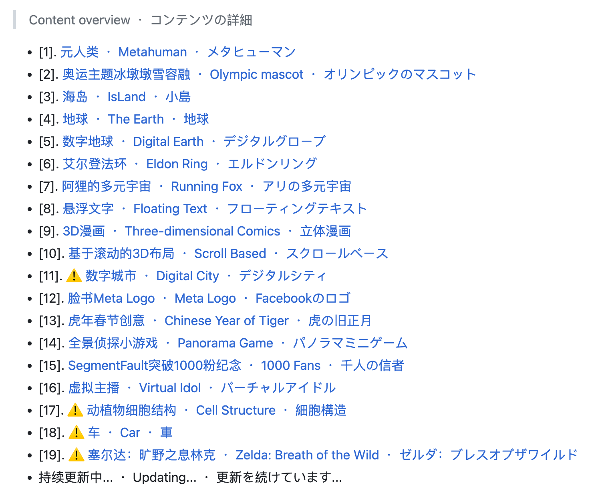

**Github：**[https://github.com/dragonir/3d](https://github.com/dragonir/3d)

## My Room in 3D
用 Three.js 实现的 3D 房间。

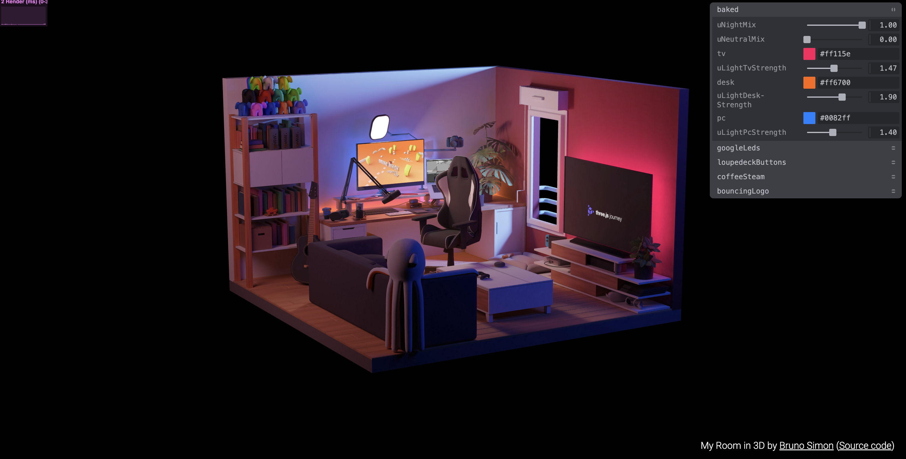

**Github：**[https://github.com/brunosimon/my-room-in-3d](https://github.com/brunosimon/my-room-in-3d)

## Mini Tokyo 3D
用 Three.js 的东京公共交通系统的实时 3D 数字地图。

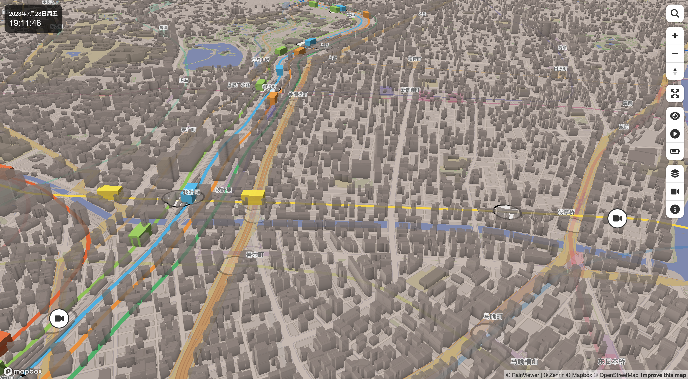

**Github：**[https://github.com/nagix/mini-tokyo-3d](https://github.com/nagix/mini-tokyo-3d)

## three-geo
three-geo是基于three.js的地理可视化库。使用three-geo可以通过简单地指定全球任何地方的GPS坐标来轻松构建具有卫星纹理的3D地形模型，几乎实时更新。地形的几何结构基于Mapbox Maps API提供的RGB编码DEM（数字高程模型）。

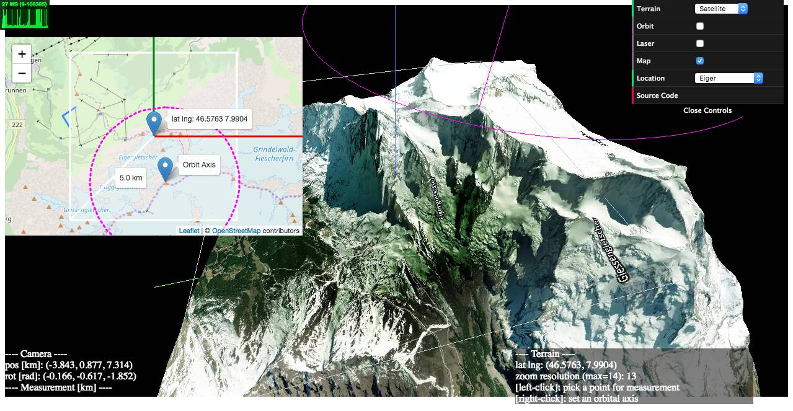

**Github：**[https://github.com/w3reality/three-geo](https://github.com/w3reality/three-geo)

## 3D Blog
用 Three.js 实现的 3D 博客项目，通过开小车找到文章进行阅读。

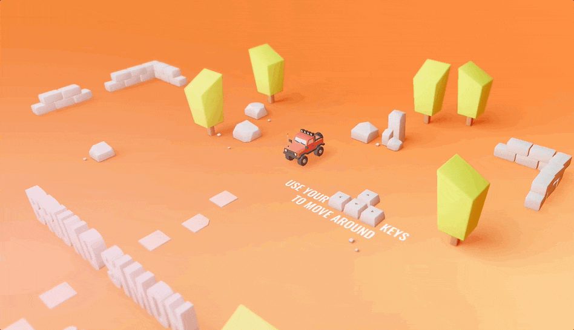

**Github：**[https://github.com/brunosimon/folio-2019](https://github.com/brunosimon/folio-2019)

## Portfolio 2020
使用Three.js和Ammo.js构建的3D互动世界。

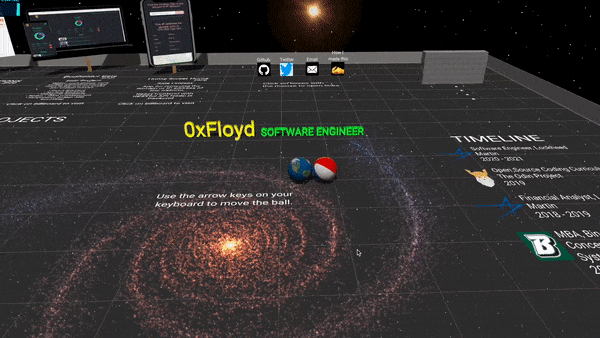

**Github：**[https://github.com/0xFloyd/Portfolio_2020](https://github.com/0xFloyd/Portfolio_2020)

## 2019-nCov-3D
新型冠状病毒疫情数据三维可视化。

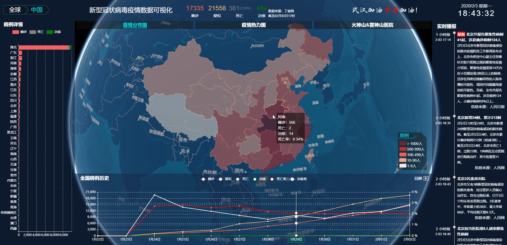

**Github：**[https://github.com/cesiumlab/2019-nCoV-3d](https://github.com/cesiumlab/2019-nCoV-3d)

## vr-hall
基于 threejs 开发的 3D 展厅，展品可以自由摆放，支持 gltf/glb 格式。

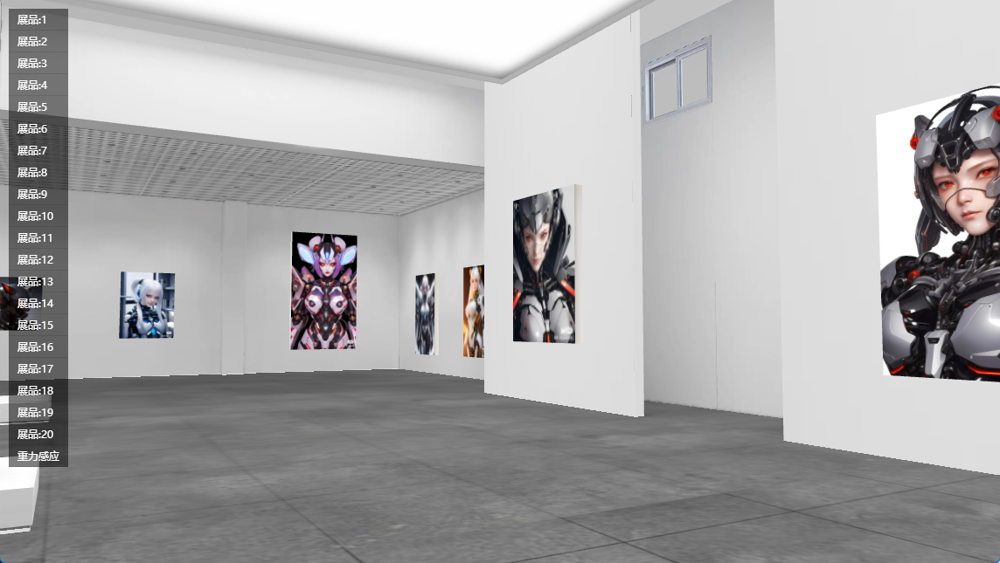

**Github：**[https://github.com/mtsee/vr-hall](https://github.com/mtsee/vr-hall)

## Buzzwords.gg
一款基于 three.js 的文字策略游戏，可以多人游戏对战。

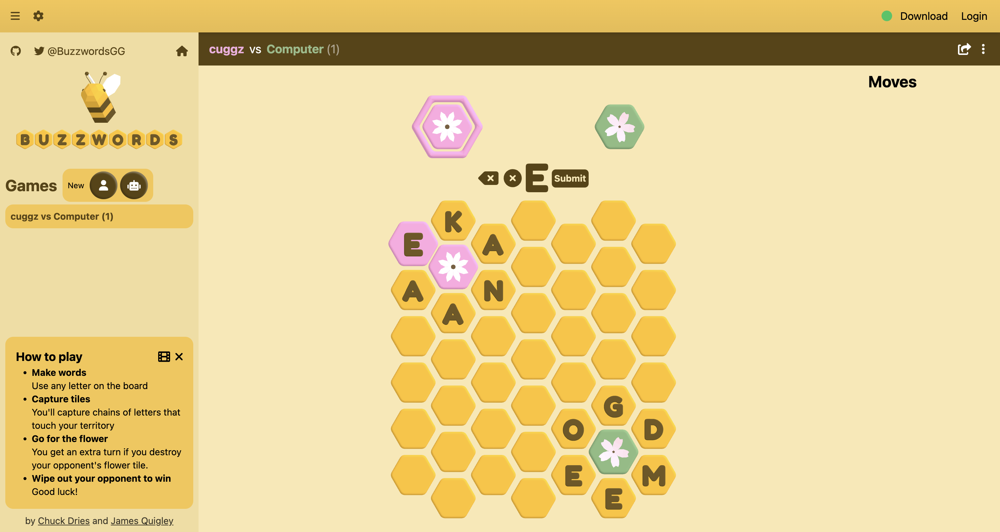

**Github：**[https://github.com/ViciousFish/buzzwords](https://github.com/ViciousFish/buzzwords)

## Celestiary
受 Celestia ( http://shatters.net/celestia ) 启发的天体模拟器，用 JS/ Three.js/GLSL 编写。

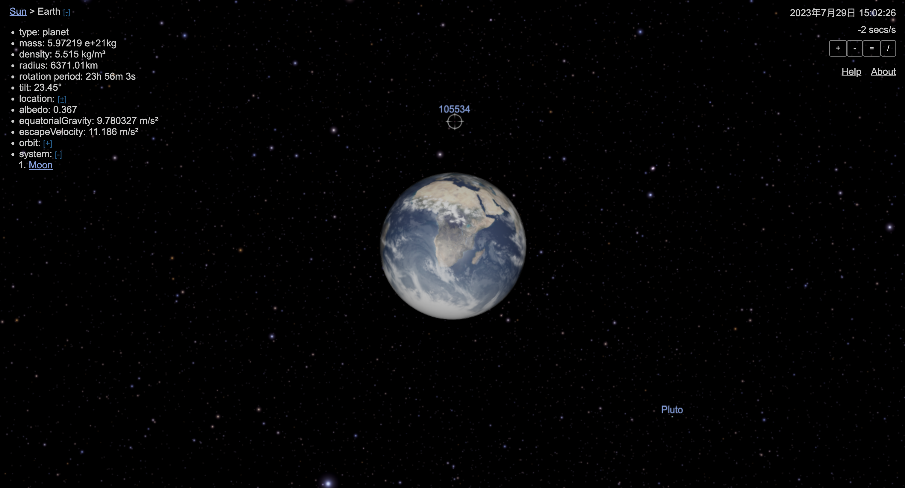

**Github：**[https://github.com/celestiary/web](https://github.com/celestiary/web)

## 蛋仔派对（three.js版）
利用 React + threejs 技术栈构建的第三人称Q版闯关类游戏。

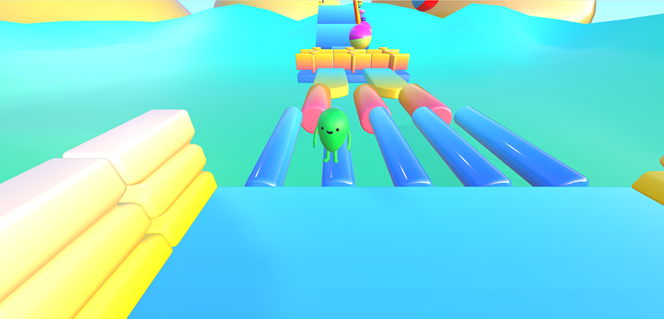

**Github：**[https://github.com/Steve245270533/react-three-egg](https://github.com/Steve245270533/react-three-egg)

## 历史时间线
通过 3D 地球的形式直观地显示各个历史时间段及历史地图。

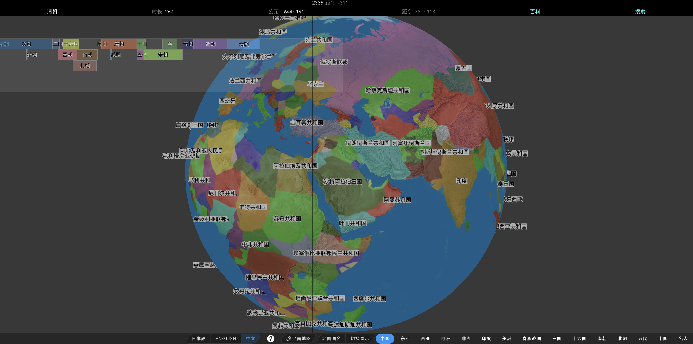

**Github：**[https://github.com/gonnavis/Timeline](https://github.com/gonnavis/Timeline)

## 3D 球体抽奖程序
年会抽奖程序，基于 Express + Three.js 的 3D 球体抽奖程序，奖品，文字，图片，抽奖规则均可配置，抽奖人员信息Excel一键导入，抽奖结果Excel导出，给你的抽奖活动带来全新酷炫体验。

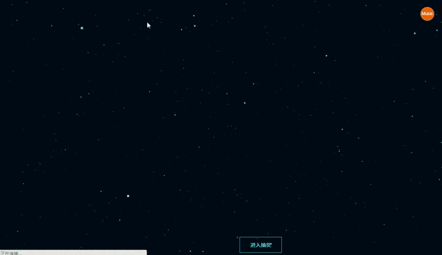

**Github：**[https://github.com/moshang-xc/lottery](https://github.com/moshang-xc/lottery)

## three-sokoban-live
基于 Vite、TypeScript、Three.js 的 3D 推箱子游戏。

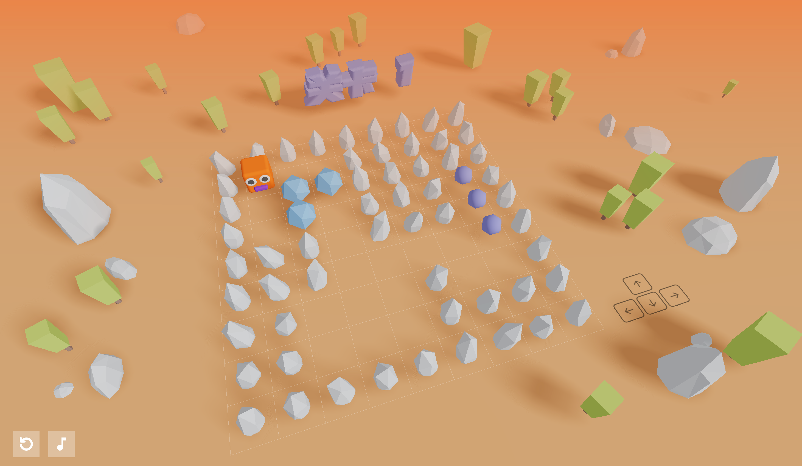

## 3d-earth
使用 Webpack 5 + TypeScript + Threejs 搭建的 3D 地球。

**Github：**[https://github.com/GhostCatcg/3d-earth](https://github.com/GhostCatcg/3d-earth)

## racing-game-cljs
使用 ClojureScript、React 和 ThreeJS 构建的 3D 赛车游戏。

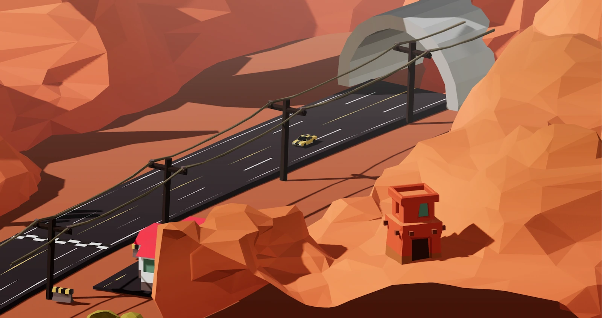

**Github：**[https://github.com/ertugrulcetin/racing-game-cljs](https://github.com/ertugrulcetin/racing-game-cljs)

## T-Rex Run
T-Rex Run 3D 是一款模仿 Google Chrome 霸王龙快跑而制作的 ThreeJS WebGL 游戏。  
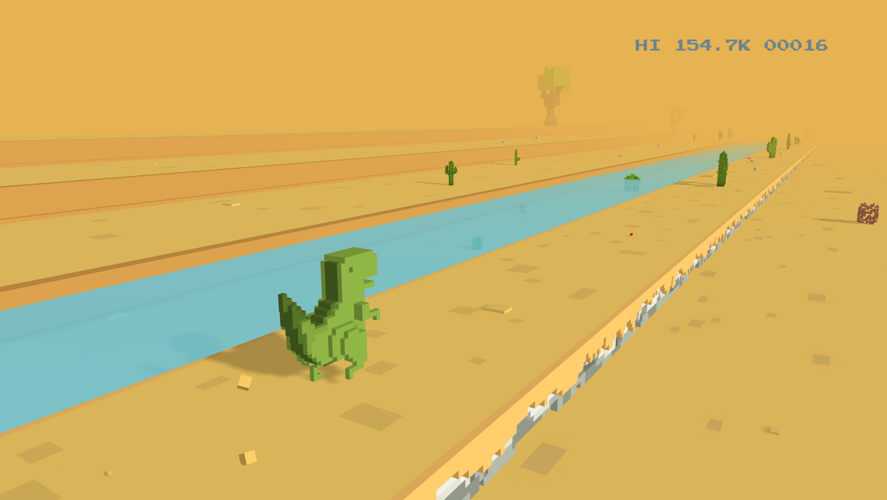

**Github：**[https://github.com/Priler/dino3d](https://github.com/Priler/dino3d)

## Rubik Cube
ThreeJs 制作的魔方游戏，支持自定义魔方阶级（目前界面上只开放 2 - 10 阶魔方）。

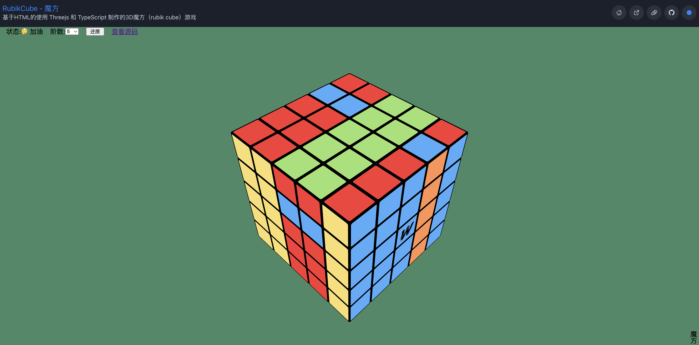

**Github：**[https://github.com/pengfeiw/rubiks-cube](https://github.com/pengfeiw/rubiks-cube)

## 3D 模型查看器
使用 Vue 3 、Three.js 的 3D 模型查看器。

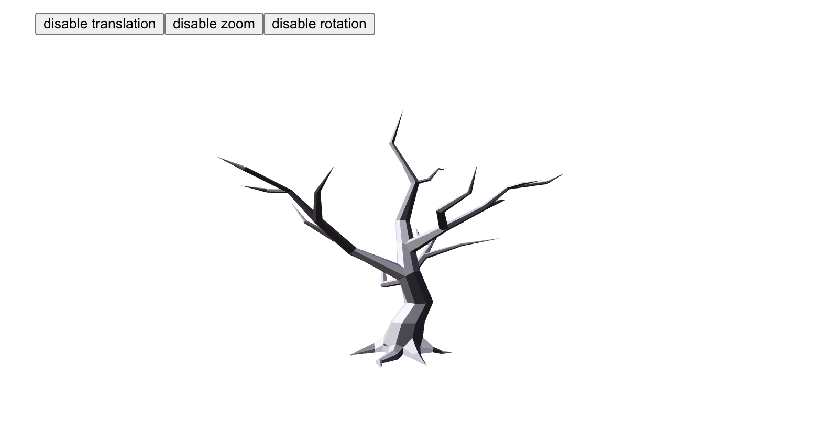

**Github：**[https://github.com/hujiulong/vue-3d-model](https://github.com/hujiulong/vue-3d-model)

## 探索three.js
一个免费的 Three.js 入门书籍：《探索 three.js》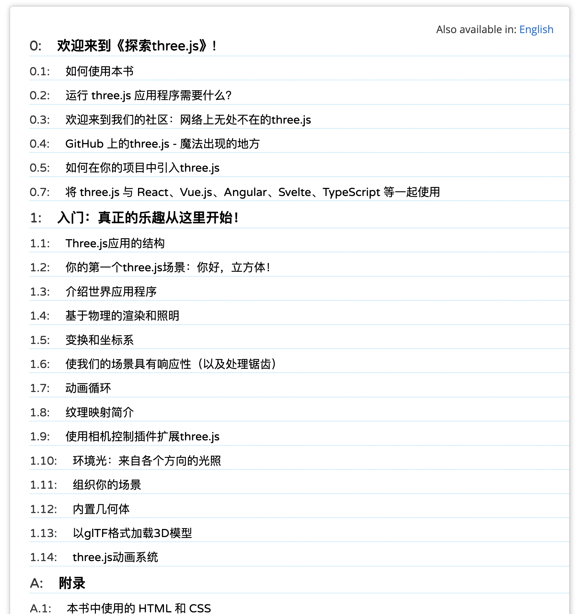

**在线阅读：**[https://discoverthreejs.com/zh/book/](https://discoverthreejs.com/zh/book/)

> 更新: 2024-03-13 22:03:25  
> 原文: <https://www.yuque.com/cuggz/feplus/bg3q8qoqqwk2ddnw>