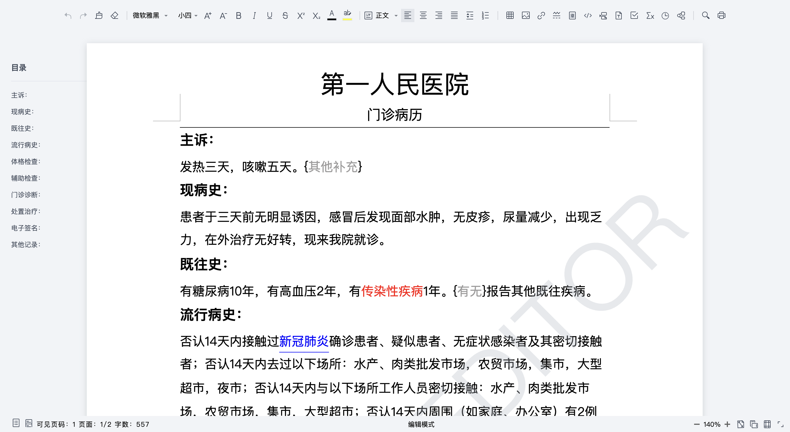
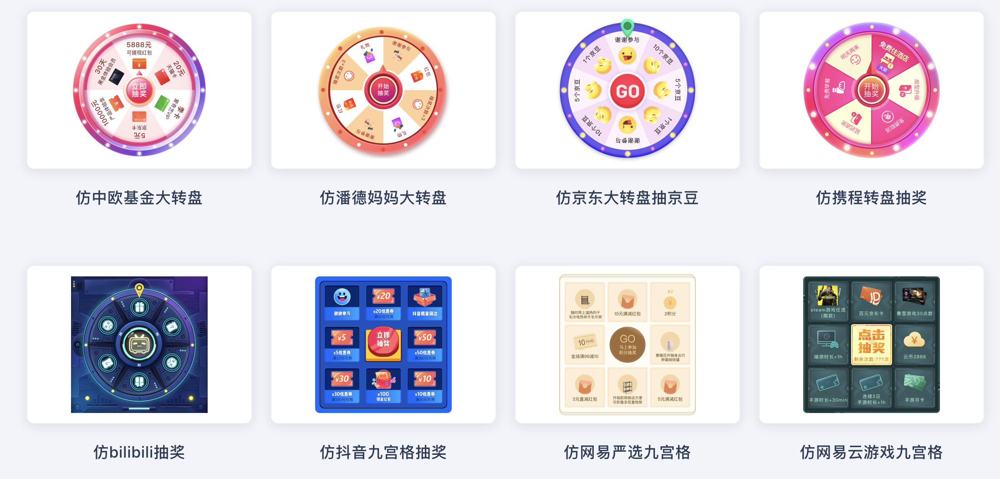
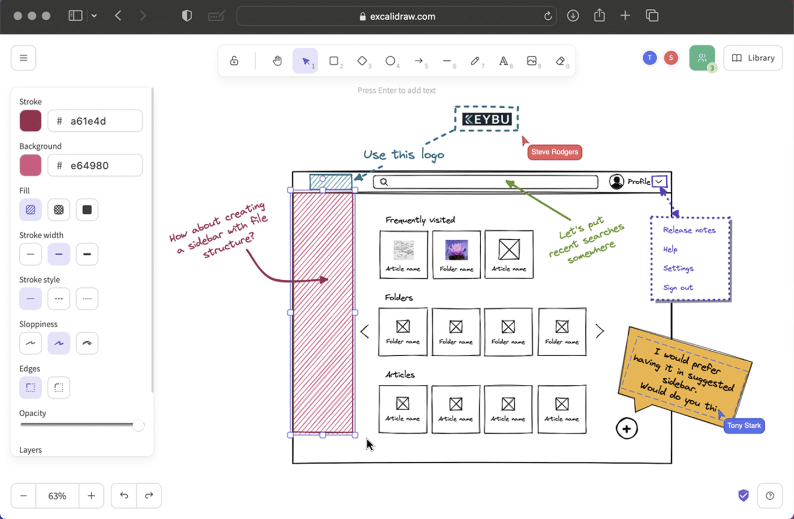
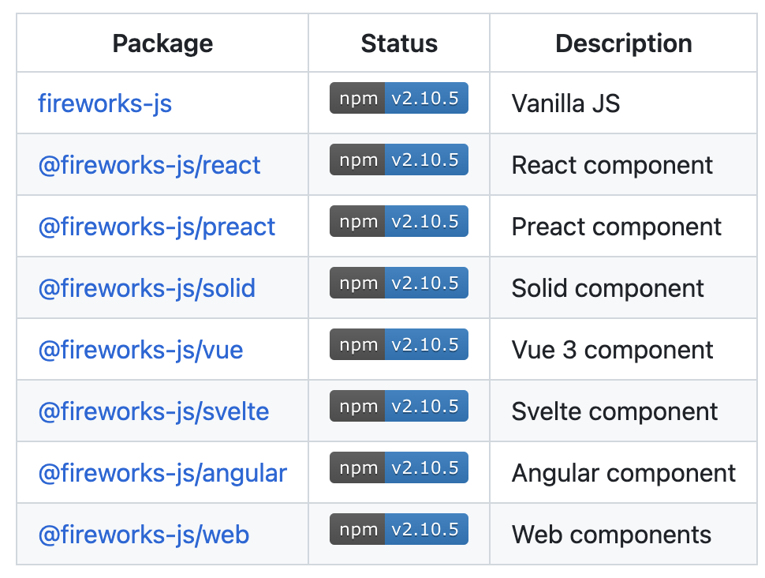
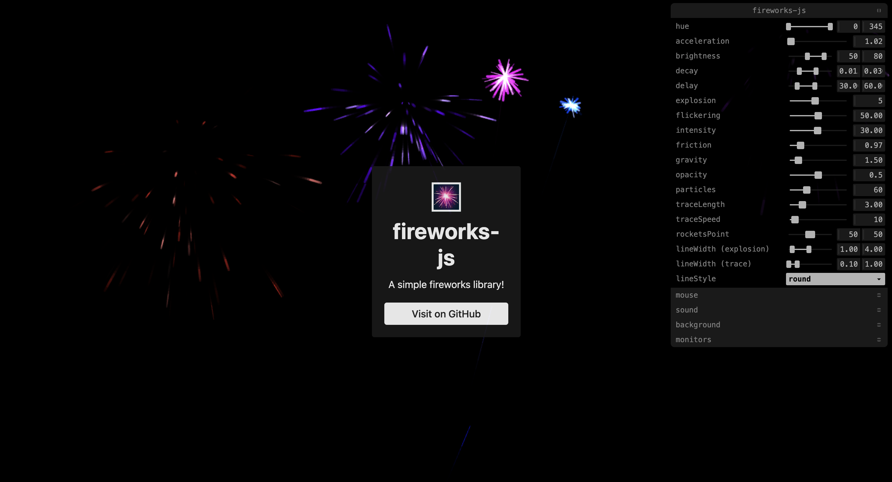
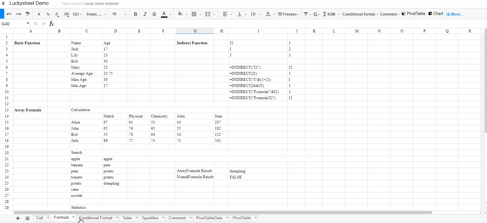
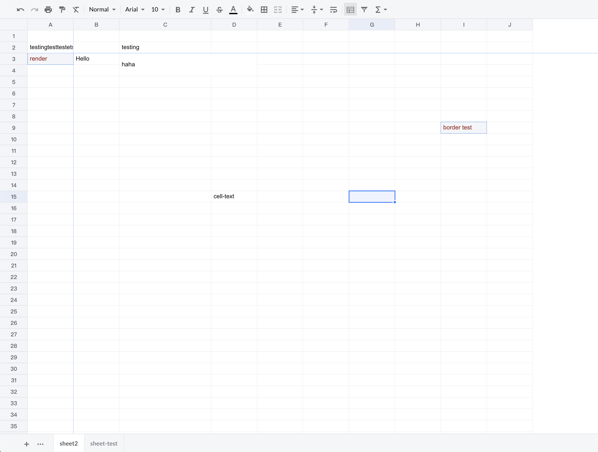
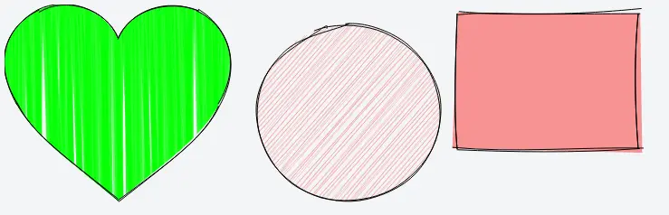
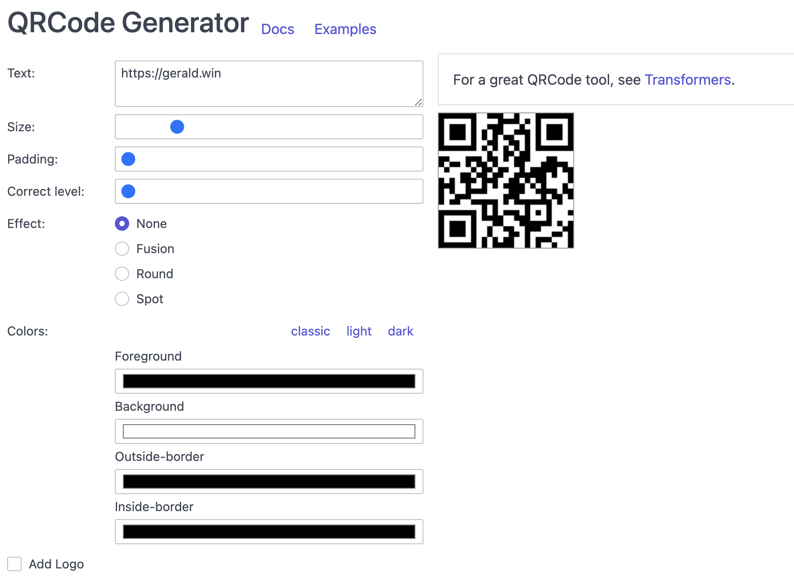

# Canvas 项目

在 Web 开发中，Canvas 是一个强大的绘图工具，可以实现各种有趣的交互效果和动态图形。本文将盘点 10 个基于 Canvas 的开源项目，旨在为提供开发灵感和思路，以便更好地探索并应用 Canvas 技术！

## canvas-editor
canvas-editor是一个基于canvas/svg的富文本编辑器，类似于 word。其具有以下特点：

+ **所见即所得**：类word可分页，所见即所得
+ **轻量的数据结构**：一段JSON即可呈现复杂样式
+ **丰富的功能**：支持常见富文本操作、表格、水印、控件、公式等
+ **使用方便**：官方发布核心npm包，菜单栏、工具栏可自行维护
+ **灵活的开发机制**：通过接口可获取生命周期、事件回调、自定义右键菜单、快捷键等
+ **完全类型化的API**：灵活的 API 和完整的 TypeScript 类型

**Github：**[https://github.com/Hufe921/canvas-editor](https://github.com/Hufe921/canvas-editor)

## lucky-canvas
基于 TS + Canvas 开发的【大转盘 / 九宫格 / 老虎机】抽奖插件，一套源码适配多端框架 JS / Vue / React / Taro / UniApp / 微信小程序等，奖品 / 文字 / 图片 / 颜色 / 按钮均可配置，支持同步 / 异步抽奖，概率前 / 后端可控，自动根据 dpr 调整清晰度适配移动端。

**Github：**[https://github.com/buuing/lucky-canvas](https://github.com/buuing/lucky-canvas)

## Excalidraw
Excalidraw是一款开源的在线白板工具，主要用于创建简单直观的图形和草图，支持共享和协作。以下是 Excalidraw 的主要特点：

+ 简单易用：具有直观简单的界面和操作方式，用户可以轻松创建和编辑图形，并实现各种设计需求。
+ 实时协作：支持多人实时协作，用户可以与其他人一起编辑和讨论，在线完成协作任务。
+ 自由绘制和对象管理：提供了自由绘制、文本框、箭头、线段、矩形、椭圆、图标等多种基本对象，并支持对这些对象进行移动、复制、旋转、缩放、对齐等操作，帮助用户实现更为精细的设计。
+ 高度灵活性：支持导出为SVG、PNG、Clipboard等多种格式，方便用户进行分享和保存。

**Github：**[https://github.com/excalidraw/excalidraw](https://github.com/excalidraw/excalidraw)

## fireworks-js
fireworks-js 是一个基于 Canvas 的动画库，用于在网页上制作烟花特效。该库的特点如下：

+ 轻量级：fireworks-js 体积小，不依赖其他库或框架，易于集成。
+ 易于使用：只需几行代码就可以创建出炫目的烟花特效，具有良好的可定制性和可扩展性。
+ 动画效果逼真：fireworks-js 采用粒子系统实现烟花特效，能够模拟出逼真的爆炸、飞溅和星光等效果。
+ 浏览器兼容性良好：可以在主流的现代浏览器上运行，支持多种设备和分辨率，包括移动端。

该项目提供了多种框架的实现：

**Github：**[https://github.com/crashmax-dev/fireworks-js](https://github.com/crashmax-dev/fireworks-js)

## Luckysheet
Luckysheet ，一款纯前端基于 Canvas 的类似 excel 的在线表格，功能强大、配置简单、完全开源。其具有以下功能：

+ **格式**：样式、条件格式、文本对齐和旋转、文本截断、溢出、自动换行、多种数据类型、单元格分割样式
+ **单元格**：拖放、填充柄、多选、查找和替换、定位、合并单元格、数据验证
+ **行和列**：隐藏、插入、删除行或列、冻结和拆分文本
+ **操作**：撤消、重做、复制、粘贴、剪切、热键、格式刷、拖放选择
+ **公式和函数**：内置、远程和自定义公式
+ **表**：过滤、排序
+ **增强功能**：数据透视表、图表、评论、协同编辑、插入图片、矩阵计算、截图、复制为其他格式、EXCEL导入导出等。

**Github：**[https://github.com/dream-num/Luckysheet](https://github.com/dream-num/Luckysheet)

## x-spreadsheet
x-spreadsheet 是一个基于 Web(es6) canvas 构建的轻量级 Excel 开发库。其具有以下特点：

+ 轻量级：完整功能，包含所有插件。代码打包后只不到 200kb
+ 易于使用：如果只需要一些简单的功能可以零配置
+ 数据驱动：调整数据非常的简单快捷

**Github：**[https://github.com/myliang/x-spreadsheet](https://github.com/myliang/x-spreadsheet)

## rough
Rough.js 是一个轻量级的（大约 8k），基于 Canvas 的可以绘制出粗略的手绘风格的图形库。该库提供绘制线条、曲线、弧线、多边形、圆形和椭圆的基础能力，同时支持绘制 SVG 路径。除此之外，Rough.js 还提供了大量的可自定义选项，可以调整线宽、线条颜色、填充颜色、字体样式、背景颜色等，以使图形更加个性化。

**Github：**[https://github.com/rough-stuff/rough](https://github.com/rough-stuff/rough)

## Signature Pad
Signature Pad 是一个基于 Canvas 实现的签名库，用于绘制签名。它可以在所有现代桌面和移动浏览器中使用，不依赖于任何外部库。Signature Pad提供了许多可自定义的选项，如笔画颜色、粗细、背景色、画布大小、签名格式等，可以轻松实现不同的签名风格和功能。

**Github：**[https://github.com/szimek/signature_pad](https://github.com/szimek/signature_pad)

## canvas-confetti
canvas-confetti 是一个基于 Canvas 的库，用于在 Web 页面中实现炫酷的彩色纸屑动画效果。它实现了高性能、流畅的纸屑动画效果，同时兼容各种现代浏览器。提供了许多可自定义的选项，如纸屑颜色、形状、数量、速度、角度、发射器位置等，可以轻松实现不同的纸屑效果。并支持多种触发方式，如点击按钮、滚动页面、定时触发等，可根据需求进行定制。

**Github：**[https://github.com/catdad/canvas-confetti](https://github.com/catdad/canvas-confetti)

## QRCanvas
QRCanvas 是一个基于 canvas 的 JavaScript 二维码生成工具。其具有以下特点：

+ 仅依赖 canvas，兼容性好
+ 简单，仅仅是需要一些数据的配置
+ 定制化功能丰富
+ 支持 Node.js
+ 方便在 React 和 Vue 中使用
+ 支持所有主流的浏览器

**Github：**[https://github.com/gera2ld/qrcanvas](https://github.com/gera2ld/qrcanvas)

> 更新: 2023-06-04 00:09:55  
> 原文: <https://www.yuque.com/cuggz/feplus/eo9wqhn4ess8pfa9>