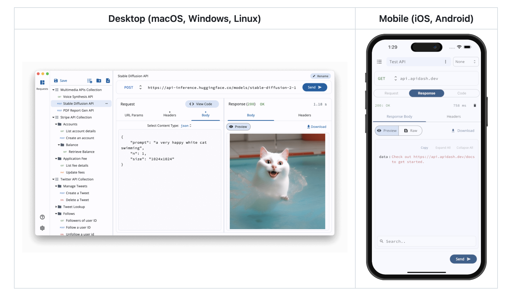
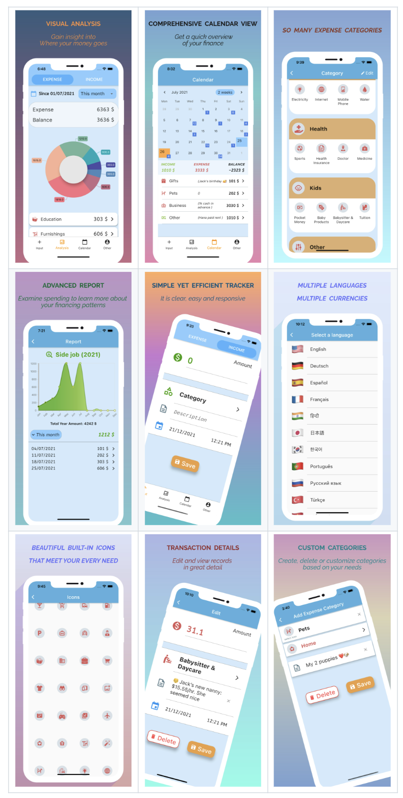
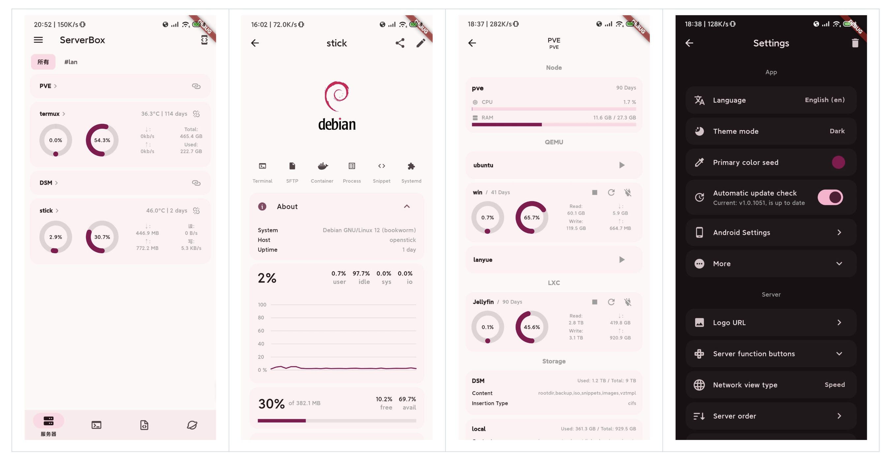
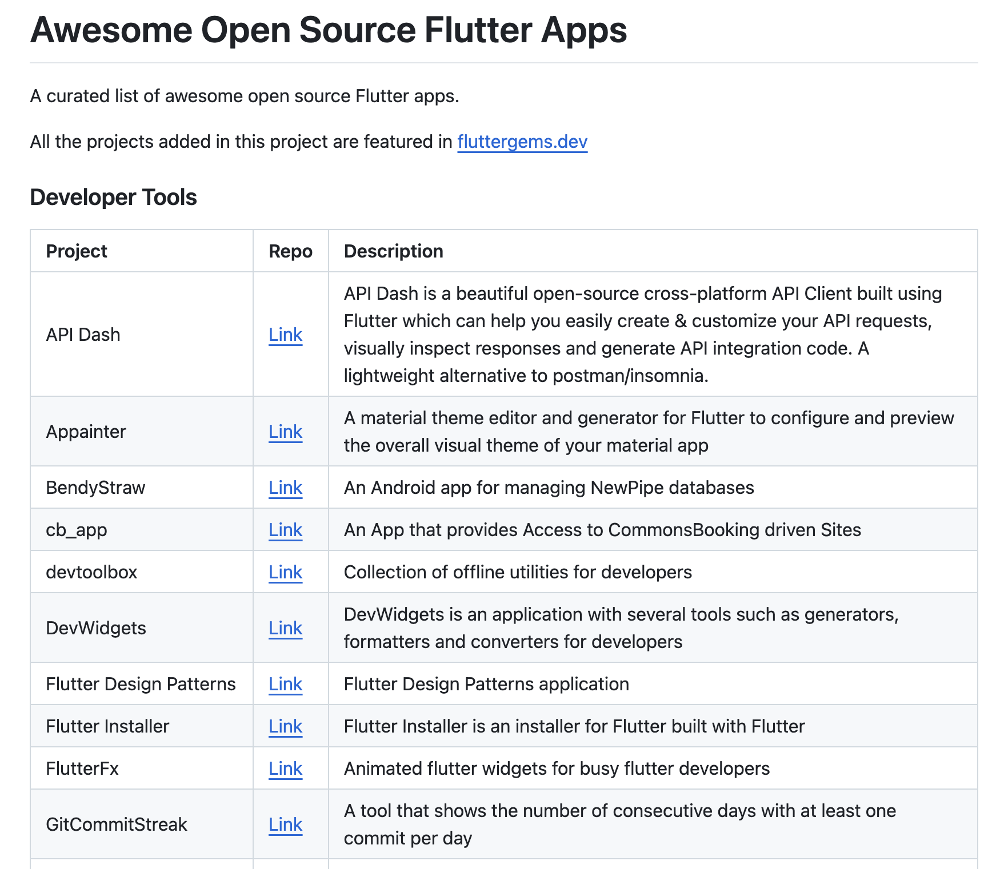

# Flutter 项目

## AIdea
AIdea 是一款支持 GPT 以及国产大语言模型通义千问、文心一言等，支持 Stable Diffusion 文生图、图生图、 SDXL1.0、超分辨率、图片上色的全能型 APP。

**Github：**[https://github.com/mylxsw/aidea](https://github.com/mylxsw/aidea)

## API Dash
API Dash 是一个使用 Flutter 构建的漂亮且开源的跨平台 API 客户端，它可以轻松创建和自定义 API 请求，可视化检查响应并生成 API 集成代码。它支持 macOS、Windows、Linux、Android 和 iOS 系统，是 Postman 和 Insomnia 的一个轻量级替代方案。

**Github：**[https://github.com/foss42/apidash](https://github.com/foss42/apidash)

## MMAS
一个基于 Flutter 的用于日常消费跟踪和财务管理的应用。

**Github：**[https://github.com/floranguyen0/mmas-money-tracker](https://github.com/floranguyen0/mmas-money-tracker)

## Bloomee
Bloomee 是一款跨平台开源音乐播放器，旨在为你带来来自各种来源的无广告音乐。

**Github：**[https://github.com/HemantKArya/BloomeeTunes](https://github.com/HemantKArya/BloomeeTunes)

## AppFlowy
AppFlowy 是一款知识库和任务管理工具，其灵感来源于 Notion，但区别在于它允许用户掌控自己的数据，并提供了丰富的个性化选项。

**Github：**[https://github.com/AppFlowy-IO/AppFlowy](https://github.com/AppFlowy-IO/AppFlowy)

## 仿斗鱼
一个基于 Flutter 的仿斗鱼 App 应用。

**Github：**[https://github.com/yukilzw/dy_flutter](https://github.com/yukilzw/dy_flutter)

## 仿豆瓣
一个基于 Flutter 的仿豆瓣客户端应用，90% 还原豆瓣。包含首页、书影音、小组、市集及个人中心等。

**Github：**[https://github.com/kaina404/FlutterDouBan](https://github.com/kaina404/FlutterDouBan)

## 仿瑞幸
一个基于 Flutter 的仿瑞幸 APP 项目。

**Gitee：**[https://gitee.com/meetqy/flutter_luckin_coffee](https://gitee.com/meetqy/flutter_luckin_coffee)

## Flutter Server Box
一款使用 Flutter 开发的 Linux 服务器工具箱，提供服务器状态图表和管理工具。

**Github：**[https://github.com/lollipopkit/flutter_server_box](https://github.com/lollipopkit/flutter_server_box)

## Awesome Open Source Flutter Apps
精选的优秀开源 Flutter 应用列表。

**Github：**[https://github.com/fluttergems/awesome-open-source-flutter-apps](https://github.com/fluttergems/awesome-open-source-flutter-apps)

> 更新: 2024-11-30 15:20:59  
> 原文: <https://www.yuque.com/cuggz/feplus/zykko3kmtamihnv7>