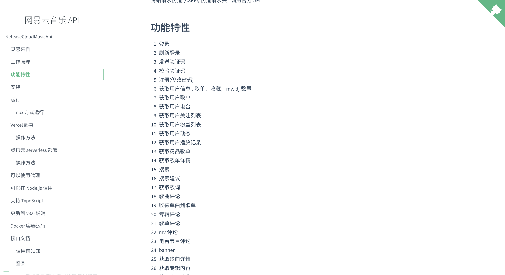
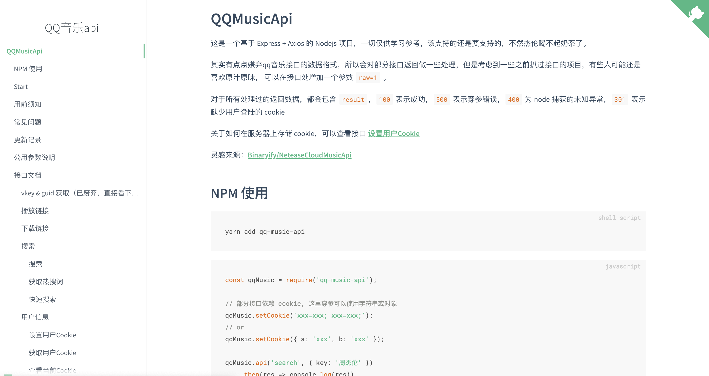
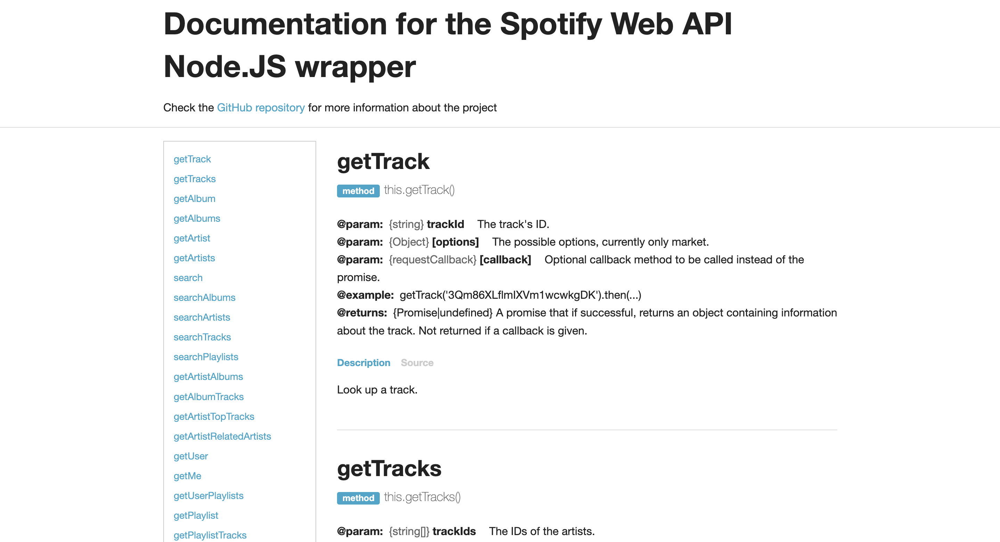
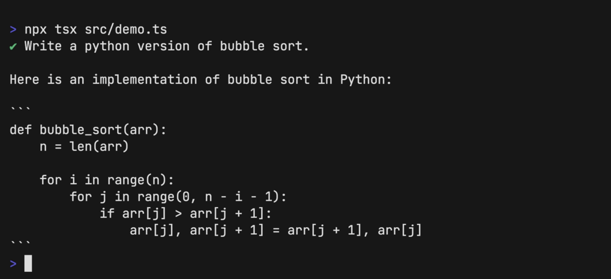
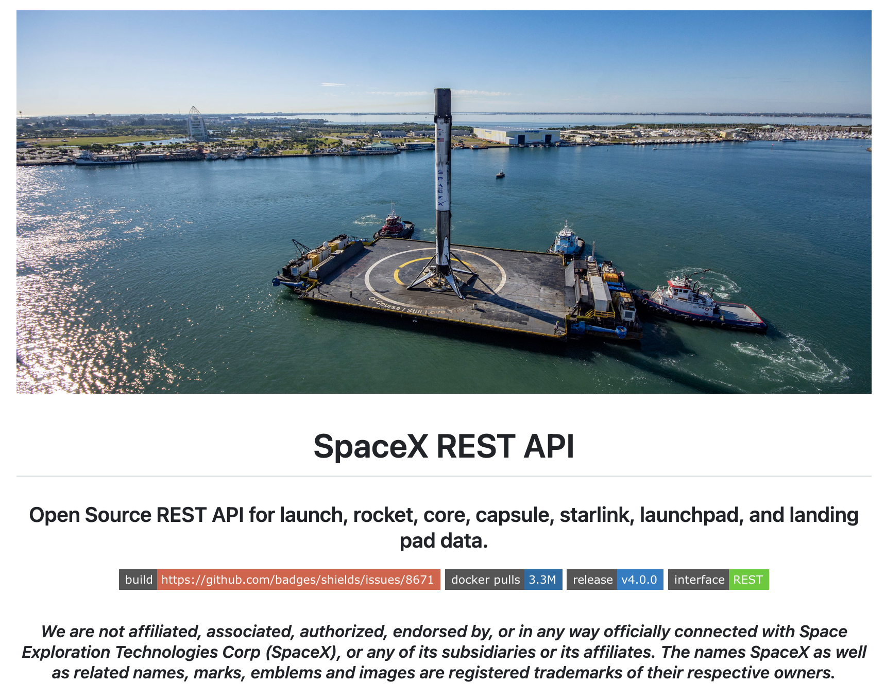
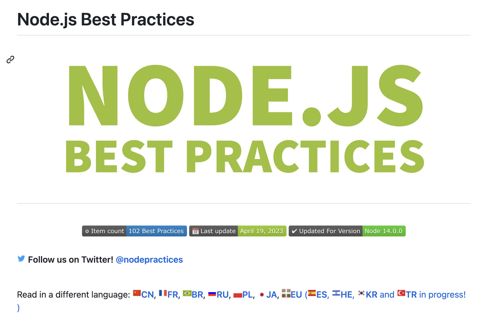
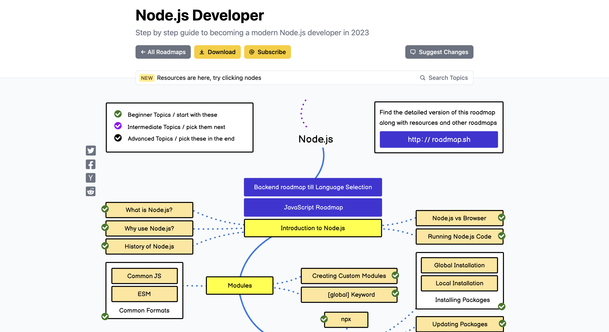
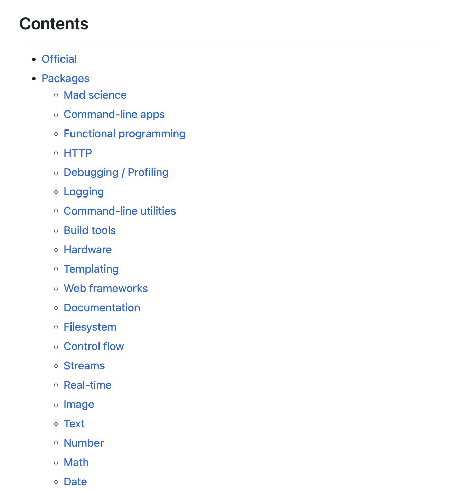

# Node.js项目

## 网易云音乐 API

一个基于 Node.js 的网易云音乐 API 服务。通过该项目，开发者可以方便地对网易云音乐进行各种操作，例如搜索歌曲、获取歌曲信息和评论、获取用户信息和播放列表等等。该项目提供了完整的文档供开发者参考，提供了超过250个接口。

**Github：**<https://github.com/Binaryify/NeteaseCloudMusicApi>

## 饿了么 API

一个基于 Node.js + MongoDB + Express + Mongoose + Vue + Element UI 的前后端分离的 Web 应用项目，是一个仿照饿了么的外卖点餐系统。整个项目分为两部分：前台项目接口、后台管理接口，共60多个。涉及登陆、注册、添加商品、商品展示、筛选排序、购物车、下单、用户中心等，构成一个完整的流程。

**Github：**<https://github.com/bailicangdu/node-elm>

## QQ音乐 API

基于 Express + Axios 的 QQ音乐接口 nodejs 版，开发者可以方便地对 QQ 音乐进行各种操作，例如搜索歌曲、获取歌曲信息和评论、获取用户信息和播放列表等。

**Github：**<https://github.com/jsososo/QQMusicApi>

## Spotify API

一个可以运行在 Node.JS 和浏览器上的 Spotify Web API 通用封装库/客户端，使用了 browserify/webpack/rollup 进行打包。该项目提供了音乐数据、音乐简介、搜索、播放列表操作、音乐库、个性化、浏览、播放器、跟随、身份验证等功能 API。

**Github：**<https://github.com/thelinmichael/spotify-web-api-node>

## ChatGPT API

一个基于 OpenAI 的 ChatGPT 生成式对话模型的 Web API。该项目使用 TypeScript 和 Express.js 构建。通过该项目，开发者可以快速地搭建自己的聊天机器人，以及实现其他基于 ChatGPT 的自然语言处理应用。

**Github：**<https://github.com/transitive-bullshit/chatgpt-api>

## SpaceX REST API

一个开源的 SpaceX 公司的 RESTful API，该项目提供了关于 SpaceX 发射、船只、火箭、任务等各种数据的接口。该项目的目的是为开发者提供 SpaceX 公司的数据，方便开发者进行相关应用的开发。同时，该项目还提供了文档和使用示例，方便开发者快速上手使用。

**Github：**<https://github.com/r-spacex/SpaceX-API>

## Node.js 最佳实践

Node.js 最佳实践指南，旨在帮助开发者编写更加健壮、安全和易于维护的 Node.js 应用程序。它提供了一系列的最佳实践、原则和代码示例，涵盖了从工程结构、代码组织、错误处理和日志记录等方面的内容。

该项目通过将最佳实践分类为 8 个模块，为开发者提供了一个全面的指南，帮助编写高质量的 Node.js 代码。这些模块包括：

* 项目结构实践
* 异常处理实践
* 编码规范实践
* 测试和总体质量实践
* 进入生产实践
* 安全实践
* 性能实践
* Docker实践

**Github：**<https://github.com/goldbergyoni/nodebestpractices>

## Node.js 调试指南

一个面向 Node.js 调试的开源项目，旨在帮助开发者更好地理解和利用 Node.js 的调试工具。该项目提供了一组示例代码和指南，覆盖了 Node.js 内置的调试器、Chrome DevTools 和 VSCode 等常见的调试工具。

通过学习该项目，开发者可以了解 Node.js 调试器的基本用法，包括如何使用 `--inspect` 命令行参数启动 Node.js 应用程序，以及如何使用 Chrome DevTools 或者 VSCode 连接到 Node.js 调试会话。项目还提供了一些进阶内容，例如如何使用调试器进行内存分析和 CPU 分析等。

此外，该项目中的示例代码非常实用，包含了许多调试场景下的代码示例，例如如何在调试过程中打断点、如何使用条件断点、如何在调试期间修改变量值、如何跟踪异步代码等。

**Github：**<https://github.com/nswbmw/node-in-debugging>

## Nodejs-Roadmap

一个社区驱动的学习资源，旨在帮助开发者系统学习成为现代化的 Node.js 开发者。通过该项目，开发者可以获得一份完整的学习路线图，学习从基础到进阶的全部内容。该路线图覆盖了从 Node.js 基础知识、模块和包管理、异步编程和事件循环、Web 开发、网络协议和安全、性能和可伸缩性等方面的内容。

**Github：**<https://github.com/kamranahmedse/developer-roadmap>

## Awesome Node.js

一个开源的收录 Node.js 生态系统各种资源的项目，其中包括了 Node.js 框架、库、工具、文档和文章等各个方面，是一个非常受欢迎和权威的 Node.js 资源收集项目。

**Github：**<https://github.com/sindresorhus/awesome-nodejs>

> 更新: 2023-04-28 14:53:22  
> 原文: <https://www.yuque.com/cuggz/feplus/heudugk0rodadk2s>