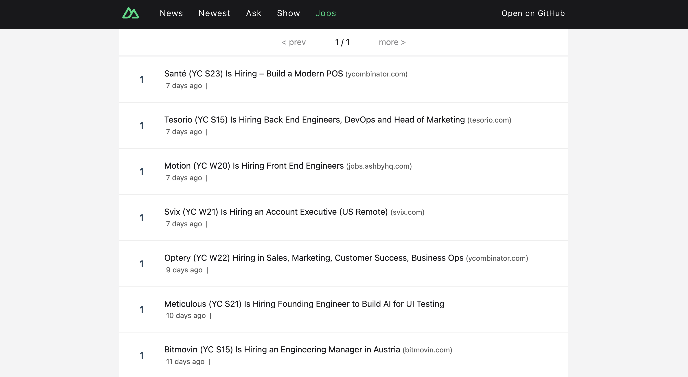
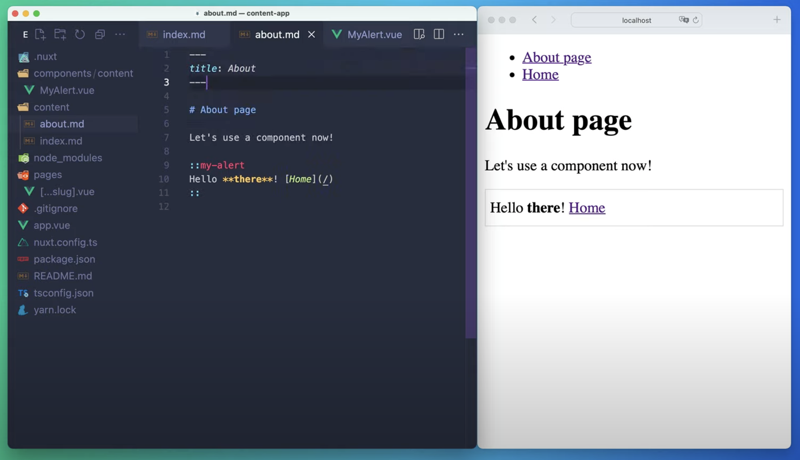

# Nuxt 官方项目

## Nuxt Movies
Nuxt Movies 是一个使用 Nuxt 3、Vue 3、UnoCSS、[Image Module](https://v1.image.nuxtjs.org/)、[The Movie Database API](https://www.themoviedb.org/) 和 TypeScript 构建的电影应用，其包含了电影列表、电影详情、演员详情、影片搜索、相关推荐等功能。Nuxt Movies 采用了服务端渲染（SSR）技术，同时也支持使用 PWA 技术使网站更加快速地加载和缓存内容。

**在线演示**：[https://movies.nuxt.space/](https://movies.nuxt.space/)

**Github：**[https://github.com/nuxt/movies](https://github.com/nuxt/movies)

## Nuxt Hacker News
Nuxt Hacker News 是一个使用 Nuxt 构建的 HackerNews 克隆，其具有以下特点：

+ 服务端渲染
+ 基于 Vite 的热更新（HMR）开发环境
+ 无需配置即可在任何地方部署（如 Vercel、Netlify、Cloudflare 等） ，由 Nitro 提供支持
+ 代码分割
+ JS + DNS + Data 的预取/预加载功能

**在线演示**：[https://hn.nuxt.space/](https://hn.nuxt.space/)

**Github**：[https://github.com/nuxt/hackernews](https://github.com/nuxt/hackernews)

## Nuxt Content
Nuxt Content 是 Nuxt.js 官方维护的一个用于快速构建静态网站的应用。它是基于 Vue.js 和 Markdown 的，可以轻松地将 Markdown 文件转换为渲染的 HTML 页面并在 Nuxt.js 应用中使用。其具有以下特性：

+ **使用 Nuxt 3 构建**：利用 Nuxt 3 的特性：Vue 3、自动导入、Vite 和 Nitro 服务器。
+ **基于文件的 CMS**：用 Markdown、YML、CSV 或 JSON 编写内容，并在组件中查询它。
+ **查询生成器**：使用类似 MongoDB 的 API 查询内容，以便在正确的时间获取正确的数据。
+ **MDC 语法**：在 Markdown 文件中使用 Vue 组件，支持 props、插槽和嵌套组件。
+ **代码高亮**：使用支持 VS Code 主题的 Shiki 集成在网站上显示漂亮的代码块。
+ **随处部署**：Nuxt Content 支持静态或节点服务器托管。

**Github：**[https://github.com/nuxt/content](https://github.com/nuxt/content)

> 更新: 2023-07-17 16:06:17  
> 原文: <https://www.yuque.com/cuggz/feplus/uop797s24nk5b3ex>