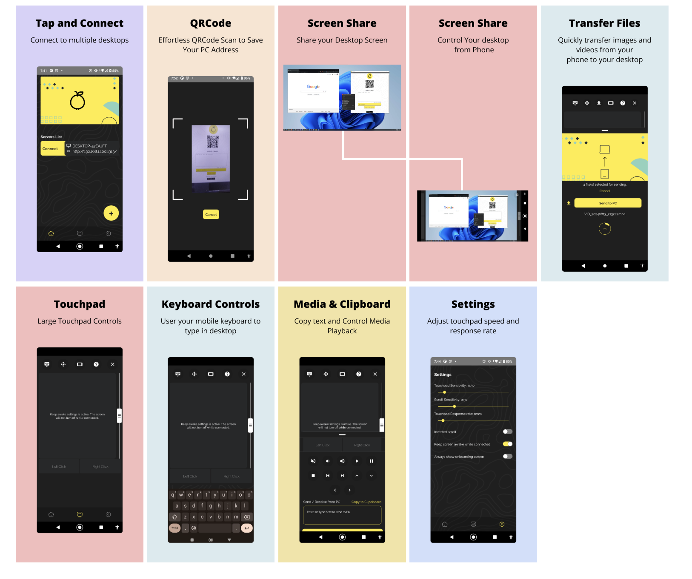
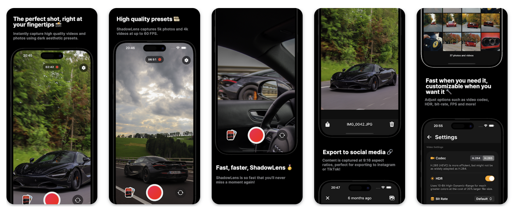

# React Native 项目

## Hey Linda
一个开源免费的冥想应用，使用 React Native 和 Expo 开发。

**Github：**[https://github.com/heylinda/heylinda-app](https://github.com/heylinda/heylinda-app)

## Bluesky
Bluesky 是一个去中心化的社交应用。

**Gitub：**[https://github.com/bluesky-social/social-app](https://github.com/bluesky-social/social-app)

## 洛雪音乐
一个基于 React Native 开发的音乐软件。

  
**Github：**[https://github.com/lyswhut/lx-music-mobile](https://github.com/lyswhut/lx-music-mobile)

## DevHub
DevHub 是一款移动和桌面应用，用于管理 GitHub 通知并掌握存储库活动。得益于React Native + React Native Web，它们之间可实现95% 以上的代码共享。

**Github：**[https://github.com/devhubapp/devhub](https://github.com/devhubapp/devhub)

## MusicFree
一个插件化、定制化、无广告的免费音乐播放器，目前支持 Android 和 Harmony OS，项目使用 React Native 开发。

**Github：**[https://github.com/maotoumao/MusicFree](https://github.com/maotoumao/MusicFree)

## Joplin
一个专注于隐私的笔记和待办事项的应用，适用于 Linux、Windows、macOS、Android 和 iOS 平台。其 App 使用 React Native 开发。

**Github：**[https://github.com/laurent22/joplin](https://github.com/laurent22/joplin)

## Peyara
使用 Peyara Remote Mouse 可以将手机变成无线鼠标和键盘组合。

**Github：**[https://github.com/ayonshafiul/peyara-mouse-client](https://github.com/ayonshafiul/peyara-mouse-client)

## VisionCamera
VisionCamera 并不是一个 App，而是一个功能丰富的相机库，用于 React Native 项目开发。

**GitHub：**[https://github.com/mrousavy/react-native-vision-camera](https://github.com/mrousavy/react-native-vision-camera)

> 更新: 2024-12-14 21:41:00  
> 原文: <https://www.yuque.com/cuggz/feplus/xrd1wthinvk4xdt4>