# React 资源

## 1. **Awesome React**
关于 React 生态系统的一系列很棒的资源。

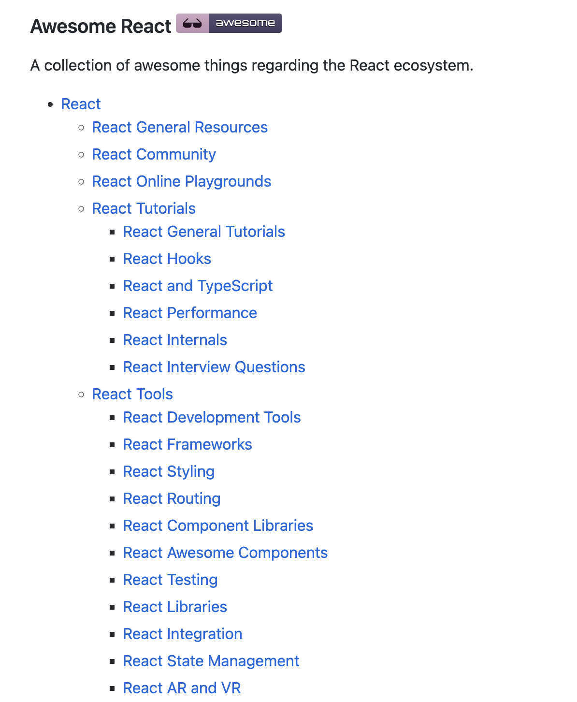

**Github：**[https://github.com/enaqx/awesome-react](https://github.com/enaqx/awesome-react)

## 2. React in patterns
React in patterns是介绍React开发设计模式和技术的免费开源书籍。该书提供了简体中文版本。

**Github：**[https://github.com/krasimir/react-in-patterns](https://github.com/krasimir/react-in-patterns)

## 3. 30 Days Of React
30 Days Of React 是在 30 天内学习 React 的分步指南。它需要 HTML、CSS 和 JavaScript 知识。在开始 React 之前，应该熟悉 JavaScript。

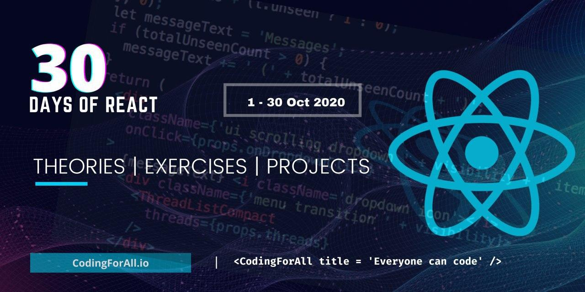

**Github：**[https://github.com/Asabeneh/30-Days-Of-React](https://github.com/Asabeneh/30-Days-Of-React)

## 4. Real world React apps
现实世界的 React 应用程序及其开源代码库，供开发人员学习。该库包含了51个React开源项目。

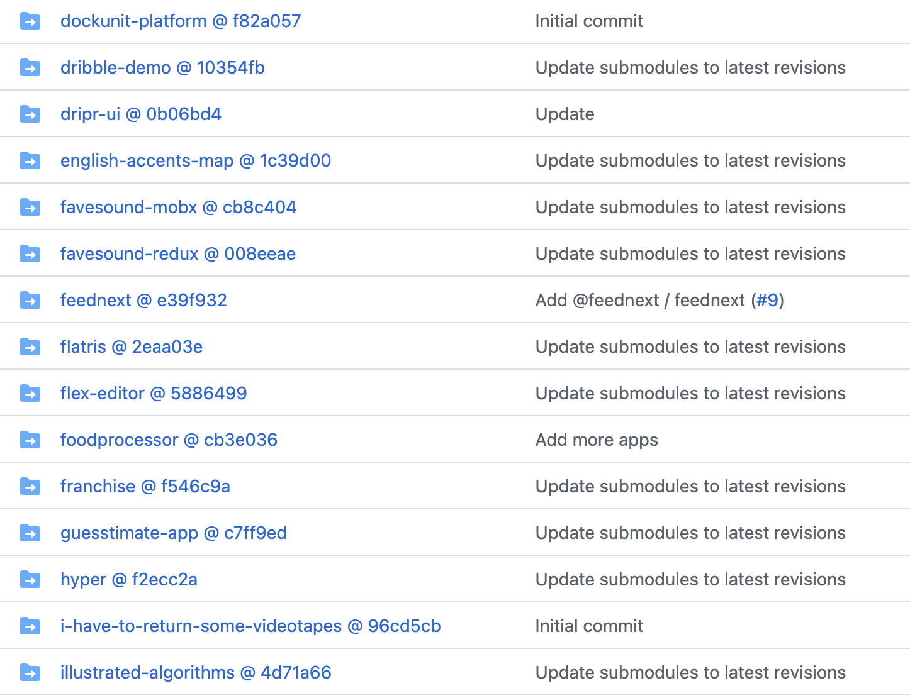

**Github：**[https://github.com/jeromedalbert/real-world-react-apps](https://github.com/jeromedalbert/real-world-react-apps)

## 5. React Bits
React Bits 包含 React 设计模式、技术、技巧和窍门，该库也提供了中文版。

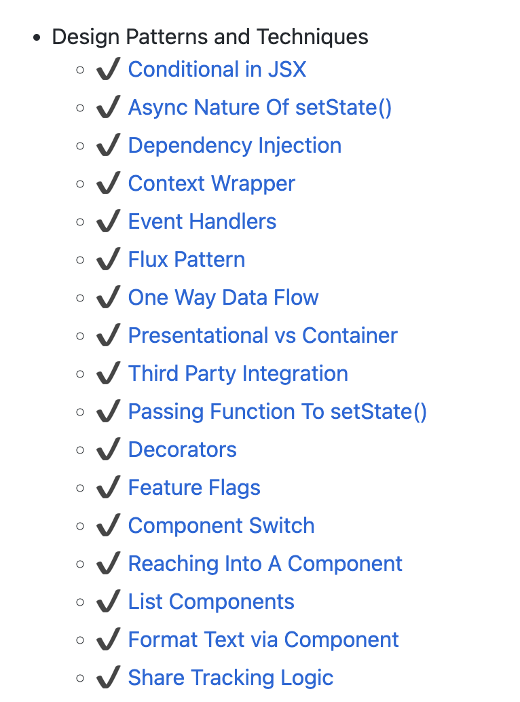

**Github：**[https://github.com/vasanthk/react-bits](https://github.com/vasanthk/react-bits)

## 6. React & Redux in TypeScript - Complete Guide
使用 TypeScript 在“React & Redux”应用程序中进行静态输入的完整指南。本指南记录了如何使用TypeScript以函数式风格使用React（及其生态系统）的最重要的模式和秘诀。它将帮助你使代码完全类型安全，同时专注于从实现中推断类型。

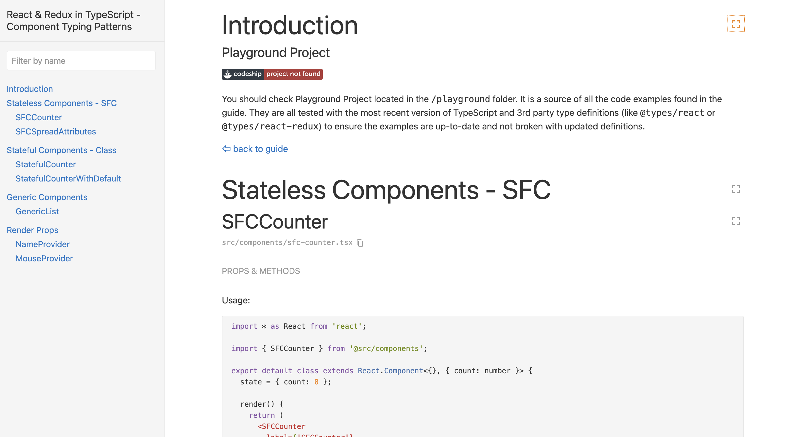

**Github：**[https://github.com/piotrwitek/react-redux-typescript-guide](https://github.com/piotrwitek/react-redux-typescript-guide)

## 7. Awesome React Components
这是一个很棒的React组件和库的列表，包含了11个大类。

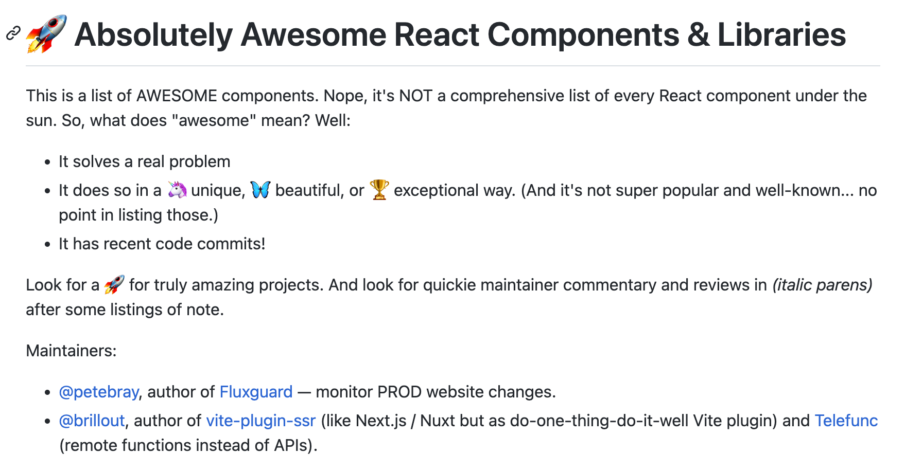

**Github：**[https://github.com/brillout/awesome-react-components](https://github.com/brillout/awesome-react-components)

## 8. ahooks
阿里巴巴开源的一套高质量可靠的 React Hooks 库。包含大量提炼自业务的高级 Hooks以及丰富的基础 Hooks。它使用 TypeScript 构建，提供完整的类型定义文件。

**Github：**[https://github.com/alibaba/hooks](https://github.com/alibaba/hooks)

## 9. Beautiful React Hooks
Beautiful React Hooks 是系列可以显著为你提升组件开发和 hooks 开发效率的一系列漂亮的 React hooks。

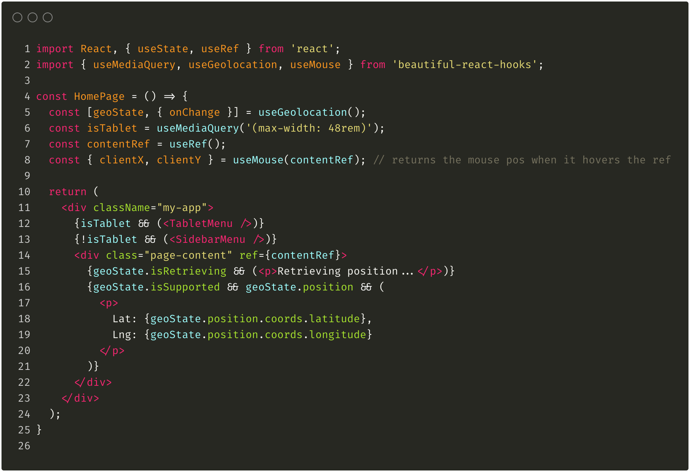

**Github：**[https://github.com/antonioru/beautiful-react-hooks](https://github.com/antonioru/beautiful-react-hooks)

## 10. React Use
必不可少的自定义 React Hooks集合，提功了中文文档。

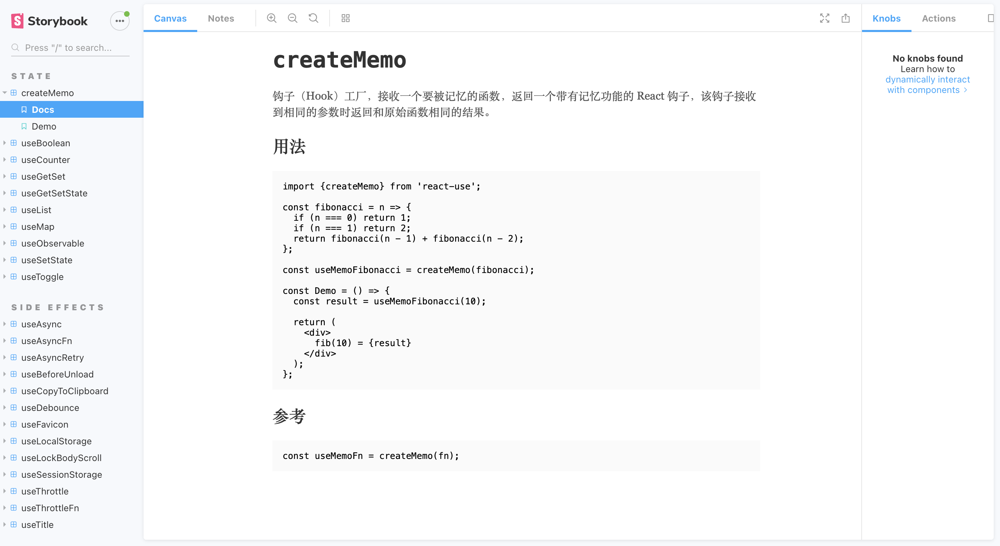

**Github：**[https://github.com/streamich/react-use](https://github.com/streamich/react-use)

## 11. useHooks
useHooks 是一系列易于理解的自定义 React Hook。

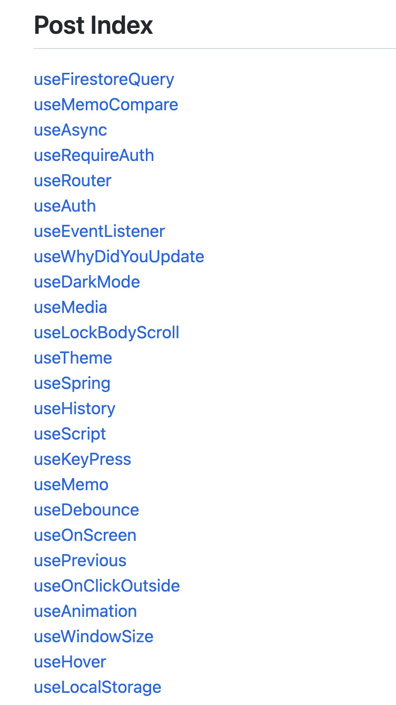

**Github：**[https://github.com/uidotdev/usehooks](https://github.com/uidotdev/usehooks)

## 12. React+TypeScript Cheatsheets
为经验丰富的 React 开发人员提供 TypeScript 入门的备忘单。

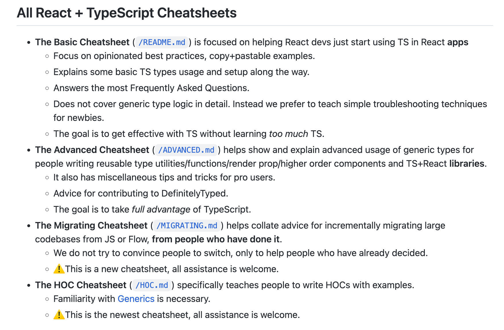

**Github：**[https://github.com/typescript-cheatsheets/react](https://github.com/typescript-cheatsheets/react)

## 13. ReactJS coding challenges
ReactJS coding challenges 是一系列具有各种困难的 **ReactJS 编码挑战。**

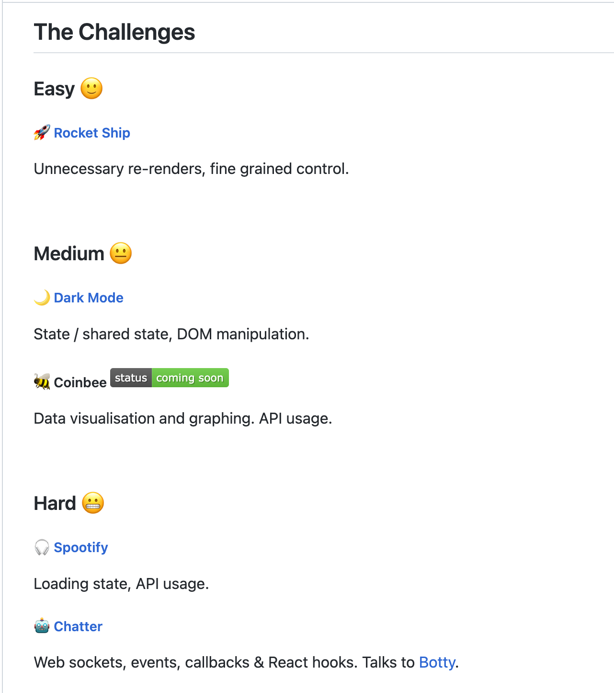

**Github：**[https://github.com/alexgurr/react-coding-challenges](https://github.com/alexgurr/react-coding-challenges)

## 14. React Interview Questions & Answers
300多道React面试题，含答案。

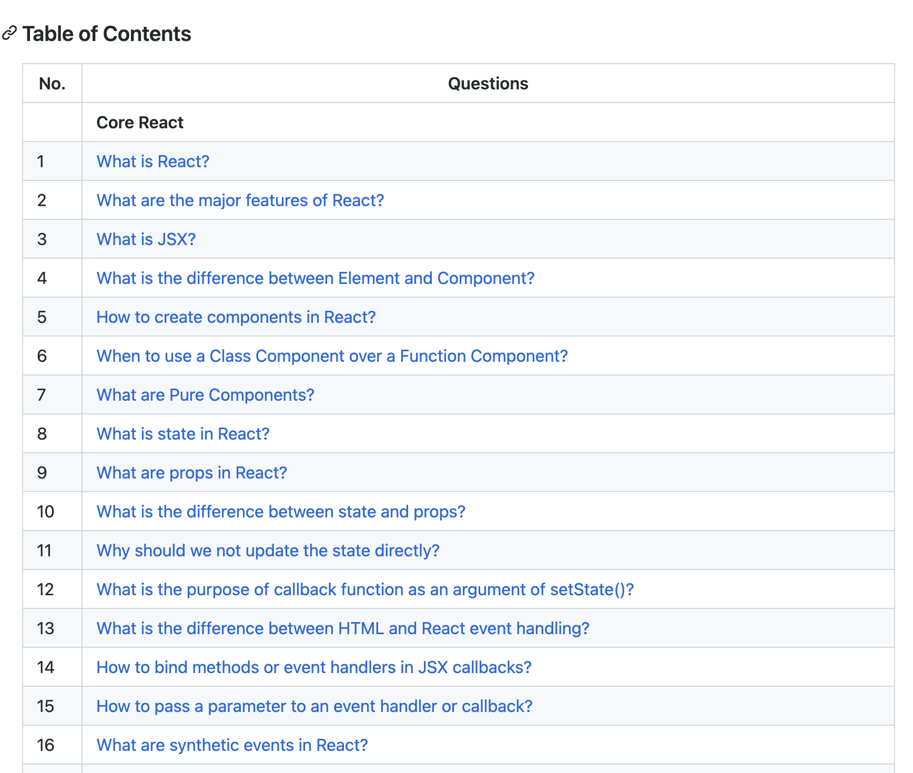

**Github：**[https://github.com/sudheerj/reactjs-interview-questions](https://github.com/sudheerj/reactjs-interview-questions)

## 15. 30 seconds of code
满足你所有开发需求的简短 React 代码片段。

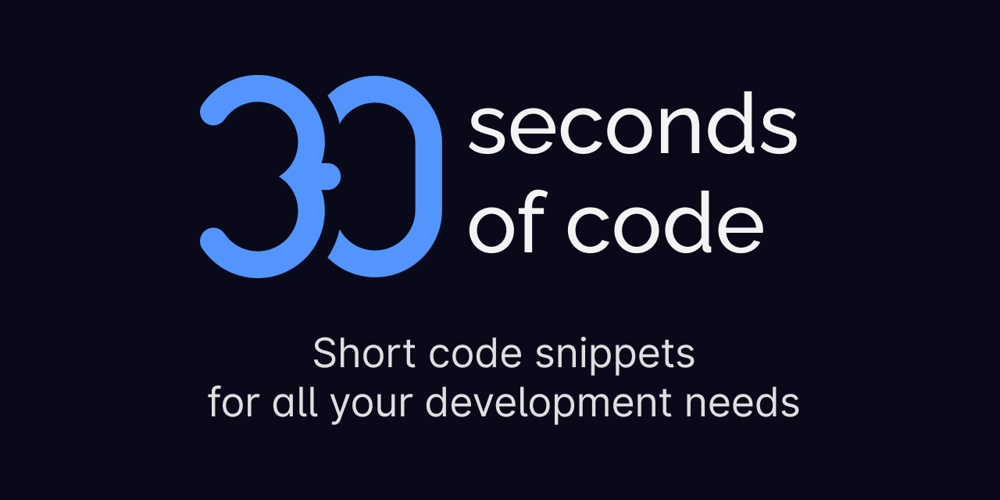

**Github：**[https://github.com/30-seconds/30-seconds-of-react](https://github.com/30-seconds/30-seconds-of-react)

## 16. React hooks cheatsheet
带有实时可编辑示例的 React hooks 备忘单 。包含一些可能会遇到的真实案例/问题示例，它包含实际的代码示例，每个示例都模仿了所有的Hook API。

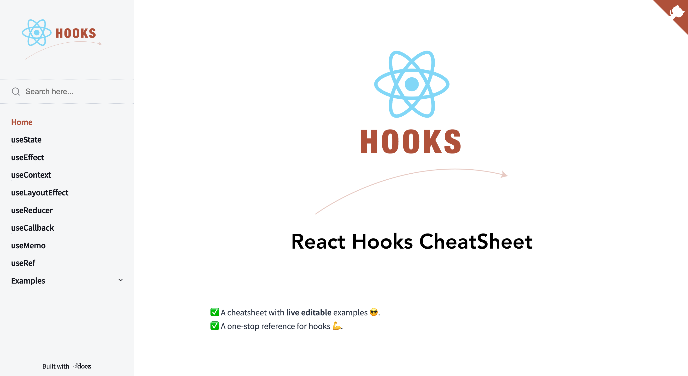

**Github：**[https://github.com/ohansemmanuel/react-hooks-cheatsheet](https://github.com/ohansemmanuel/react-hooks-cheatsheet)

## 17. React/Redux Links
React/Redux Links 收集了一些有关 React、Redux、ES6 等的精选教程和资源链接，旨在为想要了解 React-Redux 生态系统的人提供高质量文章和资源的集合，以及有关高级主题和技术的优质信息。

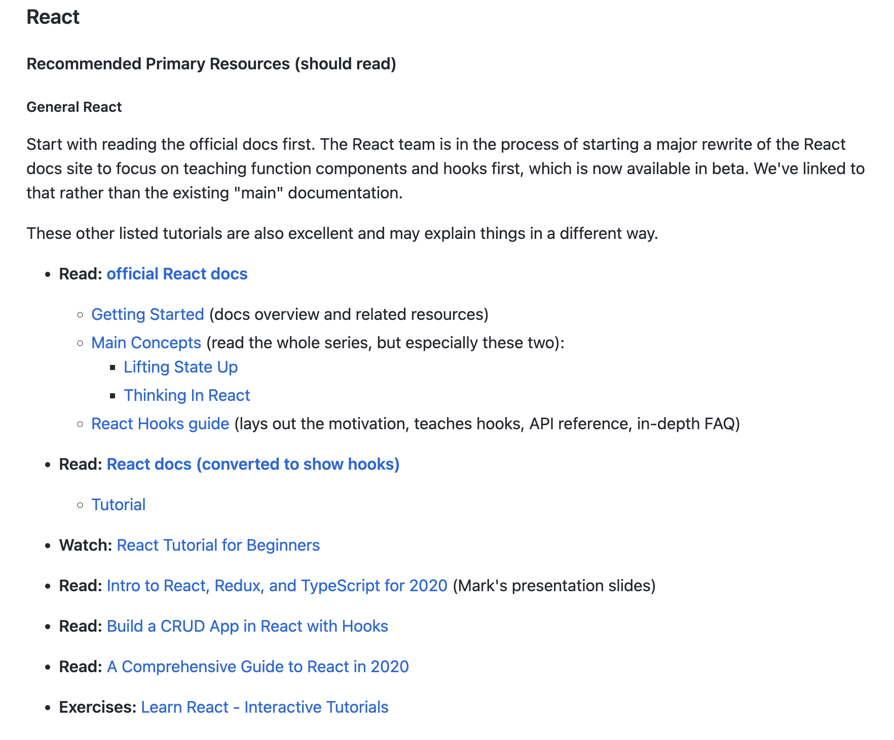

**Github：**[https://github.com/markerikson/react-redux-links](https://github.com/markerikson/react-redux-links)

## 18. React Developer Roadmap
该指南将助你成为一名 React 开发者，它包含了成为一名React开发者可以选取的学习路径以及可以学习的库。

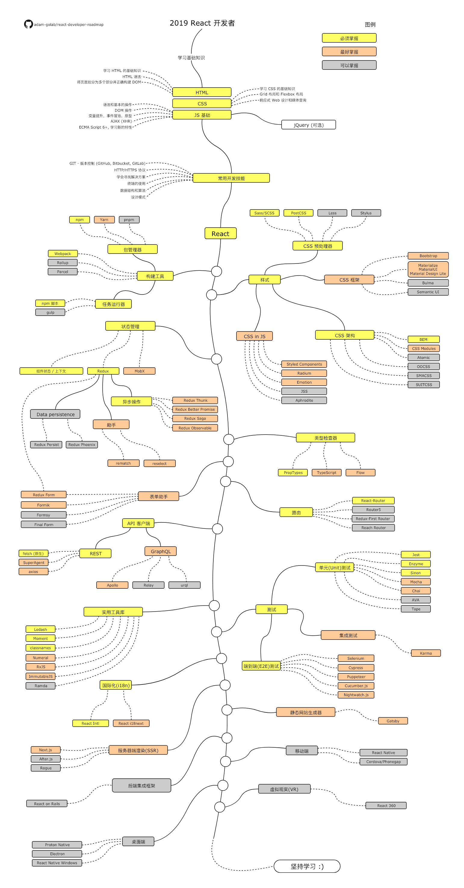

**Github：**[https://github.com/adam-golab/react-developer-roadmap](https://github.com/adam-golab/react-developer-roadmap)

## 19. Awesome React Hooks
一系列关于React Hooks 的教程、视频、播客、工具、自定义hooks库等。

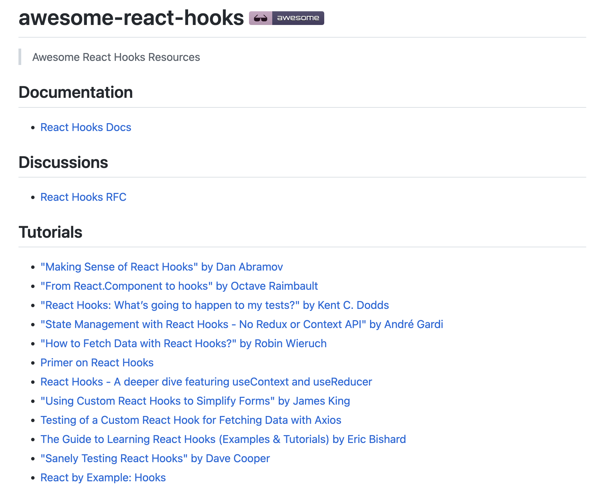

**Github：**[https://github.com/rehooks/awesome-react-hooks](https://github.com/rehooks/awesome-react-hooks)

## 20. Awesome Next.js
关于使用 Next.js（通用服务器渲染 React 应用程序的简约框架）的书籍、视频、文章的精选资源列表。

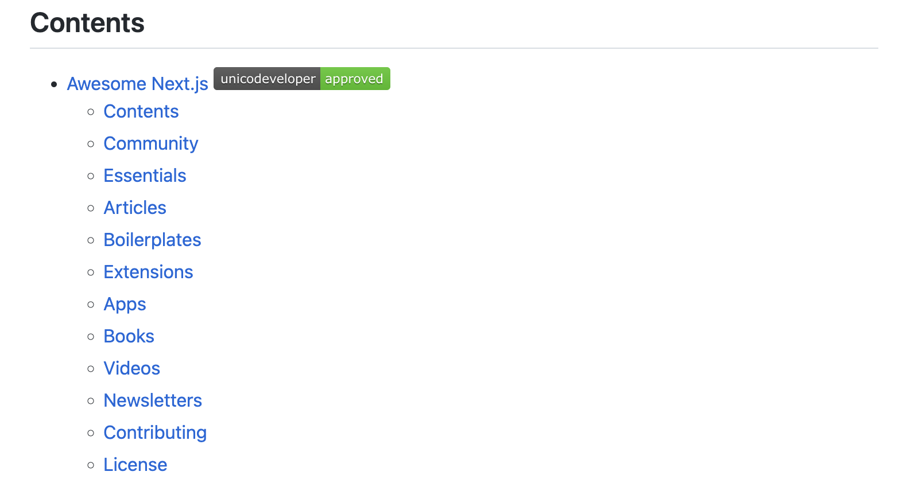

**Github：**[https://github.com/unicodeveloper/awesome-nextjs](https://github.com/unicodeveloper/awesome-nextjs)

> 更新: 2022-06-11 00:06:05  
> 原文: <https://www.yuque.com/cuggz/feplus/bfmobd>