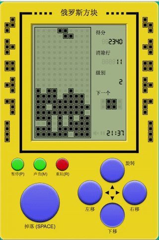
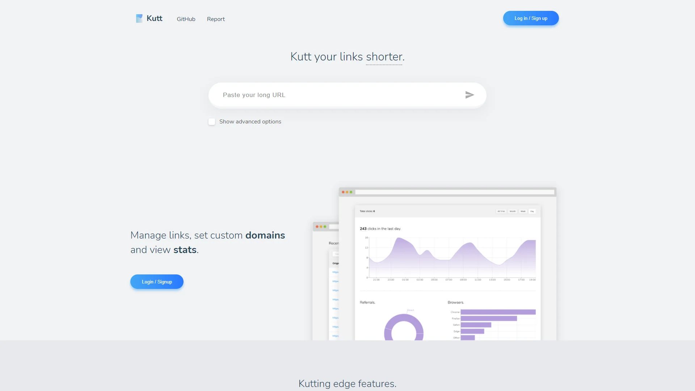
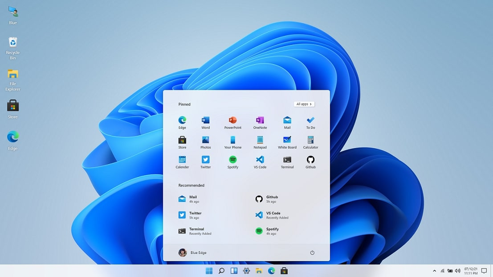
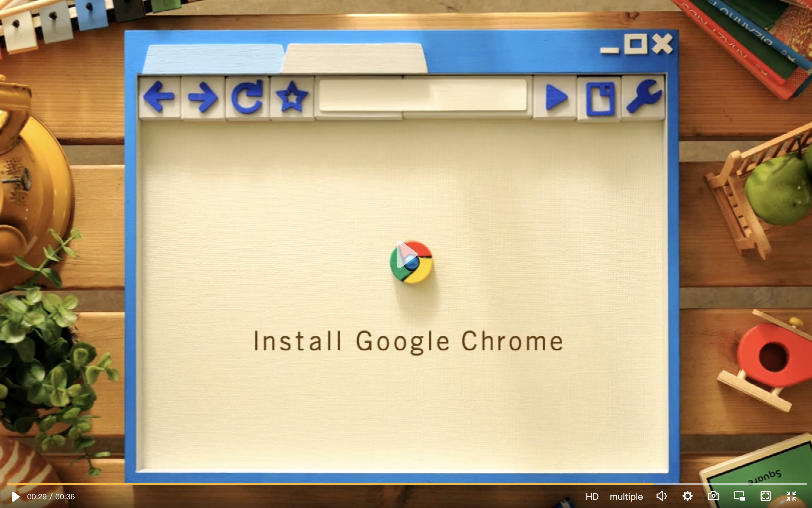
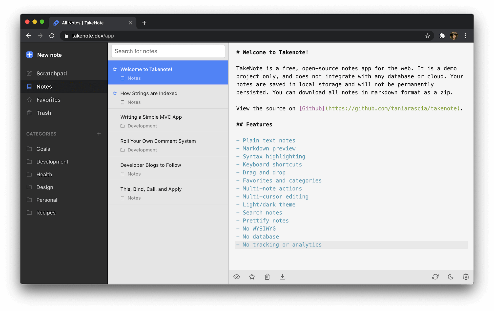
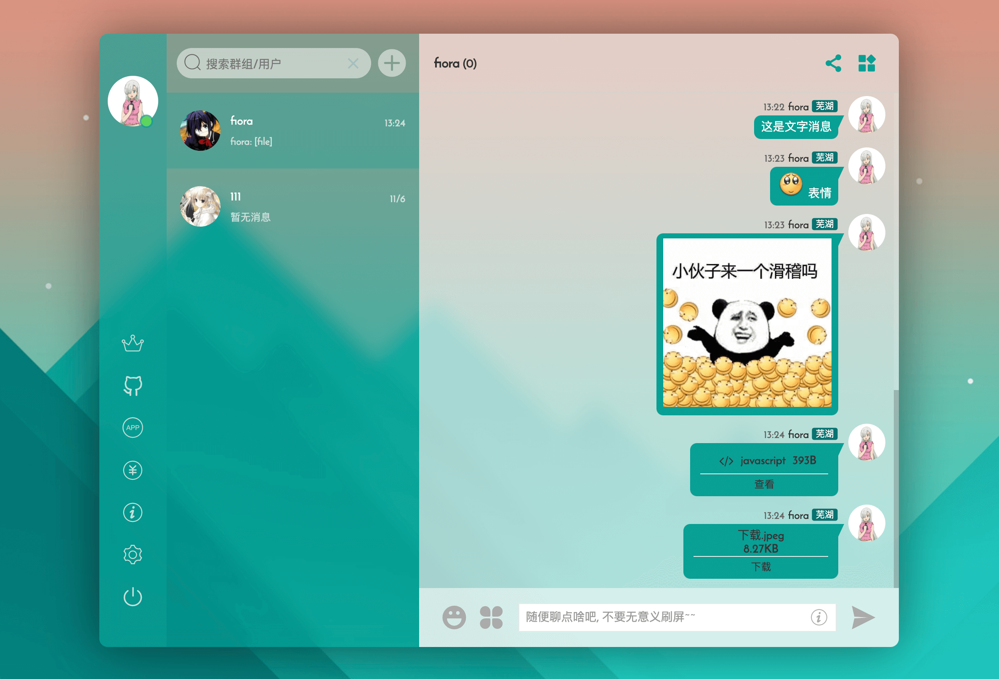
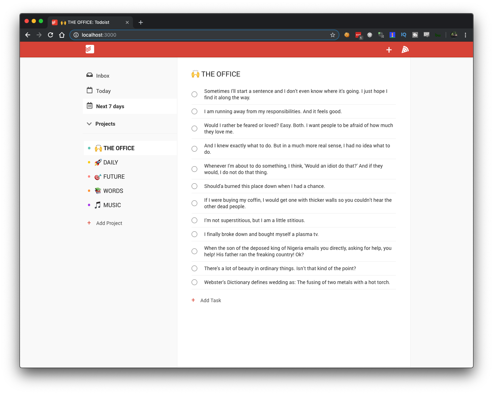
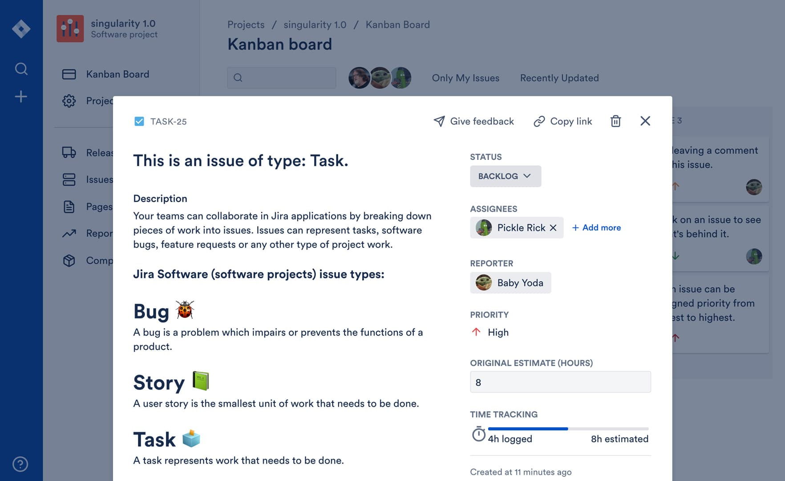

# React 项目

**概览：**

1. **React Tetris：**俄罗斯方块
2. **Kutt.it：**URL 缩短器
3. **Win11 in React：**Web 版 Windows 11
4. **JoL-player：**视频播放器
5. **Take Note：**笔记应用
6. **Fiora：**聊天应用
7. **Todoist clone：**克隆版 Todoist
8. **Jira Clone：**克隆版 Jira

## 1. React Tetris
React Tetris 是一个使用 React、Redux、Immutable 制作的俄罗斯方块游戏。它是一个非常不错的 React 练手项目，小小的“方块”还是有很多的细节可以优化和打磨。项目的官方介绍中还有一些作者开发这个项目时的一些想法（中文），值得借鉴。

**Github：**[https://github.com/chvin/react-tetris](https://github.com/chvin/react-tetris)

## 2. Kutt.it
**Kutt **是一个现代的 URL 缩短器，支持自定义域。缩短网址、管理链接并查看点击率统计信息。支持自定义域名，设置链接密码和描述，缩短URL的私人统计信息，查看、编辑、删除和管理链接，RESTful API等。使用Node.js、Express、Passport、React、TypeScript、Next、Easy Peasy、styled-components、Recharts、PostgreSQL、Redis 等技术构建。

**Github：**[https://github.com/thedevs-network/kutt](https://github.com/thedevs-network/kutt)

## 3. Win11 in React
制作这个开源项目的目的是希望使用 React、CSS (SCSS) 和 JS 等标准 Web 技术在 Web 上复制 Windows 11 桌面体验。作者大概花了两周的时间做出了这个网页版的 Windows 11，在网页就可以体验Windows 11系统的操作。

**Github：**[https://github.com/blueedgetechno/win11React](https://github.com/blueedgetechno/win11React)

## 4. JoL-player
JoL-player 是一个简洁，美观，功能强大的 React 播放器。它通过了开箱即用的高质量 React 组件，使用 TypeScript 开发，提供完整的类型定义文件，支持国际化语言，强大的API和功能，并且支持React 18+版本。

**Github：**[https://github.com/lgf196/JoL-player](https://github.com/lgf196/JoL-player)

## 5. Take Note
TakeNote 是一款 Web 笔记应用，它是一个没有数据库的静态站点，不会将笔记同步到云端。笔记会暂时保存在本地存储中，可以以 zip 格式下载 markdown 格式的所有笔记。该应用支持搜索笔记、多光标编辑、链接笔记、语法高亮、键盘快捷键、拖放操作、Markdown 预览等功能。

TakeNote 使用 TypeScript、React、Redux、Node、Express、Codemirror、Webpack、Jest、Cypress、Feather Icons、ESLint 和 Mousetrap 等技术创建。

**Github：**[https://github.com/taniarascia/takenote](https://github.com/taniarascia/takenote)

## 6. Fiora
Fiora 是一个有趣的开源聊天应用程序。它是基于Node.js、React和socket.io技术开发的。它包含了后端、前端、Android 和 iOS 应用程序，支持 Windows / Linux / macOS 系统。该应用支持添加好友、群聊、设置主题、消息提醒、多种消息类型等。

**Github：**[https://github.com/yinxin630/fiora](https://github.com/yinxin630/fiora)

## 7. Todoist clone
Todoist clone 使用 create-react-app 作为基础构建，使用的技术是 React（自定义 Hooks、context）、Firebase 和 React 测试库。除此之外，还使用 SCSS (CSS) 并遵循 BEM 命名方法来设置应用程序的样式。作者希望通过这个项目让人们更好地理解React。

**Github：**[https://github.com/karlhadwen/todoist](https://github.com/karlhadwen/todoist)

## 8. Jira Clone
JIRA 是一个项目与事务跟踪工具，被广泛应用于缺陷跟踪、客户服务、需求收集、流程审批、任务跟踪、项目跟踪和敏捷管理等工作领域。而 Jira Clone 是使用 React 开发的 Jira 的简化版。与 Jira 一样，该项目也提供交互式用户界面，但代码更简单。该项目是使用 React 以及 webpack、Node.js、ESLint、styled-components 和 cypress 构建的。该应用使用最新的 React 特性，例如带有Hooks的函数组件。此外，该项目还使用了几个自定义的轻量级 UI 组件，包括模态框和日期选择器等。

**Github：**[https://github.com/oldboyxx/jira_clone](https://github.com/oldboyxx/jira_clone)

> 更新: 2022-06-21 00:42:48  
> 原文: <https://www.yuque.com/cuggz/feplus/ssr2fm>