# Rust 资源

10 月 5 日，Vue 和 Vite 的作者尤雨溪在 ViteConf 2023 上宣布计划使用 Rust 重新构建 Vite。近年来，越来越多的前端工具开始选择使用 Rust 进行开发/重构，包括 Turbopack、SWC、Rspack、Tauri 和 Deno 等，Vite 的一大特点就是**快**，其在前端基础设施领域有着广阔的前景和潜力。如果你对此感兴趣，可以考虑学习一下 Rust。下面就来分享一些优质的开源  Rust 学习资料，希望对你有所帮助！

## Rust 语言圣经
Rust 语言圣经涵盖从入门到精通所需的 Rust 知识，目录及内容都经过深思熟虑的设计，同时语言生动幽默，行文流畅自如，摆脱技术书籍常有的机器味和晦涩感。

+ **深入度**，在基础教学的同时，提供了深入剖析。浅尝辄止并不能让我们站上紫禁之巅
+ **专题内容**，将 Rust 高级内容通过专题的形式一一呈现，内容内聚性极强，例如性能优化、手把手实现链表、Cargo 和 Tokio 使用指南、async 异步编程、标准库解析、WASM 等等
+ **内容索引**，作为一本工具书，优秀的索引能力非常重要，遗忘不可怕，找不到才可怕
+ **规避陷阱和对抗编译器**，只有真的上手写过一长段时间 Rust 项目，才知道该如何规避常见的陷阱以及解决一些难搞的编译器错误，而本书将帮助你大大缩短这个过程，提前规避这些问题
+ **Cookbook**，涵盖多个应用场景的实战代码片段，程序员上网查询文件操作、正则解析、数据库操作是常事，没有人能记住所有代码，而 Cookbook 可解君忧，Ctrl + C/V 走天下
+ **配套练习题**，像学习一门大学课程一样学习 Rust 是一种什么感觉？Rust 语言圣经 + Rust 语言实战双剑合璧，给你最极致的学习体验

截至目前，Rust 语言圣经已写了 170 余章，110 余万字，历经 800 多个小时，每一个章节都是手动写就，没有任何机翻和质量。

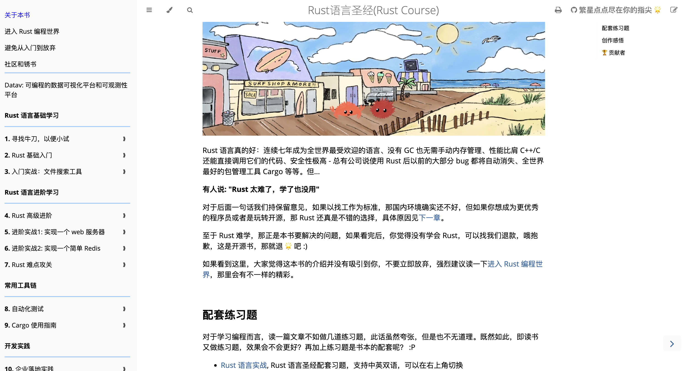

+ **GitHub**：[https://github.com/sunface/rust-course](https://github.com/sunface/rust-course)
+ **在线阅读**：[https://course.rs/about-book.html](https://course.rs/about-book.html)

## Rust语言实战
Rust语言实战的目标是通过大量的实战练习帮助大家更好的学习和上手使用 Rust 语言。书中的练习题非常易于使用：你所需的就是在线完成练习，并让它通过编译。

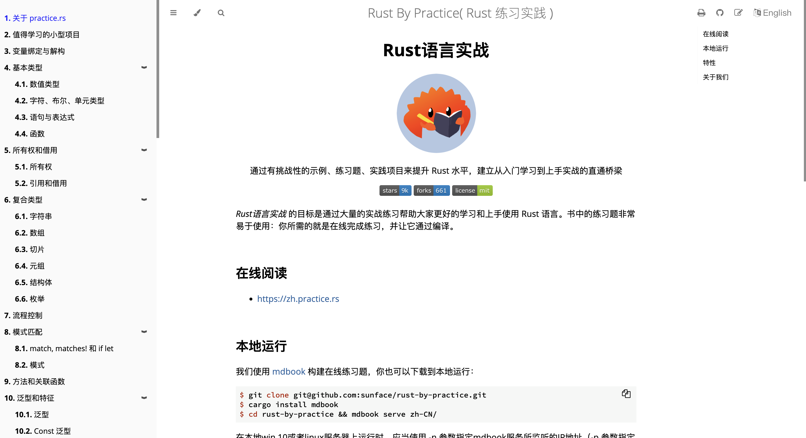

+ **GitHub：**[https://github.com/sunface/rust-by-practice](https://github.com/sunface/rust-by-practice)
+ **在线阅读：**[https://zh.practice.rs/why-exercise.html](https://zh.practice.rs/why-exercise.html)

## Rust 程序设计语言
一本 Rust 语言的入门书，本书英文原版作者为 Steve Klabnik 和 Carol Nichols，并由 Rust 社区补充完善。本简体中文译本由 Rust 中文社区翻译。

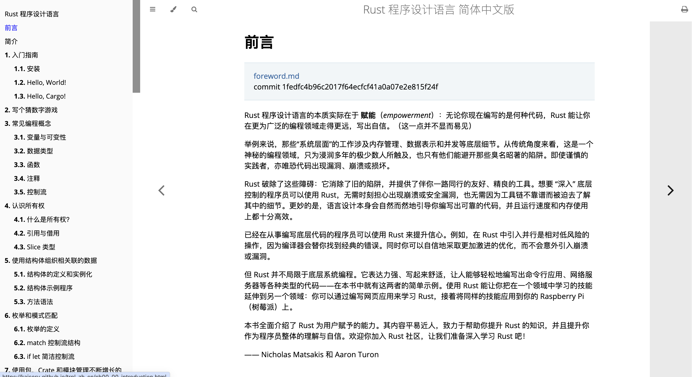

+ **Github：**[https://github.com/KaiserY/trpl-zh-cn](https://github.com/KaiserY/trpl-zh-cn)
+ **在线阅读**：[https://kaisery.github.io/trpl-zh-cn/](https://kaisery.github.io/trpl-zh-cn/)

## Rust 语言之旅
本教程旨在循序渐进地介绍 Rust 编程语言的特性。

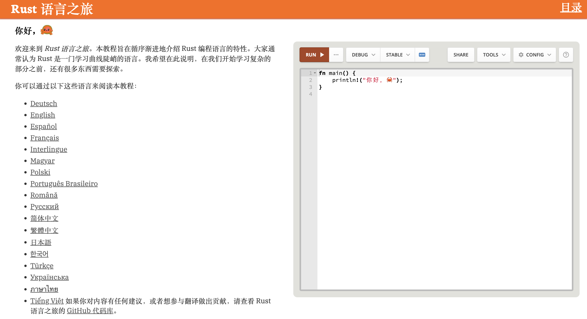

+ GitHub：[https://github.com/richardanaya/tour_of_rust](https://github.com/richardanaya/tour_of_rust)
+ 在线阅读：[https://tourofrust.com/00_zh-cn.html](https://tourofrust.com/00_zh-cn.html)

## 简单英语学Rust
简单英语学Rust写于2020年7月至8月，长达400多页。这是一种试图使用“易懂的英语”来教授Rust编程语言的资源，适用于非英语母语的学习者，当然也提供了中文译本。

+ **GitHub**：[https://github.com/kumakichi/easy_rust_chs](https://github.com/kumakichi/easy_rust_chs)
+ **在线阅读：**[https://kumakichi.github.io/easy_rust_chs/](https://kumakichi.github.io/easy_rust_chs/)

## Comprehensive Rust
Comprehensive Rust 是由 Google 的 Android 团队开发的免费 Rust 课程。该课程涵盖了 Rust 的全部内容，从基本语法到泛型和错误处理等高级主题。

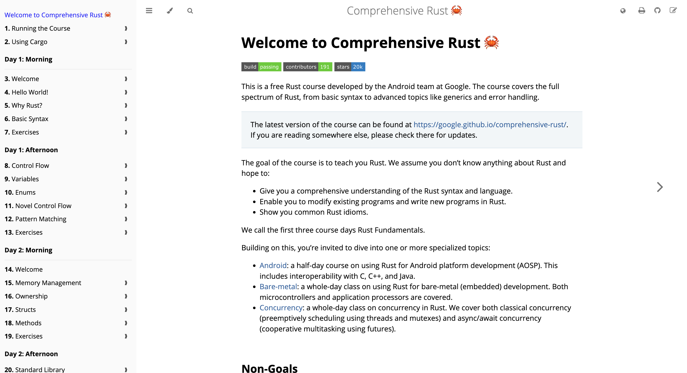

+ **GitHub：**[https://github.com/google/comprehensive-rust](https://github.com/google/comprehensive-rust)
+ **在线阅读**：[https://google.github.io/comprehensive-rust/](https://google.github.io/comprehensive-rust/)

## Rust By Example
Rust by Example (RBE) 是一个可运行示例的集合，用于说明各种 Rust 概念和标准库，可以通过示例学习 Rust。

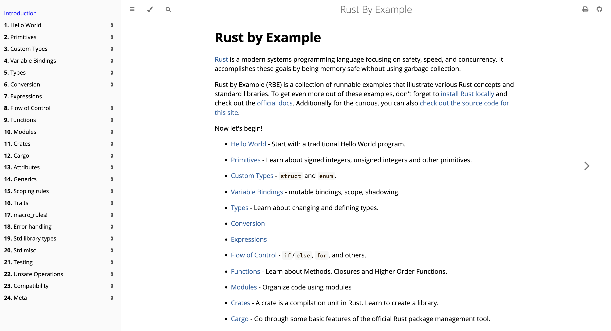

+ **GitHub**：[https://github.com/rust-lang/rust-by-example](https://github.com/rust-lang/rust-by-example)
+ **在线阅读**：[https://doc.rust-lang.org/stable/rust-by-example/](https://doc.rust-lang.org/stable/rust-by-example/)

## rustlings
该项目包含一些小练习，可帮助你习惯阅读和编写 Rust 代码。

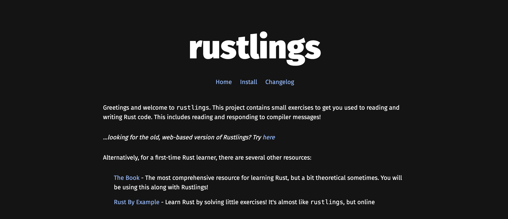

**GitHub：**[https://github.com/rust-lang/rustlings](https://github.com/rust-lang/rustlings)

## Rust设计模式
一本关于 Rust 编程语言中的设计模式和习惯用法的开源书籍中文译本。

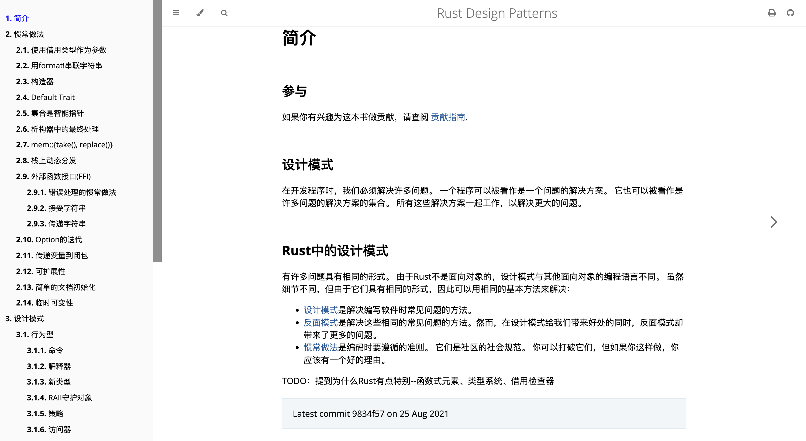

+ **GitHub**：[https://github.com/Fomalhauthmj/patterns](https://github.com/Fomalhauthmj/patterns)
+ **在线阅读**：[https://fomalhauthmj.github.io/patterns/intro.html](https://fomalhauthmj.github.io/patterns/intro.html)

## RustBook
一本关于 Rust 数据结构和算法的书。

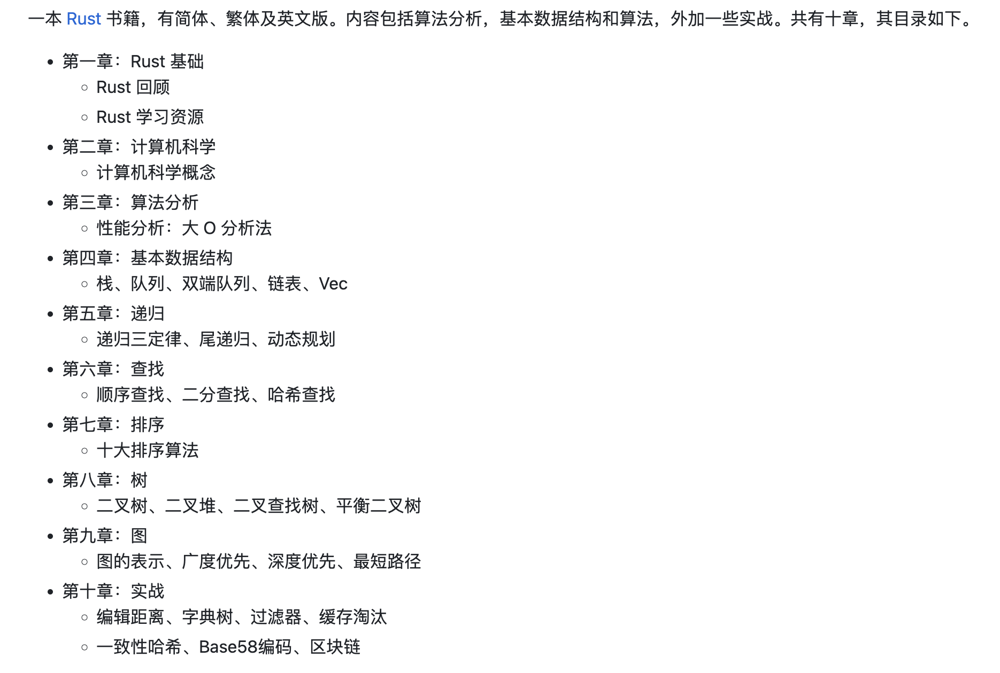

**GitHub：**[https://github.com/QMHTMY/RustBook](https://github.com/QMHTMY/RustBook)

## Awesome Rust
Rust 代码和资源的精选列表，包括应用，开发工具，库，资源等。

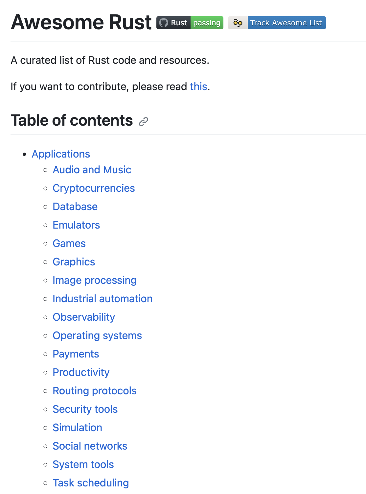

**GitHub：**[https://github.com/rust-unofficial/awesome-rust](https://github.com/rust-unofficial/awesome-rust)

## rust-learning
一些用于学习 Rust 的博客文章、文章、视频等学习资源。

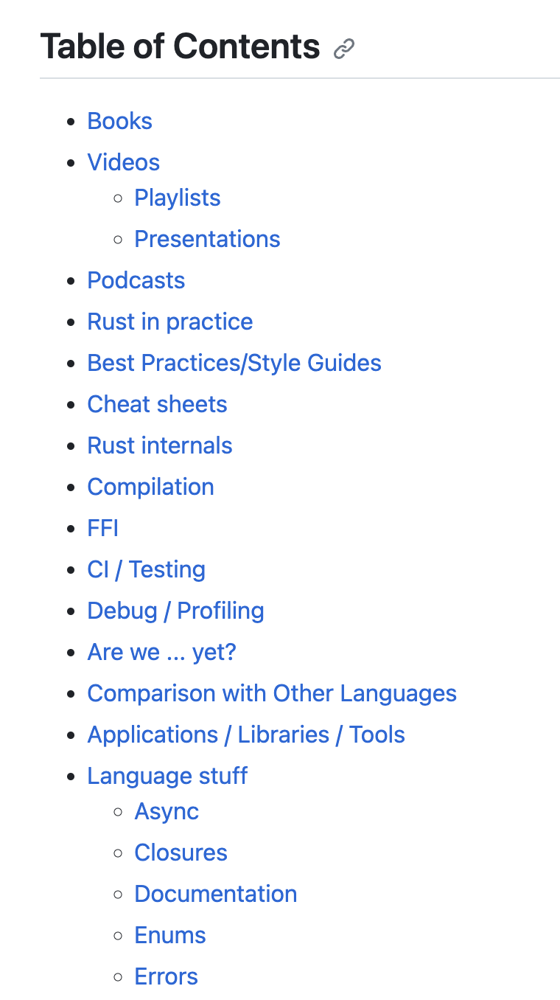

**GitHub：**[https://github.com/ctjhoa/rust-learning](https://github.com/ctjhoa/rust-learning)

> 更新: 2023-10-07 18:12:25  
> 原文: <https://www.yuque.com/cuggz/feplus/pmne83290n98mfur>