# TypeScript资源

## 1. TypeScript 官方文档
TypeScript 官方文档，提供了中文版本。

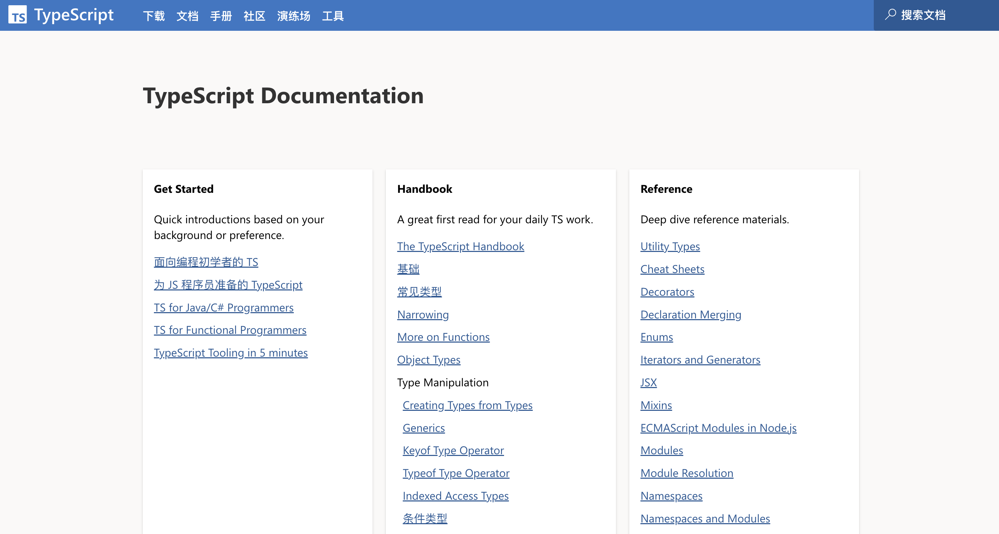

**Github：**[https://github.com/microsoft/TypeScript](https://github.com/microsoft/TypeScript)

## 2. 学习 TypeScript
可能是中国最好的 TypeScript 入门到进阶系统教程。

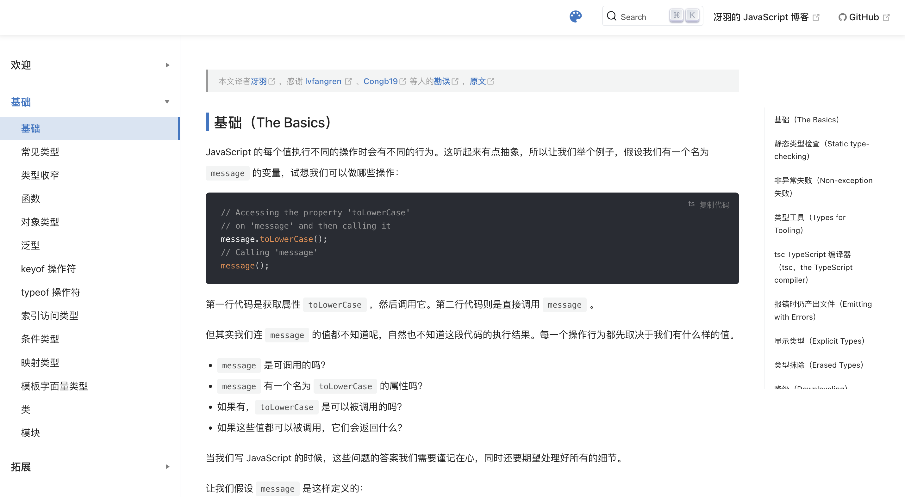

**Github：**[https://github.com/mqyqingfeng/learn-typescript](https://github.com/mqyqingfeng/learn-typescript)

## 3. TypeScript 使用指南手册
TypeScript 使用手册（中文版）翻译。

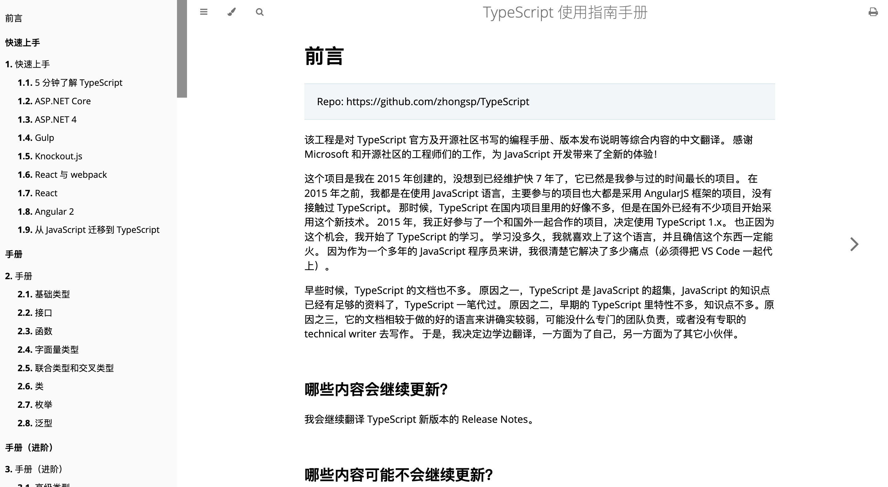

**Github：**[https://github.com/zhongsp/TypeScript](https://github.com/zhongsp/TypeScript)

## 4. 深入理解 TypeScript
TypeScript Deep Dive 中文版。

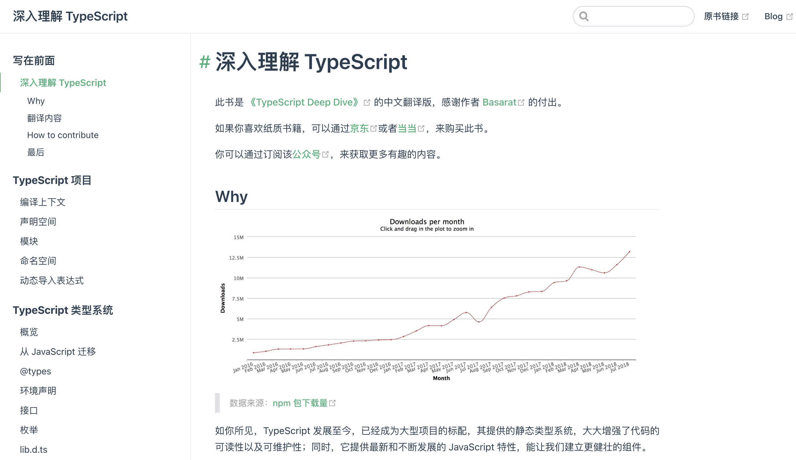

**Github：**[https://github.com/jkchao/typescript-book-chinese](https://github.com/jkchao/typescript-book-chinese)

## 5. TypeScript 入门教程
从 JavaScript 程序员的角度总结思考，循序渐进的理解 TypeScript。

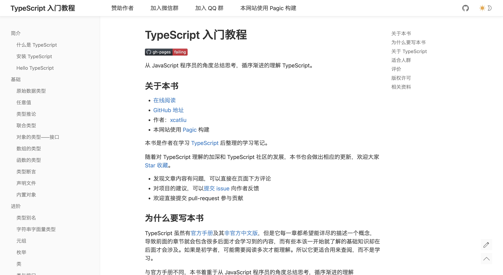

**Github：**[https://github.com/xcatliu/typescript-tutorial](https://github.com/xcatliu/typescript-tutorial)

## 6. TypeScript 类型挑战
高质量的类型可以提高项目的可维护性并避免一些潜在的漏洞。本项目意在于让你更好的了解 TS 的类型系统，编写你自己的类型工具，或者只是单纯的享受挑战的乐趣！

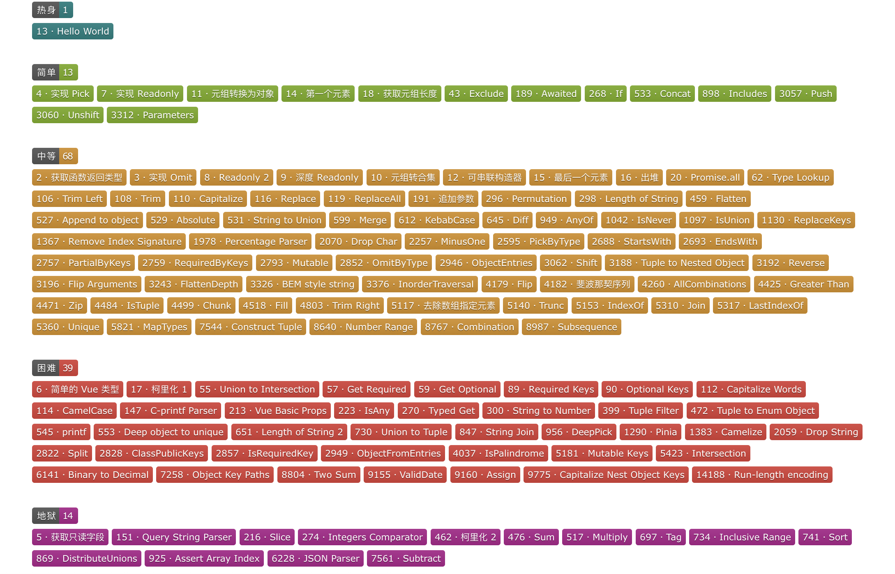

**Github：**[https://github.com/type-challenges/type-challenges](https://github.com/type-challenges/type-challenges)

## 7. DefinitelyTyped
DefinitelyTyped 包含大量的高质量的 TypeScript 类型定义。通过使用 DefinitelyTyped 及其包含的声明文件，我们可以使用大多数流行的JavaScript库，就像它们是 TypeScript 库一样，将通过编译器进行类型验证。

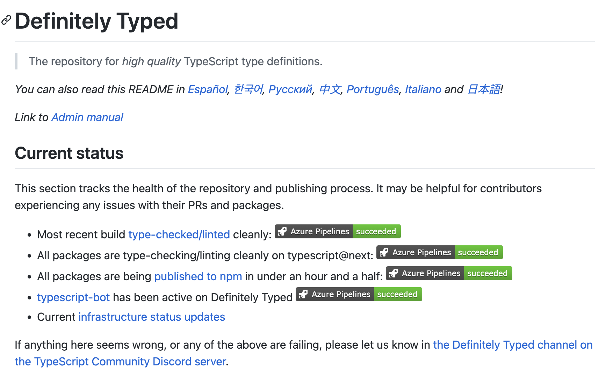

**Github：**[https://github.com/DefinitelyTyped/DefinitelyTyped](https://github.com/DefinitelyTyped/DefinitelyTyped)

## 8. react-redux-typescript-guide
本指南记录了有关在 React（及其生态系统）中以函数式风格使用 TypeScript 的模式和秘诀。它将使代码类型安全，同时专注于从实现中推断类型，从长远来看更容易编写和维护正确的类型。

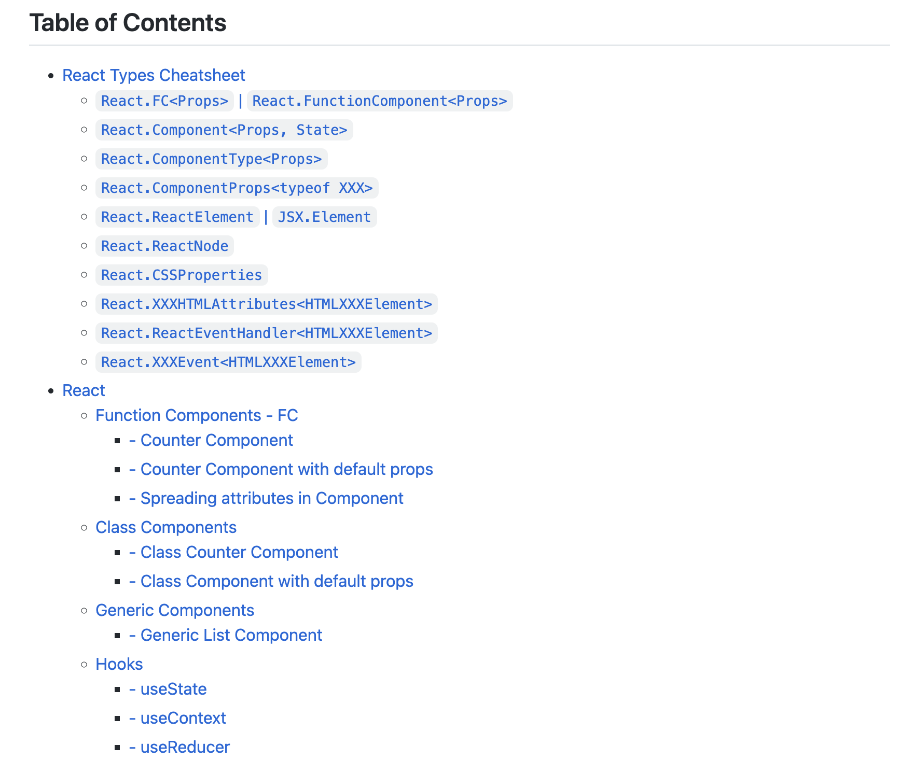

**Github：**[https://github.com/piotrwitek/react-redux-typescript-guide](https://github.com/piotrwitek/react-redux-typescript-guide)

## 9. React+TypeScript 备忘录
专注于帮助 React 开发人员在 React 应用中使用 TypeScript。

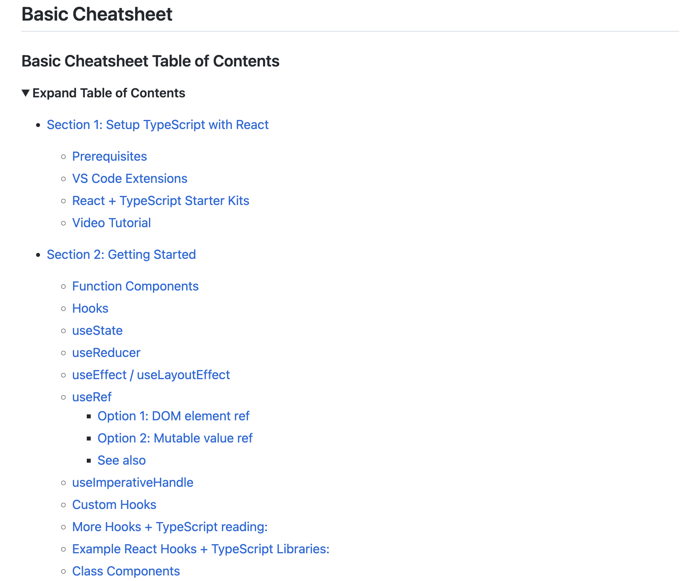

**Github：**[https://github.com/typescript-cheatsheets/react](https://github.com/typescript-cheatsheets/react)

## 10. clean-code-typescript
将 Clean Code 的概念适用到 TypeScript，引导读者使用 TypeScript 编写易读、可扩展的应用。

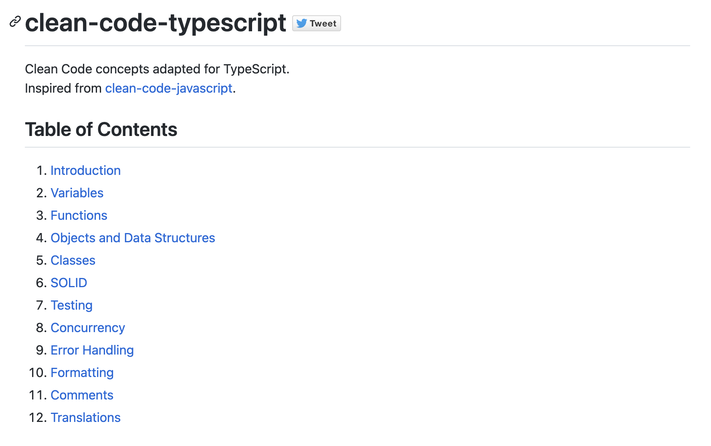

**Github：**[https://github.com/labs42io/clean-code-typescript](https://github.com/labs42io/clean-code-typescript)

## 11. 谷歌TypeScript风格指南
Google 的 TypeScript 风格指南。

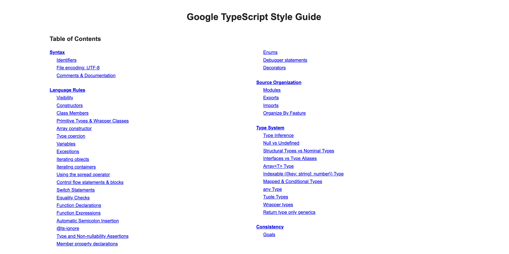

**Github：**[https://google.github.io/styleguide/tsguide.html](https://google.github.io/styleguide/tsguide.html)

## 12. Awesome TypeScript
很棒的 TypeScript 资源

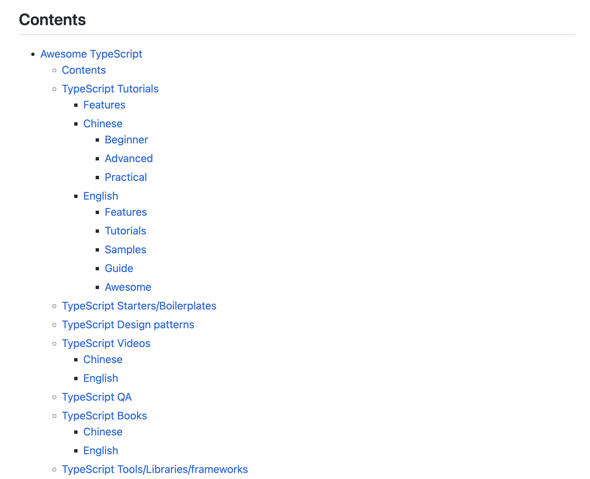

**Github：**[https://github.com/semlinker/awesome-typescript](https://github.com/semlinker/awesome-typescript)

> 更新: 2022-09-29 19:17:45  
> 原文: <https://www.yuque.com/cuggz/feplus/yibigy>