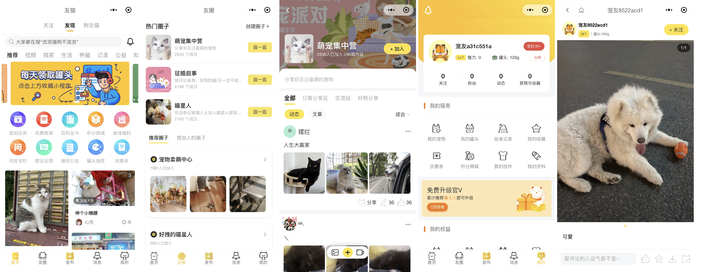
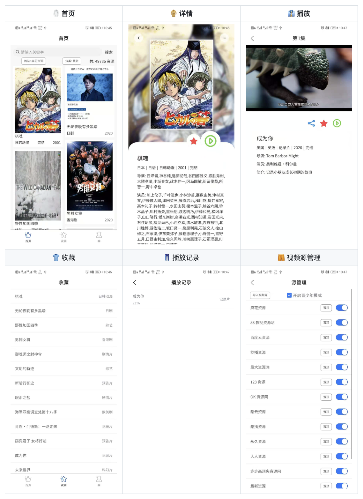
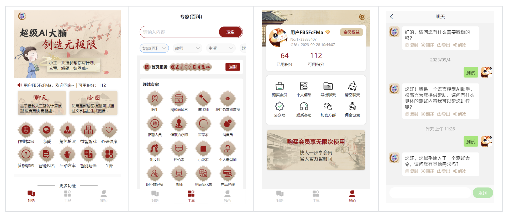
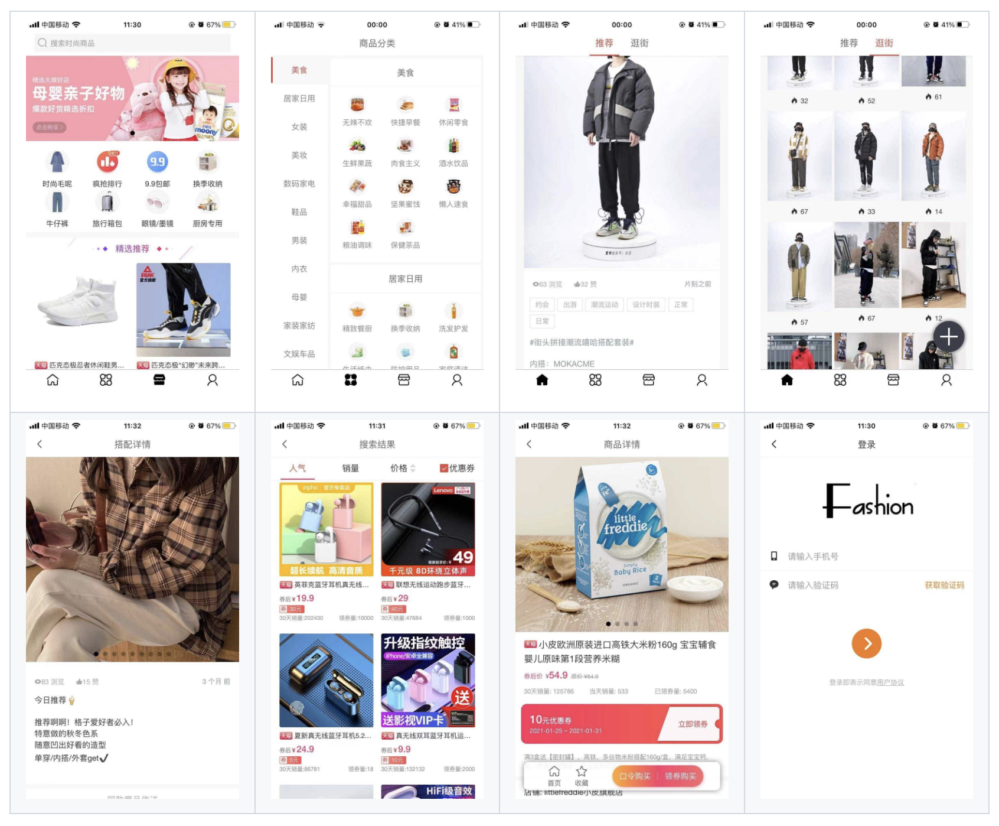
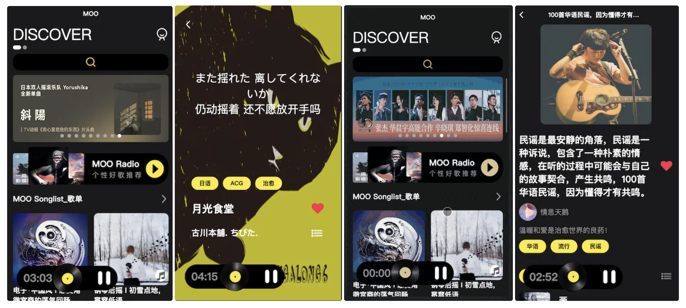
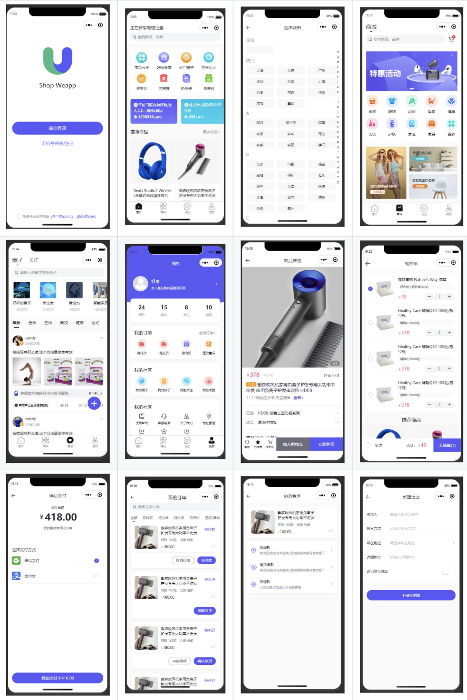

# Uniapp 应用

## 宠物社区
一款基于宠物社区/论坛交友系统APP，支持安卓、苹果、小程序、H5端多端适配。前端 uniapp 跨平台编译，后端使用SpringBoot微服务架构。功能包括：图文、视频发布、文章、话题、圈子、问答、附近、点赞、评论、关注、IM即时通讯、积分模块、头像挂件、VIP会员、消息推送通知、商城等。

**Github：**[https://github.com/XJingWei/pet-app](https://github.com/XJingWei/pet-app)

## 视频播放器
ZY Player 是一个跨平台移动端视频资源播放器，简洁免费，基于 Uni-app 开发。

**Github：**[https://github.com/cuiocean/ZY-Player-APP](https://github.com/cuiocean/ZY-Player-APP)

## AI问答绘画
一个基于Springboot的Chatgpt机器人，已对接GPT-3.5、GPT-4.0、Kimi、百度文心一言、stable diffusion AI绘图、Midjourney绘图。用户可以在界面上与聊天机器人进行对话，聊天机器人会根据用户的输入自动生成回复。同时也支持画图，用户输入文本，便可以自动制作文生文生图。

**Github：**[https://github.com/274056675/springboot-openai-chatgpt](https://github.com/274056675/springboot-openai-chatgpt)

## 工具箱
专为内容/资源下载场景设计，目前已实现个人博客，文章发表，资源收集下载，手机壁纸下载，电脑壁纸下载，头像下载，支持抖音，快手，小红书等 100+ 平台的图片视频水印去除。

**Gitee：**[https://gitee.com/ananyouu/yimo-resource-blog](https://gitee.com/ananyouu/yimo-resource-blog)

## 淘宝客
一个从前端到后端完全开源的淘宝客项目，目前项目已经支持打包成App、微信小程序、QQ小程序、Web。前端部分使用 Vue + Uniapp 开发。

**Github：**[https://github.com/silently9527/coupons](https://github.com/silently9527/coupons)

## 招聘
一款基于uni-app编写的招聘求职类前端，该前端包含了大部分核心页面和逻辑交互。前端分了两种角色：求职者和招聘者，通过角色切换可以进行页面和功能的切换。

**Github：**[https://github.com/zhang2657977442/wuyou-frontend](https://github.com/zhang2657977442/wuyou-frontend)

## 音乐播放器
使用 Uniapp、Vue 3、Pinia、TypeScript、Tailwind CSS 开发的可多端（支持移动端、Web、微信小程序、Android、IOS 等）运行的音乐播放器。

**Github：**[https://github.com/lei1248276/MOO-music](https://github.com/lei1248276/MOO-music)

## 社区电商
一个基于 Uniapp + uView UI 开发的社区电商微信小程序，一套代码实现 Android、IOS、多家小程序、H5页面、轻应用。

**Github：**[https://github.com/kieranwv/ushop](https://github.com/kieranwv/ushop)

> 更新: 2024-11-30 15:21:17  
> 原文: <https://www.yuque.com/cuggz/feplus/gc68ggp27re0g3ve>