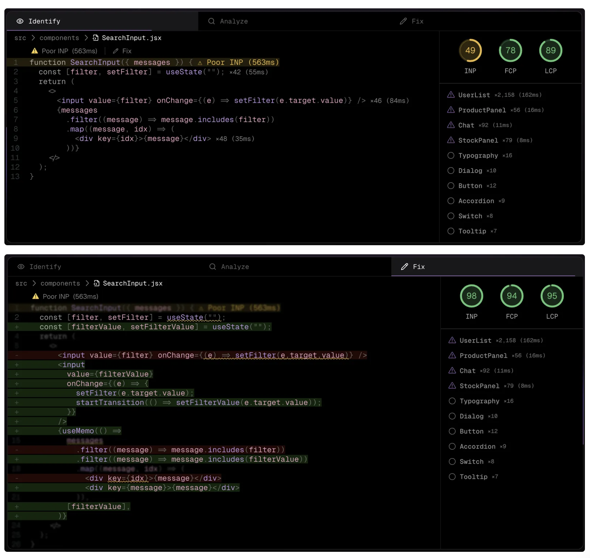
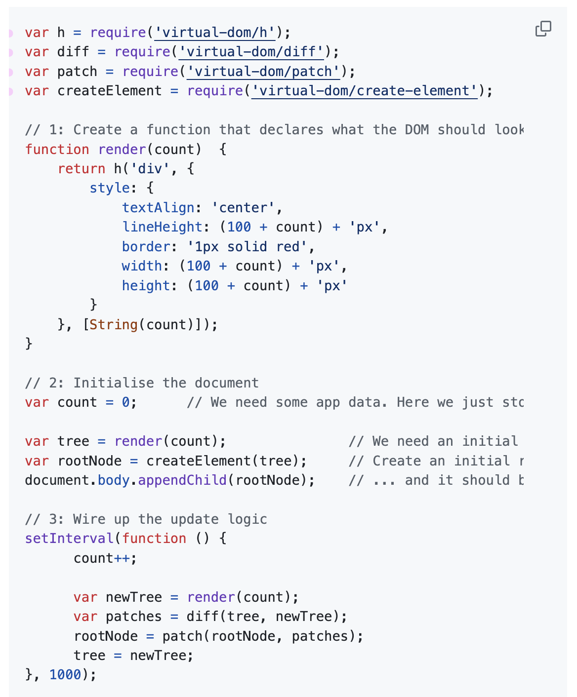
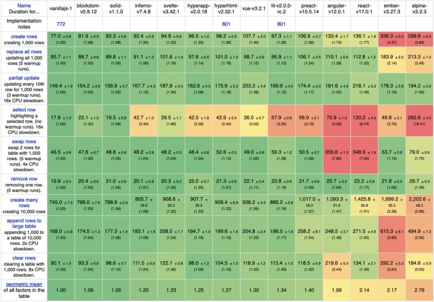
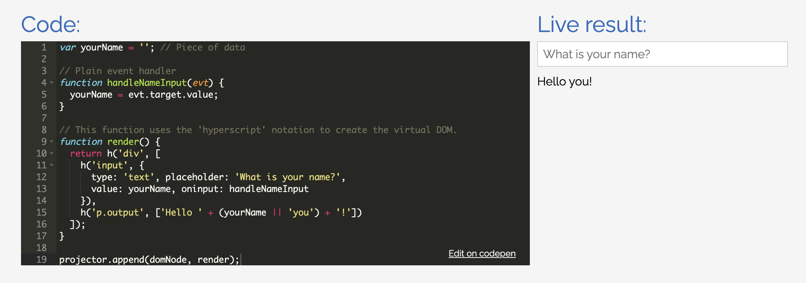

# Virtual DOM

在知乎上有一个问题：“**前端开发中有什么经典的轮子值得自己去实现一遍?**”问题下有很多前端界大佬的回答。其中，尤大的回答中很简单：**Virtual-DOM**。本文就来看看 Virtual-DOM 是什么，并分享一些可参考的实现案例。

## **Virtual-DOM 是什么？**
Virtual-DOM 即虚拟 DOM，它是对真实 DOM 的一个内存中的抽象表示。在前端开发中，当需要更新页面时，传统的直接操作 DOM 的方式可能会非常低效，因为 DOM 操作本身就很昂贵。虚拟 DOM 的引入允许在一个轻量级的 JavaScript 对象（即虚拟 DOM）上进行更改，然后通过一种高效的比较算法（如 React 的 Diff 算法）来确定哪些更改需要实际应用到真实的 DOM 上。这样可以大大减少不必要的 DOM 操作，从而显著提高页面渲染性能。

目前，很多主流前端框架都使用了虚拟 DOM 技术，比如：React、Vue、Preact。

## **Virtual-DOM 案例**
### Million.js
Million.js 是一个完整的并且经过微调和优化的虚拟 DOM 库，减少了 Diff 的开销，其宣称可以使 React 的组件渲染速度提高 70%。这个项目在 Github 上已获得 15.5看 Star，值的学习。

**Github：**[https://github.com/aidenybai/million](https://github.com/aidenybai/million)

### Snabbdom
Snabbdom 是一个轻量级且高效的虚拟 DOM 库，它允许开发者以函数的形式来表达程序视图，同时提供了灵活且可拓展的模块化结构。Snabbdom 的核心代码非常简洁，大约只有200行，理解起来比较简单。

**Github：**[https://github.com/snabbdom/snabbdom](https://github.com/snabbdom/snabbdom)

### virtual-dom
这是虚拟 DOM 的一个很经典的实现，在 Github 上拥有 11.6k Star。

**Github：**[https://github.com/Matt-Esch/virtual-dom](https://github.com/Matt-Esch/virtual-dom)

### blockdom
blockdom_ _自称是世界上最快的虚拟 DOM 库，它通过独特的按块而非按元素进行差异计算的方法，显著提升了渲染速度。这种设计使得 blockdom 能够高效直接复制整块内容，从而极大地简化了差异（diff）过程，并因虚拟 DOM 树的大幅精简而进一步提升了性能。

**Github：**[https://github.com/ged-odoo/blockdom](https://github.com/ged-odoo/blockdom)

### Maquette
Maquette 是一个纯粹而简单的虚拟 DOM 库。

**Github：**[https://github.com/AFASSoftware/maquette](https://github.com/AFASSoftware/maquette)

### 其他
+ simple-virtual-dom：
    - 简介：简单的虚拟 dom 算法，代码只有 500 行，包括虚拟 DOM 算法非常基本的思想。
    - Github：[https://github.com/livoras/simple-virtual-dom](https://github.com/livoras/simple-virtual-dom)
+ petit-dom：
    - 简介：一个极简的虚拟 DOM 库。
    - Github：[https://github.com/yelouafi/petit-dom](https://github.com/yelouafi/petit-dom)

> 更新: 2024-06-07 17:33:26  
> 原文: <https://www.yuque.com/cuggz/feplus/cdep3niua2goomge>