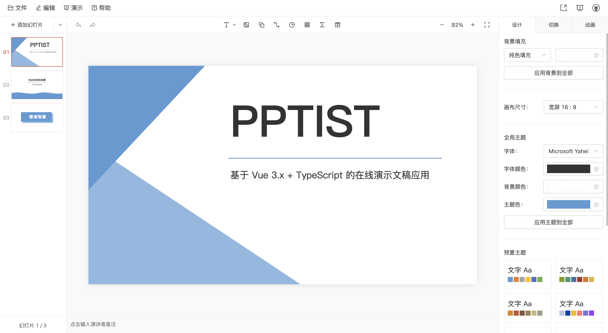
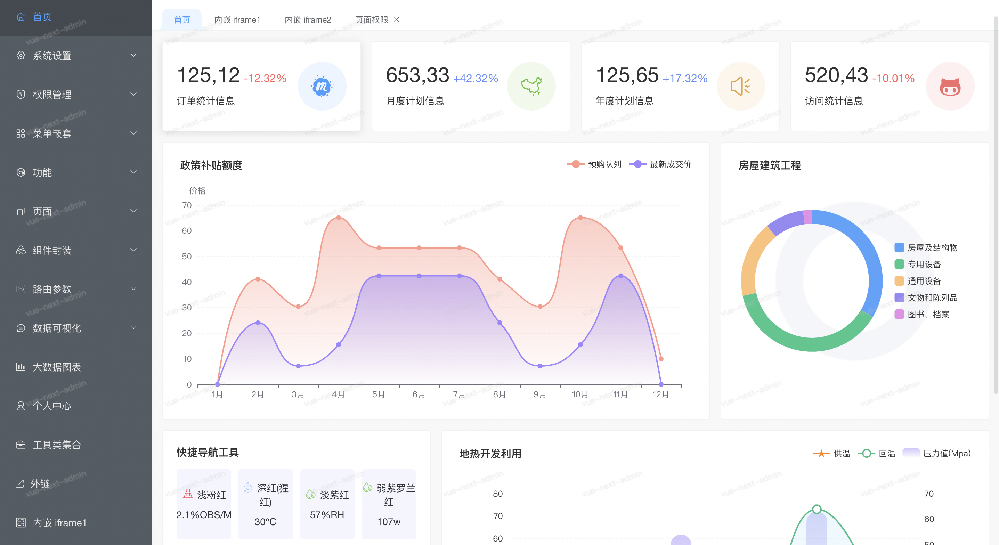
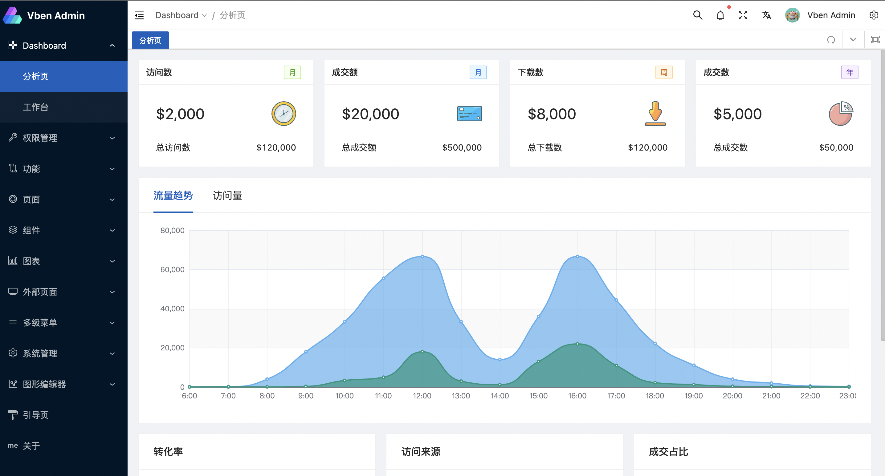
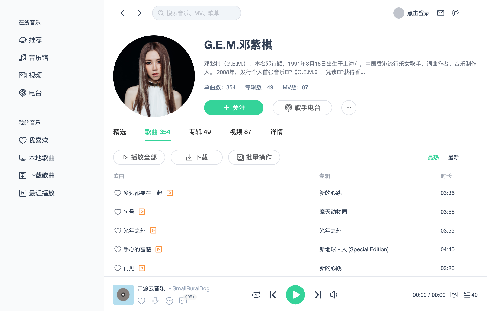
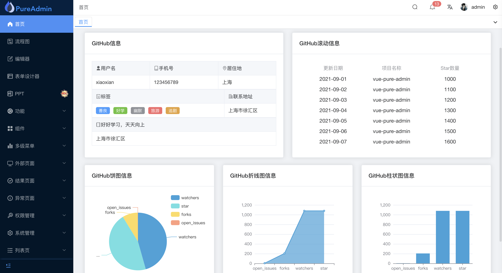
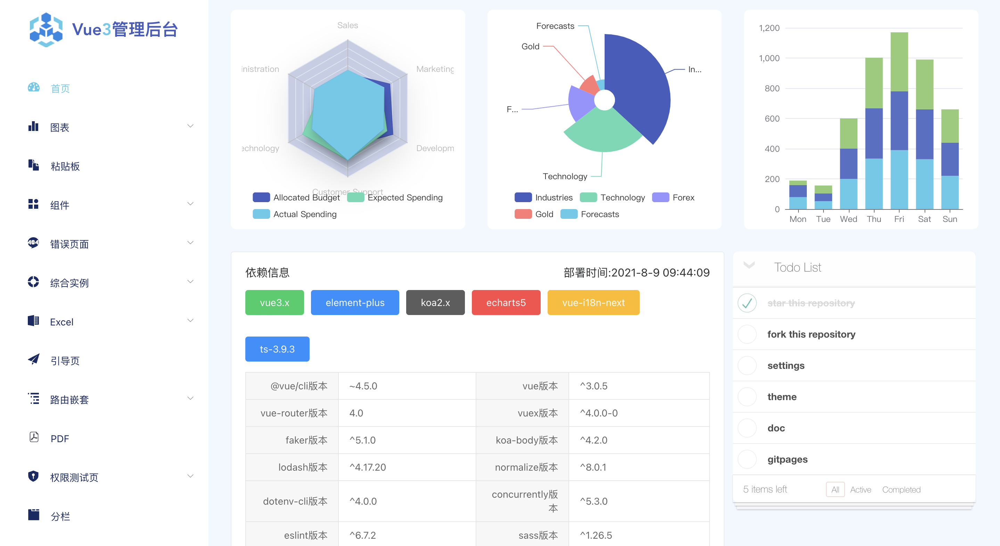
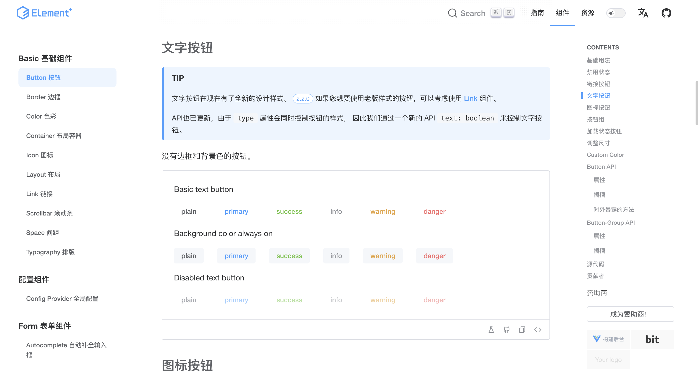
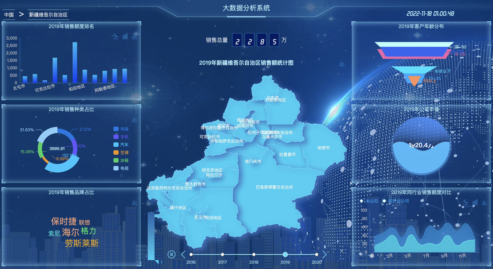
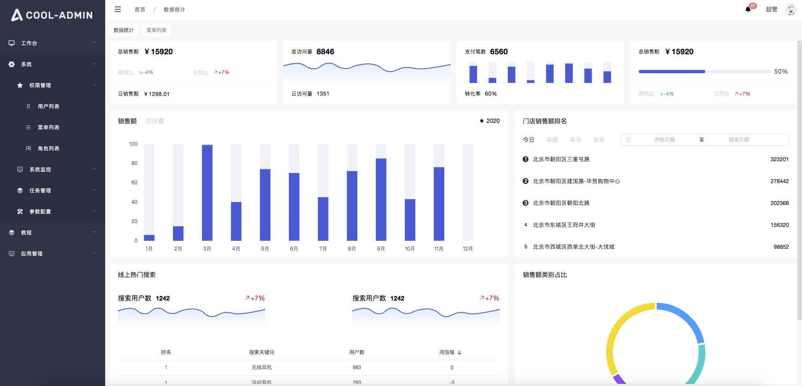

# Vue3.0项目

## PPTist
PPTist 是一个基于 Vue3.x + TypeScript + Pinia + Ant Design Vue + Canvas  的在线演示文稿（幻灯片）应用，还原了大部分 Office PowerPoint 常用功能，实现在线PPT的编辑、演示，支持导出PPT文件。

**Github：**[https://github.com/pipipi-pikachu/PPTist](https://github.com/pipipi-pikachu/PPTist)

## vue-next-admin
vue-next-admin 是一个基于 Vue3.x + Typescript + Vite + Element plus + Vuex 等，适配手机、平板、PC 的后台开源免费模板库。

**Github：**[https://github.com/lyt-Top/vue-next-admin](https://github.com/lyt-Top/vue-next-admin)

## Vue vben admin
Vue Vben Admin 是一个开源的中后台模版。使用了最新的 Vue3 + Vite + TypeScript + Pinia + Vue Router 等主流技术开发，开箱即用的中后台前端解决方案，也可用于学习参考。

**Github：**[https://github.com/vbenjs/vue-vben-admin](https://github.com/vbenjs/vue-vben-admin)

## VUE3-MUSIC
VUE3-MUSIC 是一个基于 Vue 3 + TypeScript + Vite + Pinia + Vueuse 开发的音乐播放器，界面模仿QQ音乐 Mac 客户端，支持黑夜模式。

**Github：**[https://github.com/SmallRuralDog/vue3-music](https://github.com/SmallRuralDog/vue3-music)

## vue-pure-admin
vue-pure-admin 是一款开源免费且开箱即用的中后台管理系统模版（兼容移动端）。使用 Vue3 + Vite + Element Plus、TypeScript + Pinia + Tailwindcss 等主流技术开发。

**Github：**[https://github.com/xiaoxian521/vue-pure-admin](https://github.com/xiaoxian521/vue-pure-admin)

## vue3-composition-admin
vue3-composition-admin 是一个管理端模板解决方案，它基于 Vue3、TypeScript、Vuex、Vue Router、Element plus，项目都是以 composition api 风格编写。

**Github：**[https://github.com/RainManGO/vue3-composition-admin](https://github.com/RainManGO/vue3-composition-admin)

## newbee-mall-vue3-app
newbee-mall-vue3-app 是一个基于 Vue3 + Vue Router4 + Vuex4 + Vant3 的大型单页面商城项目。商城系统包含首页门户、商品分类、新品上线、首页轮播、商品推荐、商品搜索、商品展示、购物车、订单结算、订单流程、个人订单管理、会员中心、帮助中心等模块。

**Github：**[https://github.com/newbee-ltd/newbee-mall-vue3-app](https://github.com/newbee-ltd/newbee-mall-vue3-app)

## Element Plus
Element Plus 是一个基于 Vue 3 + Vite + TypeScript + Vitest 的面向设计师和开发者的组件库。

**Github：**[https://github.com/element-plus/element-plus](https://github.com/element-plus/element-plus)

## vue3-bigData
vue3-bigData是一个可视化系统，基于 Vue3.0 + Vuex + Vue Router + TypeScript + Echarts实现，包括各种可视化图表。

**Github：**[https://github.com/biubiubiu01/vue3-bigData](https://github.com/biubiubiu01/vue3-bigData)

## cool-admin-vue
cool-admin 是一个基于  Vue3.x + Typescript + Vite + Element plus 的后台权限管理系统，开源免费，模块化、插件化、极速开发 CRUD，方便快速构建迭代后台管理系统。

**Github：**[https://github.com/cool-team-official/cool-admin-vue](https://github.com/cool-team-official/cool-admin-vue)

> 更新: 2022-11-18 09:03:18  
> 原文: <https://www.yuque.com/cuggz/feplus/qdvtxu8uodpqhnl1>