# Vue 项目

## Marktext
Marktext 是一个简单而优雅的开源 Markdown 编辑器，专注于速度和可用性，适用于 Linux、macOS 和 Windows。其支持实时预览、Markdown 扩展、输出HTML和PDF文件，主题切换、多种编辑模式、直接从剪贴板粘贴图像等功能。

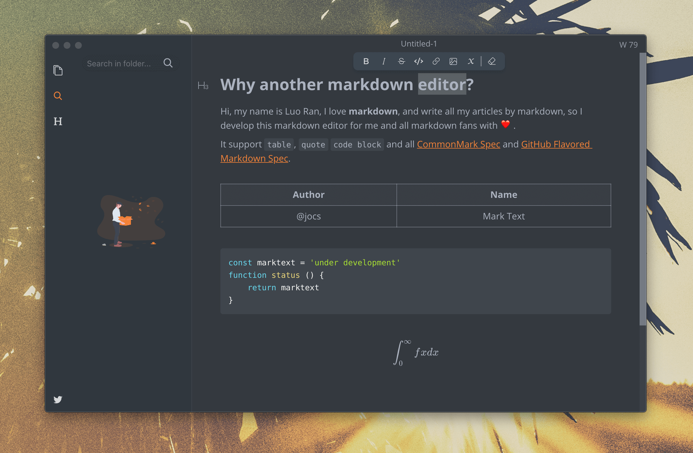

**Github：**[https://github.com/marktext/marktext](https://github.com/marktext/marktext)

## YesPlayMusic
YesPlayMusic 是一个高颜值的第三方网易云播放器，使用 Vue.js 全家桶开发。可以使用网易云账号登录（扫码/手机/邮箱登录），支持 MV 播放、歌词显示、每日推荐歌曲、每日自动签到、Light/Dark Mode 自动切换、Touch Bar、音乐云盘、定义快捷键和全局快捷键等功能。

**Github：**[https://github.com/qier222/YesPlayMusic](https://github.com/qier222/YesPlayMusic)

## PicGo
PicGo是一个用于快速上传图片并获取图片 URL 链接的工具，支持多种图床、拖拽图片上传、图片预览、上传图片后自动复制链接到剪切板、自定义复制到表格的链接格式、支持快捷键、支持通过发送HTTP请求调用PicGo上传等功能。

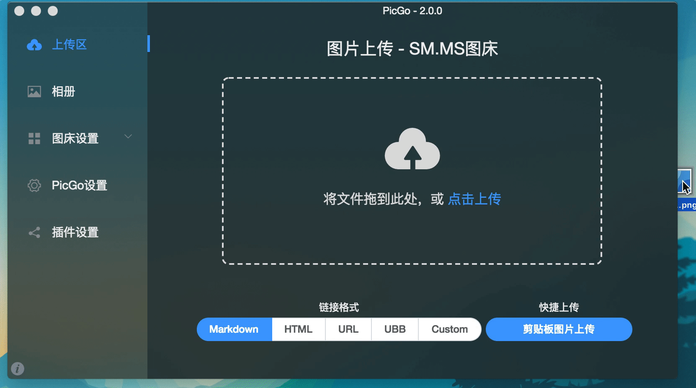

**Github：**[https://github.com/Molunerfinn/PicGo](https://github.com/Molunerfinn/PicGo)

## PPTist
PPTist  是一个基于 Vue3.x + TypeScript 的在线演示文稿（幻灯片）应用，还原了大部分 Office PowerPoint 常用功能，支持 文字、图片、形状、线条、图表、表格、视频、音频、公式 几种最常用的元素类型，每一种元素都拥有高度可编辑能力，同时支持丰富的快捷键和右键菜单，支持导出本地 PPTX 文件，支持移动端基础编辑和预览，支持 PWA。

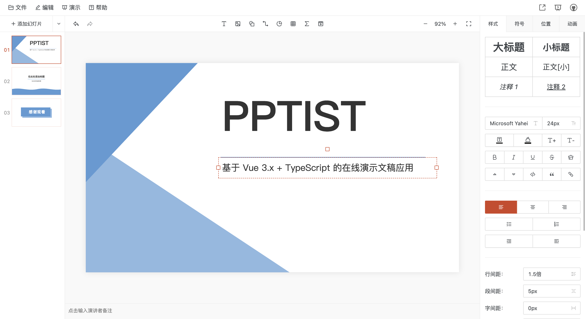

**Github：**[https://github.com/pipipi-pikachu/PPTist](https://github.com/pipipi-pikachu/PPTist)

## vue2-elm
vue2-elm 是一个基于 vue2 + vuex 构建一个具有 45 个页面的仿饿了么的大型单页面应用，涉及注册、登录、商品展示、购物车、下单等，是一个完整的流程。

**Github：**[https://github.com/bailicangdu/vue2-elm](https://github.com/bailicangdu/vue2-elm)

## vue-element-admin
vue-element-admin 是一个后台前端解决方案，它基于 vue 和 element-ui实现。它使用了最新的前端技术栈，内置了 i18n 国际化解决方案，动态路由，权限验证，提炼了典型的业务模型，提供了丰富的功能组件。

**Github：**[https://github.com/PanJiaChen/vue-element-admin](https://github.com/PanJiaChen/vue-element-admin)

## **Cider**
Cider 是一个基于 Electron 和 Vue.js 的全新跨平台 Apple Music 体验，从头开始编写，同时兼顾性能和视觉效果。

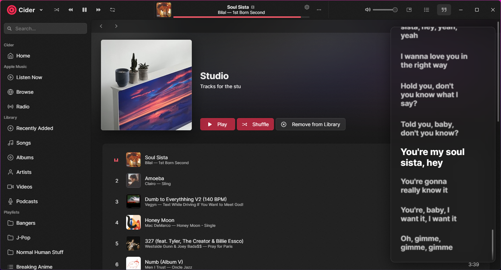

**Github：**[https://github.com/ciderapp/Cider](https://github.com/ciderapp/Cider)

**newbee-mall-vue3-app**

newbee-mall 项目是集电商，包括newbee-mall商城系统及newbee-mall-admin后台管理系统，基于Spring Boot 2.X和商城 Vue 3 以及相关技术栈开发。前台系统包含首页门户、商品分类新品上线、首页轮播、商品推荐、商品搜索、商品、购物车、订单结算、订单展示流程、订单管理、会员中心、帮助中心等模块。后台管理系统包含数据面板、播图管理、商品管理、订单管理、会员管理、分类管理、设置等模块。

**Github：**[https://github.com/newbee-ltd/newbee-mall-vue3-app](https://github.com/newbee-ltd/newbee-mall-vue3-app)

## Wiki.js 
Wiki.js 是一款基于 Node.js + Vue 技术栈的强大、可高度扩展、开源的 Wiki 系统。其界面简洁美观、权限管理灵活，支持多种编辑器、多种用户验证方式、多种备份存储方式、多种搜索引擎，支持国际化、自定义主题、流量分析等，适合做小团队的知识库，适合管理和阅读，支持协同创作。

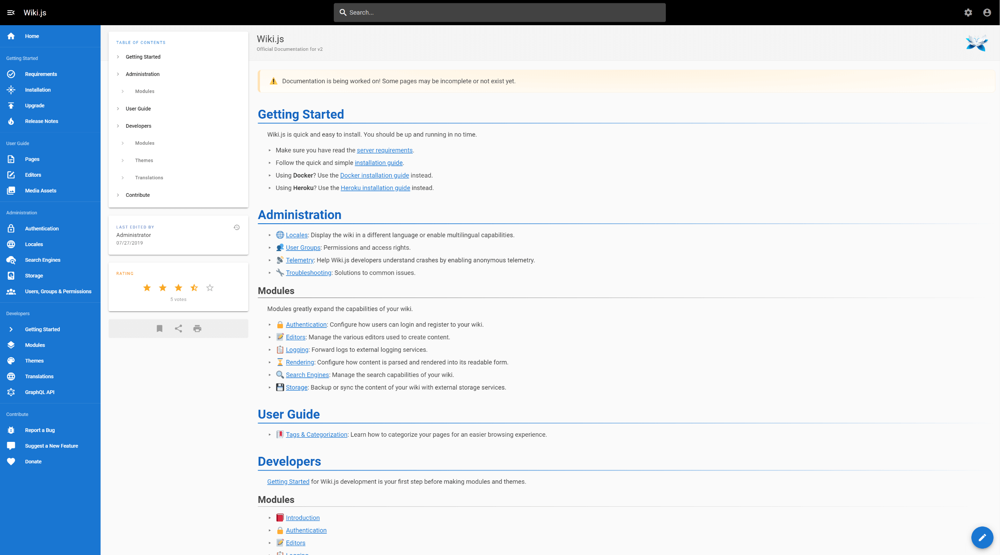

**Github：**[https://github.com/requarks/wiki](https://github.com/requarks/wiki)

## Hoppscotch
Hoppscotch 是一种可以通过 Web 服务的方式构建 API 访问的工具，使用 Node.js + Vue 开发，采用简约的 UI 设计，能实时发送和获取响应值，它的的前身是 Postwoman。Hoppscotch 功能与 Postman 类似，不仅支持 HTTP/HTTPS ，而且还支持 WebSocket、Socket.io、EventSourcee、MQTT、GraphQL。

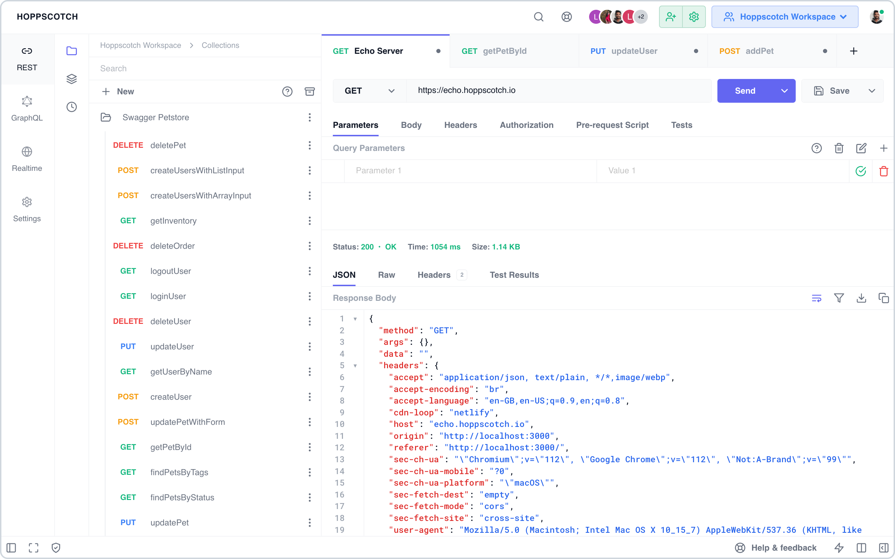

**Github：**[https://github.com/hoppscotch/hoppscotch](https://github.com/hoppscotch/hoppscotch)

## Slidev
Slidev 是基于 Web 的幻灯片制作和演示工具。它旨在让开发者专注在 Markdown 中编写内容，同时拥有支持 HTML 和 Vue 组件的能力，并且能够呈现像素级完美的布局，还在你的演讲稿中内置了互动的演示样例。它使用了功能丰富的Markdown文件来生成精美的幻灯片，具有即时重载的体验。它还拥有很多内置的集成功能，如实时编码、导出 PDF、演讲录制等。Slidev 基于 Vue 3 + Vite + VueUse 等技术实现。

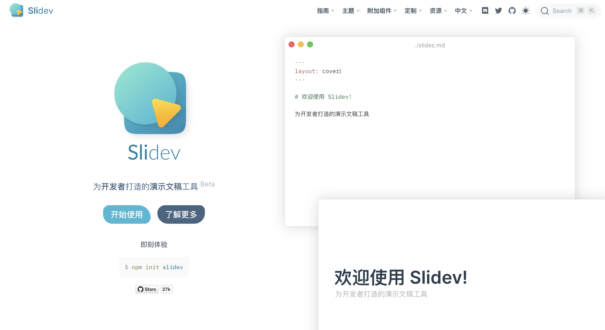

**Github：**[https://github.com/slidevjs/slidev](https://github.com/slidevjs/slidev)

## File browser
filebrowser 是一个使用 Go + Vue 编写的工具，用于在浏览器中对服务器上的文件进行管理。可以是修改文件，或者是添加删除文件，甚至可以分享文件，是一个很棒的文件管理器，可以当成网盘使用。

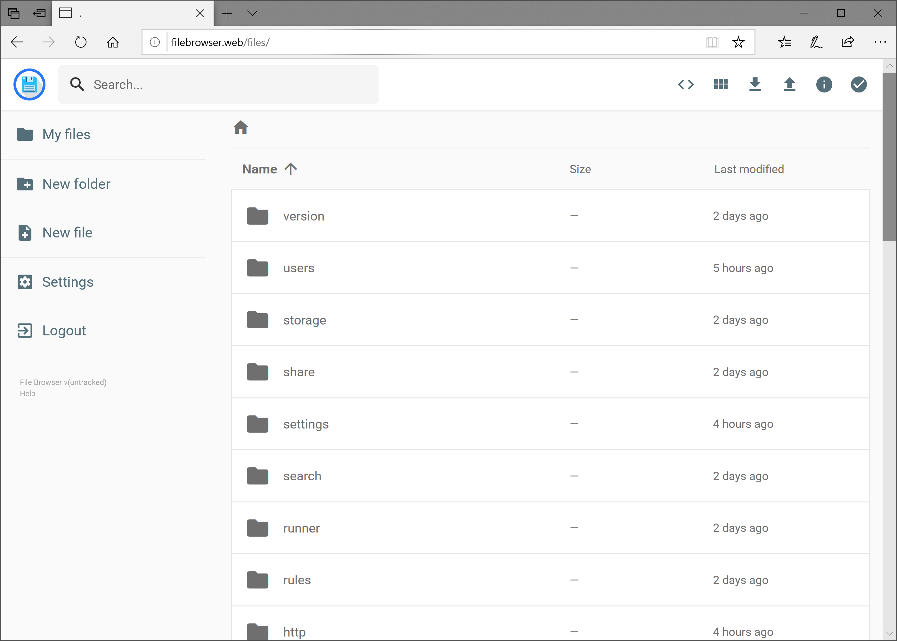

**Github：**[https://github.com/filebrowser/filebrowser](https://github.com/filebrowser/filebrowser)

## Chatwoot
Chatwoot 是一个开源、自托管的用于即时消息渠道的客户支持工具，可以帮助企业提供客户支持。它是 Intercom、Zendesk、Salesforce Service Cloud 等的开源替代品。Chatwoot 对发生在不同沟通渠道的对话提供了一个综合视图。Chatwoot 的前端使用 Vue 编写。

**Github：**[https://github.com/chatwoot/chatwoot](https://github.com/chatwoot/chatwoot)

## JEECG BOOT
JeecgBoot—Vue3版前端源码，采用 Vue3.0+TypeScript+Vite+Ant-Design-Vue等新技术方案，包括二次封装组件、utils、hooks、动态菜单、权限校验、按钮级别权限控制等功能。 是JeecgBoot低代码平台的vue3技术栈的全新UI版本。

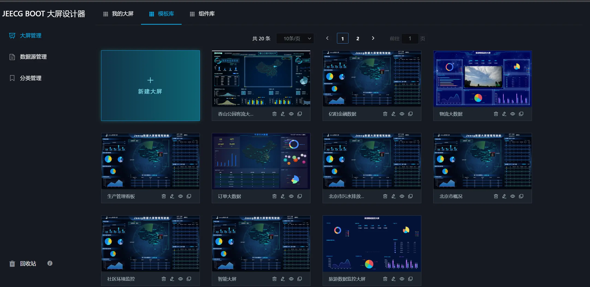

**Github：**[https://github.com/jeecgboot/jeecgboot-vue3](https://github.com/jeecgboot/jeecgboot-vue3)

## MarkText
MarkText 是一个基于 Vue + Electron 的简单而优雅的开源 markdown 编辑器，专注于速度和可用性。

**Github：**[https://github.com/marktext/marktext](https://github.com/marktext/marktext)

## Eplee
Eplee 是一款基于 Vue + Electron 的 ePub 阅读器，专注于通过简单美观的 UI 提供干净、无干扰的阅读体验。

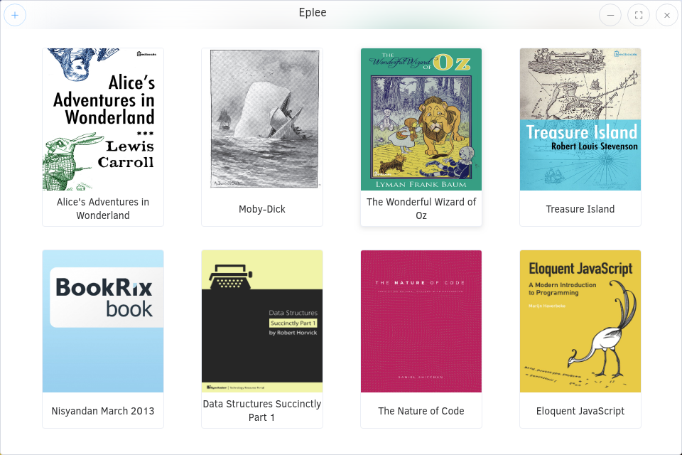

**Github：**[https://github.com/Janglee123/eplee](https://github.com/Janglee123/eplee)

## **Reader**
Reader 是一个后端基于 Kotlin + Spring Boot + Vert.x + Coroutine,前端基于 Vue.js + Element 的阅读工具。其支持书架管理、搜索、书海、看书、换源、翻页方式、手势支持、自定义主题、自定义样式、WebDAV同步、文字替换过滤、听书、用户配置备份恢复、漫画、音频、书源失效检测、导入本地TXT、EPUB、UMD格式的书籍、书籍分组、RSS订阅、定时更新书架、并发搜书、本地书仓等功能。

**Github：**[https://github.com/hectorqin/reader](https://github.com/hectorqin/reader)

## Habitica
Habitica 是习惯养成及生产力应用，让你 “游戏人生”。游戏里的奖惩措施能激励你完成任务。Habitica 能够帮助你达成目标，变得健康，勤奋，快乐。Habitica 可以让你如角色扮演游戏般对待你的目标，对待你的生活。 当你成功时升级，当你失败时掉血，然后一直不断地赚钱买武器和盔甲。Habitica 前端使用 Vue 编写。

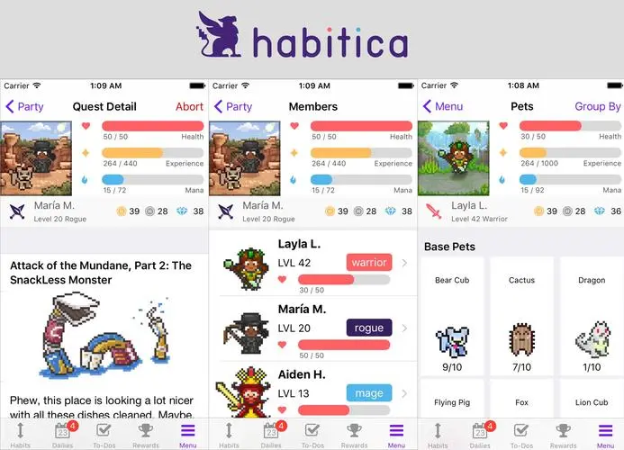

**Github：**[https://github.com/HabitRPG/habitica](https://github.com/HabitRPG/habitica)

> 更新: 2023-07-17 15:59:45  
> 原文: <https://www.yuque.com/cuggz/feplus/in6k42>