# Web3 项目

## Lenster
Lenster 是一款使用 Lens Protocol 协议构建的去中心化且无需许可的 Web 3 社交媒体应用，允许连接 Web3 钱包和使用 Lens 来登陆。在 Lenster 可以发布帖子、浏览朋友圈和探索内容趋势，还可以直接搜索相关内容帖子或者用户 Profiles。Lenster 关注隐私、安全和用户控制，旨在通过为用户提供更透明、更公平的数字环境来颠覆社交媒体领域。

**Github：**[https://github.com/lensterxyz/lenster](https://github.com/lensterxyz/lenster)

## Lenstube
Lenstube 是一个基于 Lens Protocol 构建的开源视频共享社交媒体平台，由 Livepeer 和 Vercel 提供支持，创作者上传视频时可以选择视频收集对象，限制收集人数、视频类别以及设置收集费用和推荐费用，也可以直接将发布的视频转发同步至 Lens。

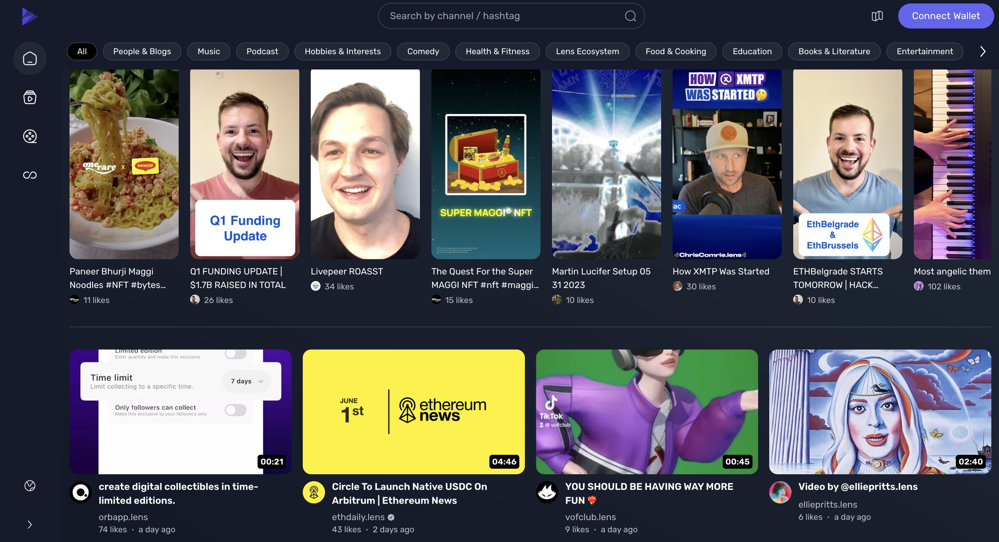

**Github：**[https://github.com/lenstube-xyz/lenstube](https://github.com/lenstube-xyz/lenstube)

## Embark
Embark 是一个用于轻松开发和部署 Serverless 去中心化应用（DApps）的框架。Embark 目前集成了 EVM 区块链（以太坊）、去中心化存储（IPFS） 和去中心化通信平台（Whisper 和 Orbit），部署支持 Swarm。

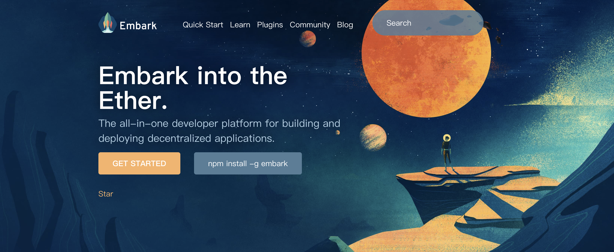

**Github：**[https://github.com/embarklabs/embark](https://github.com/embarklabs/embark)

## Web3UI Kit
Web3Modal 是一个开源的 JavaScript 库，旨在为 Web3（以太坊、BSC、Polygon 等区块链）DApp 提供简单易用的登录和交互体验。它支持多种钱包提供商，如 MetaMask、WalletConnect、Portis、Trezor、Ledger 等，并且能够跨设备、浏览器和平台提供一致的用户体验。

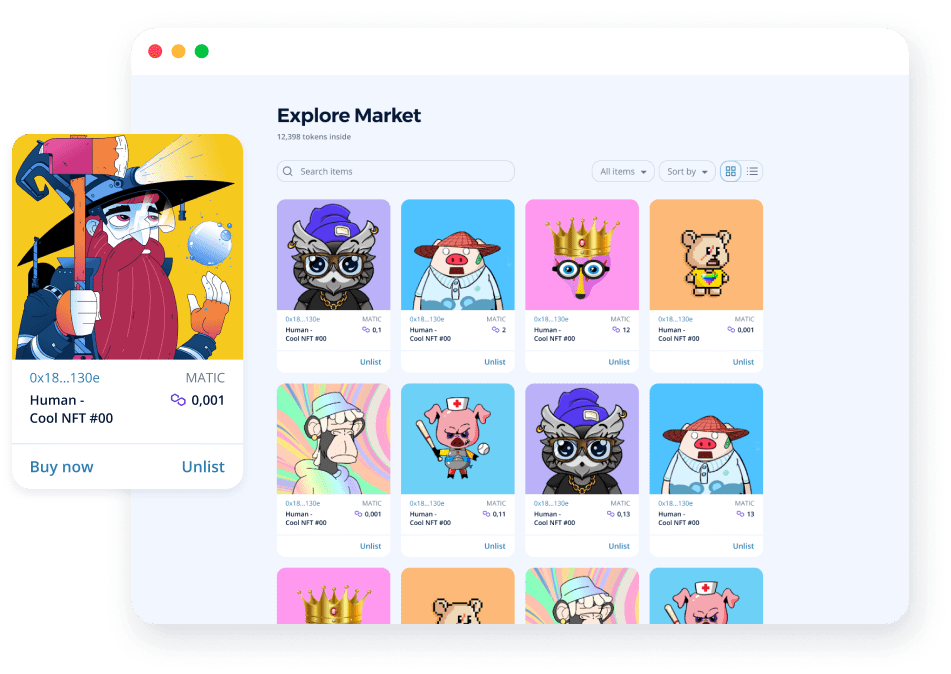

**Github：**[https://github.com/web3ui/web3uikit](https://github.com/web3ui/web3uikit)

## Web3Modal
Web3Modal 是一个多功能的库，可以轻松地将用户与 Dapp 连接起来并开始与区块链交互。可以在一个地方管理多链钱包连接流。在设计时同时考虑到开发人员和用户，它易于集成和定制，带来独特的体验。

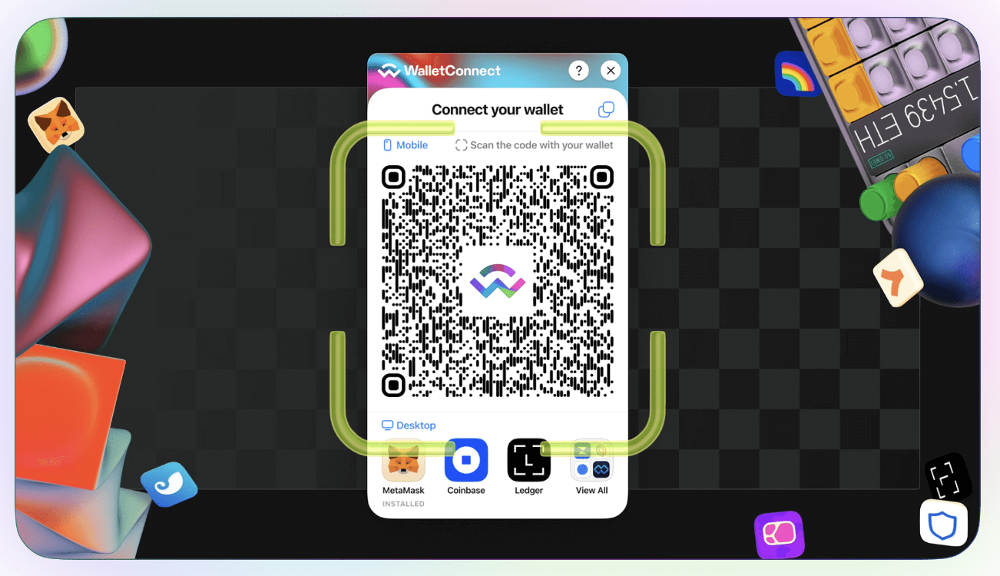

**Github：**[https://github.com/WalletConnect/web3modal](https://github.com/WalletConnect/web3modal)

## web3.js
web3.js 是以太坊官方的 JavaScript 库，提供了与以太坊区块链（和基于以太坊的其他区块链）进行交互的API。通过 web3.js，开发者可以从他们的应用中与区块链进行交互，例如读取账户信息、创建和管理智能合约、发送交易等。该库不仅限于浏览器环境，也可以在 node.js 环境中使用。Web3.js 支持以太坊 JSON-RPC API 的所有功能，并且提供了一些高级功能，如合约 ABIs 的自动解析、以太坊 gas 费用的自动计算和签名交易的功能。

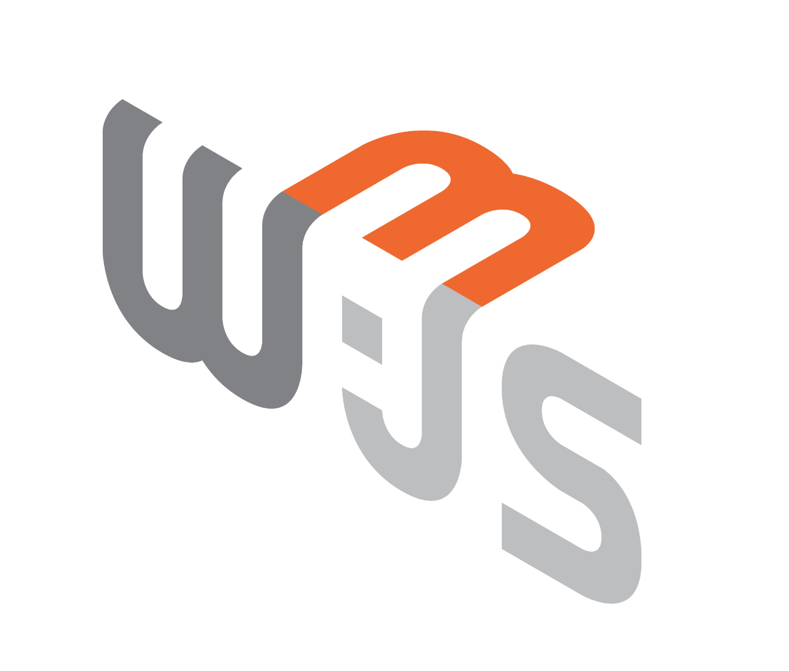

**Github：**[https://github.com/web3/web3.js](https://github.com/web3/web3.js)

## **ethers.js**
ethers.js 是一个完整的以太坊开发库，提供了一套易于使用的 API，用于在 Web3 浏览器和 node.js 环境中进行操作。ethers.js 可以用于与以太坊节点进行交互，例如读取账户余额和发送交易，还可以部署、管理和调用智能合约。与 web3.js 不同的是，ethers.js 专注于提供简洁、易于理解和安全的 API。ethers.js 还提供了许多高级功能，如 EIP-1193 支持、钱包管理、大数据签名、批处理交易等。它还提供了一组基本的安全标准，以确保您的应用程序和以太坊网络之间的通信是安全且可靠的。

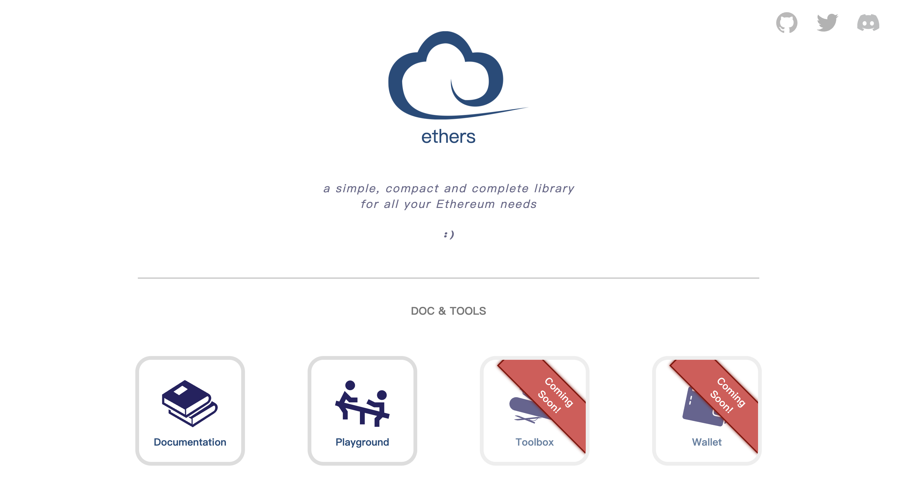

**Github：**[https://github.com/ethers-io/ethers.js](https://github.com/ethers-io/ethers.js)

## **wagmi** 
wagmi 是一个 React Hook 的集合，包含了你与以太坊交互所需的一切。wagmi 使连接钱包、显示 ENS 和余额信息、签署消息、与合约交互等变得简单——所有这些都有缓存、重复请求降重和持久化。

wagmi 具有以下特点：

+ 20 多个 Hook 用于处理 Wallet、ENS、Contract、Transaction、Signature 等
+ 内置 MetaMask、WalletConnect、Coinbase Wallet 和 Injected 的钱包连接器
+ 缓存、重复请求降重、multicall、批量处理和持久化
+ 基于钱包、区块和网络的变化自动刷新数据
+ 支持 Multicall
+ 支持临时分叉以太坊网络运行的测试套件
+ 支持 TypeScript（可以从 ABI 和 EIP-712 类型数据中推断类型）
+ 大量的文档和示例
+ 被 [ENS](https://ens.domains/), [Foundation](https://foundation.app/), [Sushi](https://sushi.com/) 等使用。

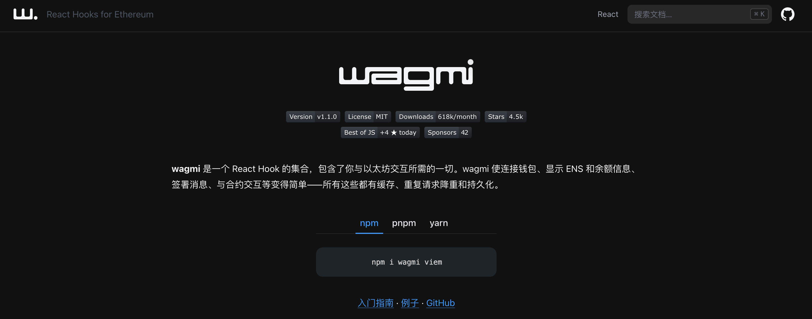

**Github：**[https://github.com/wagmi-dev/wagmi](https://github.com/wagmi-dev/wagmi)

## Web3-react
Web3-react 是一个用于 React 应用的开源库，旨在使 DApp 的开发更加容易。它提供了一套用于管理 Web3 实例的 React 组件和钩子，以及用于获取用户账户、网络等信息的功能。Web3-react 还可以轻松处理不同的 Web3 提供商，例如 MetaMask、WalletConnect、Portis 等。

Web3-react 提供了一个标准接口，用于与以太坊网络进行交互，使开发者能够专注于应用程序的逻辑和界面开发，而不必关心底层实现细节。它还提供了一些其他的高级功能，如支持 EIP-1193 标准、处理多个 Web3 实例和清除缓存等。

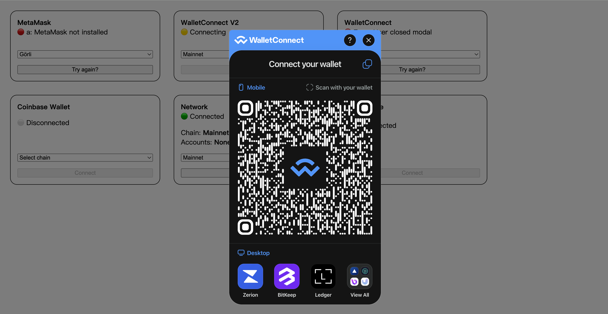

**Github：**[https://github.com/Uniswap/web3-react](https://github.com/Uniswap/web3-react)

## RainbowKit
RainbowKit 是一个 React 库，可以轻松地将钱包连接添加到 dapp。该工具可简化开发人员在开发DApp时需要进行的多钱包、多网络连接支持工作。RainbowKit支持所有EVM兼容链。

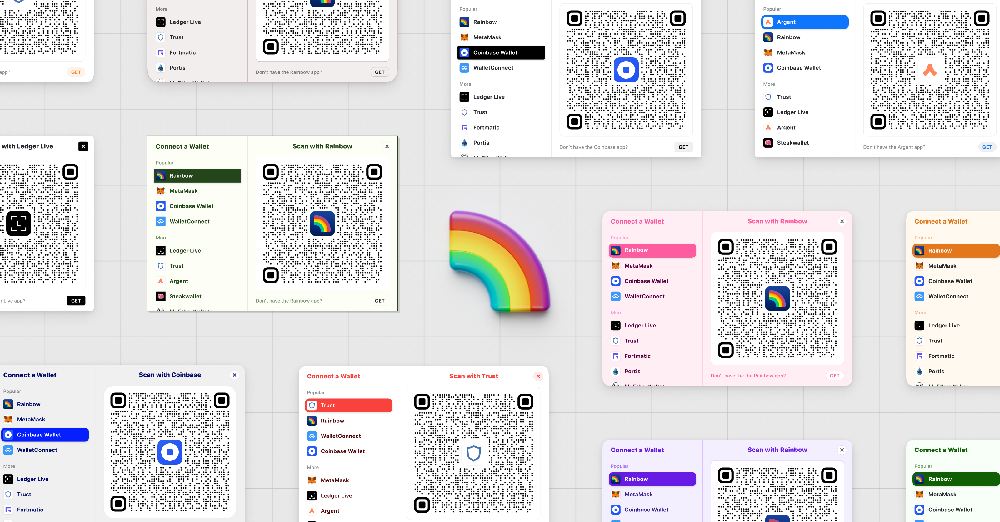

**Github：**[https://github.com/rainbow-me/rainbowkit](https://github.com/rainbow-me/rainbowkit)

## Foundry
Foundry 是一款用 Rust 编写的用于以太坊应用程序开发的快速、便携和模块化工具包。它包括：

+ Forge：以太坊测试框架（如 Truffle、Hardhat 和 DappTools）。
+ Cast：用于与 EVM 智能合约交互，发送交易和获取链数据。
+ Anvil：本地以太坊节点，类似于 Ganache、Hardhat Network。
+ Chisel：快速、实用且详细的 REPL。

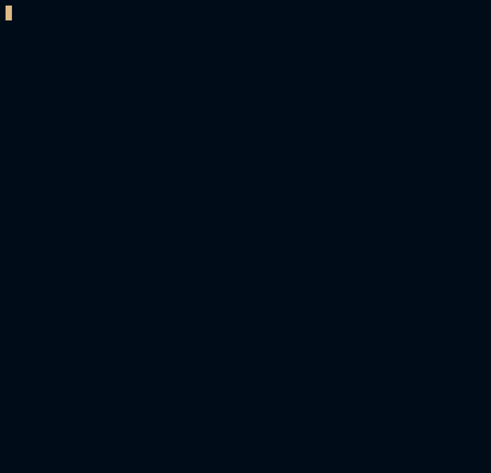

**Github：**[https://github.com/foundry-rs/foundry](https://github.com/foundry-rs/foundry)

## DeFi Developer Road Map
DeFi Developer Road Map 是去中心化金融（DeFi）开发者的学习和技能路线图，该路线图包括了从基础的区块链知识、智能合约、加密货币等概念开始，逐渐深入到各种DeFi协议、去中心化交易所（DEX）、流动性挖掘（Liquidity Mining）、闪电贷（Flash Loans）等高级概念和实际项目开发。

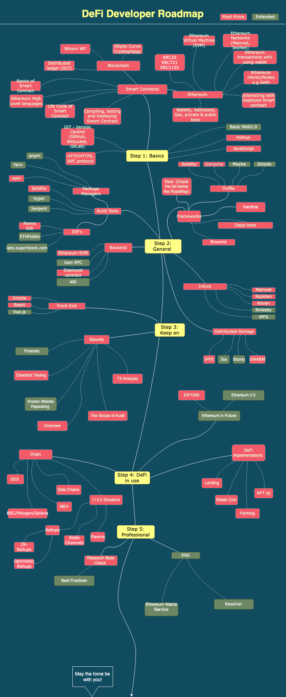

**Github：**[https://github.com/OffcierCia/DeFi-Developer-Road-Map](https://github.com/OffcierCia/DeFi-Developer-Road-Map)

## FREE Web3 resources
FREE Web3 resources 给开发者和学习者提供了 Web3 相关资源，这些资源可以包括各种在线课程、文档、视频教程、社区和开放源代码库等。它们可以帮助更好地理解和使用 Web3 技术，构建去中心化、安全和可靠的应用。

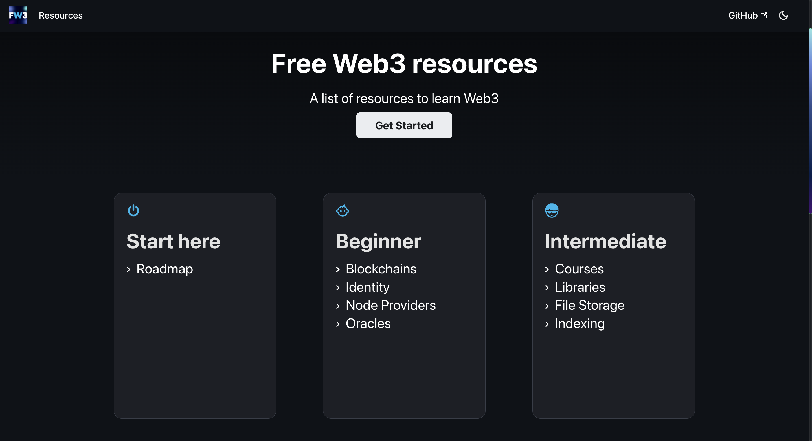

**Github：**[https://github.com/FrancescoXX/free-Web3-resources](https://github.com/FrancescoXX/free-Web3-resources)

## Awesome Web 3
一组很棒的 Web 3 学习资源。

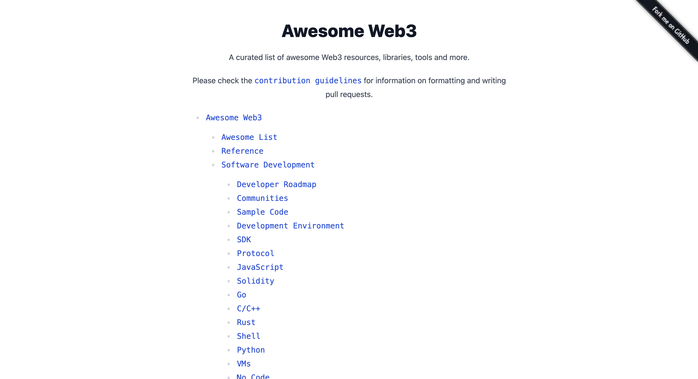

**Github：**[https://github.com/ahmet/awesome-web3](https://github.com/ahmet/awesome-web3)

## Awesome Ethereum
一组很棒的以太坊和 Dapps 学习资源。

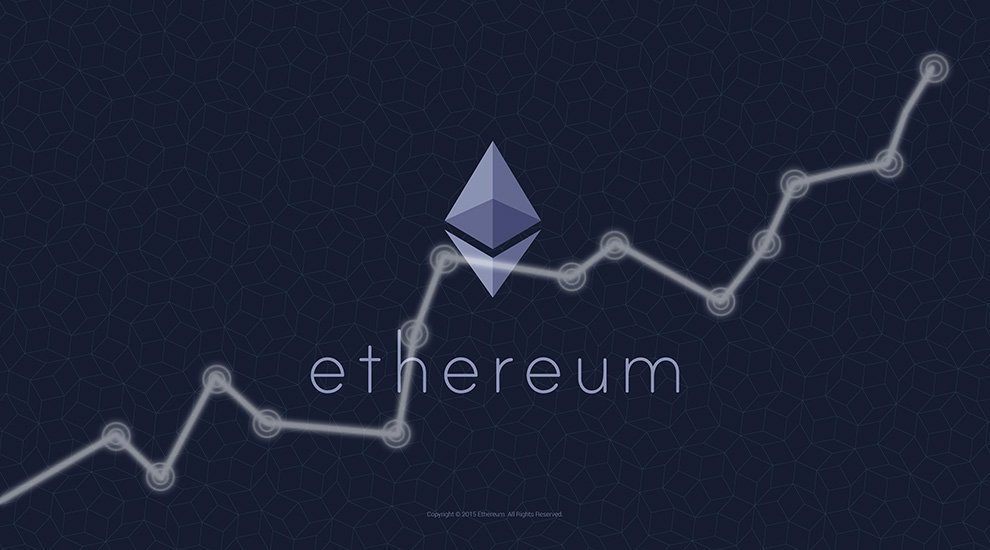

**Github：**[https://github.com/bekatom/awesome-ethereum](https://github.com/bekatom/awesome-ethereum)

> 更新: 2023-07-17 16:04:52  
> 原文: <https://www.yuque.com/cuggz/feplus/svikh484d5xbhxq6>