# Windows

本文来分享五个 yyds 的前端开源项目，这些项目把 Windows 带到了 Web 平台上。让我们一起感受这些项目带来的回忆和创新，重温 Windows 93、98、XP 和 7 的经典界面，甚至探索现代概念中的 Windows 11 和 12！

## Windows 12
使用 JavaScript、CSS、HTML 等技术开发的网页版 Windows 12，且支持深色模式。作者希望让用户在web上预先体验Windows 12。系统很多操作都内置了很多动画，操作起来非常丝滑，流畅。

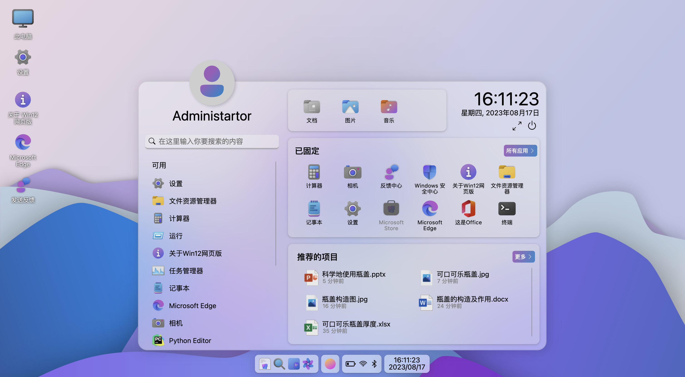

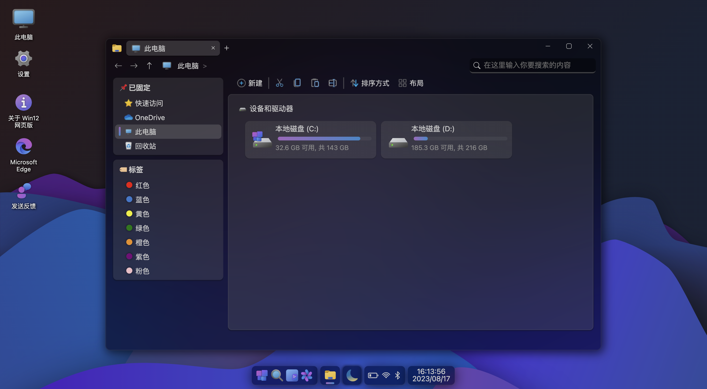

**在线体验：**[https://tjy-gitnub.github.io/win12/desktop.html](https://tjy-gitnub.github.io/win12/desktop.html)

**Github：**[https://github.com/tjy-gitnub/win12](https://github.com/tjy-gitnub/win12)

## Windows 11
Win11 in React是一个使用 React、Redux、Vite、firebase 等技术开发的复制 Windows 11 桌面体验的React项目。让开发者可以在浏览器上就可以体验 Windows 11 操作系统的魅力。

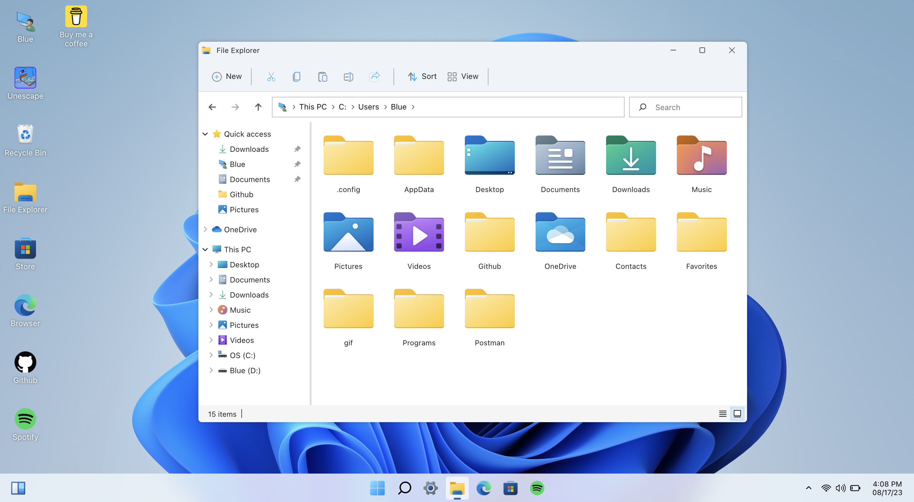

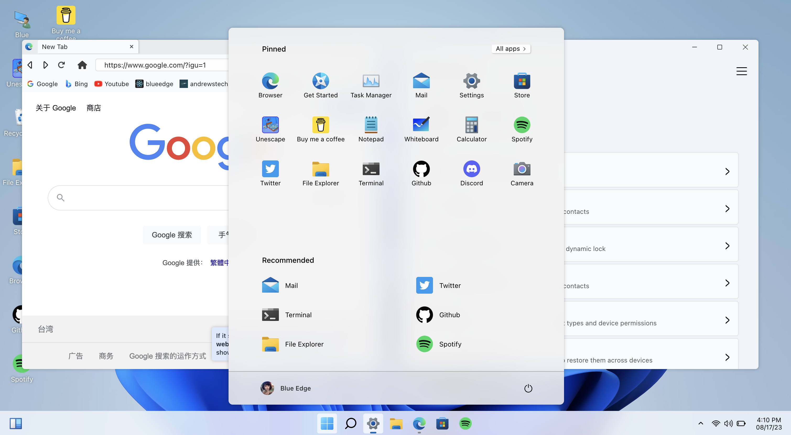

**在线体验：**[https://win11.blueedge.me/](https://win11.blueedge.me/)

**Github：**[https://github.com/blueedgetechno/win11React](https://github.com/blueedgetechno/win11React)

## Window 7
使用 Vue 3、Vite 等技术开发的网页版 Window 7。

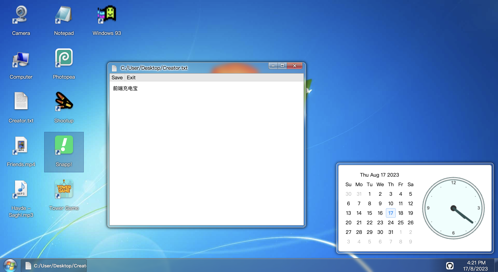

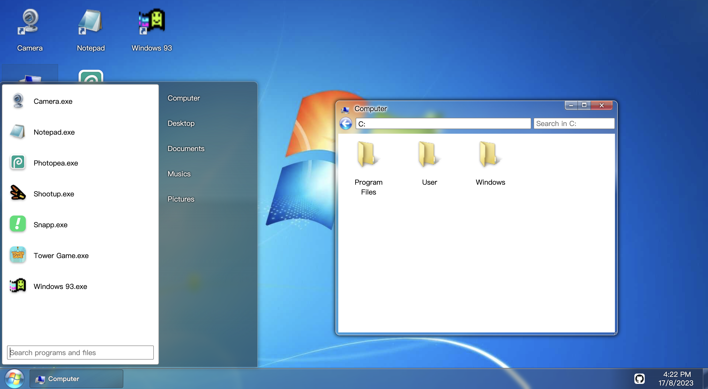

**在线体验：**[https://nainemom.github.io/win7/](https://nainemom.github.io/win7/)

**Github：**[https://github.com/nainemom/win7](https://github.com/nainemom/win7)

## Windows XP
使用 React、Styled-Components、react-use 等开发的网页版 Windows XP 系统。它提供了类似于Windows XP的开始菜单、任务栏、窗口管理、图标等视觉元素，并模拟了一些Windows XP的功能，如文件管理、应用程序运行等。

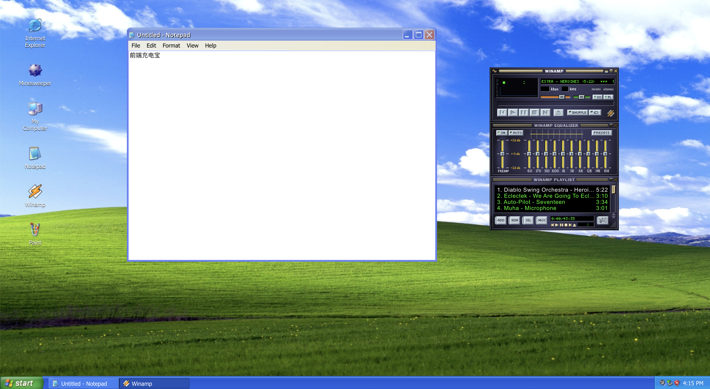

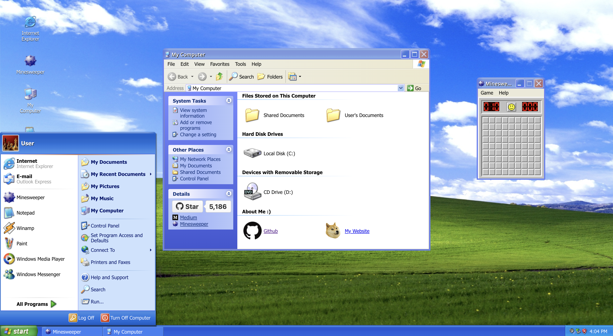

**在线体验：**[https://winxp.vercel.app/](https://winxp.vercel.app/)

**Github：**[https://github.com/ShizukuIchi/winXP](https://github.com/ShizukuIchi/winXP)

## Windows 98
使用 JavaScript、CSS、HTML 等技术开发的基于Web的Windows 98桌面模拟系统重制版。包括以下功能：记事本

、录音机、画图工具、计算器、3D管道屏保、3D花盒屏保、扫雷游戏、纸牌游戏、弹球游戏、Winamp 2.9播放器、Windows资源管理器/Internet Explorer、帮助查看器、Clippy 等。

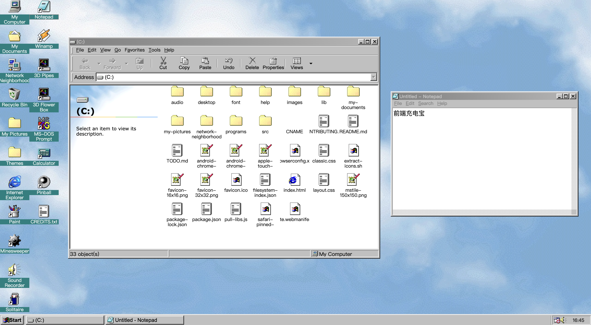

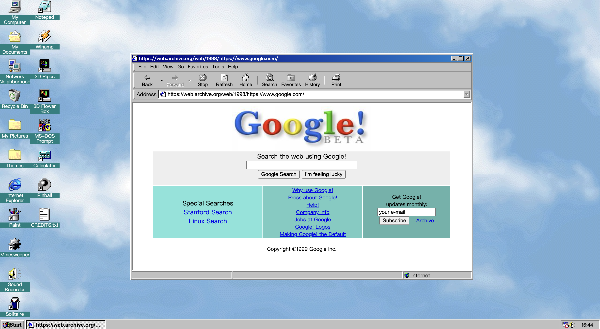

**在线体验：**[https://98.js.org/](https://98.js.org/)

**Github：**[https://github.com/1j01/98](https://github.com/1j01/98)

## 彩蛋
### Windows 93（未开源）
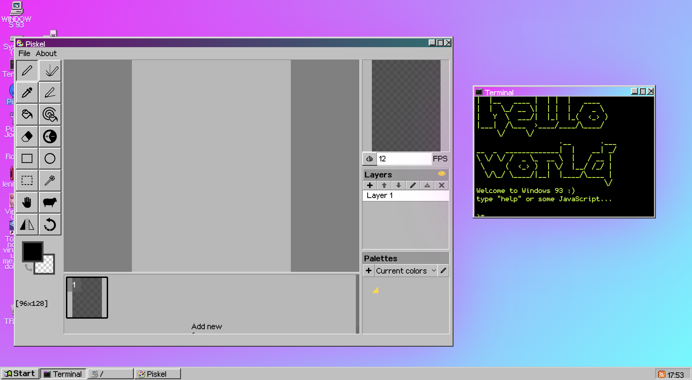

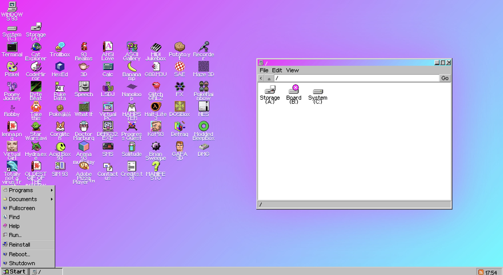

**在线体验：**[https://www.windows93.net/](https://www.windows93.net/)

### Windows 2000（未开源）
 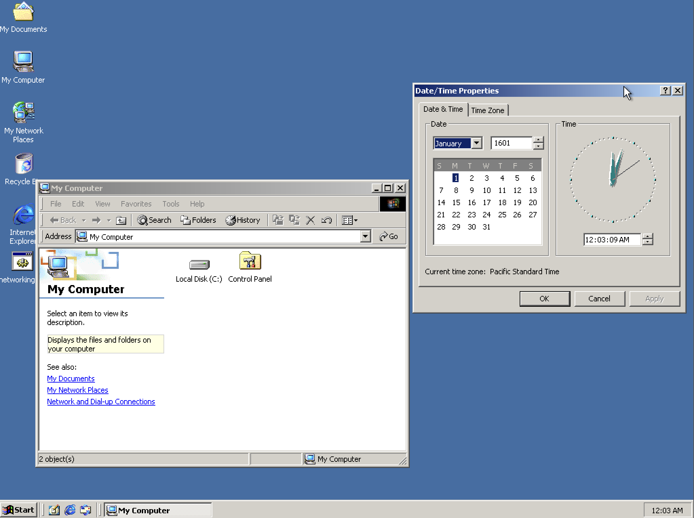

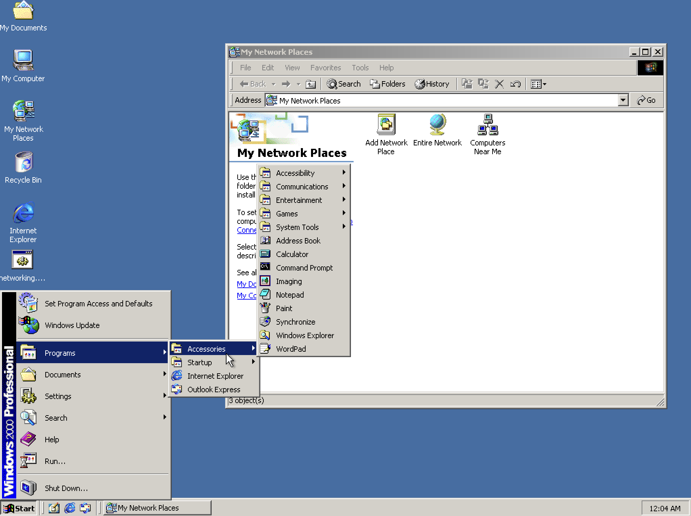

**在线体验：**[http://copy.sh/v86/?profile=windows2000](http://copy.sh/v86/?profile=windows2000)

> 更新: 2023-09-22 00:20:50  
> 原文: <https://www.yuque.com/cuggz/feplus/gbaufmpgrhl5p8f5>