# 低代码项目

## Appsmith
Appsmith 是一款开源低代码框架，主要用于构建管理面板、内部工具和仪表板等，允许拖放 UI 组件来构建页面，通过连接到任何 API、数据库或 GraphQL 源，并使用 JavaScript 语言编写逻辑，可以在短时间内创建内部应用程序。

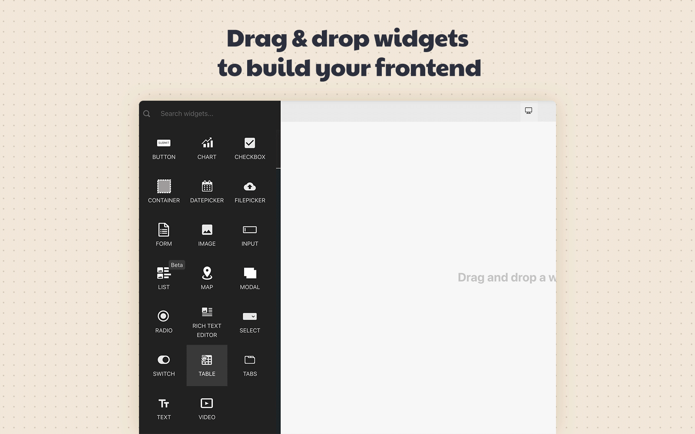

**Github（****⭐****️ 20.2k）：**[https://github.com/appsmithorg/appsmith](https://github.com/appsmithorg/appsmith)

## Amis
Amis 是百度开源的一块前端低代码框架，通过 JSON 配置就能生成各种后台页面，极大减少开发成本，甚至可以不需要了解前端。

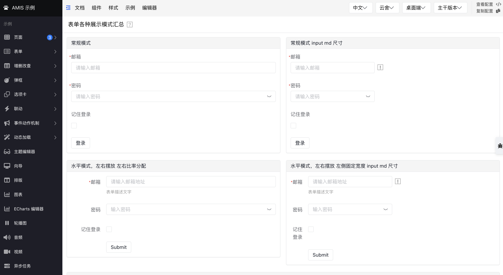

**Github（****⭐****️ 11.6k）：**[https://github.com/baidu/amis](https://github.com/baidu/amis)

## LowCodeEngine
LowCodeEngine 低代码引擎是一款为低代码平台开发者提供的，具备强大扩展能力的低代码研发框架。由阿里巴巴前端委员会、钉钉宜搭联合出品。使用者只需要基于低代码引擎便可以快速定制符合自己业务需求的低代码平台。

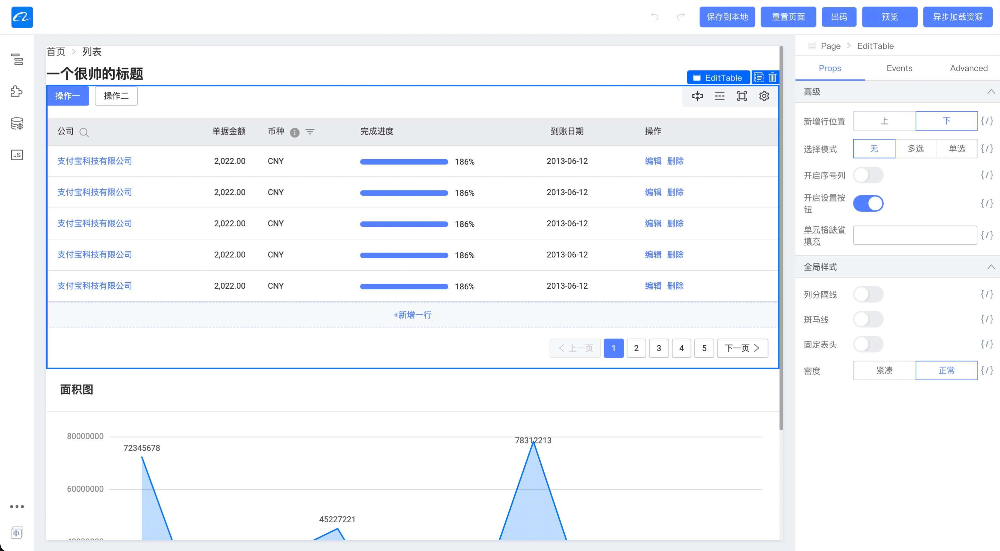

**Github（****⭐****️ 7.5k）：**[https://github.com/alibaba/lowcode-engine](https://github.com/alibaba/lowcode-engine)

## form-generator
Element UI表单设计及代码生成器，可将生成的代码直接运行在基于Element的vue项目中；也可导出JSON表单，使用配套的解析器将JSON解析成真实的表单。

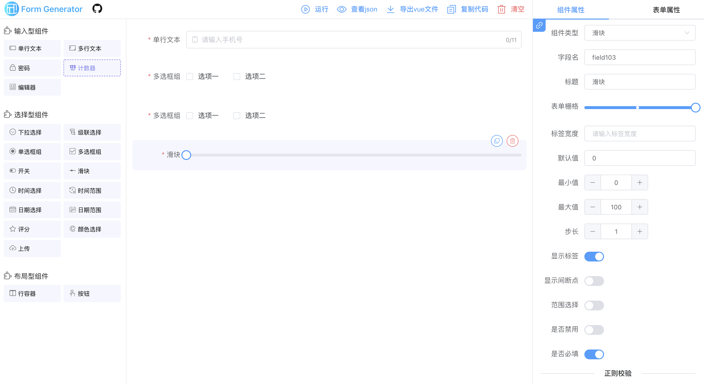

**Github（****⭐****️ 6.8k）：**[https://github.com/JakHuang/form-generator](https://github.com/JakHuang/form-generator)

## H5-Dooring/pc-Dooring
H5-Dooring是一款功能强大、专业可靠的H5可视化页面配置解决方案，致力于提供一套简单方便、专业可靠、无限可能的H5落地页最佳实践。技术栈以 React 和 TypeScript 为主，后台采用nodejs开发。除了 H5 版，还提供了 PC 版。

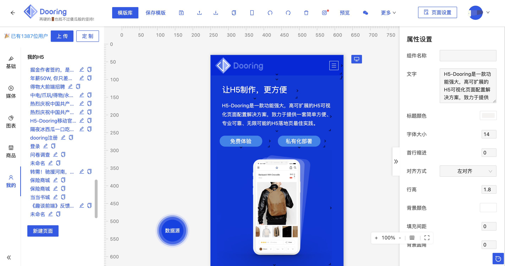

**Github（H5）（****⭐****️ 6.7k）：**[https://github.com/MrXujiang/h5-Dooring](https://github.com/MrXujiang/h5-Dooring)

**Github（PC）（****⭐****️ 354）：**[https://github.com/MrXujiang/pc-Dooring](https://github.com/MrXujiang/pc-Dooring)

## YAO

Yao 是一款支持快速创建 Web 服务和管理后台的开源低代码应用引擎。只需使用 JSON 即可创建数据库模型、编写 API 接口、描述管理后台界面的低代码引擎，使用 Yao 构建的应用可运行在云端或物联网设备上。 

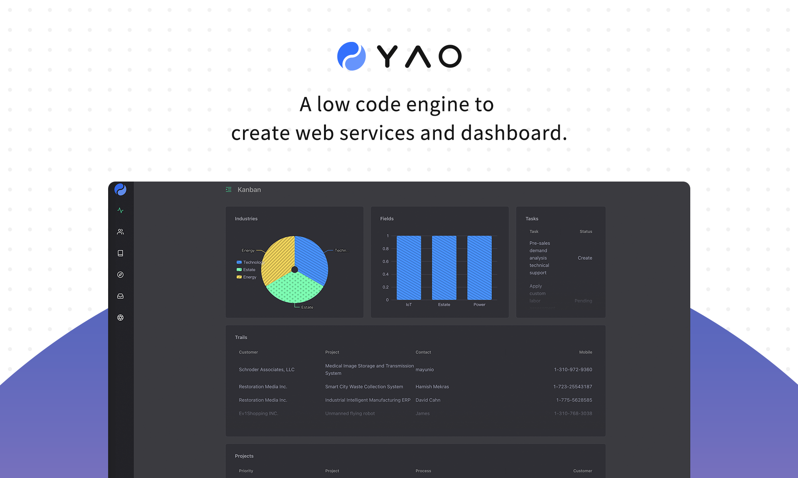

**Github（****⭐****️ 4.3k）：**[https://github.com/YaoApp/yao](https://github.com/YaoApp/yao)

## Mometa
mometa 不是传统主流的低代码平台，而是面向研发的、代码可视设计编辑平台；它更像是 dreamweaver、gui 可视编辑之于程序员。它的定位更多是基于程序员本地开发的模式，新增了可视化编码的能力。

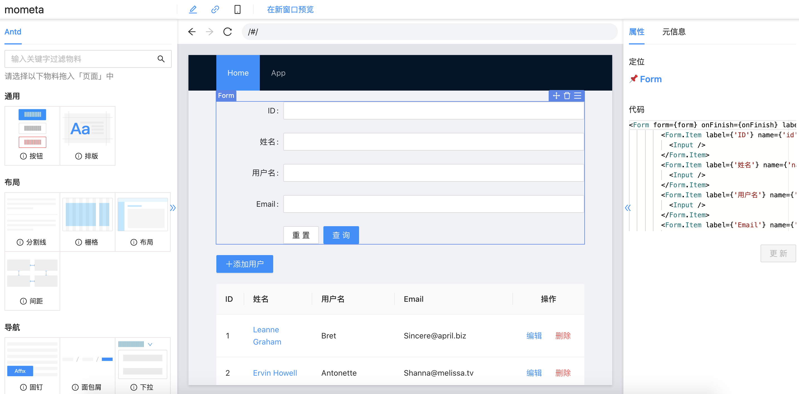  

**Github（****⭐****️ 3.2k）：**[https://github.com/imcuttle/mometa](https://github.com/imcuttle/mometa)

## NocoBase
NocoBase 是一个极易扩展的开源无代码开发平台。 无需编程，使用 NocoBase 搭建自己的协作平台、管理系统，只需要几分钟时间。如果你有以下需求，NocoBase 就是为你设计的：

+ 开发组织内部管理系统
+ 通过无代码开发，满足大部分业务需求
+ 无代码开发在操作上足够简单，满足非开发人员；在功能上足够灵活，接近原生开发
+ 可以非常方便的进行扩展开发
+ 私有部署，掌控全部代码和数据

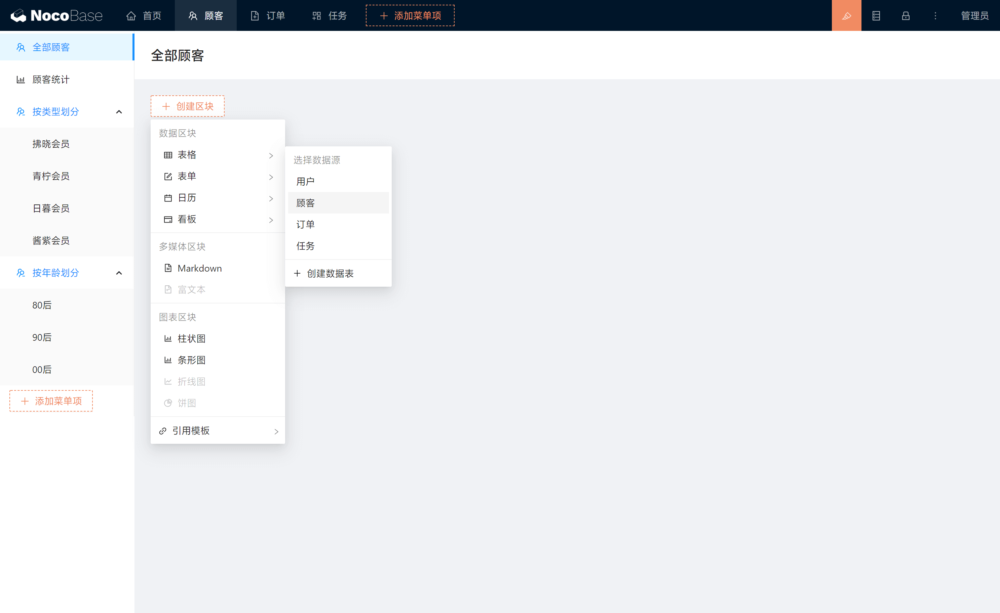

**Github（****⭐****️ 2.9k）：**[https://github.com/nocobase/nocobase](https://github.com/nocobase/nocobase)

## Sparrow
sparrow 是一个场景化低代码（LowCode）搭建工作台，它的核心目标仅有一条“提升研发效率”，目前提供基于Vue、Element-UI 组件库中后台项目的实践，实时输出源代码。

**Github（****⭐****️ 2.7k）：**[https://github.com/sparrow-js/sparrow](https://github.com/sparrow-js/sparrow)

## vite-vue3-lowcode
vite-vue3-lowcode 是一个基于 Vite2.x + Vue3.x + TypeScript 的 H5 低代码平台。

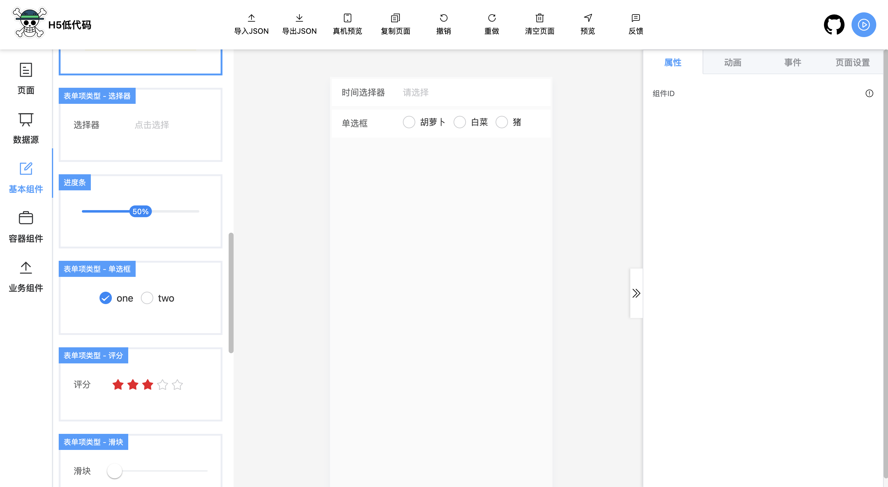

**Github（****⭐****️ 1.8k）：**[https://github.com/buqiyuan/vite-vue3-lowcode](https://github.com/buqiyuan/vite-vue3-lowcode) 

## 华炎魔方
华炎魔方是 Salesforce 低代码平台的开源替代方案，使用可视化工具进行模型设计, 页面设计, 流程设计, 报表设计 ， 只需点击鼠标，就能快速创建应用程序，实现敏捷开发的新高度。

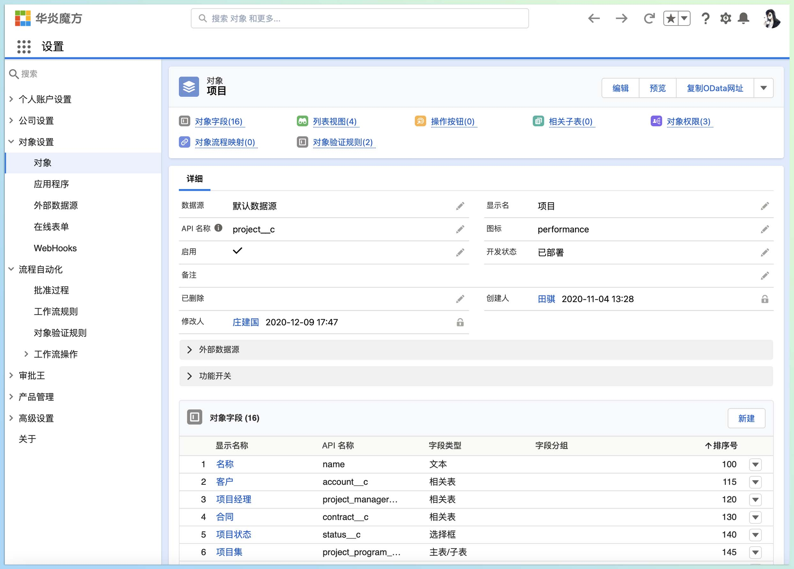

**Github（****⭐****️ 805）：**[https://github.com/steedos/steedos-platform](https://github.com/steedos/steedos-platform)

## Awesome Lowcode
Awesome Lowcode 是国内低代码平台从业者交流项目，包含了国内外的一些低代码平台。

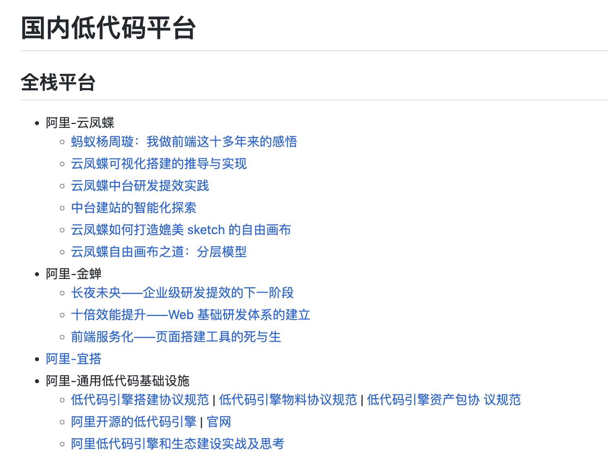

**Github（****⭐****️ 8.5k）：**[https://github.com/taowen/awesome-lowcode](https://github.com/taowen/awesome-lowcode)

## GOVIEW
GoView 是一个使用 Vue3 搭建的低代码数据可视化开发平台，将图表或页面元素封装为基础组件，无需编写代码即可完成业务需求。 它的技术栈为：Vue3 + TypeScript4 + Vite2 + NaiveUI + ECharts5 + Axios + Pinia2 + PlopJS。

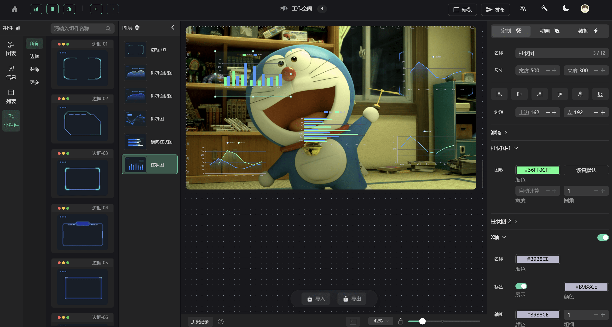

**Gitee：**[https://gitee.com/dromara/go-view](https://gitee.com/dromara/go-view)

## vlife
企业级低代码快速开发平台，包含页面可视化配置、自定义表单、自定义报表、权限管理脚手架应用、前后端代码自动生成；主要特点是低代码开发，可实现复杂CRUD功能仅编写数据模型就能完成前后端开发。

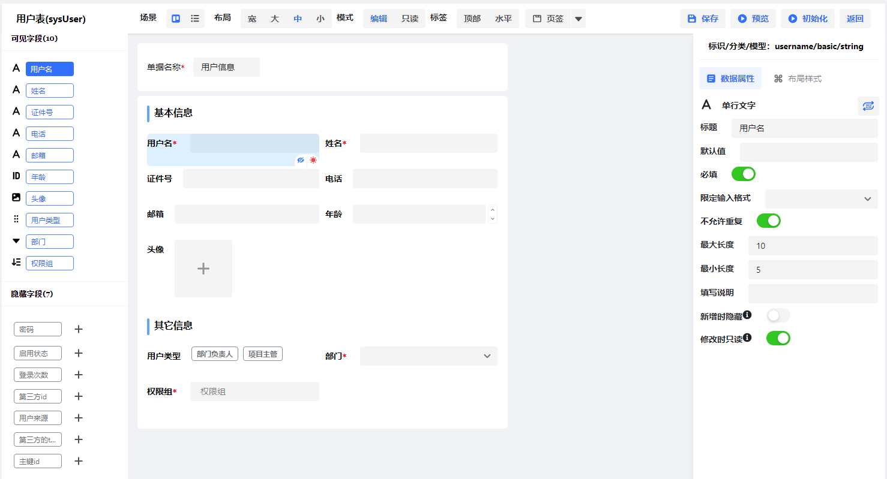

**Github：**[https://github.com/wwwlike/vlife](https://github.com/wwwlike/vlife)

## JeecgBoot
JeecgBoot 采用Vue3.0+TypeScript+Vite+Ant-Design-Vue等新技术方案，包括二次封装组件、utils、hooks、动态菜单、权限校验、按钮级别权限控制等功能。

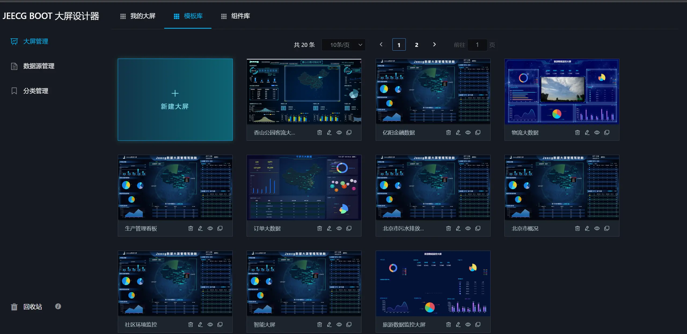

**Gitee：**[https://gitee.com/jeecg/jeecgboot-vue3](https://gitee.com/jeecg/jeecgboot-vue3)

## maku-generator
一款低代码生成器，可根据自定义模板内容，快速生成代码，实现项目的快速开发、上线，减少重复的代码编写，开发人员只需专注业务逻辑即可。

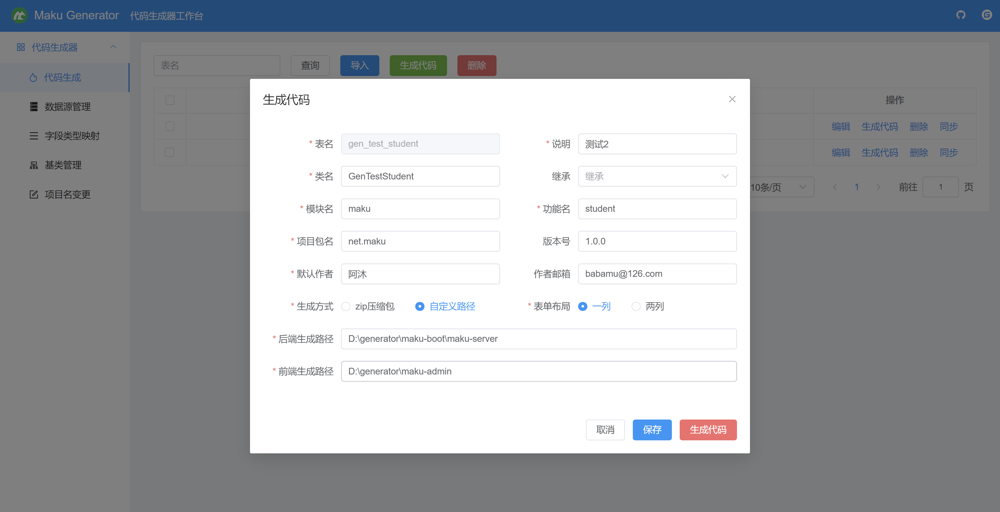

**Gitee：**[https://gitee.com/makunet/maku-generator](https://gitee.com/makunet/maku-generator)

## MtBird
星搭精卫 MtBird 是一款基于 React 的低代码可视化页面生成器。帮助用户以可视化的形式搭建网页、小程序和表单等应用。

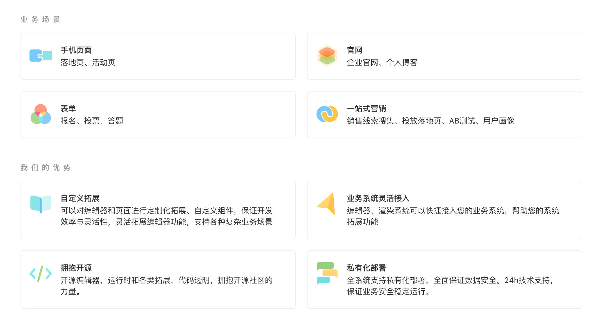

**Github：**[https://github.com/staringos/mtbird](https://github.com/staringos/mtbird)

## 鲁班 H5
鲁班H5是基于 Vue 2 开发、通过拖拽快速生成页面的平台。类似 [易企秀](http://www.eqxiu.com/)、[Maka](http://maka.im/)、[百度 H5](https://h5.baidu.com/) 等平台。其支持表单组件，即时倾听用户反馈，可以在后台查看和下载用户数据。包含了丰富的组件系统、支持可视化编辑、自由拖拽排版、实时预览、在线访问。支持一键导入PSD，将设计师的创意转换为 H5，快速查看效果、反馈、上线

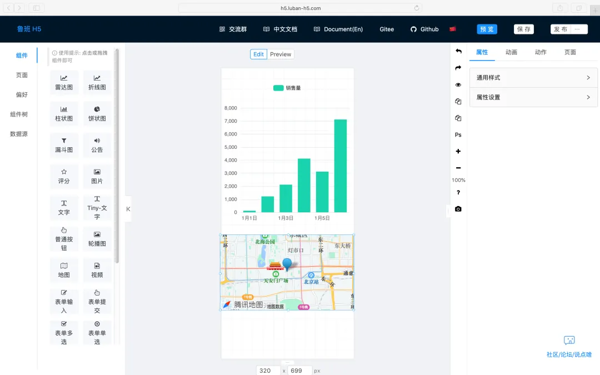

**Github：**[https://github.com/ly525/luban-h5](https://github.com/ly525/luban-h5)

## **Seezoon Stack**
Seezoon Stack 是一款基于当前最前沿的前端（Vue3 + Vite + Antdv）和后台（Spring boot）实现的低代码开发平台。以**快速开发**为目的，在开发速度和代码结构上做出一定取舍。项目采用主流开发框架，无论打包、编译、部署都按着大公司的标准完成并不断逐步完善。

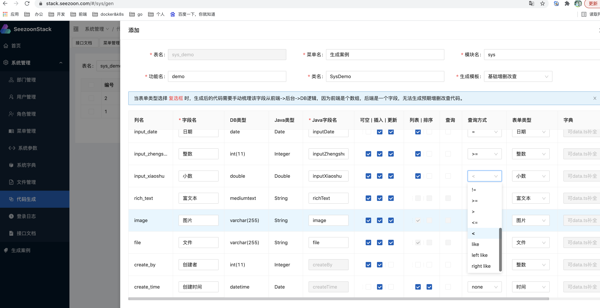

**Gitee：**[https://toscode.gitee.com/huangdf/seezoon-stack](https://toscode.gitee.com/huangdf/seezoon-stack)

## Variant Form
Variant Form 是一款高效的Vue低代码表单，可视化设计，一键生成源码。其特性如下：

+ 拖拽式可视化表单设计；
+ 支持PC、Pad、H5三种布局；
+ 支持运行时动态加载表单；
+ 支持表单复杂交互控制；
+ 支持自定义CSS样式；
+ 支持自定义校验逻辑；
+ 支持国际化多语言；
+ 兼容IE 11浏览器；
+ 可导出Vue组件、HTML源码；
+ 可导出Vue的SFC单文件组件；、
+ 支持开发自定义组件；
+ 支持响应式自适应布局；
+ 支持VS Code插件；

**Github：**[https://github.com/vform666/variant-form](https://github.com/vform666/variant-form)

## ng-form
ng-form 是一个基于vue+element ui实现动态表单组件，通过拖拽组件到面板即可实现一个表单。支持各个组件的动态隐藏显示，动态表格弹窗式维护。

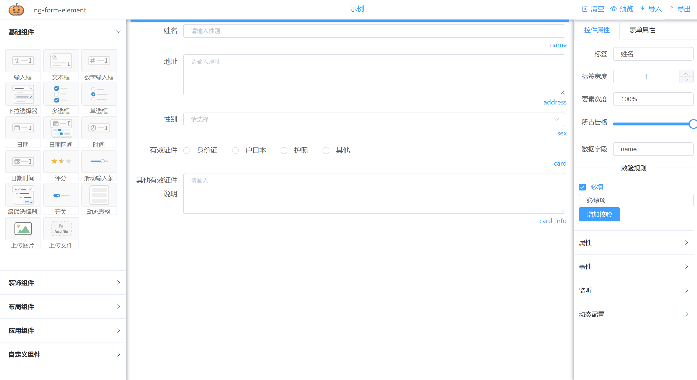

**Gitee：**[https://gitee.com/jjxliu306/ng-form-element](https://gitee.com/jjxliu306/ng-form-element)

## h5-factory
h5-factory 是一个h5专题页面可视化编辑工具，拖拽编辑，灵活切换，一键生成html文件。

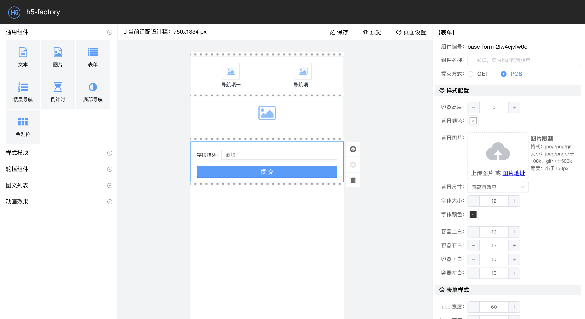

**Github：**[https://github.com/yangyuji/h5-factory](https://github.com/yangyuji/h5-factory)

  

> 更新: 2023-07-17 15:57:23  
> 原文: <https://www.yuque.com/cuggz/feplus/eleffg>