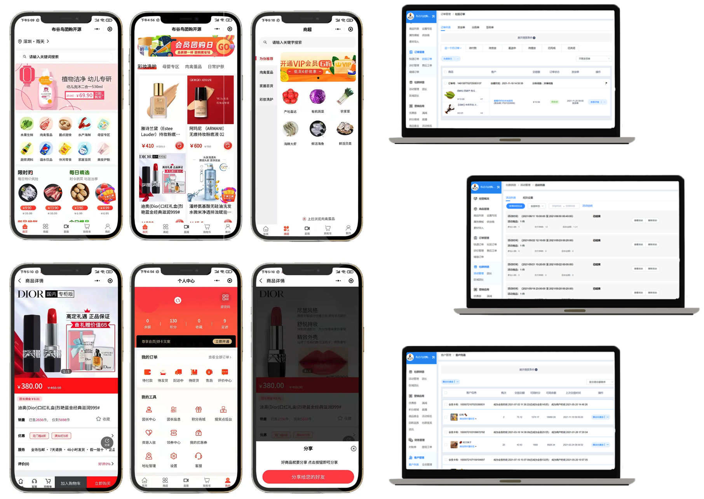
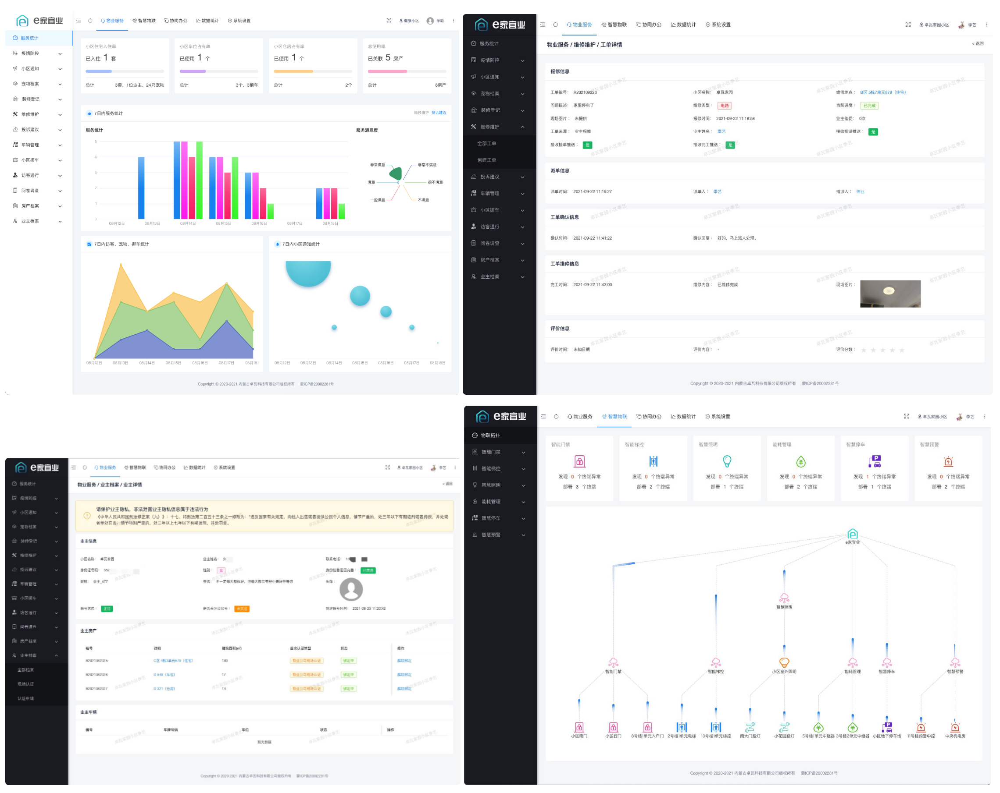
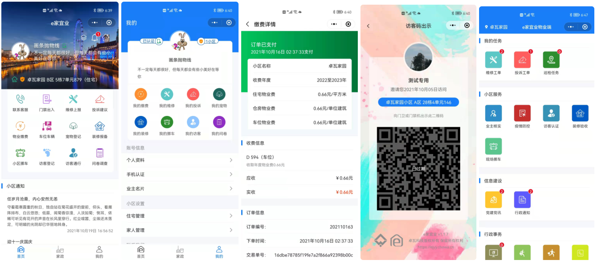
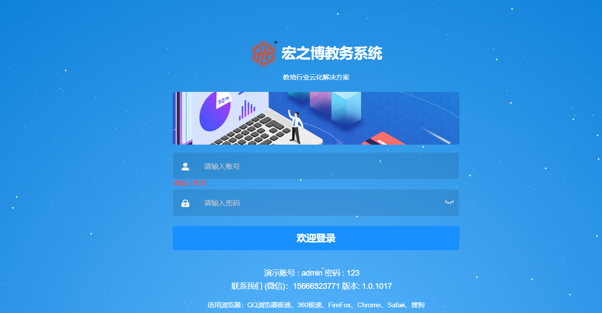
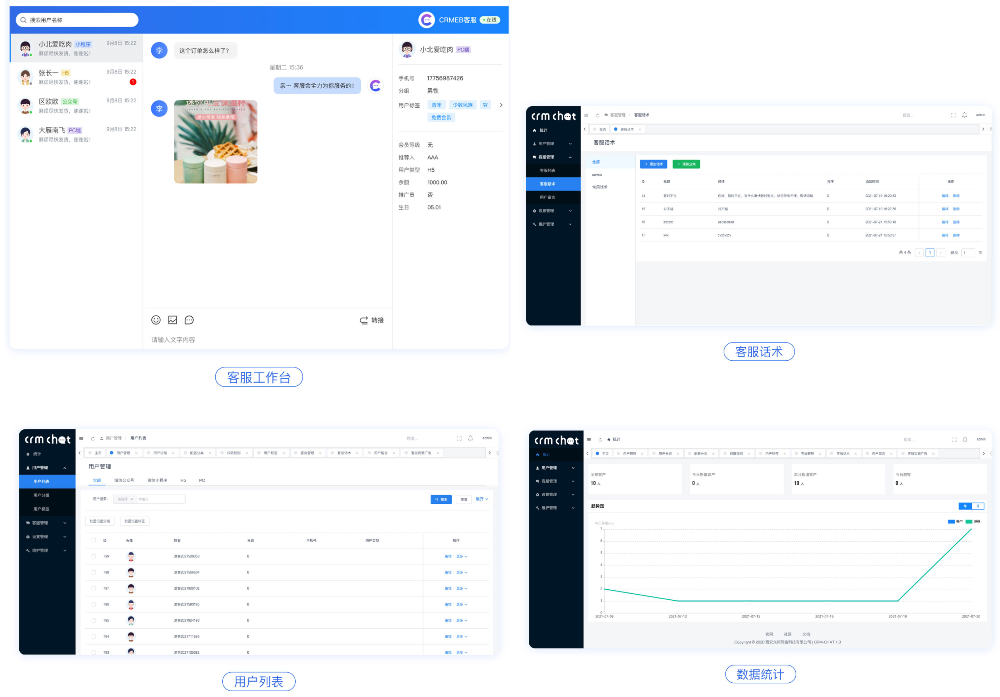
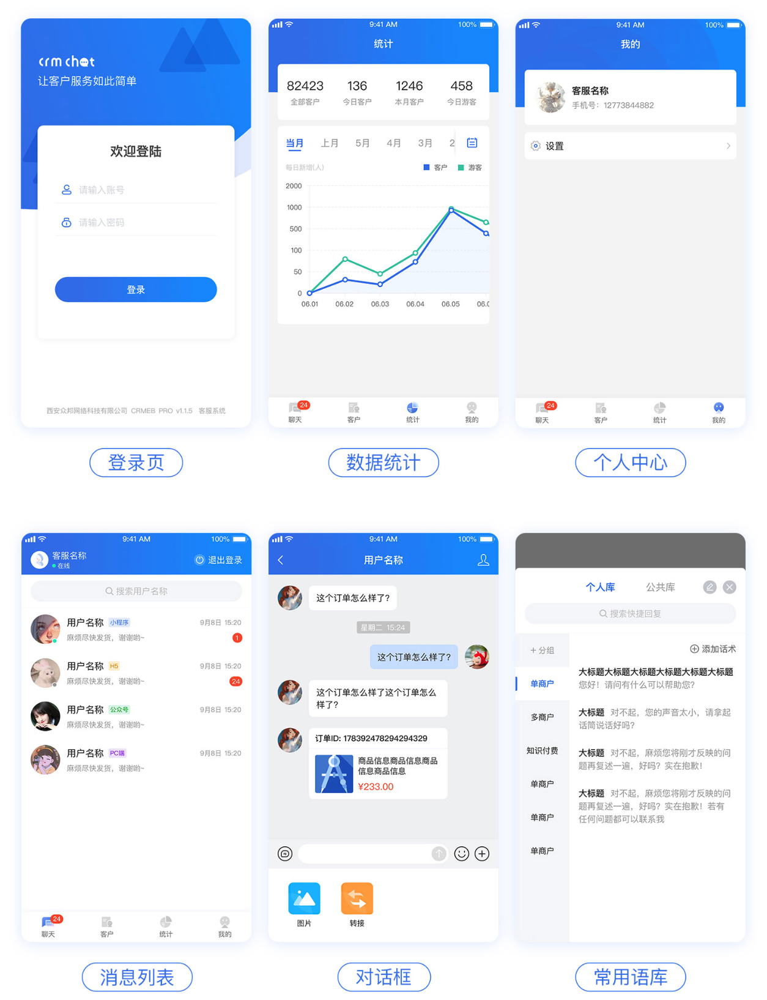
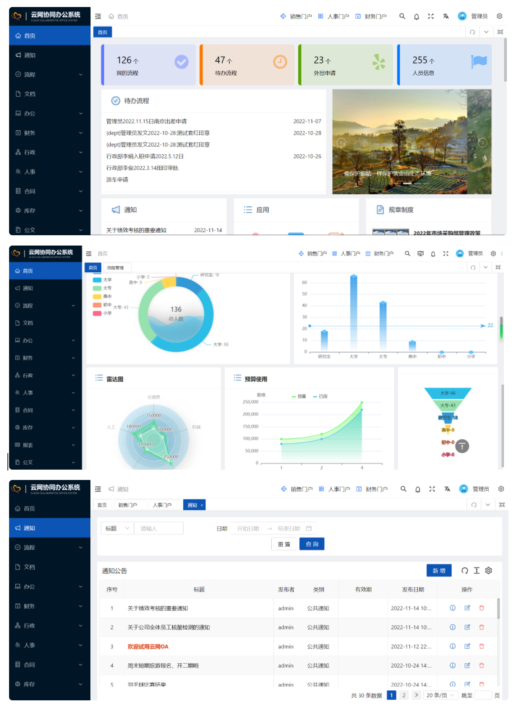
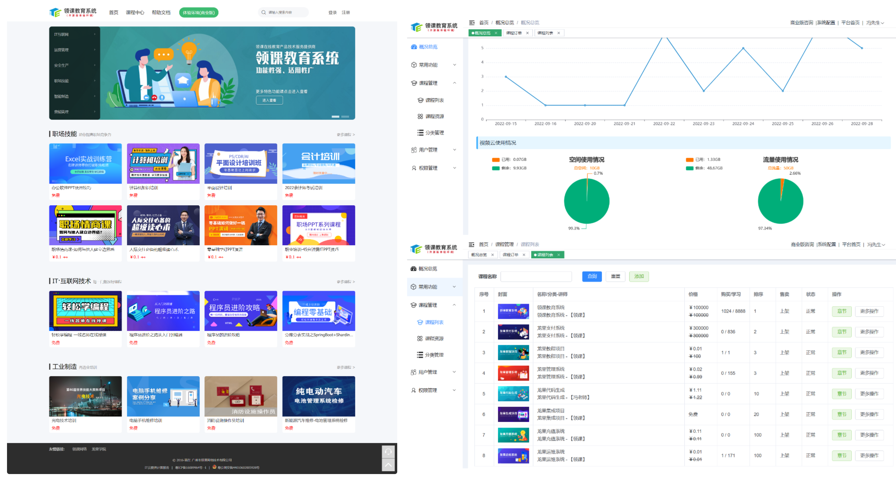
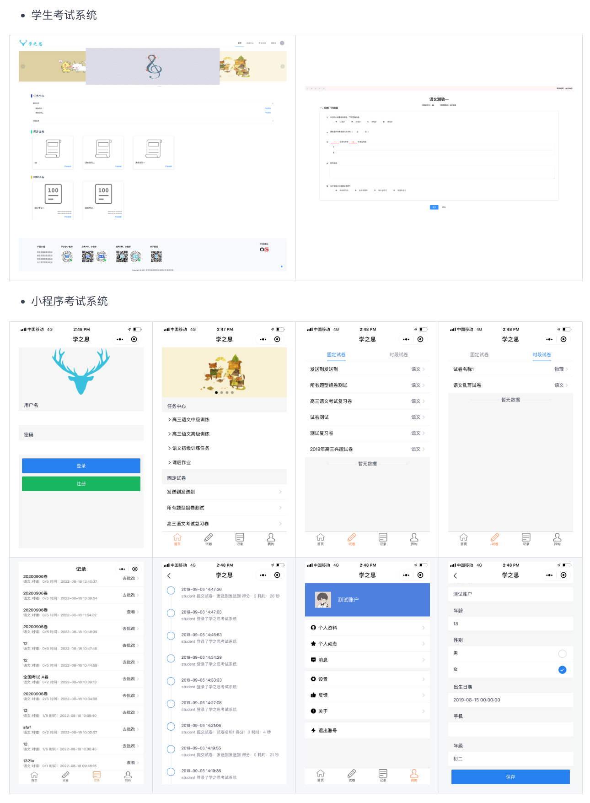
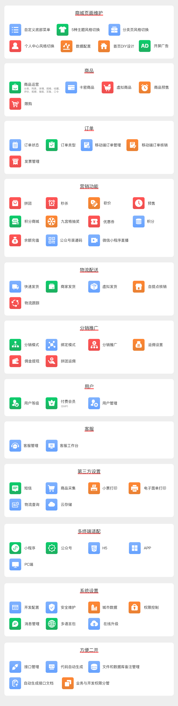

# 全栈项目

## 智慧团购
一款基于Spring Cloud和Vue.js的社区团购配送系统，经过真实的用户检验且完善的社区团购配送系统，社区团购配送系统包含管理台、集团总店(商家PC端)、城市合伙人、区域团长后台、用户端小程序等操作模块的社区团购和物流配送系统。

[https://gitee.com/qisange/group_purchase2.0](https://gitee.com/qisange/group_purchase2.0)

## 智慧物业
一整套基于AGPL开源协议开源的智慧物业解决方案。包含web中台、业主小程序、员工小程序、公众号、物联网应用等，涵盖业主服务、物业运营、智能物联、数据统计等主要业务。旨在提升物业公司效率、规范物业服务流程、提升物业服务满意度、加强小区智慧化建设、便捷业主服务。 后端采用Koa + TypeScript轻量级构建，支持分布式部署；前端使用Vue + view-design开发。

[https://gitee.com/chowa/ejyy](https://gitee.com/chowa/ejyy)

## 教务系统
一套支持私有化部署的教培行业教务管理系统，专为教培行业提供云化管理解决方案，是一套纯springboot + mysql + Vue + uniapp微服务项目。系统在功能上注重教务管理，具有灵活的排课、消课等核心业务功能；系统采用稳定的微服务架构开发，运行流程，易于部署扩展，支持私有化部署。应用端包括PC管理端、老师手机端、家长手机端。

核心功能：

+  学生管理、跟进
+  课程管理、班级、科目等教务管理
+  报名管理、预约管理、体验卡
+  排课、课表
+  家长互动：学评教、教评学、作业、成绩发布
+  消课：课堂点名、随到随学、消课次数自定义
+  在线购课
+  物料管理
+  促学模块：积分商城、老师点评送积分、积分换礼品
+  微信公众号支持
+  组织人员管理、职位管理、角色管理、权限管理、数据权限管理
+  系统数据统计
+  Uniapp的家长端和老师端，支持自行二开打包适配成小程序或APP等应用，默认是公众号版

[https://gitee.com/ryan1981/hzb-eduerp](https://gitee.com/ryan1981/hzb-eduerp)

## 客服系统
本系统(CRMChat)是采用Swoole4+Tp6+Redis+Vue+Mysql开发的独立高性能客服系统，客服系统用户端支持Pc端、移动端、小程序、文章中接入客服，利用超链接、网页内嵌、二维码、定制对接等方式让网上所有通道都可以快速通过本系统联系到商家，商家端支持PC端、移动端（App）随时随地接收到用户的各种咨询，商家可以添加话术库、也可以对用户进行分组、加标签、加备注进行管理，是一款互联网链接商家的一个桥梁，也是商家客户管理的工具，本开源项目遵循最开放的木兰协议，可以随意使用。

[https://gitee.com/ZhongBangKeJi/CRMChat](https://gitee.com/ZhongBangKeJi/CRMChat)

## 办公系统
基于Springboot+Vue3 的 OA 协同办公系统。拥有成熟的OA系统功能，自带低代码开发平台，可以快速搭建工作流、人事管理、CRM、办公用品、项目管理等功能，让您可以快速上手、快速实施、快速交付。技术栈：

+ 后端框架：spring boot + mybatis plus + redis + Druid + ActiveMQ/RocketMQ
+ 前端框架：Vue3 + Ant Design + Vben Admin

[https://gitee.com/bestfeng/yimioa](https://gitee.com/bestfeng/yimioa)

## 教育系统
一款基于领课网络多年的在线教育平台开发和运营经验打造出来的产品，致力于打造一个各行业都适用的分布式在线教育系统。系统采用前后端分离模式，前台采用vue.js为核心框架，后台采用Spring Cloud为核心框架。系统目前主要功能有课程点播功能，支持多家视频云的接入，课程附件管理功能，支持多家存储云的接入，可以帮助个人或者企业快速搭建一个轻量级的在线教育平台。

[https://gitee.com/roncoocom/roncoo-education-web](https://gitee.com/roncoocom/roncoo-education-web)

## 考试系统
一款 java + Vue 的前后端分离的考试系统。主要优点是开发、部署简单快捷、界面设计友好、代码结构清晰。支持web端和微信小程序，能覆盖到pc机和手机等设备。 支持多种部署方式：集成部署、前后端分离部署、docker部署。

[https://gitee.com/roncoocom/roncoo-education-web](https://gitee.com/roncoocom/roncoo-education-web)

## 商城系统
CRMEB开源商城系统是一款全开源可商用的系统，前后端分离开发，全部100%开源，在小程序、公众号、H5、APP、PC端都能用，使用方便，二开方便！核心功能：

[https://gitee.com/mindskip/xzs-mysql](https://gitee.com/mindskip/xzs-mysql)

> 更新: 2024-01-09 16:56:53  
> 原文: <https://www.yuque.com/cuggz/feplus/une23lf9c8ogqaw4>