# 前端书籍

****

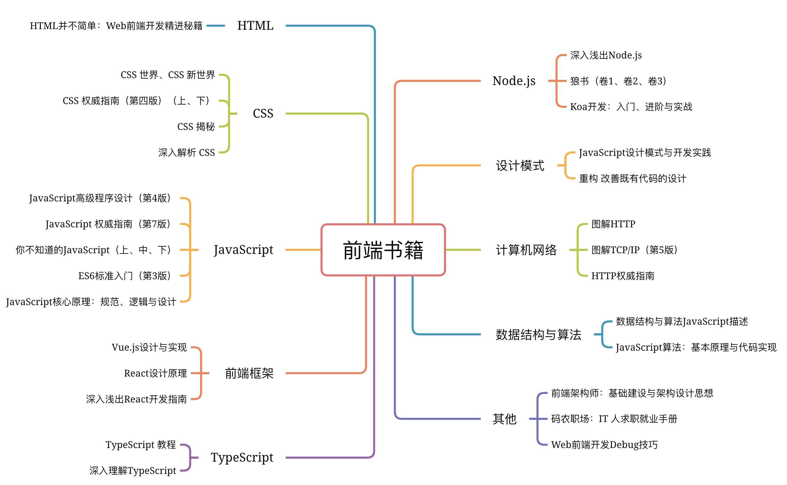

## HTML
### **HTML并不简单：Web前端开发精进秘籍**
前端大牛张鑫旭最新力作，凝结了作者多年对HTML钻研与实践的研究成果，深入细节以HTML为索引对Web前端开发知识进行系统、全面的讲解，书中介绍了大量前端开发人员不知道，但非常重要、好用的知识点。通过阅读本书，读者会对HTML有一个全新的认识。

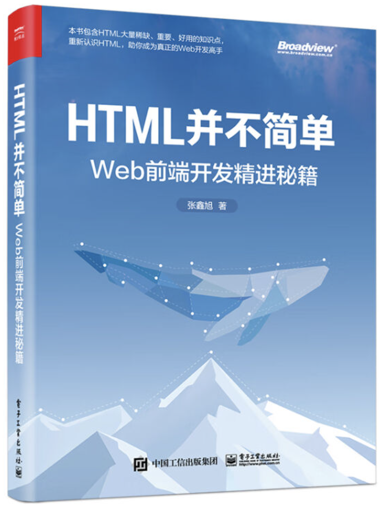

## CSS
### CSS 世界、CSS 新世界
CSS世界三部曲中的其中两部，都是关于 CSS 的进阶读物，作者结合自己多年的从业经验，讲解CSS基础知识，并充分考虑前端开发者的需求，以CSS新特性的历史背景为线索，去粗取精，注重细节，深入浅出地介绍了上百个CSS新特性。主要目标是帮助前端开发者突破CSS技能提升的瓶颈，非常适合具有一定CSS基础的前端开发者阅读。

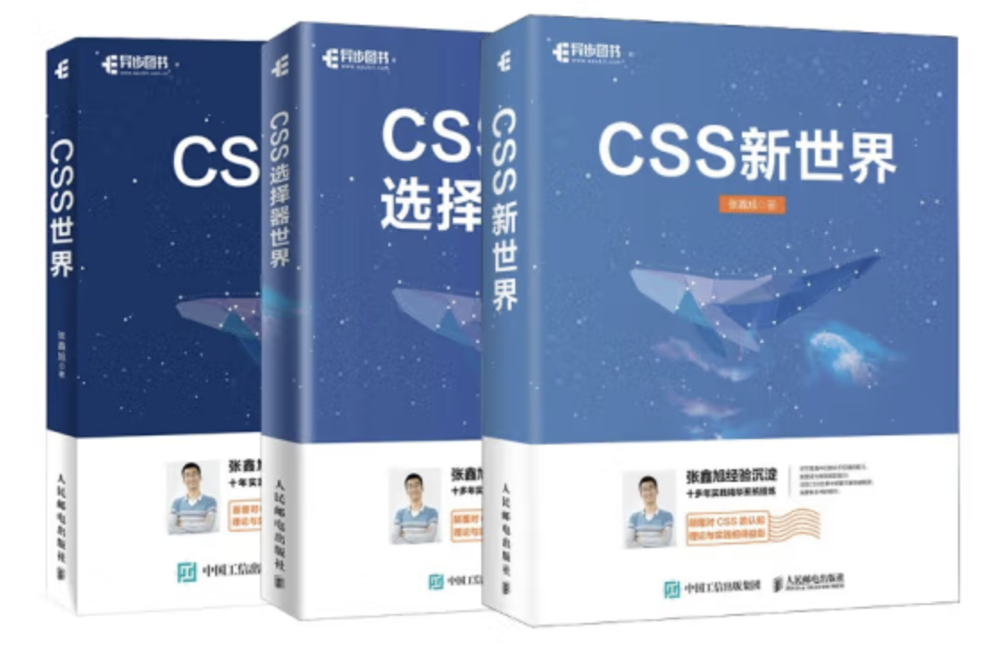

### CSS 权威指南**（第四版）（上、下）**
本书展示了如何通过布局、过渡和动画、边框、背景、文本属性，以及许多其他工具和技术来改善用户体验、加快开发速度、避免潜在的错误。对 CSS 进行了系统的讲解，适合当工具书来阅读。

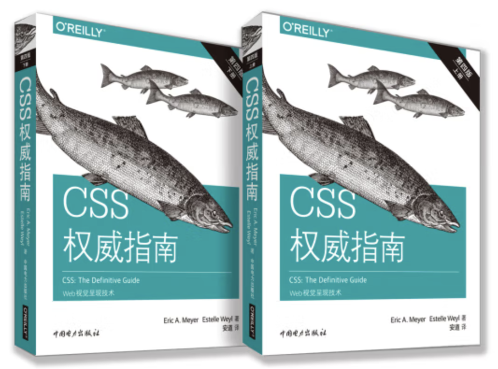

### CSS 揭秘
本书是一本注重实践的教程，作者为我们揭示了47个鲜为人知的CSS技巧，主要内容包括背景与边框、形状、视觉效果、字体排印、用户体验、结构与布局、过渡与动画等。适合有一定CSS基础的开发者阅读。

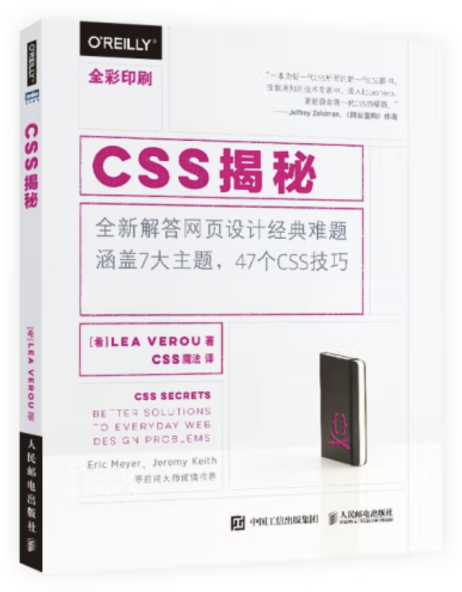

### 深入解析 CSS
本书旨在帮你深度掌握CSS语言，并快速了解CSS的新进展和新特性。书中不仅有讲解透彻的概念介绍，而且还有详细的分步示例，能够帮助你提升CSS开发技能。

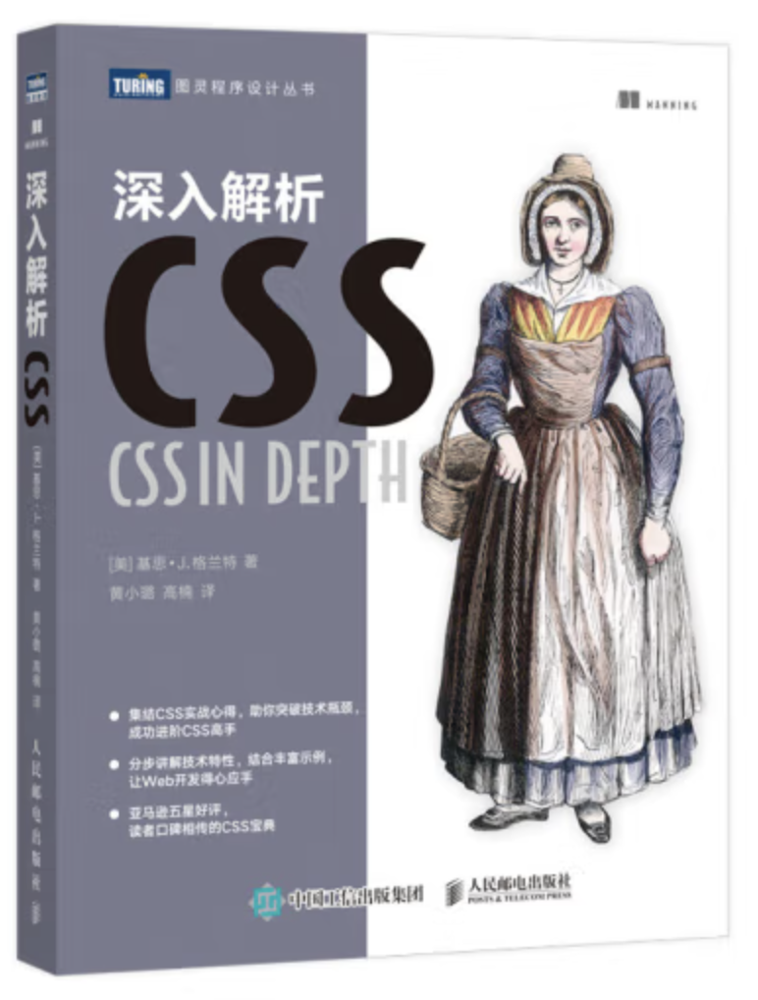

## JavaScript
### **JavaScript高级程序设计（第4版）**
前端开发最值得阅读的书籍之一，也就是传说中的红宝书。书中详尽讨论了JavaScript的各个方面，从JavaScript的起源开始，逐步讲解到新出现的技术，其中重点介绍ECMAScript和DOM标准。适合所有阶段的前端开发者阅读。

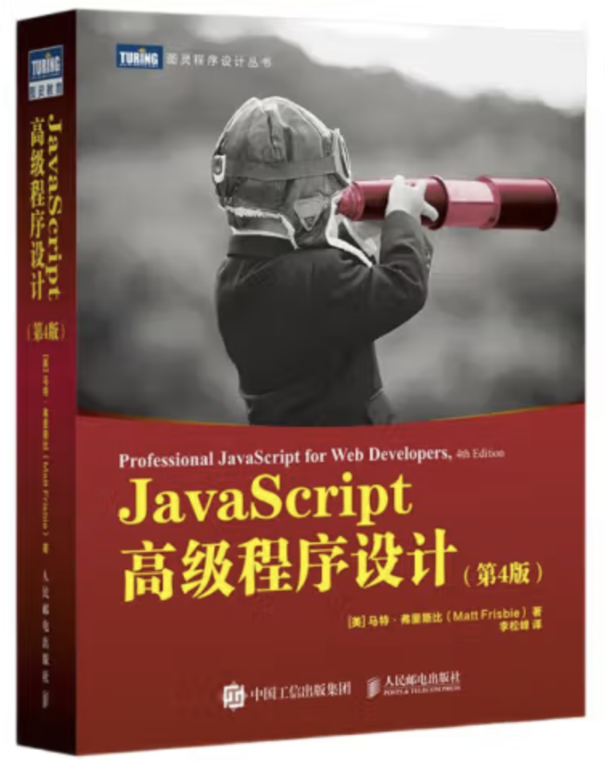

### **JavaScript权威指南（第7版）**
前端开发最值得阅读的书籍之一，也就是传说中的犀牛书。本书介绍JavaScript语言和由浏览器与Node实现的JavaScript API。本书的目标是全面地讲解JavaScript语言，对JavaScript程序中可能用到的重要的客户端API和服务器端API提供深入的介绍。本书适合有一定编程经验、想学习JavaScript读者，也适合已经在使用JavaScript但希望更深入地理解进而真正掌握这门语言的程序员。

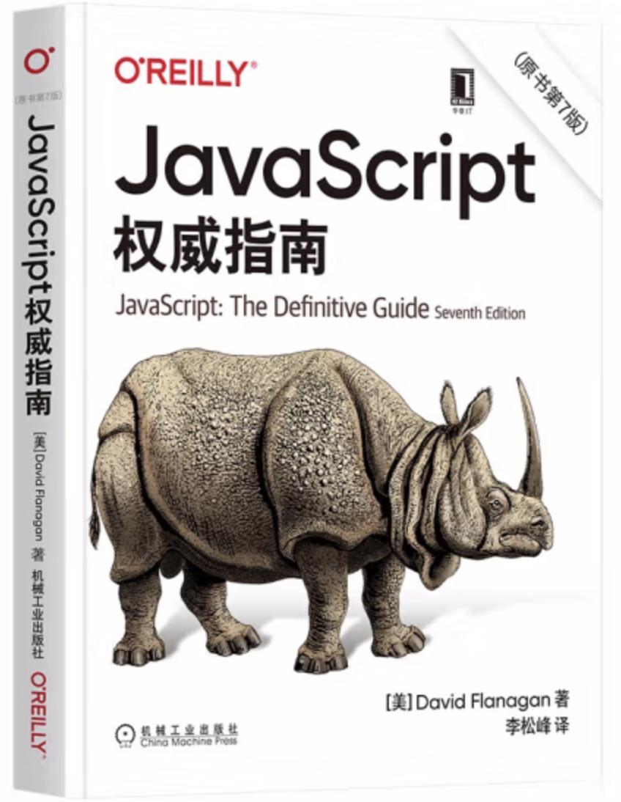

### **你不知道的JavaScript（上卷、中卷、下卷）**
“你不知道的JavaScript”系列就是要让不求甚解的JavaScript开发人迎难而上，深入语言内部，弄清楚JavaScript每一个零部件的用途，轻松理解前端圈里出现的各种技术、框架和流行术语。本书既适合JavaScript语言初学者阅读，又适合经验丰富的前端开发人员深入学习。

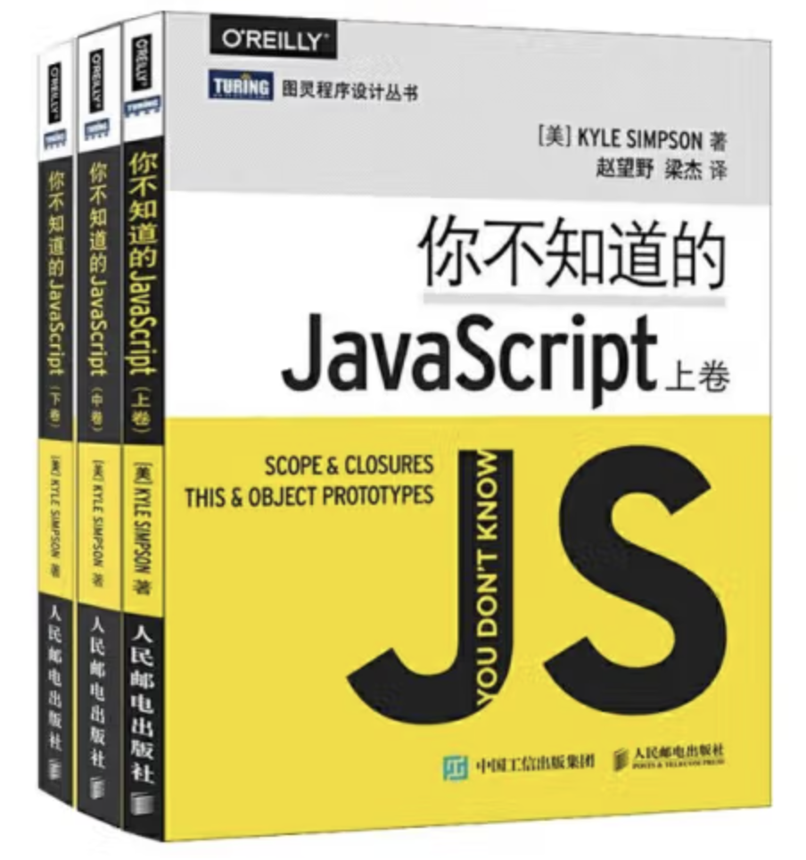

### **ES6标准入门（第3版）**
本书根据ES2017标准，详尽介绍了所有新增的语法，对基本概念、设计目的和用法进行了清晰的讲解，给出了大量简单易懂的示例。其难度适中，适合那些已经对 JavaScript 有一定了解的读者。

### JavaScript核心原理：规范、逻辑与设计
本书是一本JavaScript精进指南，全面剖析JavaScript的核心技术。全书共分为六章，每章用一行代码引出，所讲内容包括该行代码的特殊性、所涉问题的领域、逐步的解析、相似或同类的问题、潜在的应用、不为人知的历史、标准规范对此代码的态度、业界的看法与争议等。 本书适合有一定编程基础的JavaScript开发者与深度爱好者阅读，帮助读者深入理解JavaScript核心原理，实现从粗通到精通的进阶。

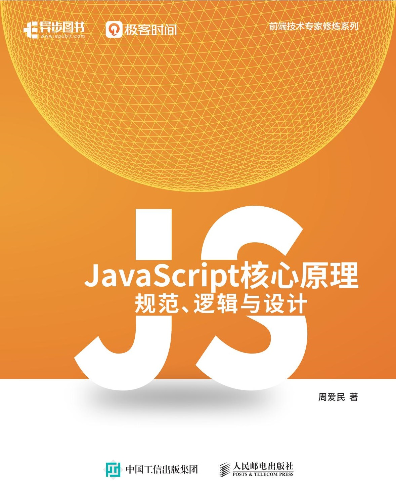

## 前端框架
### **Vue.js设计与实现**
本书由 Vue.js 官方团队成员霍春阳倾力打造，基于 Vue 3 深入解析 Vue.js 设计细节，从规范出发，以源码为基础，并结合大量直观的配图，循序渐进地讲解Vue.js中各个功能模块的实现，细致剖析框架设计原理。适合有一定 Vue 开发经验的的开发者阅读。

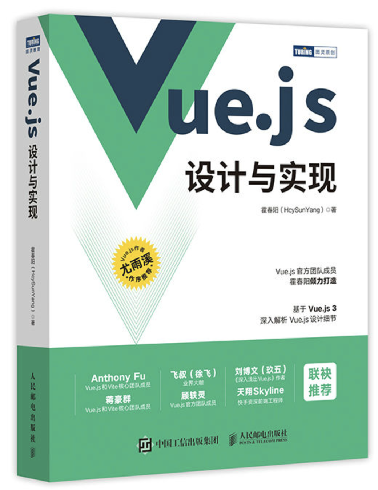

### **React设计原理**
本书致力于剖析React设计理念与实现原理，基于React 18源码讲解。通过本书的学习，读者可以对当前主流前端框架的实现原理有清晰的认识，并对React从理念到实现层面有比较深入的理解。

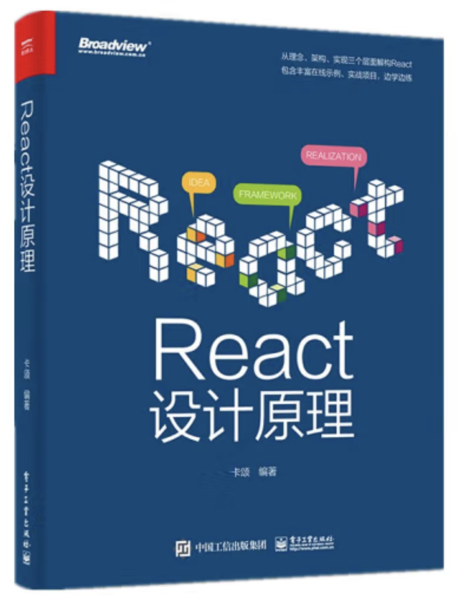

### **深入浅出React开发指南**
本书讲述了React各个模块基础和进阶用法，并提供了相应的案例。还深入分析了React内部运转机制，同时详细介绍了React配套的生态系统。适合具有一定React开发基础，但希望更加全面、深入理解React的前端开发者阅读。

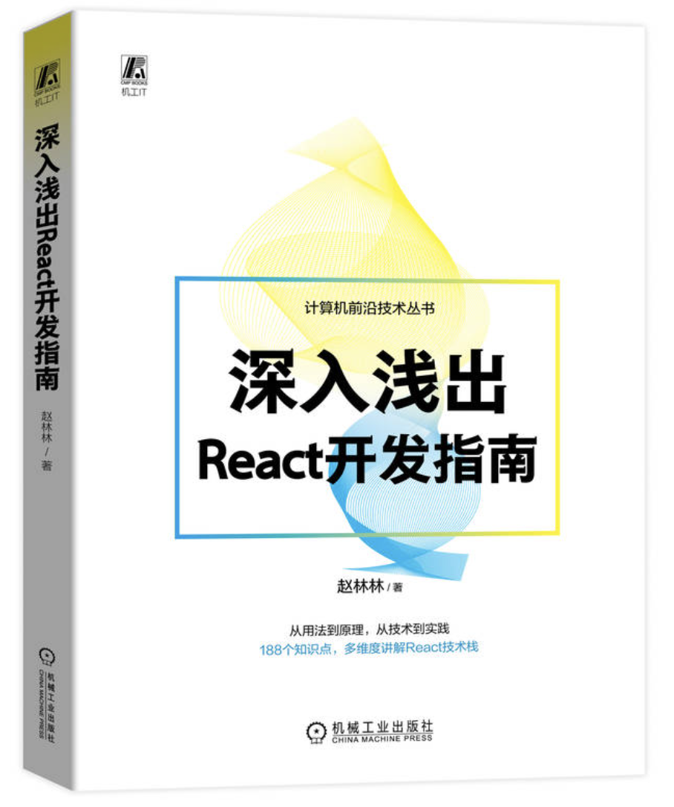

## TypeScript
### TypeScript教程
阮一峰老师出品的 TypeScript 开源教程，介绍基本概念和用法，面向初学者。

在线版：[https://wangdoc.com/typescript/](https://wangdoc.com/typescript/)

### **深入理解TypeScript**
本书涵盖了TypeScript的大部分知识点，并对其进行了细致的讲解。本书还对TypeScript编译原理进行了深入的剖析，对高级编程技巧、编译原理进行了深入浅出的解读，适合入门TypeScript的开发者阅读。

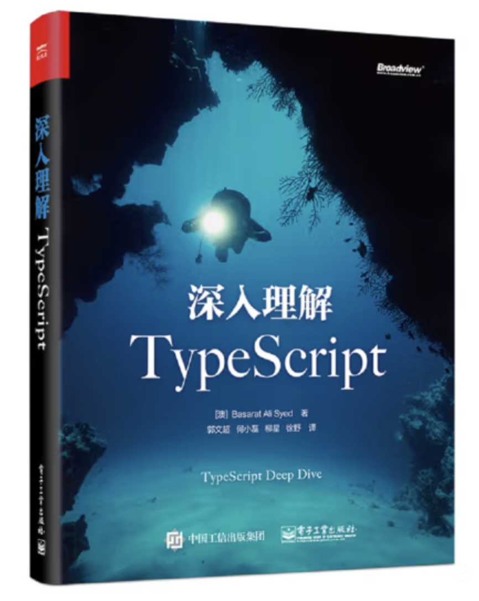

## Node.js
### **深入浅出Node.js**
从不同的视角介绍了 Node 内在的特点和结构。主要内容包含模块机制的揭示、异步I/O 实现原理的展现、异步编程的探讨、内存控制的介绍、二进制数据Buffer 的细节、Node 中的网络编程基础、Node 中的 Web 开发、进程间的消息传递、Node 测试以及通过Node 构建产品需要的注意事项。

### **狼书（卷1、卷2、卷3）**
卷 1 讲解了 Node.js 的基础知识、开发调试方法、源码原理和应用场景，旨在向读者展示如何通过Node.js和npm编写出更具前端特色、更具工程化优势的代码。

卷 2 主要讲解 Node.js Web应用开发涉及的HTTP基础知识、常用开发框架、源码原理、数据库和项目实战，旨在向读者展示如何通过Node.js和Koa编写出更具前端特色的Web应用。

卷 3 聚焦于Node.js高级技术。第1章介绍如何编写npm模块，其中涉及对许多常用模块的解析。第2章介绍如何编写企业级Web开发框架，主要剖析了开发框架的流程。第3章介绍如何构建具有Node.js特色的服务，着重讲解了页面即服务的概念。第4章介绍服务器部署与性能调优的相关知识。第5章介绍TDD和BDD理念，以及如何编写测试用例，同时分享了笔者关于开源和自学的看法。

### Koa开发：入门、进阶与实战
这是一本能指导你零基础掌握Koa完整知识体系并深入理解Node.js难点的著作，以入门、进阶、实战为学习曲线，从基本用法、底层实现、常见场景解决方案、难点和重点等等角度对Koa和Node.js进行了详细的讲解。  
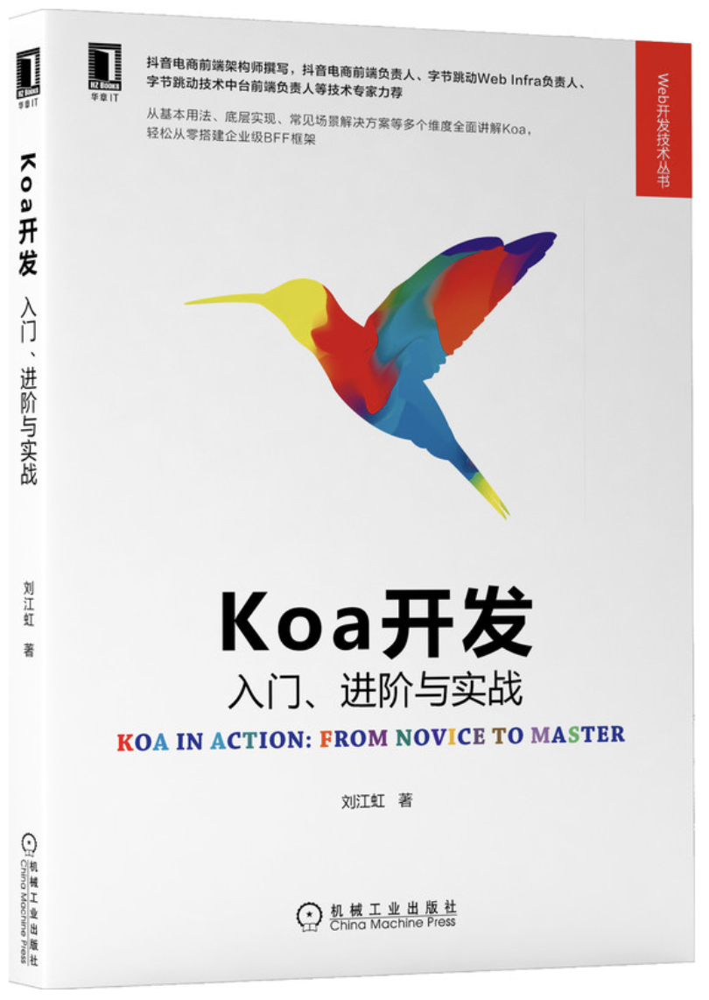

## 设计模式
### **JavaScript设计模式与开发实践**
本书针对JavaScript语言特性全面介绍了更适合前端程序员的了 16 个常用的设计模式，讲解了JavaScript面向对象和函数式编程方面的基础知识，介绍了面向对象的设计原则及其在设计模式中的体现，还分享了面向对象编程技巧和日常开发中的代码重构。本书将教会你如何把经典的设计模式应用到 JavaScript 中，编写出优美高效、结构化和可维护的代码。

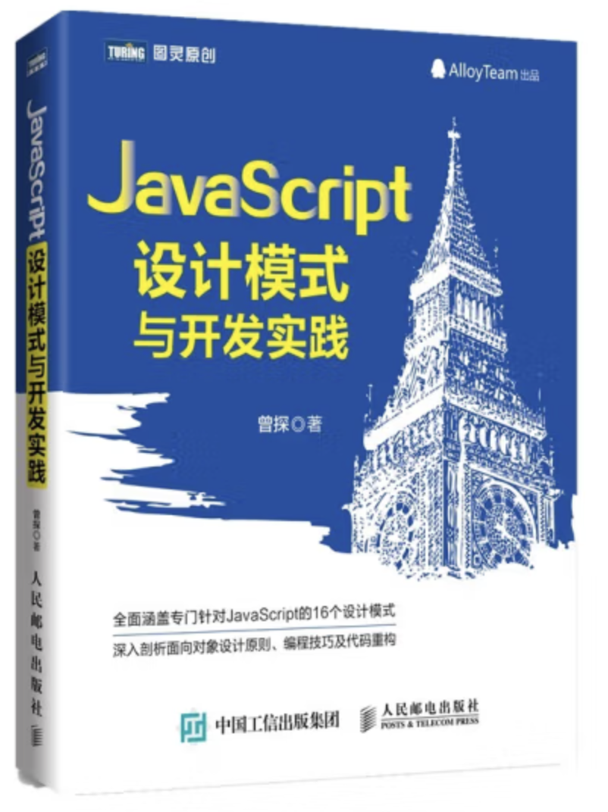

### **重构：改善既有代码的设计**
书中清晰揭示了重构的过程，解释了重构的原理和佳实践方式，并给出了何时以及何地应该开始挖掘代码以求改善。书中给出了60多个可行的重构，每个重构都介绍了一种经过验证的代码变换手法的动机和技术。本书提出的重构准则将帮助开发人员一次一小步地修改代码，从而减少了开发过程中的风险。适合有一定前端开发经验的开发者阅读。

## 计算机网络
### **图解HTTP**
本书对 HTTP 协议进行了全面系统的介绍。作者由HTTP协议的发展历史娓娓道来，严谨细致地剖析了HTTP协议的结构，列举诸多常见通信场景及实战案例，最后延伸到Web安全、全新技术动向等方面。在讲解的同时，辅以大量生动形象的通信图例，更好地帮助读者深刻理解HTTP通信过程中客户端与服务器之间的交互情况。

### **图解TCP/IP（第5版）**
本书讲解了网络基础知识、TCP/IP基础知识、数据链路、IP协议、IP协议相关技术、TCP与UDP、路由协议、应用协议、网络安全等内容，适合初学者阅读。

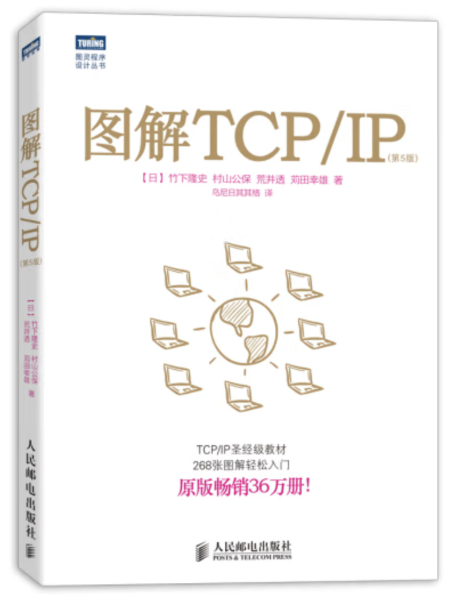

### **HTTP权威指南**
本书详细解释了HTTP协议，探讨了HTTP有效工作所依赖的所有其他核心因特网技术。本书的本质是理解Web的工作原理，以及如何将这些知识应用到Web编程和管理之中去，主要涵盖HTTP的技术运作方式、产生动机、性能和目标，以及一些相关技术问题。

## 数据结构与算法
### **数据结构与算法JavaScript描述**
本书是用JavaScript描述数据结构与算法的开山之作，通过丰富的示例，向读者透彻讲解了在JavaScript环境下，如何通过一系列存储机制（包括链表、栈、队列和图）高效地达到编程目的。学习数据结构与算法可以提高逻辑思维能力和解决问题的能力。

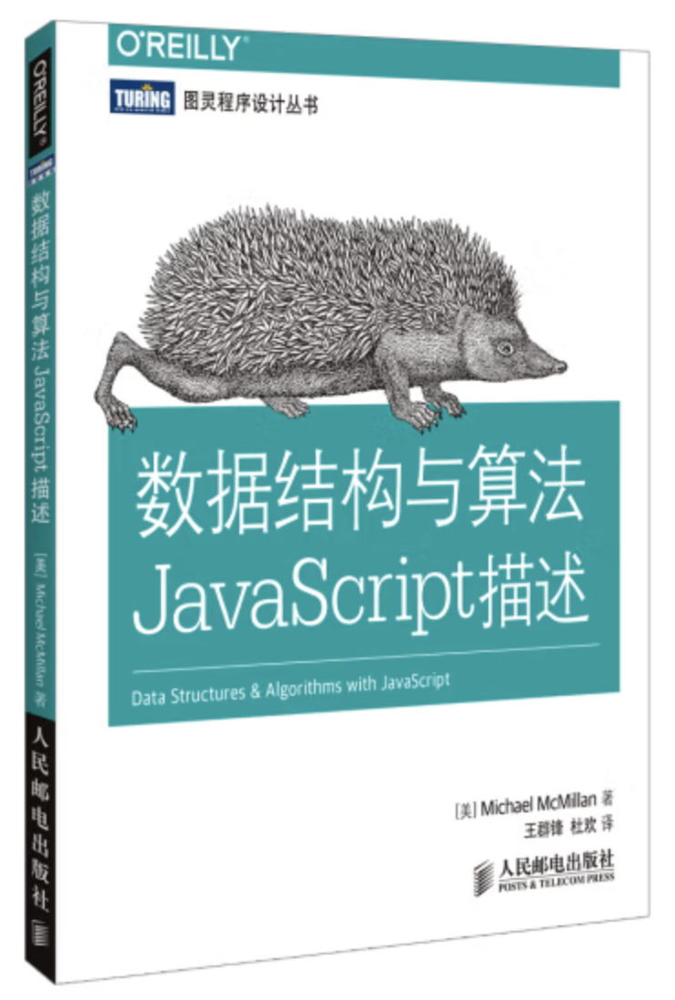

### JavaScript算法：基本原理与代码实现
本书以JavaScript作为演示代码，比较系统地涉及各种数据结构和常见的算法面试题：常见排序算法、树的相关算法、字符串算法、回溯算法、动态规划问题等。本书中没有可怕的数学公式与复杂度证明，而是详细列出解题步骤，给出可以套用的算法模板。为了方便记忆，每种算法都会给出多种解，读者只需从中选取适合自己的解即可。

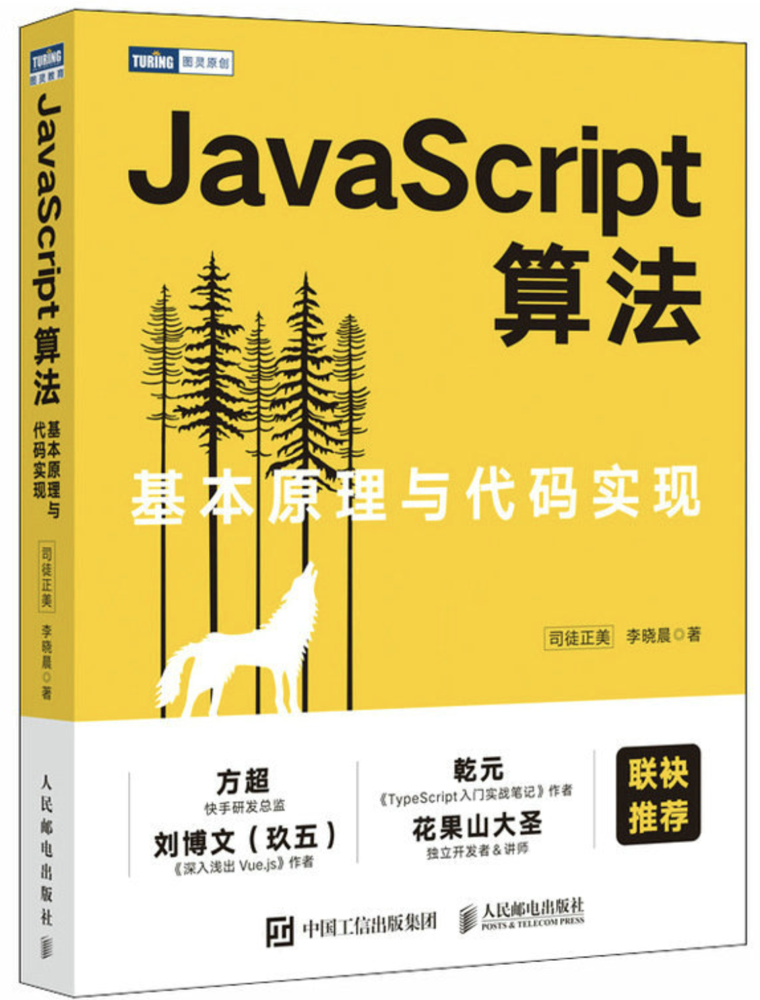

## 9.其他
### ******前端架构师：基础建设与架构设计思想**
本书选取了30个非常典型的前端基础建设和架构设计相关主题，从项目痛点中提取出的基础建设的意义，以及从个人发展瓶颈中总结出的工程化架构和底层设计原理。本书不仅能帮助开发者夯实基础，还能为开发者实现技术进阶提供帮助和启发。适读想要加深前端基础建设能力的开发者，以及想要培养前端架构思维的开发者及从业者。

### 码农职场：IT 人求职就业手册
一本专为广大IT行业求职者量身定制的指南，提供了从职前准备到成功就业的全方位指导。全书分为“职前调整”和“就业指南”上下两篇，涵盖了职业目标规划、自我技能评估、求职策略、简历准备技巧、薪资福利谈判以及职场心理准备等关键环节。

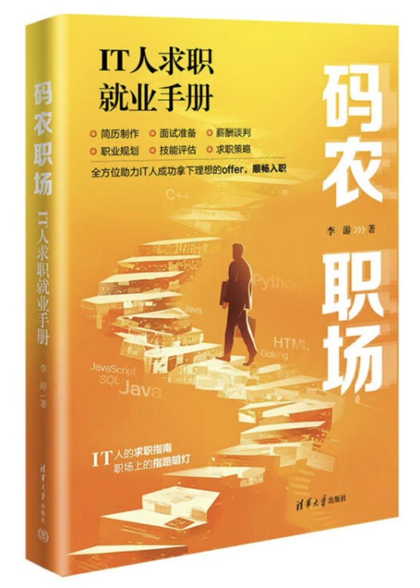

### Web前端开发Debug技巧
作者将多年积累的开发经验浓缩到本书精心设计的教案中，通过范例网站和程序代码讲解HTML、DOM和CSS、JavaScript、性能分析、用户体验、错误处理等开发过程中遇到的问题的成因和解决方法，帮助读者从心态、通用方法切入Debug技巧，再深入至不同主题。相信读者在阅读本书之后，能够更好地掌握Debug工具，将学到的Debug技能应用到实际的开发和测试工作中，并大幅提升解决问题和开发的效率。 本书适用于前端初学者、前端工程师以及有经验的开发者。

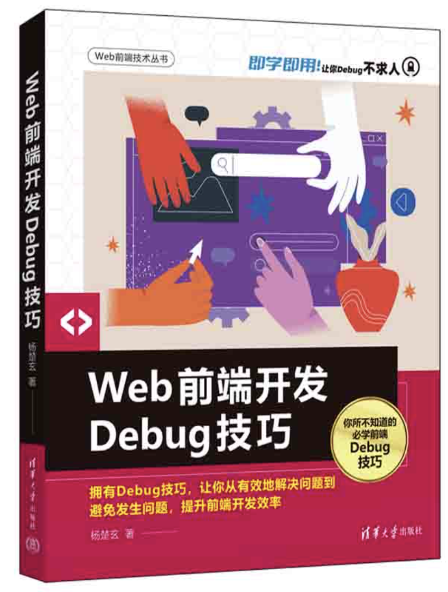

> 更新: 2024-08-01 16:44:30  
> 原文: <https://www.yuque.com/cuggz/feplus/sdr12g>