# 前端学习资源

## 1. Web Developer Road Map
[developer-roadmap](https://github.com/kamranahmedse/developer-roadmap) 是一个为开发人员准备的学习路线图，他提供了学习编程中每个阶段的详细信息，并且每年都会进行更新。除了有前端的路线路，还包含后端、Android、Java、Python、Go等不同方向的学习路线图。

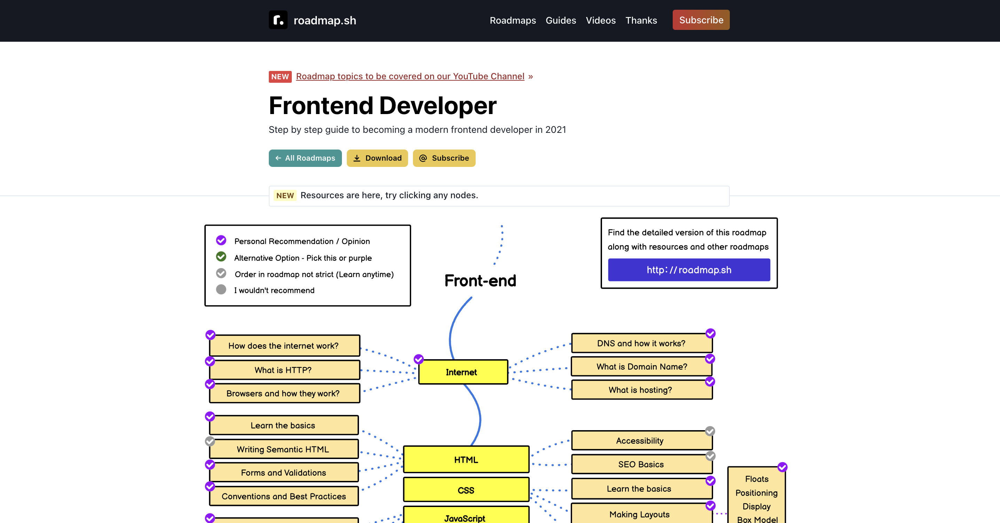

✨Star：182k

官网地址：[https://roadmap.sh/](https://roadmap.sh/)

GitHub地址：[https://github.com/kamranahmedse/developer-roadmap](https://github.com/kamranahmedse/developer-roadmap)

## 2. Clean Code JavaScript
[clean-code-javascrip](https://github.com/ryanmcdermott/clean-code-javascript) 综合了作者在使用 JavaScript 过程中的编码经验。它可以帮助我们学习编写易于理解、易于重用、提高代码效率的JavaScript代码。

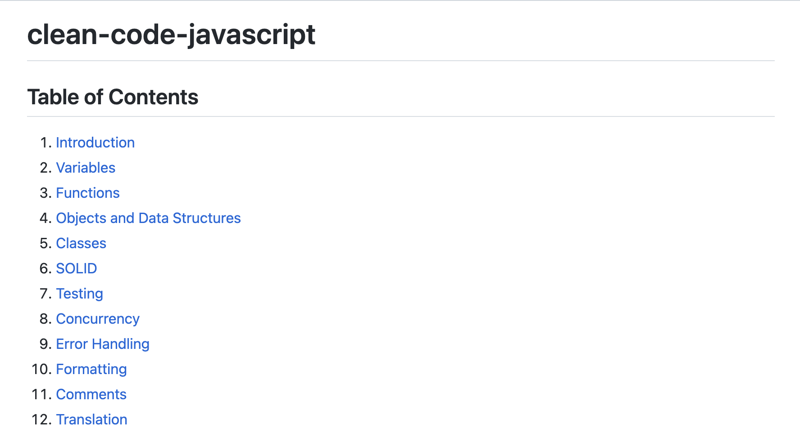

✨Star：61.4k

GitHub地址：[https://github.com/ryanmcdermott/clean-code-javascript](https://github.com/ryanmcdermott/clean-code-javascript)

## 3. DevDocs
[devdocs](https://github.com/freeCodeCamp/devdocs) 是当今比较流行的编程语言的文档集合，包含JavaScript、HTML、CSS、React、Vue.js、TypeScript等。

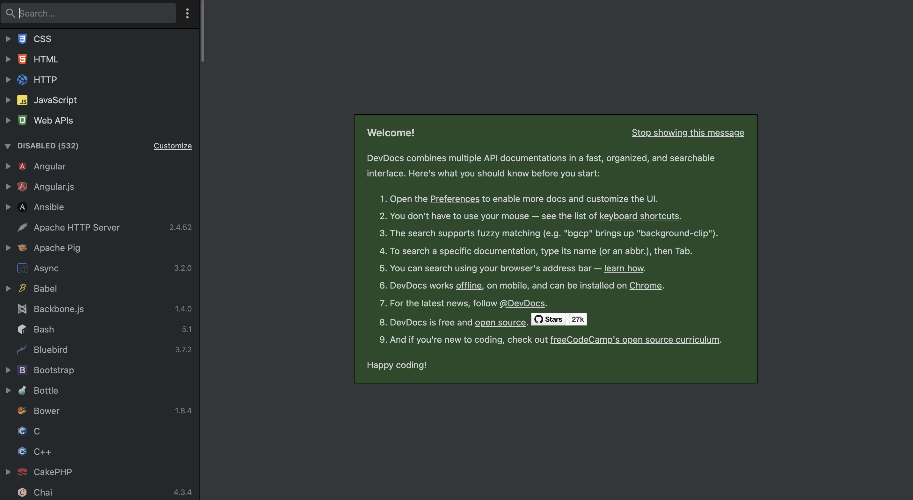

✨Star：27.3k

官网地址：[https://devdocs.io/](https://devdocs.io/)

GitHub地址：[https://github.com/freeCodeCamp/devdocs](https://github.com/freeCodeCamp/devdocs)

## 4. 30 Seconds Of Code
30 Seconds Of Code是一个聚合代码片段的网站，可以帮助我们开发过程中遇到的常见问题。它支持JavaScript、React、Node.js、Git、CSS、Python 等语言。

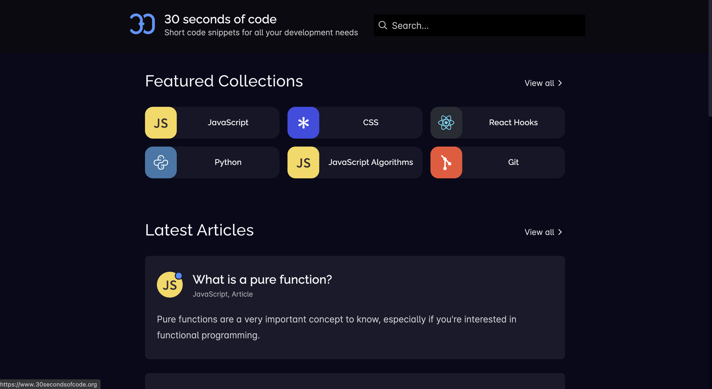

✨Star：90.5k

官网地址：[https://www.30secondsofcode.org/](https://www.30secondsofcode.org/)

GitHub地址：[https://github.com/30-seconds/30-seconds-of-code](https://github.com/30-seconds/30-seconds-of-code)

## 5. Airbnb JavaScript Style Guide
这是一个由 Airbnb 开源的 JavaScript 代码风格指南。主要是为编写 JavaScript 代码提供规范的风格，方便开发者理解、阅读代码。它是最流行的JavaScript代码风格指南之一。

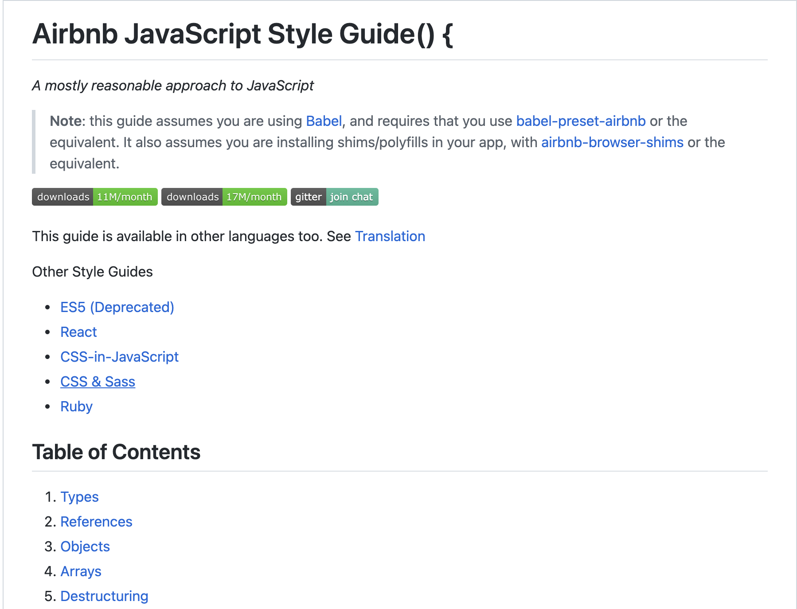

✨Star：118k

GitHub地址：[https://github.com/airbnb/javascript](https://github.com/airbnb/javascript)

## 6. Grab Front End Guide
[front-end-guide](https://github.com/grab/front-end-guide) 主要根据 Grab 团队的实际操作经验，帮助前端初学者了解基本概念以及 Web 项目中使用哪些工具和库。

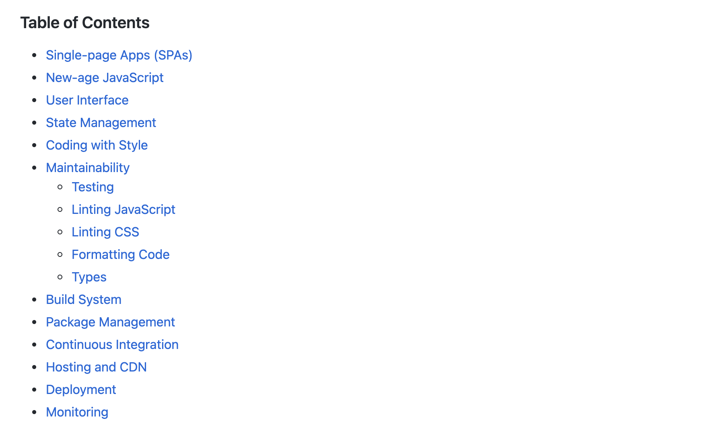

✨Star：14.1k

GitHub地址：[https://github.com/grab/front-end-guide](https://github.com/grab/front-end-guide)

## 7. Free Programming Books
这个网站上汇集着很多免费的课程和编程书籍。在这个网站上，包含了很多语言，如果英文不太好，可以选择查看中文的资料，除了文档之外，还有视频、程序等多种形式的资料。

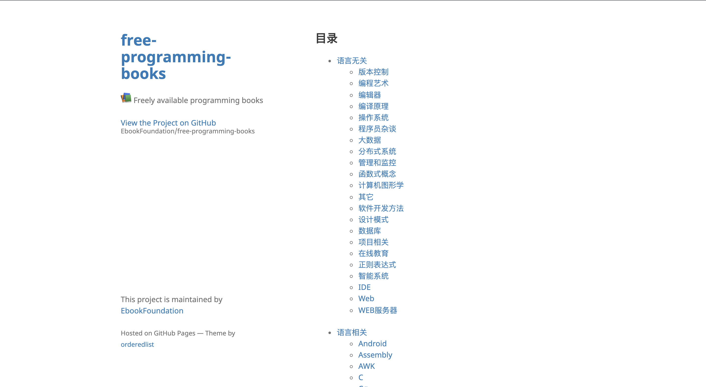

✨Star：218k

官网地址：[https://ebookfoundation.github.io/free-programming-books/](https://ebookfoundation.github.io/free-programming-books/)

GitHub地址：[https://github.com/EbookFoundation/free-programming-books](https://github.com/EbookFoundation/free-programming-books)

## 8. Front-end Developer Interview Questions
这个网站收集了一些常见的前端面试题，不过并没有给出答案，可以自己整理学习。

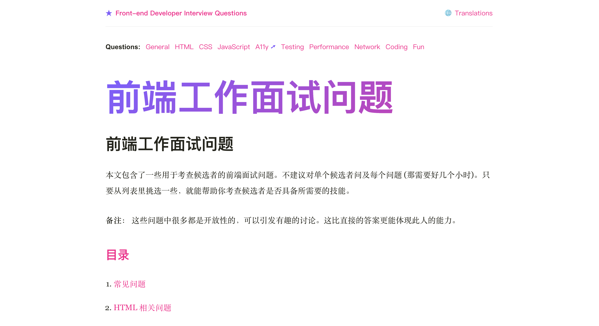

✨Star：51.7k

GItHub地址：[https://github.com/h5bp/Front-end-Developer-Interview-Questions](https://github.com/h5bp/Front-end-Developer-Interview-Questions/)

官网地址：[https://h5bp.org/Front-end-Developer-Interview-Questions/translations/chinese/](https://h5bp.org/Front-end-Developer-Interview-Questions/translations/chinese/)

## 9. Every Programmer Should Know
[every-programmer-should-know](https://github.com/mtdvio/every-programmer-should-know) 是每个软件开发人员都应该知道的技术知识的集合。

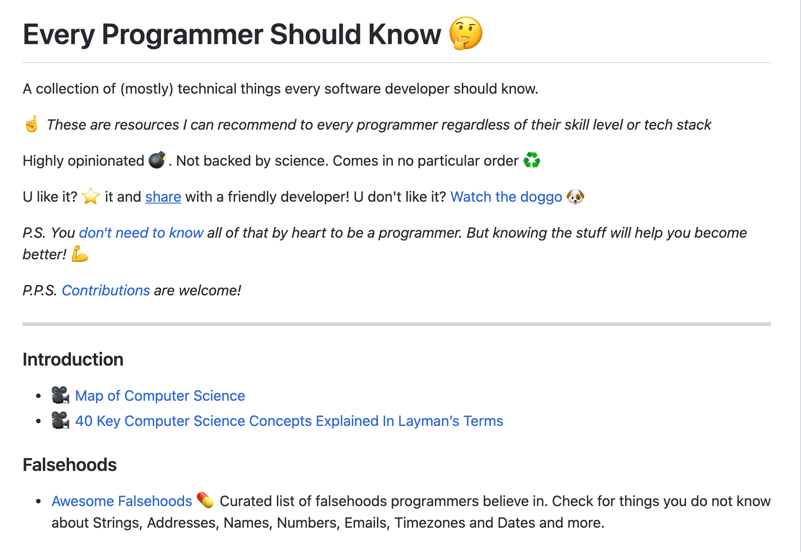

✨Star：51.2k

GitHub地址：[https://github.com/mtdvio/every-programmer-should-know](https://github.com/mtdvio/every-programmer-should-know)

## 10. Tech Interview Handbook
这是一个关于技术面试的网站，它总结了开发人员的面试经验，例如如何写简历、自我介绍、面试中的常见问题以及编程中的算法和技术等。

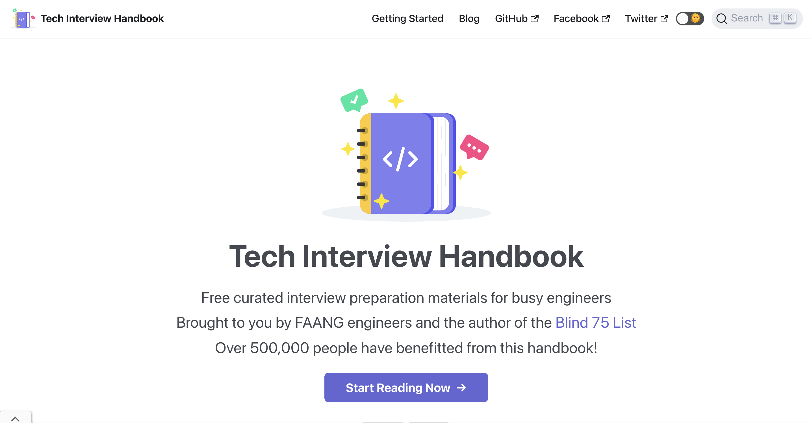

✨Star：63k

官网地址：[https://techinterviewhandbook.org/](https://techinterviewhandbook.org/)

GitHub地址：[https://github.com/yangshun/tech-interview-handbook](https://github.com/yangshun/tech-interview-handbook)

## 11. Coding Interview University
该项目收录了作者为进入谷歌而准备的学习笔记列表，包括数据结构与算法、计算机基础、编程练习等多种学子资料。

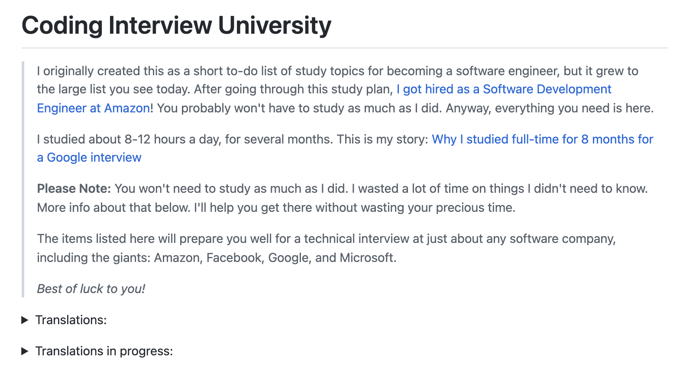

✨Star：202k

GitHub地址：[https://github.com/jwasham/coding-interview-university](https://github.com/jwasham/coding-interview-university)

## 12. Modern JavaScript Cheatsheet
这是一个 JavaScript 速查表，可帮助我们解决在开发过程中经常遇到的问题。

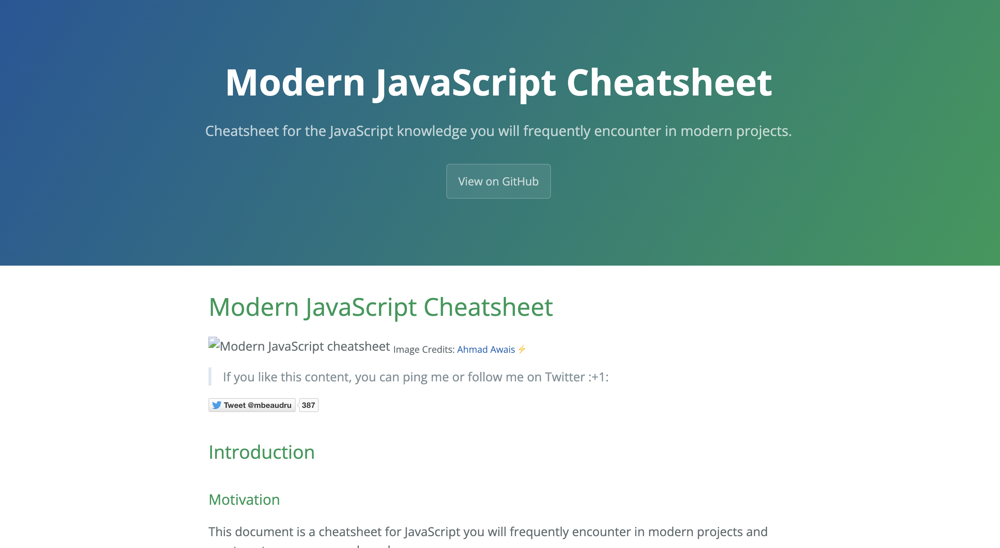

✨Star：22.1k

官网地址：[https://mbeaudru.github.io/modern-js-cheatsheet/](https://mbeaudru.github.io/modern-js-cheatsheet/)

GitHub地址：[https://github.com/mbeaudru/modern-js-cheatsheet](https://github.com/mbeaudru/modern-js-cheatsheet)

## 13. Front-End Checklist
这个一个前端开发者在开发前需要了解的知识清单。适合初学者来检测自己的学习情况。

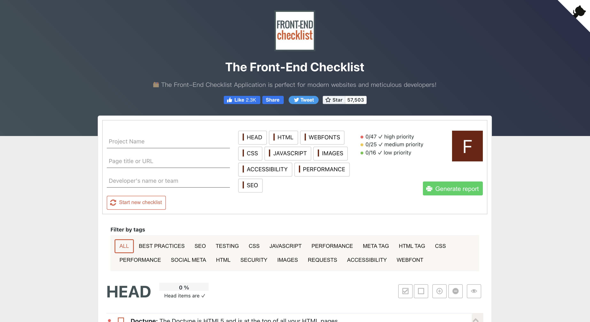

✨Star：57.5k

官网地址：[https://frontendchecklist.io/](https://frontendchecklist.io/)

GitHub地址：[https://github.com/thedaviddias/Front-End-Checklist](https://github.com/thedaviddias/Front-End-Checklist)

## 14. Awesome
Awesome是一个书籍、工具、库等集合，适用于当今所有流行的编程语言。  
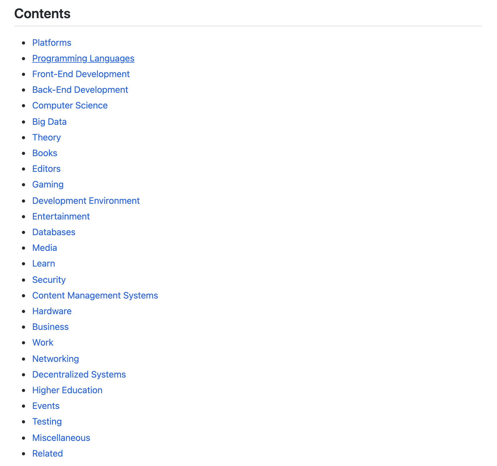

✨Star：183k

GitHub地址：[https://github.com/sindresorhus/awesome](https://github.com/sindresorhus/awesome)

## 15. Design Resources For Developers
这是一个为开发人员提供的在网站开发过程中选择颜色、字体、模板、CSS 框架等设计工具的集合。

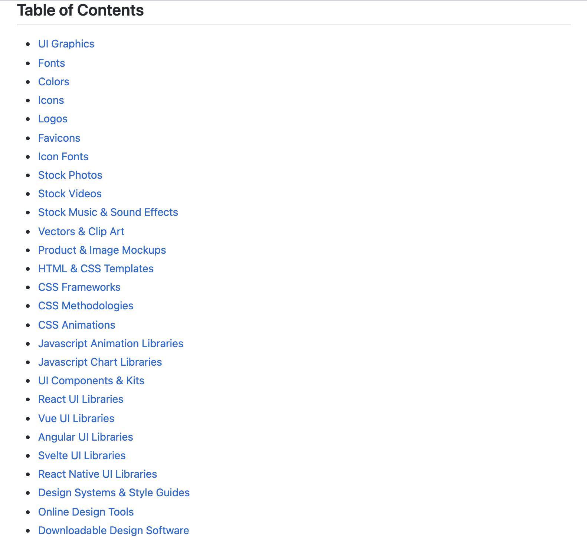

✨Star：34.6k

GitHub地址：[https://github.com/bradtraversy/design-resources-for-developers](https://github.com/bradtraversy/design-resources-for-developers)

## 16. JavaScript Algorithms And Data Structures
这是一个使用JavaScript来介绍常见的算法和数据结构的教程，它有很多种语言可以选择，英文不好的小伙伴可以直接看中文版。

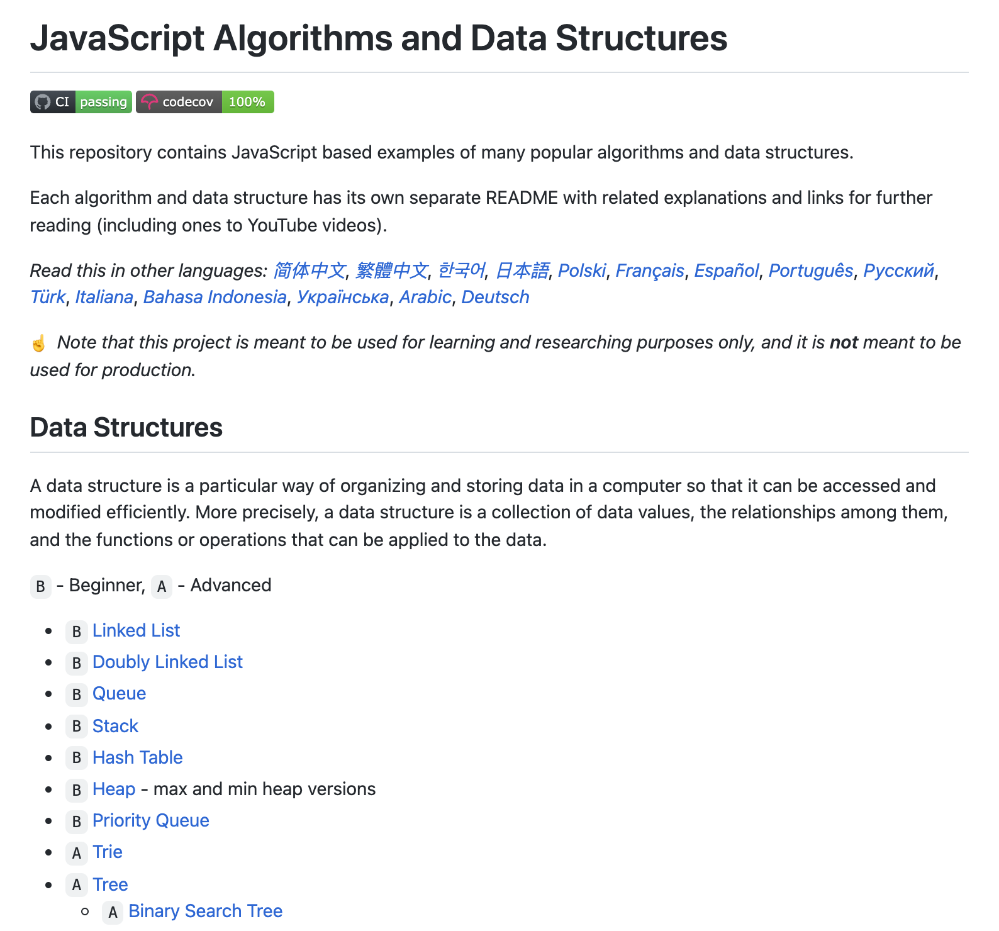

✨Star：131k

GitHub地址：[https://github.com/trekhleb/javascript-algorithms](https://github.com/trekhleb/javascript-algorithms)

## 17. CSS Protips 
这是一个提供CSS技巧的项目，帮我们快速掌握CSS技巧。  
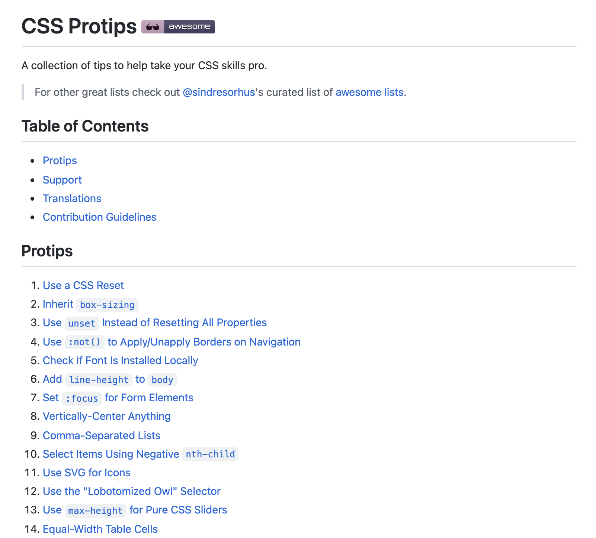

✨Star：20.3k

GitHub地址：[https://github.com/AllThingsSmitty/css-protips](https://github.com/AllThingsSmitty/css-protips)

## 18. Awesome Web Development Resources
这是一个面向前端开发人员的免费编程资源的集合，上面包含了学习平台、托管平台、图片、图标、字体、文档、视频教程等多个分类。

✨Star：3k

官网地址：[https://markodenic.com/free-web-development-resources/](https://markodenic.com/free-web-development-resources/)

GitHub地址：[https://github.com/markodenic/web-development-resources](https://github.com/markodenic/web-development-resources)

## 19. JavaScript Questions
这个网站收集了 JavaScript 从基础到高级的各种问题，并且每个问题都有答案和详细的说明。它被翻译成多种语言，可自行选择。

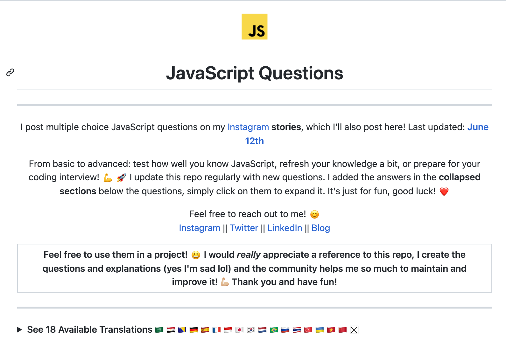

✨Star：40k

GitHub地址：[https://github.com/lydiahallie/javascript-questions](https://github.com/lydiahallie/javascript-questions)

## 20. Vanilla Web Projects
这是一个通过 20 多个免费项目帮助我们练习 JavaScript 开发代码的项目。

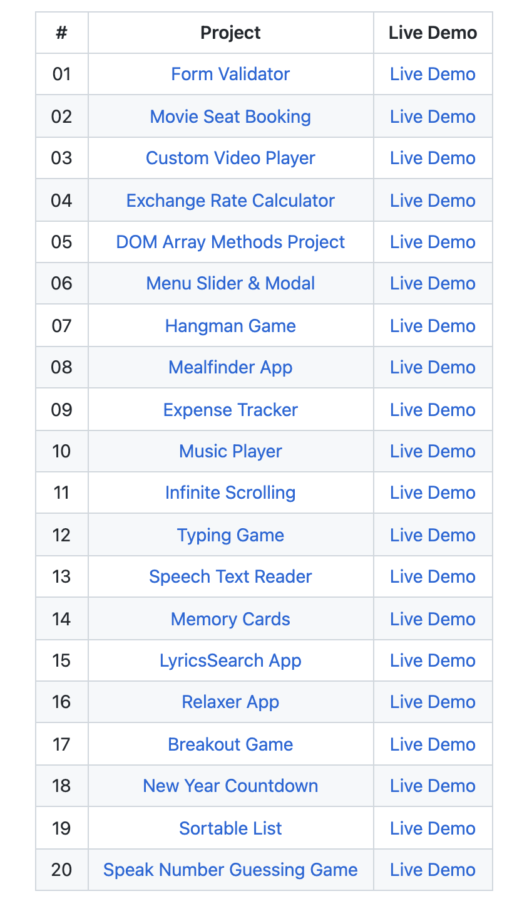

✨Star：11.8k

GitHub地址：[https://github.com/bradtraversy/vanillawebprojects](https://github.com/bradtraversy/vanillawebprojects)

## 21. Spellbook of Modern Web Dev
这是一个针对Web 开发人员的学习资源（如文章、书籍等）的集合。

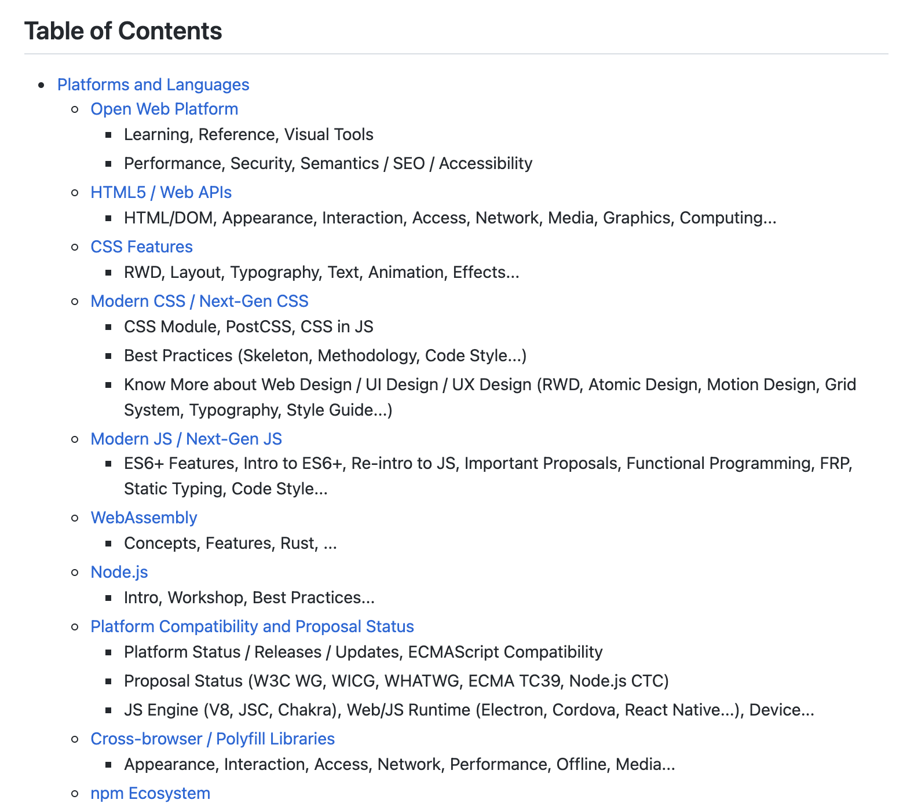

✨Star：13.8k

GitHub地址：[https://github.com/dexteryy/spellbook-of-modern-webdev](https://github.com/dexteryy/spellbook-of-modern-webdev)

## 22. 33 JavaScript Concepts
这个项目是帮助我们快速掌握33个常见的 JavaScript 概念的文章汇总。

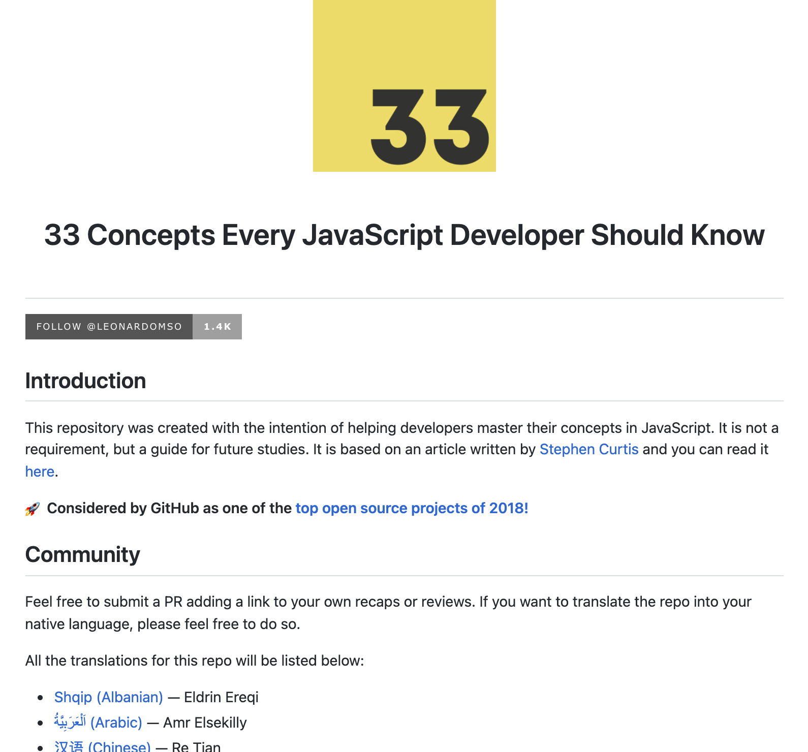

✨Star：45.7k

GitHub地址：[https://github.com/nguyentranchung/33-js-concepts](https://github.com/nguyentranchung/33-js-concepts)

## 23. Project Guidelines
这是一个前端项目开发的教程列表，主要介绍在项目开发时需要注意的点。该项目也提供了中文版供我们选择。

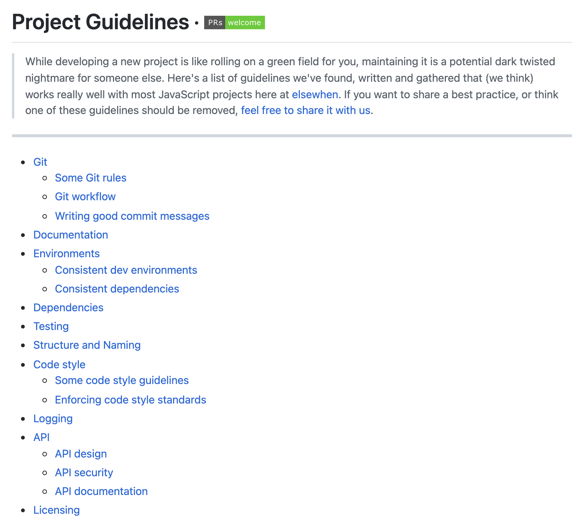

✨Star：26k

GitHub地址：[https://github.com/elsewhencode/project-guidelines](https://github.com/elsewhencode/project-guidelines)

## 24. Learn Git Branching
LearnGitBranching 是一个 git 存储库可视化工具、沙箱，以及一系列教程和挑战。它的主要目的是通过可视化的形式帮助开发人员理解 git。这是通过不同级别的游戏来熟悉不同的 git 命令来实现的。

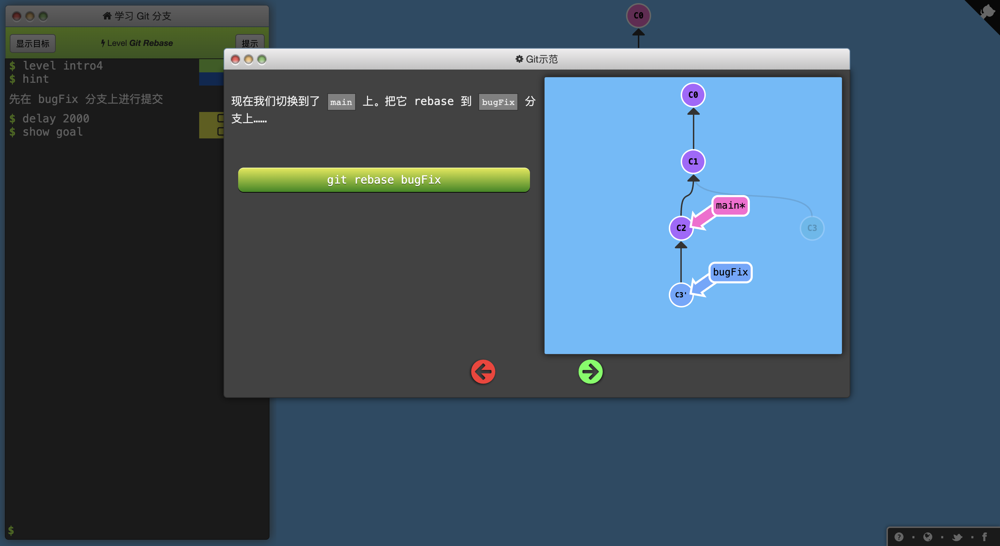✨Star：23.1k

GitHub地址：[https://github.com/pcottle/learnGitBranching](https://github.com/pcottle/learnGitBranching)

## 25. You Don’t Know JS Yet
这是一个关于 JavaScript 核心概念的系列丛书。它涵盖了 JavaScript 中的大多数知识点，如作用域、闭包、this、对象原型、异步和性能等。

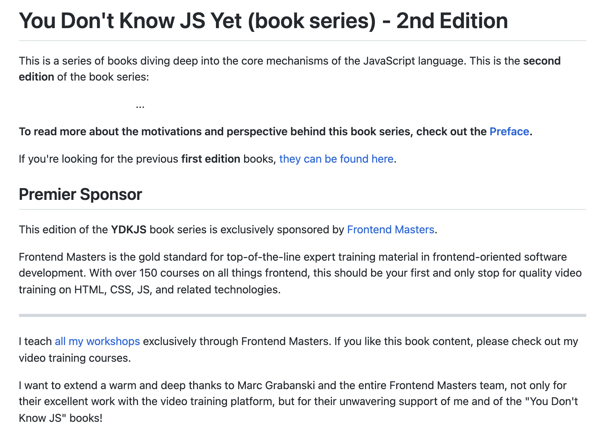

✨Star：148k

GitHub地址：[https://github.com/getify/You-Dont-Know-JS](https://github.com/getify/You-Dont-Know-JS)

## 26. Nodejs Best Practices
这个项目是 Nodejs 开发最佳实践的终极指南。这里面包含了代码风格、性能、安全性、项目结构等方面的重要提示。

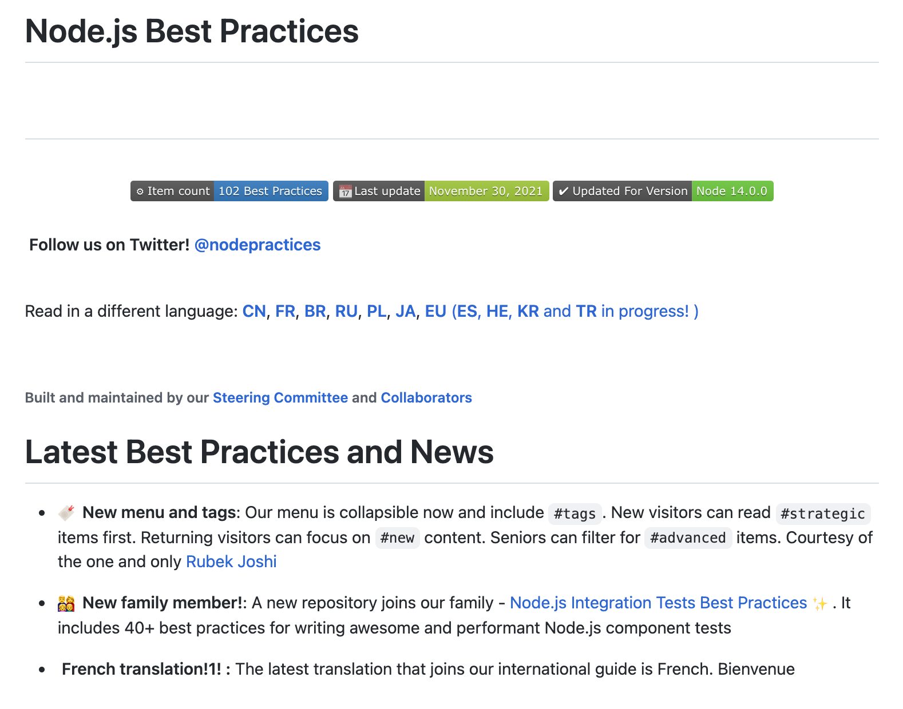

✨Star：73.3k

GitHub地址：[https://github.com/goldbergyoni/nodebestpractices](https://github.com/goldbergyoni/nodebestpractices)

## 27. FreeCodeCamp
FreeCodeCamp 是一个自由开源的学习编程的社区，致力于帮助人们利用零散时间学习编程。它的使命是 Learn to code and help nonprofits。FCC 涵盖 HTML5、CSS、React、JavaScript、Database 等课程，游戏化程度非常高，学员可以通过线上聊天室和线下社区活动相互帮助。

✨Star：338k

Github地址：[https://github.com/freeCodeCamp/freeCodeCamp](https://github.com/freeCodeCamp/freeCodeCamp)

## 28. Awesome Repos
该项目收录了很多很实用的资源库，包含了前端、后端、网络、人工智能等很多方向的资源。

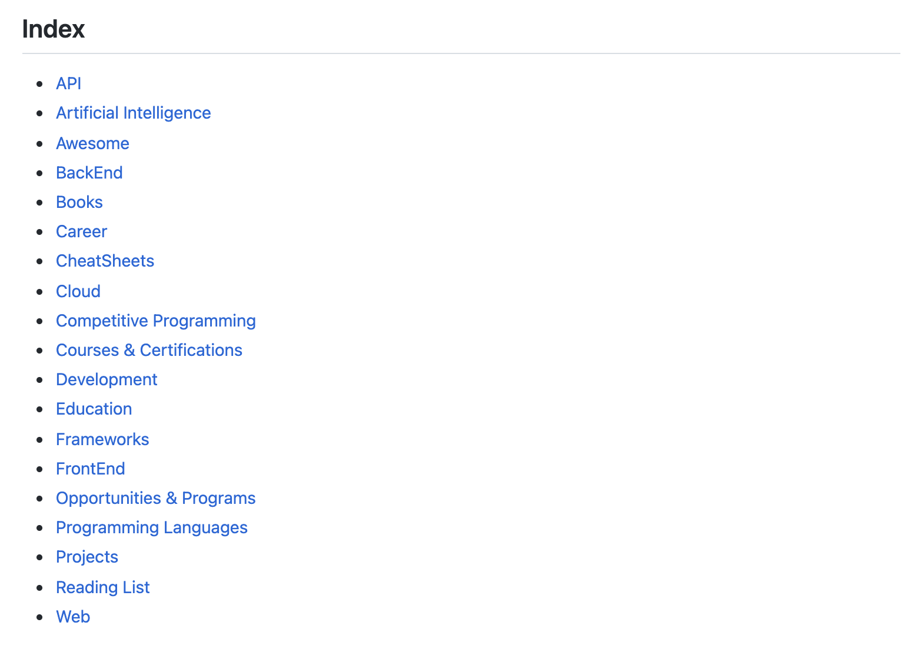

✨Star：1.3k

GitHub地址：[https://github.com/pawelborkar/awesome-repos](https://github.com/pawelborkar/awesome-repos)

## 29. Frontend Development Bookmarks
该项目包含为前端开发人员精心挑选的资源集合。从架构到 UI 组件，都在这个项目中。它涵盖了广泛的前端技术。

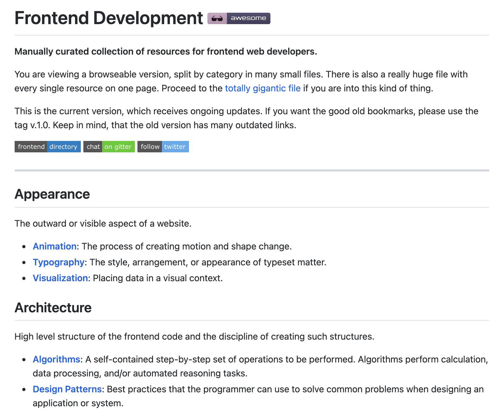

✨Star：33k

GitHub地址：[https://github.com/dypsilon/frontend-dev-bookmarks](https://github.com/dypsilon/frontend-dev-bookmarks)

## 30. Awesome Interview Questions
该项目包含几乎每种编程语言和框架的大量面试问题。

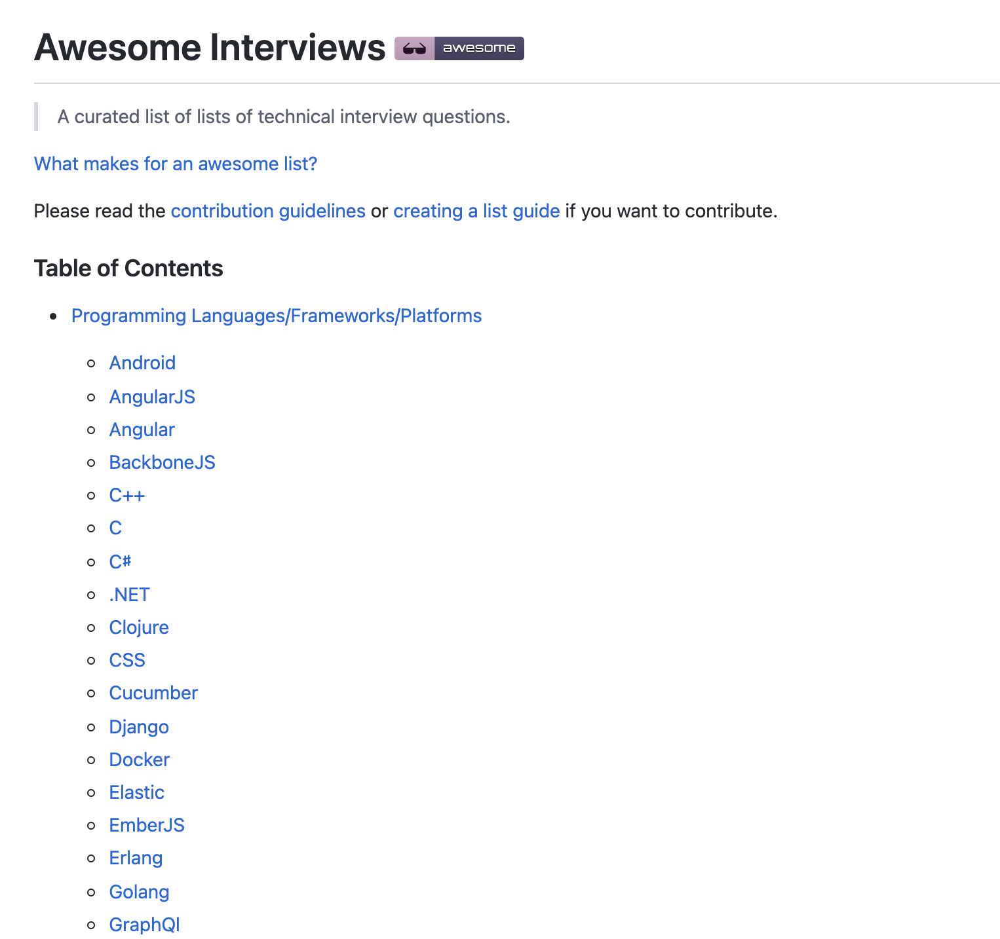

✨Star：44.5k

GitHub地址：[https://github.com/DopplerHQ/awesome-interview-questions](https://github.com/DopplerHQ/awesome-interview-questions)

## 31. TypeScript Tutorial
[typescript-tutorial](https://github.com/xcatliu/typescript-tutorial) 是一个TypeScript入门教程，从 JavaScript 程序员的角度总结思考，循序渐进的理解 TypeScript。

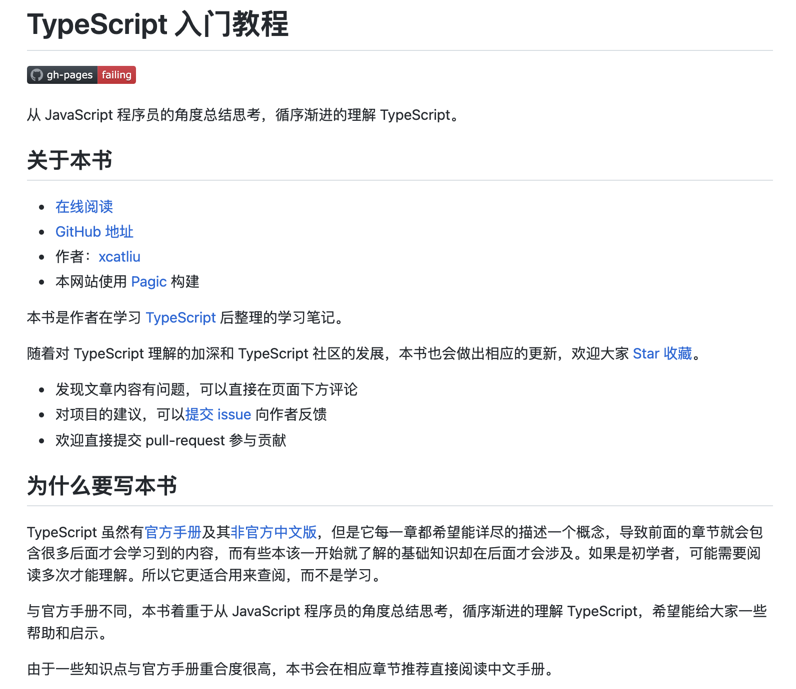

**✨****Star：**8.4k

**GItHub地址： **[https://github.com/xcatliu/typescript-tutorial](https://github.com/xcatliu/typescript-tutorial)

## 32. TypeScript Book Chinese
[typescript-book-chinese](https://github.com/jkchao/typescript-book-chinese) 此书是 《TypeScript Deep Dive》 的中文翻译版，即《深入理解 TypeScript》。

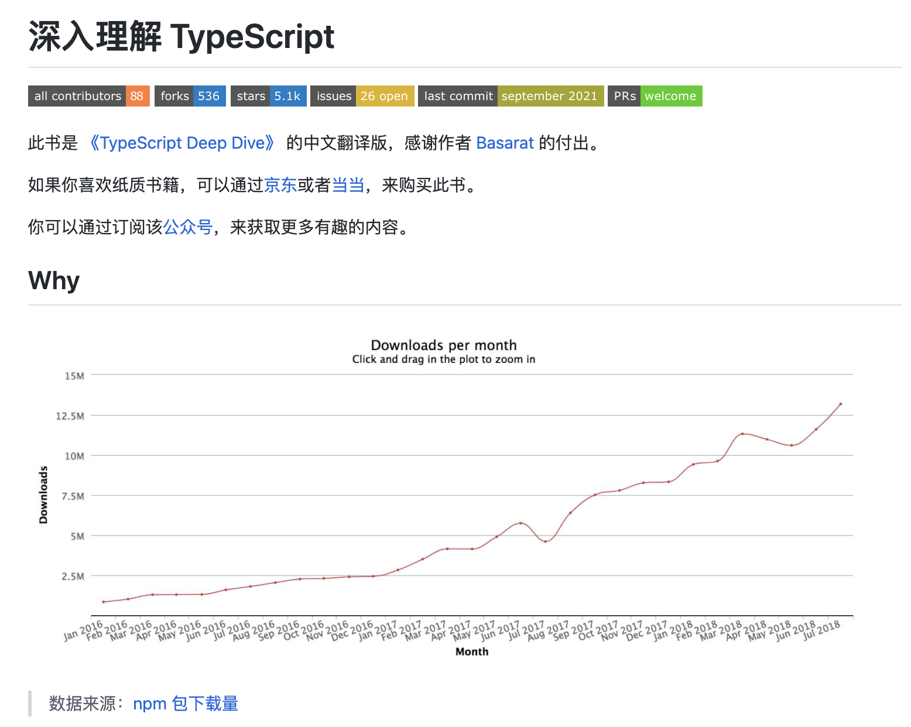

**✨****Star：**5.1k

**GitHub地址**：[https://github.com/jkchao/typescript-book-chinese](https://github.com/jkchao/typescript-book-chinese)

## 33. Clean Code TypeScript
[clean-code-typescript](https://github.com/labs42io/clean-code-typescript) 是一个类似于clean-code-JavaScript的库，教给我们如何更好的编写TypeScript代码。

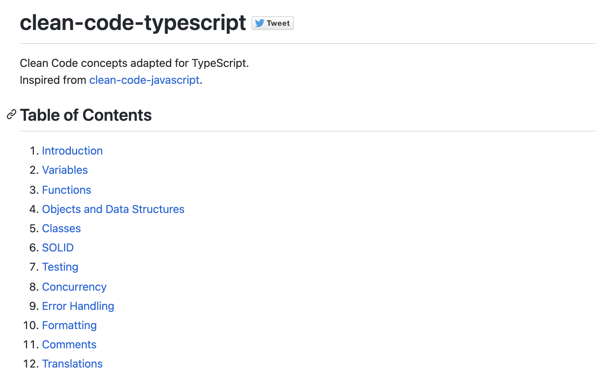  
**✨****Star：**5.1k

**GitHub地址**：[https://github.com/labs42io/clean-code-typescript](https://github.com/labs42io/clean-code-typescript)

> 更新: 2022-01-27 16:51:13  
> 原文: <https://www.yuque.com/cuggz/feplus/guafyh>