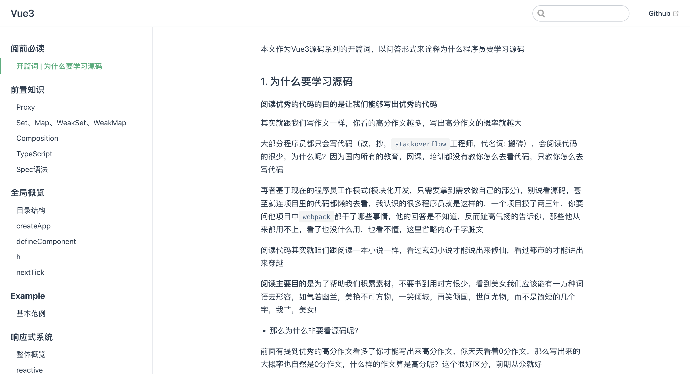
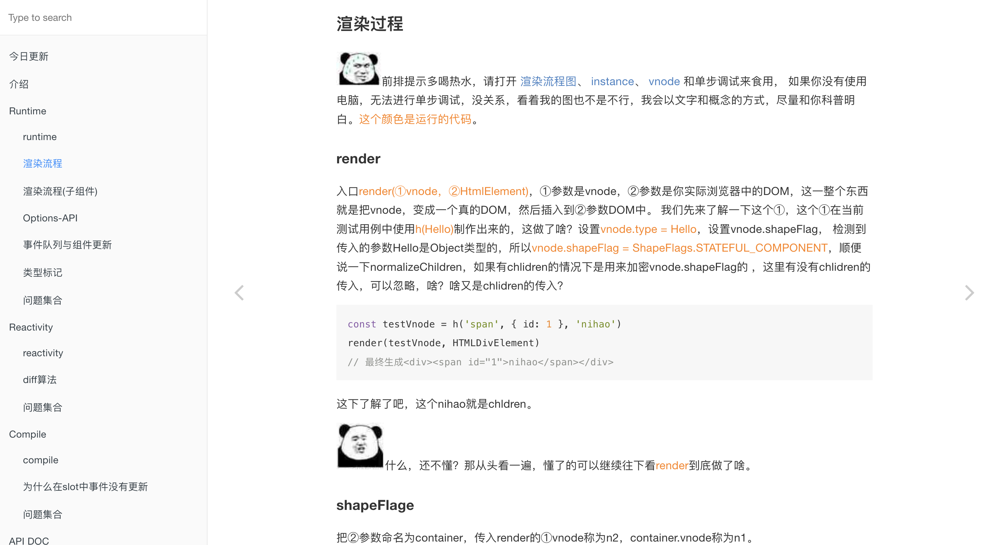
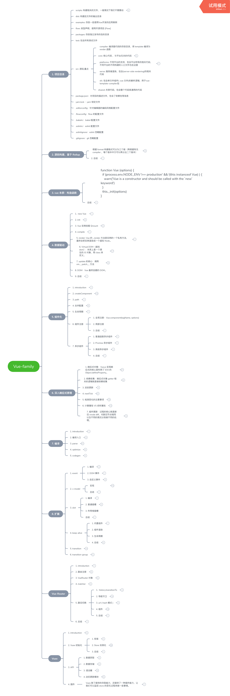
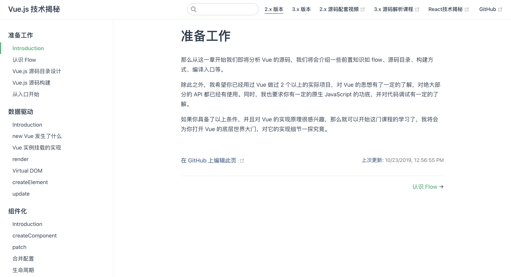
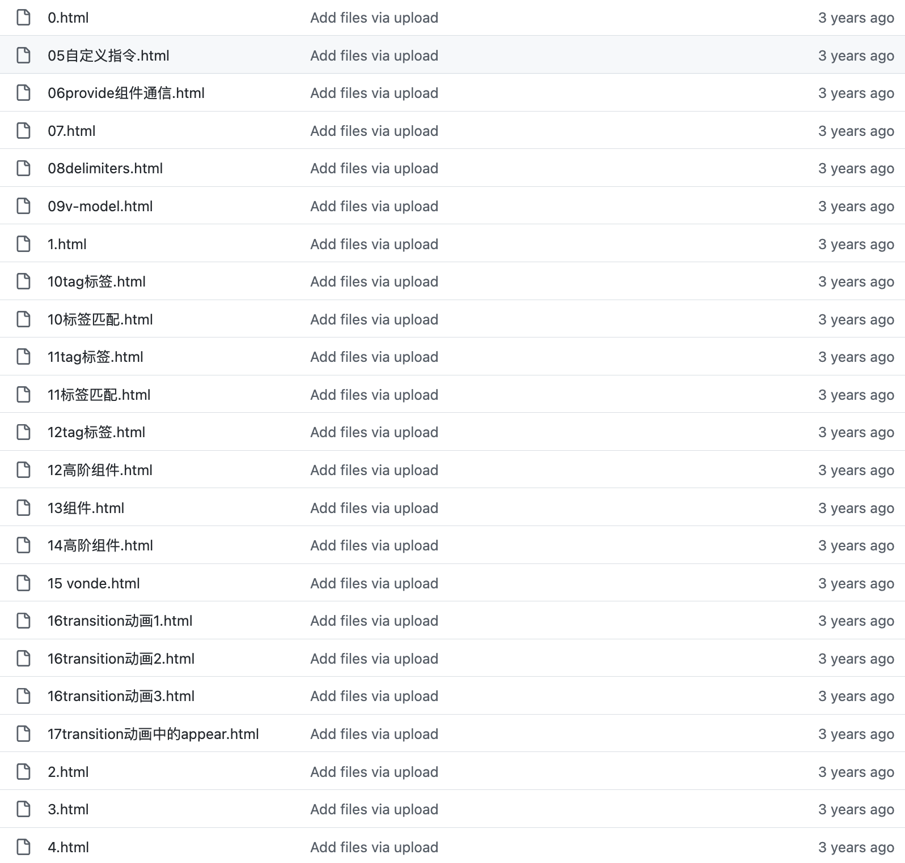
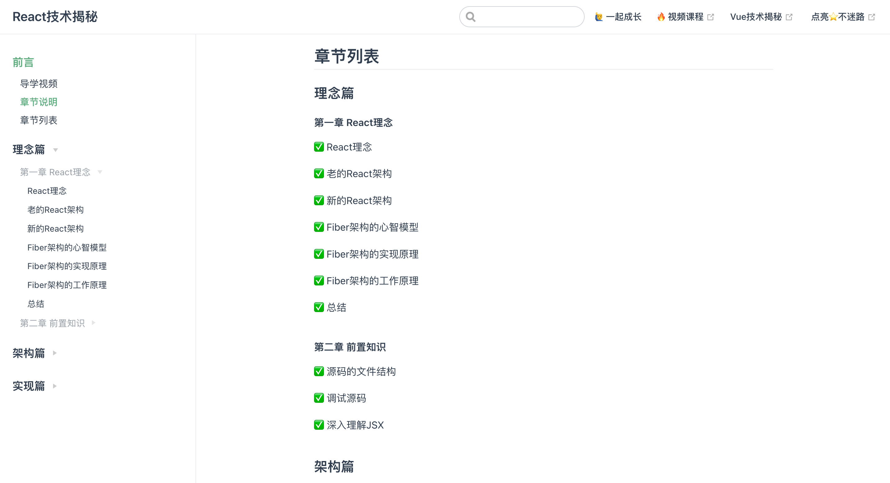
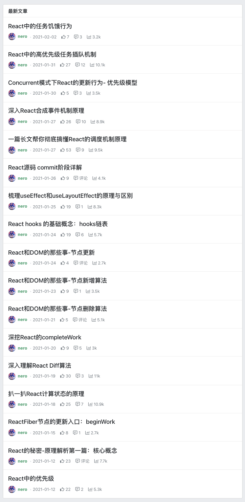
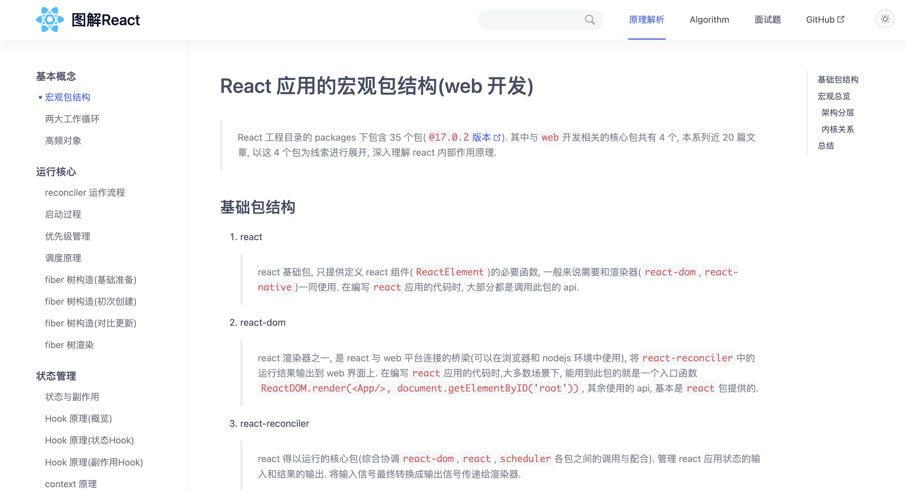
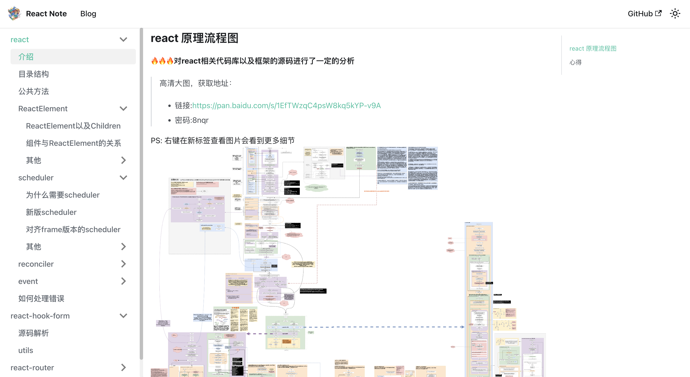
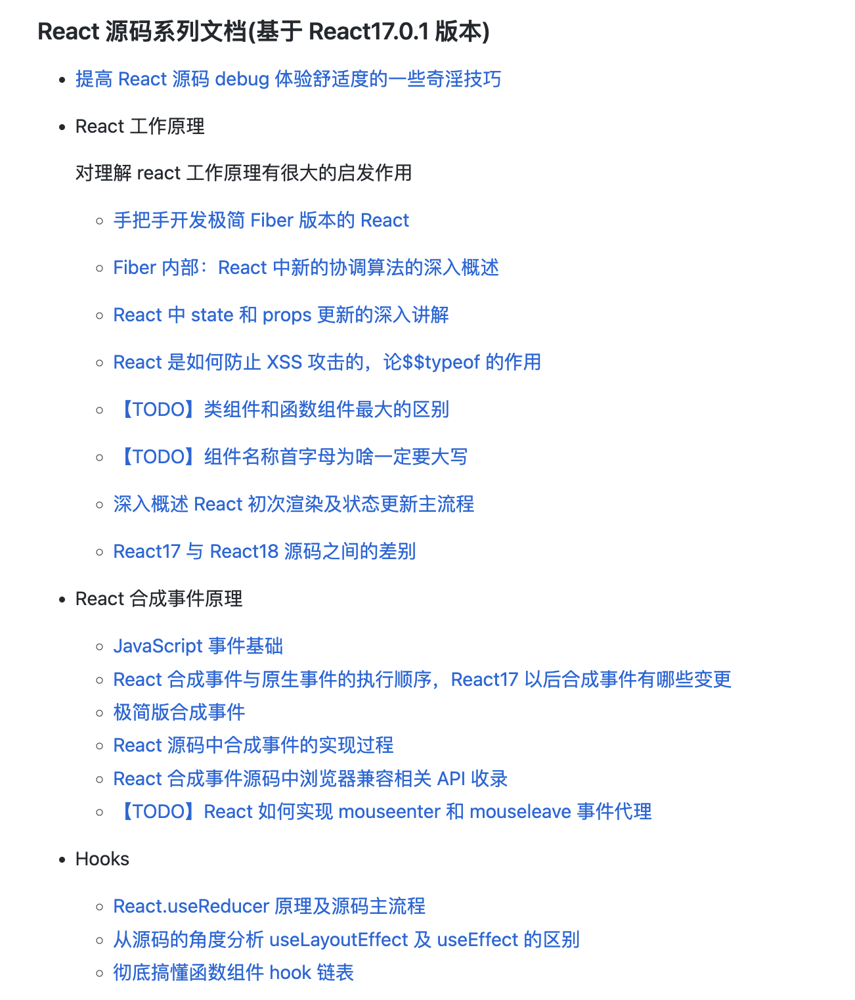

# 前端框架源码解析项目

为什么要阅读源码？阅读优秀的代码的目的是让我们能够写出优秀的代码，更好的理解框架的工作方式。下面就来分享5个 Vue 源码解析开源项目、5个 React 源码解析开源项目！

## Vue3源码系列
Vue中文社区提供的Vue3源码解析系列文章。

**在线阅读：**[https://vue3js.cn/start/](https://vue3js.cn/start/)

## Vue3源码解释
Vue3源码解释，提供了详细的测试用例和流程图。

**在线阅读：**[https://kingbultsea.github.io/vue3-analysis/book/index.html](https://kingbultsea.github.io/vue3-analysis/book/index.html)

## 图解Vue、Vue-Router、Vuex源码
提供了多张思维导图辅助你深入了解 Vue | Vue-Router | Vuex 源码架构。

**在线阅读：**[https://github.com/biaochenxuying/vue-family-mindmap](https://github.com/biaochenxuying/vue-family-mindmap)

## Vue.js 技术揭秘
该电子书的目标是全方位细致深度解析 Vue.js 的实现原理，分析的版本为 Vue.js 2.5.17-beta.0。

**在线阅读：**[https://ustbhuangyi.github.io/vue-analysis/](https://ustbhuangyi.github.io/vue-analysis/)

## Vue源码逐行注释分析
Vue 源码逐行注释分析，提供了40MB+ 的 Vue 源码程序流程图思维导图。

**Github：**[https://github.com/qq281113270/vue](https://github.com/qq281113270/vue)

## React 技术揭秘
卡颂老师的《React技术揭秘》电子书，该书的宗旨是打造一本严谨、易懂的 React 源码分析教程。内容不预设观点，所有观点来自React核心团队成员在公开场合的分享，其通过了丰富的参考资料，包括在线Demo、文章、视频。

**在线阅读：**[https://react.iamkasong.com/](https://react.iamkasong.com/)

## React的秘密
本项目是作者在阅读React源码过程中搭建的调试环境，学习过程中对源码添加了较为详细的注释，并记录了一些自己的理解与思考，输出了十几篇文章。

**在线阅读：**[https://segmentfault.com/blog/react-secret?_ea=103006355](https://segmentfault.com/blog/react-secret?_ea=103006355)

## 图解React源码
图解React源码，用大量配图的方式, 致力于将 React 原理表述清楚。

**在线阅读：**[https://7kms.github.io/react-illustration-series/](https://7kms.github.io/react-illustration-series/)

## React源码分析
对 React 相关代码库以及框架的源码进行了一定的分析，并总结了一张详细的流程图。

**在线阅读：**[https://buptlhuanyu.github.io/ReactNote/](https://buptlhuanyu.github.io/ReactNote/)

## React源码系列
手写React、react-dom、react reconciler主流程源码，加深对react源码的理解。包括fiber，合成事件，hooks实现原理，dom diff，reconciliation，scheduler等。

**Github：**[https://github.com/lizuncong/mini-react](https://github.com/lizuncong/mini-react)

> 更新: 2023-01-02 19:59:28  
> 原文: <https://www.yuque.com/cuggz/feplus/gpg6dmpk584ntms9>