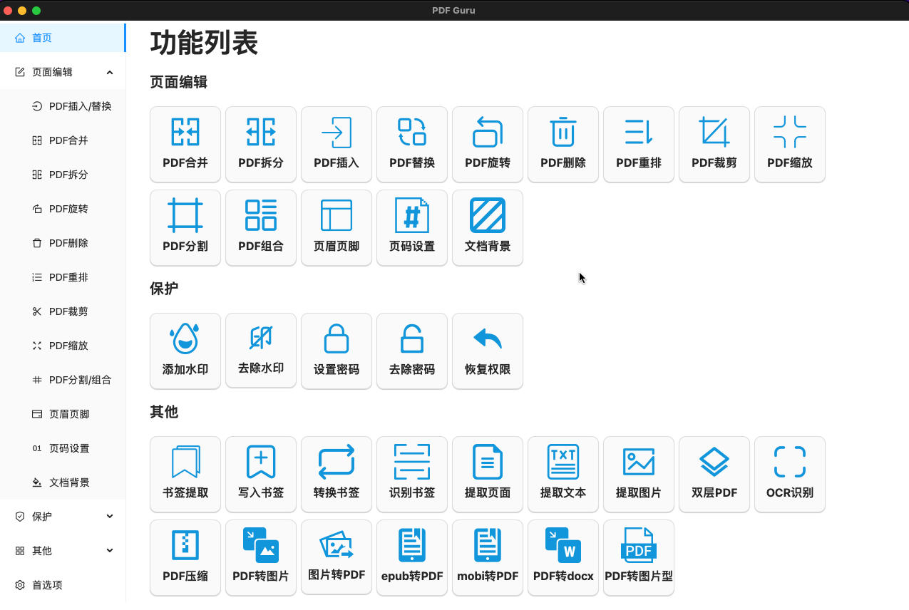
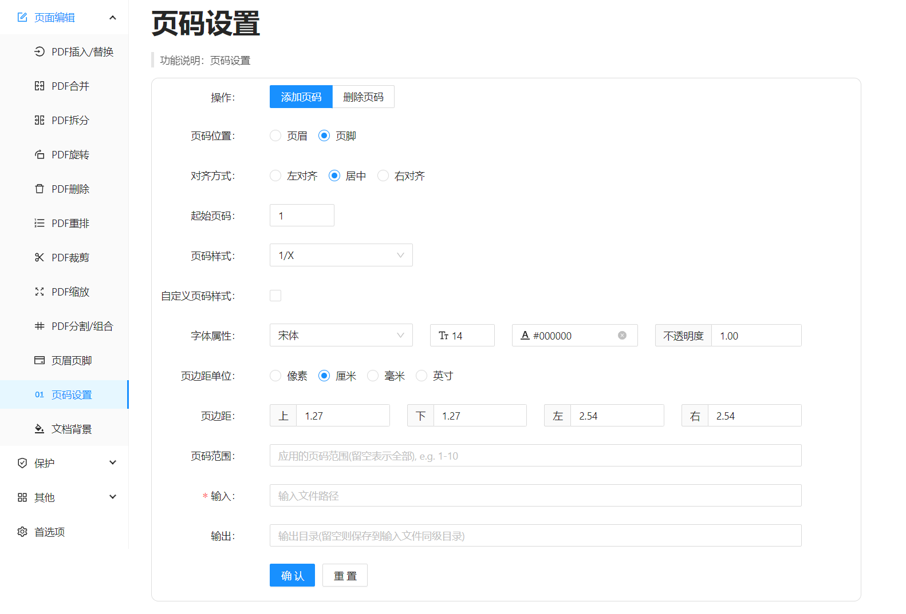
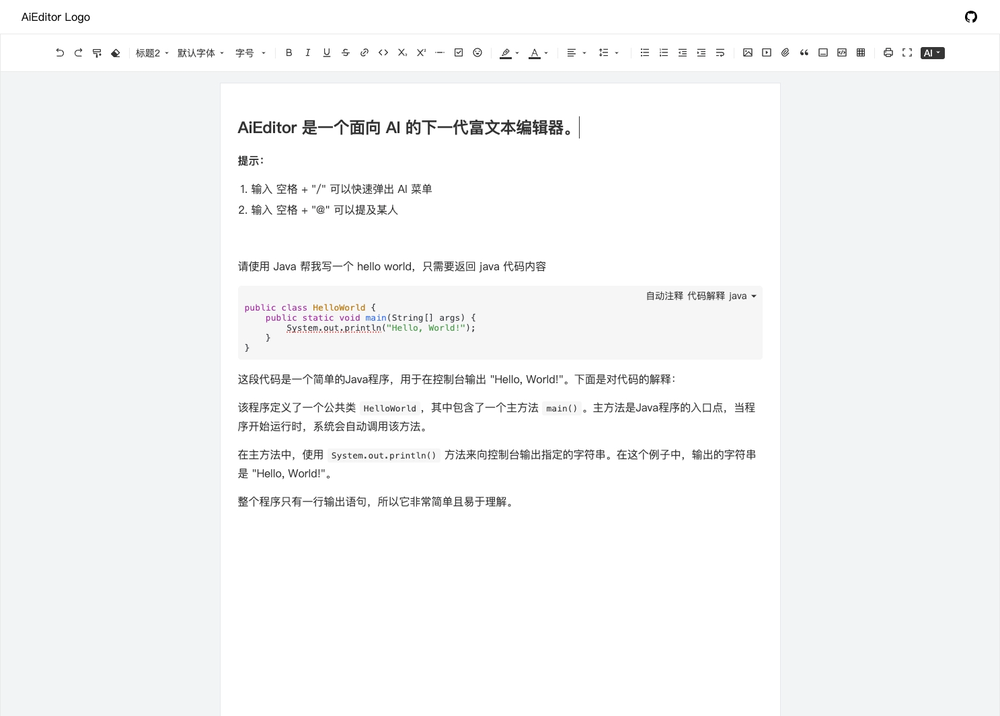
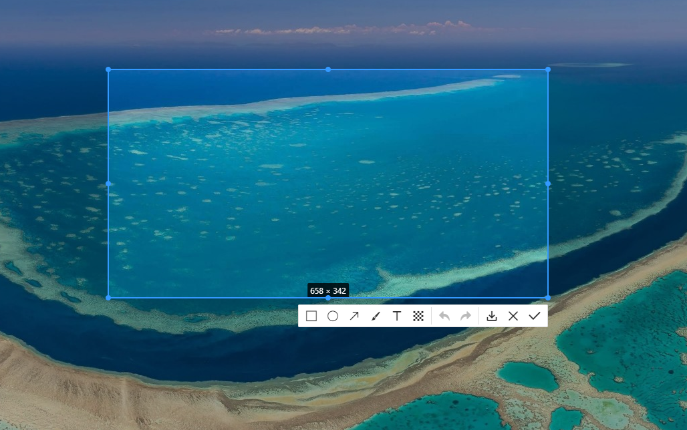
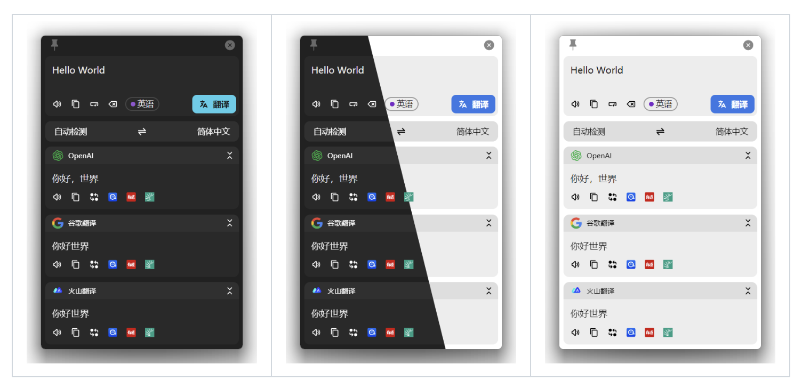
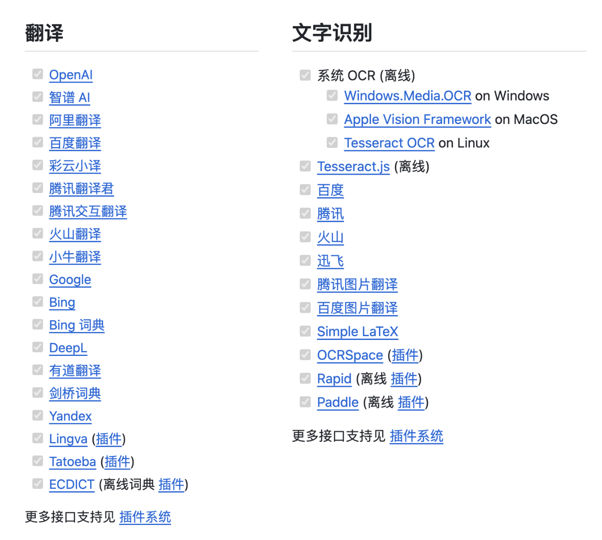
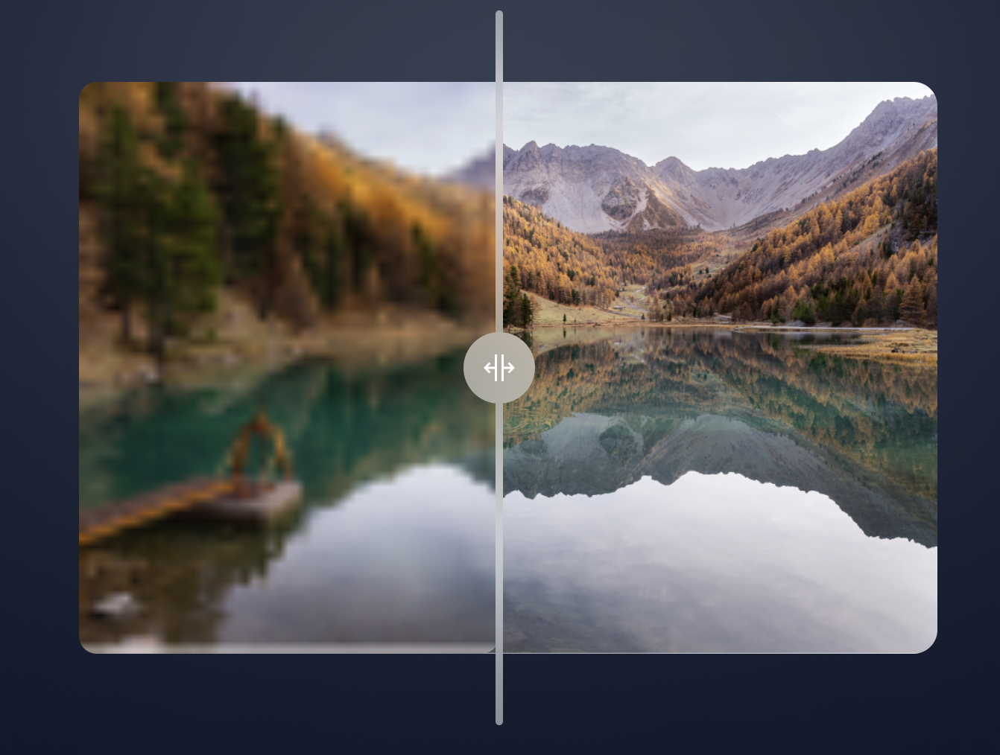
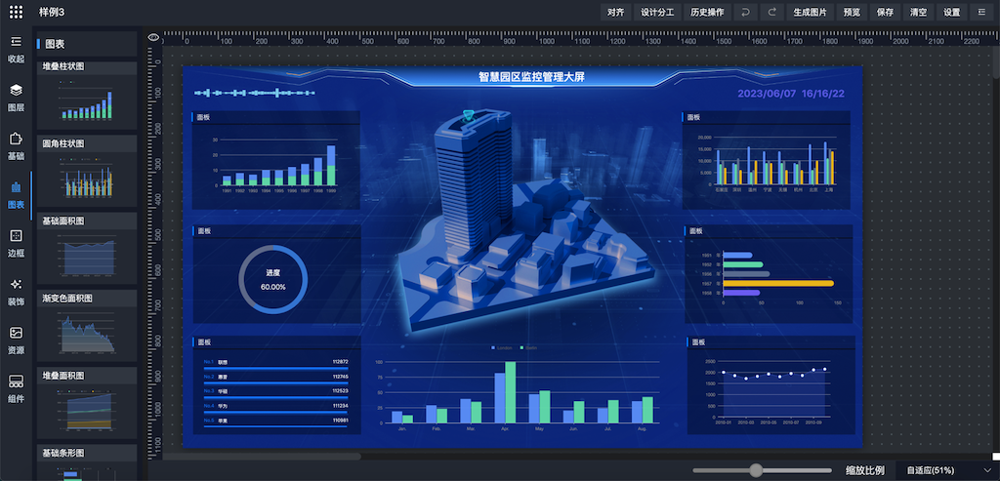
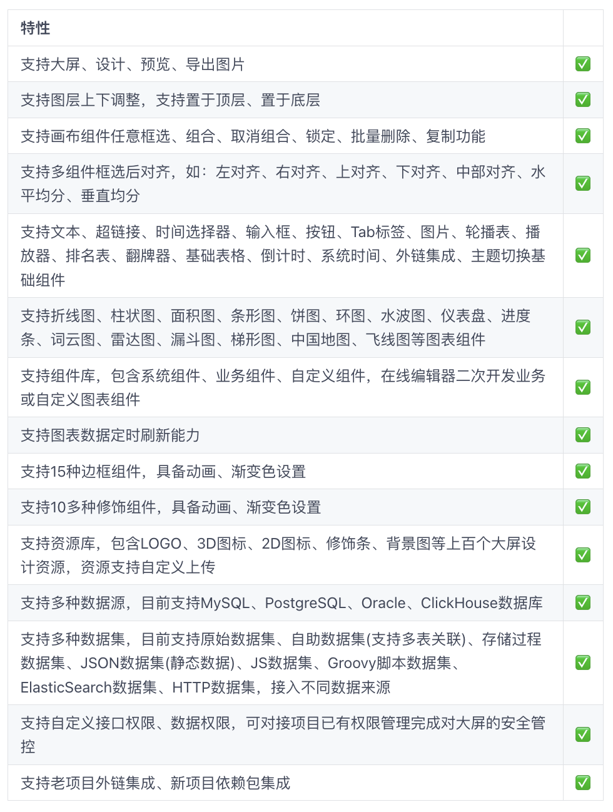
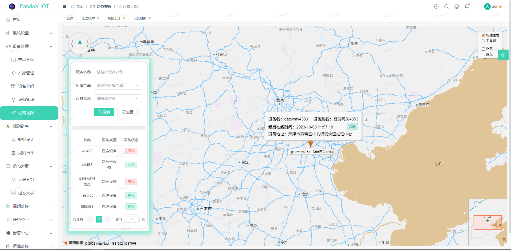

# 实用工具

本文来分享 7 个好玩又好用的开源工具！

+ PDF Guru：通用型 PDF 文件处理工具
+ AiEditor：面向 AI 的下一代富文本编辑器
+ pear-rec：实用工具集，包括截图、录屏、录音、录像等
+ Pot：划词翻译和 OCR 软件
+ Upscayl：图片修复和增强工具
+ DataRoom：大屏设计器
+ PandaX：企业级物联网平台低代码平台

## PDF-Guru
PDF Guru 是一个通用型PDF文件处理工具，包含PDF合并、拆分、旋转、水印、加密、转换等20多项常用功能，完全开源，个人免费使用，界面简洁，简单易用。该项目几月基于 Vue、Pinia、TypeScript、Vite、Go 等技术开发。

PDF-Guru 具有以下特性：

+ 完全本地化：无需联网，不必担心隐私泄露
+ 功能丰富：支持包括PDF批量合并、拆分、添加水印、加密/解密、提取、OCR识别在内的20余项功能
+ 跨平台：支持在Windows、Mac、Linux设备上使用
+ 开源免费
+ 界面美观简洁，使用简单
+ 插件化：根据需要选择是否安装额外组件，减小安装包体积

**Github：**[https://github.com/kevin2li/PDF-Guru](https://github.com/kevin2li/PDF-Guru)

## AiEditor
AiEditor 是一个面向 AI 的下一代富文本编辑器，基于 Web Component，因此支持 Layui、Vue、React、Angular 等几乎任何前端框架。其适配了 PC Web 端和手机端，并提供了亮色和暗色两个主题。除此之外，还提供了灵活的配置，开发者可以方便的使用其开发任何文字编辑的应用。

AiEditor 具有以下特性：

+ **基础**：标题、正文、字体、字号、加粗、斜体、下划线、删除线、链接、行内代码、上标、下标、分割线、引用、打印
+ **增强**：撤回、重做、格式刷、橡皮擦、待办事项、字体颜色、背景颜色、Emoji 表情、对齐方式、行高、有（无）序列表、段落缩进、强制换行
+  **附件**：支持图片、视频、文件功能，支持选择上传、粘贴上传、拖拽上传、支持拖动调整大小...
+  **代码**：行内代码、代码块、语言类型选择、**AI 自动注释**、**AI 代码解释**...
+  **表格**：左增右增、左减右减、上增下增、上减下减、合并单元格、解除合并
+  **Markdown**：标题、引用、表格、图片、代码块、**高亮块（类似 vuepress 的 :::）**、各种列表、粗体、斜体、删除线...
+  **A I**：AI 续写、AI 优化、AI 校对、AI 翻译、自定义 AI 菜单及其 Prompts
+  **更多**：国际化、亮色主题、暗色主题、手机适配、全屏编辑、@某某某（提及）..

**Github：**[https://github.com/aieditor-team/aieditor](https://github.com/aieditor-team/aieditor)

## pear-rec
pear-rec(梨子 rec) 是一个跨平台的截图、录屏、录音、录像、录制(动图)gif、查看图片、查看视频、查看音频和修改图片的软件，基于 React、Electron、Vite、viewerjs、plyr、aplayer、react-screenshots、tui-image-editor、gif.js 开发。

**Github：**[https://github.com/027xiguapi/pear-rec](https://github.com/027xiguapi/pear-rec)

## Pot
一个跨平台的划词翻译和 OCR 软件，使用 React、Tauri、Vite、[Tailwind CSS](https://tailwindcss.com/)、TypeScript 等技术开发。

Pot 具有以下特性：

+  多接口并行翻译
+  多接口文字识别
+  多接口语音合成
+  导出到生词本
+  外部调用
+  支持插件系统 
+  支持所有 PC 平台 (Windows, macOS, Linux)
+  支持 Wayland (在 KDE、Gnome 以及 Hyprland 上测试)
+  多语言支持

**Github：**[https://github.com/pot-app/pot-desktop](https://github.com/pot-app/pot-desktop)

## Upscayl
Upscayl 是一个开源的 AI 图像超分辨率工具，AI 模型通过猜测细节来增强图像，提升分辨率。Upscayl 适用于 Linux、macOS 和 Windows，以 Linux 为先的理念建立。下载后即开即用，无需联网。项目中使用了 React、Next.js、TypeScript、Electron 等技术。

Upscayl AI 图片工具是一款基于 AI 技术开发的创新应用，它能够为用户提供高效、快捷的图片处理服务，让用户轻松地完成图片加工和修复。该工具利用先进的深度学习算法和神经网络技术，可以精准地识别和还原图片中的细节、色彩和形状等元素，从而实现高质量的图片修复和增强。

Upscayl AI 图片工具的核心功能包括：

+ 图片修复：通过Upscayl AI图片工具，用户可以轻松实现图片修复，包括去除噪点、修复缺失或损坏的元素、增加细节等操作，让图片恢复原有的鲜明色彩和质感。
+ 图片增强：该工具可以通过算法处理，对图片进行重新构建，增加对比度，采用高分辨率技术让图片更清晰，并进行亮度、饱和度等全方位增强，让图片更加美观和有吸引力。
+ 图片转换：Upscayl AI图片工具支持将图片从一个格式转换为另一种格式，包括JPG、PNG和GIF等多种格式之间的转换，方便用户在不同设备和平台的使用。
+ 自动化处理：该工具还可以进行自动化处理，帮助用户自动完成批量图片处理、批量转换、批量添加水印等操作，省去了手动操作的烦恼。

**Github：**[https://github.com/upscayl/upscayl](https://github.com/upscayl/upscayl)

## DataRoom
DataRoom 是一款基于 SpringBoot、MyBatisPlus、Vue、ElementUI、G2Plot、Echarts 等技术栈的大屏设计器，具备大屏设计、预览能力，支持 MySQL、Oracle、PostgreSQL、SQLServer、ElasticSearch、JSON、JS、HTTP、Groovy 等数据集接入。

**Github：**[https://github.com/gcpaas/DataRoom](https://github.com/gcpaas/DataRoom)

## PandaX
PandaX 是一个开源的企业级物联网平台低代码开发基座，基于go-restful+Vue3.0+TypeScript+vite3+element-Plus的前后端分离开发。支持设备管控，规则链，云组态，可视化大屏，报表设计器，表单设计器，代码生成器等功能。

项目特性：

+ 对前后端进行了大部分功能的封装，后端自封装go-restful，使用起来更加简洁，功能逻辑清晰，能快速上手学习，并用在生产中。
+ 报表大屏设计器: 我们只需要拖拉拽即可绑定数据库，完成组态，报表和炫酷大屏的制作，无需要单独开发大屏。
+ 成熟的规则引擎: 项目针对数据处理使用了规则链进行处理，简化开发及配置。
+ 前端采用 Vue3.0+ TypeScript + vite3 + Element-plus：PandaUI，适配手机、平板、pc 内置多种ui功能减少开发量
+ 高效率的开发，使用代码生成器可以一键生成前后端代码，可在线预览代码，减少代码开发量。。
+ 完善的权限认证系统：完善的权限认证系统，包含，菜单按钮权限，api权限，组织权限。
+ 多数据库：项目同时支持MySQL，PostgreSql等数据库根据自身需求更改。

**Github：**[https://github.com/PandaGoAdmin/PandaX](https://github.com/PandaGoAdmin/PandaX)

> 更新: 2024-01-09 16:56:05  
> 原文: <https://www.yuque.com/cuggz/feplus/mpx7sha4emurnunh>