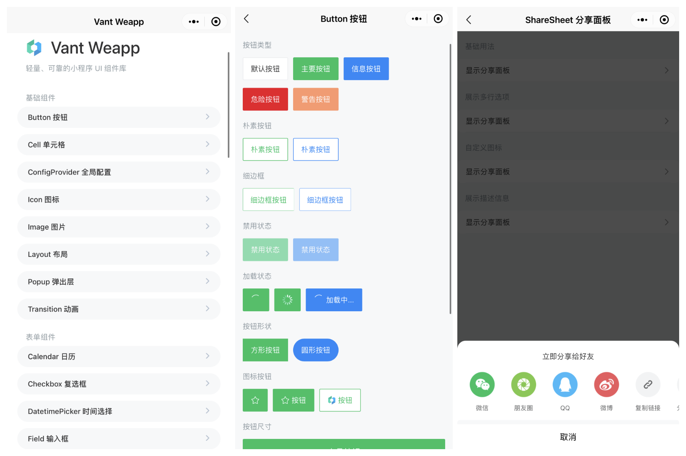
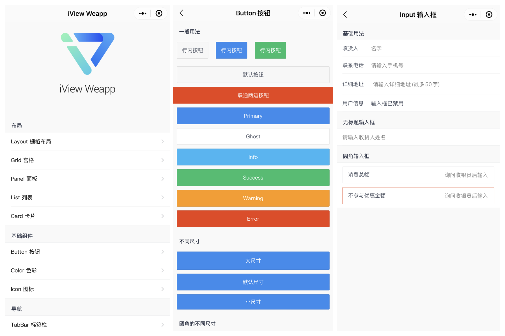
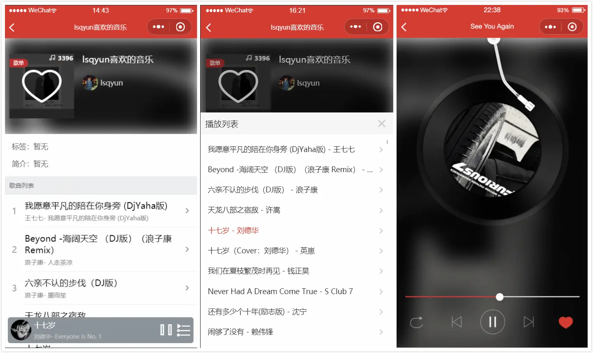
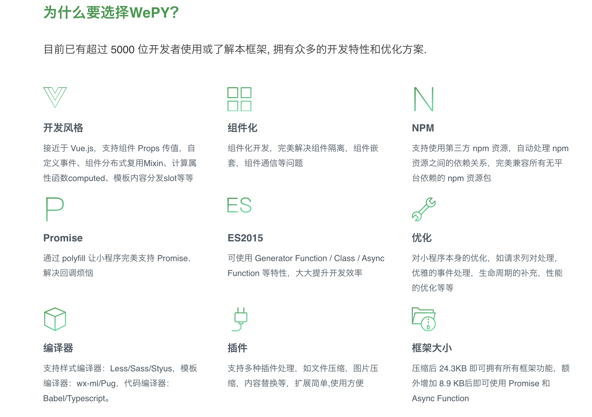
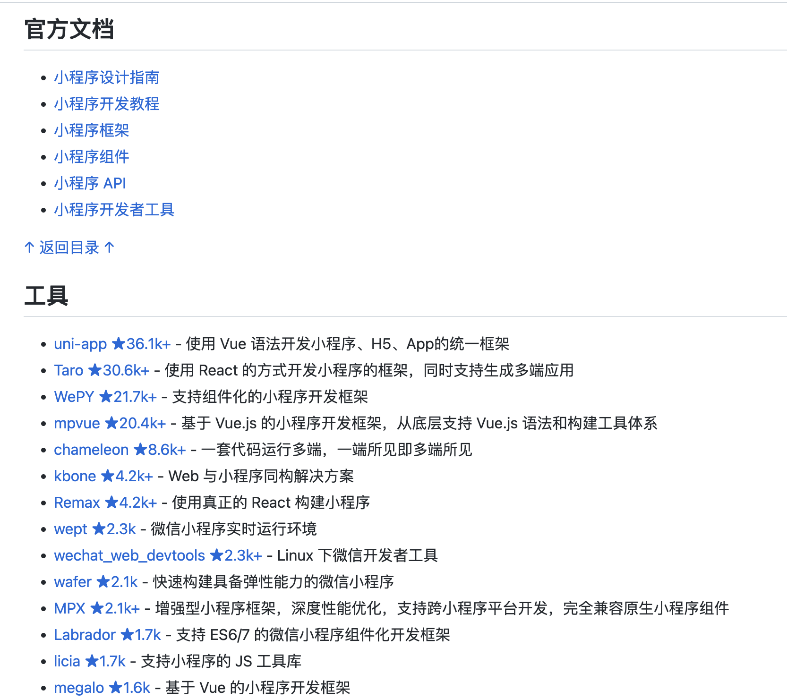

# 微信小程序项目1

## wechat-app-mall
 wechat-app-mall 是一个微信小程序商城、微信小程序微店。其具有以下功能：

+ 基于云接口及自动化后台管理，无需部署后台及服务器资源；
+ 商品展示、单商品多规格配置单独的库存和价格；
+ 基于小程序Storage接口的购物车功能；
+ 订单管理；
+ 小程序在线支付；
+ 物流跟踪管理；

**Github（****⭐****️ 16.2k）：**[https://github.com/EastWorld/wechat-app-mall](https://github.com/EastWorld/wechat-app-mall)

## vant-weapp
Vant 是一个轻量、可靠的移动端组件库，于 2017 年开源。目前 Vant 官方提供了 [Vue 2 版本](https://vant-contrib.gitee.io/vant/v2)、[Vue 3 版本](https://vant-contrib.gitee.io/vant)和[微信小程序版本](http://vant-contrib.gitee.io/vant-weapp)，并由社区团队维护 [React 版本](https://github.com/3lang3/react-vant)和[支付宝小程序版本](https://github.com/ant-move/Vant-Aliapp)。

**Github****（****⭐****️ 16.2k）****：**[https://github.com/vant-ui/vant-weapp](https://github.com/vant-ui/vant-weapp)

## **iView Weapp**
iView Weapp 是一套高质量的微信小程序 UI 组件库。

**Github（****⭐****️ 6.2k）：**[https://github.com/TalkingData/iview-weapp](https://github.com/TalkingData/iview-weapp)

## echarts-for-weixin
echarts-for-weixin 是 [Apache ECharts (incubating)](https://github.com/apache/incubator-echarts) 的微信小程序版本，以及使用的示例。开发者可以通过熟悉的 ECharts 配置方式，快速开发图表，满足各种可视化需求。

**Github（****⭐****️ 6k）：**[https://github.com/ecomfe/echarts-for-weixin](https://github.com/ecomfe/echarts-for-weixin)

## Gitter
Gitter for GitHub，可能是目前颜值最高的GitHub微信小程序客户端。该项目采用 [Taro](https://taro.aotu.io/) 框架 + [Taro UI](https://taro-ui.aotu.io/) 进行开发，小程序内数据均来自于 [GitHub Api v3](https://developer.github.com/v3/)。

**Github（****⭐****️ 3.6k）：**[https://github.com/nslogx/Gitter](https://github.com/nslogx/Gitter)

## winxin-app-watch-life.net
微慕小程序开源版-WordPress版微信小程序，其支持分享朋友圈、微信小程序广告、文章海报、WordPress相册、小程序直播、微信搜一搜页面接入和内容搜索、视频号、半屏打开小程序、订阅专题、页面的分享和转发、文章浏览数显示及更新、文章分、文章评论、文章排行等。

**Github（****⭐****️ 2.3 k）：**[https://github.com/iamxjb/winxin-app-watch-life.net](https://github.com/iamxjb/winxin-app-watch-life.net)

## Bee
Bee 是一个餐饮点餐商城微信小程序，是针对餐饮行业推出的一套完整的餐饮解决方案，实现了用户在线点餐下单、外卖、叫号排队、支付、配送等功能，完美的使餐饮行业更高效便捷！

**Github（****⭐****️ 1k）：**[https://github.com/woniudiancang/bee](https://github.com/woniudiancang/bee)

## taro-music
taro-music是 基于taro + taro-ui + redux + react-hooks + typescript 开发的网易云音乐小程序，taro3已升级完毕。通过这个项目也可以帮助你快速使用Taro开发一个属于你自己的小程序。

**Github（****⭐****️ 1.3k）：**[https://github.com/lsqy/taro-music](https://github.com/lsqy/taro-music)

## weapp-library
weapp-library 是一个在线借书平台微信小程序，连接读者与图书馆的借书平台、读者的图书资料库与书单系统。30+ 页面，多个可复用组件，微信小程序开发入门。提供本地 mock server 解决方案。

**Github（****⭐****️ 754）：**[https://github.com/imageslr/weapp-library](https://github.com/imageslr/weapp-library)

## Garbage
Garbage 是一个使用小程序云开发的垃圾分类小程序。

**Github（****⭐****️ 736）：**[https://github.com/qi19901212/Garbage](https://github.com/qi19901212/Garbage)

## wepy
WePY 是一款让小程序支持组件化开发的框架，通过预编译的手段让开发者可以选择自己喜欢的开发风格去开发小程序。框架的细节优化，Promise，Async Functions 的引入都是为了能让开发小程序项目变得更加简单，高效。

其具有以下特性：

+ 类 Vue 开发风格
+ 支持自定义组件开发
+ 支持引入 NPM 包
+ 支持 Promise
+ 支持 ES2015+ 特性，如 Async Functions
+ 支持多种编译器，Less/Sass/Stylus/PostCSS、Babel/Typescript、Pug
+ 支持多种插件处理，文件压缩，图片压缩，内容替换等
+ 支持 Sourcemap，ESLint 等
+ 小程序细节优化，如请求列队，事件优化等

**Github（****⭐****️ 21.9k）：**[https://github.com/Tencent/wepy](https://github.com/Tencent/wepy)

## **awesome-wechat-weapp**
微信小程序开发资源汇总，本项目收集了微信小程序开发过程中会使用到的资料、问题以及第三方组件库。

**Github（****⭐****️ 38.7k）：**[https://github.com/justjavac/awesome-wechat-weapp](https://github.com/justjavac/awesome-wechat-weapp)

> 更新: 2023-01-25 17:30:00  
> 原文: <https://www.yuque.com/cuggz/feplus/fztd4b>