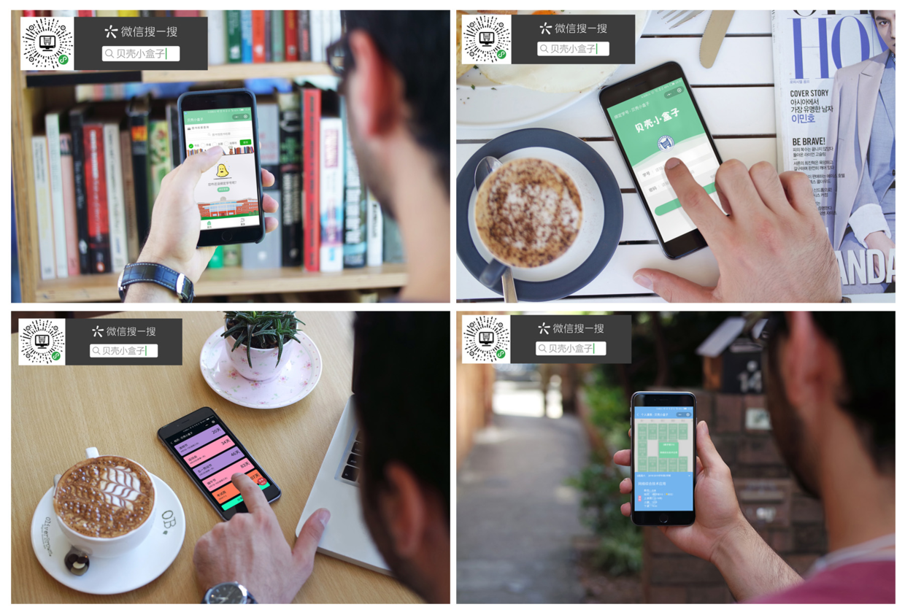
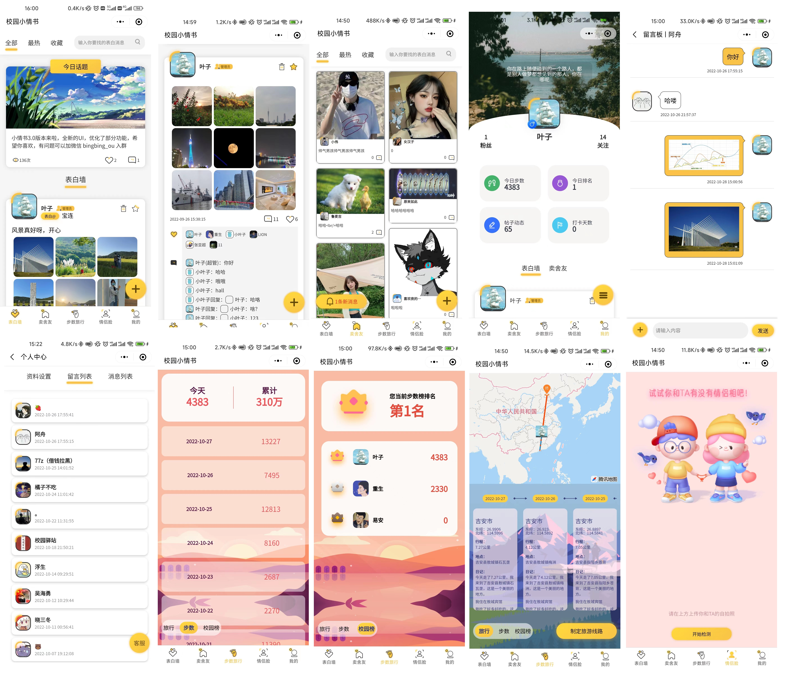
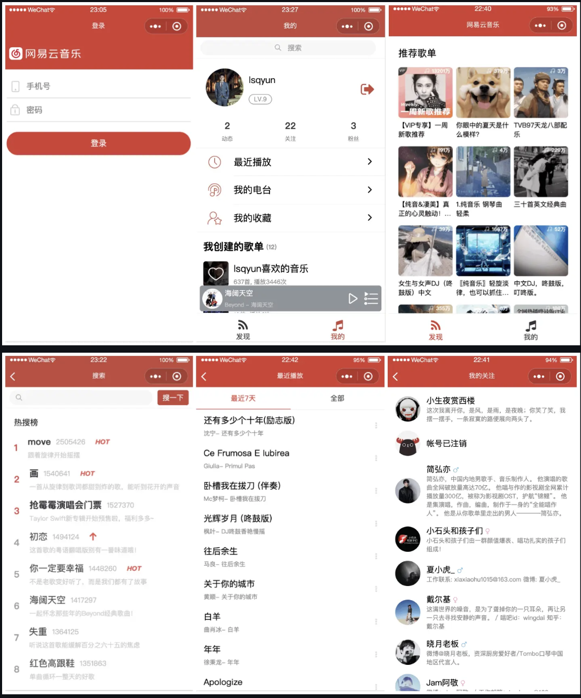
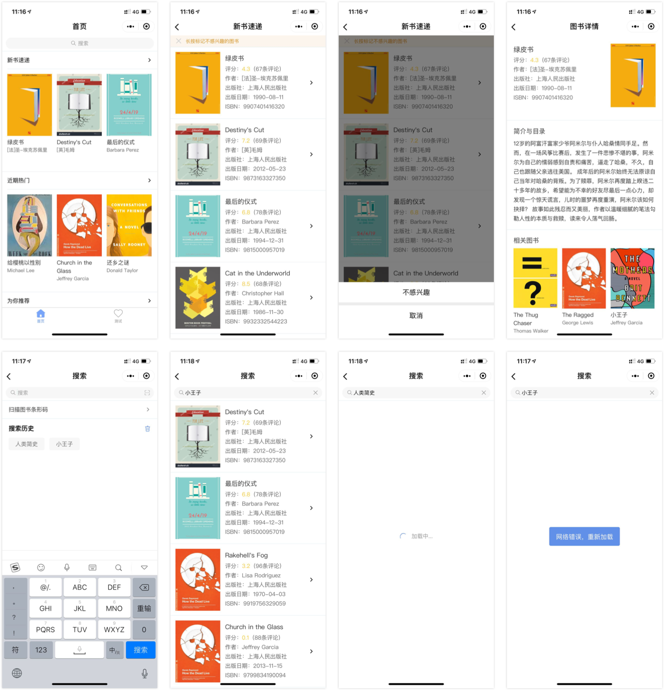
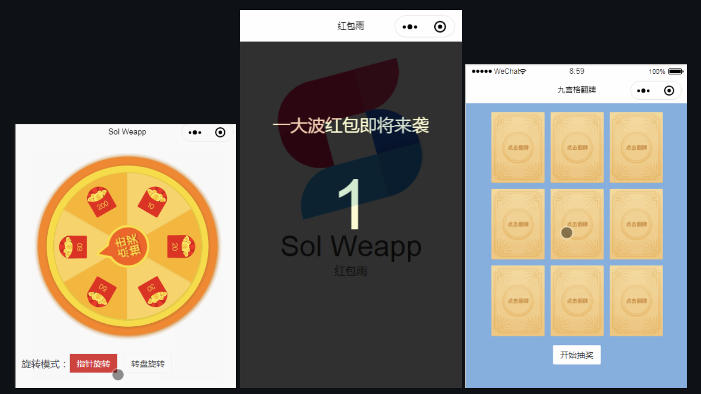
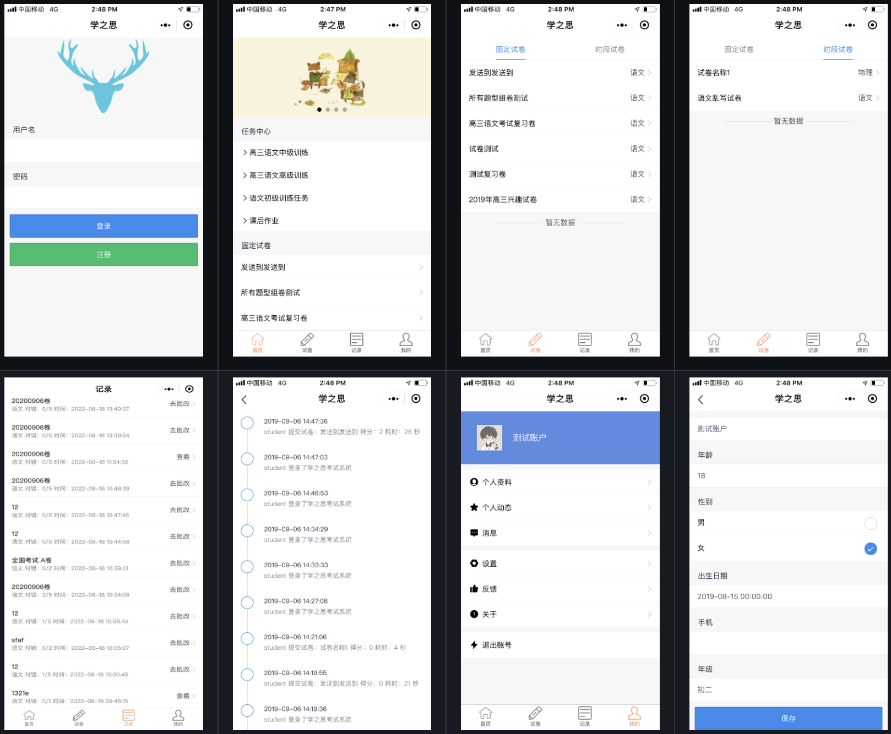

# 微信小程序项目2

## 贝壳小盒子
贝壳小盒子微信小程序，高校微信小程序，集课表查询、成绩查询、电费查询、图书查询等功能于一体。

**Github：**[https://github.com/Airmole/ShellBox](https://github.com/Airmole/ShellBox)

## 校园小情书
校园小情书微信小程序，通过了前端和后端完整代码。具有表白墙、树洞、校园论坛、步数旅行、漫画脸、情侣脸、今日话题等功能。

**Github：**[https://github.com/oubingbing/school_wechat](https://github.com/oubingbing/school_wechat)

## 租房平台
租房平台类微信小程序，基于Cloud Base（TCB）云开发，小程序端集成了管理后台。用户可以发布新房、二手房、租房等委托，中介机构审核发布、推荐，客户挑好房子后可以直接中介或者房源发布者，小程序带完整的管理员后台。

**Github：**[https://github.com/lx164/house](https://github.com/lx164/house)

## 仿网易云音乐
基于taro + taro-ui + redux + react-hooks + typescript 开发的网易云音乐小程序，taro3已升级完毕。项目支持用户登录、退出、关注列表、动态列表、粉丝列表、推荐歌单、推荐电台、歌词滚动、切换歌曲、喜欢音乐、搜索、视频播放等功能。

**Github：**[https://github.com/lsqy/taro-music](https://github.com/lsqy/taro-music)

## 在线借书平台
在线借书平台微信小程序：连接读者与图书馆的借书平台、读者的图书资料库与书单系统。30+ 页面，多个可复用组件，微信小程序开发入门。提供本地 mock server 解决方案。

除此之外，还提供了使用 Taro 重构后的版本，仅包含三个示例页面。面向人群主要是 Taro/React/Redux 的初学者，目的是提供一个简单的实践项目，帮助理解 Taro 与 Redux 的配合方式与 Taro 的基本使用。技术栈：Taro + Taro UI + Redux + Webpack + ES6 + Mock

**Github：**

+ **普通版：**[https://github.com/imageslr/weapp-library](https://github.com/imageslr/weapp-library)
+ **Taro版**：[https://github.com/imageslr/taro-library](https://github.com/imageslr/taro-library)

## 商城营销组件
一套简单、易用、业务化的商城营销组件库，让开发变得更简单。其提供了大转盘、红包雨、九宫格翻牌、老虎机、微信小程序分享(转发好友/分享图)、Tab 滚动导航、滚动数字等组件。

**Github：**[https://github.com/sunniejs/sol-weapp/](https://github.com/sunniejs/sol-weapp/)

## 在线考试系统
学之思开源考试系统是一款前后端分离的考试系统。主要优点是开发、部署简单快捷、界面设计友好、代码结构清晰。支持web端和微信小程序，能覆盖到pc机和手机等设备。 支持多种部署方式：集成部署、前后端分离部署、docker部署。

**Github：**[https://github.com/mindskip/xzs](https://github.com/mindskip/xzs)

## WeHalo博客
WeHalo 是配合 Halo 轻快，简洁，功能强大的博客系统而开发出来的简约风 微信小程序版博客。

**Github：**[https://github.com/savingrun/WeHalo](https://github.com/savingrun/WeHalo)

> 更新: 2023-01-25 17:29:42  
> 原文: <https://www.yuque.com/cuggz/feplus/py31cuvd5xm7xap5>