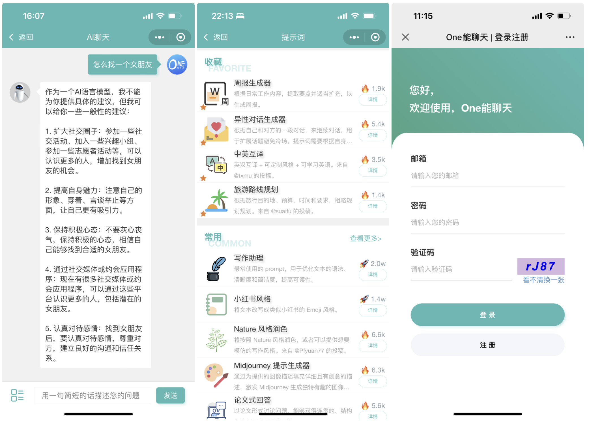
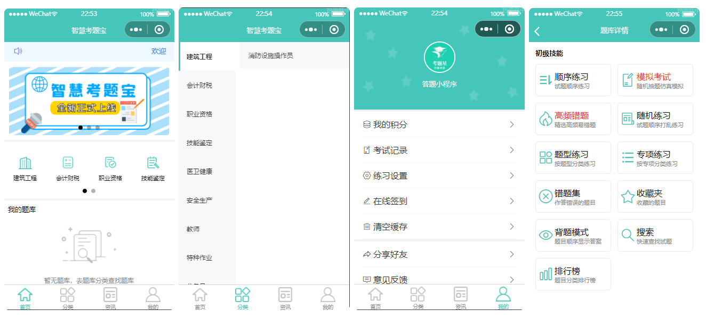
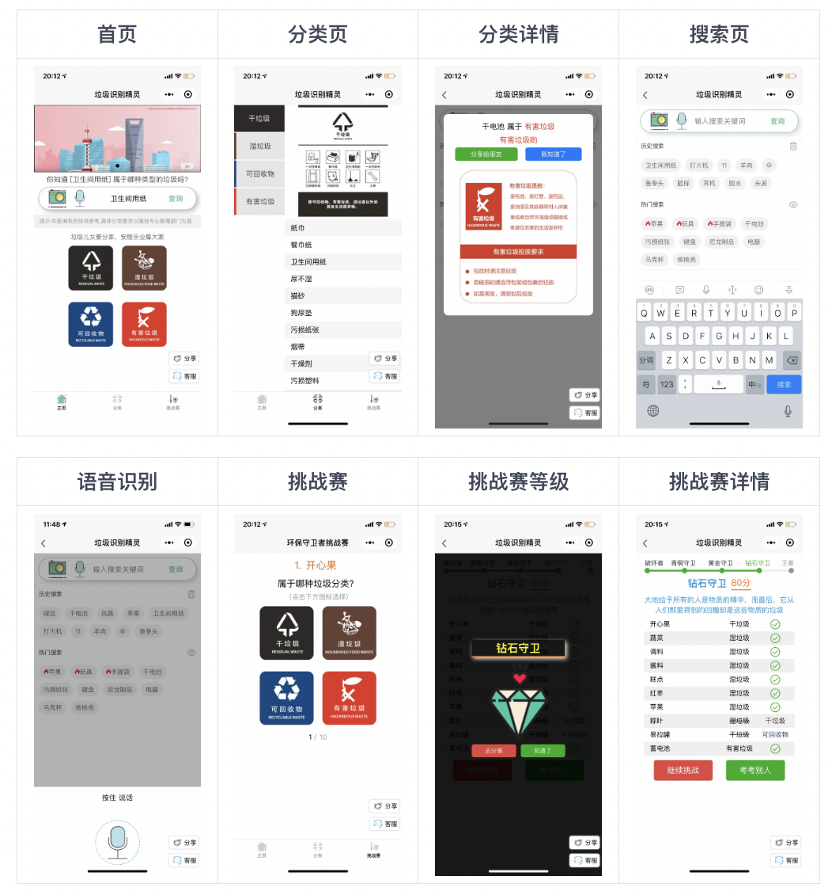
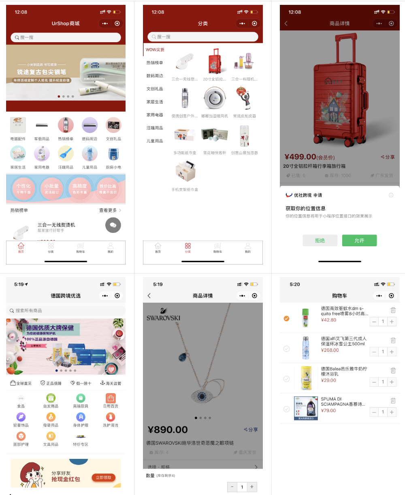
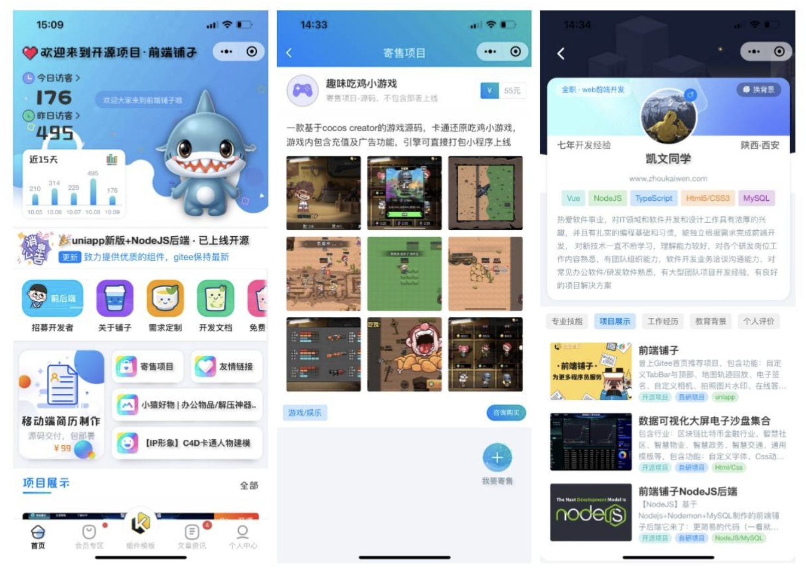
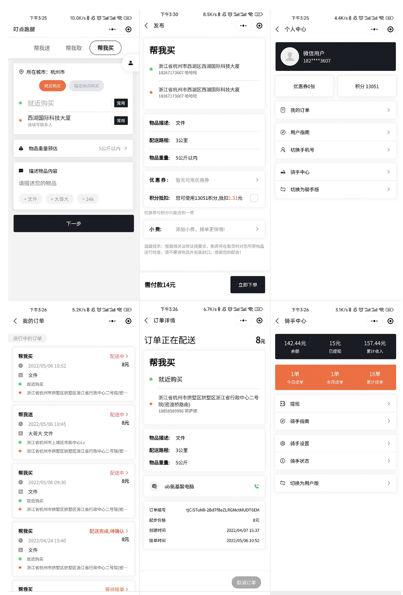
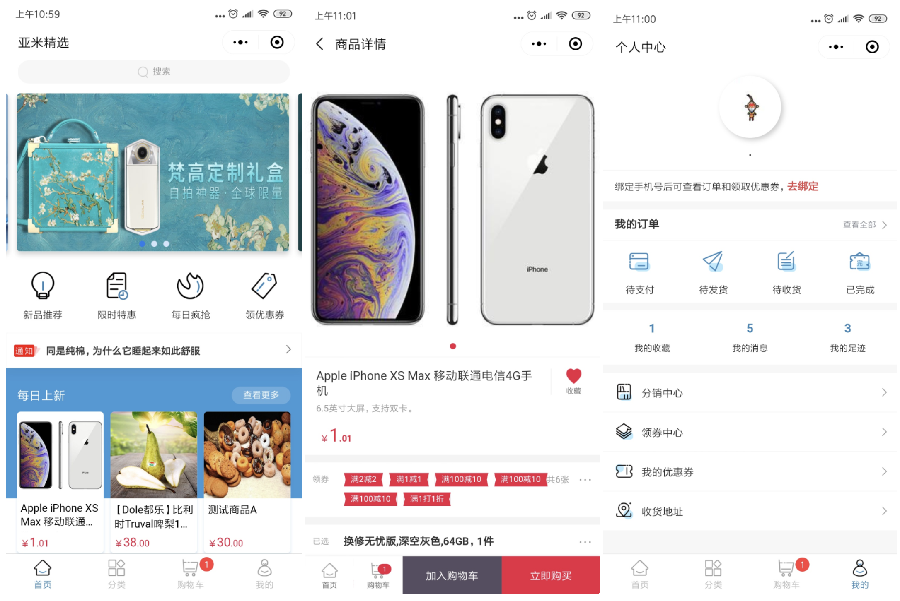
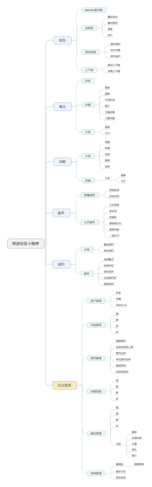

# 微信小程序项目3

## ChatGPT-MP
基于 ChatGPT 实现的微信小程序，适配 H5 和 Web 端。包含前后端，支持打字效果输出流式输出，支持AI聊天次数限制，支持分享增加次数等功能。

**Gitee：**[https://gitee.com/smalle/ChatGPT-MP](https://gitee.com/smalle/ChatGPT-MP)

## 答题小程序
智慧考题宝小程序适用于考核，评测等场景，功能包括：练习模式（顺序答题，随机答题，专项答题，题型答题，高频错题）、背题模式、模拟考试、错题集、收藏题集、搜索题目、排行榜、签到功能，资讯文章，答题设置，答题音效，积分功能，激活码功能，多级题库分类。

**Gitee：**[https://gitee.com/kesixin/QuestionWechatApp](https://gitee.com/kesixin/QuestionWechatApp)

## 垃圾识别精灵
垃圾识别精灵是一个基于 uni-app 开发得微信小程序，使用 SpringBoot2 搭建后端服务，使用 Swagger2 构建 Restful 接口文档，实现了文字查询、语音识别、图像识别其垃圾分类的功能。

**Gitee：**[https://gitee.com/aaluoxiang/GarbageSort](https://gitee.com/aaluoxiang/GarbageSort)

## UrShop
UrShop小程序商城基于原生微信小程序 + NetCore 技术构建 ，项目包含 多店铺商城，三级分销，微信小程序，管理后台，物流配送，优惠券，积分，促销，插件管理等功能。

**Gitee：**[https://gitee.com/urselect/urshop](https://gitee.com/urselect/urshop)

## 智慧党建管理系统
一套集学习手册、党员风采、内容管理等功能为一体的万岳智慧党建系统，满足用户对于组织学习、党建参阅、党员管理等多种活动的场景需求。

**Gitee：**[https://gitee.com/WanYueKeJi/wanyue_dangjian](https://gitee.com/WanYueKeJi/wanyue_dangjian)

## 前端铺子
项目基于 Vue，使用 colorUi 与 uView，完美支持微信小程序，包含功能：聊天室、自定义底部与顶部、地图轨迹回放、电子签名、图片/海报编辑器、自定义相机/键盘、拍照图片水印、智能抠图、照片墙、在线答题、证件识别、周边定位查询、文档预览、各种图表、行政区域、海报生成器、视频播放、主题切换、时间轴、瀑布流、排行榜、课程表、渐变、加载动画、请求封装等 

**Gitee：**[https://gitee.com/kevin_chou/qdpz](https://gitee.com/kevin_chou/qdpz)

## 叮点跑腿
本项目后端采用 midway3.0，后台采用 nuxt2.x,小程序采用 uniapp 实现的一套跑腿下单接单系统。主要功能包括帮送服务、帮买服务、骑手注册、骑手接单、用户下单、提现、订单分配系统、优惠券、物品重量计算、距离计算等。

**Gitee：**[https://gitee.com/landalfyao/ddrun](https://gitee.com/landalfyao/ddrun)

## BookChatApp
通用书籍阅读APP，使用 uni-app 实现，支持多端分发，编译生成Android和iOS 手机APP以及各平台的小程序。注册、登录、搜索、书架、书签、阅读偏好设置等功能齐全。

**Gitee：**[https://gitee.com/truthhun/BookChatApp](https://gitee.com/truthhun/BookChatApp)

## Mall4j商城
一个基于Vue、element ui 的轻量级、前后端分离、拥有完整 sku和下单流程的开源商城的小程序端。mall4j商城项目致力于为中小企业打造一个完整、易于维护的开源的电商系统，采用现阶段流行技术实现。

**Gitee：**[https://gitee.com/gz-yami/mall4m](https://gitee.com/gz-yami/mall4m)

## 旅游景区门户
一个为游客朋友提供多元化服务的一站式数字文旅平台，提供“吃、住、游、购、娱”等旅游行程中的多种服务，全面支持景区介绍，景点攻略，景点预约，停车预约、景区导览等功能，游客可以在小程序中了解旅游度假区的景点信息、历史文化、各类活动等。

**Gitee：**[https://gitee.com/voice-of-xiaozhuang/WeTravel](https://gitee.com/voice-of-xiaozhuang/WeTravel)

> 更新: 2023-07-17 16:02:31  
> 原文: <https://www.yuque.com/cuggz/feplus/gfpmo07bn5nqbh9m>