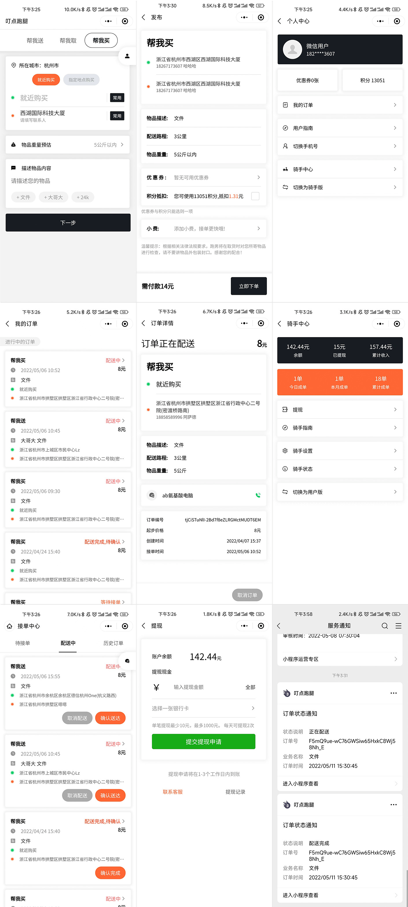
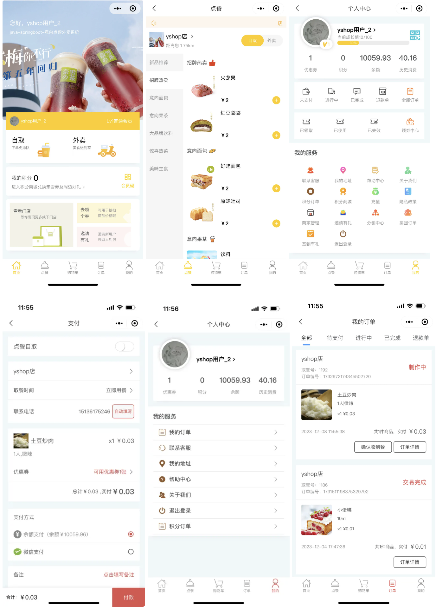
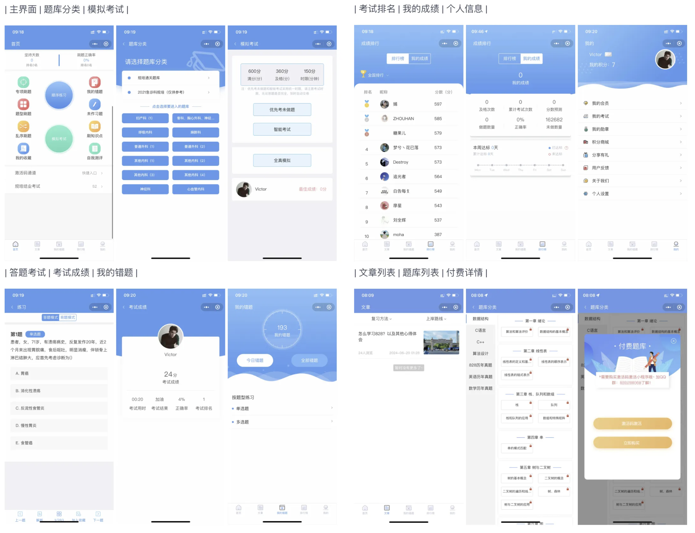
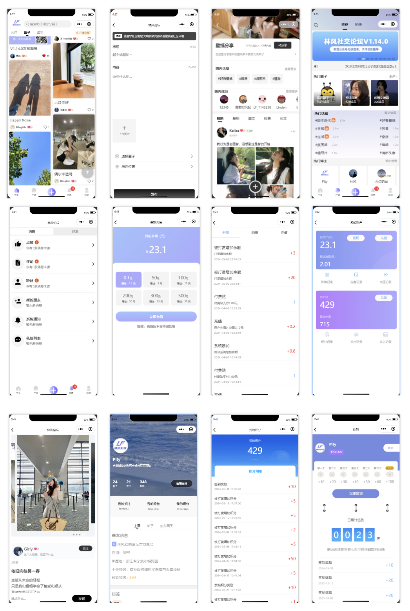

# 微信小程序项目4

## 跑腿
叮点跑腿是一套跑腿下单接单系统，其主要功能包括帮送服务、帮买服务、骑手注册、骑手接单、用户下单、提现、订单分配系统、优惠券、物品重量计算、距离计算等。项目后端采用 Midway，小程序采用 uniapp ，后台采用 Nuxt。

源码：[https://gitee.com/landalfyao/ddrun](https://gitee.com/landalfyao/ddrun)

## 点餐
意象点餐是一个在线点餐小程序，支持多门店模式，SaaS 多租户模式。使用到的技术栈包括：SpringBoot3、OAuth2、Vue 3、uniapp、Redis 等。

源码：[https://gitee.com/guchengwuyue/yshop-drink](https://gitee.com/guchengwuyue/yshop-drink)

## 考试
一个多功能的在线考试和培训小程序，适用于职业培训、考试刷题及企业内部考核等场景。项目支持会员体系，会员可以按折扣购买题库，支持题库在线支付购买；支持学员体系，学员可以无偿使用特定内部题库，支持题库激活码解锁。

源码：[https://gitee.com/wulivicor/exam](https://gitee.com/wulivicor/exam)

## 物业
一整套开源智慧物业解决方案，基于Node.js、TypeScript、Koa、Vue 开发，包含Web中台、业主小程序、员工小程序、公众号、物联网应用等，涵盖业主服务、物业运营、智能物联、数据统计等主要业务。

源码：[https://gitee.com/chowa/ejyy](https://gitee.com/chowa/ejyy)

## 铺子
一个常用小程序功能的集合，基于 Vue 实现，使用 colorUi 与 uView，完美支持微信小程序，包含功能：聊天室、金融量化、抽奖、地图轨迹回放、电子签名、图片/海报编辑器、自定义相机/键盘、拍照图片水印、智能抠图、照片墙、在线答题、证件识别、周边定位查询、文档预览、各种图表、行政区域、海报生成器、视频播放、主题切换、时间轴、瀑布流、排行榜、课程表、简历、商城、登录页、加载动画、请求封装等。

源码：[https://gitee.com/kevin_chou/qdpz](https://gitee.com/kevin_chou/qdpz)

## 论坛
一个基于SpringBoot，MybatisPlus，Shiro，Quartz，jwt，Websocket，Redis，Vue，Uniapp 的前后端分离的社交论坛问答发帖/BBS，SNS项目。其功能包括：图文帖，长文贴，短视频，圈子，私聊，微信支付（小程序/H5/app），付费贴，积分签到，钱包充值，积分余额兑换，话题标签，抽奖大转盘，手机号邮箱登录，虚拟用户发帖，举报，第三方广告，会员模块，即时通讯IM ，好友模块，投票，打赏，用户经验等级等。

源码：[https://gitee.com/virus010101/linfeng-community](https://gitee.com/virus010101/linfeng-community)

> 更新: 2024-08-29 16:20:23  
> 原文: <https://www.yuque.com/cuggz/feplus/qblog02ec1xsvgty>