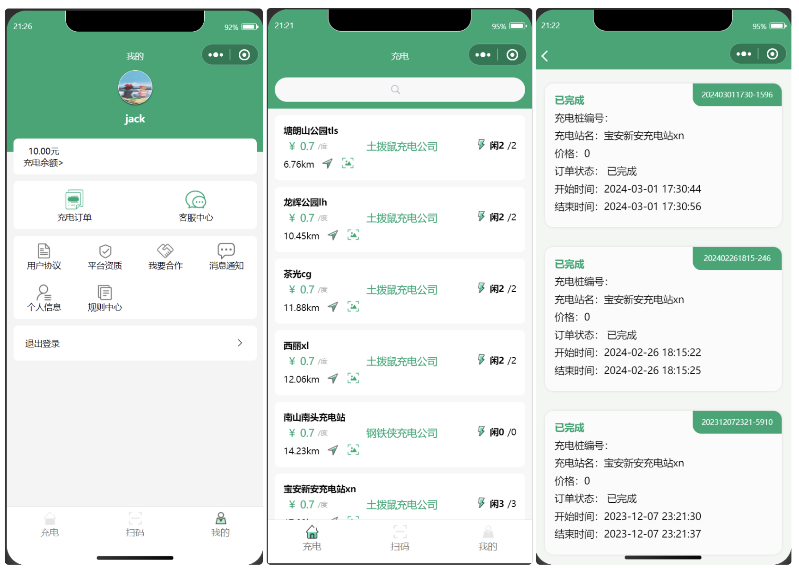
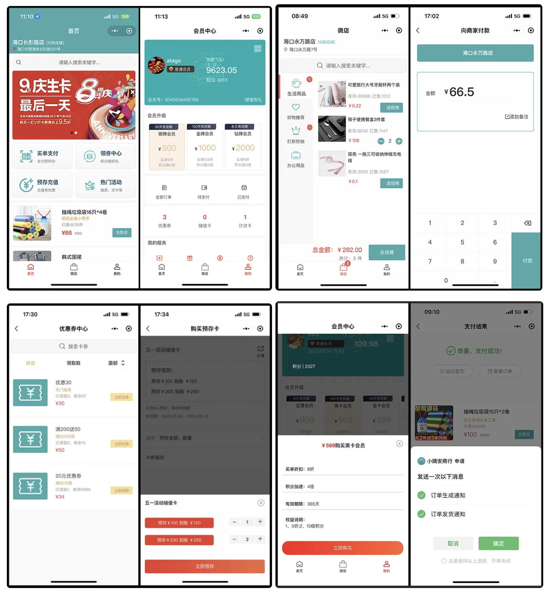
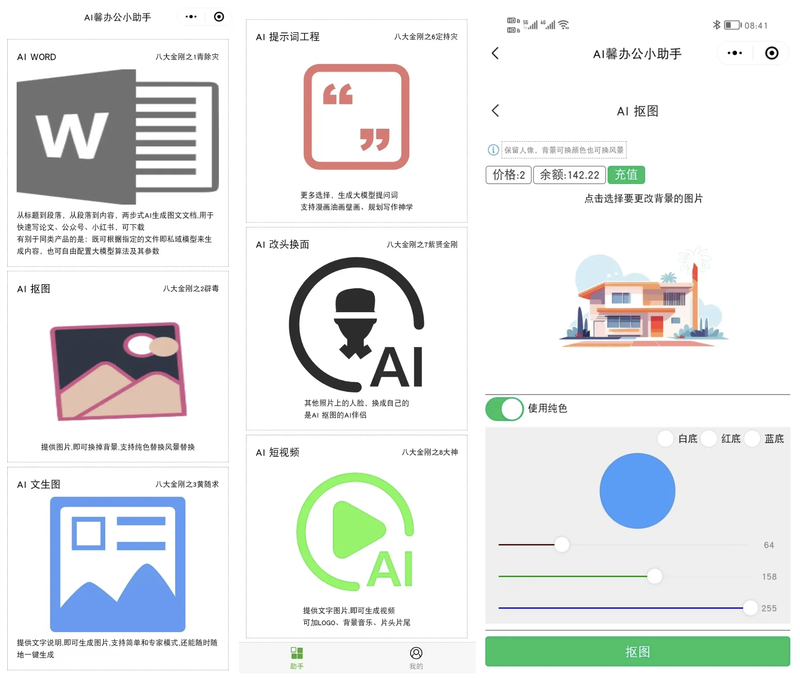
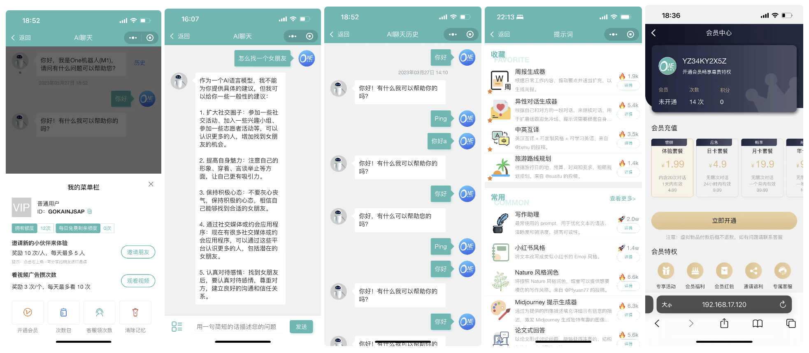
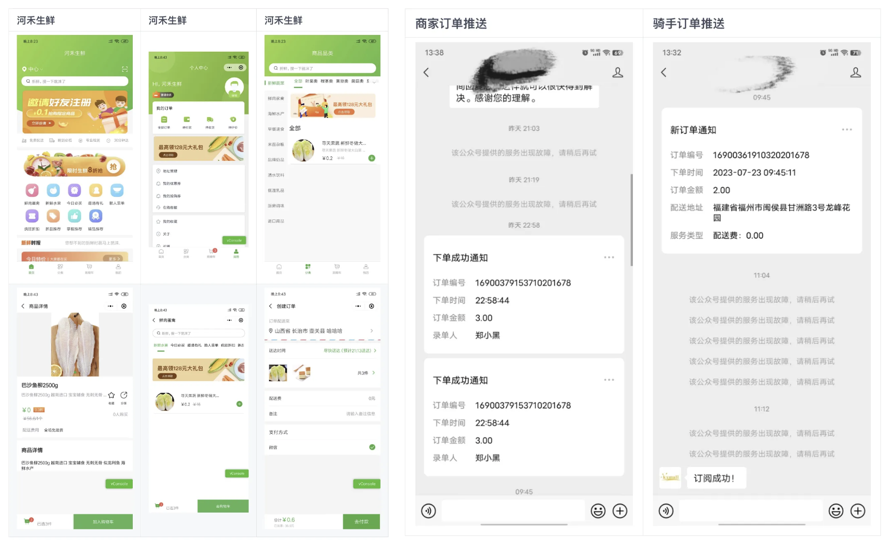

# 微信小程序项目5

## 充电桩
一套包含鸿蒙、微信小程序、云平台充电设备管理系统。 鸿蒙App使用HarmonyOS 4.0开发，小程序使用uniapp开发；功能涉及：登录、注册、查找充电站和充电站、在线充电、订单查询、个人中心等云平台使用。

**源码：**[https://github.com/cheinlu/HarmonyOS-groundhog-charging-system](https://github.com/cheinlu/HarmonyOS-groundhog-charging-system)

## 会员营销
fuint会员营销系统是一套开源的实体店铺会员管理和营销系统。前端基于 **Uniapp**，**Element UI**，支持小程序、h5。主要功能包含电子优惠券、储值卡、实体卡、计次卡、短信发送、储值卡、会员积分、会员等级权益体系，支付收款等会员日常营销工具。本系统适用于各类实体店铺，如零售超市、酒吧、酒店、汽车4S店、鲜花店、奶茶店、甜品店、餐饮店、农家乐等，是实体店铺会员营销必备的一款利器。

**源码：**[https://gitee.com/fuint/fuint-uniapp](https://gitee.com/fuint/fuint-uniapp)

## AI 办公
一个 AI 办公小程序，支持 AI 视频、AI 换脸、AI 机器人、AI 文生图、AI 话画、AI 私域、AI 图片识字、AI 抠图、AI 提示词工程、AI PPT、AI WORD、AI 招聘。

**源码**： [https://gitee.com/rocy_wang/aioffice](https://gitee.com/rocy_wang/aioffice)

## ChatGPT-MP
基于 ChatGPT 实现的微信小程序，包含前后台，支持打字效果输出流式输出，支持AI聊天次数限制，支持分享增加次数等功能。

**源码**：[https://gitee.com/smalle/ChatGPT-MP](https://gitee.com/smalle/ChatGPT-MP)

## 生鲜商城
kxmall 生鲜商城使用 uniapp 开发，可同时编译到微信小程序、H5、Android App、iOS App 等多个平台。

**源码：**[https://gitee.com/zhengkaixing/kxmall](https://gitee.com/zhengkaixing/kxmall)

> 更新: 2024-11-30 15:23:07  
> 原文: <https://www.yuque.com/cuggz/feplus/igko709cg3u2cewt>