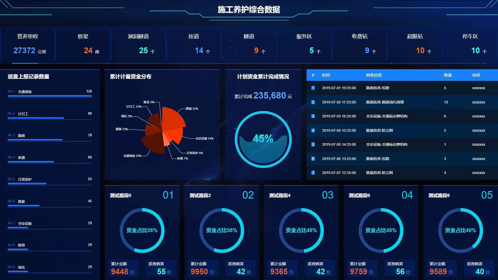
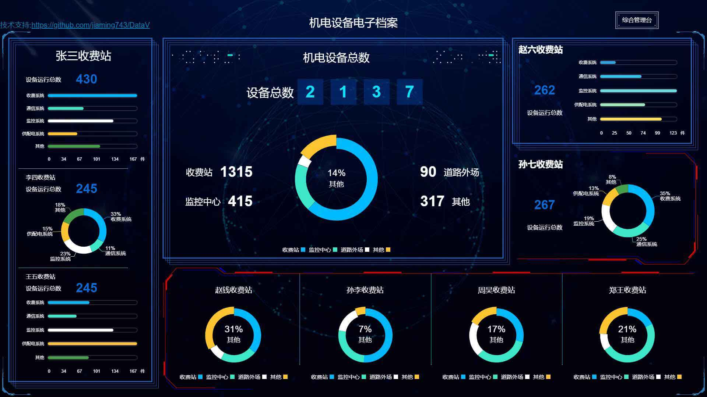
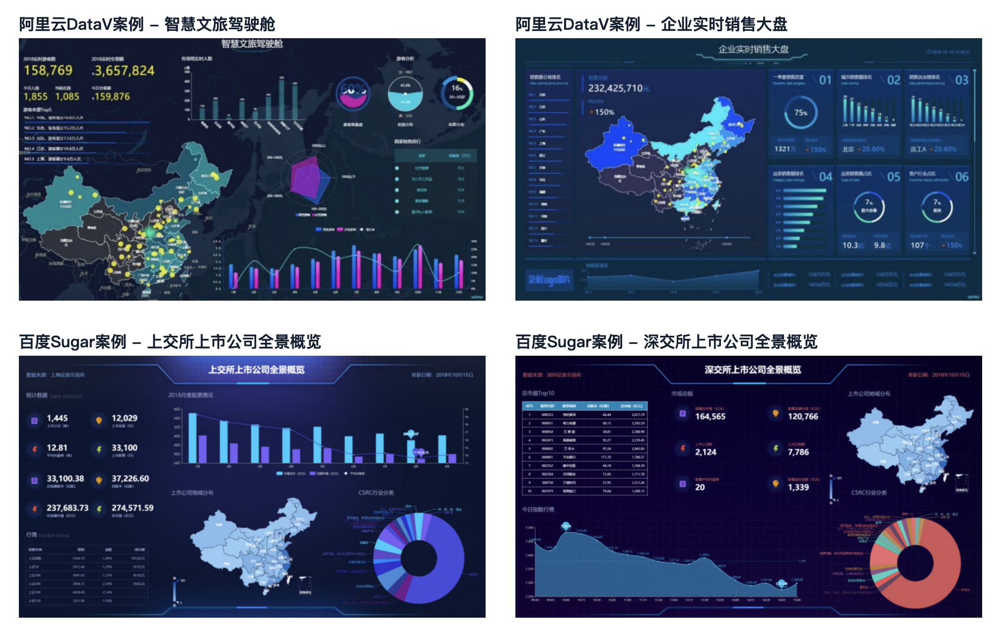
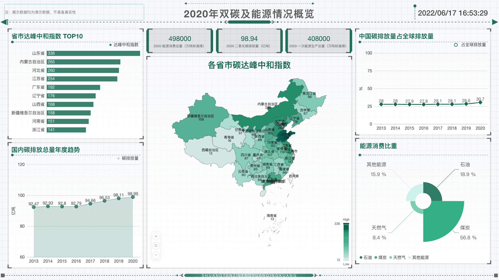
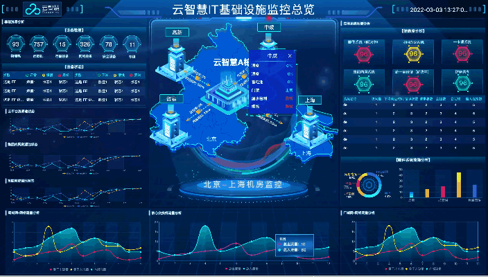
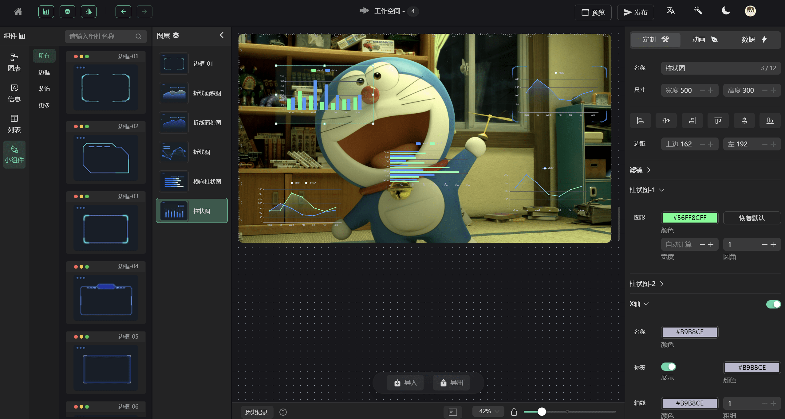
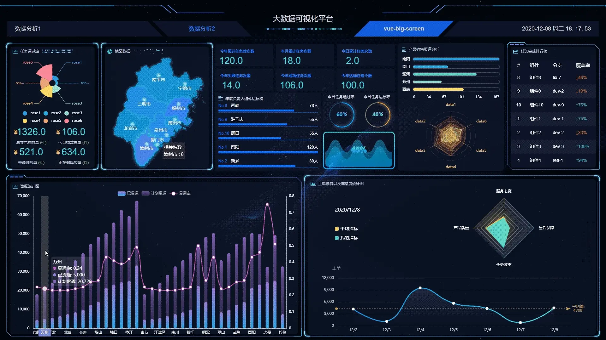
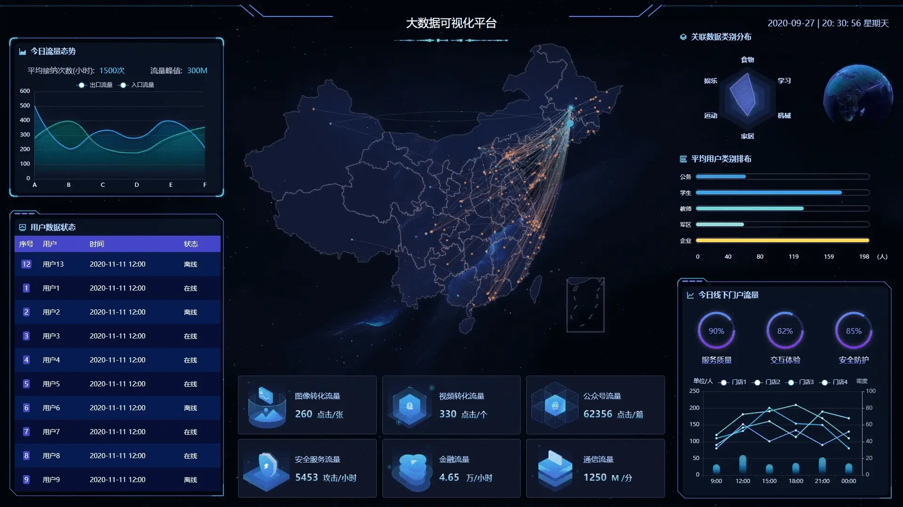

# 数据可视化大屏项目

## DataV
DataV是一个基于Vue的数据可视化组件库，Vue数据可视化组件库（类似阿里DataV，大屏数据展示），提供SVG的边框及装饰、图表、水位图、飞线图等组件，简单易用，长期更新。

**Github**：[https://github.com/DataV-Team/DataV](https://github.com/DataV-Team/DataV)

## DataV-React
DataV-React 是一个基于**React**的数据可视化组件库(类似阿里DataV，大屏数据展示），提供SVG的边框及装饰、图表、水位图、飞线图等组件，简单易用，长期更新。

**Github**：[https://github.com/DataV-Team/DataV-React](https://github.com/DataV-Team/DataV-React)

## iDataV
大屏数据可视化案例。包含了很多现成的模板，可在这些不同风格的模板基础上快速开始一个可视化大屏项目。

**Github**：[https://github.com/yyhsong/iDataV](https://github.com/yyhsong/iDataV)

## DataEase
DataEase 是开源的数据可视化分析工具，帮助用户快速分析数据并洞察业务趋势，从而实现业务的改进与优化。DataEase 支持丰富的数据源连接，能够通过拖拉拽方式快速制作图表，并可以方便的与他人分享。

**Github**：[https://github.com/dataease/dataease](https://github.com/dataease/dataease)

## FlyFish
飞鱼（FlyFish）是一个数据可视化编码平台。通过简易的方式快速创建数据模型，通过拖拉拽的形式，快速生成一套数据可视化解决方案。

**Github**：[https://github.com/CloudWise-OpenSource/FlyFish](https://github.com/CloudWise-OpenSource/FlyFish)

## GoView
GoView 是一个高效的拖拽式低代码数据可视化开发平台，将图表或页面元素封装为基础组件，无需编写代码即可制作数据大屏，减少心智负担。

**Gitee**：[https://gitee.com/MTrun/go-view](https://gitee.com/MTrun/go-view)

## vue-big-screen
一个基于 Vue、Datav、Echart 框架的 " **数据大屏项目** "，通过 Vue 组件实现数据动态刷新渲染，内部图表可实现自由替换。部分图表使用 DataV 自带组件，可进行更改，

**Gitee：**[https://gitee.com/MTrun/big-screen-vue-datav](https://gitee.com/MTrun/big-screen-vue-datav)

## react-big-screen
一个基于 React、Dva、DataV、ECharts 框架的 " **数据大屏项目** "。支持数据动态刷新渲染、屏幕适配、数据请求模拟、局部样式、图表自由替换/复用等功能。

**Gitee：**[https://gitee.com/MTrun/react-big-screen](https://gitee.com/MTrun/react-big-screen)

> 更新: 2022-08-17 02:23:37  
> 原文: <https://www.yuque.com/cuggz/feplus/nzh3n6>