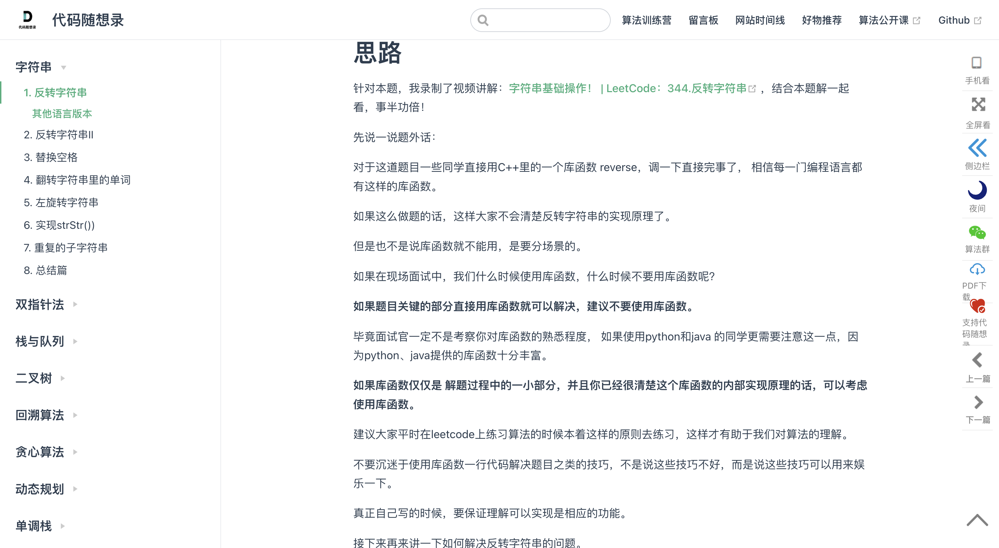
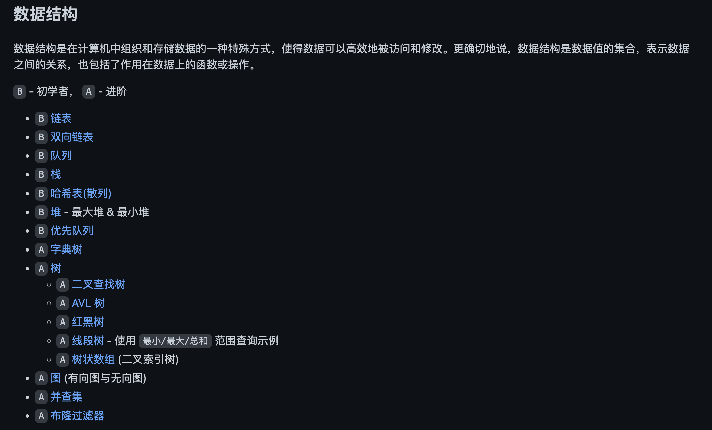
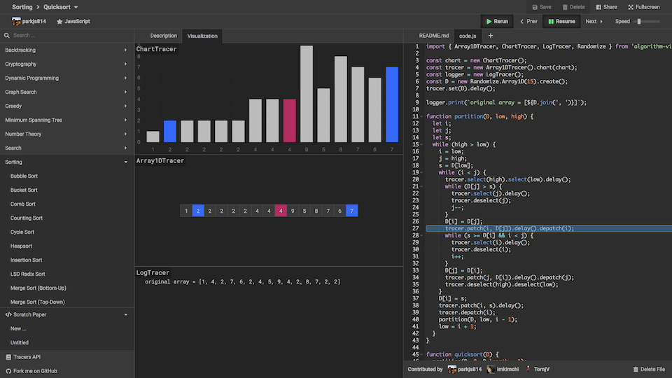
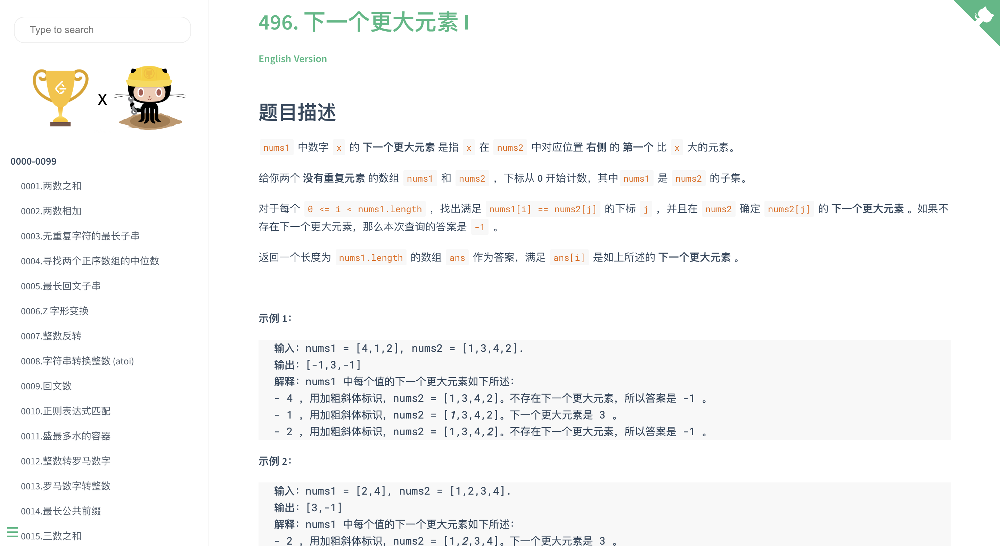
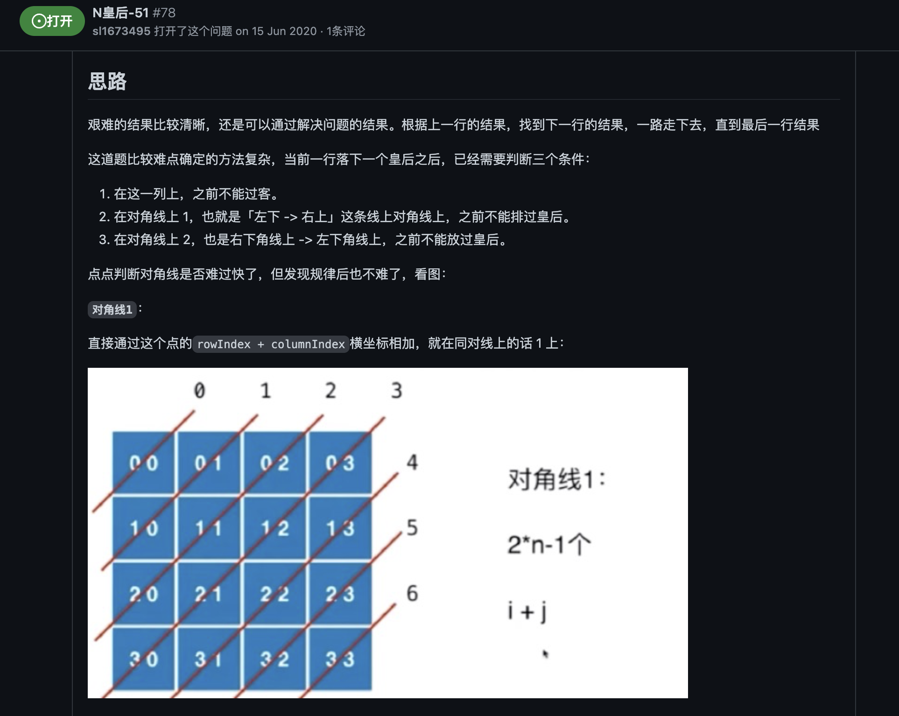
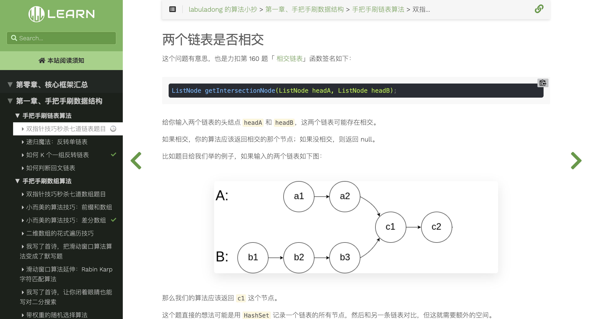
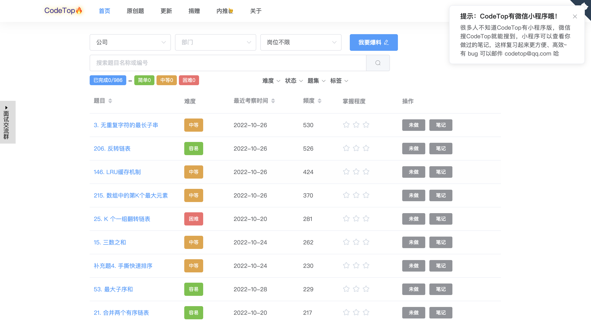

# 数据结构与算法

## LeetCode Master
代码随想题录，LeetCode刷题攻略，200道经典刷题顺序，共60w字的详细指导图解，视频难点剖析，50余张思维图，支持C++，Java，Python，Go，JavaScript等多语言版本。

**Github（****⭐****️32.8k）：**[https://github.com/youngyangyang04/leetcode-master](https://github.com/youngyangyang04/leetcode-master)

## JavaScript 算法和数据结构
Github 上最火的 JavaScript 描述的算法和数据结构项目，每种算法和数据结构都有自己的 README，包含相关说明和链接，提供了中文版本。

**Github（****⭐****️154k）：**[https://github.com/trekhleb/javascript-algorithms](https://github.com/trekhleb/javascript-algorithms)

## Algorithm Visualizer
Algorithm Visualizer 是一个交互式在线平台，可以从代码中可视化算法。目前支持的算法包括回溯法、加密算法、动态规划、图搜索、贪婪算法、搜索算法、排序算法等。当选择算法时，中间就会动态演示执行过程，日志输出区记录每一步的执行结果。

**Github（****⭐****️39.3k）：**[https://github.com/algorithm-visualizer/algorithm-visualizer](https://github.com/algorithm-visualizer/algorithm-visualizer)

## Leetcode
本项目包含 LeetCode、《剑指 Offer（第 2 版）》、《剑指 Offer（专项突击版）》、《程序员面试金典（第 6 版）》等题目的相关题解。所有题解均由多种编程语言实现，包括但不限于：Java、Python、C++、Go、TypeScript、Rust。

**Github（****⭐****️32.8k）：**[https://github.com/doocs/leetcode](https://github.com/doocs/leetcode)

## LeetCode JavaScript
前端攻城狮从零入门算法的宝藏题库，根据知名算法老师的经验总结了 100+ 道 LeetCode 力扣的经典题型 JavaScript 题解和思路。

**Github（****⭐****️1.6k）：**[https://github.com/sl1673495/leetcode-javascript](https://github.com/sl1673495/leetcode-javascript)

## labuladong 的算法小抄

**Github（****⭐****️111k）：**[https://github.com/labuladong/fucking-algorithm](https://github.com/labuladong/fucking-algorithm)

## LeetcodeTop
codeTop 上汇总了各大互联网公司容易考察的高频 leetcode 题，支持按照公司、部门、岗位组合查询。

**Github（****⭐****️15.6k）：**[https://github.com/afatcoder/LeetcodeTop](https://github.com/afatcoder/LeetcodeTop)

> 更新: 2024-12-14 21:44:52  
> 原文: <https://www.yuque.com/cuggz/feplus/qmd9y3>