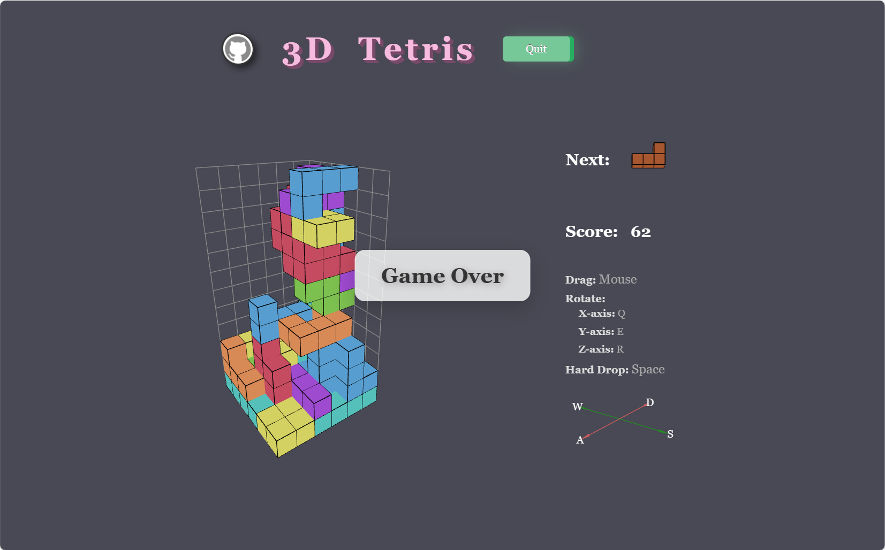
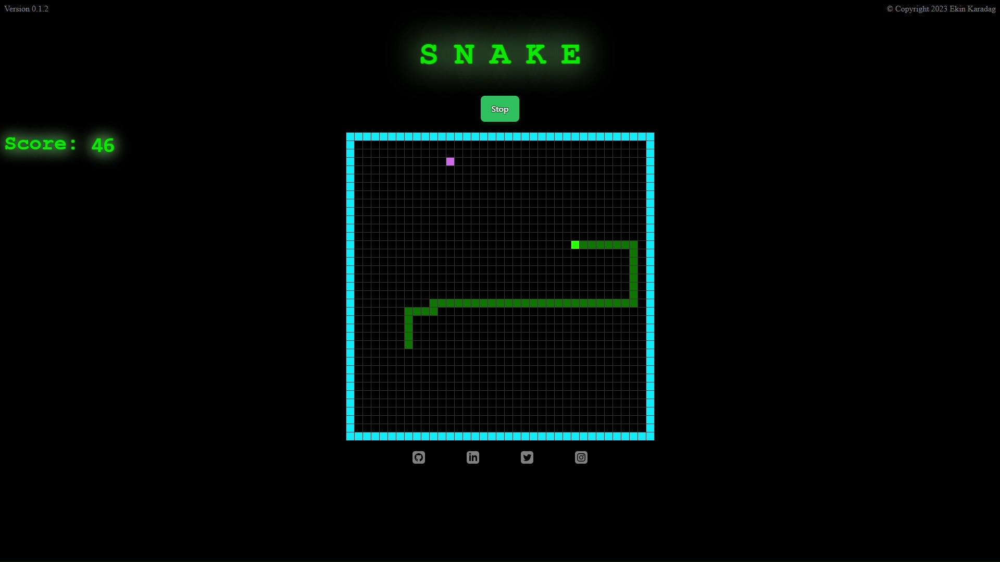
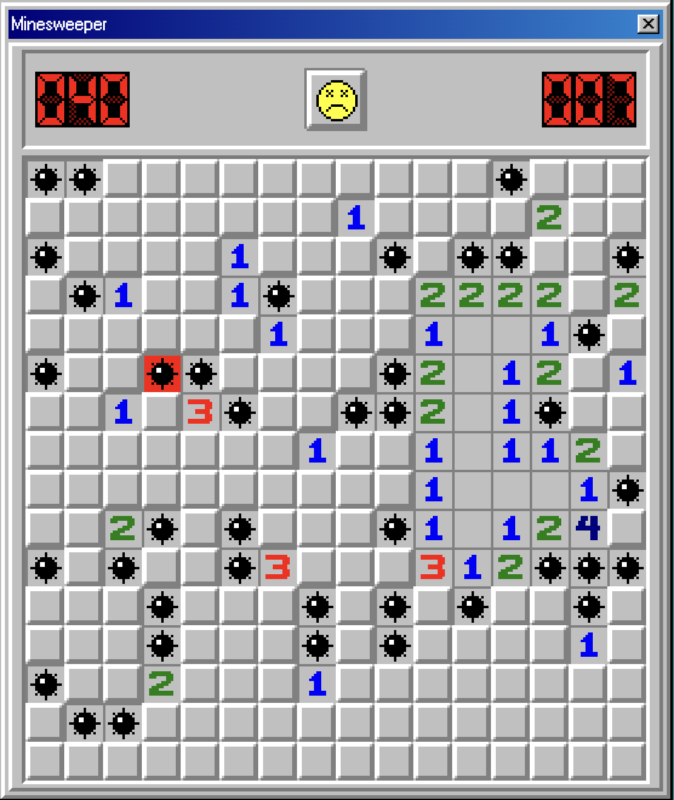
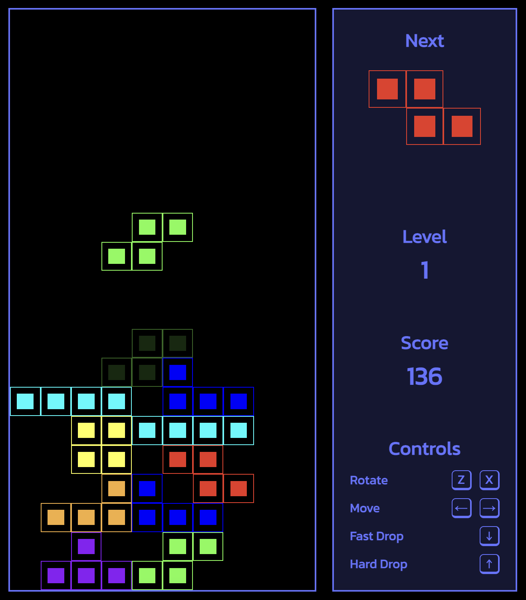
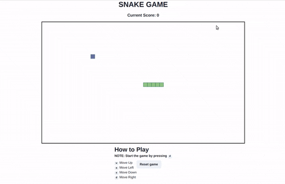
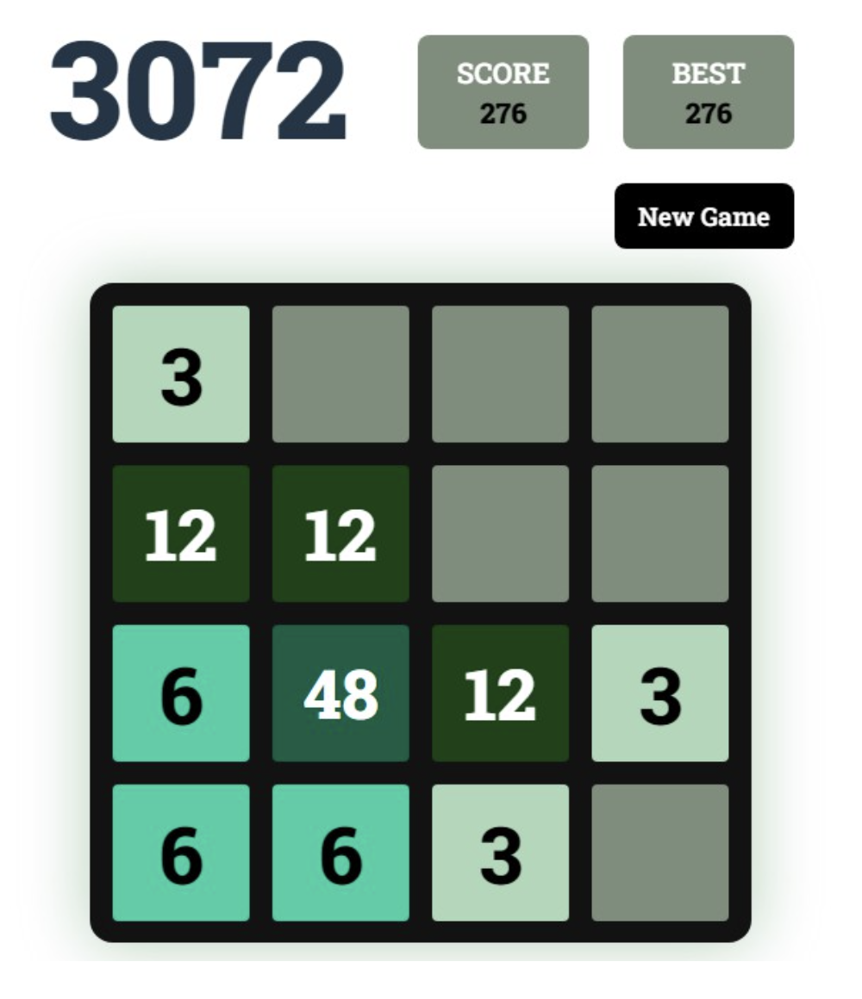
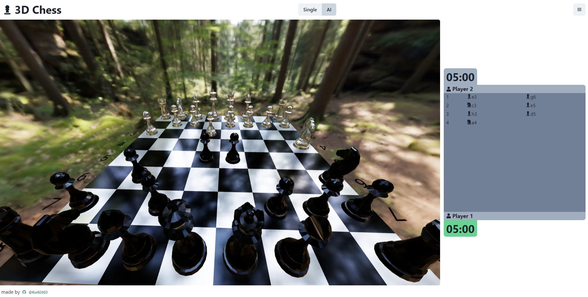

# 游戏项目

本文来分享 8 个基于 Vue/React 的小游戏，包括俄罗斯方块、贪吃蛇、扫雷、国际象棋等，个个经典！

## 3D俄罗斯方块
基于 Three.js、React、TypeScript 实现的 3D 俄罗斯方块游戏，可以拖动旋转页面进行观察。

**Github：**[https://github.com/RylanBot/threejs-tetris-react](https://github.com/RylanBot/threejs-tetris-react)

## 贪吃蛇
基于 Vue 3.3、Vite、Vuex 实现的经典贪吃蛇游戏。

**Github：**[https://github.com/ekinkaradag/snake-vue3](https://github.com/ekinkaradag/snake-vue3)

## 扫雷
一个扫雷游戏，作者尝试使用老式字体和经典的 Win98 图标，用 CSS 复制 Win98 的风格，使这个项目尽可能真实。该项目使用的技术栈包括：TypeScript、Webpack、React、Redux、React Router。

**Github：**[https://github.com/laoqiu233/minesweeper-react](https://github.com/laoqiu233/minesweeper-react)

## 俄罗斯方块
使用 React + Next + Typescript 开发的俄罗斯方块游戏。其功能包括：15个关卡、快速下落和硬下落、方块放置预览、音效和背景音乐、简化的得分系统等。

**Github：**[https://github.com/pablonm/react-tetris](https://github.com/pablonm/react-tetris)

## 贪吃蛇
使用 React 和 TypeScript 构建的简单 2D 蛇游戏。可以使用 w、a、s 和 d 键来移动蛇。当吃掉水果时，得分和蛇的长度会动态增加，使用 canvas 元素构建。其用到的技术包括：React、Chakra-UI、Redux、Redux-saga。

**Github：**[https://github.com/Aklilu-Mandefro/game-application-using-react-and-typescript](https://github.com/Aklilu-Mandefro/game-application-using-react-and-typescript)

## 3072
3072 是一款受流行游戏“2048”启发的数字合并游戏，但游戏玩法与2048截然不同，使用的是 3 的倍数而不是 2，这真的是一种非常深刻和令人振奋的用户体验改变。

这个项目使用 TypeScript、React 和 Tailwind CSS 构建，确保高性能的交互性和令人惊艳的响应式设计。当关闭游戏时，你的最高分不会丢失，会被本地存储在你的设备上，让你不断突破自己的极限。

**Github：**[https://github.com/WeiChongDevelops/3072](https://github.com/WeiChongDevelops/3072)

## 国际象棋
使用 React、Redux Toolkit、ThreeJS、React Three Fiber、ChessJS 和 ChakraUI 构建的经典国际象棋游戏。

**Github：**[https://github.com/Kirill2603/3d-chess-v2](https://github.com/Kirill2603/3d-chess-v2)

## 记忆翻牌
使用 Vue3.3、Pinia、Webpack、TypeScript 开发的一款记忆翻牌游戏。

**Github：**[https://github.com/LAxBANDA/frontend-concentration-or-memory](https://github.com/LAxBANDA/frontend-concentration-or-memory)

> 更新: 2024-01-09 16:55:11  
> 原文: <https://www.yuque.com/cuggz/feplus/zew3g43zgcn14geg>