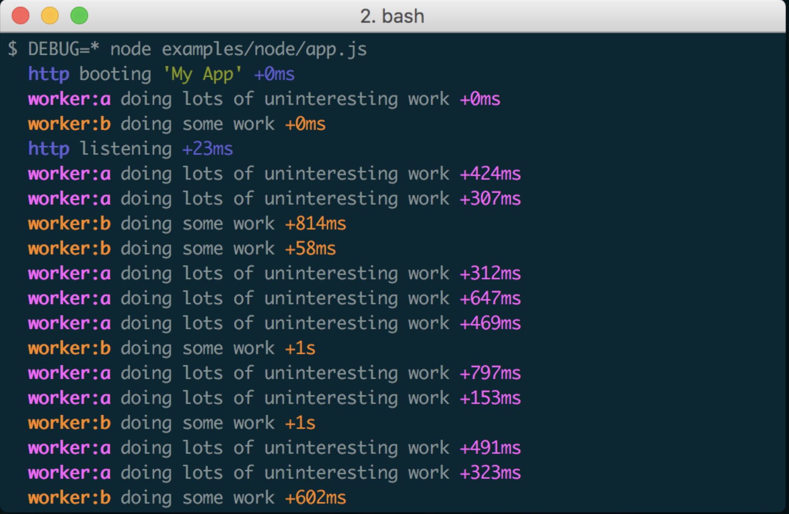
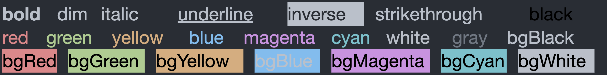
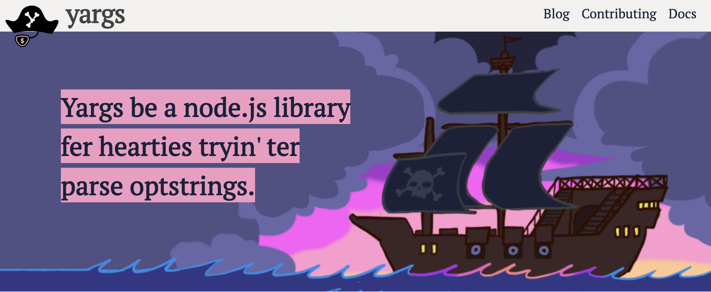
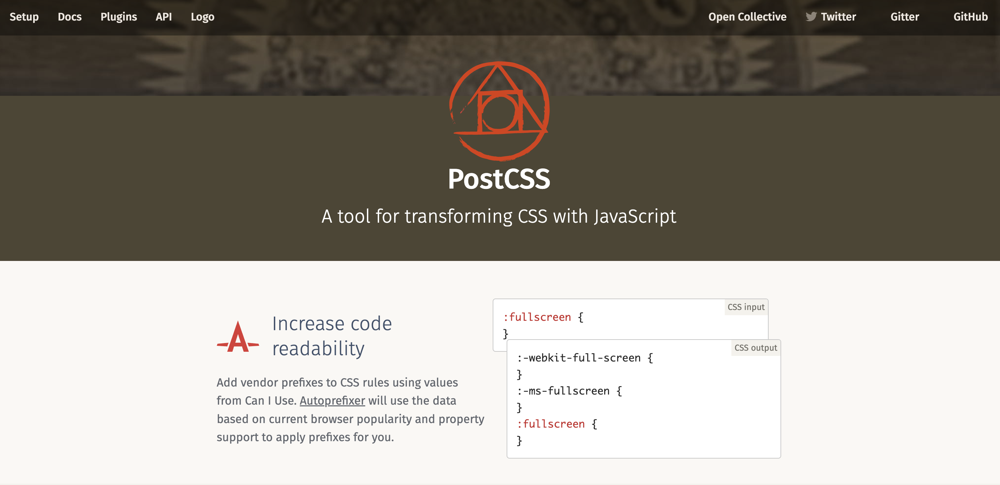

# 热门项目

## 1. debug

debug 是一个模仿 Node.js 核心调试技术的小型 JavaScript 调试实用程序。适用于 Node.js 和 Web 浏览器。

debug 每周下载量：**195,681,684**



**GitHub**：<https://github.com/debug-js/debug>

## 2. chalk

chalk 是一个终端字符串美化工具。默认 node 在输出终端的文字都是黑白的，为了使输出不再单调，就可以使用这个库来添加文字背景和字体颜色。

chalk 每周下载量：**180,736,619**

**GitHub：**<https://github.com/chalk/chalk>

## 3. ms

ms 是一个微小的毫秒转换实用程序，可以轻松地将各种时间格式转换为毫秒。

ms 每周下载量：**162,813,087**

```javascript
ms('2 days')  // 172800000
ms('1d')      // 86400000
ms('10h')     // 36000000
ms('2.5 hrs') // 9000000
ms('2h')      // 7200000
ms('1m')      // 60000
ms('5s')      // 5000
ms('1y')      // 31557600000
ms('100')     // 100
ms('-3 days') // -259200000
ms('-1h')     // -3600000
ms('-200')    // -200
```

**GitHub：**<https://github.com/vercel/ms>

## 4. strip-ansi

strip-ansi 用于从字符串中去掉 ANSI 转义码。

strip-ansi 每周下载量：**123,800,769**

```javascript
import stripAnsi from 'strip-ansi';

stripAnsi('\u001B[4mUnicorn\u001B[0m'); //=> 'Unicorn'

stripAnsi('\u001B]8;;https://github.com\u0007Click\u001B]8;;\u0007');  //=> 'Click'
```

**GitHub：**<https://github.com/chalk/strip-ansi>

## 5. Commander

Commander.js 是 Node.js 命令行接口的补全解决方案，灵感来源于 Ruby 的 commander。它使得命令行界面变得简单。

Commander 每周下载量：**90,841,947**

***

**GitHub：**<https://github.com/tj/commander.js>

## 6. yargs

Yargs 框架通过使用 Node.js 构建功能全面的命令行应用，它能轻松配置命令，解析多个参数，并设置快捷方式等，还能自动生成帮助菜单。

yargs 每周下载量：**79,505,865**



**GitHub：**<https://github.com/yargs/yargs>

## 7. uuid

uuid 用于在 JavaScript 中生成符合 RFC4122 的 UUID。

uuid 每周下载量：**76,317,814**

```javascript
import { v4 as uuidv4 } from 'uuid';
uuidv4(); // ⇨ '9b1deb4d-3b7d-4bad-9bdd-2b0d7b3dcb6d'
```

**GitHub：**<https://github.com/uuidjs/uuid>

## 8. p-limit

p-limit 用于有限的并发运行多个 promise-returning & async 函数。

p-limit 每周下载量：**75,841,698**

```javascript
import pLimit from 'p-limit';

const limit = pLimit(1);

const input = [
	limit(() => fetchSomething('foo')),
	limit(() => fetchSomething('bar')),
	limit(() => doSomething())
];

// Only one promise is run at once
const result = await Promise.all(input);
console.log(result);
```

**GitHub：**<https://github.com/sindresorhus/p-limit>

## 9. Ajv

Ajv 是一个适用于 Node.js 和浏览器的最快 JSON 验证器。它支持 JSON Schema Draft-04/06/07/2019-09/2020-12 和 JSON 类型定义 (RFC8927)。

Ajv 每周下载量：**72,378,941**


**GitHub：**<https://github.com/ajv-validator/ajv>

## 10. yallist

yallist 是一个双向链表的实现。

yallist 每周下载量：**70,872,400**

***

**GitHub：**<https://github.com/isaacs/yallist>

## 11. postcss

PostCSS 是一个允许使用插件转换样式的插件。这些可以检查（lint）你的 CSS，支持 CSS 变量和 Mixins，编译尚未被浏览器广泛支持的先进的 CSS 语法，内联图片，以及其他许多优秀的工具的功能。

postcss 每周下载量：**67,390,371**



**GitHub：**<https://github.com/postcss/postcss>

## 12. rimraf

rimraf 是 Node.js 的 rm -rf 实用程序。以包的形式包装rm -rf命令，用来删除文件和文件夹，不管文件夹是否为空，都可以删除。

rimraf 每周下载量：**67,101,067**

***

**GitHub：**<https://github.com/isaacs/rimraf>

## 13. emoji-regex

emoji-regex 提供了一个正则表达式来匹配所有 emoji 符号和序列（包括 emoji 的文本表示），符合 Unicode 标准。 它基于 emoji-test-regex-pattern，它生成（在构建时）基于 Unicode 标准的正则表达式模式。 因此，只要将新的表情符号添加到 Unicode 中，就可以轻松更新 emoji-regex。

emoji-regex 每周下载量：**61,794,047**

***

**GitHub：**<https://github.com/mathiasbynens/emoji-regex>

## 14. mkdirp

**mkdirp** 可以在Node.js中像 `mkdir -p` 一样递归创建目录及其子目录。

mkdirp 每周下载量：**61,036,270**

***

**GitHub：**<https://github.com/isaacs/node-mkdirp>

## 15. ws

ws 是一个简单易用、速度极快且经过全面测试的 WebSocket 客户端和服务器实现。

ws 每周下载量：**59,114,745**

***

**GitHub：**<https://github.com/websockets/ws>

## 16. async

Async 是一个实用模块，它为使用异步 JavaScript 提供了直接、强大的功能。虽然最初设计用于Node.js，但是它也可以直接在浏览器中使用。

async 每周下载量：**56,387,506**


**GitHub：**<https://github.com/caolan/async>

## 17. minimist

minimist 是一个用来解析命令行选项的库。

minimist 每周下载量：**51,722,555**

***

**GitHub：**<https://github.com/substack/minimist>

## 18. **js-yaml**

js-yaml 是一个用于 JavaScript 的 YAML 1.2 解析器/编写器。这是YAML的一个实现，一种对人类友好的数据序列化语言。从PyYAML端口开始，它完全从头开始重写。现在它非常快，并且支持 1.2 规范。

js-yaml\*\* \*\*每周下载量：**51,863,321**

**GitHub：**<https://github.com/nodeca/js-yaml>

## 19. form-data

form-data 是一个用于<font style="color:rgb(51, 51, 51);">创建可读</font><font style="color:rgb(51, 51, 51);">"multipart/form-data"</font><font style="color:rgb(51, 51, 51);">流的库。可用于向其他 Web 应用程序提交表单和文件上传。</font>

<font style="color:rgb(51, 51, 51);"></font>

form-data 每周下载量：**<font style="color:rgba(0, 0, 0, 0.8);">50,307,183</font>**

**<font style="color:rgba(0, 0, 0, 0.8);"></font>**

**<font style="color:rgba(0, 0, 0, 0.8);">GitHub：</font>**<https://github.com/form-data/form-data>

## 20. <font style="color:rgb(17, 17, 17);">lodash</font>

<font style="color:rgb(51, 51, 51);">lodash 是一个 JavaScript 实用工具库，提供一致性，及模块化、性能和配件等功能。Lodash 消除了处理数组的麻烦，从而简化了 JavaScript、 数字、对象、字符串等。它的模块化方法非常适合：迭代数组，对象和字符串、操作和测试值、创建复合功能。</font>

<font style="color:rgb(51, 51, 51);"></font>

<font style="color:rgb(51, 51, 51);">Lodash 每周下载量：</font>**<font style="color:rgba(0, 0, 0, 0.8);">50,027,873</font>**


**<font style="color:rgba(0, 0, 0, 0.8);">GitHub：</font>**<https://github.com/lodash/lodash>


> 更新: 2022-08-11 23:35:23  
> 原文: <https://www.yuque.com/cuggz/feplus/hemcog>