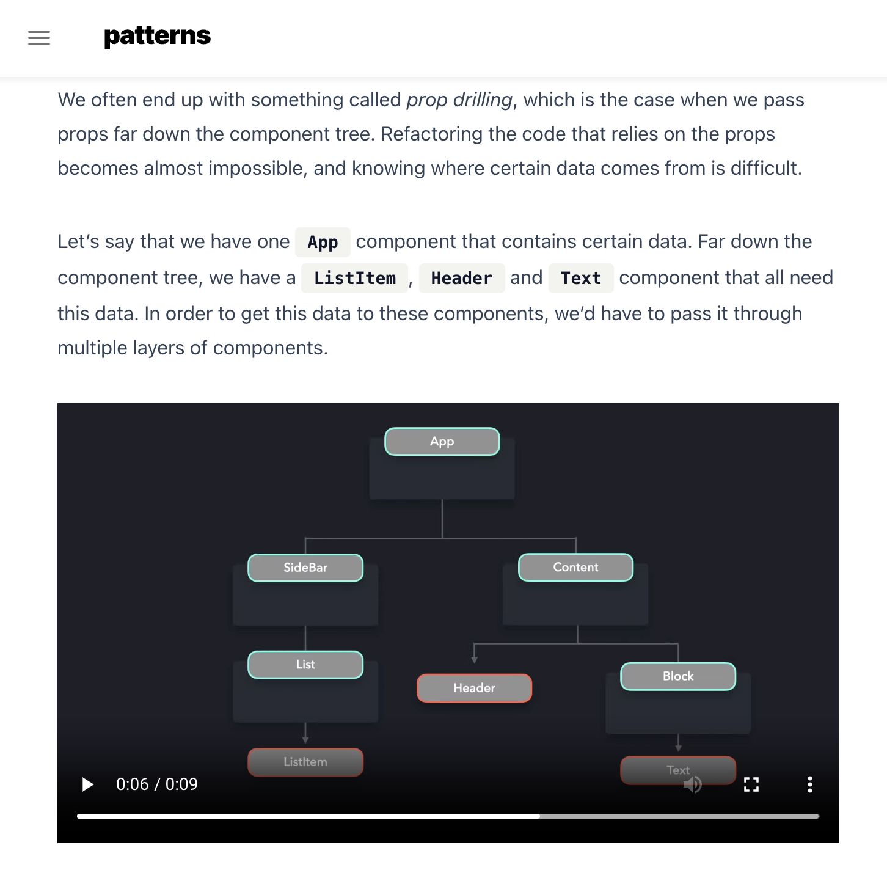
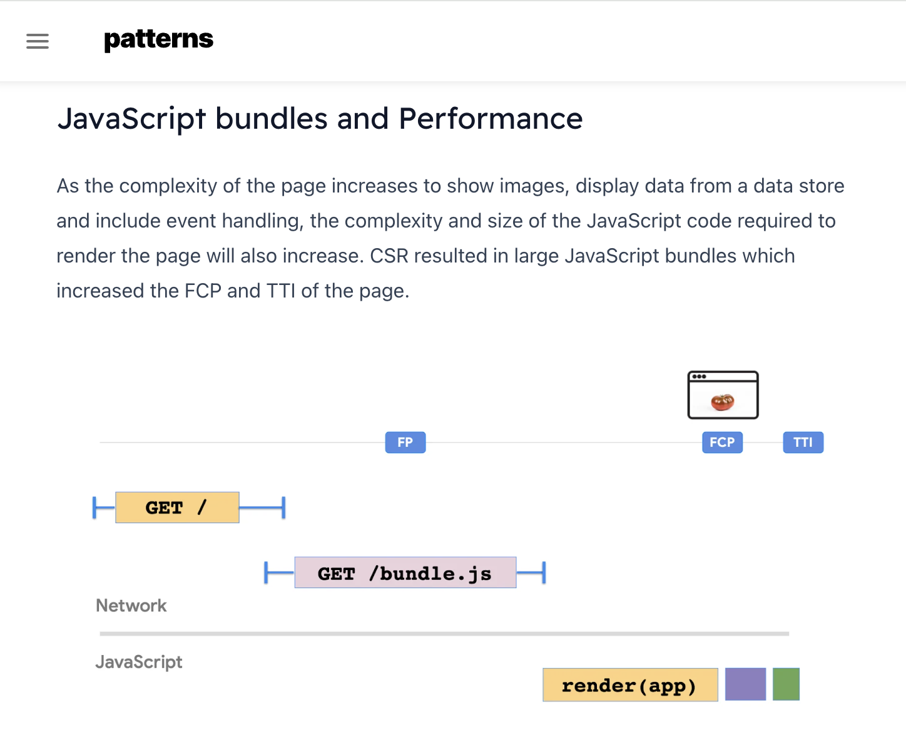
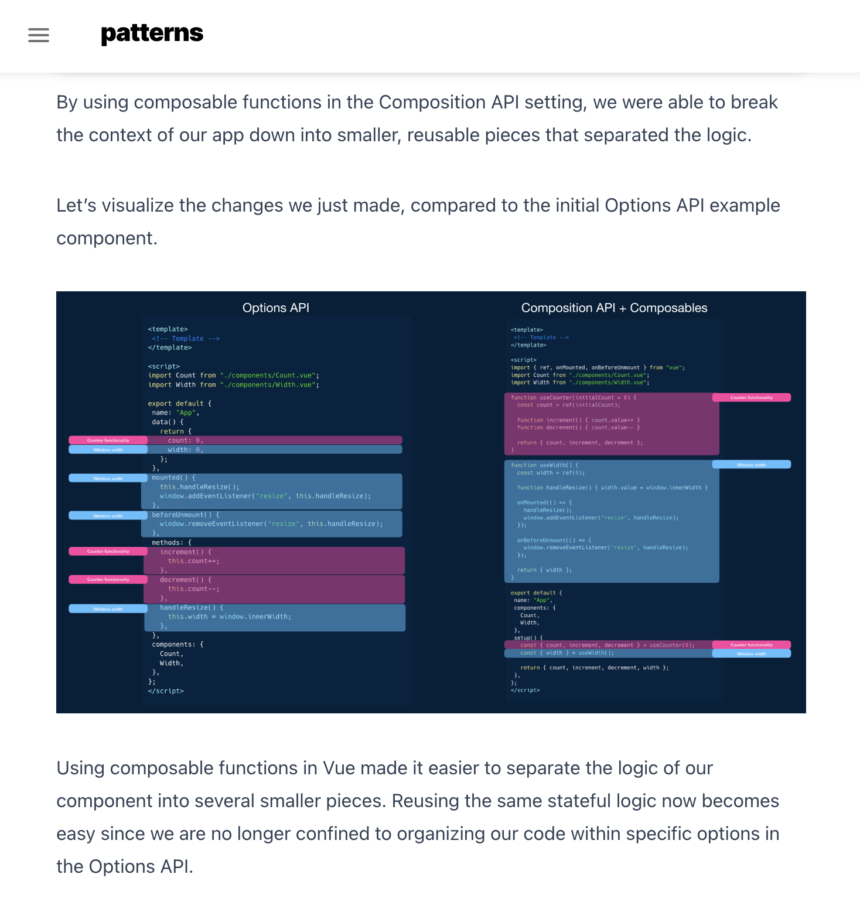
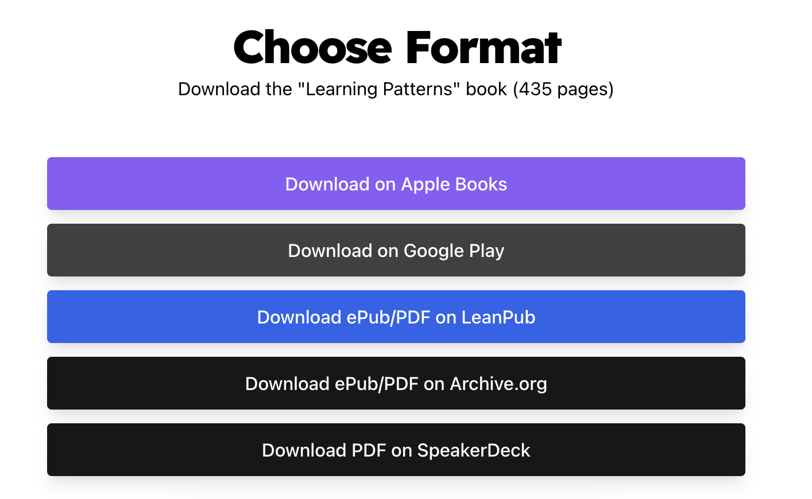

# 设计模式

今天来分享一个免费在线学习 JS、React、Vue 设计模式模式的网站，该网站旨在为 JavaScript 设计、渲染和性能模式带来现代视角，使用普通 JavaScript 或现代框架构建功能强大的 Web 应用！

网站总共包含三部分：

* **JavaScript 模式**：专注于纯 Javascript 和 Node.js 的模式；
* **React 模式**：专注于 React 和 Next.js 的模式；
* **Vue 模式**：专注于 Vue.js 的模式。

作者都是大佬级别：

* **Lydia Hallie**：就职于 Vercel，软件工程顾问和教育家，主要使用 JavaScript、React、Node、GraphQL 和 Severless 技术。
* **Addy Osmani**：负责 Google Chrome 的工程经理。他领导着一个开发人员工具团队，专注于提高 Web 速度。他的团队致力于 Lighthouse、PageSpeed Insights、Chrome 用户体验报告等项目。

## JavaScript 模式

JavaScript 模式包括 3 大类 24 个：

* 设计模式：
  * 单例模式
  * 代理模式
  * 原型模式
  * 观察者模式
  * 模块模式
  * 混合模式
  * 中间件模式
  * 享元模式
  * 工厂模式
* 渲染模式：
  * 岛屿架构
  * 渲染模式
  * 动画视图转换
* 性能模式：
  * 拆包
  * 压缩 JavaScript
  * 动态导入
  * 交互导入
  * 导入可见性
  * 优化加载顺序
  * 预取
  * 预加载
  * PRPL模式
  * 优化第三方加载
  * Tree Shaking
  * 虚拟列表

每个模式都使用图解、交互式的方式来讲解，更易于理解。

## **React 模式**

JavaScript 模式包括 2 大类 13 个：

* 设计模式
  * 复合组件模式
  * HOC 模式
  * Hooks 模式
  * 容器/展示模式
  * Render Props 模式
* 渲染模式
  * 客户端渲染
  * 增量静态生成
  * 渐进补水
  * 选择性补水
  * React 服务端组件
  * 服务端渲染
  * 静态渲染
  * 流式服务端渲染

## Vue 模式

Vue 模式是最新发布的，包括了 3 大类 11 个：

* 设计模式
  * 组件
  * 可组合
  * 容器/展示模式
  * 数据提供者模式
  * 动态组件
  * Provide/Inject
  * `<script setup>`
  * 状态管理
* 渲染模式
  * 渲染函数
  * 无渲染组件
* 性能模式
  * 异步组件

## 小结

**网站：**<https://www.patterns.dev/>

网站上还提供了电子书可供下载：

今天的分享到这里就结束了，如果觉的有用，就点个赞吧~

> 更新: 2024-02-24 16:22:54  
> 原文: <https://www.yuque.com/cuggz/feplus/ukuzgcsc27kcpebo>