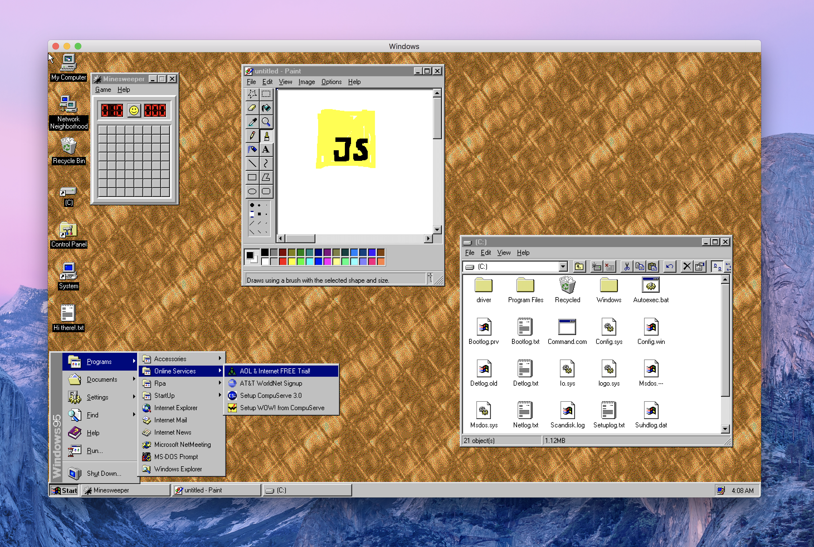
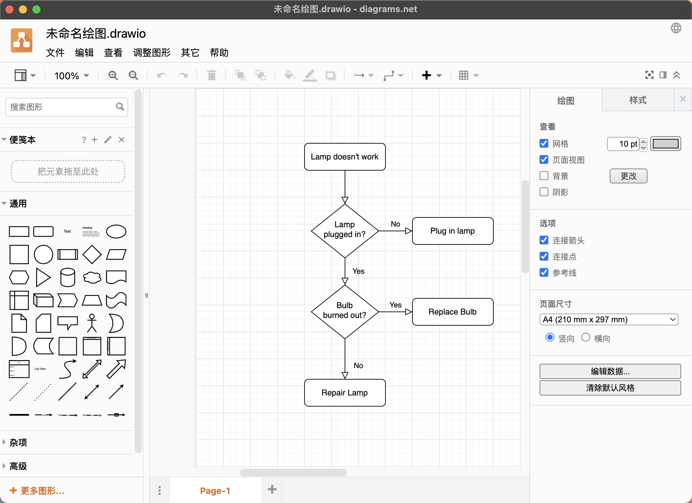
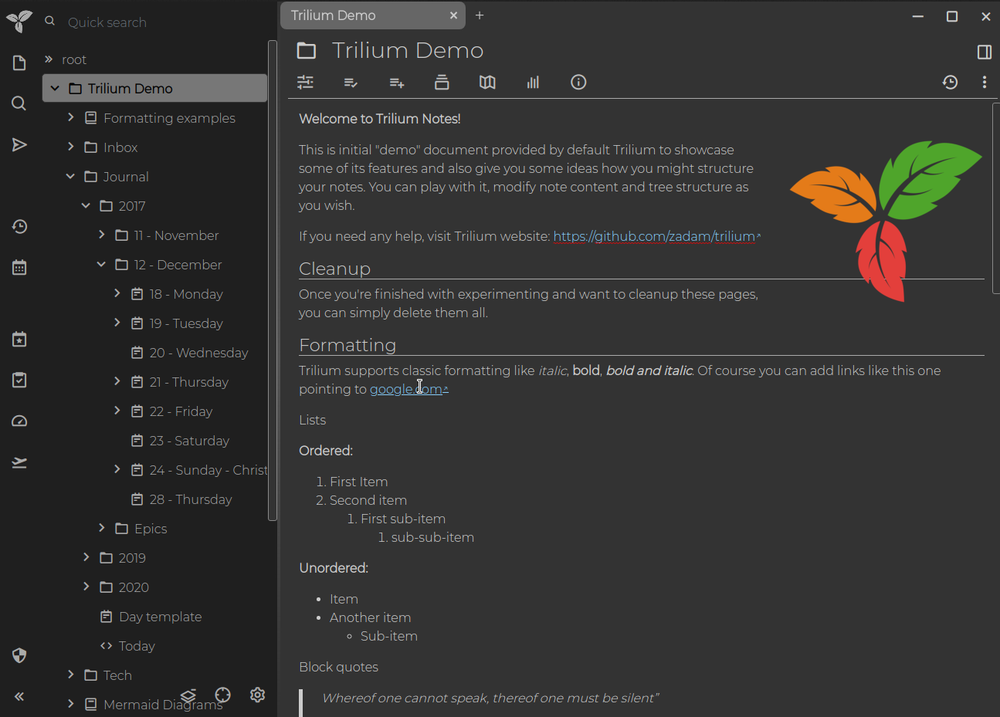
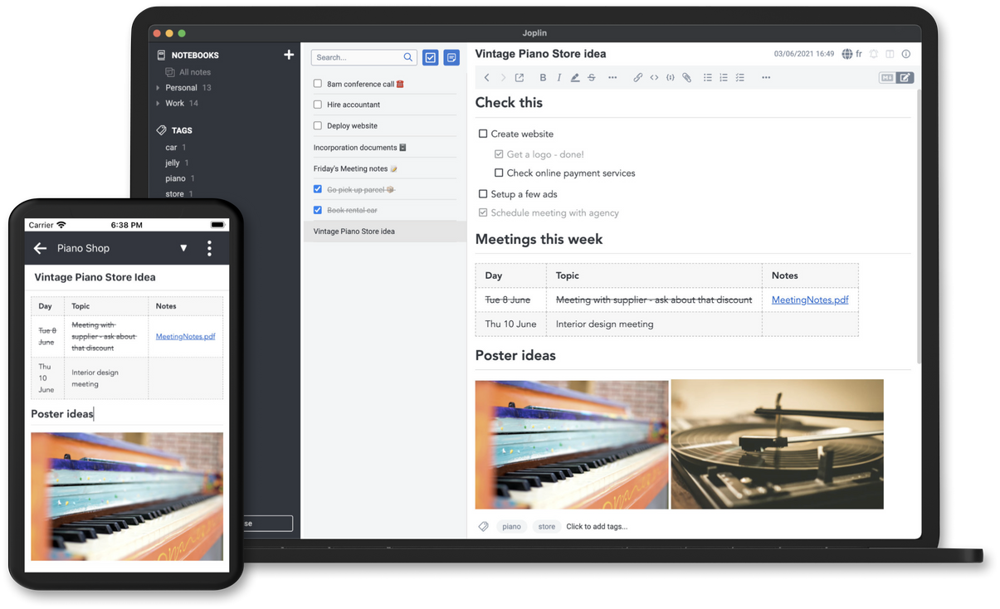
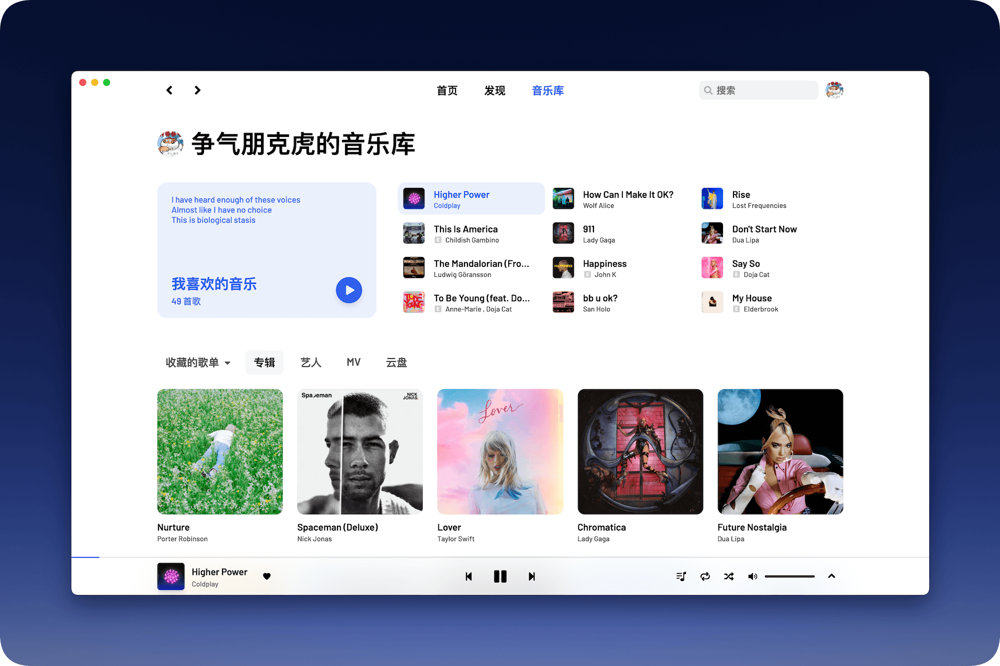
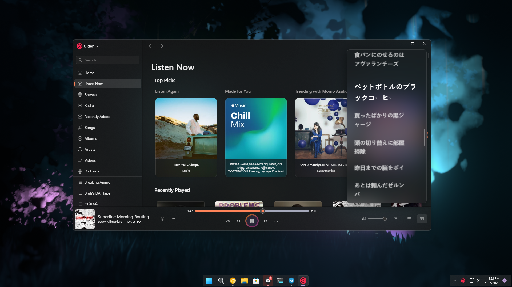
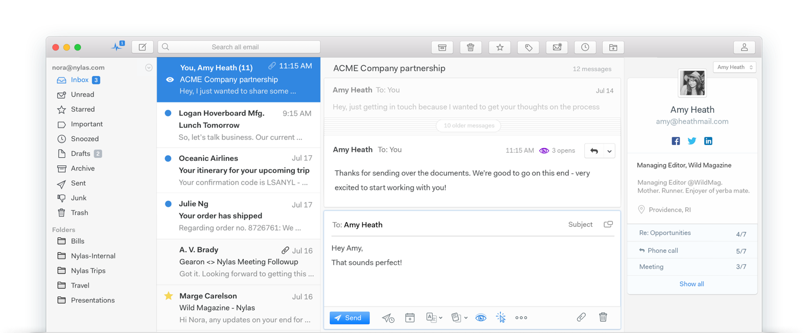
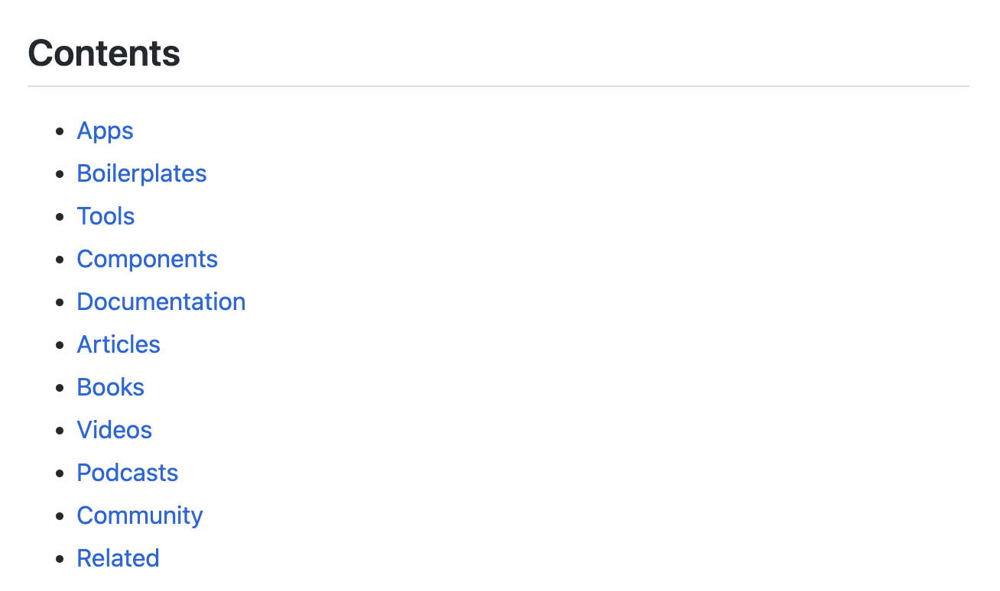

# 跨平台桌面项目

**全文概览：**

1. **windows95：**Electron 中的 Windows 95；
2. **drawio-desktop**：基于 Electron 的图表和白板桌面应用；
3. **MarkText**：简单而优雅的开源 Markdown 编辑器；
4. **Trilium**：分层的笔记应用，专注于建立大型个人知识库；
5. **Joplin**：笔记和待办事项应用；
6. **lx-music-desktop**：基于 Electron 17 + Vue 3 的音乐软件；
7. **YesPlayMusic**：高颜值的第三方网易云播放器；
8. **Cider**：全新跨平台 Apple Music 体验；
9. **ZY Player**：跨平台桌面端视频资源播放器；
10. **Nylas Mail**：可扩展的邮件客户端；
11. **PicGo**：用于上传图片并获取图片 URL 链接的工具；
12. **Awesome Electron**：Electron 资源汇总；

## 1. windows95
这是一个运行在 Electron 中的 Windows 95，可以在macOS、Linux 和 Windows 上运行。

**Github：**[https://github.com/felixrieseberg/windows95](https://github.com/felixrieseberg/windows95)

## 2. **drawio-desktop**
drawio-desktop 是一个基于 Electron 的图表和白板桌面应用，其可以用于绘制流程图、类图、组织结构图、泳道图、E-R图等，模板丰富。

**Github：**[https://github.com/jgraph/drawio-desktop](https://github.com/jgraph/drawio-desktop)

## 3. MarkText
MarkText 是一个简单而优雅的开源 Markdown 编辑器，专注于速度和可用性。MarkText 具有简单明了的界面，并支持实时预览，让用户可以获得无干扰的写作体验。其支持各种主题，并支持多种笔记模式，可以输出 HTML 和 PDF 文件等。MarkText 支持在 MACOS、Windows、Linux 系统使用。

**Github：**[https://github.com/marktext/marktext](https://github.com/marktext/marktext)

## 4. Trilium
Trilium Notes 是一个分层的笔记应用，专注于建立大型个人知识库。其具有以下特性：

+ 笔记可以排列成任意深的树。单个笔记可以放在树中的多个位置
+ 丰富的所见即所得笔记编辑功能，包括带有markdown自动格式化功能的表格，图像和数学
+ 支持编辑使用源代码的笔记，包括语法高亮显示
+ 笔记之间快速导航，全文搜索和笔记挂起
+ 无缝笔记版本控制
+ 笔记属性可用于笔记组织，查询和高级脚本编写
+ 同步与自托管同步服务器
+ 具有按笔记粒度的强大的笔记加密
+ 关系图和链接图，用于可视化笔记及其关系
+ 脚本-请参阅高级展示
+ 可用性和性能均能很好地扩展至超过10万个笔记
+ 针对智能手机和平板电脑进行触摸优化的移动前端
+ 夜间主题
+ Evernote和Markdown导入导出
+ Web Clipper可轻松保存Web内容

**Github：**[https://github.com/zadam/trilium](https://github.com/zadam/trilium)

## **5. Joplin**
Joplin 是一个免费的开源笔记和待办事项应用，可以处理大量组织成笔记本的笔记。笔记是可搜索的，可以直接从应用或自己的文本编辑器复制、标记和修改。笔记采用Markdown 格式。该应用适用于 Windows、Linux、macOS、Android 和 iOS。

**Github：**[https://github.com/laurent22/joplin](https://github.com/laurent22/joplin)

## **6. lx-music-desktop**
lx-music-desktop 是一个基于 Electron 17 + Vue 3 的音乐软件。其支持在Windows、Mac OS、Linux、Android 平台上运行。

**Github：**[https://github.com/lyswhut/lx-music-desktop](https://github.com/lyswhut/lx-music-desktop)

## 7. YesPlayMusic
YesPlayMusic 是一个高颜值的第三方网易云播放器，支持 Windows / macOS / Linux。其具有以下特性：

+ 使用 Vue.js 全家桶开发
+ 网易云账号登录（扫码/手机/邮箱登录）
+ 支持 MV 播放
+ 支持歌词显示
+ 支持私人 FM / 每日推荐歌曲
+ 每日自动签到（手机端和电脑端同时签到）
+ Light/Dark Mode 自动切换
+ 支持 Touch Bar
+ 支持 PWA，可在 Chrome/Edge 里点击地址栏右边的 ➕ 安装到电脑
+ 支持 Last.fm Scrobble
+ 支持音乐云盘
+ 自定义快捷键和全局快捷键
+ 支持 Mpris

**Github：**[https://github.com/qier222/YesPlayMusic](https://github.com/qier222/YesPlayMusic)

## 8. Cider
基于 Electron 和 Vue.js 的全新跨平台 Apple Music 体验，从头开始编写，同时兼顾性能和视觉效果。

**Github：**[https://github.com/ciderapp/Cider](https://github.com/ciderapp/Cider)

## 9. ZY Player
ZY Player 是一个跨平台桌面端视频资源播放器，其具有以下特性：

+  全平台支持：Windows、Mac、Linux
+ 支持 IPTV, 卫视直播
+ 视频源支持自定义, 支持导入, 导出
+ 支持海报模式和列表模式浏览资源
+ 播放历史, 自动跳转历史进度
+ 收藏夹支持导入,导出, 支持同步追剧
+ 支持精简模式, 摸鱼划水
+ 一键搜索所有资源, 支持历史搜索记录
+ 导出资源下载链接
+ 支持第三方播放器播放
+ 显示豆瓣评分

**Github：**[https://github.com/Hunlongyu/ZY-Player](https://github.com/Hunlongyu/ZY-Player)

## 10. Nylas Mail
Nylas Mail 是一个使用 Electron、React 和 Flux 构建的开源、可扩展的邮件客户端。它被设计为易于扩展，并且有许多第三方插件可以为客户端添加功能。其兼容上百种邮件提供商，作为桌面应用它可以离线运行。适用于 Mac, Windows 和 Linux。

**Github：**[https://github.com/nylas/nylas-mail](https://github.com/nylas/nylas-mail)

## **11. **PicGo
PicGo 是一个用于快速上传图片并获取图片 URL 链接的工具。其具有以下特性：

+ 支持拖拽图片上传
+ 支持快捷键上传剪贴板里第一张图片
+ Windows 和 macOS 支持右键图片文件通过菜单上传 (v2.1.0+)
+ 上传图片后自动复制链接到剪贴板
+ 支持自定义复制到剪贴板的链接格式
+ 支持修改快捷键
+ 支持插件系统，已有插件支持 Gitee、青云等第三方图床
+ 支持通过发送 HTTP 请求调用 PicGo 上传（v2.2.0+)

**Github：**[https://github.com/Molunerfinn/PicGo](https://github.com/Molunerfinn/PicGo)

## 12. Awesome Electron 
Awesome Electron 是使用 Electron 创建应用的有用资源。包含文章、图书、视频、播客、文档、工具等资源。

**Github：**[https://github.com/sindresorhus/awesome-electron](https://github.com/sindresorhus/awesome-electron)

> 更新: 2022-09-24 00:31:41  
> 原文: <https://www.yuque.com/cuggz/feplus/yu3u5h>