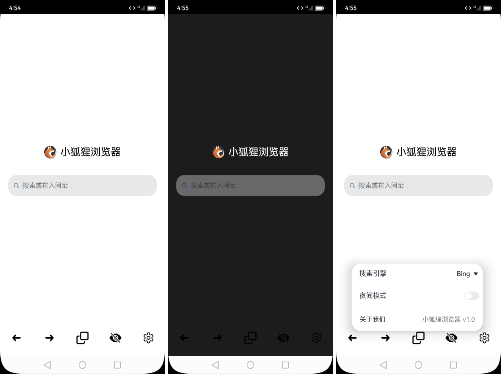
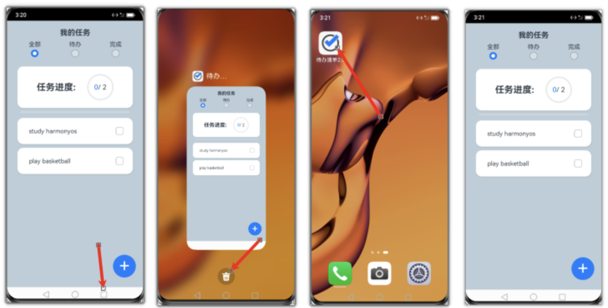
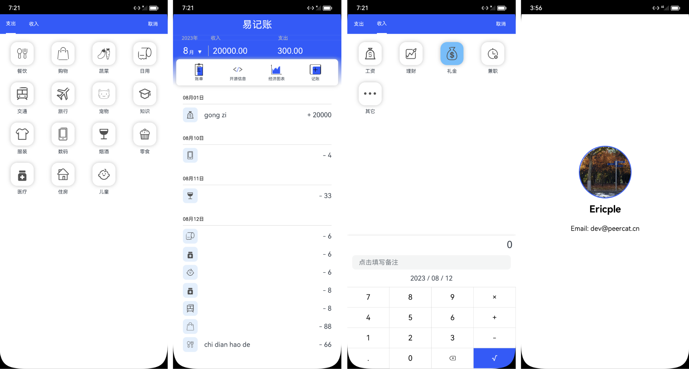
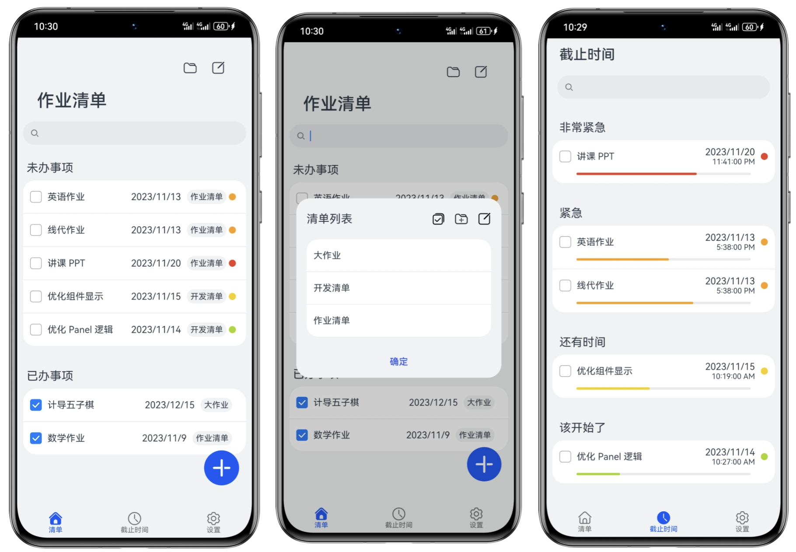
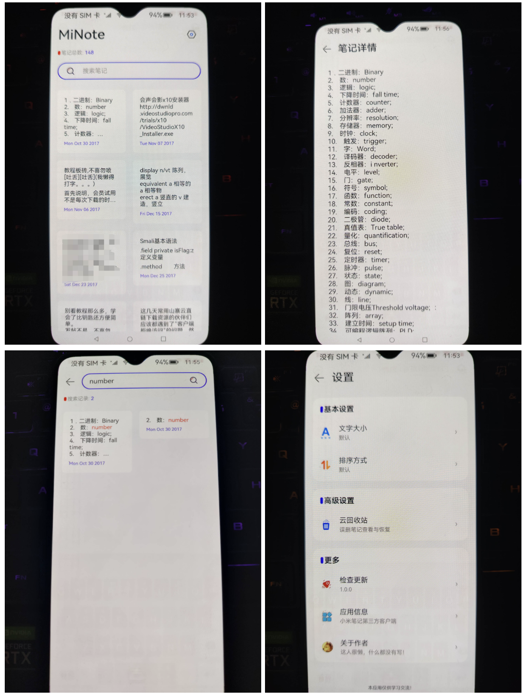
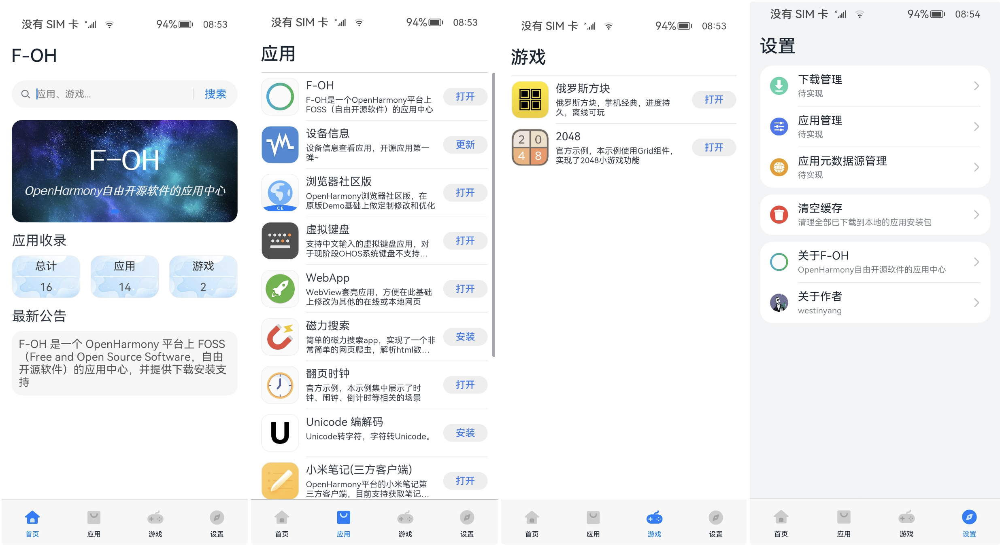

# 鸿蒙项目

随着鸿蒙操作系统（HarmonyOS）的崛起，华为自主研发的这款操作系统已经吸引了无数关注。鸿蒙社区内，开发者们纷纷献上自己的实战项目，为全球开发者提供了宝贵的经验与灵感。本文将分享 12 个开源的鸿蒙实战项目，无论你是鸿蒙领域的新兵，还是经验丰富的老将，都能从这些项目中获得启发和实用经验。让我们一同踏上这场鸿蒙开源项目的探索之旅，感受鸿蒙的独特魅力！

## 小狐浏览器
基于鸿蒙HarmonyOS，使用ArkTS开发纯净的浏览器（小狐狸浏览器）。

**Github：**[https://github.com/langwudong/browser](https://github.com/langwudong/browser)

## 仿网易云音乐
鸿蒙 ArkTs 仿网易云音乐项目，其功能包括：

+ 登陆
+ 首页
+ 每日推荐
+ 歌单广场
+ 排行榜
+ 云村热评
+ 视频
+ MV详情页
+ 我的
+ 电台模块【电台首页，电台详情，电台排行榜】
+ 搜索【支持单曲，MV，专辑，歌单，电台】
+ 播放页【歌词，播放列表，上一首，下一首】

**Github：**[https://github.com/linwu-hi/open_neteasy_cloud](https://github.com/linwu-hi/open_neteasy_cloud)

## 开眼
华为鸿蒙Harmony开眼App（项目整体基于Api9+Stage模式+ArkTs+ArkUI）鸿蒙Harmony版本开眼APP，具体包含功能如下：

+ 常用组件的导出；
+ 网络请求的基础封装（基于axios）；
+ 封装项目页面多状态（加载中，成功，失败，空数据）；
+ 视频播放以及视频列表播放；
+ 列表页面刷新加载示例等
+ 新增EventBus和Storage使用模板
+ 添加全局加载实现
+ mock接口登陆状态验证+mock移植页面修改登陆状态场景

**Github：**[https://github.com/WinWang/HarmoneyOpenEye](https://github.com/WinWang/HarmoneyOpenEye)

## 买为
一个仿淘宝的鸿蒙 HAP，使用 JavaScript 开发。

**Github**：[https://github.com/aweihao/buy-it](https://github.com/aweihao/buy-it)

## 仿今日头条
鸿蒙版今日头条，开发工具：

+ DevEco Studio 3.1.1 Release
+ Build Version: 3.1.0.501, built on June 20, 2023
+ Runtime version: 17.0.6+10-b829.5 x86_64
+ VM: OpenJDK 64-Bit Server VM by JetBrains s.r.o.

**Github：**[https://github.com/pan372728544/TodayNews_harmony](https://github.com/pan372728544/TodayNews_harmony)

## 仿唯品会
一个鸿蒙开发的仿唯品会电商app模板，开发语言是ArkTS，目前已实现以下功能：

+ 推荐页-（轮播图、大牌闪购+发现好物UI、今日特卖UI-支持左右滑动、发现频道UI、广告ListUI)
+ 女装Tab页-（服装种类UI-支持多种分类、格状品牌展示-Grid-UI）
+ 男装Tab页-（瀑布流-商品卡片浏览UI、支持点击进入商品详情页[商品图+价格+标题+颜色分类+尺寸分类+数量展示]
+ 运动Tab页+电脑办公Tab页
+ 购物车页（商品数量计算 + 订单金额计算）
+ 个人中心页（个人头像+昵称，我的订单，功能区）

**Gitee：**[https://gitee.com/boring-music/ArkTS-wphui1.0](https://gitee.com/boring-music/ArkTS-wphui1.0)

## 仿笔趣阁
仿ios旧版笔趣阁app，已实现功能：

+ 小说爬取
+ 主题切换
+ 小说朗读

**Gitee：**[https://gitee.com/ctaolee/reader](https://gitee.com/ctaolee/reader)

## 待办清单
使用ArkTS语言，Stage模型开发的一款鸿蒙APP，简称为“待办清单”。待办清单鸿蒙APP是一款帮助用户管理日常任务和事务的应用程序。它的主要功能包括创建待办事项和任务清单、查看任务进度和完成情况等。用户可以通过这款APP轻松地管理自己的日常任务，提高工作和生活效率。

**Gitee：**[https://gitee.com/bananana-ice/harmonyos-todolist](https://gitee.com/bananana-ice/harmonyos-todolist)

## 易记账
Open-Bill 是一个运行于Harmony OS 3.1+操作系统上，使用ArkUI框架开发的一款开源账单记录软件。

**Gitee：**[https://gitee.com/ericple/oh-bill](https://gitee.com/ericple/oh-bill)

## 作业清单
使用 ArkTS 开发的作业清单工具，其具又以下特性：

+ 美观、遵循 HarmonyOS 设计规范的 UX 设计，使用大量原生组件
+ 支持任务名称、截止日期、完成情况分组查看的待办清单
+ 支持用颜色、进度条指示距离截止日期的距离，管理待办时间一目了然

**Gitee：**[https://gitee.com/handwer/homework-tasklist-v2](https://gitee.com/handwer/homework-tasklist-v2)

## 小米笔记
基于OpenHarmony平台的小米笔记第三方客户端，目前支持获取笔记列表、搜索笔记、查看笔记文本内容等功能。  

**Gitee**：[https://gitee.com/z-p-j/mi-note](https://gitee.com/z-p-j/mi-note)

## 应用中心
F-OH 是一个 OpenHarmony 平台上 FOSS（Free and Open Source Software，自由开源软件）的应用中心，并提供下载安装支持。

**Gitee：**[https://gitee.com/westinyang/f-oh](https://gitee.com/westinyang/f-oh)

> 更新: 2024-02-24 16:21:51  
> 原文: <https://www.yuque.com/cuggz/feplus/zsucfmz4edv10usv>