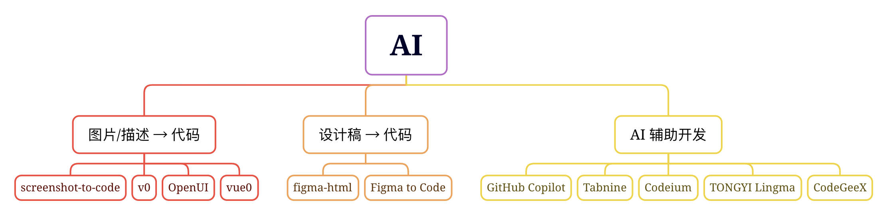
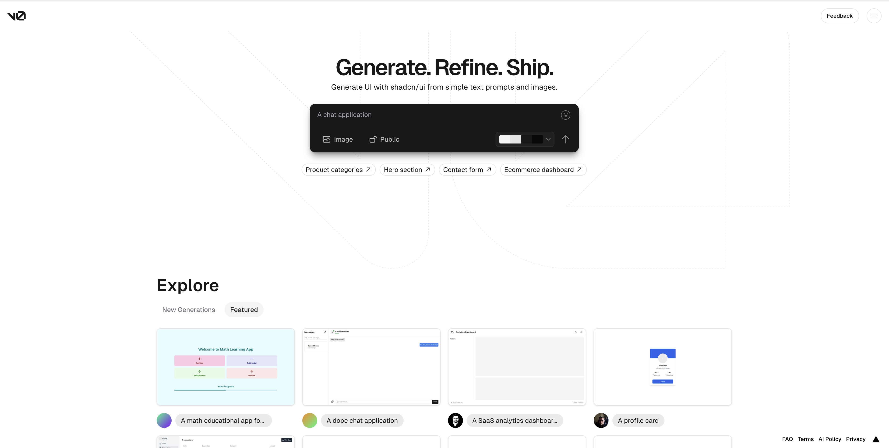
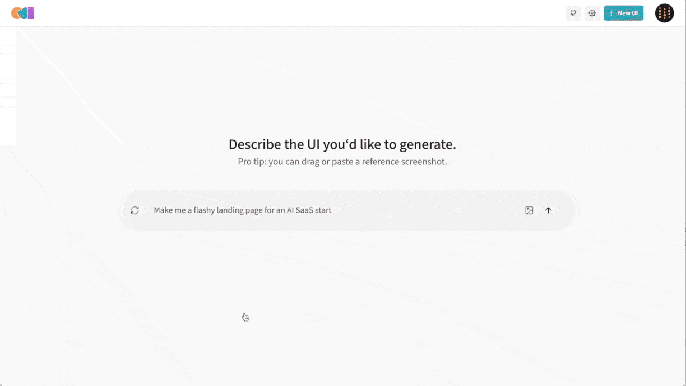
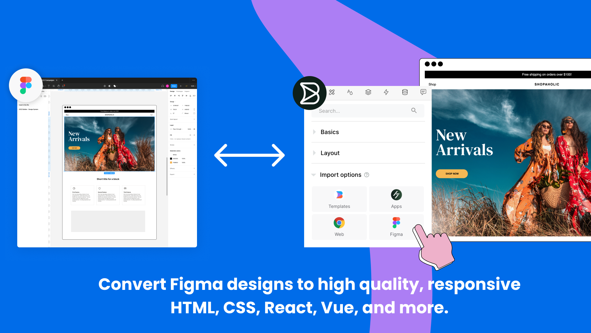
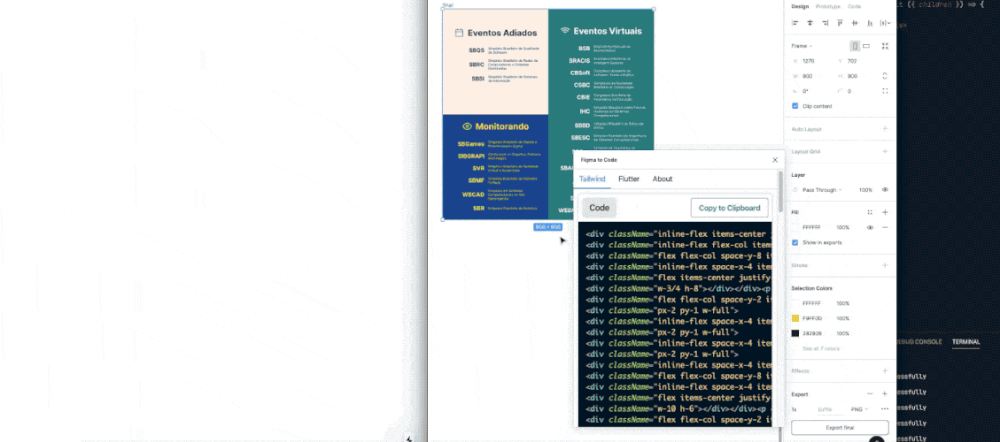
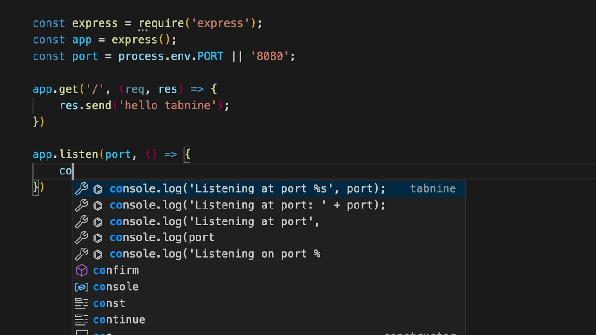
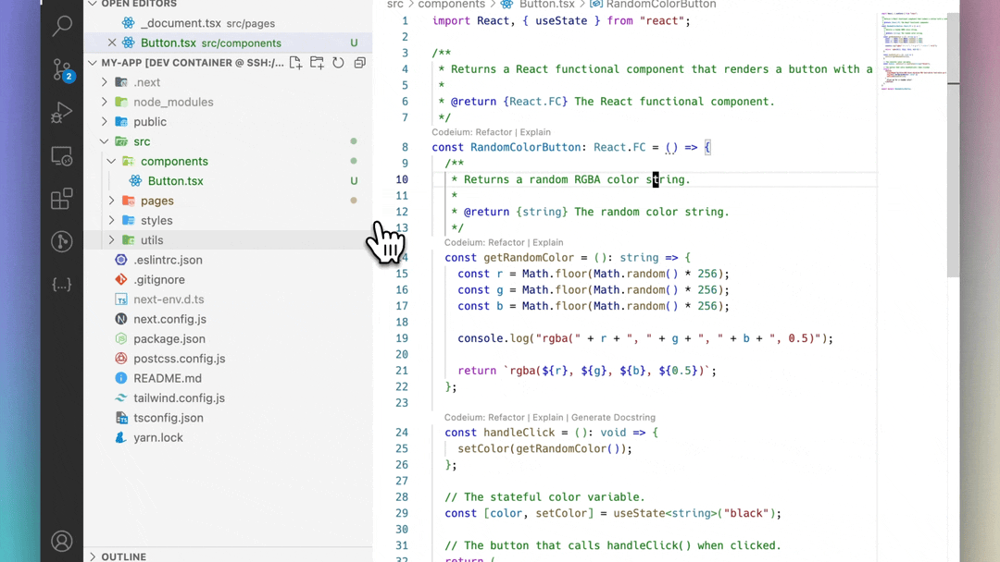
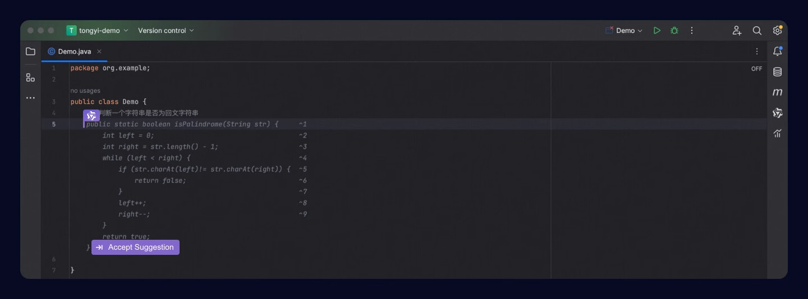
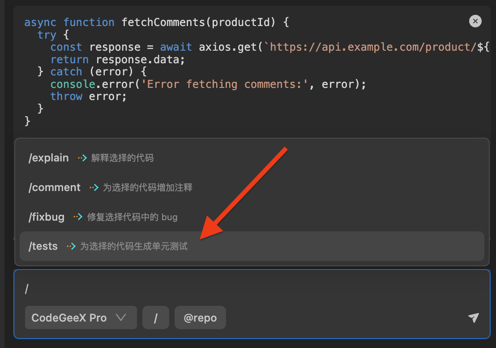

# AI 开发工具

今天来分享 11 个助力高效前端开发的 AI 工具，让 AI 帮你写代码！

## 图片/描述 → 代码
### screenshot-to-code
screenshot-to-code 旨在探索使用 AI 技术，**将网页截图转换为代码**，其支持生成多种前端技术栈，包括 HTML + Tailwind、React + Tailwind、Vue + Tailwind、Bootstrap、Ionic + Tailwind 和 SVG。

**Github：**[https://github.com/abi/screenshot-to-code](https://github.com/abi/screenshot-to-code)

### v0
v0 是 Vercel 推出的文本生成 UI 界面代码的 AI 工具，只需要输入文字提示，即可生成需要的 UI 组件界面，而且可以直接复制代码粘贴到需要使用的任何地方。

**官网：**[https://v0.dev/](https://v0.dev/)

### OpenUI
openv0是一个基于AI技术的生成式UI组件框架，它支持实时预览和高度模块化设计，允许用户快速生成和迭代UI组件。openv0兼容多种前端框架和UI库，同时易于集成新的框架、库和插件。

**Github：**[https://github.com/wandb/openui](https://github.com/wandb/openui)

### vue0
vue0 是一个开源的 AI 工具，借助 Open AI 实现。通过简单的描述，就可以快速生成一个 Vue 页面，目前支持生成 shadcn / Vue 代码。

**Github：**[https://github.com/zernonia/vue0](https://github.com/zernonia/vue0)

## 设计稿 → 代码
### figma-html
figma-html 插件支持将 Figma 设计稿导出为多种代码格式，包括React、Vue、Svelte、Qwik、Solid、HTML/CSS 等。

**Github：**[https://github.com/BuilderIO/figma-html](https://github.com/BuilderIO/figma-html)

### Figma to Code
Figma to Code 是一个设计到代码的工具，它的目标是通过生成响应式布局的代码来提升设计到开发的工作流程。具体来说，这个工具可以将 Figma 设计转换成 Tailwind CSS、Flutter 和 SwiftUI 代码，以便于开发者能够快速地将设计图转化为实际的前端界面。

**Github：**[https://github.com/bernaferrari/FigmaToCode](https://github.com/bernaferrari/FigmaToCode)

## AI 辅助开发
以下均为 VS Code 插件。

### GitHub Copilot
GitHub Copilot 是 Github 推出的一款 AI 结对编程工具，可以帮助开发者更快、更智能地编写代码，不过该插件并不是免费的。

### Tabnine
Tabnine 是一款 AI 代码助手，可加速和简化软件开发，同时保证代码的私密性、安全性和合规性。

### Codeium
一个基于 AI 技术的免费代码加速工具包，为VSCode提供70多种语言的快速自动补全、聊天和搜索功能，支持IDE内聊天和多种编程语言的建议。

### **TONGYI Lingma**
通义灵码是阿里云推出的一款基于通义大模型的智能编码辅助工具，提供实时续写、自然语言生成代码、单元测试生成、代码注释生成、代码解释、研发智能问答、异常报错排查等能力。

### **CodeGeeX**
CodeGeeX 是一款基于大模型的智能编程助手，它完善了代码的生成与补全，自动为代码添加注释，此外，它还针对代码问题的智能问答，当然还包括代码解释，实现代码，修复代码bug等非常丰富的功能。

### 

### 

> 更新: 2024-07-16 16:18:07  
> 原文: <https://www.yuque.com/cuggz/feplus/ai3a9gshflntluw7>