# ChatGPT

最近 ChatGPT 非常火爆，铺天盖地都是 ChatGPT 的新闻。Github 上也出现了很多和 ChatGPT 相关的项目，并且 Star 数快速增长，下面就来盘点那些玩出花的 ChatGPT 开源项目！

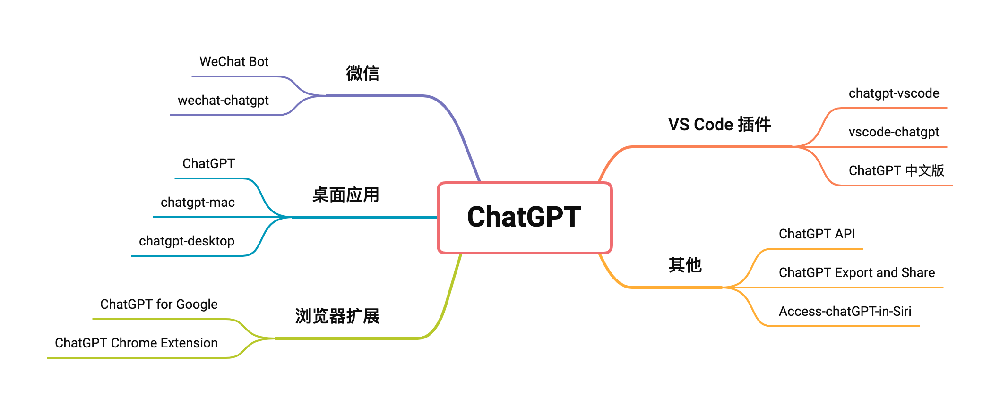

## 浏览器扩展
### ChatGPT for Google
ChatGPT for Google 是一个可以显示 ChatGPT 响应和 Google 搜索结果的浏览器扩展，支持 Chrome/Edge/Firefox。该项目主要使用 JavaScript 和 CSS 编写。该扩展具有以下特性：

+ 支持所有主流的搜索引擎
+ 支持OpenAI官方API
+ 从插件弹窗里快速使用ChatGPT
+ 支持Markdown渲染
+ 支持代码高亮
+ 支持深色模式
+ 可自定义ChatGPT触发模式

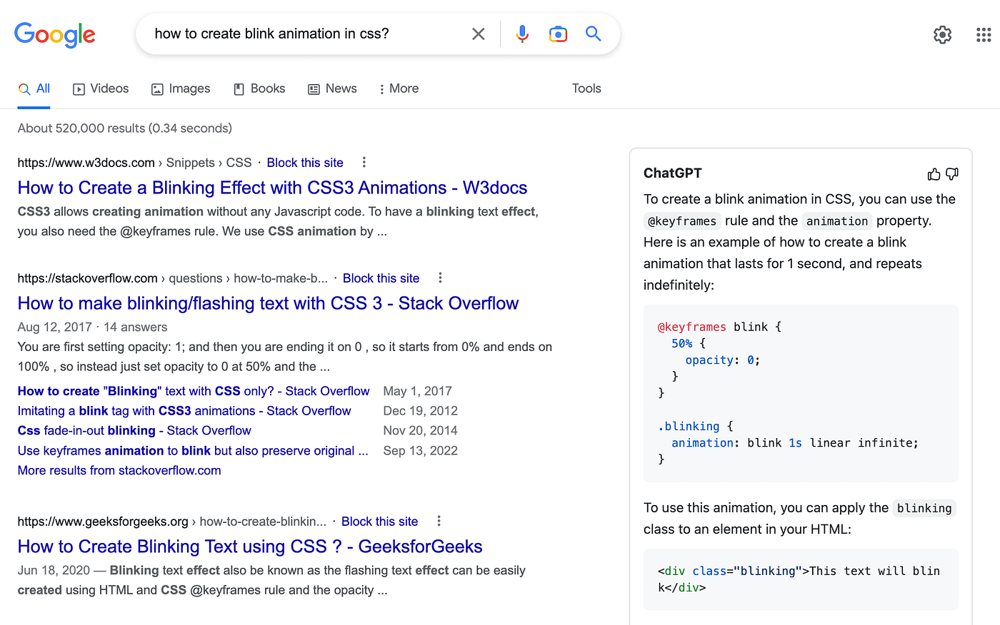  
**Github（****⭐****️ 10k）：**[https://github.com/wong2/chat-gpt-google-extension](https://github.com/wong2/chat-gpt-google-extension)

### ChatGPT Chrome Extension
一个 Chrome 扩展，将 ChatGPT 添加到网络上的每个文本框！ 可以使用它来撰写推文、修改电子邮件、修复编码错误或者需要的任何其他内容，所有这些都无需离开所在的网站。 包括一个插件系统，用于更好地控制 ChatGPT 行为和与第三方 API 交互的能力。

**Github（****⭐****️ 2k）：**[https://github.com/gragland/chatgpt-chrome-extension](https://github.com/gragland/chatgpt-chrome-extension)

## 微信
### WeChat Bot
一个基于 OpenAi ChatGPT + WeChaty 实现的微信机器人 ，可以用来帮助你自动回复微信消息，或者管理微信群/好友，检测僵尸好友等。

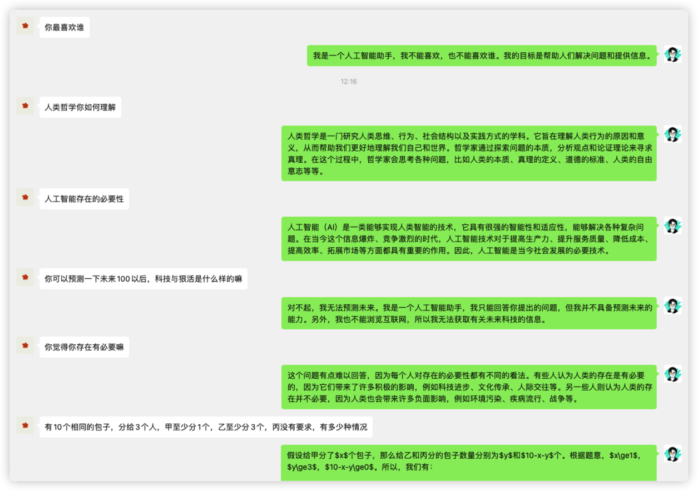

**Github（****⭐****️ 2.2k）：**[https://github.com/wangrongding/wechat-bot](https://github.com/wangrongding/wechat-bot)

### wechat-chatgpt
通过 wechaty** 在微信上使用 ChatGPT**，其支持在实用 OpenAI 账户，支持使用代理登录，支持与 docker 一起使用等。该工具简单易用，安装完依赖后只需要填写 OpenAI 账号密码和微信扫码即可使用。该项目的特性如下：

+ 通过 wechaty，将 ChatGPT 接入微信
+ 创建 OpenAI 的账户池
+ 支持通过代理登陆 OpenAI
+ 加入了持续对话的功能
+ 加入 Dockerfile
+ 发布到 Docker.hub
+ 通过 Railway 进行部署
+ 实现 OpenAI 账户池的热加载
+ 当 OpenAI 返回码为 429/503 时自动重试

> Wechaty 是一个聊天机器人开源项目，提供了开发聊天机器人的 SDK，方便开发人员快速实现聊天机器人。通过 Wechat 可以获取到微信的聊天内容、联系人、群组、好友关系等信息，也可以实现创建群组、发送消息等功能。
>

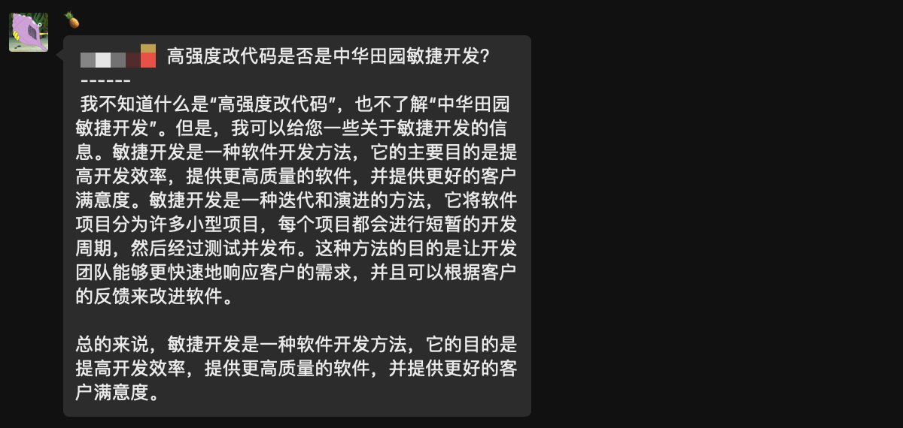

**Github（****⭐****️ 7.9k）：**[https://github.com/fuergaosi233/wechat-chatgpt](https://github.com/fuergaosi233/wechat-chatgpt)

## VS Code 插件
### chatgpt-vscode
一个基于 ChatGPT 的 VSCode 扩展，允许使用非官方的 ChatGPT API 直接在编辑器中从 OpenAI 的 ChatGPT 生成问题响应。该插件具有以下特性：

+ 提出问题或使用编辑器中的代码片段，通过侧边栏的输入框查询 ChatGPT
+ 在代码选择上点击右键，运行上下文菜单中的一个快捷方式
+ 在编辑器旁边的面板上查看 ChatGPT 的回答
+ 对回答提出后续问题（保持对话上下文）
+ 通过点击 AI 的回应将代码片段插入到活动的编辑器中

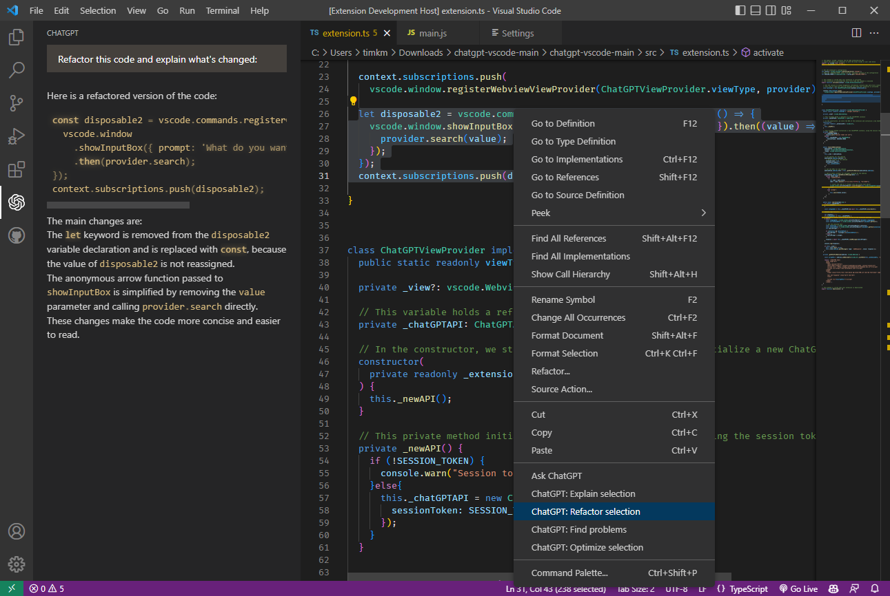

**Github（****⭐****️ 3.4k）：**[https://github.com/mpociot/chatgpt-vscode](https://github.com/mpociot/chatgpt-vscode)

### vscode-chatgpt
一个支持 ChatGPT 的 Visual Studio Code 扩展，该扩展可以与 ChatGPT 配对编程。其支持以 Markdown 格式一次导出所有对话历史记录，简单易用，只需登录 OpenAI，或者使用 OpenAI 的官方 GPT3 API。可以单击或使用键盘快捷键创建文件/项目或修复代码，提高开发效率。

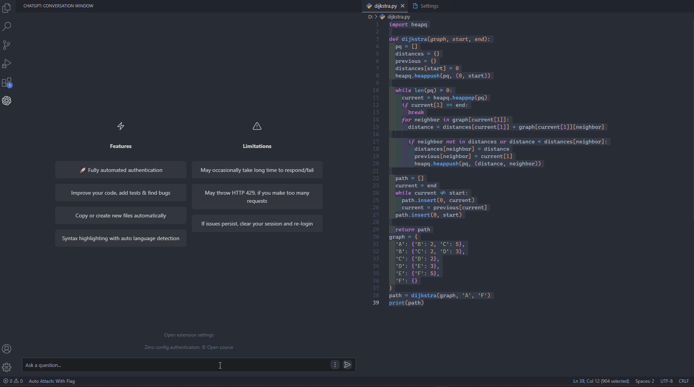

**Github（****⭐****️ 462k）：**[https://github.com/gencay/vscode-chatgpt](https://github.com/gencay/vscode-chatgpt)

### ChatGPT 中文版
一个 VSCode 插件，将 ChatGPT 集成在 VSCode 中，提高开发效率。目前支持的代码功能包括：

+ ChatGPT: 请输入问题：直接对 ChatGPT 提问
+ ChatGPT: 添加测试代码：为当前选中的代码，或者当前文件添加测试代码
+ ChatGPT: 代码为什么有问题(需要同时选中报错)：询问代码出现的问题，需要将报错也一起选中
+ ChatGPT: 优化这部分代码：对当前选中的代码，或者当前文件，进行优化或者重构
+ ChatGPT: 解释这部分代码：对当前选中的代码，或者当前文件，进行解释
+ ChatGPT: 执行自定义命令 1：添加一个对选中代码，或者当前文件执行的自定义命令 1，添加后可以直接执行
+ ChatGPT: 执行自定义命令 2：添加一个对选中代码，或者当前文件执行的自定义命令 2，添加后可以直接执行

执行了一个命令之后，侧边栏会弹出一个交互窗口：

+ 后续所有的问题、回答、异常。都会在这个窗口中显示。
+ 可以在交互窗口的底部输入框中，直接输入问题，询问 ChatGPT
+ 也可以执行前面的命令，对代码进行询问。

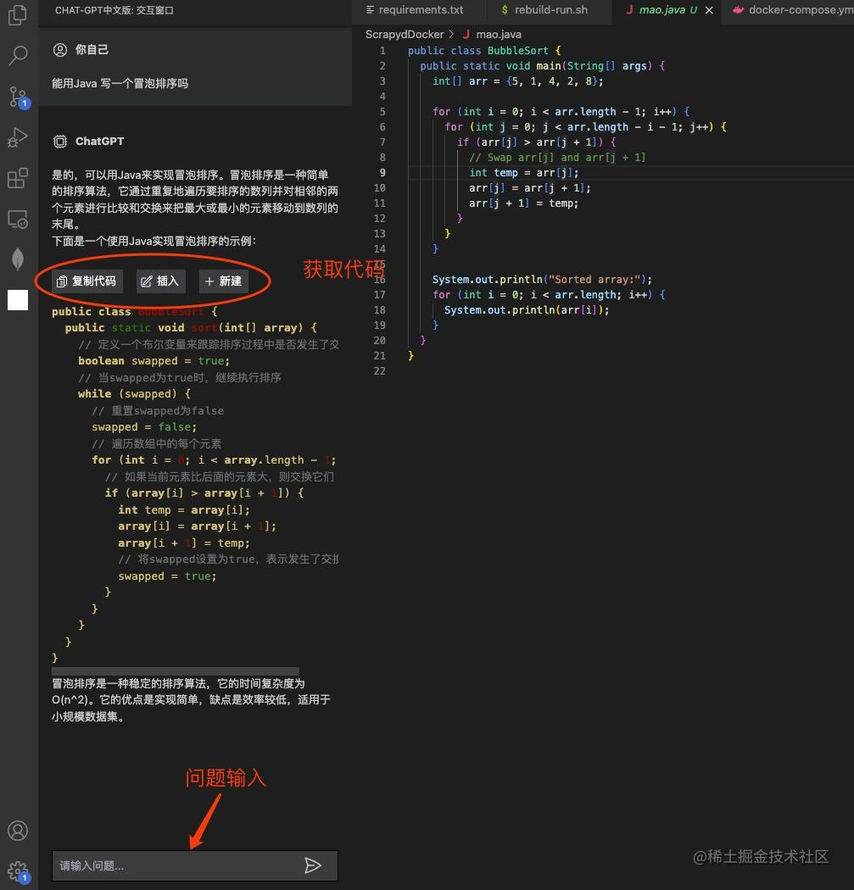

**插件地址：**[https://marketplace.visualstudio.com/items?itemName=WhenSunset.chatgpt-china](https://marketplace.visualstudio.com/items?itemName=WhenSunset.chatgpt-china)

## 桌面应用
### ChatGPT
ChatGPT 桌面应用，适用于 Mac、Windows 和 Linux 平台，该项目只是对 OpenAI ChatGPT 网站的一个包装器，不存在额外的数据收集和上传。该项目具有以下特性：

+ 跨平台: macOS、Linux、Windows
+ 导出 ChatGPT 聊天记录 (支持 PNG, PDF 和生成分享链接)
+ 主窗口和系统托盘支持自定义 URL，将任意网站包装成一个桌面应用
+ 应用自动升级通知
+ 丰富的快捷键
+ 系统托盘悬浮窗
+ 应用菜单功能强大
+ 支持斜杠命令及其配置
+ 自定义全局快捷键
+ 划词搜索

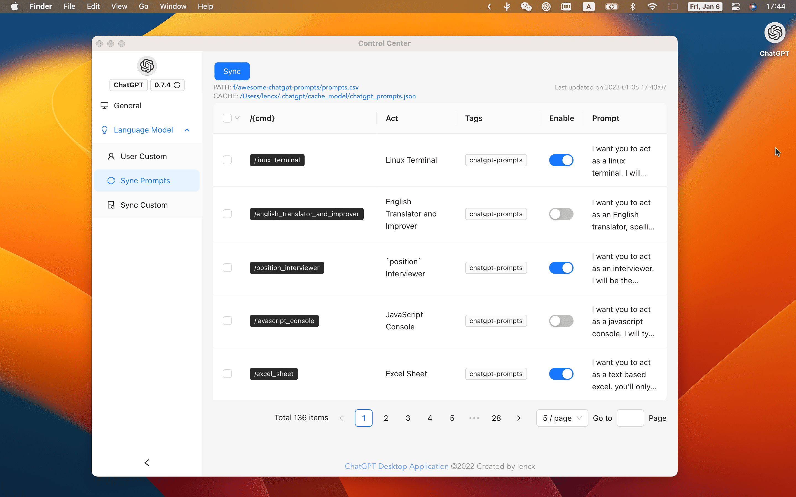

**Github（****⭐****️ 14.3k）：**[https://github.com/lencx/ChatGPT](https://github.com/lencx/ChatGPT)

### chatgpt-mac
一个简单的 Mac 应用，可让 ChatGPT 在菜单栏中显示，在 Mac 上可以使用 Cmd+Shift+G 快捷键来快速打开它，目前提供了 Mac 的 Arm64 和 Intel 版本的安装包。  
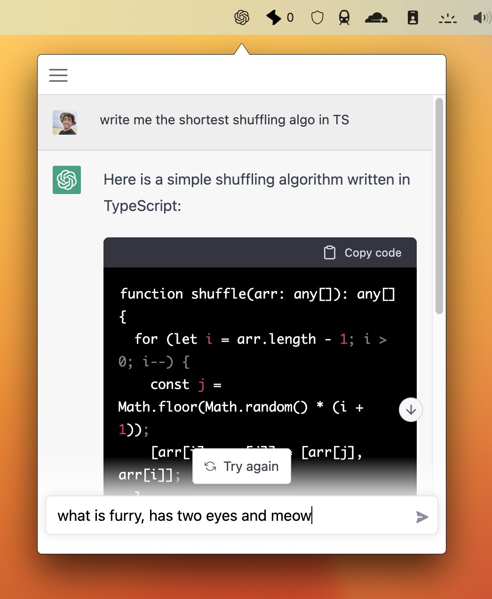

**Github（****⭐****️ 3.8k）：**[https://github.com/vincelwt/chatgpt-mac](https://github.com/vincelwt/chatgpt-mac)

### chatgpt-desktop
基于 tauri 和 rust 的非官方开源 ChatGPT 桌面应用，适用于 mac、windows 和 linux 菜单栏。

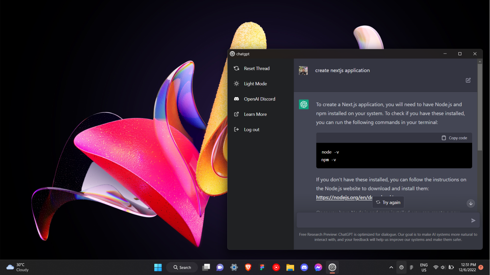

**Github（****⭐****️ 1.1k）：**[https://github.com/sonnylazuardi/chatgpt-desktop](https://github.com/sonnylazuardi/chatgpt-desktop)

## 其他
### ChatGPT API
一个非官方 ChatGPT API 的** Node.js 客户端**，主可以使用它来构建由 ChatGPT 支持的项目，例如聊天机器人、网站等。该项目主要使用 TypeScript 编写。

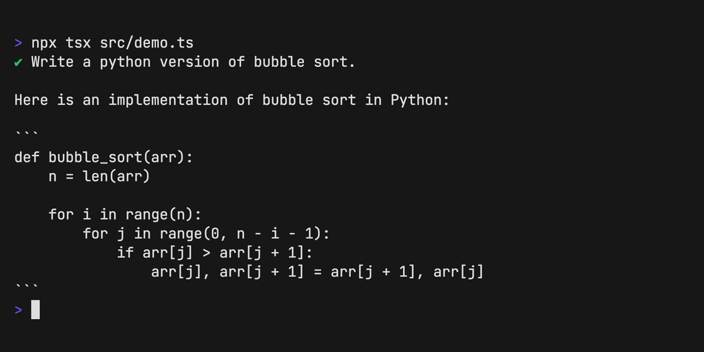

**Github（****⭐****️ 8.3k）：**[https://github.com/transitive-bullshit/chatgpt-api](https://github.com/transitive-bullshit/chatgpt-api)

### ChatGPT Export and Share
一个用于将 ChatGPT 历史下载为 PNG、PDF 或创建可共享链接的 Chrome 扩展。目前支持 Chrome、Edge、Firefox 浏览器。

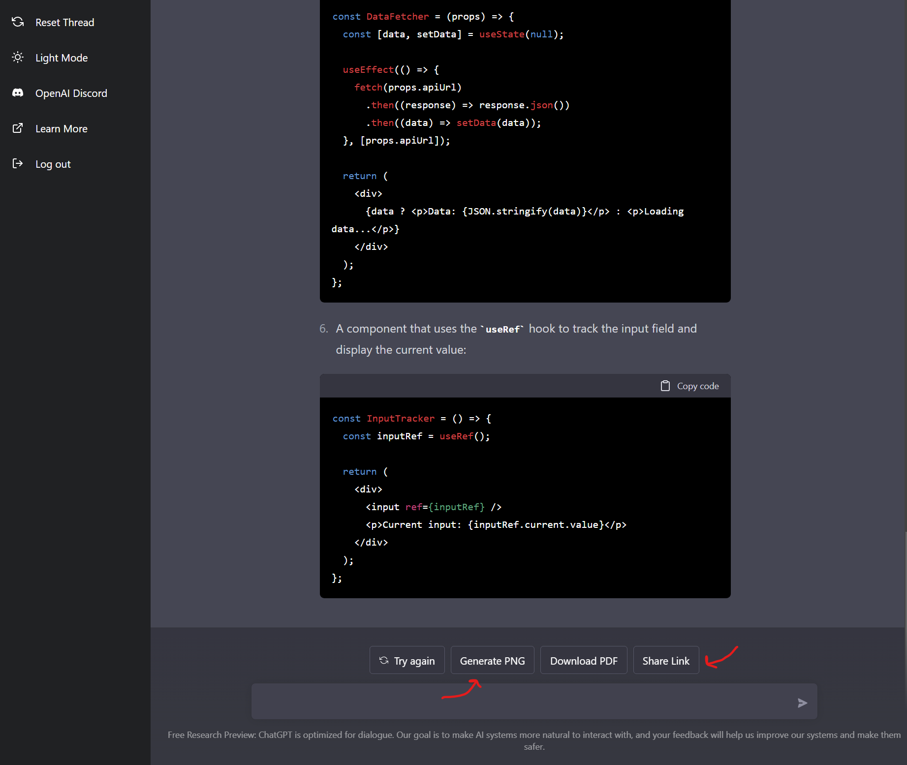

**Github（****⭐****️ 656）：**[https://github.com/liady/ChatGPT-pdf](https://github.com/liady/ChatGPT-pdf)

### Access-chatGPT-in-Siri
Siri 接入ChatGPT指南。目前仅限iPhone端及其他支持快捷指令的Apple产品，

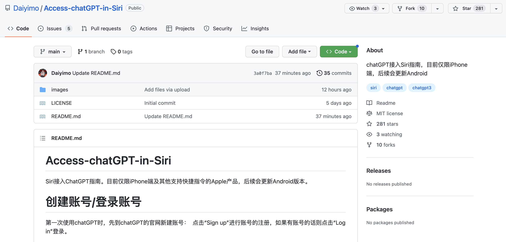

**Github（****⭐****️ 281）：**[https://github.com/Daiyimo/Access-chatGPT-in-Siri](https://github.com/Daiyimo/Access-chatGPT-in-Siri)

> 更新: 2023-02-19 23:26:12  
> 原文: <https://www.yuque.com/cuggz/feplus/xyzupq6vmco95msu>