# Chrome 扩展

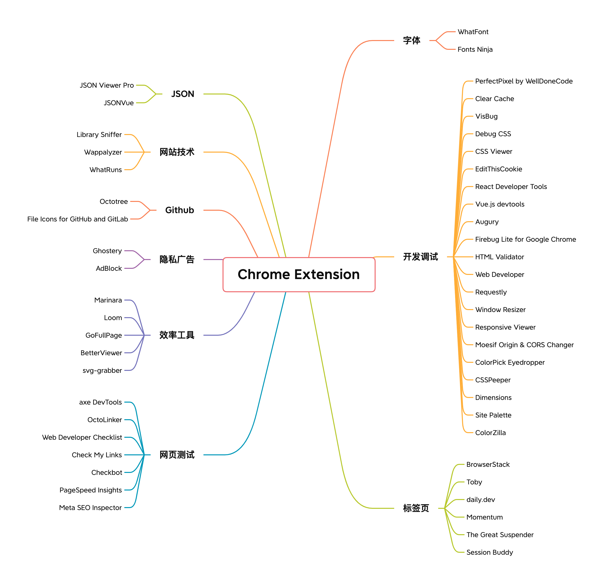

## JSON
### 1. JSON Viewer Pro
JSON Viewer Pro 用于可视化JSON文件。其核心功能包括：

+ 支持将JSON数据进行格式化，并使用属性或者图表进行展示；
+ 使用面包屑深入遍历 JSON 属性； 
+ 在输入区写入自定义 JSON； 
+ 导入本地 JSON 文件；
+ 使用上下文菜单下载 JSON 文件； 
+ 网址过滤器； 
+ 改变主题； 
+ 自定义 CSS ；
+ 复制属性和值；

输入界面如下：

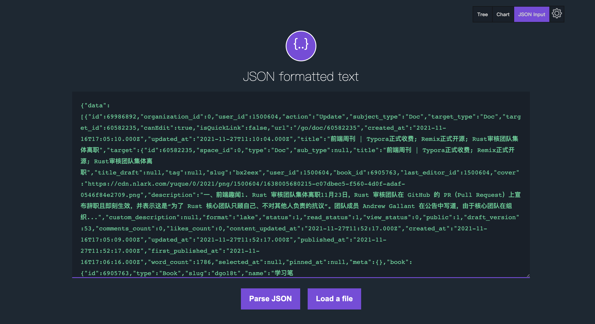

格式化之后：

### 2. JSONVue
JSONVue 是一个JSON数据查看器，主要用来格式化JSON数据：

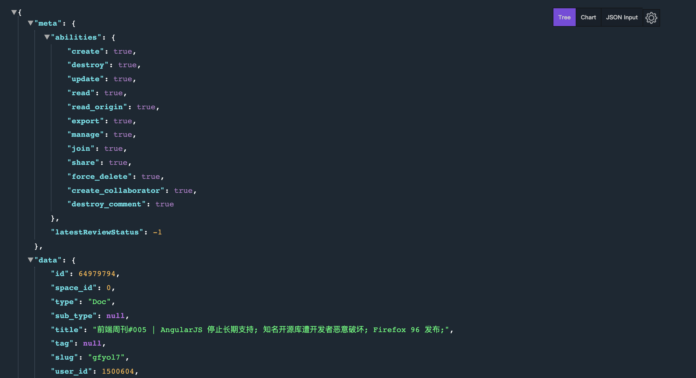

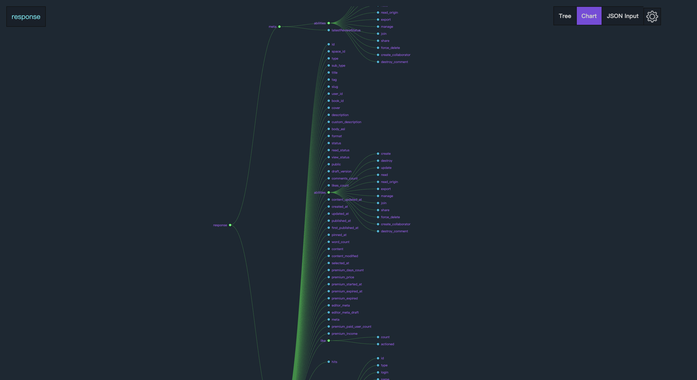

## 网站技术
### 3. Library Sniffer
Library Sniffer 是一款给开发者使用的工具，能够探测当前网页所使用的类库、框架和服务器环境，为开发者提供了方便。

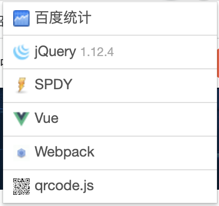

### 4. Wappalyzer
Wappalyzer 扩展可以用来识别网站背后的底层技术。通过此扩展，可以了解特定应用程序是否是用 React、Vue、Angular、PHP等编写的。还可以访问有关 Web 服务器、编程语言、框架、内容管理系统、分析的信息工具、数据库等。

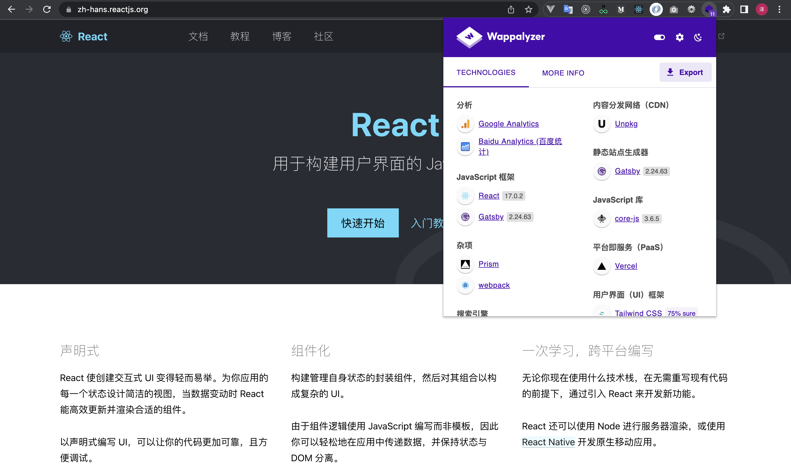

### 5. WhatRuns
WhatRuns 扩展程序只需单击一下即可找到任何网站上使用的技术。  
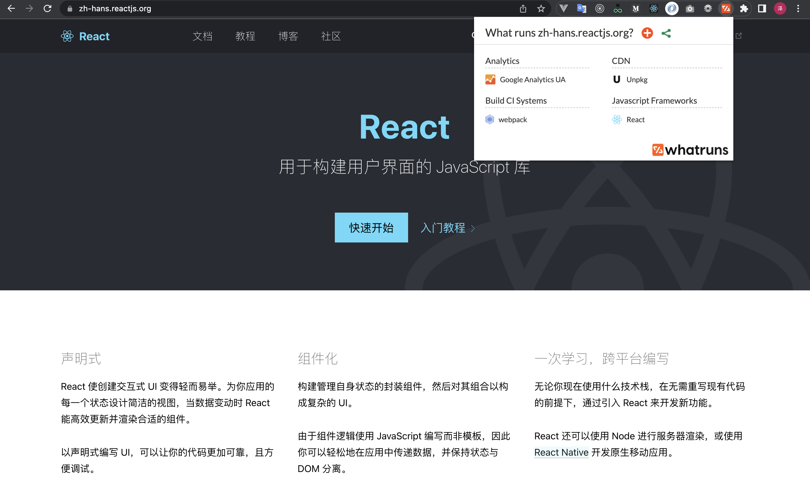

## 开发调试
### 6. PerfectPixel by WellDoneCode 
使用PerfectPixel插件可以将设计图加载至网页中，与已成型的网页进行重叠对比，以帮助开发和设计人员规范网页像素精度。这是一款可以优化前端页面显示的Chrome插件。

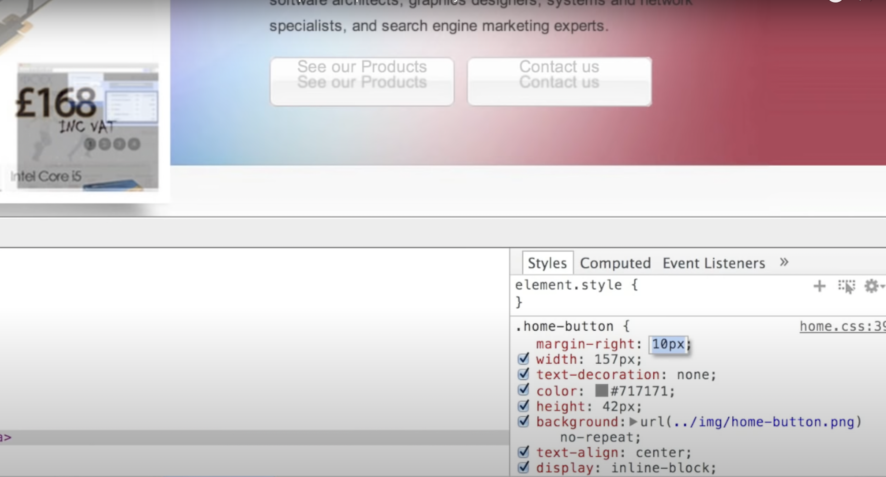

### 7. Clear Cache
可以使用此扩展程序快速清除缓存，无需任何确认对话框、弹出窗口等。可以在选项页面上自定义要清除的数据和数量，包括：应用程序缓存、缓存、Cookie、下载、文件系统、表单数据、历史记录、索引数据库、本地存储、插件数据、密码和 WebSQL。

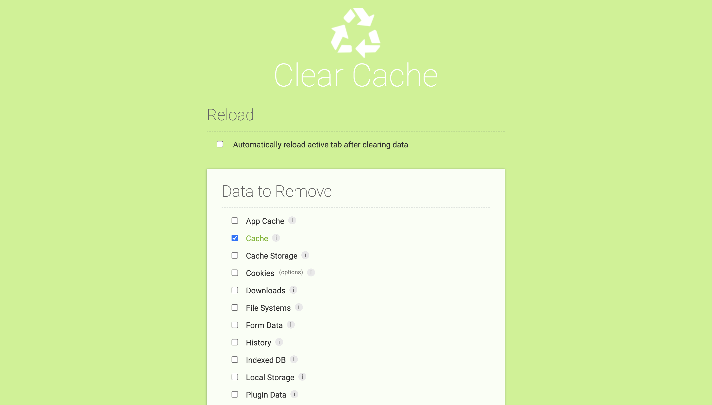

### 8. VisBug
VisBug 是一个使用 JavaScript 构建的开源网页设计调试工具，它可以让用户使用点击式和拖放式界面来查看网站的元素。

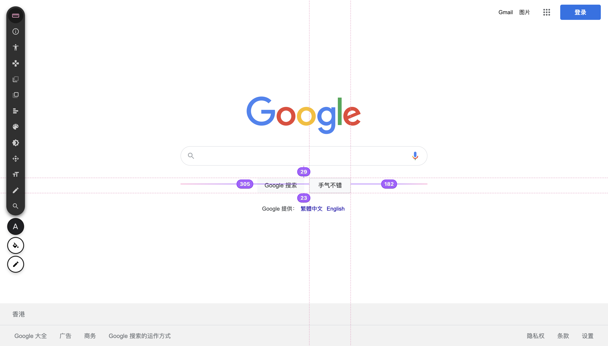

### 9. Debug CSS
Debug CSS 是一个帮助调试CSS的插件。他可以显示出页面元素的轮播，按住Ctrl，并将鼠标悬浮在元素上，即可查看其信息：

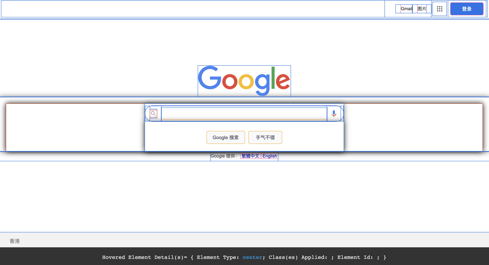

### 10. CSS Viewer
CSS Viewer 是一款适用于 Web 开发人员的高效 Chrome 扩展。顾名思义，CSS 查看器可以显示将鼠标悬停在任何网页上的元素的 CSS 属性。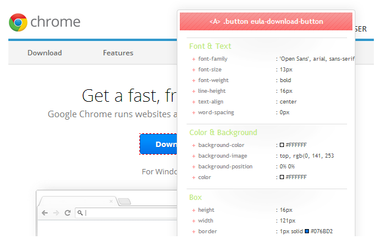

### 11. EditThisCookie
EditThisCookie 是一个 cookie 管理器。可以添加，删除，编辑，搜索，锁定和屏蔽cookies。

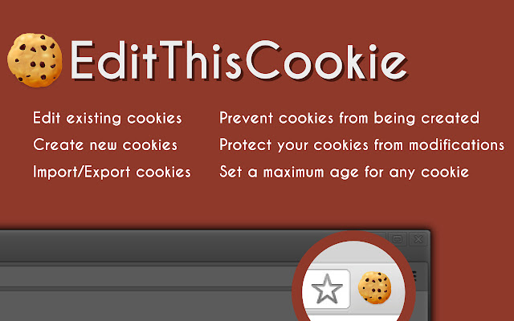

### 12. React Developer Tools
React Developer Tools 是开源 JavaScript 库 React 的 Chrome DevTools 扩展。它允许我们在 Chrome 开发者工具中检查 React 组件层次结构。安装此插件之后，将在 Chrome DevTools 中获得两个新选项卡："⚛️ Components" 和 "⚛️ Profiler"：

+ Components 选项卡显示了在页面上呈现的根 React 组件，以及它们最终呈现的子组件；
+ Profiler 选项卡用来记录性能信息。

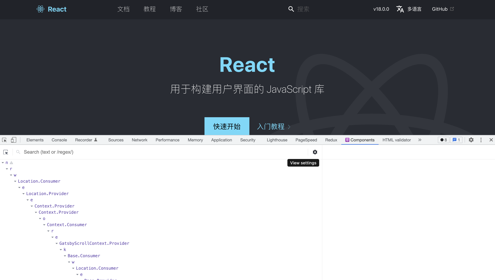

### 13. Vue.js devtools
Vue.js devtools 是一款基于chrome浏览器的用于调试Vue.js应用程序的插件，可以使得开发人员大大提高调试效率。支持用户对DOM结构数据结构进行解析和调试功能。

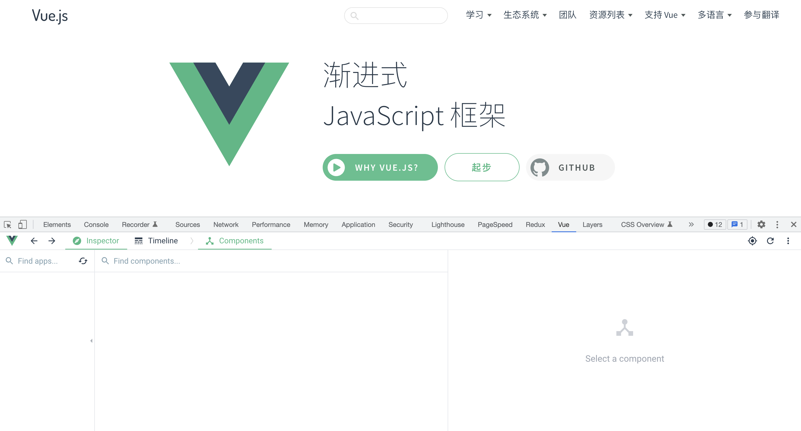

### 14. Augury
Augury 可以帮助开发人员在 Google Chrome 浏览器中调试和分析 Angular 应用程序。

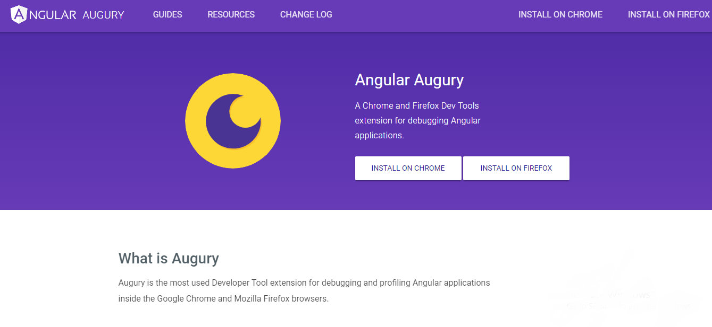

### 15. Firebug Lite for Google Chrome
Firebug Lite是火狐浏览器中著名的开发者工具firebug插件移植到Chrome中的插件，在Chrome中安装了Firebug Lite插件以后，开发人员可以像在火狐浏览器中使用firebug一样熟悉的方式来调试网页内容，其包含了基本的HTML、CSS以及Javascript的调试功能，用于帮助网页前端开发工程师快速地调试网页，以便及时地找到网页中的BUG并及时修复。

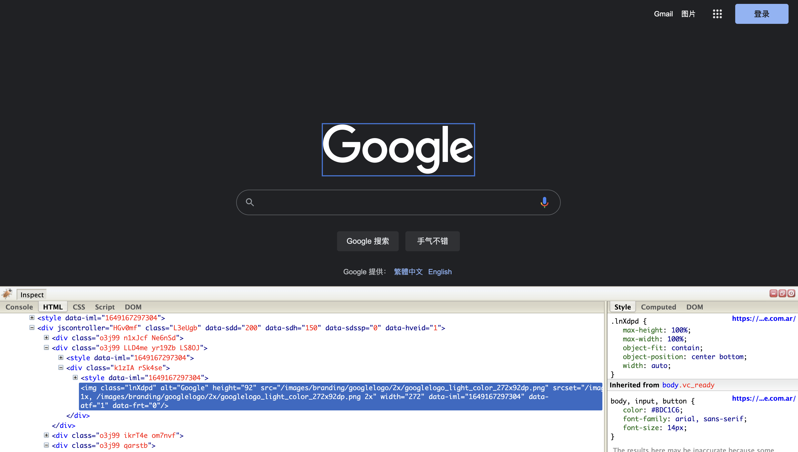

### 16. HTML Validator
HTML Validator 在 Chrome 的开发者工具中添加了 HTML Validator。HTML 页面的错误数通过浏览器状态栏中的图标显示，详细信息可以在浏览器的开发者工具中查看。

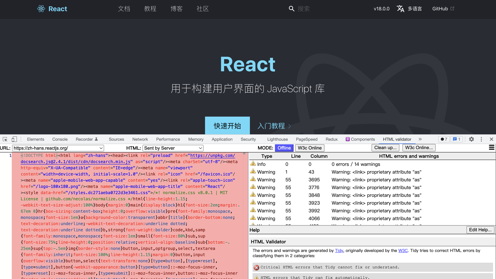

### 17. Web Developer
Web Developer 扩展为带有各种 Web 开发工具的浏览器添加了一个工具栏按钮。该扩展适用于 Chrome 和 Firefox，并且可以在这些浏览器支持的任何平台上运行，包括 Windows、macOS 和 Linux。

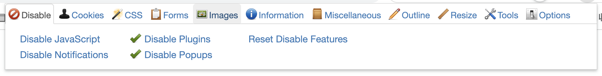

### 18. Requestly
Requestly 是一款Chrome和Firefox浏览器插件，提供URL转发、修改HTTP请求和结果、插入脚本等功能。

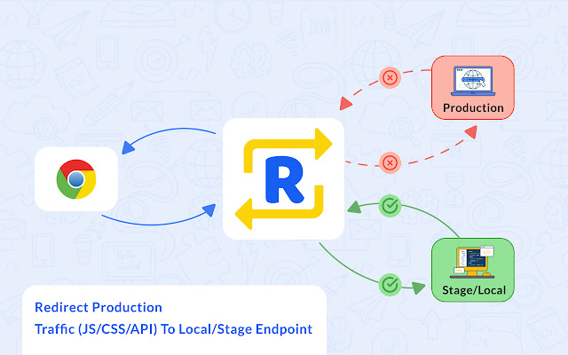

### 19. Window Resizer
Window Resizer 主要用来调整浏览器窗口的大小以模拟各种屏幕分辨率。

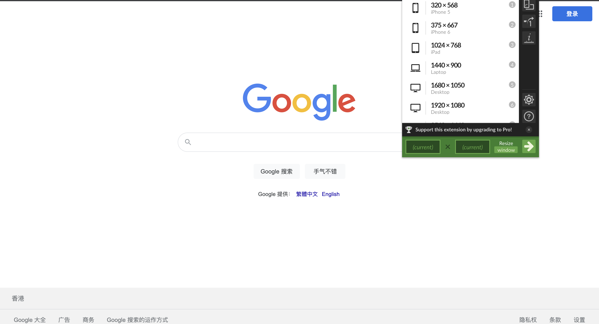

### 20. Responsive Viewer
Responsive Viewer 是在一个视图中显示多个屏幕的 Chrome 扩展程序。该扩展将帮助前端开发人员在开发响应式网站/应用程序时测试多个屏幕。

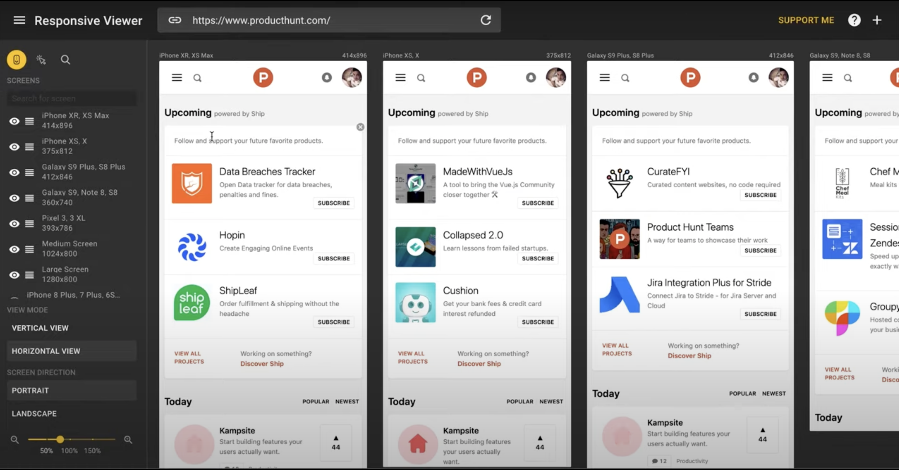

### 21. Moesif Origin & CORS Changer
此插件允许直接从浏览器发送跨域请求，而不会收到跨域错误。 可以使用此插件覆盖 Request Origin 标头，并将 Access-Control-Allow-Origin 设置为 *.   
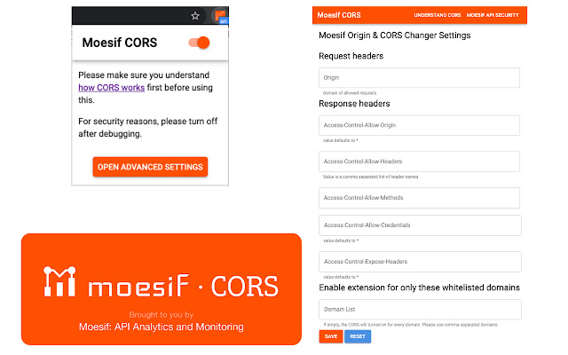

### 22. ColorPick Eyedropper
ColorPick Eyedropper 是一个放大的吸管和颜色选择器工具，可让从网页等中选择颜色值。

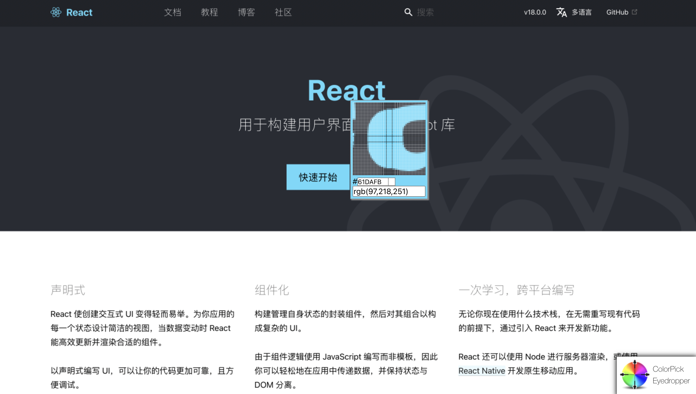

### 23. CSSPeeper
CSS Peeper 用于检查和复制元素样式的优秀工具，使用 CSSPeeper 可以将鼠标悬停在网页中的任何元素上，然后单击鼠标即可复制元素的样式。

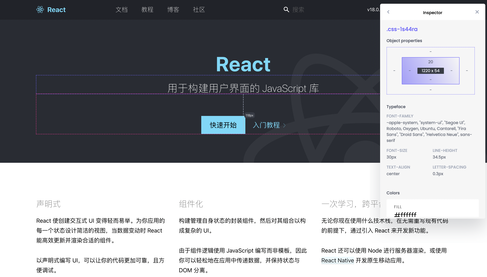

### 24. Dimensions
Dimensions是一款能帮助使用者对网页上各种元素属性之间的距离进行测量的Chrome页面元素测量插件，该插件在点击启动插件图标后，可以对页面中图像、输入字段、按钮以及视频等页面元素之间上下左右的方位尺寸进行测量，同时还可以通过使用快捷键来快速启用或关闭该插件的功能，简单实用。

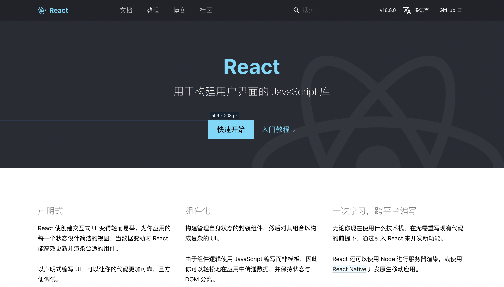

### 25. Site Palette
Site Palette 用于生成调色板。设计师和前端开发人员必备的工具。可以通过这款插件轻松获取网站的配色方案。

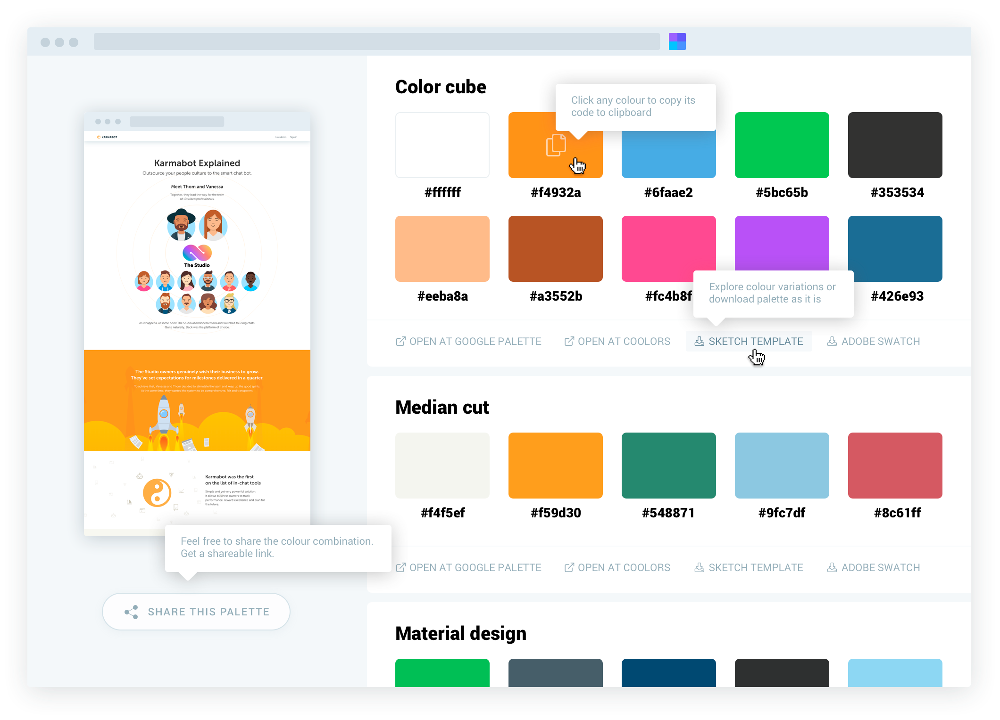

### 26. ColorZilla
ColorZilla 是一款功能强大的提取网页色彩的工具；也是个快速的对颜色进行调节的Chrome插件，许多的用户将这款软件称呼为颜色吸取插件，它提取的颜色是非常的多样化，还可生产css颜色的代码等。

+ 吸管器-获取页面上任何像素或区域的颜色；
+ 一个先进的颜色选择器类似于可以在Photoshop和Paint Shop Pro中找到的；
+ 网页颜色分析器-分析任何网页上的DOM元素颜色，找到相应的元素；
+ 终极CSS梯度发生器；
+ 调色板查看器与7预先安装调色板；
+ 颜色历史最近挑选的颜色；
+ 显示标签名称，类别，编号，大小等元素信息；
+ 光标下的轮廓元素；
+ 自动将生成或采样的颜色复制到CSS RGB，Hex和其他格式的剪贴板；
+ 使用键盘快速采样页面颜色的键盘快捷键。

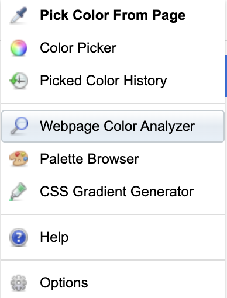

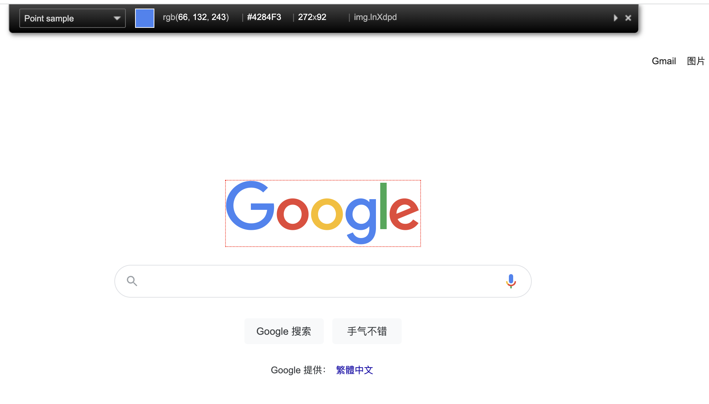

## 字体
### 27. WhatFont
当我们想查看网页中文字的字体时，最常用的方法就是在控制台查看文字的字体样式。那还有没有更简单的方法呢？WhatFont 就是一个款查看网页字体的Chrome扩展。只需要的点击扩展图标，再点需要查看为文字即可：

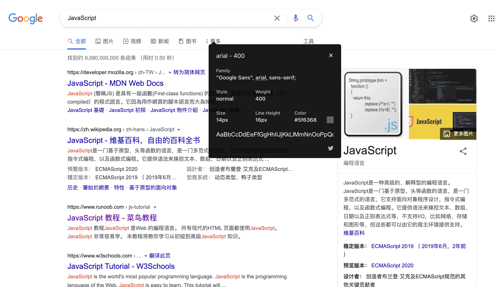

### 28. Fonts Ninja
Fonts Ninja 可以从任何网站识别字体、添加书签、试用并购买它们。

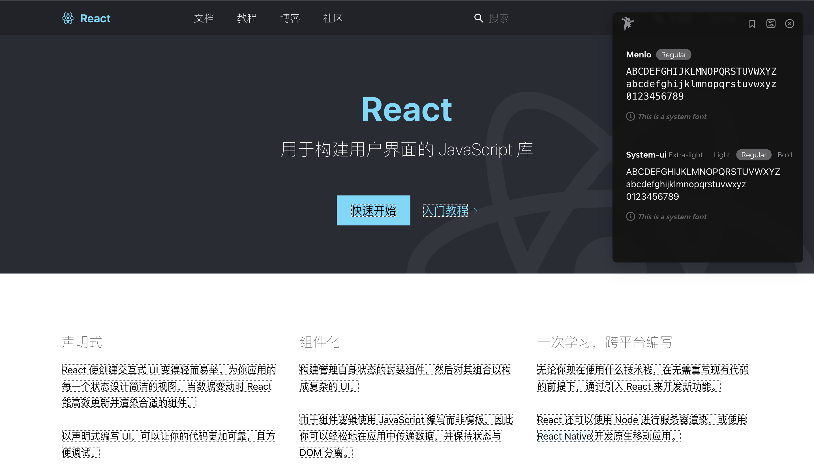

## 标签页
### 29. BrowserStack
使用 BrowserStack 快速启动扩展在任何浏览器中启动一个新的测试会话。最多可设置 12 个浏览器以实现快速访问并最大限度地减少切换浏览器所花费的时间。

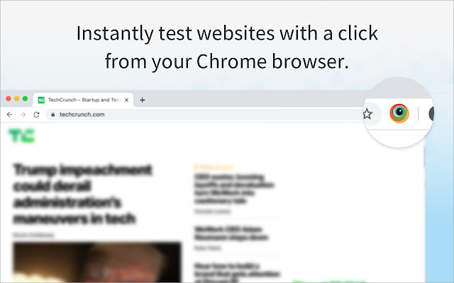

### 30. Toby
Toby 是一款 Chrome 新标签页工具，能够将未读的标签页分组显示在新标签页中，这样就能把所有未看完的标签页都关闭了。分组相当于多个 Chrome 窗口，将你的标签页都拖进 Toby 中，就不需要实时开着占地方了。

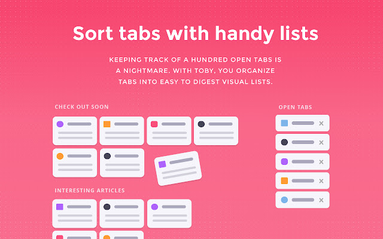

### 31. daily.dev
该扩展提供了每日热门开发者新闻，不需要再浪费时间搜索高质量的文章了。

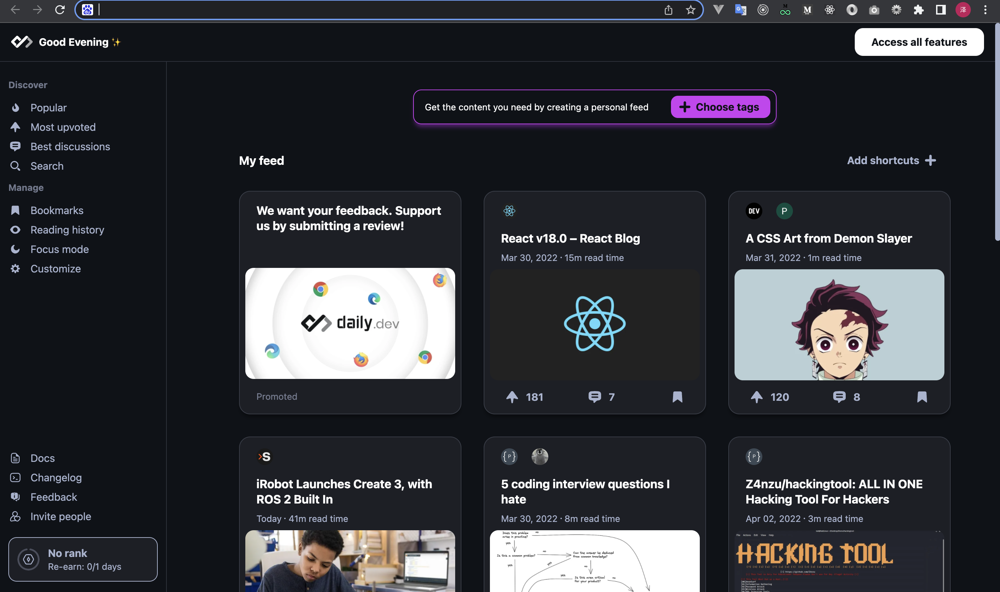

### 32. Momentum
Momentum 拥有漂亮的新标签页面，每日更新精彩背景壁纸图片，可设置每日新鲜事焦点以及跟踪待办事项，无广告，无弹窗。

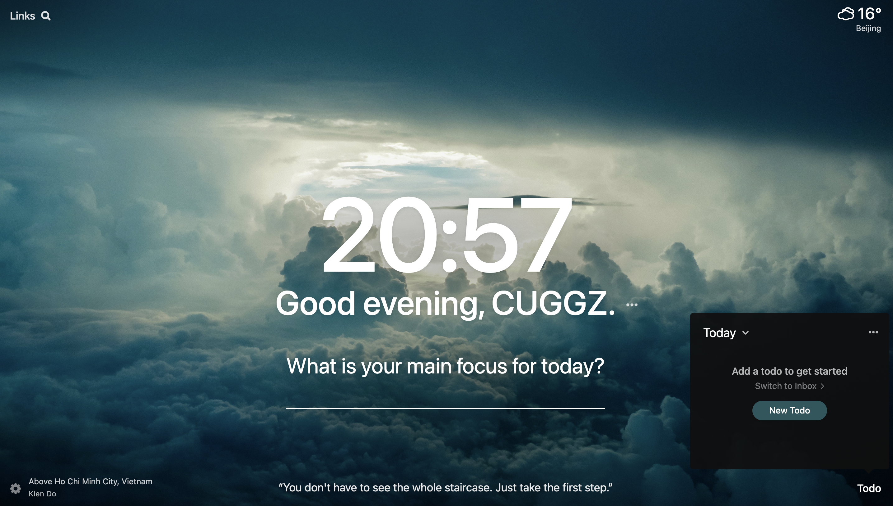

### 33. The Great Suspender
The Great Suspender 是一个轻量级的扩展用来减少 Chrome 的内存占用。如果同时打开许多选项卡，在可配置的时间之后未查看的选项卡将在后台自动挂起，从而释放该选项卡消耗的内存和 CPU。

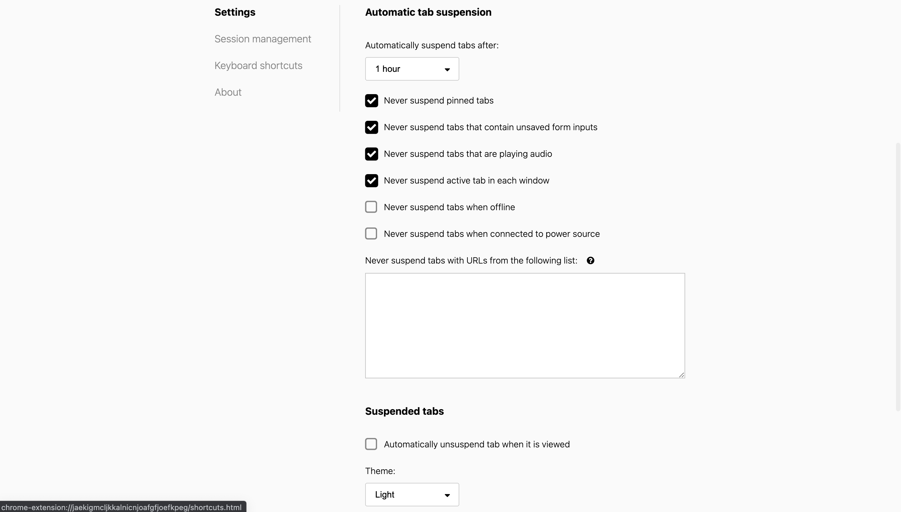

### 34. Session Buddy
Session Buddy是一个可以帮助用户查看、新增、编辑当前网站Session状态的Chrome插件。用户可以利用该插件保存网站当前的状态以便在关闭Chrome或关闭计算机后恢复，从而达到节省内存的作用。

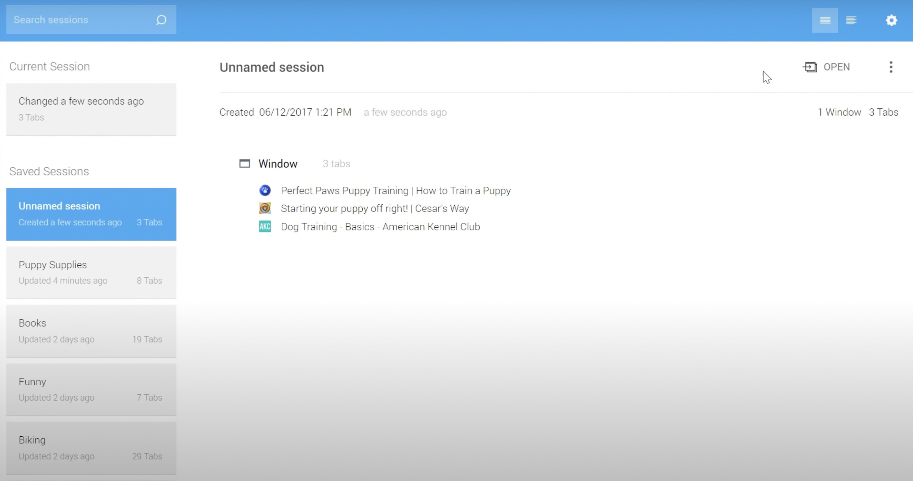

## Github
### 35. Octotree
Octotree 旨在让 GitHub 体验更好。通常，为了检查 Github 中的子文件夹，需要手动单击文件夹并导航。Octotree 扩展解决了这个问题。此扩展在项目的左侧显示存储库的目录结构，这有助于更好地理解文件夹结构。

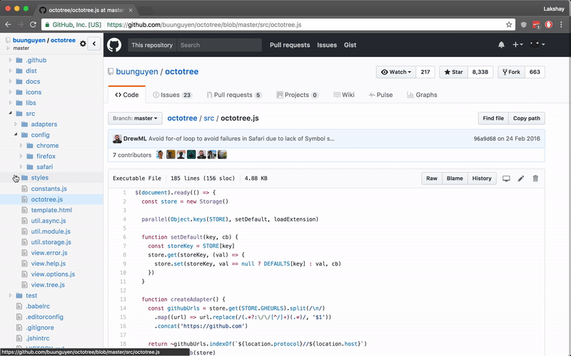

### 36. File Icons for GitHub and GitLab
File Icons for GitHub and GitLab 可以将 GitHub 和 GitLab 上的原始文件图标替换为特定文件类型的图标。

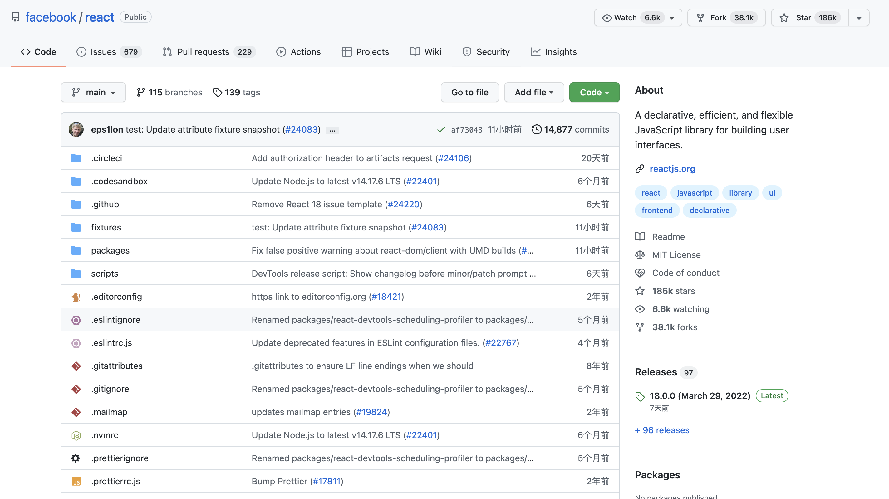

## 网页测试
### 37. axe DevTools
ax DevTools 是一个快速、轻量级但功能强大的测试工具，由 Deque 开发的世界上最值得信赖的可访问性测试引擎 axe-core 驱动。使用 ax DevTools 在网站开发过程中查找并修复更多可访问性问题。

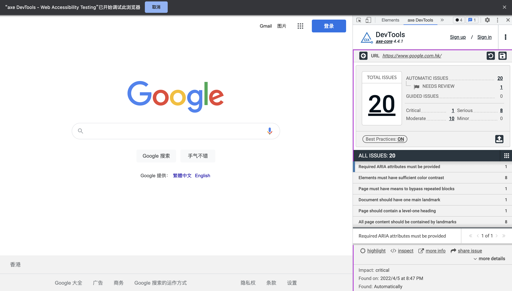  

### 38. OctoLinker
OctoLinker 可以将特定语言的语句（如 include、require 或 import）转换为链接。当打开一个包含多个导入语句的文件并且想要快速打开它时，只需将鼠标悬停在链接的文件上并单击即可打开。

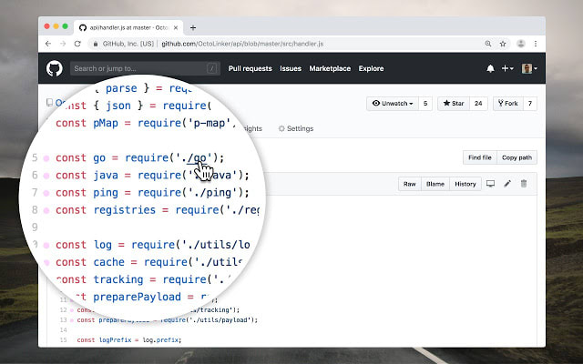

### 39. Web Developer Checklist
此扩展可帮助 Web 开发人员分析网页是否违反最佳实践。

### 40. Check My Links
Check My Links 是一个链接检查器，它可以抓取网页并查找损坏的链接。

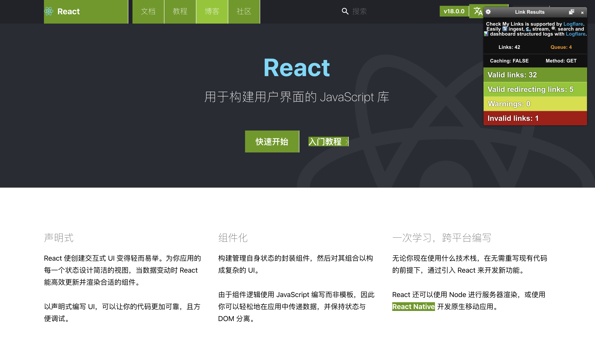

### 41. Checkbot
Checkbot 是用于验证一组HTML页面上的链接的工具。Checkbot可以检查一个或多个服务器上的单个文档或一组文档。它会创建一个报告，该报告汇总了引起某种警告或错误的所有链接。

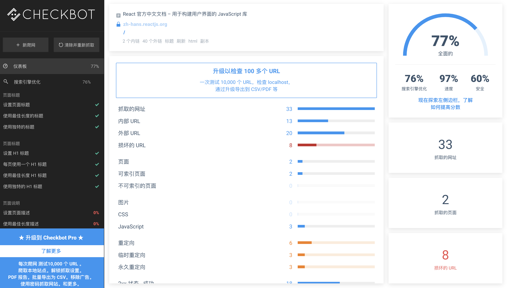

### 42. PageSpeed Insights
Google Page Speed Insighs 是一款旨在优化所有设备上的网页、提高网页加载速度的工具。

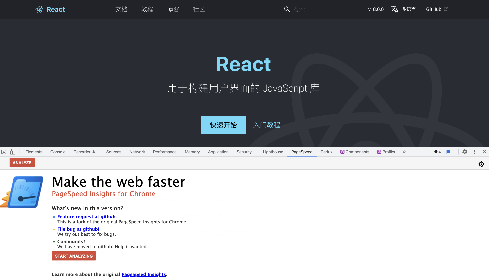

### 43. Meta SEO Inspector
META SEO inspector是一款可以帮助用户分析网页的meta信息并得到SEO评估的谷歌浏览器插件。

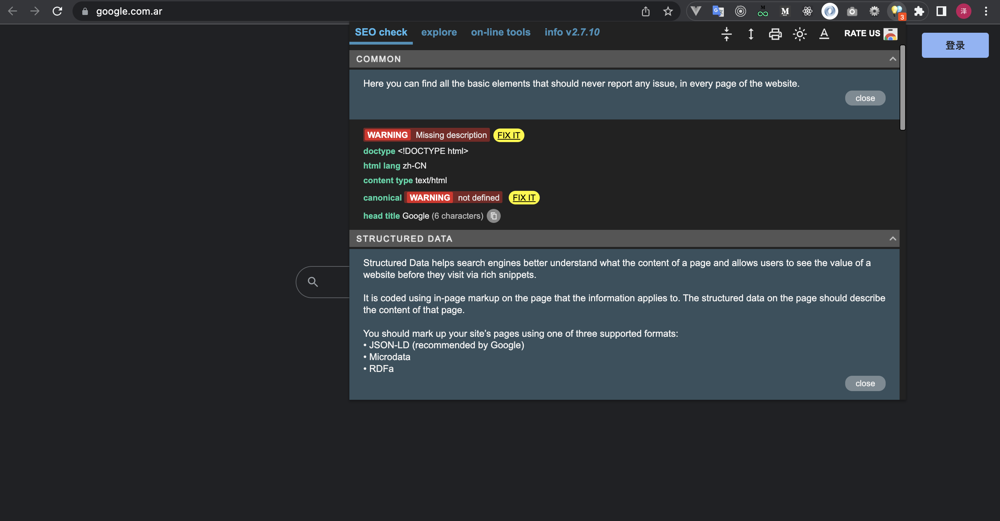

## 隐私广告
### 44. Ghostery
Ghostery 是强大的隐私保护扩展程序。其主要有以下功能：

+ 拦截广告：Ghostery 内置的广告拦截工具可以移除网页上的广告，防止网页杂乱无章，让你专注于想看的内容。
+ 保护隐私：利用 Ghostery 可以查看和拦截所浏览的网站上的跟踪器，控制收集数据的跟踪器。增强反跟踪功能还能将数据匿名化，进一步保护隐私。 
+ 提高浏览速度：Ghostery 的智能拦截功能可以自动拦截和取消拦截跟踪器来满足网页质量标准，提高网页加载速度，优化网页性能。

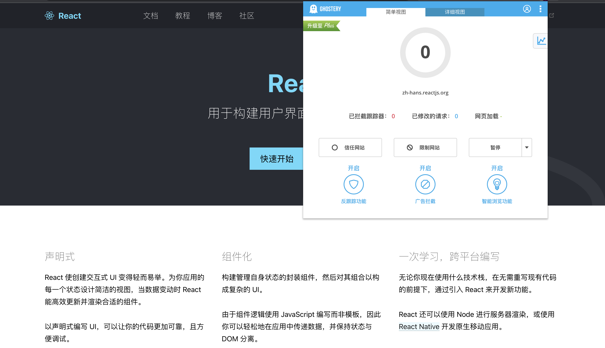

### 45. AdBlock
AdBlock 用来在YouTube、Facebook、Twitch和其他你喜爱的网站上拦截广告和弹窗。

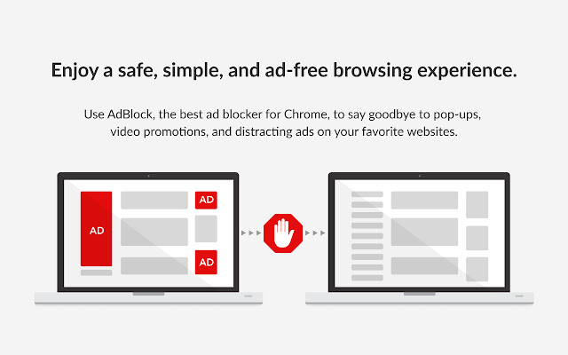

## 效率工具
### 46. Marinara
番茄工作法（Pomodoro®）时间管理助理。

• 长短两种休息时间 

• 带有倒计时显示的工具栏图标 

• 追踪Pomodoro历史和统计讯息 

• 可配置的长休间隔 

• 可配置的定时器时长

 • 桌面与新标签页通知 

• 超过20种音效可选的声音通知 

• 计时器秒针走动音效 

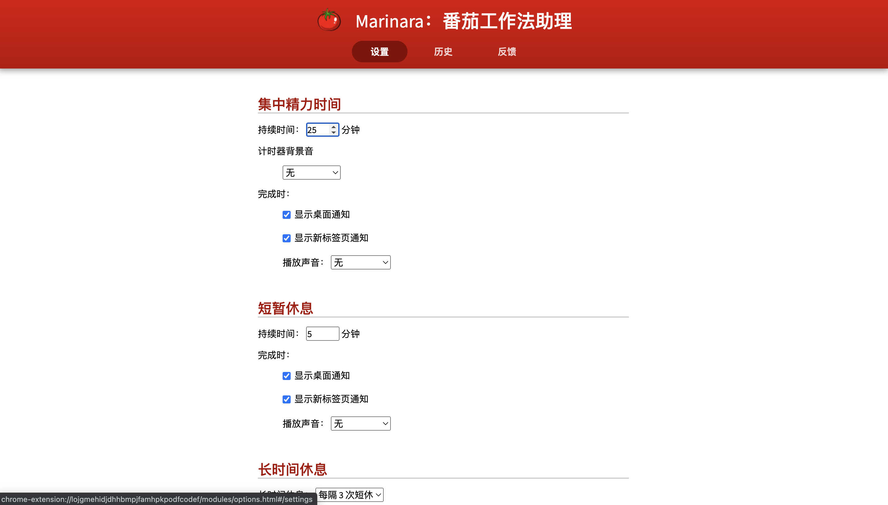

### 47. Loom
Loom 可以用来快速录制视频，并且能够将录制的视频上传到指定的网页中，Loom还支持在用户点击启动插件时，立即捕捉屏幕图像，同时开始视频录制操作，还可以将录制好的视频复制到粘贴板中存储。

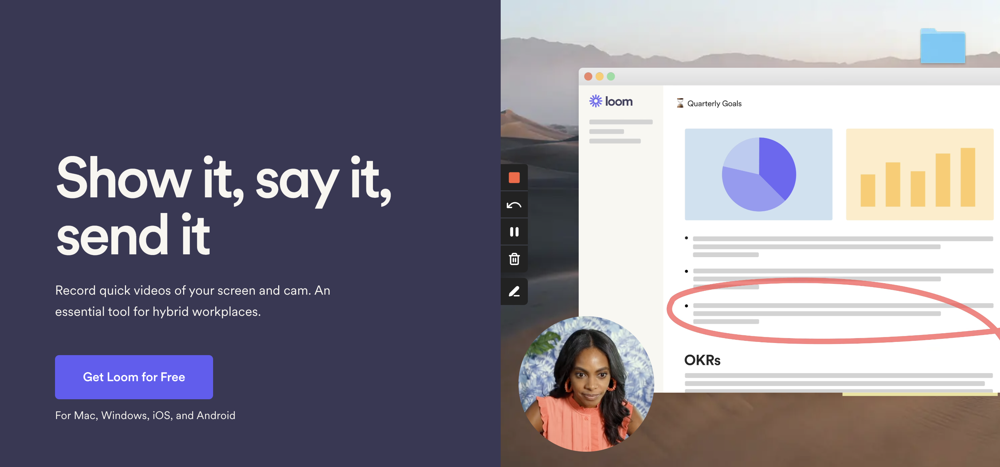

### 48. GoFullPage
GoFullPage 是一款全屏截图插件（整个网页截图），完整捕获您当前页面的屏幕，进行滚动截图，而无需任何额外的权限。单击扩展程序图标，然后将其传输到屏幕快照的新标签页中，可以在其中将其下载为图像或PDF，甚至只需拖动即可，保存到桌面。

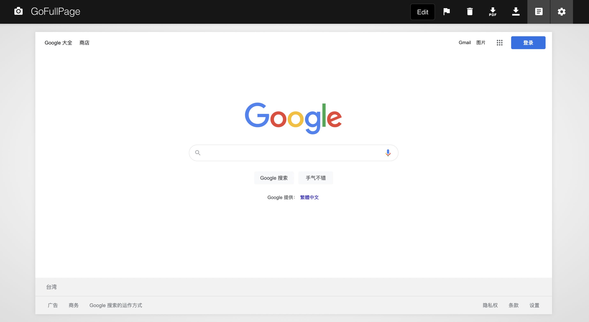

### 49. BetterViewer
BetterViewer 可以提供更好的图像查看体验，旨在替代基于 Chrome 浏览器中内置的图像查看模式。使用时，只需在页面右键点击图片，选择“**在新标签页中打开图片**”即可。

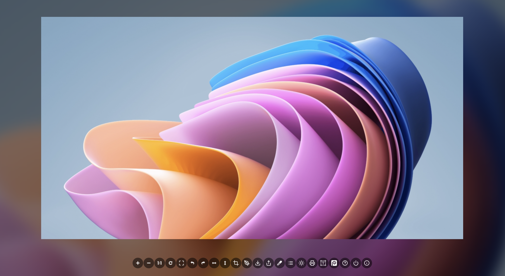

### 50. svg-grabber
svg-grabber 是一个快速预览并从网站获取所有 svg 的工具。可以用来预览、下载和复制网站中所有 SVG 图标和插图的代码。 

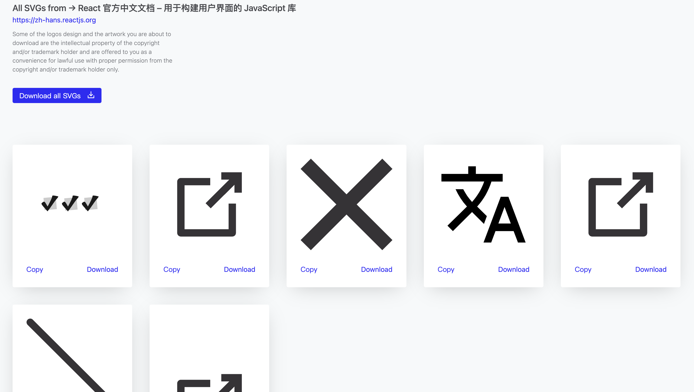

> 更新: 2022-04-08 01:19:17  
> 原文: <https://www.yuque.com/cuggz/feplus/vfzt99>