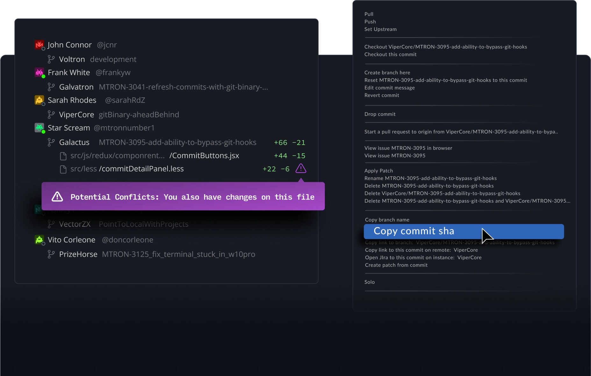
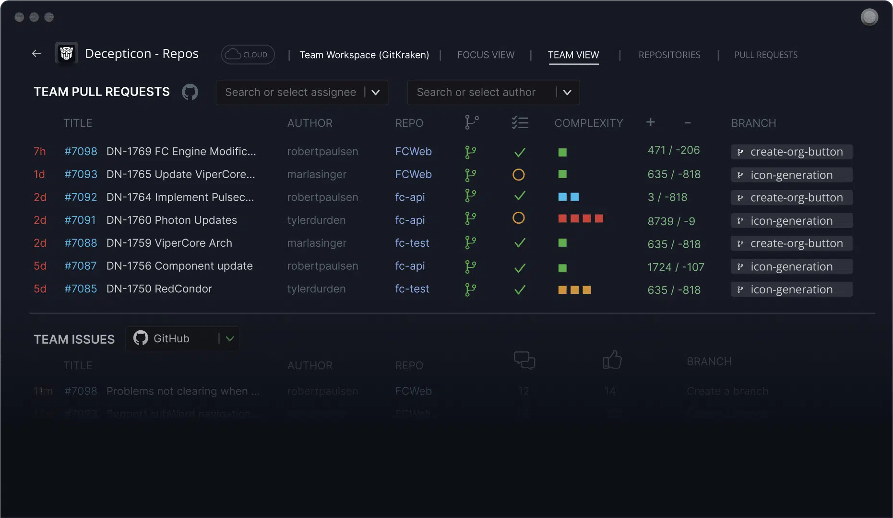
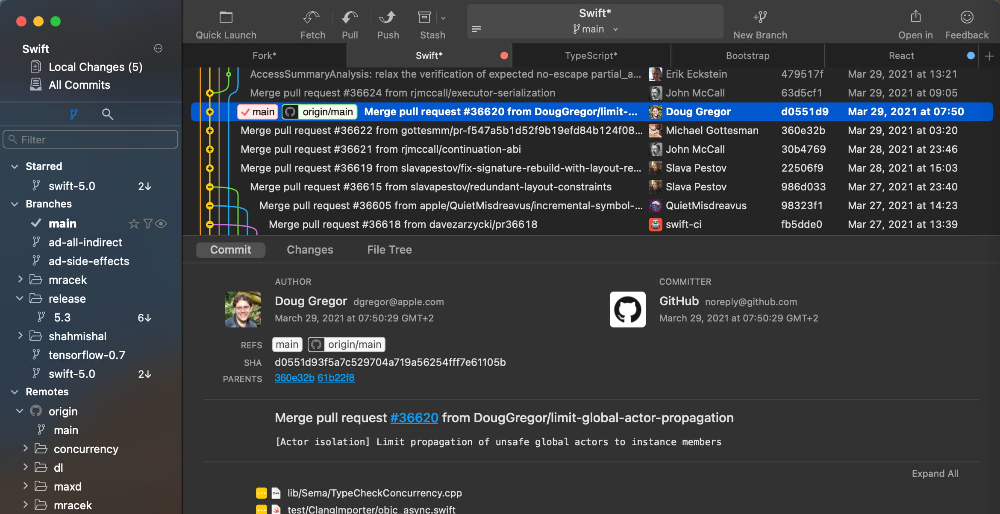
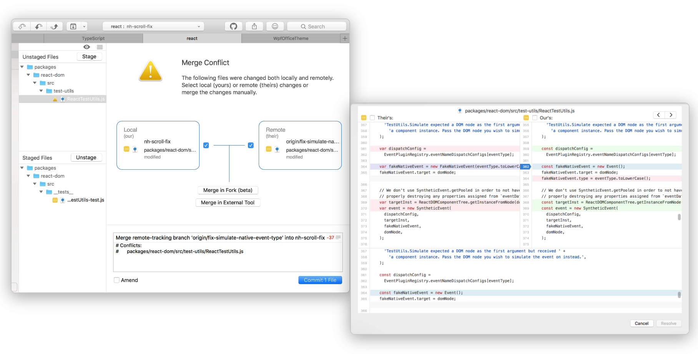
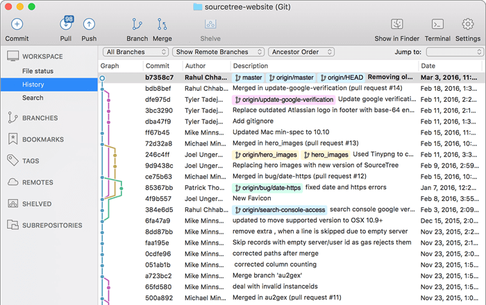
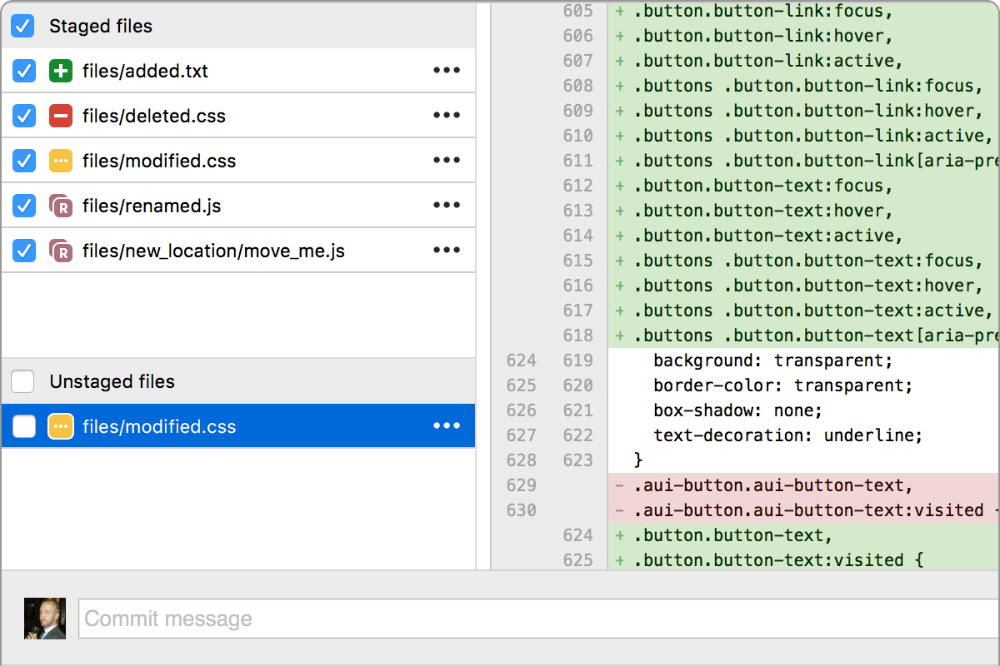
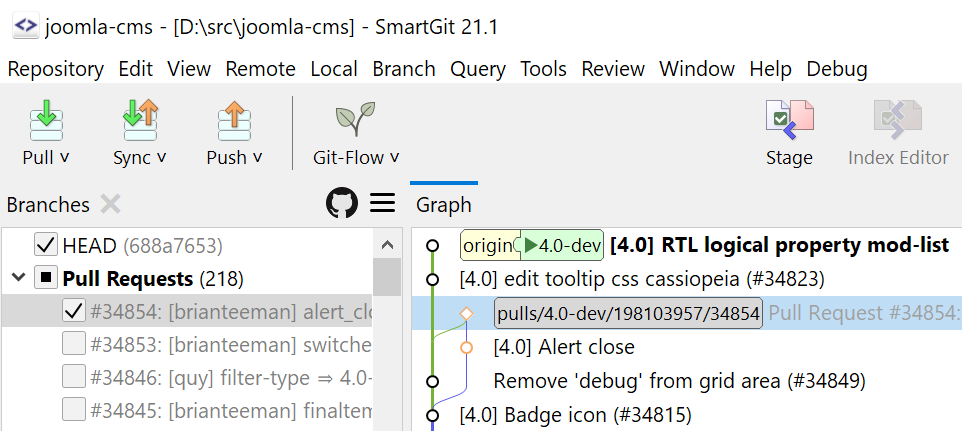
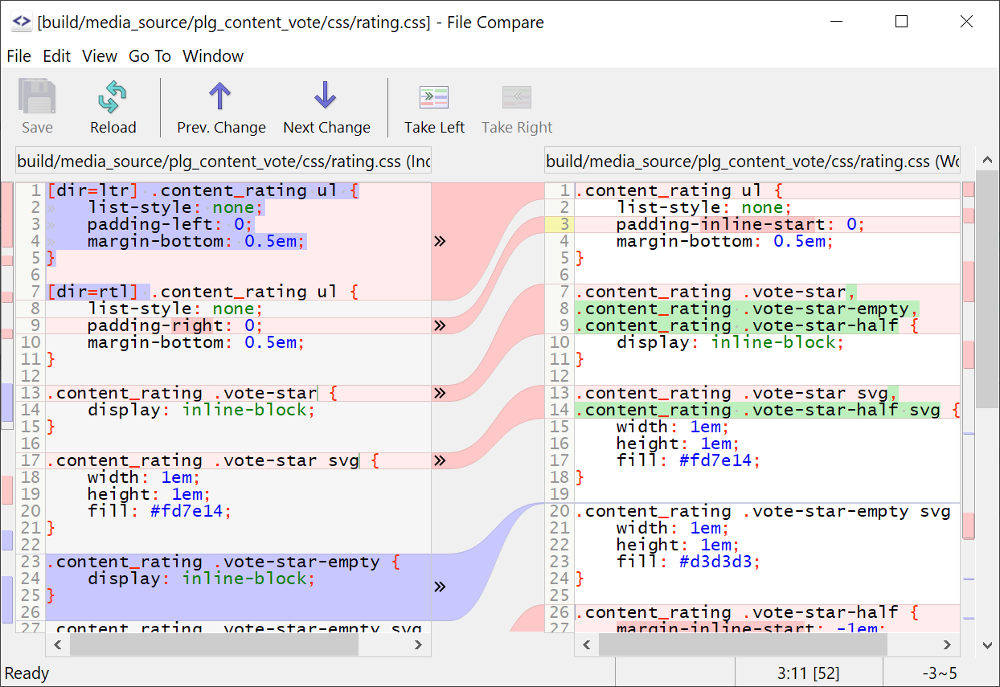
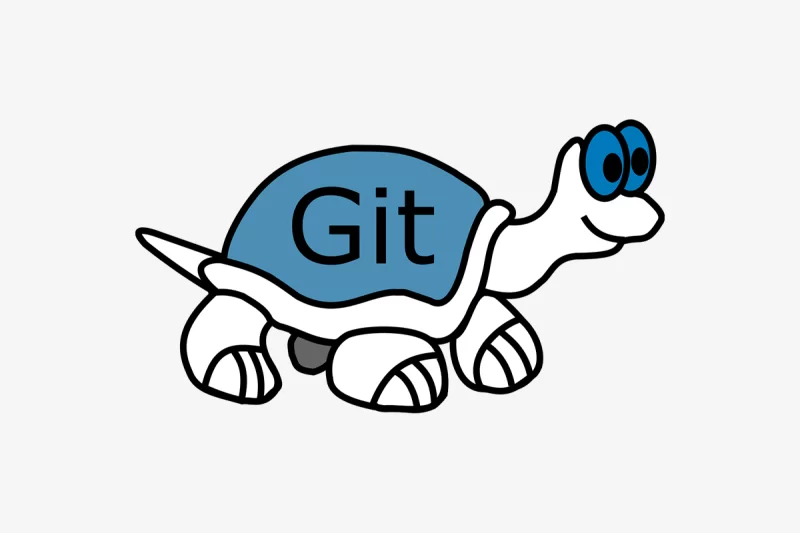
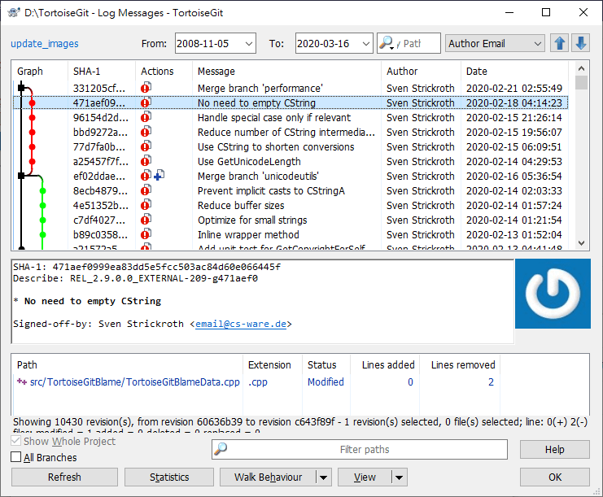

# Git可视化

Git，作为一款强大的分布式版本控制系统，为代码协作与版本追踪提供了坚实的基础。然而，对于不熟悉命令行操作的新手或寻求更直观体验的开发者来说，Git的可视化工具成为了不可或缺的得力助手。本文将分享五款超好用、高颜值的Git可视化工具。它们各具特色，但共同致力于让 Git 操作变得更加简单、高效，并且充满乐趣。让我们一同探索这些工具的魅力吧！

## Gitkraken
GitKraken 是一款专门用于管理和协作Git仓库的图形化界面工具。它拥有友好直观的界面，使得Git的操作变得更加简单易用，尤其适合那些不熟悉Git命令行的开发者。GitKraken提供了丰富的功能，如代码审查、分支管理、仓库克隆、提交、推送和拉取等。它还可以与 GitHub、Gitee 等代码托管平台无缝集成，方便用户进行代码托管和协作。

除了基本的Git操作外，GitKraken还提供了一些高级功能，如可视化分支图、实时代码差异对比、代码搜索等，帮助开发者更高效地管理和理解代码。它还支持多平台，包括Linux、Mac和Windows系统。

官网：[https://www.gitkraken.com](https://www.gitkraken.com)

## Fork
Fork 是一款实用的 Git 客户端，它提供了直观的用户界面和各种实用工具，旨在简化Git操作，让开发者更容易地管理他们的代码仓库。Fork客户端支持多仓库管理、分支切换、代码合并、冲突解决等功能，还提供了实时的代码差异对比、提交历史记录查看、分支可视化等特性。

此外，Fork客户端也支持任务列表管理、代码注释、代码搜索等，这些功能对于项目管理和团队协作非常实用。Fork 目前支持在 Windows 和 MacOS 上使用。

官网：[https://git-fork.com](https://git-fork.com)

## SourceTree
SourceTree 是一款免费的 Git 和 Hg 客户端管理工具，适用于 Windows 和 MacOS系统。它提供了一个直观、易用的图形界面，大大简化了与代码库之间的 Git 操作方式，对于不熟悉 Git 命令的开发者来说非常实用。

SourceTree 支持 Git 项目的创建、克隆、提交、push、pull 和合并等操作。通过它，用户可以轻松地管理多个仓库，切换分支，合并代码，解决冲突等。此外，SourceTree 还提供了实时的代码差异对比、提交历史记录查看、分支可视化等功能，帮助开发者更好地理解和跟踪代码的变化。

除了基本的 Git 操作外，SourceTree 还支持任务列表管理、代码注释、代码搜索等实用功能，方便开发者进行项目管理和团队协作。它还允许用户设置默认的项目存储位置，避免了每次都需要手动选择项目存放路径的麻烦。

官网：[https://www.sourcetreeapp.com](https://www.sourcetreeapp.com)

## SmartGit
SmartGit是一款免费的、专业的Git版本控制系统的图形化客户端。它适用于Windows、Mac和Linux等多种操作系统，并提供了丰富的功能和直观的用户界面，使得Git操作变得更加简单和高效。SmartGit支持创建、克隆、推送、拉取、合并和管理Git仓库。它还提供了强大的分支管理功能，包括创建、切换、合并和删除分支等。通过SmartGit，用户可以轻松地查看和管理仓库的提交历史、分支和标签。

此外，SmartGit还支持代码审查、实时语法高亮、代码搜索和比较等功能，帮助开发者更高效地编写和审查代码。它还支持多种语言，包括英语、中文、德语等，方便不同国家的用户使用。

官网：[https://www.syntevo.com/smartgit/](https://www.syntevo.com/smartgit/)

## TortoiseGit
TortoiseGit 是一个开源的 Git 客户端，也就是我们常说的“小乌龟”。它是 TortoiseSVN 的姊妹项目，专门为 Windows 平台设计。TortoiseGit 提供了一个图形化的用户界面，使得 Git 的操作更加直观和方便。

TortoiseGit 集成在 Windows 的资源管理器中，可以通过右键菜单来执行 Git 的各种操作，如提交、更新、查看日志等。

官网：[https://tortoisegit.org/](https://tortoisegit.org/)

> 更新: 2024-02-24 16:20:45  
> 原文: <https://www.yuque.com/cuggz/feplus/msz9pg891wmp8gkr>