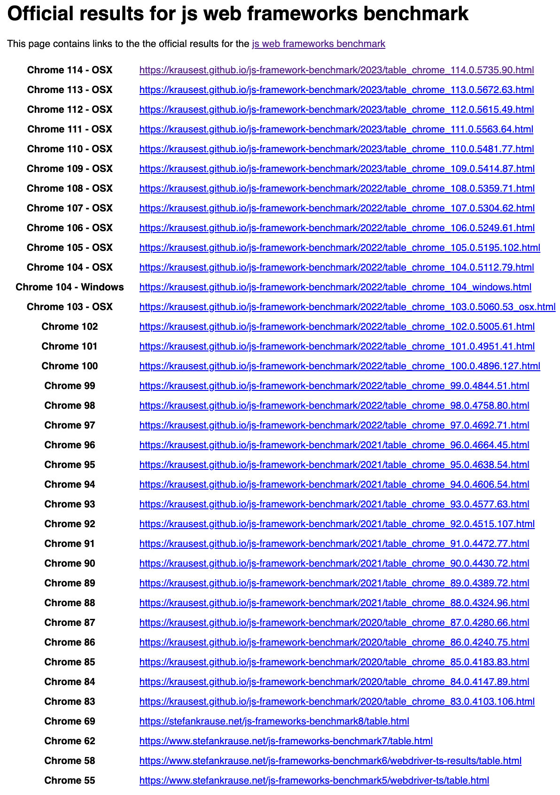
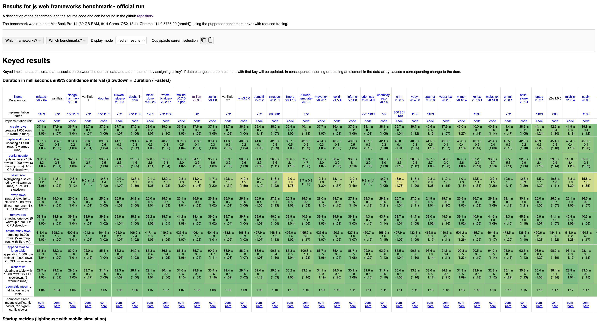
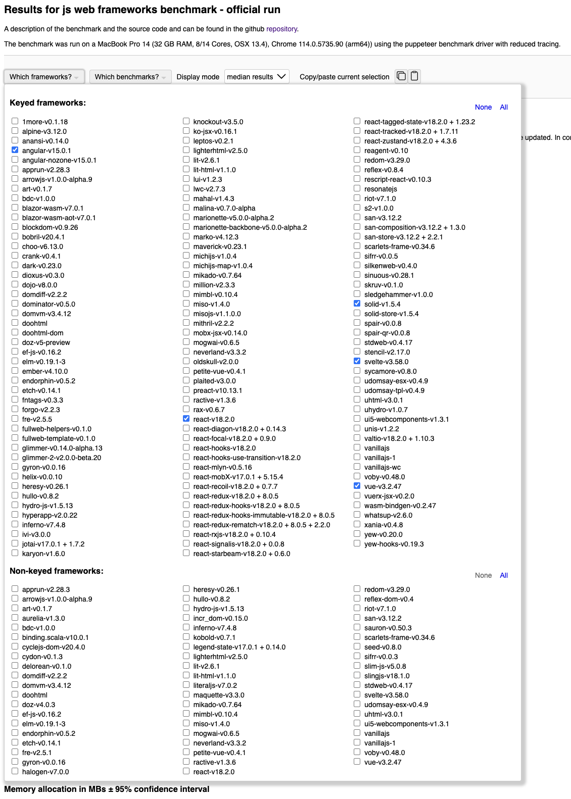
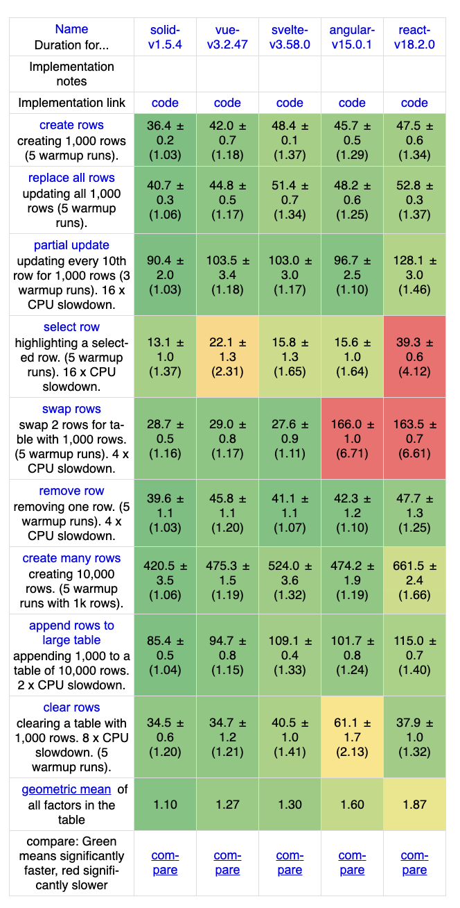
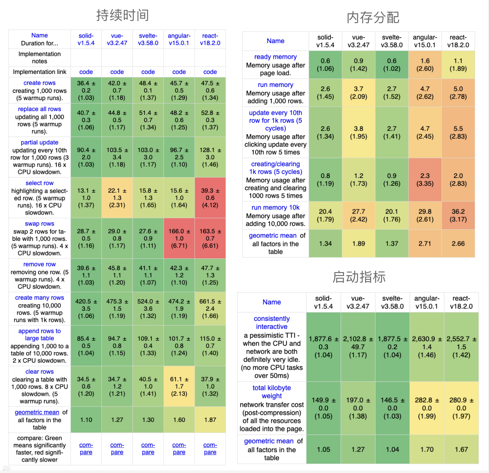
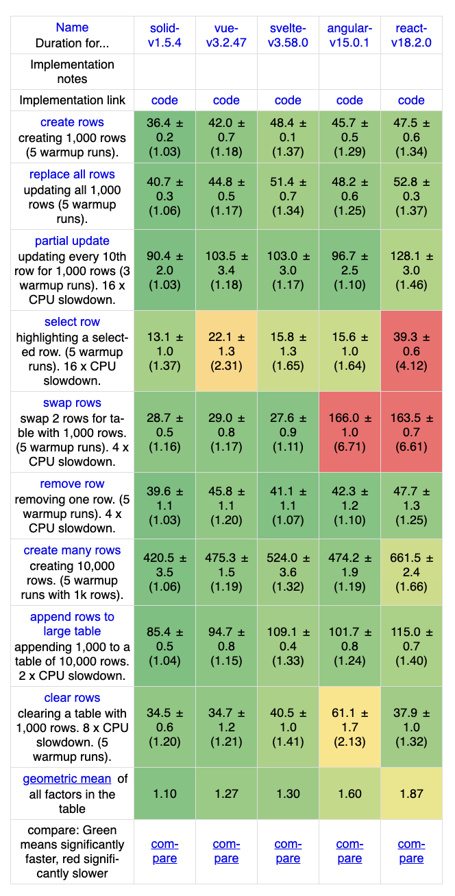
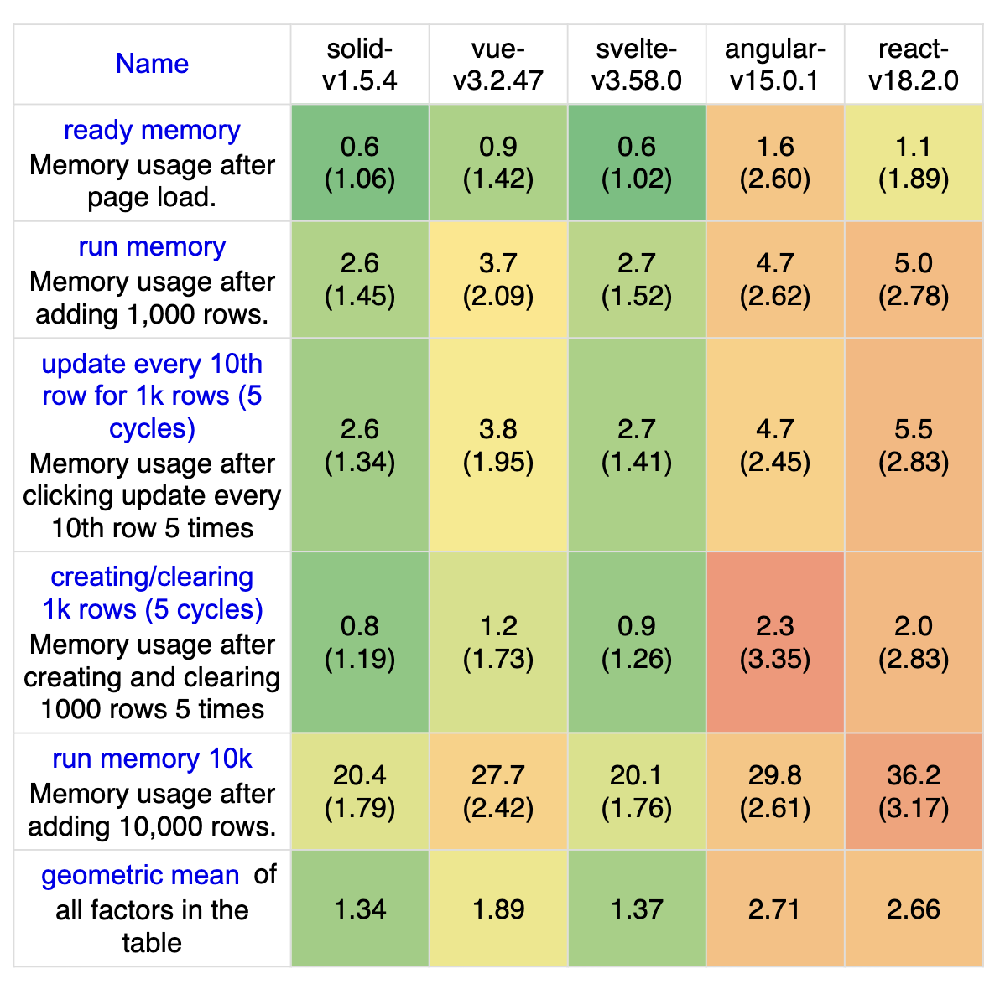
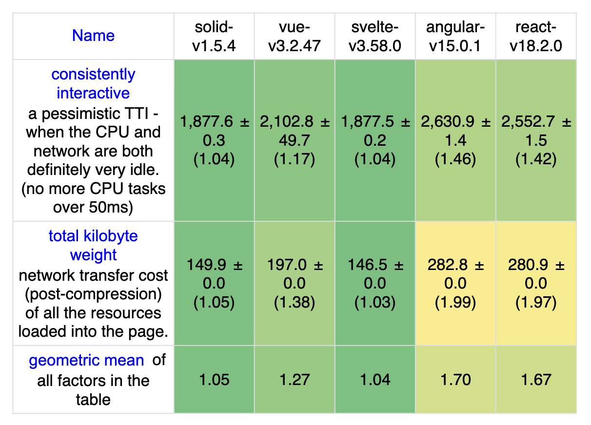
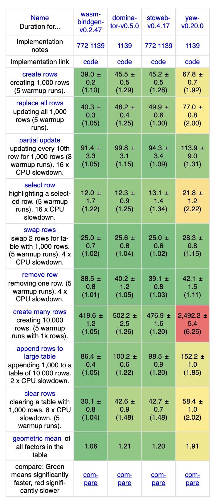

# JS框架性能基准工具

JavaScript 框架数量众多，那究竟哪个框架速度更快呢？今天就来分享一个开源的 JavaScript 框架性能基准工具：[**js-framework-benchmark**](https://github.com/krausest/js-framework-benchmark)，它是一个用于比较各种前端框架性能的基准测试工具，通过测量各种常见操作（例如列表渲染和更新、DOM 操作等）的执行时间、内存占用等来对比不同框架的性能。下面就来看看这个工具是怎么使用的！

进入官方测试结果的首页，可以看到不同浏览器版本的测试结果链接，从 Chrome 55 版本到最新的 114 版本，该页面会随着浏览器版本的更新而更新（更新有延迟）。

这里我们选择最新的版本进行查看：

这个页面最上方会有一些晒选项，包括**框架种类**、**基准种类**、**展示模式**。

### 框架**种类**
这里将 JavaScript 框架分为两类：

+ **基于 key 的实现**：通过分配 key 来创建数据和 DOM 元素之间的关联。如果数据发生变化，具有该 key 的 DOM 元素将更新。因此，在数据数组中插入或删除元素会导致相应地更改 DOM。
+ **非基于 key 的实现**：允许重用现有的 DOM 元素。因此，在数据数组中插入或删除元素可能会在最后一个表行后追加，或者删除该行，并更新插入或删除索引后的所有元素的内容。这样做可能性能更好，但是如果 DOM 状态在外部被修改可能会导致问题。

下面是 js-framework-benchmark 支持的 JavaScript 框架：

这里提供了全选和全不选按钮，并支持选择任意框架，选择完之后就可以查看结果了：

### **基准种类**
性能测试基准分为三类：

+ 持续时间
+ 启动指标
+ 内存分配

当选择完框架之后，就会展示三个表格，分别对应这三类指标。

可以看到，在所有的指标中， solid.js 的平均值都是最低的，性能最好。在最常用的三大前端框架（Vue、React、Angular）中，Vue 的性能最好，React 的性能最差。

#### （1）持续时间
+ **create rows**：创建行，页面加载后创建 1000 行的持续时间（无预热）
+ **replace all rows**：替换所有行，替换表中所有 1000 行所需的时间（5 次预热循环）。该指标最大的价值就是了解当页面上的大部分内容发生变化时库的执行方式。
+ **partial update**：部分更新，对于具有 10000 行的表，每 10 行更新一次文本（进行 5 次预热循环）。该指标是动画性能和深层嵌套数据结构开销等方面的最佳指标。
+ **select row**：选择行，在单击行时高亮显示该行所需的时间（进行 5 次预热循环）。
+ **swap rows**：交换行，在包含 1000 行的表中交换 2 行的时间（进行 5 次预热迭代）。
+ **remove row**：删除行，在包含 1,000 行的表格上移除一行所需的时间（有 5 次预热迭代），该指标可能变化最少，因为它比库的任何开销更多地测试浏览器布局变化（因为所有行向上移动）。
+ **create many rows**：创建多行，创建 10000 行所需的时间（没有预热），该指标更容易受到内存开销的影响，并且对于效率较低的库来说，扩展性会更差。
+ **append rows to large table**：追加行到大型表格，在包含 10000 行的表格上添加 1000 行所需的时间（没有预热）。
+ **clear rows**：清空行，清空包含 10000 行的表格所需的时间（没有预热），该指标说明了库清理代码的成本，内存使用对这个指标的影响很大，因为浏览器需要更多的 GC。

#### （2）内存分配
+ **ready memory**：页面加载后的内存使用量。页面上只有几个按钮，因此这个内存数字较低，大多数库在这里表现相似。
+ **run memory**：添加1000行后的内存使用情况。
+ **Update every 10th row**：与性能测试 3 相同，但这次我们看到了执行部分更新的内存开销。大多数情况下，这是新字符串值的分配，但第一次看到库动态比较机制的内存开销。
+ **Replace Rows**：这将 1000 行替换 5 次。这是检测内存泄漏的一个很好的测试。
+ **Create/Clear Rows**：创建然后清除 1000 行。 

#### （3）启动指标
+ **Consistently Interactive**：持续交互，一个悲观的TTI，等待CPU空闲50ms。 除非库很大，否则这里的分数分布不会那么大，而且主要随着包大小而扩展，但似乎没有受到影响的 WASM 库除外（Blazor 除外）。
+ **Total Kilobyte Weight**：总 KB 大小，这衡量了所有资源的总大小，包括用户代码、HTML 和 CSS。这很有用，因为它显示了实际构建大小与包大小之间的差别。

### 其他框架
该工具除了支持对 JavaScript 框架进行性能基准测试之外，还支持对 Rust 实现的 WebAssembly 库和框架进行测试，如 wasm-bindgen、stdweb、yew、seed 等。

### 小结
js-framework-benchmark 的测试结果是相对准确的，因为它是针对同样的测试样本和基准测试情境进行比较，可以提供框架之间的相对性能比较。然而，需要注意的是，这个测试结果也只是反映了测试条件下的性能表现。

此外，js-framework-benchmark 测试结果也不应该成为选择框架的唯一指标。在选择框架时，还需要考虑框架的生态、开发效率、易用性等多方面因素，而不仅仅是性能表现。

相关链接：

+ **官网**：[https://krausest.github.io/js-framework-benchmark/](https://krausest.github.io/js-framework-benchmark/)
+ **Github**：[https://github.com/krausest/js-framework-benchmark](https://github.com/krausest/js-framework-benchmark)

> 更新: 2023-07-17 16:08:17  
> 原文: <https://www.yuque.com/cuggz/feplus/smuapbb22hro920z>